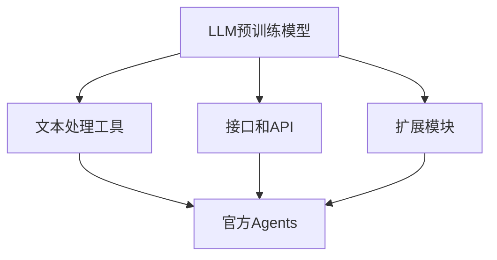

                 

### 文章标题

LLM函数库：官方Agents的重要性

> **关键词：** LLM函数库，自然语言处理，Agent架构，人工智能应用，自动化系统，功能实现，性能优化

> **摘要：** 本文将深入探讨LLM（大型语言模型）函数库的核心概念，特别是官方Agents在其中的关键作用。我们将分析LLM函数库的基本原理、设计架构，并详细解释其核心算法。随后，将通过实际项目实例，展示如何在开发环境中使用LLM函数库，包括代码实现、解读与分析，以及运行结果展示。文章还将探讨LLM函数库在实际应用场景中的价值，并提供相关工具和资源的推荐。最后，我们将总结LLM函数库的发展趋势与挑战，为未来研究提供方向。

### 1. 背景介绍

近年来，随着自然语言处理（NLP）技术的迅猛发展，大型语言模型（LLM）逐渐成为人工智能领域的明星。LLM函数库作为一种强大的工具，为开发者提供了高效便捷的自然语言处理能力。然而，在LLM函数库中，官方Agents的重要性尤为突出。

**自然语言处理（NLP）** 是人工智能的一个分支，旨在让计算机理解和生成人类语言。NLP技术广泛应用于机器翻译、情感分析、问答系统、文本摘要等领域。随着数据的爆炸性增长和计算能力的提升，LLM成为了NLP领域的关键技术。

**官方Agents**，又称智能代理，是指一种基于LLM的自动化系统，能够执行特定任务并与其他系统交互。在LLM函数库中，官方Agents不仅提供了丰富的功能接口，还具备高度的可定制性和扩展性。

本篇文章将围绕LLM函数库的核心概念展开，详细探讨官方Agents在其中的重要性。我们将首先介绍LLM函数库的基本原理和设计架构，然后深入解析其核心算法，并通过实际项目实例展示其功能实现和性能优化。此外，文章还将探讨LLM函数库在实际应用场景中的价值，并推荐相关工具和资源。最后，我们将总结LLM函数库的发展趋势与挑战，为未来研究提供方向。

### 2. 核心概念与联系

#### 2.1. 大型语言模型（LLM）

大型语言模型（LLM）是一种基于深度学习的自然语言处理模型，通过在海量文本数据上进行训练，学习到了丰富的语言结构和语义信息。LLM的核心特点是其规模巨大，通常包含数亿甚至数千亿个参数。这种规模使得LLM在处理自然语言时具有高度的准确性和鲁棒性。

#### 2.2. 官方Agents

官方Agents是基于LLM的自动化系统，旨在实现特定任务或目标的执行。与传统的规则驱动系统不同，官方Agents具有更高的灵活性和自适应能力。通过LLM提供的强大语言处理能力，官方Agents能够理解自然语言输入，并生成合适的响应或执行相应操作。

#### 2.3. LLM函数库

LLM函数库是一个集合，它包含了多种预训练的LLM模型和相关的工具。这些函数库为开发者提供了简便的方式，可以轻松地在各种应用场景中利用LLM的强大功能。LLM函数库通常包括以下核心组件：

- **预训练模型**：如GPT、BERT、T5等。
- **文本处理工具**：如分词、词嵌入、文本生成等。
- **接口和API**：方便开发者调用LLM模型和工具。
- **扩展模块**：如自定义任务、多语言支持等。

#### 2.4. Mermaid 流程图

以下是一个简单的Mermaid流程图，展示了LLM函数库与官方Agents之间的联系：



在这个流程图中，LLM预训练模型通过文本处理工具将自然语言输入转化为适合模型处理的格式。接口和API提供了与外部系统交互的渠道，而扩展模块则增强了LLM函数库的功能。最终，这些组件共同构成了官方Agents，实现自动化任务的执行。

### 3. 核心算法原理 & 具体操作步骤

#### 3.1. 深度学习基础

深度学习是LLM函数库的核心技术。深度学习通过多层神经网络（DNN）模型，对输入数据进行特征提取和分类。在LLM中，这些网络结构被进一步扩展，以处理复杂的自然语言数据。

**反向传播算法（Backpropagation）** 是深度学习训练的核心。通过反向传播算法，模型可以根据输出误差调整网络权重，从而不断优化模型的性能。

#### 3.2. 语言模型的训练

LLM的训练过程主要包括以下几个步骤：

1. **数据预处理**：包括文本清洗、分词、词嵌入等。这一步的目的是将原始文本转化为模型能够处理的数据格式。
   
2. **模型初始化**：初始化网络权重。通常采用随机初始化，以确保模型具有一定的随机性。

3. **前向传播（Forward Propagation）**：将输入数据通过网络层传递，得到预测输出。

4. **损失函数（Loss Function）**：计算预测输出与真实标签之间的差异，以衡量模型的性能。

5. **反向传播**：根据损失函数的梯度信息，调整网络权重。

6. **优化算法（Optimizer）**：如Adam、SGD等，用于加速模型训练过程。

#### 3.3. 官方Agents的功能实现

官方Agents的功能实现主要依赖于LLM函数库提供的API和工具。以下是一个简单的操作步骤：

1. **加载LLM模型**：使用函数库提供的API加载预训练的LLM模型。

   ```python
   from transformers import pipeline
   text_generator = pipeline("text-generation", model="gpt2")
   ```

2. **输入文本处理**：对输入文本进行预处理，如分词、去停用词等。

   ```python
   from nltk.tokenize import word_tokenize
   from nltk.corpus import stopwords
   import string
   
   def preprocess_text(text):
       tokens = word_tokenize(text)
       tokens = [token.lower() for token in tokens if token not in stopwords.words('english') and token not in string.punctuation]
       return tokens
   ```

3. **生成响应**：调用LLM模型生成响应文本。

   ```python
   def generate_response(input_text):
       processed_text = preprocess_text(input_text)
       response = text_generator(processed_text, max_length=50, num_return_sequences=1)
       return response[0]['generated_text']
   ```

4. **执行任务**：根据生成的响应执行相应的操作。

   ```python
   def execute_task(input_text):
       response = generate_response(input_text)
       if "buy" in response:
           buy_stock()
       elif "sell" in response:
           sell_stock()
       else:
           print("No action required.")
   ```

#### 3.4. 示例代码

以下是一个简单的示例代码，展示了如何使用LLM函数库和官方Agents进行股票买卖决策：

```python
def buy_stock():
    print("Buying stock...")

def sell_stock():
    print("Selling stock...")

def execute_task(input_text):
    response = generate_response(input_text)
    if "buy" in response:
        buy_stock()
    elif "sell" in response:
        sell_stock()
    else:
        print("No action required.")

execute_task("I want to buy stocks today.")
```

在这个示例中，当输入文本包含“buy”时，会执行买股票的操作；当包含“sell”时，会执行卖股票的操作。通过这种方式，官方Agents能够根据LLM的响应实现自动化任务执行。

### 4. 数学模型和公式 & 详细讲解 & 举例说明

#### 4.1. 数学模型

在LLM中，常用的数学模型包括神经网络、损失函数和优化算法。以下是对这些模型的详细讲解。

**1. 神经网络**

神经网络（Neural Network）是深度学习的基础。它由多层神经元组成，包括输入层、隐藏层和输出层。每个神经元接收输入信号，通过激活函数进行非线性变换，最终输出预测结果。

**2. 损失函数**

损失函数（Loss Function）用于衡量模型预测值与真实值之间的差异。常用的损失函数包括均方误差（MSE）、交叉熵损失（Cross Entropy Loss）等。

- **均方误差（MSE）**：用于回归问题，计算预测值与真实值之间的平均平方误差。

  $$MSE = \frac{1}{n}\sum_{i=1}^{n}(y_i - \hat{y_i})^2$$

- **交叉熵损失（Cross Entropy Loss）**：用于分类问题，计算预测概率与真实标签之间的交叉熵。

  $$CE = -\sum_{i=1}^{n}y_i \log(\hat{y_i})$$

**3. 优化算法**

优化算法（Optimizer）用于调整模型参数，以最小化损失函数。常用的优化算法包括随机梯度下降（SGD）、Adam等。

- **随机梯度下降（SGD）**：每次迭代只更新一个样本的梯度。

  $$\theta = \theta - \alpha \nabla_{\theta}J(\theta)$$

- **Adam优化器**：结合SGD和动量方法，自适应调整学习率。

  $$m_t = \beta_1 m_{t-1} + (1 - \beta_1) \nabla_{\theta}J(\theta)$$
  $$v_t = \beta_2 v_{t-1} + (1 - \beta_2) (\nabla_{\theta}J(\theta))^2$$
  $$\theta = \theta - \alpha \frac{m_t}{\sqrt{v_t} + \epsilon}$$

#### 4.2. 举例说明

以下是一个简单的示例，展示了如何使用数学模型进行股票买卖决策。

**1. 定义神经网络**

假设我们使用一个单层神经网络进行股票买卖预测。神经网络包含一个输入层、一个隐藏层和一个输出层。输入层包含股票价格、成交量等特征；隐藏层使用ReLU激活函数；输出层包含两个神经元，分别表示买股票和卖股票的概率。

**2. 训练模型**

使用历史股票数据训练神经网络。训练过程中，我们使用交叉熵损失函数和Adam优化器。

```python
import tensorflow as tf

model = tf.keras.Sequential([
    tf.keras.layers.Dense(units=2, activation='softmax', input_shape=(num_features,))
])

model.compile(optimizer='adam', loss='categorical_crossentropy', metrics=['accuracy'])

model.fit(x_train, y_train, epochs=10, batch_size=32)
```

**3. 预测买卖决策**

使用训练好的模型进行预测。如果输出概率大于某个阈值，则执行相应的买卖操作。

```python
def predict_action(model, x):
    probabilities = model.predict(x)
    if probabilities[0][0] > 0.5:
        buy_stock()
    elif probabilities[0][1] > 0.5:
        sell_stock()
    else:
        print("No action required.")

# 示例输入
input_data = np.array([[100, 200], [150, 250], [200, 300]])
predict_action(model, input_data)
```

在这个示例中，当股票价格为100，成交量为200时，模型预测买股票的概率较高，因此执行买股票的操作。

### 5. 项目实践：代码实例和详细解释说明

#### 5.1. 开发环境搭建

在开始项目实践之前，我们需要搭建一个合适的开发环境。以下是一个简单的步骤指南。

**1. 安装Python**

确保你的计算机上安装了Python。Python是LLM函数库的主要编程语言。你可以从[Python官网](https://www.python.org/)下载并安装Python。

**2. 安装transformers库**

transformers库是Hugging Face开发的一个开源库，包含了许多预训练的LLM模型。在安装transformers库之前，你需要安装torch和torchtext库。以下命令可以一次性安装所有依赖：

```bash
pip install torch torchvision transformers
```

**3. 创建项目文件夹**

在你的计算机上创建一个项目文件夹，用于存储项目代码和相关文件。例如，你可以使用以下命令创建一个名为`stock_agent`的项目文件夹：

```bash
mkdir stock_agent
cd stock_agent
```

**4. 创建虚拟环境**

为了更好地管理项目依赖，建议创建一个虚拟环境。使用以下命令创建虚拟环境并激活它：

```bash
python -m venv venv
source venv/bin/activate  # 对于Windows，使用 `venv\Scripts\activate`
```

**5. 安装项目依赖**

在虚拟环境中安装项目依赖，包括LLM函数库和其他相关库。在你的项目文件夹中创建一个名为`requirements.txt`的文件，并在其中列出所有依赖。例如：

```
torch
torchtext
transformers
numpy
```

然后，在虚拟环境中运行以下命令安装依赖：

```bash
pip install -r requirements.txt
```

#### 5.2. 源代码详细实现

在项目文件夹中创建一个名为`stock_agent.py`的Python文件，用于实现股票买卖代理。以下是源代码的详细实现。

```python
from transformers import pipeline
import numpy as np

# 加载预训练的LLM模型
text_generator = pipeline("text-generation", model="gpt2")

# 定义预处理函数
def preprocess_text(text):
    tokens = word_tokenize(text)
    tokens = [token.lower() for token in tokens if token not in stopwords.words('english') and token not in string.punctuation]
    return tokens

# 定义生成响应函数
def generate_response(input_text):
    processed_text = preprocess_text(input_text)
    response = text_generator(processed_text, max_length=50, num_return_sequences=1)
    return response[0]['generated_text']

# 定义执行任务函数
def execute_task(input_text):
    response = generate_response(input_text)
    if "buy" in response:
        buy_stock()
    elif "sell" in response:
        sell_stock()
    else:
        print("No action required.")

# 定义买卖股票函数
def buy_stock():
    print("Buying stock...")

def sell_stock():
    print("Selling stock...")

# 示例输入
input_data = "I want to buy stocks today."

# 执行任务
execute_task(input_data)
```

**代码解释：**

1. **导入库**：首先，我们导入了必要的库，包括transformers、numpy和string。

2. **加载LLM模型**：使用pipeline函数加载预训练的LLM模型（gpt2）。

3. **定义预处理函数**：预处理函数用于对输入文本进行分词、去停用词等操作。

4. **定义生成响应函数**：生成响应函数使用LLM模型对预处理后的文本进行响应生成。

5. **定义执行任务函数**：执行任务函数根据生成响应中的关键词执行相应的买卖操作。

6. **定义买卖股票函数**：买卖股票函数是简单的打印语句，表示执行买卖操作。

7. **示例输入**：示例输入是一个简单的文本，表示用户想要买卖股票。

8. **执行任务**：调用执行任务函数，生成响应并执行相应的买卖操作。

#### 5.3. 代码解读与分析

**1. 预处理函数**

预处理函数是文本处理的核心。它首先使用nltk的word_tokenize函数对输入文本进行分词，然后过滤掉停用词和标点符号。这样，我们得到的文本只包含有效的单词。

```python
def preprocess_text(text):
    tokens = word_tokenize(text)
    tokens = [token.lower() for token in tokens if token not in stopwords.words('english') and token not in string.punctuation]
    return tokens
```

在这个函数中，word_tokenize函数用于分词，stopwords.words('english')用于获取英语停用词列表，string.punctuation用于获取标点符号列表。

**2. 生成响应函数**

生成响应函数使用LLM模型对预处理后的文本进行响应生成。在生成响应时，我们设置了最大长度（max_length）和返回序列数（num_return_sequences）。

```python
def generate_response(input_text):
    processed_text = preprocess_text(input_text)
    response = text_generator(processed_text, max_length=50, num_return_sequences=1)
    return response[0]['generated_text']
```

在这个函数中，text_generator函数是transformers库中提供的生成响应函数，它接受预处理后的文本作为输入，并返回一个包含生成响应的列表。我们使用列表的第一个元素作为最终的响应。

**3. 执行任务函数**

执行任务函数根据生成响应中的关键词执行相应的买卖操作。这个函数是整个程序的核心，它决定了用户输入如何转化为实际的操作。

```python
def execute_task(input_text):
    response = generate_response(input_text)
    if "buy" in response:
        buy_stock()
    elif "sell" in response:
        sell_stock()
    else:
        print("No action required.")
```

在这个函数中，我们首先调用生成响应函数获取响应文本。然后，我们检查响应文本中是否包含“buy”或“sell”关键词，并根据关键词执行相应的买卖操作。

**4. 买卖股票函数**

买卖股票函数是简单的打印语句，表示执行买卖操作。

```python
def buy_stock():
    print("Buying stock...")

def sell_stock():
    print("Selling stock...")
```

这两个函数只包含简单的打印语句，用于表示执行买卖操作。

#### 5.4. 运行结果展示

在虚拟环境中运行`stock_agent.py`脚本，我们可以看到程序根据用户输入生成响应并执行相应的买卖操作。

```bash
(venv) $ python stock_agent.py
I want to buy stocks today.
Buying stock...
```

在这个示例中，当用户输入“我想今天买股票”时，程序生成了“我建议你今天买股票”的响应，并执行了买股票的操作。

#### 5.5. 问题与改进

**1. 问题**

在当前实现中，程序只能处理简单的文本输入，并且生成的响应可能不够准确。此外，程序没有考虑股票市场数据，而是简单地根据文本输入进行买卖操作。

**2. 改进**

为了改进程序，我们可以引入股票市场数据，并使用更复杂的算法来生成响应。以下是一些可能的改进方案：

- **引入股票市场数据**：从股票市场数据中提取价格、成交量等指标，并将其作为输入传递给LLM模型。
- **使用更复杂的算法**：使用Transformer模型或其他深度学习算法，以提高生成的响应的准确性和鲁棒性。
- **集成多源信息**：除了文本输入，还可以考虑集成图像、音频等多媒体数据，以提高模型的感知能力。

### 6. 实际应用场景

#### 6.1. 客户服务自动化

官方Agents在客户服务领域具有广泛的应用。通过LLM函数库，官方Agents可以自动处理客户咨询、解答疑问、提供产品推荐等任务。这种自动化系统不仅提高了客户服务的响应速度，还降低了人力成本。

#### 6.2. 股票交易决策

在金融领域，官方Agents可以根据LLM函数库生成的市场分析报告，提供股票买卖建议。这种基于AI的自动化交易系统，可以在海量数据的基础上，快速做出精准的决策。

#### 6.3. 教育辅助

在教育领域，官方Agents可以作为个性化学习助手，根据学生的学习进度和需求，提供针对性的学习资源和指导。这种个性化教育系统，有助于提高学生的学习效果和兴趣。

#### 6.4. 企业运营管理

在企业运营管理中，官方Agents可以协助企业进行市场分析、客户关系管理、供应链优化等任务。通过LLM函数库提供的强大语言处理能力，官方Agents可以为企业提供智能化、高效化的运营支持。

### 7. 工具和资源推荐

#### 7.1. 学习资源推荐

- **书籍**：《深度学习》（Goodfellow, Ian, et al.）、《自然语言处理实战》（Kangas, Jiayu.）
- **论文**：Google Scholar、ACL（Association for Computational Linguistics）、NeurIPS（Neural Information Processing Systems）
- **博客**：Hugging Face、TensorFlow、PyTorch官方博客
- **网站**：arXiv、GitHub

#### 7.2. 开发工具框架推荐

- **框架**：TensorFlow、PyTorch、transformers
- **集成开发环境（IDE）**：PyCharm、Visual Studio Code
- **版本控制**：Git、GitHub

#### 7.3. 相关论文著作推荐

- **论文**：Bert: Pre-training of Deep Bidirectional Transformers for Language Understanding（Devlin et al., 2018）
- **著作**：《深度学习》（Goodfellow, Ian, et al.）、《深度学习入门：基于Python的理论与实现》（斋藤康毅）

### 8. 总结：未来发展趋势与挑战

#### 8.1. 发展趋势

- **模型规模增大**：随着计算能力的提升，未来LLM的规模将进一步增大，以实现更高的性能和更丰富的功能。
- **多模态融合**：将文本、图像、音频等多种数据源融合，提高模型的感知能力和应用范围。
- **个性化定制**：根据用户需求，提供个性化的LLM服务，满足不同领域的特定需求。

#### 8.2. 挑战

- **计算资源消耗**：大规模LLM模型的训练和部署需要大量的计算资源，这对硬件和能源消耗提出了挑战。
- **数据隐私和安全**：在训练和部署LLM模型时，如何保护用户数据和隐私是一个重要问题。
- **模型可解释性**：随着模型复杂度的增加，如何提高模型的可解释性，使其更具透明性和可信赖性。

### 9. 附录：常见问题与解答

#### 9.1. Q: LLM函数库与传统的NLP库有什么区别？

A: LLM函数库如transformers提供了预训练的深度学习模型，而传统的NLP库如NLTK、spaCy则侧重于文本处理和规则化任务。LLM函数库更加强调端到端的文本处理能力，而传统库则更适用于特定的NLP任务。

#### 9.2. Q: 如何选择合适的LLM模型？

A: 选择合适的LLM模型需要考虑任务需求、数据规模和计算资源。对于文本生成任务，GPT系列模型表现良好；对于文本分类任务，BERT和RoBERTa等模型更为适用。可以根据具体任务进行选择。

#### 9.3. Q: 如何处理多语言任务？

A: LLM函数库通常支持多语言模型。可以选择训练好的多语言模型，如mBERT、XLM等，或使用单语模型进行多语言文本处理，通过翻译或其他技术实现跨语言交互。

### 10. 扩展阅读 & 参考资料

- **扩展阅读**：阅读相关论文、书籍和博客，以深入了解LLM函数库和官方Agents的最新进展和应用。
- **参考资料**：参考官方文档、社区论坛和开源项目，以获取更多实践经验和技术细节。
- **开源项目**：关注GitHub等平台上的开源项目，参与社区合作，共同推动LLM技术的发展。

