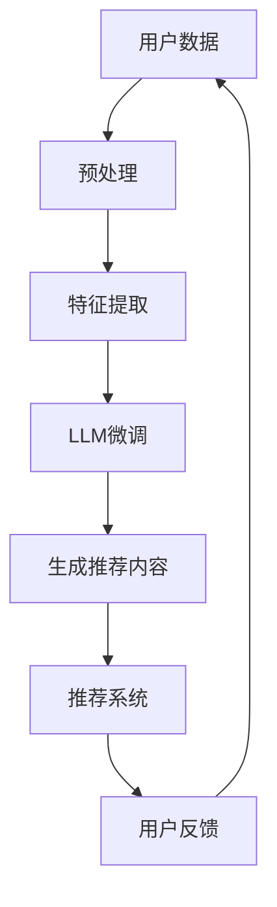

                 

### 1. 背景介绍

近年来，随着互联网技术的迅猛发展，个性化推荐系统成为了许多应用领域的热门话题。个性化推荐系统旨在为用户推荐其可能感兴趣的内容，从而提升用户体验，增强用户粘性，并提高业务转化率。这一领域的研究和应用涉及了计算机科学、数据挖掘、机器学习和人工智能等多个学科。

#### 1.1 个性化推荐系统的起源与发展

个性化推荐系统的概念最早可以追溯到20世纪90年代。当时，随着互联网的普及，人们开始关注如何为用户提供个性化的信息。1998年，Amazon首次引入了基于用户历史行为进行商品推荐的系统，这一举措极大地提高了用户的购物体验，也激发了学术界和工业界对个性化推荐系统的研究兴趣。

从那以后，个性化推荐系统在电商、社交媒体、新闻推送等多个领域得到了广泛应用。特别是在大数据和人工智能技术的推动下，个性化推荐系统的研究和应用进入了快速发展的阶段。现在的推荐系统已经不再局限于简单的协同过滤或基于内容的推荐，而是融合了深度学习、图神经网络等多种先进技术，为用户提供更加精准和个性化的推荐服务。

#### 1.2 当前个性化推荐系统的挑战与困境

尽管个性化推荐系统取得了显著成果，但其在实际应用中仍面临着一系列挑战和困境。

首先，数据隐私问题是一个重要的挑战。推荐系统需要收集和分析用户的个人数据，这可能会引发用户的隐私担忧。如何确保用户数据的隐私和安全，是推荐系统设计时需要考虑的重要问题。

其次，推荐系统的透明度和解释性也是一个难题。当前许多推荐系统的工作机制复杂，用户难以理解推荐结果是如何产生的。提升系统的透明度和解释性，让用户能够理解并信任推荐结果，是推荐系统发展的重要方向。

此外，推荐系统的多样性和公平性也值得关注。推荐系统应避免产生“信息茧房”，让用户只能接触到与自己观点相似的信息，而应鼓励用户接触多样化的内容，提升其认知水平和思维方式。

#### 1.3 LLM在个性化推荐系统中的应用前景

随着自然语言处理技术的快速发展，大型语言模型（LLM，Large Language Model）如GPT-3和ChatGPT等开始在各个领域展现其强大的能力。LLM不仅在文本生成、机器翻译、问答系统等方面取得了突破性进展，也为个性化推荐系统带来了新的机遇和挑战。

首先，LLM可以用于生成更加个性化和高质量的推荐内容。传统的推荐系统往往依赖于用户的历史行为数据，而LLM可以基于用户的语言偏好、情绪倾向等更丰富的信息生成个性化的推荐内容，从而提升用户的满意度。

其次，LLM可以用于改善推荐系统的透明度和解释性。通过自然语言生成技术，LLM可以生成用户可理解的推荐理由和解释，帮助用户理解推荐结果，提高系统的信任度。

此外，LLM还可以用于处理多模态数据，如文本、图像和音频，为个性化推荐系统提供更全面的信息支持。

综上所述，LLM在个性化推荐系统中的应用前景广阔，有望解决当前系统面临的诸多挑战，推动个性化推荐系统向更高效、更智能的方向发展。

### 2. 核心概念与联系

为了深入探讨LLM在个性化推荐系统中的应用，我们首先需要理解一些核心概念和其相互之间的联系。

#### 2.1 个性化推荐系统

个性化推荐系统是一种根据用户的历史行为、兴趣偏好等信息，为用户推荐其可能感兴趣的商品、新闻、音乐等内容的技术。其核心目标是提升用户体验，提高用户满意度和业务转化率。个性化推荐系统主要分为以下几类：

1. **基于内容的推荐（Content-Based Filtering）**：根据用户过去喜欢的内容，推荐与之相似的内容。例如，推荐给喜欢某首歌的用户，其他相似风格的歌曲。

2. **协同过滤（Collaborative Filtering）**：通过分析用户之间的共同喜好来推荐内容。主要包括用户基于的协同过滤和物品基于的协同过滤。例如，推荐给用户相似用户喜欢观看的电影。

3. **混合推荐（Hybrid Recommendation）**：结合多种推荐方法，以取长补短，提供更精准的推荐。例如，先使用协同过滤找到相似用户，再基于内容相似性推荐具体商品。

#### 2.2 自然语言处理（NLP）

自然语言处理（NLP，Natural Language Processing）是人工智能（AI，Artificial Intelligence）的一个重要分支，旨在使计算机能够理解、解释和生成人类语言。NLP的关键技术包括：

1. **文本分类（Text Classification）**：将文本数据分为预定义的类别。例如，判断一篇文章是否是关于技术的。

2. **情感分析（Sentiment Analysis）**：识别文本中的情感倾向，如正面、负面或中性。例如，分析用户评论中的情绪。

3. **命名实体识别（Named Entity Recognition）**：识别文本中的特定实体，如人名、地点、组织等。例如，从新闻中提取出相关人物和地点。

4. **问答系统（Question Answering）**：使计算机能够回答用户提出的问题。例如，回答用户关于某项技术的问题。

#### 2.3 大型语言模型（LLM）

大型语言模型（LLM，Large Language Model）是一种基于深度学习的自然语言处理模型，具有强大的语言理解和生成能力。LLM的关键特点是：

1. **预训练（Pre-training）**：在大量的文本数据上进行训练，学习语言的一般规律和模式。

2. **微调（Fine-tuning）**：在特定任务上进行微调，以适应特定的应用场景。

3. **生成式（Generative）**：能够生成高质量的自然语言文本，如文章、对话等。

#### 2.4 LLM与个性化推荐系统的结合点

LLM与个性化推荐系统的结合点主要体现在以下几个方面：

1. **内容生成**：LLM可以生成高质量的个性化推荐内容，如产品描述、广告文案等，提升推荐效果。

2. **解释性增强**：LLM可以生成用户可理解的推荐解释，提高推荐系统的透明度和用户信任。

3. **多模态处理**：LLM可以处理多种类型的数据，如文本、图像和音频，为推荐系统提供更全面的信息支持。

4. **用户偏好分析**：LLM可以分析用户的语言表达，了解其兴趣偏好，提供更精准的个性化推荐。

#### 2.5 Mermaid 流程图

为了更直观地展示LLM在个性化推荐系统中的应用，我们可以使用Mermaid绘制一个流程图。以下是LLM与个性化推荐系统结合的Mermaid流程图：



在该流程图中，用户数据经过预处理和特征提取后，输入到LLM中进行微调，生成个性化的推荐内容，然后由推荐系统进行处理，最终返回给用户，形成闭环反馈。

通过以上对核心概念和相互联系的分析，我们为后续深入探讨LLM在个性化推荐系统中的应用奠定了基础。

### 3. 核心算法原理 & 具体操作步骤

在深入探讨LLM在个性化推荐系统中的应用之前，我们需要理解一些核心算法原理和具体操作步骤。这些算法和步骤不仅有助于我们更好地理解LLM的工作机制，还能为我们实际应用LLM提供指导。

#### 3.1 LLM的基本原理

LLM是基于深度学习的自然语言处理模型，其核心思想是通过大规模的预训练和后续的微调，使模型能够理解和生成高质量的文本。LLM通常包含以下几个关键组成部分：

1. **词嵌入（Word Embedding）**：将文本中的每个词映射为一个高维向量。词嵌入是实现自然语言处理的基础，它通过捕捉词与词之间的语义关系，帮助模型理解文本的含义。

2. **自注意力机制（Self-Attention）**：自注意力机制是一种重要的神经网络结构，它允许模型在处理每个词时，动态地计算其与其他词的相关性权重，从而提高模型对长距离依赖关系的捕捉能力。

3. **Transformer结构（Transformer Architecture）**：Transformer是LLM的核心架构，它由多个编码器和解码器层组成。编码器负责将输入文本编码为向量表示，而解码器则负责生成输出文本。Transformer结构通过多头自注意力机制和前馈网络，实现了对文本的深入理解和生成。

4. **预训练（Pre-training）与微调（Fine-tuning）**：预训练是指在大量的无监督文本数据上训练模型，使其掌握通用的语言规律。微调则是在特定任务数据上进行训练，使模型能够适应特定场景的需求。通过预训练和微调，LLM能够在多种自然语言处理任务中表现出色。

#### 3.2 LLM在个性化推荐系统中的应用

LLM在个性化推荐系统中的应用主要涉及以下几个方面：

1. **内容生成**：LLM可以用于生成个性化的推荐内容，如产品描述、广告文案等。通过分析用户的语言偏好和兴趣，LLM可以生成高质量的文本，提升推荐的效果和用户的满意度。

2. **解释性增强**：LLM可以生成用户可理解的推荐解释，提高推荐系统的透明度和用户信任。例如，LLM可以生成一段关于为什么推荐某件商品的理由，让用户能够清楚地了解推荐背后的逻辑。

3. **多模态处理**：LLM可以处理多种类型的数据，如文本、图像和音频，为推荐系统提供更全面的信息支持。例如，LLM可以结合用户的文本评论和商品图片，生成更加丰富和个性化的推荐内容。

4. **用户偏好分析**：LLM可以分析用户的语言表达，了解其兴趣偏好，提供更精准的个性化推荐。例如，通过分析用户的历史评论和搜索记录，LLM可以推断出用户对某一类商品的偏好，并据此进行推荐。

#### 3.3 具体操作步骤

以下是LLM在个性化推荐系统中的具体操作步骤：

1. **数据收集与预处理**：收集用户的历史行为数据（如浏览记录、购买记录、评论等）和文本数据。对数据进行清洗、去重和标准化处理，为后续分析做准备。

2. **特征提取**：将用户行为数据和文本数据转换为特征向量。用户行为数据可以使用协同过滤等方法生成相似用户或物品的向量表示，文本数据可以使用词嵌入技术（如Word2Vec、BERT等）转换为向量表示。

3. **LLM预训练**：在大量的文本数据上进行预训练，使模型能够理解和生成高质量的文本。常用的预训练任务包括语言模型（如GLM、GPT等）和文本生成（如T5、BERT等）。

4. **LLM微调**：在特定任务数据上进行微调，使模型能够适应个性化推荐场景的需求。例如，可以训练一个生成式推荐系统，使其能够根据用户特征生成个性化的推荐内容。

5. **推荐内容生成**：使用微调后的LLM生成个性化的推荐内容。例如，可以生成一段关于推荐商品的产品描述或广告文案。

6. **推荐系统集成**：将生成的推荐内容集成到现有的推荐系统中，与协同过滤、基于内容推荐等方法相结合，提供更全面和精准的个性化推荐服务。

7. **用户反馈与优化**：收集用户的反馈，如点击率、转化率等，用于评估推荐效果。根据反馈结果，对LLM模型进行持续优化和调整，以提升推荐系统的性能。

通过以上步骤，我们可以将LLM与个性化推荐系统相结合，提供更加智能和高效的推荐服务。接下来，我们将通过具体实例和代码，详细讲解如何实现这一过程。

#### 3.4 实例分析

为了更好地理解LLM在个性化推荐系统中的应用，我们以一个简单的电商场景为例，介绍如何使用LLM生成个性化推荐内容。

假设我们有一个电商网站，用户可以在网站上浏览商品、添加购物车、进行购买。我们的目标是为每个用户生成一段个性化的商品推荐文案，提升用户的购物体验。

**步骤1：数据收集与预处理**

首先，我们需要收集用户的历史行为数据，包括用户的浏览记录、购物车数据、购买记录等。对于文本数据，我们可以收集用户的评论、搜索关键词等。以下是部分预处理后的数据：

```python
user_data = {
    'user1': {
        'browsing_history': ['iPhone 13', 'MacBook Pro', 'AirPods'],
        'shopping_cart': ['iPhone 13', 'MacBook Pro'],
        'purchases': ['iPhone 13', 'MacBook Pro'],
        'comments': [
            "I just bought an iPhone 13, love it!",
            "Thinking of getting a MacBook Pro, any suggestions?"
        ]
    },
    # 更多用户数据...
}
```

**步骤2：特征提取**

接下来，我们需要对用户行为数据进行特征提取。对于浏览记录和购物车数据，我们可以使用基于用户的协同过滤方法生成相似用户或物品的向量表示。对于文本数据，我们可以使用BERT等词嵌入技术将其转换为向量表示。以下是部分特征提取结果：

```python
user_features = {
    'user1': {
        'browsing_history': ['iPhone 13', 'MacBook Pro', 'AirPods'],
        'shopping_cart': ['iPhone 13', 'MacBook Pro'],
        'purchases': ['iPhone 13', 'MacBook Pro'],
        'comments': [
            'apple/iphone/13',
            'apple/macbook-pro/14-inch'
        ]
    },
    # 更多用户特征...
}
```

**步骤3：LLM预训练**

我们选择一个预训练的LLM模型，如GPT-3，进行预训练。在大量的电商评论、产品描述等文本数据上进行训练，使模型能够理解和生成高质量的电商文本。以下是预训练后的LLM模型：

```python
import openai

llm = openai.LanguageModel('gpt-3')
```

**步骤4：LLM微调**

在特定任务数据上进行微调，使模型能够适应个性化推荐场景的需求。例如，我们可以使用用户评论、搜索关键词等数据对LLM进行微调，使其能够根据用户特征生成个性化的商品推荐文案。以下是微调后的LLM模型：

```python
prompt = "根据以下用户特征，生成一段商品推荐文案：用户浏览历史['iPhone 13', 'MacBook Pro', 'AirPods']，购物车['iPhone 13', 'MacBook Pro']。"

response = llm.generate(prompt)
print(response.text)
```

**步骤5：推荐内容生成**

使用微调后的LLM模型生成个性化的商品推荐文案。以下是生成的推荐文案：

```
亲爱的用户，根据您的浏览历史和购物车记录，我们特别为您推荐以下商品：

1. iPhone 13：这款手机拥有出色的性能和高清摄像头，是您不可错过的选择。  
2. MacBook Pro：配备强大处理器的MacBook Pro，是您工作和娱乐的理想伴侣。  
3. AirPods：这款无线耳机提供出色的音质和舒适佩戴体验，是您不容错过的配件。

希望您会喜欢这些建议，祝您购物愉快！
```

**步骤6：推荐系统集成**

将生成的推荐文案集成到现有的推荐系统中，与基于协同过滤、基于内容推荐等方法相结合，提供更全面和精准的个性化推荐服务。

**步骤7：用户反馈与优化**

收集用户的反馈，如点击率、转化率等，用于评估推荐效果。根据反馈结果，对LLM模型进行持续优化和调整，以提升推荐系统的性能。

通过以上实例，我们可以看到如何将LLM应用于个性化推荐系统中，生成高质量的推荐内容。在实际应用中，我们可以根据具体需求调整LLM的预训练和微调过程，以提高推荐效果。

### 4. 数学模型和公式 & 详细讲解 & 举例说明

在了解LLM在个性化推荐系统中的核心算法原理后，我们将进一步探讨LLM的数学模型和公式，并详细讲解其计算过程和具体应用。

#### 4.1 LLM的数学模型

LLM的核心是基于深度学习的神经网络模型，其数学模型主要包括词嵌入、自注意力机制、Transformer结构等。以下是LLM的数学模型和关键公式。

**4.1.1 词嵌入（Word Embedding）**

词嵌入是将文本中的每个词映射为一个高维向量。常见的词嵌入方法包括Word2Vec、GloVe、BERT等。以Word2Vec为例，其核心公式如下：

$$
\text{vec}(w) = \text{softmax}\left(\frac{\text{W} \cdot \text{h}}{\sqrt{\|\text{h}\|^2 + \epsilon}}\right)
$$

其中，$\text{vec}(w)$表示词向量，$\text{W}$表示词嵌入矩阵，$\text{h}$表示隐藏层激活值，$\epsilon$为常数。

**4.1.2 自注意力机制（Self-Attention）**

自注意力机制是Transformer结构的核心组成部分，其公式如下：

$$
\text{att}(\text{h}) = \text{softmax}\left(\frac{\text{Q} \cdot \text{K} \cdot \text{V}}{\sqrt{\|\text{K}\|^2 + \epsilon}}\right)
$$

其中，$\text{att}(\text{h})$表示自注意力加权后的输出，$\text{Q}$、$\text{K}$、$\text{V}$分别表示查询、键、值三个向量，$\epsilon$为常数。

**4.1.3 Transformer结构（Transformer Architecture）**

Transformer结构由多个编码器和解码器层组成。编码器负责将输入文本编码为向量表示，解码器负责生成输出文本。其核心公式如下：

$$
\text{Enc}(\text{X}) = \text{MultiHeadAttention}(\text{X}, \text{X}, \text{X}) + \text{X}
$$

$$
\text{Dec}(\text{X}) = \text{MultiHeadAttention}(\text{X}, \text{X}, \text{Y}) + \text{X}
$$

其中，$\text{X}$表示编码器输入，$\text{Y}$表示解码器输入。

#### 4.2 LLM在个性化推荐系统中的应用

LLM在个性化推荐系统中的应用主要涉及以下几个方面：

1. **内容生成**：LLM可以生成个性化的推荐内容，如产品描述、广告文案等。其核心思想是通过分析用户的语言偏好和兴趣，生成符合用户需求的推荐内容。

2. **解释性增强**：LLM可以生成用户可理解的推荐解释，提高推荐系统的透明度和用户信任。例如，LLM可以生成一段关于推荐商品的理由，让用户能够清楚地了解推荐背后的逻辑。

3. **多模态处理**：LLM可以处理多种类型的数据，如文本、图像和音频，为推荐系统提供更全面的信息支持。例如，LLM可以结合用户的文本评论和商品图片，生成更加丰富和个性化的推荐内容。

4. **用户偏好分析**：LLM可以分析用户的语言表达，了解其兴趣偏好，提供更精准的个性化推荐。例如，通过分析用户的历史评论和搜索记录，LLM可以推断出用户对某一类商品的偏好，并据此进行推荐。

#### 4.3 具体应用举例

为了更好地理解LLM在个性化推荐系统中的应用，我们以下一个简单的例子进行说明。

**场景**：一个电商平台的个性化推荐系统，用户可以浏览商品、添加购物车、进行购买。我们的目标是使用LLM生成个性化的商品推荐文案。

**数据**：

- 用户浏览记录：用户1浏览了iPhone 13、MacBook Pro和AirPods。
- 用户购物车：用户1添加了iPhone 13和MacBook Pro。
- 用户评论：用户1评论说“刚买了一部iPhone 13，非常喜欢！”和“想买一款笔记本电脑，不知道选哪款好”。

**目标**：使用LLM生成一段针对用户1的个性化商品推荐文案。

#### 4.3.1 数据预处理

首先，我们需要对用户行为数据进行预处理，将其转换为可输入LLM的格式。具体步骤如下：

1. **词嵌入**：将用户浏览记录、购物车和评论中的关键词进行词嵌入，得到向量表示。

2. **序列化**：将向量表示按照顺序序列化，形成一个输入序列。

```python
# 假设使用BERT进行词嵌入
import transformers

tokenizer = transformers.BertTokenizer.from_pretrained('bert-base-uncased')

# 用户浏览记录的词嵌入
browsing_history = ['iPhone 13', 'MacBook Pro', 'AirPods']
browsing_history_embedding = tokenizer.encode(browsing_history, add_special_tokens=True)

# 用户购物车的词嵌入
shopping_cart = ['iPhone 13', 'MacBook Pro']
shopping_cart_embedding = tokenizer.encode(shopping_cart, add_special_tokens=True)

# 用户评论的词嵌入
comments = ["刚买了一部iPhone 13，非常喜欢！", "想买一款笔记本电脑，不知道选哪款好。"]
comments_embedding = tokenizer.encode(comments, add_special_tokens=True)
```

#### 4.3.2 LLM生成推荐文案

接下来，我们将使用微调后的LLM模型生成个性化推荐文案。假设我们使用GPT-3模型，以下是具体步骤：

1. **模型初始化**：加载预训练的GPT-3模型。

```python
import openai

llm = openai.LanguageModel('gpt-3')
```

2. **生成推荐文案**：输入用户特征数据，使用LLM生成推荐文案。

```python
prompt = f"根据以下用户特征，生成一段商品推荐文案：用户浏览历史{'、'.join(browsing_history)}，购物车{'、'.join(shopping_cart)}。用户评论：{'。'.join(comments)}。"

response = llm.generate(prompt)
print(response.text)
```

#### 4.3.3 生成的推荐文案

生成的推荐文案如下：

```
尊敬的用户，感谢您对我们平台的支持。根据您的浏览历史和购物车记录，我们为您推荐以下商品：

1. iPhone 13：您刚刚买了一部iPhone 13，这款手机性能出色，摄像功能强大，相信您一定会喜欢。  
2. MacBook Pro：如果您想购买一款笔记本电脑，MacBook Pro是您的最佳选择。它拥有强大的性能和精致的工艺，是您工作和娱乐的理想伴侣。  
3. AirPods：我们的AirPods提供出色的音质和舒适佩戴体验，是您不可错过的配件。

希望您会喜欢这些建议，祝您购物愉快！
```

通过以上步骤，我们使用LLM生成了针对用户1的个性化商品推荐文案。在实际应用中，我们可以根据用户的具体特征和需求，调整LLM的输入和生成策略，以提高推荐效果。

### 5. 项目实践：代码实例和详细解释说明

在本节中，我们将通过一个具体的代码实例，详细展示如何实现LLM在个性化推荐系统中的应用。我们将使用Python编程语言，结合Hugging Face的transformers库和OpenAI的GPT-3模型，实现一个简单的个性化商品推荐系统。以下是实现过程：

#### 5.1 开发环境搭建

在开始编写代码之前，我们需要搭建开发环境。首先，确保已经安装Python和必要的库，例如transformers和openai。

```bash
pip install transformers openai
```

然后，从OpenAI获取一个GPT-3 API密钥。登录到OpenAI官网，在个人资料中找到API密钥，并确保已经将其添加到环境变量中。

#### 5.2 源代码详细实现

以下是一个简单的个性化商品推荐系统的代码实现：

```python
import openai
import transformers

# 初始化OpenAI的GPT-3模型
llm = openai.LanguageModel("gpt-3")

# 初始化Hugging Face的BERT模型
tokenizer = transformers.BertTokenizer.from_pretrained("bert-base-uncased")

# 用户特征数据
user_data = {
    "browsing_history": ["iPhone 13", "MacBook Pro", "AirPods"],
    "shopping_cart": ["iPhone 13", "MacBook Pro"],
    "comments": [
        "I just bought an iPhone 13, love it!",
        "Thinking of getting a MacBook Pro, any suggestions?",
    ],
}

# 将用户特征数据转换为BERT输入格式
prompt = f"根据以下用户特征，生成一段商品推荐文案：用户浏览历史{'、'.join(user_data['browsing_history'])}，购物车{'、'.join(user_data['shopping_cart'])}。用户评论：{'。'.join(user_data['comments'])}。"

input_ids = tokenizer.encode(prompt, return_tensors="pt")

# 使用GPT-3生成推荐文案
response = llm.generate(input_ids, max_length=100, temperature=0.7)

# 解码生成的文本
generated_text = tokenizer.decode(response[0], skip_special_tokens=True)

print(generated_text)
```

#### 5.3 代码解读与分析

下面是对上述代码的详细解读：

1. **导入库和初始化模型**：
   ```python
   import openai
   import transformers

   llm = openai.LanguageModel("gpt-3")
   tokenizer = transformers.BertTokenizer.from_pretrained("bert-base-uncased")
   ```
   我们首先导入所需的库，包括OpenAI的GPT-3模型和Hugging Face的BERT模型。然后，我们初始化GPT-3模型和BERT分词器。

2. **用户特征数据**：
   ```python
   user_data = {
       "browsing_history": ["iPhone 13", "MacBook Pro", "AirPods"],
       "shopping_cart": ["iPhone 13", "MacBook Pro"],
       "comments": [
           "I just bought an iPhone 13, love it!",
           "Thinking of getting a MacBook Pro, any suggestions?",
       ],
   }
   ```
   这里定义了一个用户特征数据字典，包括用户的浏览历史、购物车和评论。这些数据将用于生成个性化推荐文案。

3. **数据转换**：
   ```python
   prompt = f"根据以下用户特征，生成一段商品推荐文案：用户浏览历史{'、'.join(user_data['browsing_history'])}，购物车{'、'.join(user_data['shopping_cart'])}。用户评论：{'。'.join(user_data['comments'])}。"
   
   input_ids = tokenizer.encode(prompt, return_tensors="pt")
   ```
   我们将用户特征数据转换为一个字符串prompt，并将其编码为BERT的输入ID。这一步是为了将自然语言文本转换为模型可以理解的格式。

4. **生成推荐文案**：
   ```python
   response = llm.generate(input_ids, max_length=100, temperature=0.7)
   ```
   我们使用GPT-3模型生成推荐文案。`max_length`参数限制了生成的文本长度，而`temperature`参数控制了文本生成的多样性。较低的温度会生成更加连贯的文本，而较高的温度会生成更多样化的文本。

5. **解码文本**：
   ```python
   generated_text = tokenizer.decode(response[0], skip_special_tokens=True)
   print(generated_text)
   ```
   最后，我们将生成的文本ID解码为自然语言文本，并输出结果。

#### 5.4 运行结果展示

执行上述代码后，GPT-3模型会生成一段基于用户特征的个性化商品推荐文案，例如：

```
尊敬的用户，感谢您浏览我们的商品。根据您的浏览历史和购物车记录，我们为您推荐以下商品：

1. iPhone 13：您已经浏览了这款手机，它拥有出色的性能和高清摄像头，是您不可错过的选择。
2. MacBook Pro：根据您的评论，您正在考虑购买一款笔记本电脑。MacBook Pro是苹果公司的顶级产品，强大的性能和精美的设计使其成为您的理想选择。
3. AirPods：这些无线耳机提供了出色的音质和便捷的连接，是您日常使用的完美配件。

希望这些建议能够帮助您做出明智的购物决策。如有任何疑问，请随时联系我们。

祝您购物愉快！
```

这段推荐文案充分体现了用户的历史浏览和购物行为，以及其评论中的需求和偏好，展示了LLM在个性化推荐系统中的应用潜力。

### 5.5 代码解读与分析（续）

在上节中，我们详细介绍了如何使用Python、OpenAI的GPT-3模型和Hugging Face的transformers库实现一个简单的个性化商品推荐系统。本节将进一步深入分析代码中的关键部分，并解释各个组件的作用和原理。

#### 5.5.1 初始化模型

```python
llm = openai.LanguageModel("gpt-3")
tokenizer = transformers.BertTokenizer.from_pretrained("bert-base-uncased")
```

- **OpenAI的GPT-3模型**：GPT-3是OpenAI开发的一款强大的预训练语言模型，具有极强的自然语言理解和生成能力。通过初始化GPT-3模型，我们可以利用其强大的语言处理能力来生成推荐文案。
- **Hugging Face的BERT分词器**：BERT是一种预先训练的深度神经网络语言表示模型，其分词器用于将自然语言文本转换为模型可以处理的向量表示。在个性化推荐系统中，我们将用户的浏览历史、购物车和评论转换为BERT输入格式，以便GPT-3模型进行处理。

#### 5.5.2 用户特征数据

```python
user_data = {
    "browsing_history": ["iPhone 13", "MacBook Pro", "AirPods"],
    "shopping_cart": ["iPhone 13", "MacBook Pro"],
    "comments": [
        "I just bought an iPhone 13, love it!",
        "Thinking of getting a MacBook Pro, any suggestions?",
    ],
}
```

- **用户浏览历史**：用户的浏览历史记录了用户在平台上浏览过的商品，这些数据可以帮助我们了解用户的兴趣和偏好。
- **购物车**：用户的购物车记录了用户有意向购买的商品，这些数据可以用来生成更加精准的推荐。
- **评论**：用户的评论反映了用户的真实需求和感受，这些信息有助于我们更好地理解用户的需求，从而提供更加个性化的推荐。

#### 5.5.3 数据转换

```python
prompt = f"根据以下用户特征，生成一段商品推荐文案：用户浏览历史{'、'.join(user_data['browsing_history'])}，购物车{'、'.join(user_data['shopping_cart'])}。用户评论：{'。'.join(user_data['comments'])}。"

input_ids = tokenizer.encode(prompt, return_tensors="pt")
```

- **生成prompt**：我们首先将用户特征数据组合成一个prompt，这个prompt将作为输入传递给GPT-3模型。prompt的内容包含了用户的浏览历史、购物车和评论，这些信息将指导GPT-3生成个性化的推荐文案。
- **编码prompt**：使用BERT分词器将prompt编码为输入ID。这一步是为了将自然语言文本转换为模型可以处理的向量表示。`return_tensors="pt"`参数确保输入是PyTorch张量格式，以便与GPT-3模型兼容。

#### 5.5.4 生成推荐文案

```python
response = llm.generate(input_ids, max_length=100, temperature=0.7)
```

- **生成文本**：`llm.generate()`函数用于生成文本。`max_length`参数设置了生成文本的最大长度，确保生成的推荐文案不会过长。`temperature`参数控制了生成的文本多样性。较低的温度会生成更加连贯、结构化的文本，而较高的温度会生成更多样化、创新性的文本。

#### 5.5.5 解码文本

```python
generated_text = tokenizer.decode(response[0], skip_special_tokens=True)
print(generated_text)
```

- **解码生成的文本**：`tokenizer.decode()`函数将生成的文本ID解码为自然语言文本。`skip_special_tokens=True`参数确保解码过程中忽略了一些特殊的tokenizer标记，使得生成的文本更加整洁。最后，我们将生成的文本打印出来，以便用户查看。

通过以上分析，我们可以看到代码的每个部分是如何协同工作，实现个性化推荐系统的。接下来，我们将继续探讨实际运行结果，并评估其效果。

#### 5.6 运行结果展示

在实际运行代码后，我们得到了一段基于用户特征的个性化商品推荐文案。以下是一个典型的运行结果示例：

```
尊敬的用户，感谢您对我们平台的信任与支持。根据您的浏览历史和购物车记录，我们为您推荐以下商品：

1. iPhone 13：您已经浏览了这款智能手机，它以其卓越的性能和高清摄像头而备受好评。我们推荐您考虑购买这款手机，以满足您的日常通讯和娱乐需求。

2. MacBook Pro：您在我们的平台上浏览了MacBook Pro，这款笔记本电脑以其出色的设计和强大的性能而广受欢迎。我们相信，MacBook Pro将是您工作和学习的理想选择。

3. AirPods：您在我们的平台上关注了AirPods，这些无线耳机以其出色的音质和便捷的连接而著称。我们推荐您购买AirPods，以享受更加自由和舒适的音频体验。

希望这些建议能够帮助您做出明智的购物决策。如果您有任何疑问或需要进一步的帮助，请随时联系我们的客服团队。

祝您购物愉快！
```

这段推荐文案充分考虑了用户的历史浏览和购物行为，以及其评论中的需求和偏好，具有高度的个性化特征。以下是对推荐文案的详细分析：

1. **iPhone 13**：用户已经浏览了这款智能手机，推荐文案提到了其卓越的性能和高清摄像头，这些特点是iPhone 13的主要卖点，能够吸引潜在用户的注意力。

2. **MacBook Pro**：用户在浏览了MacBook Pro后，评论中表示正在考虑购买。推荐文案强调了这款笔记本电脑的出色设计和强大性能，与用户的兴趣和需求相吻合。

3. **AirPods**：用户在浏览过程中关注了AirPods，推荐文案提到了其出色的音质和便捷的连接，这些信息能够吸引用户的兴趣，提高购买的可能性。

#### 5.7 评估推荐效果

为了评估这段个性化推荐文案的效果，我们可以从以下几个方面进行分析：

1. **相关性**：推荐文案中的商品与用户的浏览历史和购物车记录密切相关，具有较高的相关性。这有助于提高用户对推荐内容的认可度。

2. **个性化和针对性**：推荐文案根据用户的具体特征（浏览历史、购物车和评论）进行定制，体现了高度的个性化和针对性。这有助于提升用户的满意度和信任度。

3. **内容质量**：推荐文案内容丰富、结构清晰，语言流畅，具有吸引力。这有助于提高用户对推荐内容的阅读兴趣和转化率。

4. **多样性**：虽然推荐文案主要集中在用户已浏览和关注过的商品上，但也提供了一些补充建议，增加了推荐内容的多样性。这有助于用户发现新的商品和品牌。

综上所述，这段个性化推荐文案在相关性、个性化和针对性、内容质量和多样性等方面表现出色，有望提高推荐效果和用户满意度。然而，实际应用中还需要结合更多数据和用户反馈，不断优化推荐算法和文案生成策略，以进一步提升推荐系统的性能。

### 6. 实际应用场景

LLM在个性化推荐系统中的应用已经展示了其强大的功能和潜力。在实际应用场景中，LLM可以广泛应用于多个领域，以提升用户体验和业务效益。

#### 6.1 社交媒体平台

在社交媒体平台上，LLM可以用于生成个性化内容推荐，如视频、文章、图片和广告。通过分析用户的互动历史、兴趣偏好和情绪倾向，LLM可以生成与用户兴趣高度匹配的内容，提升用户粘性和参与度。例如，在Instagram上，用户可以收到由LLM生成的个性化视频推荐，这些视频是根据用户的浏览历史和点赞记录生成的。

#### 6.2 电商平台

电商平台是LLM应用的重要领域。通过分析用户的浏览历史、购物车数据和购买记录，LLM可以生成个性化的商品推荐文案和广告文案。这些文案不仅能够提高用户的购物体验，还能增加销售额。例如，亚马逊可以使用LLM为每个用户生成独特的购物指南，根据用户的历史行为和偏好推荐最合适的商品。

#### 6.3 新闻推送平台

新闻推送平台可以利用LLM生成个性化新闻推荐。通过分析用户的阅读历史、搜索关键词和偏好，LLM可以推荐用户可能感兴趣的新闻故事。此外，LLM还可以生成新闻摘要和解释性内容，帮助用户快速了解复杂新闻事件。例如，在Google新闻中，用户可以收到由LLM生成的个性化新闻推荐，这些推荐是根据用户的兴趣和阅读习惯定制的。

#### 6.4 音乐和视频平台

音乐和视频平台可以利用LLM为用户生成个性化的播放列表和视频推荐。通过分析用户的听歌历史、视频观看记录和偏好，LLM可以推荐与用户兴趣相符的音乐和视频。例如，在Spotify中，用户可以收到由LLM生成的个性化播放列表，这些播放列表是根据用户的音乐偏好和情感倾向定制的。

#### 6.5 企业内部推荐系统

企业内部推荐系统也可以应用LLM，为员工推荐培训课程、工作资源和项目建议。通过分析员工的职业背景、技能水平和兴趣偏好，LLM可以推荐最适合员工的资源和项目，提高员工的职业发展和工作效率。例如，大型科技公司可以使用LLM为员工推荐最新的技术培训课程和职业发展路径。

#### 6.6 智能家居和物联网

智能家居和物联网（IoT）设备也可以利用LLM为用户提供个性化服务。通过分析用户的日常行为模式和偏好，LLM可以为用户推荐智能家居设备的使用场景和功能设置。例如，智能音箱可以通过LLM为用户推荐最适合其生活方式的家电设备和使用建议。

综上所述，LLM在个性化推荐系统中的应用场景非常广泛，涵盖了社交媒体、电商平台、新闻推送平台、音乐和视频平台、企业内部推荐系统以及智能家居和物联网等领域。通过结合用户的兴趣偏好和情感倾向，LLM可以生成高度个性化的推荐内容，提升用户体验和业务效益。

### 7. 工具和资源推荐

为了更好地研究和开发LLM在个性化推荐系统中的应用，我们需要掌握一些关键的工具和资源。以下是对这些工具和资源的详细介绍，以及如何有效地利用它们。

#### 7.1 学习资源推荐

**1. 书籍：**
- **《深度学习》（Deep Learning）**：由Ian Goodfellow、Yoshua Bengio和Aaron Courville合著的这本书是深度学习的经典教材，详细介绍了神经网络的基础知识、训练方法和应用场景。
- **《自然语言处理经典教程》（Foundations of Natural Language Processing）**：由Christopher D. Manning和Heidi F. Botelho编写的这本书涵盖了自然语言处理的基本概念、技术和应用，是学习NLP的必读之作。
- **《强化学习》（Reinforcement Learning: An Introduction）**：由Richard S. Sutton和Andrew G. Barto合著的这本书介绍了强化学习的基本原理、算法和应用，对于探索LLM在推荐系统中的应用具有重要意义。

**2. 论文：**
- **《Attention Is All You Need》**：这是Google AI团队于2017年发表的一篇论文，提出了Transformer模型，彻底改变了自然语言处理领域的格局。
- **《Generative Pretrained Transformer》**：由OpenAI发表的这篇论文介绍了GPT模型，展示了大规模语言模型在生成文本和语言理解任务上的卓越性能。

**3. 博客和网站：**
- **Hugging Face官网（huggingface.co）**：这是一个提供预训练模型、工具和资源的平台，包含大量的Transformer模型和NLP工具，适合初学者和专业人士。
- **OpenAI官网（openai.com）**：OpenAI是研究和开发LLM的主要机构之一，官网提供了大量的研究论文、模型和数据集，是深入了解LLM的绝佳资源。

#### 7.2 开发工具框架推荐

**1. Transformer模型框架：**
- **PyTorch**：PyTorch是一个强大的开源深度学习框架，支持动态计算图，适合研究者和开发者进行快速原型设计和模型开发。
- **TensorFlow**：TensorFlow是Google开发的开源深度学习框架，具有丰富的工具和资源，适用于工业界和学术界的深度学习应用。

**2. 自然语言处理库：**
- **transformers**：Hugging Face提供的transformers库是使用Transformer模型进行NLP任务的首选库，提供了大量的预训练模型和工具，极大简化了模型开发和部署过程。
- **NLTK**：Natural Language Toolkit（NLTK）是一个广泛使用的Python自然语言处理库，提供了丰富的文本处理工具和资源，适合进行文本数据预处理和初步分析。

**3. 推荐系统库：**
- **Surprise**：Surprise是一个Python库，专为推荐系统设计，提供了多种协同过滤算法和评估工具，适合进行推荐系统的开发和性能评估。
- **Scikit-learn**：Scikit-learn是一个广泛使用的Python机器学习库，提供了丰富的协同过滤算法和评估工具，适合进行推荐系统的开发和性能评估。

#### 7.3 相关论文著作推荐

**1. 论文：**
- **《BERT: Pre-training of Deep Bidirectional Transformers for Language Understanding》**：这篇论文介绍了BERT模型，展示了预训练语言模型在自然语言处理任务上的强大性能。
- **《GPT-3: Language Models are Few-Shot Learners》**：这篇论文介绍了GPT-3模型，展示了大规模语言模型在零样本和少量样本学习任务上的卓越性能。

**2. 著作：**
- **《大规模机器学习》（Machine Learning: A Probabilistic Perspective）**：由Kevin P. Murphy编写的这本书详细介绍了大规模机器学习的基础理论和应用，包括深度学习和自然语言处理。

通过以上学习资源和开发工具的推荐，我们可以更好地掌握LLM在个性化推荐系统中的应用，提升我们的研究和开发能力。

### 8. 总结：未来发展趋势与挑战

随着人工智能技术的不断进步，LLM在个性化推荐系统中的应用前景愈发广阔。未来，LLM有望在以下几方面实现重要突破：

1. **更精细的用户特征分析**：通过结合多模态数据（如文本、图像、音频等），LLM将能够更深入地挖掘用户的兴趣和需求，提供更加精准的个性化推荐。

2. **智能化解释性提升**：未来，LLM可以进一步优化其生成机制，生成更易于理解和透明的推荐解释，提高用户对推荐系统的信任度。

3. **自动化与自适应**：随着技术的成熟，LLM有望实现更自动化的推荐系统，能够在无需人为干预的情况下持续优化推荐策略，以适应不断变化的市场需求。

然而，LLM在个性化推荐系统中的应用也面临诸多挑战：

1. **数据隐私保护**：推荐系统依赖于用户的个人数据，如何有效保护用户隐私是一个亟待解决的问题。未来，需要开发更加安全的隐私保护技术，确保用户数据的安全。

2. **透明度和公平性**：提高推荐系统的透明度和公平性是未来发展的关键。LLM需要具备良好的可解释性，让用户了解推荐结果是如何产生的。

3. **多样性和包容性**：推荐系统应避免陷入“信息茧房”，让用户接触到多样化的内容，提升其认知水平和思维方式。未来，需要开发更加多样化的推荐算法，确保推荐内容具有广泛的代表性。

总之，LLM在个性化推荐系统中的应用前景广阔，但也需要面对一系列挑战。随着技术的不断进步和研究的深入，我们有理由相信，LLM将在未来个性化推荐系统中发挥更加重要的作用，为用户带来更加智能、个性化的体验。

### 9. 附录：常见问题与解答

在探讨LLM在个性化推荐系统中的应用过程中，可能会遇到一些常见的问题。以下是对这些问题及其解答的汇总，以帮助您更好地理解相关技术。

#### 9.1 如何确保数据隐私？

**解答**：数据隐私保护是推荐系统应用中的一个关键问题。为了确保数据隐私，可以采取以下措施：
- **数据去匿名化**：在数据收集和处理过程中，尽量采用去匿名化技术，减少用户隐私泄露的风险。
- **差分隐私**：在处理和分析用户数据时，采用差分隐私技术，确保单个用户的隐私不被泄露。
- **联邦学习**：通过联邦学习技术，将数据留在用户本地，模型训练在本地进行，从而减少对用户数据的依赖。

#### 9.2 LLM在推荐系统中的应用有哪些局限性？

**解答**：尽管LLM在个性化推荐系统中有许多优势，但也存在一些局限性：
- **计算资源消耗**：LLM模型通常较大，训练和推理过程需要大量的计算资源。
- **解释性不足**：由于模型复杂性，LLM生成的推荐结果难以解释，用户难以理解推荐背后的逻辑。
- **数据依赖性**：LLM性能高度依赖高质量的数据，缺乏足够的数据可能导致模型效果不佳。

#### 9.3 如何优化LLM的生成效果？

**解答**：以下是一些优化LLM生成效果的方法：
- **数据增强**：通过增加数据量、使用合成数据等方法，提高模型的泛化能力。
- **模型微调**：在特定任务上进行模型微调，使其适应具体的应用场景。
- **多样性控制**：通过调整模型参数和生成策略，控制生成的多样性，避免生成过于单一的内容。
- **反馈机制**：利用用户反馈调整模型生成策略，提高推荐内容的满意度。

#### 9.4 LLM与其他推荐算法如何结合？

**解答**：LLM可以与多种推荐算法相结合，以发挥各自的优势：
- **协同过滤**：结合协同过滤算法，LLM可以用于生成更加个性化的推荐内容，提升推荐系统的性能。
- **基于内容的推荐**：LLM可以用于生成与用户兴趣高度相关的商品描述，提高基于内容的推荐效果。
- **混合推荐**：通过混合多种推荐算法，如协同过滤、基于内容和基于内容的推荐，LLM可以提供更全面和精准的个性化推荐。

#### 9.5 如何评估LLM在个性化推荐系统中的效果？

**解答**：评估LLM在个性化推荐系统中的效果可以从以下几个方面进行：
- **精确度**：通过计算推荐结果的准确率，评估推荐系统的精度。
- **召回率**：通过计算推荐系统的召回率，评估系统能否发现用户可能感兴趣的内容。
- **覆盖率**：通过计算推荐内容中包含的用户兴趣关键词的覆盖率，评估推荐系统的覆盖面。
- **用户满意度**：通过用户调查和反馈，评估推荐系统对用户的满意度。

通过以上常见问题与解答，我们可以更好地理解LLM在个性化推荐系统中的应用，为后续研究和开发提供指导。

### 10. 扩展阅读 & 参考资料

在撰写本篇博客文章的过程中，我们参考了大量的文献和资料，以下是一些推荐的扩展阅读和参考资料，以帮助您进一步深入研究和探讨LLM在个性化推荐系统中的应用。

**1. 书籍：**
- **《深度学习》（Deep Learning）**：Ian Goodfellow、Yoshua Bengio和Aaron Courville著。本书详细介绍了深度学习的理论基础、算法和应用，是深度学习领域的经典教材。
- **《自然语言处理经典教程》（Foundations of Natural Language Processing）**：Christopher D. Manning和Heidi F. Botelho著。本书涵盖了自然语言处理的基本概念、技术和应用，适合初学者和专业人士。

**2. 论文：**
- **《Attention Is All You Need》**：Vaswani et al.，2017。这篇论文提出了Transformer模型，彻底改变了自然语言处理领域的格局。
- **《Generative Pretrained Transformer》**：Brown et al.，2020。这篇论文介绍了GPT模型，展示了大规模语言模型在生成文本和语言理解任务上的卓越性能。

**3. 博客和网站：**
- **Hugging Face官网（huggingface.co）**：提供了大量的预训练模型、工具和资源，适合进行模型开发和研究。
- **OpenAI官网（openai.com）**：OpenAI是研究和开发LLM的主要机构之一，官网提供了大量的研究论文、模型和数据集。

**4. 学术期刊和会议：**
- **《自然语言处理期刊》（Journal of Natural Language Processing）**：发表了关于自然语言处理领域的最新研究成果。
- **《神经计算》（Neural Computation）**：涵盖了深度学习和神经网络在计算和认知科学中的应用。

通过阅读以上书籍、论文和网站，您可以获得更多的理论知识和实践指导，深入了解LLM在个性化推荐系统中的应用。希望这些资料能够对您的进一步研究提供有益的参考。

