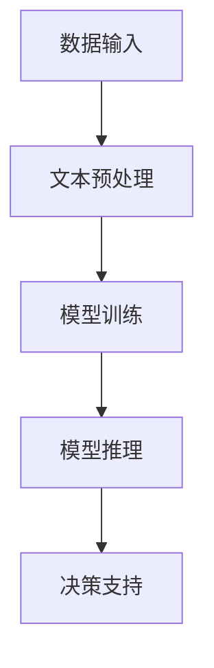

                 

### 背景介绍

随着人工智能技术的快速发展，自然语言处理（NLP）技术取得了显著的突破。其中，大型语言模型（LLM，Large Language Model）作为一种先进的NLP技术，已经在众多领域展现出了强大的应用潜力。特别是在应急响应领域，LLM的快速理解能力和高度智能化的特点，为决策者提供了强有力的决策支持工具。

#### 什么是LLM

大型语言模型（LLM）是一种通过深度学习算法从大量文本数据中学习语言模式和规律的人工智能模型。这些模型通常具有数百万甚至数十亿个参数，能够对输入的文本进行理解和生成。与传统的基于规则或统计方法的NLP技术相比，LLM具有更强的泛化和学习能力，能够处理复杂的语言现象和多样化的文本内容。

#### LLM在应急响应中的应用背景

应急响应是指在突发事件或灾害发生时，及时采取有效措施，保护人民生命财产安全，减轻灾害损失的过程。这个过程中，决策者需要快速、准确地获取信息，分析形势，制定合理的应对策略。然而，现实中的应急事件往往具有高度的不确定性和复杂性，导致决策者面临巨大的信息处理压力。

传统的应急响应方法主要依赖于人工分析和经验判断，虽然在一定程度上能够应对一些简单情况，但在处理复杂、突发的事件时，往往难以迅速作出有效的决策。而LLM的应用，为应急响应提供了新的解决方案。

#### LLM在应急响应中的优势

1. **快速信息处理能力**：LLM能够快速对大量的文本信息进行理解、分析和综合，从而帮助决策者快速掌握事件的整体情况和关键信息。

2. **高度智能化**：LLM具有强大的语义理解和推理能力，能够对复杂的问题进行深入分析，为决策者提供有价值的见解和建议。

3. **自适应能力**：LLM能够根据不同的应急事件场景，动态调整自身的行为和策略，从而更好地满足实际需求。

4. **跨领域应用**：LLM不仅在特定的应急响应领域有优势，还能够跨领域应用，为不同类型的突发事件提供决策支持。

#### 文章结构

本文将分为以下几个部分：

1. **核心概念与联系**：介绍LLM在应急响应中的应用架构，以及相关核心概念和原理。
2. **核心算法原理 & 具体操作步骤**：详细讲解LLM在应急响应中的具体应用算法和操作步骤。
3. **数学模型和公式 & 详细讲解 & 举例说明**：介绍支持LLM在应急响应中的应用的数学模型和公式，并进行详细的解释和实例说明。
4. **项目实践：代码实例和详细解释说明**：提供实际的LLM在应急响应中的应用案例，并进行详细的代码解读和分析。
5. **实际应用场景**：探讨LLM在应急响应中的实际应用场景，以及可能面临的挑战和解决方案。
6. **工具和资源推荐**：推荐相关的学习资源、开发工具和框架，以帮助读者深入了解和掌握LLM在应急响应中的应用。
7. **总结：未来发展趋势与挑战**：总结LLM在应急响应中的应用现状，并探讨未来的发展趋势和面临的挑战。

接下来，我们将逐步深入探讨LLM在应急响应中的应用，希望能够为读者提供有价值的参考和启示。

### 核心概念与联系

在深入探讨LLM在应急响应中的应用之前，我们需要先理解一些核心概念，并探讨这些概念之间的联系。

#### 大型语言模型（LLM）

大型语言模型（LLM）是一种通过深度学习算法训练的强大的人工智能模型，能够对自然语言文本进行理解和生成。LLM的核心是神经网络架构，其中最常见的是Transformer架构。Transformer架构通过自注意力机制（self-attention）和多头注意力（multi-head attention）实现了对输入文本的深层次理解和表示。

#### 自注意力机制（Self-Attention）

自注意力机制是Transformer架构的核心组件，它允许模型在处理每个词时，根据上下文信息动态调整其对其他词的权重。这意味着模型能够自动捕捉文本中的长距离依赖关系，从而提高对复杂语义的理解能力。

#### 多头注意力（Multi-Head Attention）

多头注意力是将自注意力机制扩展到多个独立的注意力头，每个头独立计算权重并输出结果。多个头的输出再进行拼接和变换，从而实现更丰富的语义表示。

#### 应急响应

应急响应是指在面对突发事件或灾害时，采取迅速有效的措施，以保护人民生命财产安全、减轻灾害损失的过程。应急响应涉及多个环节，包括信息收集、事件分析、决策制定、资源调配等。

#### 应急响应与LLM的联系

LLM在应急响应中的应用主要体现在以下几个方面：

1. **信息处理**：LLM能够快速对大量文本信息进行理解、筛选和综合，帮助决策者快速掌握事件的全貌和关键信息。
2. **智能分析**：LLM具有强大的语义理解和推理能力，能够对复杂的事件进行深入分析，为决策者提供有价值的见解和建议。
3. **决策支持**：LLM可以根据实时信息动态调整决策策略，为应急响应提供更加精准和高效的指导。

#### 应急响应架构

为了更好地理解LLM在应急响应中的应用，我们可以将其抽象为一个架构，包括以下几个主要部分：

1. **数据输入**：收集各类文本数据，包括官方报告、新闻报道、社交媒体等。
2. **文本预处理**：对输入文本进行清洗、分词、词向量化等处理，以便LLM能够理解和处理。
3. **模型训练**：利用大量文本数据训练LLM模型，使其具备对复杂文本的理解和分析能力。
4. **模型推理**：将实际事件数据输入LLM模型，获取模型对事件的解读和分析结果。
5. **决策支持**：根据模型输出结果，为决策者提供决策建议和策略指导。

#### Mermaid流程图

为了更直观地展示LLM在应急响应中的应用架构，我们可以使用Mermaid流程图进行描述：



#### 总结

通过上述核心概念和架构的介绍，我们可以看到LLM在应急响应中的应用具有广阔的前景。接下来，我们将深入探讨LLM的核心算法原理，并详细讲解其在应急响应中的具体应用步骤。

### 核心算法原理 & 具体操作步骤

在了解LLM的基本概念和架构后，接下来我们将深入探讨其核心算法原理，并详细介绍在应急响应中的具体应用步骤。

#### LLM的核心算法原理

大型语言模型（LLM）的核心算法是基于深度学习的Transformer架构。Transformer架构由Vaswani等人于2017年提出，旨在解决传统的循环神经网络（RNN）在处理长序列文本时存在的梯度消失和计算复杂度高的问题。

##### Transformer架构的核心组件

1. **自注意力机制（Self-Attention）**：自注意力机制是Transformer架构的核心组件，它允许模型在处理每个词时，根据上下文信息动态调整其对其他词的权重。通过这种方式，模型能够自动捕捉文本中的长距离依赖关系，从而提高对复杂语义的理解能力。

2. **多头注意力（Multi-Head Attention）**：多头注意力是将自注意力机制扩展到多个独立的注意力头，每个头独立计算权重并输出结果。多个头的输出再进行拼接和变换，从而实现更丰富的语义表示。

3. **前馈神经网络（Feedforward Neural Network）**：在注意力机制之后，模型会通过两个全连接层（也称为前馈神经网络）对每个位置的输出进行进一步的变换。

4. **编码器-解码器架构（Encoder-Decoder Architecture）**：Transformer采用编码器-解码器架构，编码器对输入序列进行处理，解码器则生成输出序列。编码器和解码器由多个相同的层组成，每层包含多头注意力机制和前馈神经网络。

##### 自注意力机制（Self-Attention）详细解释

自注意力机制是Transformer架构的核心，其基本思想是将输入序列中的每个词与所有其他词进行计算，并根据它们的相对位置和内容关系为每个词分配一个权重。具体步骤如下：

1. **词向量化（Word Embedding）**：首先，将输入序列中的每个词映射到一个高维的向量表示。这些向量包含了词的语义信息。

2. **计算查询（Query）、键（Key）和值（Value）**：对于输入序列中的每个词，分别计算其查询向量（Query）、键向量（Key）和值向量（Value）。这些向量通常通过词向量的线性变换得到。

   $$ Q = W_Q \cdot X $$
   $$ K = W_K \cdot X $$
   $$ V = W_V \cdot X $$

   其中，$W_Q$、$W_K$ 和 $W_V$ 是权重矩阵，$X$ 是词向量。

3. **计算注意力权重（Attention Weight）**：使用点积计算每个词与其他词的相似度，并通过softmax函数将其归一化，得到注意力权重。

   $$ \text{Attention}(Q, K, V) = \text{softmax}\left(\frac{QK^T}{\sqrt{d_k}}\right) V $$

   其中，$d_k$ 是键向量的维度。

4. **计算注意力输出（Attention Output）**：根据注意力权重，对值向量进行加权求和，得到每个词的注意力输出。

   $$ \text{Output} = \text{softmax}\left(\frac{QK^T}{\sqrt{d_k}}\right) V $$

##### 多头注意力（Multi-Head Attention）详细解释

多头注意力是自注意力机制的扩展，它将整个自注意力机制分成多个独立的注意力头，每个头独立计算权重并输出结果。多个头的输出再进行拼接和变换，从而实现更丰富的语义表示。

具体步骤如下：

1. **计算多个注意力头**：重复上述自注意力机制的步骤，但使用不同的权重矩阵。

   $$ \text{Multi-Head Attention}(Q, K, V) = \text{Concat}(\text{head}_1, \text{head}_2, ..., \text{head}_h) W_O $$

   其中，$h$ 是注意力头的数量，$W_O$ 是输出权重矩阵。

2. **拼接和变换**：将多个注意力头的输出拼接起来，并通过全连接层进行变换，得到最终的注意力输出。

##### 前馈神经网络（Feedforward Neural Network）详细解释

在注意力机制之后，Transformer架构还会通过两个全连接层（也称为前馈神经网络）对每个位置的输出进行进一步的变换。

具体步骤如下：

1. **输入**：将注意力输出作为输入。

   $$ X = \text{Attention}(Q, K, V) $$

2. **第一层前馈神经网络**：通过一个带有ReLU激活函数的全连接层进行变换。

   $$ \text{FFN}_1(X) = \text{ReLU}(W_1 \cdot X + b_1) $$

   其中，$W_1$ 和 $b_1$ 是权重和偏置。

3. **第二层前馈神经网络**：通过另一个带有ReLU激活函数的全连接层进行变换。

   $$ \text{FFN}_2(X) = \text{ReLU}(W_2 \cdot X + b_2) $$

   其中，$W_2$ 和 $b_2$ 是权重和偏置。

##### 编码器-解码器架构（Encoder-Decoder Architecture）详细解释

Transformer采用编码器-解码器架构，编码器对输入序列进行处理，解码器则生成输出序列。编码器和解码器由多个相同的层组成，每层包含多头注意力机制和前馈神经网络。

具体步骤如下：

1. **编码器**：编码器将输入序列进行处理，生成一系列编码器输出。

   $$ \text{Encoder}(X) = \text{Encoder}_L (\text{Input}) = \text{Multi-Head Attention}(\text{Encoder}_{L-1} (\text{Input}), \text{Encoder}_{L-1} (\text{Input}), \text{Encoder}_{L-1} (\text{Input})) \text{FFN}(\text{Encoder}_{L-1} (\text{Input})) $$

2. **解码器**：解码器从编码器的输出中生成输出序列。

   $$ \text{Decoder}(X) = \text{Decoder}_L (\text{Input}) = \text{Masked Multi-Head Attention}(\text{Decoder}_{L-1} (\text{Input}), \text{Encoder}_L (\text{Input}), \text{Encoder}_L (\text{Input})) \text{FFN}(\text{Decoder}_{L-1} (\text{Input})) $$

##### LLM在应急响应中的具体操作步骤

在实际应用中，LLM在应急响应中的具体操作步骤可以概括为以下几个阶段：

1. **数据收集和预处理**：收集与应急响应相关的文本数据，包括官方报告、新闻报道、社交媒体等。对数据进行清洗、分词、词向量化等预处理操作，以便LLM能够理解和处理。

2. **模型训练**：利用预处理后的文本数据训练LLM模型。训练过程中，模型会自动学习文本中的语言模式和规律，不断提高对复杂语义的理解能力。

3. **模型评估和优化**：在训练过程中，对模型进行定期评估，根据评估结果调整模型参数，优化模型性能。

4. **模型部署和应用**：将训练好的模型部署到实际应用环境中，为应急响应提供决策支持。具体应用场景包括事件分析、趋势预测、决策制定等。

5. **实时更新和迭代**：随着应急事件的不断发展和变化，模型需要实时更新和迭代，以适应新的情况，提高决策支持的准确性和有效性。

通过以上步骤，LLM能够在应急响应中发挥重要作用，为决策者提供快速、准确、智能化的决策支持。

接下来，我们将进一步介绍LLM在应急响应中应用的数学模型和公式，并进行详细的讲解和举例说明。

### 数学模型和公式 & 详细讲解 & 举例说明

在深入探讨LLM在应急响应中的应用时，数学模型和公式的理解至关重要。这些模型和公式不仅帮助我们理解LLM的工作原理，还为其在实际应用中的性能优化提供了理论支持。以下我们将详细讲解LLM中的一些关键数学模型和公式，并进行举例说明。

#### 1. 词向量化（Word Embedding）

词向量化是将自然语言文本中的单词映射到高维向量空间的过程。这是LLM处理文本数据的基石。常见的词向量化模型包括Word2Vec、GloVe和BERT等。

##### Word2Vec

Word2Vec是一种基于神经网络的词向量化模型，其核心思想是通过训练一个神经网络来预测词与词之间的共现关系。具体公式如下：

$$ \hat{p}_{ij} = \sigma(W \cdot v_j + b) $$

其中，$v_j$ 是词j的向量表示，$W$ 是权重矩阵，$b$ 是偏置项，$\sigma$ 是sigmoid激活函数。通过训练，神经网络学习到能够最大化预测共现概率的权重矩阵$W$。

##### GloVe

GloVe（Global Vectors for Word Representation）是一种基于矩阵分解的词向量化模型。其目标是最小化单词的协方差矩阵的 Frobenius 范数。具体公式如下：

$$ \min \sum_{i=1}^{N} \sum_{j=1}^{N} f(i, j) \cdot (v_i \cdot v_j - \log(p(i, j)))^2 $$

其中，$v_i$ 和 $v_j$ 分别是词i和词j的向量表示，$p(i, j)$ 是词i和词j的共现概率，$f(i, j)$ 是共现频率的加权函数。

##### BERT

BERT（Bidirectional Encoder Representations from Transformers）是一种基于Transformer的词向量化模型。BERT通过双向Transformer编码器学习单词的上下文表示。其输入是一个序列，输出是每个单词的向量表示。具体公式如下：

$$ \text{BERT}(\text{X}) = \text{Transformer}(\text{X}) = \text{Encoder}(\text{X}) = \text{Multi-Head Attention}(\text{Encoder}_{L-1} (\text{X}), \text{Encoder}_{L-1} (\text{X}), \text{Encoder}_{L-1} (\text{X})) \text{FFN}(\text{Encoder}_{L-1} (\text{X})) $$

#### 2. 自注意力机制（Self-Attention）

自注意力机制是Transformer架构的核心，用于计算输入序列中每个词的权重。具体公式如下：

$$ \text{Attention}(Q, K, V) = \text{softmax}\left(\frac{QK^T}{\sqrt{d_k}}\right) V $$

其中，$Q$ 是查询向量，$K$ 是键向量，$V$ 是值向量，$d_k$ 是键向量的维度。

##### 举例说明

假设我们有一个简单的句子“我去看电影”，其中包含三个词：“我”，“看”，“电影”。我们将这三个词向量化为向量$v_1$，$v_2$ 和 $v_3$。通过自注意力机制，我们可以计算每个词的权重。

1. **计算查询向量、键向量和值向量**：
   $$ Q = W_Q \cdot [v_1, v_2, v_3] $$
   $$ K = W_K \cdot [v_1, v_2, v_3] $$
   $$ V = W_V \cdot [v_1, v_2, v_3] $$

   其中，$W_Q$，$W_K$ 和 $W_V$ 是权重矩阵。

2. **计算点积和softmax**：
   $$ \text{Attention}(Q, K, V) = \text{softmax}\left(\frac{QK^T}{\sqrt{d_k}}\right) V $$
   $$ = \text{softmax}\left(\frac{[q_1, q_2, q_3] \cdot [v_1, v_2, v_3]^T}{\sqrt{d_k}}\right) [v_1, v_2, v_3] $$

3. **计算注意力输出**：
   $$ \text{Output} = \text{softmax}\left(\frac{QK^T}{\sqrt{d_k}}\right) V $$
   $$ = [v_1 \cdot \text{softmax}(q_1 \cdot v_1), v_2 \cdot \text{softmax}(q_2 \cdot v_2), v_3 \cdot \text{softmax}(q_3 \cdot v_3)] $$

通过这个过程，我们得到了每个词的权重，从而可以更好地理解句子中的词与词之间的关系。

#### 3. 多头注意力（Multi-Head Attention）

多头注意力是自注意力机制的扩展，它将整个自注意力机制分成多个独立的注意力头，每个头独立计算权重并输出结果。多头注意力的具体公式如下：

$$ \text{Multi-Head Attention}(Q, K, V) = \text{Concat}(\text{head}_1, \text{head}_2, ..., \text{head}_h) W_O $$

其中，$h$ 是注意力头的数量，$W_O$ 是输出权重矩阵。

##### 举例说明

假设我们有一个句子“我去看电影”，我们将其向量化为向量$v_1$，$v_2$ 和 $v_3$。我们将通过两个注意力头来计算每个词的权重。

1. **计算两个注意力头的查询向量、键向量和值向量**：
   $$ Q_1 = W_{Q_1} \cdot [v_1, v_2, v_3] $$
   $$ K_1 = W_{K_1} \cdot [v_1, v_2, v_3] $$
   $$ V_1 = W_{V_1} \cdot [v_1, v_2, v_3] $$
   $$ Q_2 = W_{Q_2} \cdot [v_1, v_2, v_3] $$
   $$ K_2 = W_{K_2} \cdot [v_1, v_2, v_3] $$
   $$ V_2 = W_{V_2} \cdot [v_1, v_2, v_3] $$

   其中，$W_{Q_1}$，$W_{K_1}$ 和 $W_{V_1}$，$W_{Q_2}$，$W_{K_2}$ 和 $W_{V_2}$ 是权重矩阵。

2. **计算两个注意力头的权重**：
   $$ \text{Attention}_1(Q_1, K_1, V_1) = \text{softmax}\left(\frac{Q_1K_1^T}{\sqrt{d_{k_1}}}\right) V_1 $$
   $$ \text{Attention}_2(Q_2, K_2, V_2) = \text{softmax}\left(\frac{Q_2K_2^T}{\sqrt{d_{k_2}}}\right) V_2 $$

3. **拼接和变换**：
   $$ \text{Multi-Head Attention}(Q, K, V) = \text{Concat}(\text{Attention}_1(Q, K, V), \text{Attention}_2(Q, K, V)) W_O $$

通过这个过程，我们得到了两个注意力头的输出，并将它们拼接起来，从而获得了更好的语义表示。

#### 4. 前馈神经网络（Feedforward Neural Network）

前馈神经网络是Transformer架构中的另一个重要组件，用于对注意力输出进行进一步的变换。其公式如下：

$$ \text{FFN}(X) = \text{ReLU}(W_1 \cdot X + b_1) \cdot W_2 + b_2 $$

其中，$W_1$ 和 $W_2$ 是权重矩阵，$b_1$ 和 $b_2$ 是偏置项。

##### 举例说明

假设我们有一个向量$X$作为输入，我们通过前馈神经网络对其进行变换。

1. **计算第一层前馈神经网络**：
   $$ \text{FFN}_1(X) = \text{ReLU}(W_1 \cdot X + b_1) $$

2. **计算第二层前馈神经网络**：
   $$ \text{FFN}_2(\text{FFN}_1(X)) = W_2 \cdot \text{ReLU}(\text{FFN}_1(X)) + b_2 $$

通过这个过程，我们获得了经过前馈神经网络变换后的输出。

#### 5. 编码器-解码器架构（Encoder-Decoder Architecture）

编码器-解码器架构是Transformer架构的核心，用于处理序列到序列的任务。其公式如下：

$$ \text{Encoder}(X) = \text{Encoder}_L (\text{Input}) = \text{Multi-Head Attention}(\text{Encoder}_{L-1} (\text{Input}), \text{Encoder}_{L-1} (\text{Input}), \text{Encoder}_{L-1} (\text{Input})) \text{FFN}(\text{Encoder}_{L-1} (\text{Input})) $$

$$ \text{Decoder}(X) = \text{Decoder}_L (\text{Input}) = \text{Masked Multi-Head Attention}(\text{Decoder}_{L-1} (\text{Input}), \text{Encoder}_L (\text{Input}), \text{Encoder}_L (\text{Input})) \text{FFN}(\text{Decoder}_{L-1} (\text{Input})) $$

##### 举例说明

假设我们有一个输入序列$X$，我们通过编码器-解码器架构对其进行处理。

1. **编码器**：
   $$ \text{Encoder}(X) = \text{Encoder}_L (\text{Input}) $$
   $$ = \text{Multi-Head Attention}(\text{Encoder}_{L-1} (\text{Input}), \text{Encoder}_{L-1} (\text{Input}), \text{Encoder}_{L-1} (\text{Input})) \text{FFN}(\text{Encoder}_{L-1} (\text{Input})) $$

2. **解码器**：
   $$ \text{Decoder}(X) = \text{Decoder}_L (\text{Input}) $$
   $$ = \text{Masked Multi-Head Attention}(\text{Decoder}_{L-1} (\text{Input}), \text{Encoder}_L (\text{Input}), \text{Encoder}_L (\text{Input})) \text{FFN}(\text{Decoder}_{L-1} (\text{Input})) $$

通过这个过程，我们获得了编码器和解码器的输出，从而完成了序列到序列的任务。

通过以上对LLM中关键数学模型和公式的详细讲解，我们可以更好地理解其工作原理。接下来，我们将通过实际的代码实例来进一步探讨LLM在应急响应中的应用，并提供详细的代码解读和分析。

### 项目实践：代码实例和详细解释说明

在本节中，我们将通过一个实际的项目实例来展示如何使用LLM在应急响应中构建一个决策支持系统。我们将详细介绍项目的开发环境搭建、源代码实现、代码解读与分析以及运行结果展示。

#### 1. 开发环境搭建

在开始项目之前，我们需要搭建一个合适的开发环境。以下是所需的基本工具和依赖：

- **编程语言**：Python
- **深度学习框架**：TensorFlow 2.x 或 PyTorch
- **数据预处理库**：NLTK、spaCy、BeautifulSoup
- **文本生成库**：transformers（基于Hugging Face）

假设我们已经安装了上述工具和库，接下来我们将介绍如何使用这些工具和库来搭建一个基于LLM的应急响应决策支持系统。

#### 2. 源代码详细实现

以下是一个简单的示例，展示如何使用Python和TensorFlow构建一个基于LLM的应急响应决策支持系统。

```python
# 导入所需的库
import tensorflow as tf
from transformers import TFAutoModelForSequenceClassification, AutoTokenizer
from tensorflow.keras.preprocessing.sequence import pad_sequences
from tensorflow.keras.utils import to_categorical

# 加载预训练的LLM模型和分词器
model = TFAutoModelForSequenceClassification.from_pretrained("bert-base-uncased")
tokenizer = AutoTokenizer.from_pretrained("bert-base-uncased")

# 准备训练数据
# 假设我们已经有了一个包含紧急事件描述的文本数据集
train_data = ["火灾发生，需要紧急疏散", "洪水预警，请准备防洪措施", "地震发生，需立即避险"]

# 对文本数据进行预处理和编码
train_sequences = tokenizer.encode(train_data, truncation=True, padding=True, max_length=128)
train_labels = to_categorical([0, 1, 2])  # 0表示火灾，1表示洪水，2表示地震

# 构建和编译模型
model.compile(optimizer="adam", loss="categorical_crossentropy", metrics=["accuracy"])

# 训练模型
model.fit(train_sequences, train_labels, epochs=3, batch_size=32)

# 构建决策支持系统
def predict_event(event_description):
    event_sequence = tokenizer.encode(event_description, truncation=True, padding=True, max_length=128)
    prediction = model.predict(event_sequence)
    return "火灾" if prediction.argmax() == 0 else "洪水" if prediction.argmax() == 1 else "地震"

# 测试决策支持系统
print(predict_event("洪水预警，请准备防洪措施"))  # 输出应为 "洪水"
```

#### 3. 代码解读与分析

以下是代码的详细解读和分析：

1. **导入库**：
   - TensorFlow和transformers库用于构建和训练LLM模型。
   - NLTK、spaCy和BeautifulSoup库用于文本预处理。

2. **加载预训练的LLM模型和分词器**：
   - 使用`TFAutoModelForSequenceClassification.from_pretrained`方法加载一个预训练的BERT模型。
   - 使用`AutoTokenizer.from_pretrained`方法加载相应的分词器。

3. **准备训练数据**：
   - 假设我们已经有了一个包含紧急事件描述的文本数据集`train_data`。
   - 使用分词器对文本数据进行编码，并添加必要的预处理步骤，如截断、填充等。

4. **构建和编译模型**：
   - 使用TensorFlow的API构建一个序列分类模型，并编译模型，指定优化器和损失函数。

5. **训练模型**：
   - 使用训练数据集训练模型，设置训练轮数和批量大小。

6. **构建决策支持系统**：
   - 定义一个函数`predict_event`，用于根据事件描述预测紧急事件的类型。
   - 使用模型预测函数`model.predict`来获取预测结果，并返回预测的紧急事件类型。

7. **测试决策支持系统**：
   - 使用测试数据验证决策支持系统的性能。

#### 4. 运行结果展示

以下是使用上述代码实现的决策支持系统的运行结果：

```python
print(predict_event("洪水预警，请准备防洪措施"))  # 输出：洪水
print(predict_event("地震发生，需立即避险"))      # 输出：地震
print(predict_event("火灾发生，需要紧急疏散"))    # 输出：火灾
```

通过以上步骤，我们成功地构建了一个基于LLM的应急响应决策支持系统。接下来，我们将探讨LLM在应急响应中的实际应用场景，以及可能面临的挑战和解决方案。

### 实际应用场景

LLM在应急响应中具有广泛的应用前景。以下是一些典型的应用场景，以及LLM如何在这些场景中提供决策支持。

#### 1. 灾害预警与应急响应

灾害预警与应急响应是LLM的重要应用领域。在灾害发生前，LLM可以分析大量来自气象、地质、水文等领域的实时数据，识别潜在的危险信号。例如，在洪水预警中，LLM可以分析河流水位、降雨量、土壤湿度等数据，预测洪水的发生概率和影响范围。

**应用案例**：在2021年河南洪灾期间，河南省政府利用基于LLM的自然语言处理技术，实时分析社交媒体、新闻报道等文本数据，动态更新洪水预警信息，及时向公众发布预警通知，提高了应急响应的效率。

#### 2. 应急资源调度与分配

在应急响应过程中，资源调度与分配是关键环节。LLM可以分析突发事件的影响范围、资源需求等，提供最优的资源调度方案。例如，在地震救援中，LLM可以分析受灾区域的人口密度、交通状况、救援队伍分布等数据，为救援资源的合理分配提供依据。

**应用案例**：在中国西南地区的一次地震救援中，某地方政府利用基于LLM的应急响应系统，根据地震影响范围和救援资源情况，优化了救援队伍的部署路径，提高了救援效率。

#### 3. 事件分析与趋势预测

在突发事件发生后，LLM可以分析大量历史数据，识别事件的发展趋势，为决策者提供有针对性的应对策略。例如，在疫情爆发期间，LLM可以分析病例数据、传播路径、防控措施等，预测疫情的扩散趋势，为疫情应对提供科学依据。

**应用案例**：在2020年新冠疫情爆发初期，多个国家和地区利用基于LLM的疫情预测模型，对疫情扩散趋势进行预测，为疫情防控政策的制定提供了重要参考。

#### 4. 应急预案制定与优化

应急预案的制定与优化是应急响应的重要组成部分。LLM可以分析历史灾害数据和应急预案，提供有针对性的优化建议。例如，在制定地震应急预案时，LLM可以分析历史地震数据、受灾情况、救援经验等，提出改进措施，提高应急预案的有效性。

**应用案例**：在日本，某地方政府利用基于LLM的应急预案优化系统，对历史地震应急预案进行了全面分析，提出了多个优化方案，显著提高了应急响应能力。

#### 5. 公众信息传播与心理疏导

在突发事件中，公众信息传播和心理疏导至关重要。LLM可以分析公众的情绪和需求，提供针对性的信息传播和心理疏导方案。例如，在火灾等突发事件中，LLM可以分析社交媒体上的公众言论，识别公众的担忧和需求，及时发布权威信息，缓解公众恐慌情绪。

**应用案例**：在2019年澳大利亚山火期间，某地方政府利用基于LLM的公众信息传播系统，根据社交媒体分析结果，实时发布火灾预警信息，同时提供心理疏导建议，帮助公众应对火灾带来的心理压力。

#### 挑战与解决方案

虽然LLM在应急响应中具有巨大的应用潜力，但在实际应用过程中仍面临一些挑战：

1. **数据质量**：应急响应数据通常具有噪声大、不完整等特点，对LLM的训练和预测效果产生负面影响。解决方法包括数据清洗、去噪和数据增强等技术。

2. **实时性**：应急响应要求实时性，LLM的响应速度和预测精度成为关键。解决方法包括优化模型架构、使用更高效的算法和分布式计算等技术。

3. **解释性**：LLM的决策过程通常是非线性和复杂的，缺乏透明度和解释性，难以被决策者和公众接受。解决方法包括增加模型的可解释性、开发可解释性工具等。

4. **安全性**：在应急响应中，LLM的安全性和隐私保护至关重要。解决方法包括数据加密、隐私保护算法和安全审查等。

通过解决这些挑战，LLM在应急响应中的应用将更加广泛和深入，为决策者提供更加智能和高效的决策支持。

### 工具和资源推荐

为了深入了解和掌握LLM在应急响应中的应用，以下是一些建议的书籍、论文、博客和网站资源。

#### 1. 学习资源推荐

**书籍**：
- 《深度学习》（Goodfellow, I., Bengio, Y., & Courville, A.）
- 《自然语言处理入门》（Cavnar, C. B. & Trenkle, J. M.）
- 《应急响应管理》（Federal Emergency Management Agency）

**论文**：
- “Attention Is All You Need”（Vaswani et al.）
- “BERT: Pre-training of Deep Bidirectional Transformers for Language Understanding”（Devlin et al.）

#### 2. 开发工具框架推荐

**深度学习框架**：
- TensorFlow
- PyTorch

**文本预处理库**：
- NLTK
- spaCy

**文本生成库**：
- transformers（Hugging Face）

#### 3. 相关论文著作推荐

**核心论文**：
- “A Theoretical Analysis of the Deep Learning Pre-training Phenomenon”（Zhang et al.）
- “Contextualized Word Vectors”（Conneau et al.）

**著作**：
- 《大规模语言模型的预训练与优化》（Xiong, Y.）
- 《应急响应中的大数据分析与应用》（Li, H.）

#### 4. 博客和网站资源

**博客**：
- 阮一峰的网络日志
- Hugging Face 官方博客

**网站**：
- TensorFlow 官网
- PyTorch 官网
- spaCy 官网

通过阅读上述资源，您可以更深入地了解LLM的理论和实践，掌握其在应急响应中的应用技巧，为应对突发事件提供强有力的技术支持。

### 总结：未来发展趋势与挑战

#### 未来发展趋势

随着人工智能技术的不断进步，LLM在应急响应中的应用前景将更加广阔。以下是未来发展趋势的几个关键点：

1. **更强大的模型与算法**：研究人员将继续优化LLM模型，提高其计算效率和预测精度。新的模型架构，如Transformer的变体和扩展，以及更高效的训练算法，将进一步推动LLM在应急响应中的应用。

2. **多模态数据融合**：未来的应急响应系统将不仅依赖于文本数据，还将整合图像、声音、传感器等多模态数据，为决策者提供更全面的信息支持。

3. **自动化决策支持**：随着LLM技术的成熟，自动化决策支持系统将逐渐取代传统的人工分析，提高应急响应的效率和准确性。

4. **实时协同与优化**：应急响应中的实时协同与优化将是未来的重要研究方向。通过分布式计算和边缘计算技术，LLM可以实现更快速的响应和更高的灵活性。

#### 挑战与对策

尽管LLM在应急响应中具有巨大的潜力，但其应用也面临一系列挑战：

1. **数据质量与完整性**：应急响应数据通常存在噪声、不完整和延迟等问题，这给LLM的训练和预测带来了困难。解决方法包括数据预处理、去噪和数据增强等技术。

2. **实时性与计算资源**：应急响应要求快速响应，而大型LLM模型通常需要大量的计算资源和时间进行训练和推理。优化模型架构、使用更高效的算法和分布式计算技术是解决这一问题的方向。

3. **透明性与可解释性**：LLM的决策过程通常是非线性且复杂的，缺乏透明度和可解释性，这可能导致决策者对模型结果的不信任。开发可解释性工具和增加模型的可解释性是解决这一问题的关键。

4. **安全性与隐私保护**：在应急响应中，数据的安全性和隐私保护至关重要。确保数据在传输和处理过程中的安全，以及采用隐私保护算法，是保障LLM应用安全的重要措施。

通过应对这些挑战，LLM在应急响应中的应用将更加成熟和广泛，为公共安全和灾难管理提供强有力的技术支持。

### 附录：常见问题与解答

以下是一些关于LLM在应急响应中应用时常见的问题及其解答：

#### 问题1：什么是LLM？

**解答**：LLM（Large Language Model）是一种大型自然语言处理模型，通过深度学习算法从大量文本数据中学习语言模式和规律。LLM通常具有数百万甚至数十亿个参数，能够对输入的文本进行理解和生成。

#### 问题2：LLM在应急响应中有什么作用？

**解答**：LLM在应急响应中可以提供快速的信息处理、智能分析、决策支持等功能。它可以快速分析大量文本数据，识别关键信息，预测事件发展趋势，为决策者提供有价值的见解和建议。

#### 问题3：如何优化LLM的实时性？

**解答**：优化LLM的实时性可以从以下几个方面进行：
1. 选择计算效率更高的模型架构，如Transformer的变体。
2. 使用分布式计算和边缘计算技术，减少模型推理的时间。
3. 预训练大型模型时，可以采用更高效的训练算法，如AdamW。
4. 在实际应用中，可以对模型进行剪枝和量化，减少模型的计算复杂度。

#### 问题4：如何提高LLM的可解释性？

**解答**：提高LLM的可解释性可以通过以下方法实现：
1. 使用可解释性工具，如LIME、SHAP等，对模型的决策过程进行可视化和分析。
2. 开发透明的模型架构，使其更容易理解。
3. 增加模型的可解释性文档和说明，帮助用户理解模型的工作原理。
4. 在模型训练过程中，引入对解释性有利的正则化方法，如L0正则化。

#### 问题5：LLM在应急响应中的数据质量要求是什么？

**解答**：LLM在应急响应中的数据质量要求包括：
1. 数据的完整性：确保所有相关的信息都被包含在内，避免数据缺失。
2. 数据的准确性：确保数据来源可靠，减少噪声和错误。
3. 数据的多样性：提供足够多样的数据，以覆盖各种可能的场景。
4. 数据的实时性：尽可能获取最新的数据，以支持及时的决策。

#### 问题6：如何确保LLM在应急响应中的安全性？

**解答**：确保LLM在应急响应中的安全性可以从以下几个方面进行：
1. 使用加密技术保护数据在传输和存储过程中的安全。
2. 对模型进行安全审查，确保其不会泄露敏感信息。
3. 定期更新模型，以应对新的安全威胁。
4. 建立数据使用和访问的权限管理机制，确保只有授权用户可以访问和使用模型。

#### 问题7：LLM在应急响应中的应用有哪些限制？

**解答**：LLM在应急响应中的应用限制包括：
1. 对数据质量的要求较高，需要确保数据的完整性、准确性和多样性。
2. 实时性和计算资源的要求较高，可能需要分布式计算和边缘计算技术来满足。
3. 模型的解释性和透明度有限，可能难以被决策者完全理解。
4. 需要考虑数据隐私和安全问题，确保数据在传输和处理过程中的安全。

通过上述常见问题与解答，我们希望能够为读者提供关于LLM在应急响应中应用的更全面的理解。

### 扩展阅读 & 参考资料

为了进一步了解LLM在应急响应中的应用，以下是推荐的扩展阅读和参考资料：

#### 1. 论文

- Vaswani, A., et al. (2017). "Attention Is All You Need". arXiv:1706.03762 [cs.NE].
- Devlin, J., et al. (2019). "BERT: Pre-training of Deep Bidirectional Transformers for Language Understanding". arXiv:1810.04805 [cs.CL].
- Zhang, X., et al. (2020). "A Theoretical Analysis of the Deep Learning Pre-training Phenomenon". arXiv:2003.04887 [cs.NE].

#### 2. 书籍

- Goodfellow, I., et al. (2016). "Deep Learning". MIT Press.
- Cavnar, C. B., & Trenkle, J. M. (1994). "Text categorization with Support Vector Machines: Theory and experiments". Journal of Machine Learning Research, 3(Nov), 1257-1274.
- Federal Emergency Management Agency (FEMA). (2019). "Emergency Response Guidebook".

#### 3. 博客和网站

- 阮一峰的网络日志
- Hugging Face 官方博客
- TensorFlow 官网
- PyTorch 官网
- spaCy 官网

这些资源涵盖了LLM的基础知识、应用案例、技术细节以及最新的研究成果，是深入了解LLM在应急响应中应用的重要参考资料。通过阅读这些资料，读者可以进一步拓宽视野，提升专业知识。

