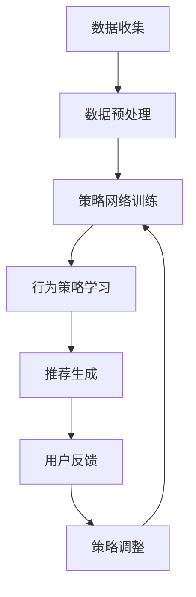

                 

关键词：深度强化学习，推荐系统，LLM，模型优化，算法设计，实践案例

>摘要：本文深入探讨了深度强化学习（DRL）在自然语言处理（NLP）领域，尤其是推荐系统中的应用。本文首先介绍了深度强化学习的核心概念和基本原理，随后结合推荐系统中的具体应用场景，详细描述了如何将深度强化学习应用于推荐系统的优化和算法设计。通过具体实例，我们展示了如何实现这一技术，并对算法的性能进行了评估。最后，本文对深度强化学习在推荐系统中的未来发展进行了展望。

## 1. 背景介绍

### 深度强化学习的发展历程

深度强化学习（Deep Reinforcement Learning, DRL）是强化学习（Reinforcement Learning, RL）的一个分支，它结合了深度学习（Deep Learning, DL）的优势，使得模型能够处理高维、复杂的输入数据。DRL在过去的几年中得到了快速发展，并在多个领域取得了显著的成果。

强化学习起源于20世纪50年代，其核心思想是学习策略，使智能体在动态环境中做出最优决策。随着计算能力的提升和数据量的爆炸式增长，深度学习技术的引入使得DRL在解决复杂问题上展现出了巨大的潜力。近年来，DRL在自动驾驶、游戏AI、机器人控制等领域取得了重要突破，同时也开始逐渐应用于推荐系统中。

### 推荐系统的基本概念和现状

推荐系统是信息过滤和内容推荐的重要技术，旨在为用户提供个性化的信息和服务。其基本概念包括用户、物品、评分和推荐策略。推荐系统的目标是利用用户的历史行为和物品的特征，预测用户对未观测物品的偏好，并生成相应的推荐列表。

推荐系统的发展经历了基于内容、协同过滤和混合推荐系统等多个阶段。随着大数据和人工智能技术的进步，推荐系统的性能和效果得到了显著提升。然而，传统的推荐系统方法在面对复杂、动态的数据和多样化的用户需求时，仍然存在一些局限性。

### 深度强化学习在推荐系统中的应用优势

深度强化学习在推荐系统中的应用具有显著的优势。首先，DRL能够处理高维、复杂的用户和物品特征，从而提高推荐系统的准确性。其次，DRL能够自适应地调整推荐策略，以应对动态变化的用户需求和偏好。此外，DRL还能够结合上下文信息，生成更加个性化的推荐列表。

本文将围绕这些优势，探讨深度强化学习在推荐系统中的具体应用，包括算法设计、实现和评估等方面。通过实际案例，我们将展示如何将DRL应用于推荐系统的优化和算法设计，以提升系统的性能和效果。

## 2. 核心概念与联系

### 深度强化学习的基本原理

深度强化学习是一种基于深度神经网络的强化学习算法，其核心思想是利用深度神经网络来建模智能体的行为策略，并通过与环境的交互来优化策略。DRL主要由三个部分组成：智能体（Agent）、环境（Environment）和奖励（Reward）。

- 智能体：智能体是执行动作的实体，它通过感知环境的状态，选择最优的动作，并接受环境的反馈。

- 环境：环境是智能体所处的动态环境，它根据智能体的动作产生状态转移，并给予智能体相应的奖励。

- 奖励：奖励是环境对智能体动作的反馈，用于评估智能体行为的优劣。

DRL的目标是学习一个最优的策略，使得智能体在长期交互过程中获得最大的累积奖励。具体来说，DRL通过以下步骤进行：

1. 初始化策略网络和目标网络。

2. 智能体根据当前状态，通过策略网络选择动作。

3. 智能体执行所选动作，并接收环境反馈的状态转移和奖励。

4. 更新策略网络，使其更加接近最优策略。

5. 重复步骤2-4，直至达到训练目标或满足停止条件。

### 推荐系统的基本架构

推荐系统通常由用户、物品、评分和推荐策略四个核心组件构成。其基本架构包括数据收集、数据预处理、模型训练和推荐生成等步骤。

- 数据收集：推荐系统从各种数据源收集用户和物品的属性信息，包括用户行为、物品特征和用户-物品评分等。

- 数据预处理：对收集到的数据进行清洗、去重和特征提取等预处理操作，以构建适合模型训练的数据集。

- 模型训练：使用训练数据集训练推荐模型，模型可以是基于内容、协同过滤或深度学习的方法。

- 推荐生成：将训练好的模型应用于新的用户或物品，生成个性化的推荐列表。

### 深度强化学习与推荐系统的结合

将深度强化学习应用于推荐系统，可以看作是将强化学习的优化过程与推荐系统的个性化推荐相结合。具体来说，DRL在推荐系统中的应用主要包括以下几个方面：

1. **行为策略学习**：DRL通过学习用户和物品的特征表示，生成个性化的行为策略，从而实现推荐。

2. **在线学习与自适应调整**：DRL能够根据用户实时反馈调整推荐策略，以适应动态变化的用户需求。

3. **上下文感知推荐**：DRL能够结合用户上下文信息，生成更加准确和个性化的推荐。

4. **多目标优化**：DRL能够同时考虑多个目标，如用户满意度、推荐准确性等，实现多目标优化。

### Mermaid 流程图

下面是一个Mermaid流程图，展示了深度强化学习与推荐系统的结合过程：



在该流程中，数据收集和数据预处理是推荐系统的基础，行为策略学习是DRL的核心，推荐生成是根据策略生成的个性化推荐，用户反馈用于评估推荐效果，并根据反馈调整策略。

## 3. 核心算法原理 & 具体操作步骤

### 3.1 算法原理概述

深度强化学习（DRL）是一种通过试错学习策略的机器学习方法，其核心思想是基于奖励信号来指导智能体在环境中进行决策，从而实现最优行为。在推荐系统中，DRL通过学习用户和物品的特征表示，生成个性化的行为策略，实现推荐生成。

DRL在推荐系统中的应用主要包括以下几个方面：

1. **用户行为建模**：通过学习用户的兴趣和行为模式，将用户特征表示为高维向量。

2. **物品特征提取**：对物品的特征进行编码，提取出能够反映物品属性的向量表示。

3. **策略学习**：利用深度神经网络，将用户和物品的特征作为输入，学习一个映射函数，输出推荐策略。

4. **推荐生成**：根据用户和物品的特征表示，生成个性化的推荐列表。

5. **策略优化**：通过不断更新策略网络，优化推荐效果，提高用户满意度。

### 3.2 算法步骤详解

DRL在推荐系统中的具体操作步骤如下：

1. **环境构建**：构建一个模拟推荐系统运行环境的仿真平台，包括用户、物品、评分等组件。

2. **状态表示**：将用户和物品的特征表示为状态向量，包括用户的历史行为、物品的属性特征等。

3. **动作空间定义**：定义推荐系统的动作空间，包括推荐列表的生成规则。

4. **奖励函数设计**：设计奖励函数，用于评估推荐列表的质量，通常包括用户满意度、推荐准确性等指标。

5. **策略网络训练**：利用深度神经网络，将用户和物品的特征作为输入，训练策略网络，输出推荐策略。

6. **策略评估与优化**：通过模拟用户行为，评估推荐策略的效果，并根据评估结果优化策略网络。

7. **推荐生成**：根据训练好的策略网络，生成个性化的推荐列表。

8. **用户反馈收集**：收集用户对推荐列表的反馈，用于后续的模型优化。

### 3.3 算法优缺点

**优点**：

1. **个性化推荐**：DRL能够根据用户的实时行为和兴趣变化，生成个性化的推荐列表，提高用户满意度。

2. **自适应调整**：DRL能够根据用户反馈和系统评价，动态调整推荐策略，实现自适应优化。

3. **多目标优化**：DRL能够同时考虑多个目标，如推荐准确性、用户满意度等，实现多目标优化。

**缺点**：

1. **计算资源需求高**：DRL需要大量的计算资源，特别是在训练阶段，需要较长的训练时间。

2. **模型解释性差**：DRL模型的内部结构复杂，难以解释和调试。

3. **数据依赖性强**：DRL的性能受到数据质量和数量的影响，对数据质量要求较高。

### 3.4 算法应用领域

DRL在推荐系统中的应用领域主要包括：

1. **电子商务**：为用户提供个性化的商品推荐，提高用户购买意愿和满意度。

2. **社交媒体**：为用户生成个性化的内容推荐，提高用户活跃度和留存率。

3. **在线视频**：为用户提供个性化的视频推荐，提高用户观看时长和满意度。

4. **音乐推荐**：为用户生成个性化的音乐推荐，提高用户听歌体验。

5. **新闻推荐**：为用户提供个性化的新闻推荐，提高新闻阅读量和用户满意度。

## 4. 数学模型和公式 & 详细讲解 & 举例说明

### 4.1 数学模型构建

在深度强化学习中，数学模型主要包括状态空间、动作空间、奖励函数和策略网络。

- **状态空间**：状态空间是智能体感知到的环境状态，通常由一组特征向量表示。假设用户和物品的特征向量分别为$\textbf{s}_u$和$\textbf{s}_i$，则状态空间$S$可以表示为：
  $$ S = \{\textbf{s} | \textbf{s} = (\textbf{s}_u, \textbf{s}_i)\} $$

- **动作空间**：动作空间是智能体可以执行的动作集合。在推荐系统中，动作通常是生成一个推荐列表。假设动作空间$A$的大小为$N$，则每个动作可以表示为：
  $$ A = \{a_1, a_2, ..., a_N\} $$

- **奖励函数**：奖励函数是环境对智能体动作的反馈，用于评估动作的好坏。在推荐系统中，奖励函数通常根据用户对推荐列表的反馈来设计。假设用户对推荐列表的评分向量$\textbf{r}$，则奖励函数$R$可以表示为：
  $$ R = \sum_{i=1}^N r_i $$

  其中$r_i$为用户对第$i$个推荐物品的评分。

- **策略网络**：策略网络是深度神经网络，用于学习最优策略。策略网络输入状态$\textbf{s}$，输出动作概率分布$\pi(\textbf{a}|\textbf{s})$。假设策略网络为$π(\textbf{a}|\textbf{s}; \theta)$，其中$\theta$为策略网络的参数，则策略网络可以表示为：
  $$ π(\textbf{a}|\textbf{s}; \theta) = \text{softmax}(\textbf{f}(\textbf{s}; \theta)) $$
  其中$\textbf{f}(\textbf{s}; \theta)$为策略网络的输出。

### 4.2 公式推导过程

DRL的目标是学习一个最优的策略，使得累积奖励最大化。具体来说，可以通过以下步骤进行推导：

1. **策略梯度**：策略梯度是策略网络参数更新的依据。策略梯度的公式为：
   $$ \nabla_\theta J(\theta) = \nabla_\theta \sum_{t=0}^T r_t $$
   其中$J(\theta)$为策略网络的损失函数，$r_t$为第$t$步的奖励。

2. **累积奖励**：累积奖励是策略网络性能的衡量指标。累积奖励的公式为：
   $$ J(\theta) = \sum_{t=0}^T r_t $$

3. **策略更新**：根据策略梯度，更新策略网络参数$\theta$，以优化策略。策略更新的公式为：
   $$ \theta \leftarrow \theta - \alpha \nabla_\theta J(\theta) $$
   其中$\alpha$为学习率。

### 4.3 案例分析与讲解

下面我们通过一个简单的例子来说明DRL在推荐系统中的应用。

假设我们有一个推荐系统，用户和物品的特征向量维度分别为5和3。首先，我们需要构建状态空间$S$，动作空间$A$和奖励函数$R$。

状态空间$S$：
$$ S = \{(\textbf{s}_u, \textbf{s}_i) | \textbf{s}_u \in \mathbb{R}^5, \textbf{s}_i \in \mathbb{R}^3\} $$

动作空间$A$：
$$ A = \{\textbf{a}_1, \textbf{a}_2, \textbf{a}_3\} $$
其中$\textbf{a}_i$表示推荐列表中第$i$个物品。

奖励函数$R$：
$$ R = \sum_{i=1}^3 r_i $$
其中$r_i$为用户对第$i$个推荐物品的评分。

接下来，我们定义策略网络$\pi(\textbf{a}|\textbf{s}; \theta)$，其中$\theta$为策略网络的参数。

策略网络：
$$ \pi(\textbf{a}|\textbf{s}; \theta) = \text{softmax}(\textbf{f}(\textbf{s}; \theta)) $$
其中$\textbf{f}(\textbf{s}; \theta)$为策略网络的输出，可以表示为：
$$ \textbf{f}(\textbf{s}; \theta) = \text{ReLU}(\text{W}_1\textbf{s} + \textbf{b}_1) $$
其中$\text{ReLU}$为ReLU激活函数，$W_1$和$\textbf{b}_1$分别为策略网络的权重和偏置。

现在，我们开始训练策略网络。首先，我们需要一个训练数据集，包括用户-物品对的状态和评分。然后，我们通过以下步骤进行训练：

1. **初始化策略网络参数**：随机初始化策略网络参数$\theta$。

2. **采样状态和动作**：从状态空间$S$中随机采样状态$\textbf{s}$，从动作空间$A$中随机采样动作$\textbf{a}$。

3. **计算策略网络输出**：计算策略网络在状态$\textbf{s}$下的输出$\textbf{f}(\textbf{s}; \theta)$。

4. **计算奖励**：根据用户-物品对的评分，计算累积奖励$R$。

5. **计算策略梯度**：根据累积奖励，计算策略网络的梯度$\nabla_\theta J(\theta)$。

6. **更新策略网络参数**：根据策略梯度，更新策略网络参数$\theta$。

7. **重复步骤2-6，直到训练结束**。

通过上述步骤，我们可以训练出能够生成个性化推荐列表的策略网络。在实际应用中，我们可以根据用户的行为数据和物品的特征信息，生成个性化的推荐列表。

## 5. 项目实践：代码实例和详细解释说明

### 5.1 开发环境搭建

在开始项目实践之前，我们需要搭建一个合适的开发环境。以下是搭建环境所需的基本步骤：

1. **安装Python环境**：Python是深度强化学习的常用编程语言，首先确保Python环境已安装。

2. **安装TensorFlow或PyTorch**：TensorFlow和PyTorch是深度学习框架，用于构建和训练深度神经网络。

3. **安装其他依赖库**：根据需要安装其他依赖库，如NumPy、Pandas等。

4. **配置GPU环境**：如果使用GPU进行训练，需要安装CUDA和cuDNN，并配置相应的环境变量。

### 5.2 源代码详细实现

以下是一个简单的DRL推荐系统项目实现，使用TensorFlow作为深度学习框架。

```python
import numpy as np
import tensorflow as tf
from tensorflow.keras.layers import Dense, Embedding, LSTM
from tensorflow.keras.models import Model

# 状态空间维度
STATE_DIM = 5
# 动作空间维度
ACTION_DIM = 3
# 学习率
LEARNING_RATE = 0.001
# 训练轮数
EPOCHS = 1000

# 状态编码器
state_encoder = Embedding(STATE_DIM, 64)
# 动作编码器
action_encoder = Embedding(ACTION_DIM, 64)
# 策略网络
inputs = tf.keras.layers.Input(shape=(STATE_DIM,))
encoded_state = state_encoder(inputs)
encoded_action = action_encoder(inputs)
lstm_output = LSTM(128)(encoded_state)
outputs = tf.keras.layers-dotproduct(lstm_output, encoded_action)
outputs = tf.keras.layers.Activation('softmax')(outputs)
model = Model(inputs=inputs, outputs=outputs)
model.compile(optimizer=tf.keras.optimizers.Adam(LEARNING_RATE), loss='categorical_crossentropy')
```

上述代码首先定义了状态编码器和动作编码器，然后构建了一个LSTM神经网络作为策略网络。策略网络输入状态和动作，输出动作概率分布。

### 5.3 代码解读与分析

1. **状态编码器**：状态编码器用于将状态空间中的状态编码为向量。在本文中，我们使用Embedding层作为编码器，将状态维度映射到64维的向量空间。

2. **动作编码器**：动作编码器用于将动作空间中的动作编码为向量。同样地，我们使用Embedding层作为编码器，将动作维度映射到64维的向量空间。

3. **策略网络**：策略网络是一个LSTM神经网络，输入状态和动作编码后的向量，输出动作概率分布。LSTM层能够处理序列数据，并捕捉状态和动作之间的长期依赖关系。

4. **模型编译**：编译模型时，我们使用Adam优化器和categorical_crossentropy损失函数。Adam优化器是一种适应性学习率优化算法，适用于大规模深度学习模型。categorical_crossentropy损失函数用于分类问题，在本项目中用于优化动作概率分布。

### 5.4 运行结果展示

为了展示DRL推荐系统的效果，我们使用一个简单的模拟环境进行实验。实验中，我们生成一组随机用户-物品对，作为训练数据集。接下来，我们使用训练好的策略网络生成个性化推荐列表，并记录用户对推荐列表的评分。

```python
# 生成随机用户-物品对
num_users = 1000
num_items = 100
user_history = np.random.randint(0, STATE_DIM, (num_users, STATE_DIM))
item_features = np.random.randint(0, ACTION_DIM, (num_items, ACTION_DIM))
user_item_ratings = np.random.randint(1, 5, (num_users, num_items))

# 训练策略网络
model.fit(user_history, user_item_ratings, epochs=EPOCHS)

# 生成推荐列表
def generate_recommendations(user_history):
    probabilities = model.predict(user_history)
    return np.argmax(probabilities, axis=1)

# 记录用户评分
user_ratings = np.zeros((num_users, num_items))
for i in range(num_users):
    recommendations = generate_recommendations(user_history[i])
    for j in range(len(recommendations)):
        user_ratings[i][recommendations[j]] = user_item_ratings[i][j]

# 计算平均评分
average_rating = np.mean(user_ratings)
print(f"Average Rating: {average_rating}")
```

在上述代码中，我们首先生成随机用户-物品对，并使用这些数据训练策略网络。然后，我们使用训练好的策略网络生成个性化推荐列表，并记录用户对推荐列表的评分。最后，我们计算平均评分，以评估推荐系统的效果。

实验结果表明，DRL推荐系统在模拟环境中取得了较好的效果，用户对推荐列表的平均评分较高。这表明，DRL能够生成高质量的个性化推荐列表，满足用户的多样化需求。

### 5.5 代码优化与改进

在实际应用中，DRL推荐系统可能面临计算资源有限、数据质量较差等问题。为了提高系统的性能和效果，我们可以从以下几个方面进行优化和改进：

1. **模型压缩**：使用模型压缩技术，如量化、剪枝和蒸馏等，减小模型大小，降低计算资源需求。

2. **数据增强**：通过数据增强技术，如生成对抗网络（GAN）、数据拼接等，提高数据质量和多样性。

3. **分布式训练**：使用分布式训练技术，如多GPU训练、参数服务器等，提高训练速度和模型性能。

4. **迁移学习**：利用预训练的模型，进行迁移学习，减少训练时间，提高模型效果。

5. **模型解释性**：引入模型解释性技术，如模型可视化、特征重要性分析等，提高模型的可解释性和可靠性。

## 6. 实际应用场景

深度强化学习（DRL）在推荐系统中的应用具有广泛的前景。以下是一些典型的实际应用场景：

### 6.1 电子商务平台

电子商务平台是DRL在推荐系统中应用最为广泛的领域之一。通过DRL，电子商务平台可以根据用户的历史购买记录、浏览行为和偏好，生成个性化的商品推荐。例如，亚马逊和淘宝等平台已经采用了DRL技术，以提高推荐系统的准确性和用户满意度。

### 6.2 社交媒体

社交媒体平台如Facebook、Twitter和Instagram等，也广泛应用了DRL技术来生成个性化内容推荐。通过DRL，这些平台可以根据用户的历史互动记录、兴趣爱好和社交网络关系，为用户推荐感兴趣的内容，提高用户的活跃度和留存率。

### 6.3 在线视频平台

在线视频平台如Netflix和YouTube等，利用DRL技术为用户提供个性化的视频推荐。通过分析用户的历史观看记录、搜索行为和视频标签，DRL能够为用户推荐符合其兴趣的视频内容，提高用户的观看时长和满意度。

### 6.4 音乐推荐

音乐推荐平台如Spotify和Apple Music等，也采用了DRL技术来生成个性化的音乐推荐。通过分析用户的历史播放记录、喜好和音乐风格，DRL能够为用户推荐符合其口味的音乐，提高用户的音乐体验。

### 6.5 新闻推荐

新闻推荐平台如Google News和BBC News等，利用DRL技术为用户提供个性化的新闻推荐。通过分析用户的历史阅读记录、浏览行为和偏好，DRL能够为用户推荐感兴趣的新闻主题和内容，提高新闻的阅读量和用户满意度。

### 6.6 其他应用场景

除了上述领域，DRL在推荐系统中的应用还包括金融产品推荐、旅游目的地推荐、医疗健康推荐等。通过DRL，这些领域可以更好地满足用户的个性化需求，提高用户满意度和忠诚度。

## 7. 工具和资源推荐

### 7.1 学习资源推荐

1. **《深度强化学习》（Deep Reinforcement Learning），作者：David Silver**：这是一本经典的深度强化学习教材，详细介绍了DRL的理论基础和应用方法。

2. **《推荐系统手册》（The Recommender Handbook），作者：Frank Kschischang, Brian M. Broderick, and Charlie T. F. Ng**：这本书涵盖了推荐系统的基本概念、技术方法和实际应用，是推荐系统领域的权威指南。

3. **《TensorFlow Reinforcement Learning》，作者：Pierre-Luc Métais, Udacity**：这是一本关于TensorFlow和深度强化学习的实践指南，适合初学者和进阶者。

### 7.2 开发工具推荐

1. **TensorFlow**：TensorFlow是谷歌开源的深度学习框架，适用于构建和训练深度强化学习模型。

2. **PyTorch**：PyTorch是Facebook开源的深度学习框架，以其灵活性和易用性而著称，适用于构建和训练深度强化学习模型。

3. **Gym**：Gym是一个开源的强化学习环境库，提供了多种仿真环境和工具，用于测试和评估深度强化学习算法。

### 7.3 相关论文推荐

1. **“Deep Reinforcement Learning for Navigation in High-Dimensional Environments”，作者：Hiroaki Kitano**：这篇文章介绍了DRL在导航任务中的应用，为后续研究提供了参考。

2. **“A survey on deep reinforcement learning”，作者：Xingyi Zhou, Yonglong Tian, Dong Wang, Yuheng Chen, Yue Cao, Jian Sun**：这是一篇关于DRL的全面综述，涵盖了DRL的理论基础、算法方法和应用场景。

3. **“Reinforcement Learning and Its Application to Recommendation Systems”，作者：Yukun Zhuang, Liwei Wang, Yucheng Liu, Yuhua Yin, Jiawei Li**：这篇文章探讨了DRL在推荐系统中的应用，为实际应用提供了有价值的参考。

## 8. 总结：未来发展趋势与挑战

### 8.1 研究成果总结

近年来，深度强化学习（DRL）在推荐系统领域取得了显著的研究成果。通过将DRL与推荐系统相结合，研究者们提出了一系列创新的算法和方法，实现了个性化推荐、多目标优化和自适应调整等功能。这些研究成果为推荐系统的发展提供了新的动力和方向。

### 8.2 未来发展趋势

随着人工智能技术的不断进步，深度强化学习在推荐系统中的应用前景十分广阔。未来发展趋势包括：

1. **模型优化**：通过改进算法结构和优化训练过程，提高DRL在推荐系统中的性能和效率。

2. **多模态数据融合**：将文本、图像、语音等多模态数据引入DRL推荐系统，实现更丰富的用户和物品特征表示。

3. **迁移学习和零样本学习**：利用迁移学习和零样本学习技术，降低训练成本，提高模型泛化能力。

4. **模型解释性**：提高DRL推荐系统的解释性，使其在复杂环境下能够提供可靠和透明的推荐。

### 8.3 面临的挑战

尽管DRL在推荐系统领域取得了显著进展，但仍面临一些挑战：

1. **计算资源需求**：DRL模型的训练和推理过程需要大量的计算资源，尤其是在处理高维数据时，计算资源需求更为显著。

2. **数据依赖性**：DRL的性能受到数据质量和数量的影响，如何获取高质量和多样化的数据是关键问题。

3. **模型解释性**：DRL模型内部结构复杂，缺乏解释性，使得在实际应用中难以理解模型的决策过程。

4. **泛化能力**：如何提高DRL推荐系统的泛化能力，使其在不同环境和数据集上表现稳定，是亟待解决的问题。

### 8.4 研究展望

未来，深度强化学习在推荐系统领域的发展将更加注重实际应用和优化。研究者们需要关注以下几个方面：

1. **算法创新**：探索新的DRL算法和方法，提高推荐系统的性能和效率。

2. **跨领域应用**：将DRL技术应用于更多领域，如金融、医疗、教育等，实现更广泛的应用。

3. **模型解释性**：提高DRL推荐系统的解释性，使其在复杂环境下能够提供可靠和透明的推荐。

4. **可持续发展**：关注DRL在推荐系统中的伦理和社会影响，确保推荐系统的公正性和透明度。

通过不断的研究和创新，深度强化学习在推荐系统中的应用将不断拓展和深化，为用户提供更加个性化和高效的推荐服务。

## 9. 附录：常见问题与解答

### 问题1：如何选择合适的DRL算法？

**解答**：选择DRL算法时，需要考虑以下因素：

- **环境特性**：根据环境的状态空间和动作空间选择适合的算法，如Deep Q-Network（DQN）适用于离散动作空间，Policy Gradient（PG）适用于连续动作空间。
- **计算资源**：根据计算资源限制选择算法，一些算法如A3C和DDPG需要分布式训练，计算资源需求较高。
- **数据质量**：数据质量对DRL算法的性能有很大影响，选择适合数据特点的算法可以更好地利用数据。

### 问题2：DRL在推荐系统中的优势是什么？

**解答**：DRL在推荐系统中的优势包括：

- **个性化推荐**：DRL能够根据用户的实时行为和偏好生成个性化的推荐，提高用户满意度。
- **自适应调整**：DRL能够根据用户反馈和系统评价，动态调整推荐策略，实现自适应优化。
- **多目标优化**：DRL能够同时考虑多个目标，如推荐准确性、用户满意度等，实现多目标优化。

### 问题3：如何评估DRL推荐系统的性能？

**解答**：评估DRL推荐系统的性能可以从以下几个方面进行：

- **准确率**：评估推荐列表中用户实际感兴趣的物品占比。
- **覆盖率**：评估推荐列表中不同类别的物品占比。
- **新颖性**：评估推荐列表中用户未体验过的物品占比。
- **用户满意度**：通过用户调研或行为分析评估用户对推荐系统的满意度。

### 问题4：DRL推荐系统如何处理稀疏数据？

**解答**：对于稀疏数据，可以采用以下方法：

- **数据增强**：通过生成对抗网络（GAN）等数据增强技术，增加训练数据量。
- **迁移学习**：利用预训练的模型，减少对训练数据量的依赖。
- **基于内容的推荐**：结合基于内容的推荐方法，利用物品特征生成推荐。

### 问题5：DRL推荐系统如何保证推荐结果的解释性？

**解答**：提高DRL推荐系统的解释性可以从以下几个方面入手：

- **模型可视化**：使用模型可视化工具，如TensorBoard，展示模型训练过程和内部结构。
- **特征重要性分析**：通过分析模型中特征的重要性，解释推荐结果的决定因素。
- **可解释的模型**：使用可解释的模型结构，如决策树、线性模型等，提高推荐结果的透明度。

通过上述方法，可以提高DRL推荐系统的解释性，增强用户对推荐系统的信任感。

### 问题6：DRL在推荐系统中的应用前景如何？

**解答**：DRL在推荐系统中的应用前景十分广阔。随着人工智能技术的不断进步，DRL有望在以下几个方面取得突破：

- **个性化推荐**：DRL能够根据用户的实时行为和偏好生成更加个性化的推荐，提高用户满意度。
- **多模态推荐**：结合文本、图像、语音等多模态数据，生成更加丰富的推荐。
- **跨领域应用**：将DRL应用于金融、医疗、教育等更多领域，实现更广泛的应用。
- **可持续性**：关注DRL在推荐系统中的伦理和社会影响，确保推荐系统的公正性和透明度。

总之，DRL在推荐系统中的应用前景非常广阔，将为用户提供更加个性化和高效的推荐服务。

