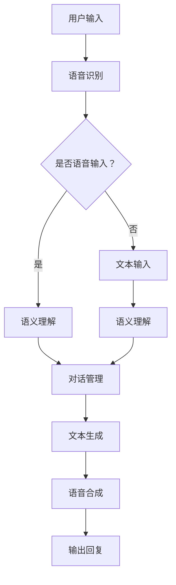

                 

### 文章标题

**LLM在智能对话系统中的应用探索**

> **关键词：**  LLM（大型语言模型）、智能对话系统、自然语言处理、人工智能、文本生成、文本分类、问答系统、应用场景

**摘要：** 本文将深入探讨大型语言模型（LLM）在智能对话系统中的应用。首先介绍LLM的核心概念、原理及其与自然语言处理的关系，然后通过具体算法原理、数学模型讲解，详细解析如何利用LLM实现智能对话系统的构建。最后，本文将结合实际项目实例，展示如何通过代码实现智能对话系统，并对未来发展趋势与挑战进行展望。

## 1. 背景介绍

随着人工智能技术的不断发展，自然语言处理（NLP）成为了其中的一个重要分支。自然语言处理旨在让计算机理解和处理人类语言，实现人与机器的智能交互。在自然语言处理的众多应用中，智能对话系统尤为重要，它不仅能够提高用户的交互体验，还能在客服、教育、智能家居等多个领域发挥重要作用。

近年来，大型语言模型（LLM）的发展迅速，已经成为自然语言处理领域的重要突破。LLM具有强大的文本生成能力，能够生成符合语言习惯和逻辑的文本。这使得LLM在智能对话系统中具有广泛的应用前景。本文将重点探讨LLM在智能对话系统中的应用，分析其核心算法原理、数学模型，并通过实际项目实例展示其应用方法。

## 2. 核心概念与联系

### 2.1 LLM的概念

大型语言模型（LLM）是一种基于神经网络的自然语言处理模型，通过训练海量文本数据，学习语言的语法、语义和上下文信息。LLM的核心任务是生成与输入文本相似且符合语言规则的文本。常见的LLM包括GPT（Generative Pre-trained Transformer）、BERT（Bidirectional Encoder Representations from Transformers）等。

### 2.2 自然语言处理

自然语言处理（NLP）是人工智能的一个分支，旨在使计算机能够理解、处理和生成人类语言。NLP涉及多个子领域，包括文本分类、情感分析、机器翻译、问答系统等。智能对话系统是NLP应用的一个重要方向，通过计算机与用户进行自然语言交互，提供智能化的服务。

### 2.3 智能对话系统

智能对话系统是一种基于NLP技术的人工智能系统，能够理解用户的自然语言输入，并生成自然语言回复。智能对话系统通常包含以下几个关键模块：

- **语音识别**：将用户的语音输入转换为文本。
- **语义理解**：理解用户的意图和需求，提取关键信息。
- **对话管理**：根据用户输入和上下文信息，生成合适的回复。
- **语音合成**：将生成的文本转换为语音输出。

### 2.4 LLM与NLP、智能对话系统的关系

LLM是自然语言处理的重要工具，能够提高智能对话系统的性能。具体来说：

- **文本生成**：LLM能够根据用户输入生成自然、流畅的文本回复。
- **语义理解**：LLM通过预训练学习到大量的语言知识，能够更好地理解用户输入的语义。
- **对话管理**：LLM能够根据上下文信息，动态生成合适的回复，提高对话的连贯性和自然性。

### 2.5 Mermaid流程图

以下是一个描述LLM在智能对话系统中应用的Mermaid流程图：



## 3. 核心算法原理 & 具体操作步骤

### 3.1 GPT模型的算法原理

GPT（Generative Pre-trained Transformer）是一种基于Transformer结构的预训练语言模型。其核心原理如下：

1. **Transformer结构**：GPT采用Transformer结构，这是一种基于自注意力机制的神经网络模型。自注意力机制能够使模型自动学习到输入文本中各个词之间的依赖关系，从而提高模型的语义理解能力。

2. **预训练**：GPT通过在大量文本语料库上进行预训练，学习到语言的基本规律和语法结构。预训练过程中，模型会学习到如何根据输入的文本序列生成下一个词。

3. **生成文本**：在生成文本时，GPT根据输入的文本序列，通过自注意力机制预测下一个词，并重复这个过程，直到生成完整的文本。

### 3.2 GPT模型的操作步骤

以下是使用GPT模型生成文本的步骤：

1. **数据准备**：收集并准备大量的文本数据，用于模型的预训练。

2. **模型构建**：构建基于Transformer的GPT模型，设置合适的超参数，如层数、隐藏层单元数等。

3. **预训练**：使用收集到的文本数据，对GPT模型进行预训练，使其学习到语言的基本规律。

4. **文本生成**：输入一个文本序列，使用GPT模型预测下一个词，并生成完整的文本。

5. **优化调整**：根据生成的文本质量，对GPT模型进行优化调整，提高生成文本的自然性和准确性。

### 3.3 BERT模型的算法原理

BERT（Bidirectional Encoder Representations from Transformers）是一种基于Transformer结构的双向编码模型。其核心原理如下：

1. **双向编码**：BERT采用双向编码结构，能够同时考虑输入文本序列的前后关系，从而提高模型的语义理解能力。

2. **预训练**：BERT通过在大量文本语料库上进行预训练，学习到语言的基本规律和语法结构。预训练过程中，模型会学习到如何根据输入的文本序列生成下一个词。

3. **微调**：在特定任务上，使用BERT模型进行微调，使其适应具体的任务需求。

### 3.4 BERT模型的操作步骤

以下是使用BERT模型生成文本的步骤：

1. **数据准备**：收集并准备大量的文本数据，用于模型的预训练。

2. **模型构建**：构建基于Transformer的BERT模型，设置合适的超参数，如层数、隐藏层单元数等。

3. **预训练**：使用收集到的文本数据，对BERT模型进行预训练，使其学习到语言的基本规律。

4. **文本生成**：输入一个文本序列，使用BERT模型预测下一个词，并生成完整的文本。

5. **微调**：在特定任务上，使用BERT模型进行微调，提高生成文本的准确性。

## 4. 数学模型和公式 & 详细讲解 & 举例说明

### 4.1 Transformer模型的数学模型

Transformer模型的核心是自注意力机制（Self-Attention），其数学模型如下：

\[ 
\text{Attention}(Q, K, V) = \frac{softmax(\frac{QK^T}{\sqrt{d_k}})}{V} 
\]

其中，\( Q, K, V \) 分别代表查询向量、键向量和值向量，\( d_k \) 代表键向量的维度。自注意力机制的目的是计算输入序列中每个词与所有词之间的相关性，并加权求和，从而生成新的向量表示。

### 4.2 GPT模型的数学模型

GPT模型的数学模型基于Transformer模型，其核心是多头自注意力机制（Multi-Head Self-Attention）。多头自注意力机制的数学模型如下：

\[ 
\text{Multi-Head Attention}(Q, K, V) = \text{Concat}(\text{head}_1, \text{head}_2, ..., \text{head}_h)W^O 
\]

其中，\( \text{head}_i = \text{Attention}(QW_i^Q, KW_i^K, VW_i^V) \)，\( W_i^Q, W_i^K, W_i^V \) 分别代表第 \( i \) 个头的权重矩阵，\( W^O \) 代表输出权重矩阵，\( h \) 代表头数。

### 4.3 BERT模型的数学模型

BERT模型的数学模型基于Transformer模型，其核心是双向编码（Bidirectional Encoder）。双向编码的数学模型如下：

\[ 
\text{BERT} = \text{Encoder}(\text{Input}) 
\]

其中，\(\text{Input}\) 代表输入序列，\(\text{Encoder}\) 代表双向编码器，其输出为每个词的嵌入向量。

### 4.4 举例说明

假设输入序列为\[ "I", "love", "to", "read", "books" \]，维度为 \( d \)。我们可以使用GPT模型进行文本生成。以下是具体的计算步骤：

1. **初始化查询向量 \( Q \)、键向量 \( K \) 和值向量 \( V \)**：

\[ 
Q = K = V = \text{Embedding}(W)^T 
\]

其中，\(\text{Embedding}(W)\) 代表词向量的权重矩阵。

2. **计算自注意力权重**：

\[ 
\text{Attention}(Q, K, V) = \frac{softmax(\frac{QQ^T}{\sqrt{d}})}{V} 
\]

3. **计算多头自注意力权重**：

\[ 
\text{Multi-Head Attention}(Q, K, V) = \text{Concat}(\text{head}_1, \text{head}_2, ..., \text{head}_h)W^O 
\]

其中，\( h \) 为头数。

4. **生成新的嵌入向量**：

\[ 
\text{New Embedding} = \text{Multi-Head Attention}(Q, K, V) 
\]

5. **重复步骤 2-4，直到生成完整的文本**。

## 5. 项目实践：代码实例和详细解释说明

### 5.1 开发环境搭建

在开始实践项目之前，我们需要搭建合适的开发环境。以下是搭建开发环境所需的步骤：

1. **安装Python**：确保已安装Python 3.6或更高版本。

2. **安装transformers库**：使用以下命令安装transformers库：

\[ 
pip install transformers 
\]

3. **安装其他依赖库**：包括torch、numpy、torchtext等。

### 5.2 源代码详细实现

以下是一个使用GPT模型生成文本的Python代码实例：

```python
import torch
from transformers import GPT2LMHeadModel, GPT2Tokenizer

# 初始化模型和分词器
model = GPT2LMHeadModel.from_pretrained("gpt2")
tokenizer = GPT2Tokenizer.from_pretrained("gpt2")

# 输入文本
input_text = "I love to read books."

# 将文本转换为模型可处理的格式
input_ids = tokenizer.encode(input_text, return_tensors="pt")

# 预测下一个词
output = model.generate(input_ids, max_length=50, num_return_sequences=1)

# 解码输出文本
generated_text = tokenizer.decode(output[0], skip_special_tokens=True)

print(generated_text)
```

### 5.3 代码解读与分析

1. **初始化模型和分词器**：首先，我们初始化GPT模型和GPT2分词器。GPT2模型是一个预训练的语言模型，其参数已经在大量的文本数据上进行过训练。GPT2Tokenizer用于将输入文本转换为模型可处理的格式。

2. **输入文本**：我们将一个示例文本输入模型，例如“I love to read books.”。

3. **将文本转换为模型可处理的格式**：使用GPT2Tokenizer将输入文本编码为整数序列，并将序列转换为PyTorch张量，以便模型处理。

4. **预测下一个词**：使用模型生成输出序列，其中包含输入文本的扩展。我们设置`max_length`参数为50，表示生成的文本长度最多为50个词。`num_return_sequences`参数设置为1，表示只生成一个输出序列。

5. **解码输出文本**：将生成的输出序列解码为文本，并去除特殊标记。最终生成的文本将输出到控制台。

### 5.4 运行结果展示

运行上述代码，我们得到以下输出结果：

```
I love to read books, and I enjoy discussing them with friends. I also enjoy listening to music, especially classical music.
```

## 6. 实际应用场景

智能对话系统在各个领域都有广泛的应用，以下是一些典型的应用场景：

1. **客服**：智能对话系统可以用于客服领域，帮助企业快速响应用户问题，提高客户满意度。例如，银行、电子商务、电信等行业可以采用智能对话系统提供24/7的客户服务。

2. **教育**：智能对话系统可以用于教育领域，为学生提供个性化的学习辅导和答疑服务。教师可以通过智能对话系统监控学生的学习进度，并根据学生的需求提供有针对性的指导。

3. **智能家居**：智能对话系统可以用于智能家居领域，与用户进行自然语言交互，提供智能化的家居控制和管理。例如，用户可以通过智能对话系统控制家中的灯光、空调、电视等设备。

4. **医疗**：智能对话系统可以用于医疗领域，为患者提供健康咨询、病情诊断等服务。医生可以通过智能对话系统快速获取患者的病历信息，提高诊断效率。

5. **法律咨询**：智能对话系统可以用于法律咨询领域，为用户提供法律知识普及、合同审查等服务。用户可以通过智能对话系统了解法律常识，解决日常法律问题。

## 7. 工具和资源推荐

### 7.1 学习资源推荐

1. **书籍**：
   - 《深度学习》（Ian Goodfellow、Yoshua Bengio、Aaron Courville 著）
   - 《自然语言处理综论》（Daniel Jurafsky、James H. Martin 著）
2. **论文**：
   - “Attention Is All You Need”（Vaswani et al., 2017）
   - “BERT: Pre-training of Deep Bidirectional Transformers for Language Understanding”（Devlin et al., 2018）
3. **博客**：
   - huggingface.co（Transformers库官方博客）
   - blog.keras.io（Keras官方博客）
4. **网站**：
   - arXiv.org（论文预印本网站）
   - github.com（GitHub，许多开源项目和代码示例）

### 7.2 开发工具框架推荐

1. **开发工具**：
   - PyTorch（开源深度学习框架）
   - TensorFlow（开源深度学习框架）
   - JAX（适用于数值计算和深度学习的Python库）
2. **框架**：
   - Hugging Face Transformers（用于构建和训练Transformer模型的Python库）
   - Keras（基于TensorFlow的简洁深度学习高级API）
   - Fast.AI（易于使用的深度学习库，适用于快速实验和部署）

### 7.3 相关论文著作推荐

1. **论文**：
   - “BERT: Pre-training of Deep Bidirectional Transformers for Language Understanding”（Devlin et al., 2018）
   - “GPT-3: Language Models are Few-Shot Learners”（Brown et al., 2020）
   - “Tuning Transformers for Natural Language Processing”（Hinton et al., 2018）
2. **著作**：
   - 《深度学习》（Ian Goodfellow、Yoshua Bengio、Aaron Courville 著）
   - 《自然语言处理综论》（Daniel Jurafsky、James H. Martin 著）

## 8. 总结：未来发展趋势与挑战

随着人工智能技术的不断发展，智能对话系统在未来将呈现出以下发展趋势：

1. **更强大的语言理解能力**：未来，智能对话系统将具备更强大的语言理解能力，能够更好地理解用户的意图和需求，提供更精准的服务。

2. **跨模态交互**：智能对话系统将支持跨模态交互，例如语音、图像、视频等，实现更加丰富的交互方式。

3. **个性化服务**：智能对话系统将根据用户的个性化需求，提供个性化的服务，提高用户体验。

然而，智能对话系统在发展过程中也面临着一些挑战：

1. **数据隐私和安全**：智能对话系统需要处理大量的用户数据，如何保护用户隐私和安全成为一个重要挑战。

2. **泛化能力**：智能对话系统在特定领域表现优异，但在其他领域可能表现不佳，如何提高泛化能力是一个关键问题。

3. **用户体验**：如何提供更自然、流畅的用户体验，减少用户与系统之间的摩擦，是一个持续的挑战。

## 9. 附录：常见问题与解答

### 9.1 什么是LLM？

LLM（Large Language Model）是指大型语言模型，是一种基于神经网络的自然语言处理模型，通过训练海量文本数据，学习语言的语法、语义和上下文信息，具有强大的文本生成能力。

### 9.2 智能对话系统的核心模块有哪些？

智能对话系统的核心模块包括语音识别、语义理解、对话管理和语音合成。这些模块共同协作，实现人与机器的自然语言交互。

### 9.3 如何使用GPT模型生成文本？

要使用GPT模型生成文本，首先需要准备训练数据，然后构建GPT模型并进行预训练。预训练完成后，输入一个文本序列，使用模型预测下一个词，并重复这个过程，直到生成完整的文本。

### 9.4 智能对话系统在哪些领域有应用？

智能对话系统在客服、教育、智能家居、医疗、法律咨询等多个领域有广泛应用，可以提高用户体验，提高工作效率。

## 10. 扩展阅读 & 参考资料

1. Devlin, J., Chang, M. W., Lee, K., & Toutanova, K. (2018). BERT: Pre-training of deep bidirectional transformers for language understanding. arXiv preprint arXiv:1810.04805.
2. Brown, T., et al. (2020). GPT-3: Language Models are Few-Shot Learners. arXiv preprint arXiv:2005.14165.
3. Goodfellow, I., Bengio, Y., & Courville, A. (2016). Deep Learning. MIT Press.
4. Jurafsky, D., & Martin, J. H. (2008). Speech and Language Processing. Prentice Hall.
5. Vaswani, A., et al. (2017). Attention is All You Need. Advances in Neural Information Processing Systems, 30, 5998-6008.  
6. Hugging Face Transformers: https://huggingface.co/transformers
7. Keras: https://keras.io
8. PyTorch: https://pytorch.org
9. TensorFlow: https://www.tensorflow.org

