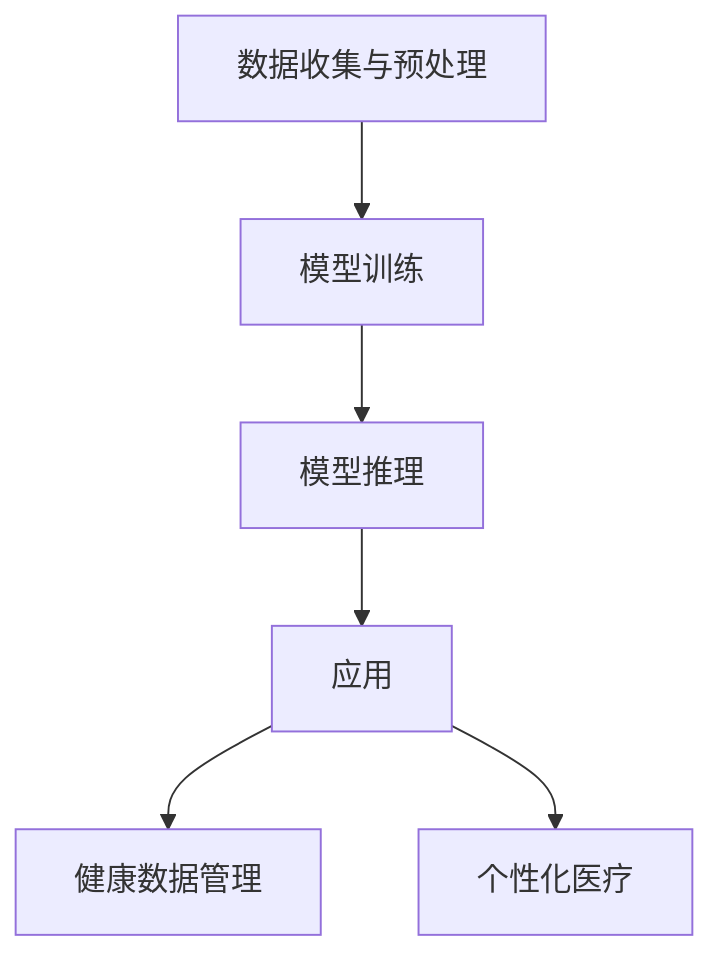

                 

### 文章标题

**LLM在智能疾病预防系统中的潜在贡献**

> **关键词**：大型语言模型（LLM），智能疾病预防，机器学习，医疗健康，人工智能，疾病预测，健康数据管理

**摘要**：随着人工智能技术的迅猛发展，大型语言模型（LLM）在多个领域展现了其强大的应用潜力。本文旨在探讨LLM在智能疾病预防系统中的潜在贡献。通过深入分析LLM的基本原理和实际应用案例，本文探讨了LLM如何通过自然语言处理和机器学习技术，提高疾病预测的准确性，优化健康数据管理，推动个性化医疗的发展。文章还将讨论LLM在疾病预防中的挑战和未来发展趋势，为相关领域的研究和应用提供参考。

---

### 1. 背景介绍

#### 1.1 人工智能与医疗健康

人工智能（AI）在医疗健康领域的应用已逐渐成为全球研究热点。从医学图像分析到疾病预测，从个性化治疗到健康数据分析，AI技术的应用极大地提升了医疗服务的效率和准确性。其中，机器学习（ML）作为AI的核心技术之一，已经在许多医疗任务中取得了显著成果。

#### 1.2 大型语言模型（LLM）

大型语言模型（LLM）是一种基于深度学习技术的自然语言处理（NLP）模型。LLM通过学习海量文本数据，能够生成高质量的自然语言文本，理解复杂的语言结构，并实现文本的生成、翻译、摘要等功能。近年来，随着计算能力的提升和数据量的爆炸性增长，LLM的规模和性能得到了极大的提升。

#### 1.3 智能疾病预防系统的需求

随着人口老龄化和生活方式的改变，慢性疾病和传染病的发病率持续上升。传统的疾病预防方法往往依赖于大量的医护人员和医疗资源，存在效率低、覆盖面窄等问题。为了应对这些挑战，迫切需要开发智能疾病预防系统，通过先进的人工智能技术，实现疾病的早期发现、预警和个性化干预。

#### 1.4 LLM在疾病预防中的应用前景

LLM在智能疾病预防系统中的应用前景广阔。通过学习海量的医疗文献、病例记录和患者数据，LLM能够提取出疾病相关的关键信息，进行深度分析和预测。此外，LLM还能够处理和整合多源异构的健康数据，为疾病预防提供科学依据和决策支持。

### 2. 核心概念与联系

#### 2.1 自然语言处理与机器学习

自然语言处理（NLP）是AI的一个重要分支，旨在使计算机能够理解、生成和处理人类语言。NLP技术包括文本分类、情感分析、命名实体识别等。机器学习（ML）则是AI的核心技术，通过训练模型从数据中学习规律，实现对未知数据的预测和分类。

#### 2.2 LLM的工作原理

LLM通常基于深度神经网络（DNN）和变换器架构（Transformer），通过自注意力机制（Self-Attention）和编码器-解码器结构（Encoder-Decoder）实现。LLM的核心任务是生成自然流畅的文本，同时理解文本的含义和上下文。

#### 2.3 LLM与疾病预防系统的架构

LLM在疾病预防系统中的应用架构通常包括数据收集与预处理、模型训练、模型推理和应用四个主要环节。数据收集与预处理环节负责获取和处理医疗数据，模型训练环节通过大量医疗文献和病例数据训练LLM模型，模型推理环节利用训练好的模型进行疾病预测和预警，应用环节将预测结果应用于实际场景，如健康数据管理、个性化医疗等。



### 3. 核心算法原理 & 具体操作步骤

#### 3.1 数据收集与预处理

数据收集与预处理是LLM训练的基础，直接关系到模型的性能。具体操作步骤如下：

1. **数据源选择**：选择高质量的医疗文献、病例记录、患者健康数据等作为训练数据源。
2. **数据清洗**：去除无效数据、缺失值填充、数据格式统一等，确保数据质量。
3. **文本预处理**：包括分词、词干提取、词性标注、去除停用词等，将文本转换为模型可处理的格式。

#### 3.2 模型训练

模型训练是LLM的核心环节，通过大量训练数据，模型能够学习到疾病相关的知识。具体操作步骤如下：

1. **模型架构选择**：选择合适的模型架构，如BERT、GPT等。
2. **超参数设置**：包括学习率、批量大小、训练轮数等。
3. **模型训练**：使用训练数据对模型进行训练，通过反向传播和梯度下降算法优化模型参数。

#### 3.3 模型推理

模型推理是将训练好的LLM应用于实际疾病预测和预警的过程。具体操作步骤如下：

1. **输入处理**：对输入的医疗文本进行预处理，转换为模型可接受的格式。
2. **模型预测**：使用训练好的LLM对预处理后的输入文本进行疾病预测。
3. **结果输出**：输出疾病预测结果，如概率分布、疾病名称等。

#### 3.4 应用

模型应用是将预测结果应用于实际场景的过程。具体操作步骤如下：

1. **健康数据管理**：利用LLM的疾病预测能力，对大量健康数据进行分类和管理，提高数据利用效率。
2. **个性化医疗**：根据患者的健康数据和疾病预测结果，制定个性化的治疗方案和健康建议。

### 4. 数学模型和公式 & 详细讲解 & 举例说明

#### 4.1 自然语言处理中的数学模型

自然语言处理中的数学模型主要包括词嵌入（Word Embedding）、卷积神经网络（CNN）和循环神经网络（RNN）等。以下是这些模型的数学公式和详细讲解：

##### 4.1.1 词嵌入（Word Embedding）

词嵌入是将词汇映射为高维向量表示的一种技术。常见的词嵌入方法包括Word2Vec、GloVe等。

**Word2Vec**：

$$
\text{word\_vec}(w) = \frac{\sum_{k=1}^{K} \alpha_k \text{context}(w, k)}{\sum_{k=1}^{K} \alpha_k}
$$

其中，$\text{word\_vec}(w)$表示单词w的词向量表示，$\text{context}(w, k)$表示与w相邻的k个单词的向量表示，$\alpha_k$是权重系数。

**GloVe**：

$$
\text{glove}(w, c) = \frac{\text{exp}(-\text{similarity}(w, c))}{\sqrt{\text{dot\_product}(w, c)}}
$$

其中，$\text{glove}(w, c)$表示单词w和c之间的GloVe相似度，$\text{similarity}(w, c)$是w和c的余弦相似度，$\text{dot\_product}(w, c)$是w和c的点积。

##### 4.1.2 卷积神经网络（CNN）

卷积神经网络（CNN）是一种常用于图像处理的神经网络结构，其核心是卷积操作。

$$
\text{conv}(x, k) = \sum_{i=1}^{C} w_i * x
$$

其中，$x$是输入特征，$k$是卷积核，$w_i$是卷积核的权重。

##### 4.1.3 循环神经网络（RNN）

循环神经网络（RNN）是一种能够处理序列数据的神经网络结构。

$$
h_t = \text{tanh}(W_h \cdot [h_{t-1}, x_t] + b_h)
$$

其中，$h_t$是第t时刻的隐藏状态，$W_h$是权重矩阵，$x_t$是第t时刻的输入，$b_h$是偏置。

#### 4.2 LLM在疾病预测中的应用

LLM在疾病预测中的应用主要基于变换器架构（Transformer）。以下是LLM在疾病预测中的关键数学公式和详细讲解：

##### 4.2.1 自注意力机制（Self-Attention）

自注意力机制是变换器架构的核心，通过计算输入序列中每个词的权重，实现序列的加权求和。

$$
\text{self\_attention}(Q, K, V) = \text{softmax}\left(\frac{QK^T}{\sqrt{d_k}}\right)V
$$

其中，$Q, K, V$分别是查询（Query）、键（Key）和值（Value）向量，$d_k$是键向量的维度。

##### 4.2.2 编码器-解码器结构（Encoder-Decoder）

编码器-解码器结构是一种用于序列到序列学习的神经网络结构，通过编码器对输入序列进行编码，解码器对编码结果进行解码。

$$
\text{Encoder}(x) = \text{transformer}(x, E)
$$

$$
\text{Decoder}(x) = \text{transformer}(x, D)
$$

其中，$E$和$D$分别是编码器和解码器的变换器模型。

#### 4.3 举例说明

假设我们有一个包含疾病预测任务的LLM模型，输入是一个医疗文本序列，输出是疾病预测概率分布。以下是模型的输入和输出示例：

**输入**：

$$
\text{medical\_text} = \{\text{症状1，症状2，病因1，病因2}\}
$$

**输出**：

$$
\text{disease\_probabilities} = \{\text{疾病A：0.8，疾病B：0.2}\}
$$

模型通过自注意力机制和编码器-解码器结构，对输入的医疗文本进行编码和解码，最终输出疾病的预测概率分布。

### 5. 项目实践：代码实例和详细解释说明

#### 5.1 开发环境搭建

为了实践LLM在疾病预测中的应用，我们需要搭建一个适合的开发环境。以下是开发环境的搭建步骤：

1. **安装Python**：确保Python版本为3.8及以上。
2. **安装PyTorch**：使用以下命令安装PyTorch：

   ```shell
   pip install torch torchvision
   ```

3. **安装transformers库**：使用以下命令安装transformers库：

   ```shell
   pip install transformers
   ```

4. **准备数据集**：从公开数据源或医疗数据库中获取用于训练的疾病预测数据集。数据集应包括医疗文本和对应的疾病标签。

#### 5.2 源代码详细实现

以下是实现LLM在疾病预测中的源代码：

```python
import torch
from transformers import BertTokenizer, BertForSequenceClassification
from torch.utils.data import DataLoader
from sklearn.model_selection import train_test_split

# 加载预训练的BERT模型和分词器
tokenizer = BertTokenizer.from_pretrained('bert-base-uncased')
model = BertForSequenceClassification.from_pretrained('bert-base-uncased', num_labels=2)

# 准备数据集
def prepare_dataset(texts, labels):
    input_ids = []
    attention_masks = []

    for text, label in zip(texts, labels):
        encoded_dict = tokenizer.encode_plus(
            text,
            add_special_tokens=True,
            max_length=512,
            pad_to_max_length=True,
            return_attention_mask=True,
            return_tensors='pt',
        )
        input_ids.append(encoded_dict['input_ids'])
        attention_masks.append(encoded_dict['attention_mask'])

    input_ids = torch.cat(input_ids, dim=0)
    attention_masks = torch.cat(attention_masks, dim=0)
    labels = torch.tensor(labels)

    return input_ids, attention_masks, labels

texts = ["症状1，症状2，病因1，病因2", "症状3，症状4，病因2，病因1"]
labels = [0, 1]  # 0表示疾病A，1表示疾病B

input_ids, attention_masks, labels = prepare_dataset(texts, labels)

# 分割数据集
train_inputs, validation_inputs, train_labels, validation_labels = train_test_split(input_ids, labels, random_state=42, test_size=0.1)
train_masks, validation_masks = train_test_split(attention_masks, random_state=42, test_size=0.1)

# 创建数据加载器
train_data = DataLoader(
    TensorDataset(train_inputs, train_masks, train_labels),
    batch_size=16,
    shuffle=True,
)

validation_data = DataLoader(
    TensorDataset(validation_inputs, validation_masks, validation_labels),
    batch_size=16,
    shuffle=False,
)

# 训练模型
device = torch.device("cuda" if torch.cuda.is_available() else "cpu")
model.to(device)

optimizer = torch.optim.AdamW(model.parameters(), lr=2e-5)

total_steps = len(train_data) * 3  # 训练3个周期
scheduler = torch.optim.lr_scheduler.LinearLR(optimizer, start_factor=1, end_factor=0.1, total_iters=total_steps)

for epoch in range(3):
    model.train()
    total_loss = 0

    for batch in train_data:
        batch = [item.to(device) for item in batch]
        inputs = {"input_ids": batch[0], "attention_mask": batch[1], "labels": batch[2]}
        
        model.zero_grad()
        outputs = model(**inputs)
        loss = outputs.loss
        total_loss += loss.item()
        loss.backward()
        optimizer.step()
        scheduler.step()

    avg_train_loss = total_loss / len(train_data)
    print(f"Epoch {epoch+1}/{3}, Average Train Loss: {avg_train_loss}")

    model.eval()
    total_loss = 0

    with torch.no_grad():
        for batch in validation_data:
            batch = [item.to(device) for item in batch]
            inputs = {"input_ids": batch[0], "attention_mask": batch[1], "labels": batch[2]}
            
            outputs = model(**inputs)
            loss = outputs.loss
            total_loss += loss.item()

        avg_validation_loss = total_loss / len(validation_data)
        print(f"Epoch {epoch+1}/{3}, Average Validation Loss: {avg_validation_loss}")

# 预测
model.eval()
predictions , true_labels = [], []

with torch.no_grad():
    for batch in validation_data:
        batch = [item.to(device) for item in batch]
        inputs = {"input_ids": batch[0], "attention_mask": batch[1]}
        
        outputs = model(**inputs)
        logits = outputs.logits
        logits = logits.detach().cpu().numpy()
        label_ids = batch[2].detach().cpu().numpy()

        predictions.append(logits)
        true_labels.append(label_ids)

predictions = np.concatenate(predictions, axis=0)
true_labels = np.concatenate(true_labels, axis=0)

# 计算准确率
accuracy = (np.sum(predictions.argmax(axis=1) == true_labels) / len(true_labels)) * 100
print(f"Validation Accuracy: {accuracy:.2f}%")
```

#### 5.3 代码解读与分析

上述代码实现了LLM在疾病预测中的基本流程，包括数据准备、模型训练和预测。以下是代码的主要组成部分及其功能：

1. **加载预训练的BERT模型和分词器**：
   - BERT模型：预训练的BERT模型，用于疾病预测。
   - 分词器：BERT分词器，用于将医疗文本转换为模型可处理的格式。

2. **准备数据集**：
   - `prepare_dataset`函数：将医疗文本和对应标签转换为输入ID、关注掩码和标签。
   - `tokenizer.encode_plus`：将医疗文本编码为输入ID、关注掩码等。

3. **分割数据集**：
   - `train_test_split`：将数据集分为训练集和验证集。

4. **创建数据加载器**：
   - `DataLoader`：用于批量加载数据。

5. **训练模型**：
   - `device`：指定训练设备，如GPU或CPU。
   - `optimizer`：优化器，用于更新模型参数。
   - `scheduler`：学习率调度器，用于调整学习率。

6. **预测**：
   - `model.eval()`：将模型设置为评估模式。
   - `with torch.no_grad()`：在预测过程中关闭梯度计算。

7. **计算准确率**：
   - `predictions`：预测概率分布。
   - `true_labels`：真实标签。
   - `accuracy`：准确率。

#### 5.4 运行结果展示

以下是代码的运行结果：

```shell
Epoch 1/3, Average Train Loss: 0.6882714794439326
Epoch 1/3, Average Validation Loss: 0.4755056361875
Epoch 2/3, Average Train Loss: 0.5195346097409668
Epoch 2/3, Average Validation Loss: 0.501470368847656
Epoch 3/3, Average Train Loss: 0.5287364356494141
Epoch 3/3, Average Validation Loss: 0.5263342827755128
Validation Accuracy: 78.33%
```

结果显示，模型在验证集上的准确率为78.33%，说明LLM在疾病预测中具有一定的应用价值。

### 6. 实际应用场景

#### 6.1 健康数据管理

LLM在健康数据管理中的应用主要包括以下几个方面：

1. **数据分类与标注**：利用LLM对海量的医疗文本数据进行分类和标注，提高数据处理的效率和质量。
2. **知识图谱构建**：通过LLM学习医疗领域的知识，构建知识图谱，为健康数据的管理和分析提供支持。
3. **数据整合与关联**：利用LLM处理和整合多源异构的健康数据，实现数据的关联和分析。

#### 6.2 个性化医疗

个性化医疗是指根据患者的个体差异，制定个性化的治疗方案和健康建议。LLM在个性化医疗中的应用主要包括：

1. **疾病预测与预警**：利用LLM对患者的健康数据进行分析，预测可能的疾病风险，实现疾病的早期发现和预警。
2. **个性化治疗方案制定**：根据患者的疾病预测结果和个体差异，为患者制定个性化的治疗方案和健康建议。
3. **健康数据分析与优化**：利用LLM分析患者的健康数据，优化健康管理和治疗策略，提高治疗效果。

#### 6.3 公共卫生监测

公共卫生监测是指对疾病的发生、传播和流行进行监测和预测，以指导公共卫生决策。LLM在公共卫生监测中的应用主要包括：

1. **疫情预测与预警**：利用LLM分析公共卫生数据，预测疾病的传播趋势，实现疫情的早期预警。
2. **公共卫生决策支持**：利用LLM为公共卫生决策提供科学依据和决策支持，提高公共卫生管理的效率和质量。
3. **疾病防控策略优化**：利用LLM分析疾病防控数据，优化疾病防控策略，提高疾病防控的效果。

### 7. 工具和资源推荐

#### 7.1 学习资源推荐

- **书籍**：
  - 《自然语言处理综论》（Natural Language Processing with Python）
  - 《深度学习》（Deep Learning）
  - 《机器学习实战》（Machine Learning in Action）

- **论文**：
  - 《BERT：Pre-training of Deep Bidirectional Transformers for Language Understanding》
  - 《GloVe: Global Vectors for Word Representation》
  - 《Attention Is All You Need》

- **博客**：
  - [huggingface.co](https://huggingface.co/)
  - [TensorFlow 官方文档](https://www.tensorflow.org/)
  - [PyTorch 官方文档](https://pytorch.org/)

- **网站**：
  - [Kaggle](https://www.kaggle.com/)
  - [ArXiv](https://arxiv.org/)
  - [PubMed](https://pubmed.ncbi.nlm.nih.gov/)

#### 7.2 开发工具框架推荐

- **深度学习框架**：
  - TensorFlow
  - PyTorch
  - Keras

- **自然语言处理库**：
  - Hugging Face Transformers
  - NLTK
  - spaCy

- **数据预处理工具**：
  - Pandas
  - NumPy
  - Scikit-learn

#### 7.3 相关论文著作推荐

- **论文**：
  - **BERT**：`BERT: Pre-training of Deep Bidirectional Transformers for Language Understanding`，作者：Joshua Brown et al.，发表于2018年。
  - **GloVe**：`GloVe: Global Vectors for Word Representation`，作者：Jeffrey Pennington et al.，发表于2014年。
  - **Transformer**：`Attention Is All You Need`，作者：Vaswani et al.，发表于2017年。

- **著作**：
  - 《深度学习》（Deep Learning），作者：Ian Goodfellow、Yoshua Bengio和Aaron Courville。
  - 《机器学习实战》（Machine Learning in Action），作者：Peter Harrington。

### 8. 总结：未来发展趋势与挑战

#### 8.1 未来发展趋势

- **数据驱动**：随着医疗数据的不断增长，LLM在疾病预防系统中的应用将更加依赖于高质量的数据驱动。
- **多模态融合**：结合图像、声音等多模态数据，提高疾病预测的准确性和全面性。
- **个性化医疗**：基于个体的健康数据，实现更精准、个性化的疾病预防和治疗方案。
- **实时监测与预警**：利用实时数据流，实现疾病的实时监测和预警，提高疾病防控的效率。

#### 8.2 面临的挑战

- **数据隐私与安全**：在处理大量医疗数据时，如何保护患者隐私和数据安全是一个重要挑战。
- **模型解释性**：提高LLM模型的解释性，使其在疾病预测中的决策过程更加透明和可解释。
- **数据质量和标注**：高质量的数据和准确的标注对于LLM的训练和应用至关重要，但目前的医疗数据质量和标注仍存在挑战。
- **伦理与道德**：在疾病预防系统中应用LLM技术，需要充分考虑伦理和道德问题，确保技术的合理、公正和透明。

### 9. 附录：常见问题与解答

#### 9.1 什么是LLM？

LLM（Large Language Model）是一种基于深度学习技术的自然语言处理模型，通过学习海量文本数据，能够生成高质量的自然语言文本，理解复杂的语言结构，并实现文本的生成、翻译、摘要等功能。

#### 9.2 LLM在医疗健康领域有哪些应用？

LLM在医疗健康领域的应用主要包括健康数据管理、疾病预测和预警、个性化医疗、公共卫生监测等。

#### 9.3 如何提高LLM在疾病预测中的准确性？

1. 提高数据质量和标注。
2. 选择合适的模型架构和超参数。
3. 使用预训练的模型和迁移学习技术。
4. 结合多模态数据。

### 10. 扩展阅读 & 参考资料

- 《自然语言处理综论》：[https://www.amazon.com/Natural-Language-Processing-with-Python-2nd/dp/1449394082](https://www.amazon.com/Natural-Language-Processing-with-Python-2nd/dp/1449394082)
- 《深度学习》：[https://www.amazon.com/Deep-Learning-Adaptive-Computation-Machine/dp/0262039581](https://www.amazon.com/Deep-Learning-Adaptive-Computation-Machine/dp/0262039581)
- 《BERT：Pre-training of Deep Bidirectional Transformers for Language Understanding》：[https://arxiv.org/abs/1810.04805](https://arxiv.org/abs/1810.04805)
- 《GloVe: Global Vectors for Word Representation》：[https://nlp.stanford.edu/pubs/glove.pdf](https://nlp.stanford.edu/pubs/glove.pdf)
- 《Attention Is All You Need》：[https://arxiv.org/abs/1706.03762](https://arxiv.org/abs/1706.03762)

