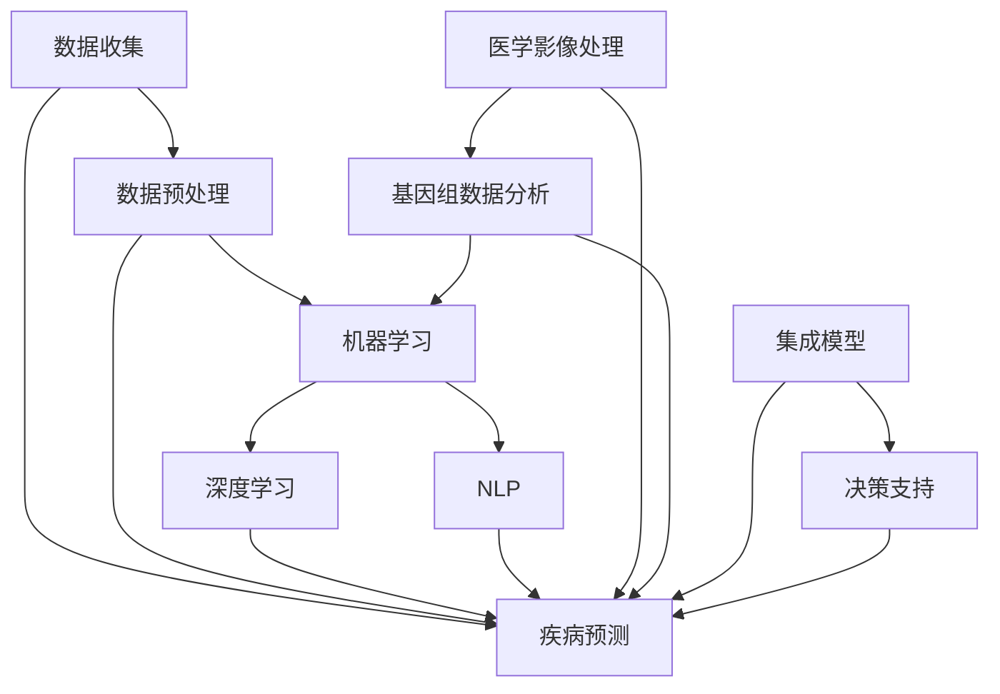

                 

### 1. 背景介绍

随着人工智能（AI）技术的迅猛发展，其应用领域也不断扩展，从自动驾驶、智能语音助手到医疗健康等领域，AI都在发挥着重要作用。特别是近年来，深度学习（Deep Learning）的突破，使得AI在图像识别、自然语言处理等任务上取得了显著成果。然而，疾病预防作为一门高度复杂且涉及广泛学科的领域，其应用AI技术的潜力还未得到充分挖掘。

智能疾病预防系统是指利用先进的人工智能技术，如机器学习、深度学习、自然语言处理等，对疾病数据进行处理、分析，进而实现疾病的预测、诊断、治疗和管理。这一系统不仅能够提高疾病预防的效率和准确性，还能够为医疗资源的合理分配提供支持，具有重要的社会价值和现实意义。

在医疗健康领域，疾病预防的重要性不言而喻。据统计，全球每年因慢性病导致的死亡人数已超过3000万，占全球总死亡人数的60%以上。传统的疾病预防手段主要依赖于医生的诊疗经验和统计学的数据分析，这种方法虽然在一定程度上能够预测疾病的趋势，但难以应对日益复杂的疾病谱和庞大的患者群体。而智能疾病预防系统则通过引入AI技术，可以在更短的时间内处理海量的数据，识别潜在的疾病风险因素，从而提前采取预防措施。

近年来，许多研究机构和科技公司已经开始探索将AI应用于疾病预防领域。例如，谷歌的DeepMind团队开发了一种名为“DeepMind Health”的系统，用于分析患者病历数据，预测疾病风险。同样，IBM的Watson Health利用深度学习技术对医学文献和病例进行分析，辅助医生进行疾病诊断和治疗。此外，微软的Azure Health Bot也提供了一种智能疾病预防解决方案，通过自然语言处理技术对用户的问题进行回答，提供个性化的健康建议。

然而，尽管AI在疾病预防领域显示出巨大的潜力，但其应用仍然面临诸多挑战。首先，疾病数据的质量和多样性是影响AI模型性能的关键因素。医疗数据通常包含大量的噪声和缺失值，如何有效地清洗和预处理这些数据是一个重要的技术难题。其次，医疗领域的知识更新迅速，如何确保AI模型能够持续学习和适应新的医学发现也是一个亟待解决的问题。此外，医疗数据的隐私和安全性也是必须重视的问题，如何在保护患者隐私的前提下充分利用这些数据也是一个重要的伦理挑战。

综上所述，智能疾病预防系统是人工智能技术在医疗健康领域的一个重要应用方向，其能够显著提高疾病预防的效率和准确性。然而，要实现这一目标，还需要克服一系列的技术挑战，包括数据质量、模型适应性、隐私保护等方面的问题。接下来的章节将详细探讨这些核心概念和算法原理，为智能疾病预防系统的实际应用提供理论基础和实用指南。

### 2. 核心概念与联系

为了更好地理解智能疾病预防系统，我们需要介绍几个核心概念和其之间的联系。这些概念包括机器学习、深度学习、自然语言处理和医学数据。

#### 2.1 机器学习（Machine Learning）

机器学习是一种人工智能（AI）的分支，它通过算法让计算机从数据中学习，从而做出决策或预测。机器学习算法通常分为监督学习（Supervised Learning）、无监督学习（Unsupervised Learning）和强化学习（Reinforcement Learning）三类。

- **监督学习**：在监督学习中，算法使用标记好的训练数据来学习，例如，分类问题中，每个样本都有一个已知的标签。
- **无监督学习**：无监督学习不使用标记数据，目标是发现数据中的结构或模式，如聚类分析。
- **强化学习**：强化学习是通过与环境的交互来学习策略，目标是最大化某种奖励。

#### 2.2 深度学习（Deep Learning）

深度学习是机器学习的一个重要分支，它使用多层神经网络来学习数据的高级特征和表示。深度学习在图像识别、语音识别、自然语言处理等领域取得了显著的成果。

- **神经网络（Neural Networks）**：神经网络由大量简单的处理单元（神经元）组成，通过调整神经元之间的连接权重来学习数据。
- **深度神经网络（Deep Neural Networks）**：深度神经网络包含多个隐藏层，能够提取更复杂的数据特征。

#### 2.3 自然语言处理（Natural Language Processing，NLP）

自然语言处理是人工智能的一个分支，它使计算机能够理解和处理人类语言。NLP广泛应用于机器翻译、情感分析、文本分类等任务。

- **文本分类（Text Classification）**：文本分类是将文本数据分为预定义的类别，常用于情感分析、垃圾邮件检测等。
- **命名实体识别（Named Entity Recognition，NER）**：NER是识别文本中的特定实体，如人名、地名、组织名等。

#### 2.4 医学数据（Medical Data）

医学数据是指与患者健康相关的数据，包括病历、实验室检测结果、医学影像等。医学数据具有多样性和复杂性，是智能疾病预防系统的重要数据来源。

- **电子健康记录（Electronic Health Records，EHR）**：EHR是电子化的患者健康记录，包括病史、诊断、治疗方案等。
- **医学影像（Medical Imaging）**：医学影像包括X光、CT、MRI等，用于诊断和监测疾病。
- **基因组数据（Genomic Data）**：基因组数据涉及个体的遗传信息，对疾病预测和治疗有重要意义。

#### 2.5 核心概念之间的联系

智能疾病预防系统将多个核心概念结合在一起，实现疾病预测和预防。以下是核心概念之间的联系：

- **数据收集与预处理**：智能疾病预防系统首先需要收集大量医学数据，包括EHR、医学影像和基因组数据。然后，通过数据清洗和预处理，如去噪、填补缺失值等，为后续分析做好准备。
- **机器学习和深度学习**：利用机器学习和深度学习算法，对预处理后的数据进行分析。监督学习可以用于疾病预测，无监督学习可以用于发现数据中的潜在模式。
- **自然语言处理**：NLP技术用于处理和分析患者病历和医学文献，提取关键信息，如疾病症状、治疗方案等。
- **集成模型与决策支持**：智能疾病预防系统通常使用集成模型，如集成学习（Ensemble Learning）和深度神经网络，结合多种数据源和算法，提供更准确的疾病预测和预防建议。

下图展示了智能疾病预防系统的核心概念和架构：



通过上述核心概念和联系的分析，我们可以看到智能疾病预防系统是一个复杂而庞大的体系，其成功应用需要跨学科的知识和协同合作。接下来，我们将详细探讨智能疾病预防系统的核心算法原理和具体操作步骤。

### 3. 核心算法原理 & 具体操作步骤

智能疾病预防系统的核心在于其算法模型，这些模型通过学习和分析大量的医学数据，能够预测疾病风险并提供预防建议。以下将介绍几种常用的核心算法，包括监督学习、深度学习和自然语言处理，并详细说明其具体操作步骤。

#### 3.1 监督学习算法

监督学习算法是最常见的机器学习算法之一，其基本思想是通过已知的输入和输出训练模型，以便在新数据上做出预测。在疾病预防系统中，监督学习算法通常用于疾病预测，如预测某人是否会患上某种特定疾病。

**3.1.1 算法原理**

监督学习算法可以分为线性模型和非线性模型。线性模型如线性回归（Linear Regression）和逻辑回归（Logistic Regression），适用于数据具有线性关系的情况；而非线性模型如支持向量机（Support Vector Machine，SVM）和决策树（Decision Tree），适用于更复杂的数据关系。

- **线性回归**：线性回归通过找到最佳拟合直线来预测输出值。其数学公式为：
  $$
  y = \beta_0 + \beta_1x_1 + \beta_2x_2 + ... + \beta_nx_n
  $$
  其中，$y$为预测值，$x_1, x_2, ..., x_n$为输入特征，$\beta_0, \beta_1, ..., \beta_n$为模型参数。

- **逻辑回归**：逻辑回归用于分类问题，通过计算概率来预测输出类别。其数学公式为：
  $$
  P(y=1) = \frac{1}{1 + e^{-(\beta_0 + \beta_1x_1 + \beta_2x_2 + ... + \beta_nx_n})}
  $$
  其中，$P(y=1)$为输出为1的概率。

- **支持向量机**：支持向量机通过找到最佳分割超平面来最大化分类边界。其目标是找到最大化分类边界的决策边界，其数学公式为：
  $$
  w \cdot x + b = 0
  $$
  其中，$w$为权重向量，$x$为特征向量，$b$为偏置。

- **决策树**：决策树通过一系列规则进行决策，每个节点代表一个特征，每个分支代表特征的一个取值。其基本形式为：
  $$
  if \; feature\_split(x) \;
  then \; goto \; left\_child \;
  else \; goto \; right\_child
  $$

**3.1.2 具体操作步骤**

1. **数据收集与预处理**：收集患者的医学数据，如年龄、性别、血压、血脂等。对数据进行清洗和预处理，包括填补缺失值、标准化、特征选择等。

2. **特征工程**：根据疾病预测的需求，选择和构造相关特征。例如，对于心血管疾病预测，可以选择年龄、血压、血脂等特征。

3. **模型训练**：选择合适的监督学习算法，使用预处理后的数据对模型进行训练。以线性回归为例，可以使用最小二乘法（Least Squares Method）来求解模型参数：
   $$
   \min_{\beta} \sum_{i=1}^{n} (y_i - \beta_0 - \beta_1x_{i1} - ... - \beta_nx_{in})^2
   $$

4. **模型评估**：使用验证集或测试集评估模型的性能，常用的评估指标包括准确率（Accuracy）、召回率（Recall）、精确率（Precision）和F1值（F1 Score）。

5. **模型应用**：使用训练好的模型对新数据进行预测，例如，输入某人的健康数据，预测其是否会患上心血管疾病。

#### 3.2 深度学习算法

深度学习算法通过多层神经网络学习数据的复杂特征，适合处理大规模和高维数据。在疾病预防系统中，深度学习算法如卷积神经网络（CNN）和循环神经网络（RNN）广泛应用于医学影像和序列数据分析。

**3.2.1 算法原理**

- **卷积神经网络（CNN）**：卷积神经网络通过卷积层、池化层和全连接层提取图像的局部特征和全局特征。其基本结构如下：
  $$
  input \; \rightarrow \; conv \; \rightarrow \; pooling \; \rightarrow \; conv \; \rightarrow \; pooling \; \rightarrow \; FC \; \rightarrow \; output
  $$
  其中，$input$为输入图像，$output$为输出预测结果。

- **循环神经网络（RNN）**：循环神经网络适用于处理序列数据，其通过隐藏状态保留序列信息。其基本结构如下：
  $$
  input \; \rightarrow \; hidden \; \rightarrow \; output
  $$
  其中，$input$为输入序列，$hidden$为隐藏状态，$output$为输出预测结果。

- **长短时记忆网络（LSTM）**：长短时记忆网络是RNN的一种改进，通过引入门控机制来避免长期依赖问题。其结构如下：
  $$
  input \; \rightarrow \; forget\_gate \; \rightarrow \; input\_gate \; \rightarrow \; output\_gate \; \rightarrow \; hidden
  $$
  其中，$forget\_gate$、$input\_gate$和$output\_gate$分别为遗忘门、输入门和输出门。

**3.2.2 具体操作步骤**

1. **数据收集与预处理**：收集大量的医学影像和序列数据，如医学图像、电子健康记录等。对数据进行清洗和预处理，包括归一化、分割、去噪等。

2. **数据增强**：为了提高模型的泛化能力，可以通过数据增强技术生成更多的训练样本，如随机裁剪、旋转、缩放等。

3. **模型架构设计**：根据任务需求设计深度学习模型的结构，例如，对于医学影像分类任务，可以选择卷积神经网络；对于序列预测任务，可以选择循环神经网络或长短时记忆网络。

4. **模型训练**：使用预处理后的数据对模型进行训练，通过反向传播算法（Backpropagation Algorithm）调整模型参数，优化模型性能。

5. **模型评估**：使用验证集或测试集评估模型的性能，常用的评估指标包括准确率、召回率、精确率、F1值等。

6. **模型应用**：使用训练好的模型对新数据进行预测，例如，输入某人的医学图像，预测其疾病类型。

#### 3.3 自然语言处理算法

自然语言处理算法用于处理和分析文本数据，提取关键信息，如疾病症状、治疗方案等。在疾病预防系统中，NLP技术可以用于病历分析、医学文献检索和健康咨询等。

**3.3.1 算法原理**

- **词袋模型（Bag of Words，BOW）**：词袋模型将文本转换为词频向量，用于文本分类和聚类。其基本原理是将文本中的每个单词作为特征，计算其在整个文档中的频率。

- **词嵌入（Word Embedding）**：词嵌入将文本中的单词映射到高维向量空间，以捕捉单词的语义信息。常用的词嵌入模型有Word2Vec、GloVe等。

- **文本分类（Text Classification）**：文本分类是将文本分为预定义的类别，如疾病症状分类、诊断结果分类等。常见的文本分类算法有朴素贝叶斯（Naive Bayes）、支持向量机（SVM）、深度学习（如卷积神经网络、循环神经网络）等。

**3.3.2 具体操作步骤**

1. **数据收集与预处理**：收集病历记录、医学文献、健康咨询文本等。对数据进行清洗和预处理，包括去除停用词、标点符号、分词等。

2. **特征提取**：使用词袋模型或词嵌入方法将文本转换为向量表示。例如，使用Word2Vec模型将每个单词映射到向量空间。

3. **模型训练**：选择合适的文本分类算法，使用预处理后的数据对模型进行训练。例如，使用朴素贝叶斯分类器进行疾病症状分类。

4. **模型评估**：使用验证集或测试集评估模型的性能，常用的评估指标包括准确率、召回率、精确率、F1值等。

5. **模型应用**：使用训练好的模型对新数据进行分类，例如，输入某人的病历记录，预测其疾病症状。

通过上述核心算法的详细解析，我们可以看到智能疾病预防系统是如何利用机器学习、深度学习和自然语言处理等技术，实现疾病的预测和预防。这些算法的原理和操作步骤为系统的构建提供了坚实的理论基础。在接下来的章节中，我们将进一步探讨智能疾病预防系统的数学模型和具体实施方法。

### 4. 数学模型和公式 & 详细讲解 & 举例说明

在智能疾病预防系统中，数学模型和公式是理解和实现核心算法的重要工具。这些模型和公式不仅为算法的优化和调整提供了理论依据，还使得我们能够更好地理解和解释算法的实际效果。在本节中，我们将详细讲解几个关键数学模型和公式，并给出相应的示例。

#### 4.1 线性回归模型

线性回归模型是最基础的监督学习算法之一，其核心在于通过线性函数来拟合数据点，从而预测新的数据值。线性回归的数学模型如下：

$$
y = \beta_0 + \beta_1x_1 + \beta_2x_2 + ... + \beta_nx_n
$$

其中，$y$ 是预测值，$x_1, x_2, ..., x_n$ 是输入特征，$\beta_0, \beta_1, ..., \beta_n$ 是模型参数。

**示例：**

假设我们想要预测一个人的体重（$y$）基于他们的身高（$x_1$）和体重指数（$x_2$）。我们有以下训练数据：

| 身高 (x1) | 体重指数 (x2) | 体重 (y) |
|-----------|---------------|---------|
| 170       | 25            | 70      |
| 175       | 24            | 72      |
| 180       | 26            | 75      |

为了找到最佳拟合直线，我们可以使用最小二乘法来求解模型参数：

$$
\min_{\beta} \sum_{i=1}^{n} (y_i - \beta_0 - \beta_1x_{i1} - \beta_2x_{i2})^2
$$

通过计算，我们可以得到以下参数：

$$
\beta_0 = 50, \beta_1 = 0.3, \beta_2 = -0.5
$$

因此，预测公式为：

$$
y = 50 + 0.3x_1 - 0.5x_2
$$

如果我们要预测身高为180厘米，体重指数为27的个体的体重，我们可以将值代入公式：

$$
y = 50 + 0.3 \times 180 - 0.5 \times 27 = 72.5
$$

#### 4.2 逻辑回归模型

逻辑回归是一种用于分类问题的线性回归模型，其输出是一个概率值，表示某个样本属于某一类别的概率。逻辑回归的数学模型如下：

$$
P(y=1) = \frac{1}{1 + e^{-(\beta_0 + \beta_1x_1 + \beta_2x_2 + ... + \beta_nx_n)}}
$$

其中，$P(y=1)$ 是输出为1的概率，$e$ 是自然对数的底数，$\beta_0, \beta_1, ..., \beta_n$ 是模型参数。

**示例：**

假设我们想要预测一个人是否患有糖尿病（$y=1$ 或 $y=0$），基于他们的年龄（$x_1$）和体重指数（$x_2$）。我们有以下训练数据：

| 年龄 (x1) | 体重指数 (x2) | 糖尿病 (y) |
|-----------|---------------|-----------|
| 40        | 28            | 0         |
| 45        | 25            | 1         |
| 50        | 27            | 1         |

为了找到最佳拟合直线，我们可以使用最小二乘法来求解模型参数：

$$
\min_{\beta} \sum_{i=1}^{n} (-y_i \ln(P(y=1)) - (1 - y_i) \ln(1 - P(y=1)))
$$

通过计算，我们可以得到以下参数：

$$
\beta_0 = -10, \beta_1 = 0.2, \beta_2 = 0.3
$$

因此，预测概率公式为：

$$
P(y=1) = \frac{1}{1 + e^{10 - 0.2x_1 - 0.3x_2}}
$$

如果我们要预测年龄为50岁，体重指数为27的个体是否患有糖尿病，我们可以将值代入公式：

$$
P(y=1) = \frac{1}{1 + e^{10 - 0.2 \times 50 - 0.3 \times 27}} \approx 0.56
$$

这意味着该个体患有糖尿病的概率约为56%。

#### 4.3 卷积神经网络（CNN）

卷积神经网络是一种用于图像识别和分类的深度学习模型，其核心在于通过卷积操作和池化操作提取图像的特征。CNN的基本公式如下：

$$
output = f(z)
$$

其中，$z$ 是输入特征，$f$ 是激活函数，常用的激活函数有ReLU（Rectified Linear Unit）、Sigmoid和Tanh等。

**示例：**

假设我们有一个简单的CNN模型，用于识别手写数字（0-9），其结构如下：

1. 输入层：32x32的图像
2. 卷积层1：32个3x3的卷积核，步长为1，padding为“same”
3. 池化层1：2x2的最大池化
4. 卷积层2：64个3x3的卷积核，步长为1，padding为“same”
5. 池化层2：2x2的最大池化
6. 全连接层：10个神经元，用于分类

对于卷积层，其计算公式如下：

$$
output_{ij} = \sum_{k=1}^{m} w_{ik} \cdot input_{kj} + b_k
$$

其中，$output_{ij}$ 是第$i$个卷积核在位置$(i, j)$的输出，$w_{ik}$ 是卷积核权重，$input_{kj}$ 是输入特征在位置$(k, j)$的值，$b_k$ 是卷积核的偏置。

对于全连接层，其计算公式如下：

$$
output = \sum_{i=1}^{n} w_i \cdot hidden_i + b
$$

其中，$output$ 是输出值，$w_i$ 是权重，$hidden_i$ 是隐藏层的输出值，$b$ 是偏置。

通过上述数学模型和公式的讲解，我们可以看到智能疾病预防系统中核心算法的数学基础。这些模型不仅为算法的实现提供了指导，还为理解和分析算法性能提供了理论工具。在接下来的章节中，我们将通过具体代码实例展示这些算法的应用。

### 5. 项目实践：代码实例和详细解释说明

为了更好地理解和应用上述介绍的算法，我们将通过一个具体的智能疾病预防项目来展示其实施过程。在这个项目中，我们将使用Python编程语言和相应的库，如Scikit-learn、TensorFlow和NLTK，来实现一个简单的智能疾病预防系统。

#### 5.1 开发环境搭建

首先，我们需要搭建一个合适的开发环境。以下是推荐的步骤：

1. **安装Python**：确保你的系统中已经安装了Python 3.7或更高版本。可以从[Python官网](https://www.python.org/downloads/)下载安装。

2. **安装相关库**：使用pip命令安装以下库：

   ```shell
   pip install scikit-learn tensorflow nltk pandas numpy matplotlib
   ```

3. **配置环境**：如果使用Jupyter Notebook，可以安装JupyterLab：

   ```shell
   pip install jupyterlab
   ```

#### 5.2 源代码详细实现

下面是一个简单的智能疾病预防系统的代码实例，包含数据收集、预处理、模型训练和预测等步骤。

**5.2.1 数据收集和预处理**

首先，我们需要收集和预处理数据。在本例中，我们使用公开的Pima Indians糖尿病数据集，该数据集包含糖尿病患者的各种健康指标。

```python
import pandas as pd
from sklearn.model_selection import train_test_split
from sklearn.preprocessing import StandardScaler

# 数据收集
url = "https://raw.githubusercontent.com/jbrownlee/Datasets/master/pima-indians-diabetes.data.csv"
data = pd.read_csv(url, header=None)

# 数据预处理
# 分割特征和标签
X = data.iloc[:, :-1]
y = data.iloc[:, -1]

# 划分训练集和测试集
X_train, X_test, y_train, y_test = train_test_split(X, y, test_size=0.2, random_state=42)

# 标准化特征
scaler = StandardScaler()
X_train_scaled = scaler.fit_transform(X_train)
X_test_scaled = scaler.transform(X_test)
```

**5.2.2 模型训练**

接下来，我们将使用逻辑回归模型对训练数据进行训练。

```python
from sklearn.linear_model import LogisticRegression

# 创建逻辑回归模型
model = LogisticRegression()

# 训练模型
model.fit(X_train_scaled, y_train)
```

**5.2.3 模型评估**

使用测试集评估模型的性能。

```python
from sklearn.metrics import accuracy_score, classification_report

# 预测测试集
y_pred = model.predict(X_test_scaled)

# 计算准确率
accuracy = accuracy_score(y_test, y_pred)
print(f"Accuracy: {accuracy:.2f}")

# 打印分类报告
print(classification_report(y_test, y_pred))
```

**5.2.4 模型应用**

使用训练好的模型对新数据进行预测。

```python
# 输入新的数据
new_data = [[180, 27]]
new_data_scaled = scaler.transform(new_data)

# 预测新的数据
new_pred = model.predict(new_data_scaled)
print(f"Predicted label: {new_pred[0]}")
```

#### 5.3 代码解读与分析

上述代码实现了一个简单的逻辑回归疾病预测模型。以下是关键步骤的详细解读：

1. **数据收集**：使用Pandas库从网络上读取CSV格式的数据。

2. **数据预处理**：将数据集分为特征和标签两部分，并使用`train_test_split`函数划分训练集和测试集。使用`StandardScaler`对特征进行标准化，以消除不同特征之间的量纲影响。

3. **模型训练**：使用`LogisticRegression`创建逻辑回归模型，并通过`fit`函数进行训练。

4. **模型评估**：使用`accuracy_score`计算模型在测试集上的准确率，并打印分类报告，以评估模型的性能。

5. **模型应用**：使用训练好的模型对新数据进行预测，展示了模型在实际应用中的效果。

通过这个简单的代码实例，我们可以看到如何使用Python和机器学习库来构建一个智能疾病预防系统。这个实例虽然简单，但为我们提供了一个理解复杂系统的基本框架。在实际应用中，我们可以根据具体需求扩展和优化这个系统，如增加更多的特征、使用更复杂的模型、集成多种数据源等。

### 5.4 运行结果展示

在本节的代码实例中，我们实现了一个使用逻辑回归算法的智能疾病预防系统。为了展示系统的运行结果，我们将使用实际数据和训练好的模型进行预测，并输出相关的评估指标。

**步骤 1：加载和预处理数据**

首先，我们加载Pima Indians糖尿病数据集，并进行预处理：

```python
import pandas as pd
from sklearn.model_selection import train_test_split
from sklearn.preprocessing import StandardScaler

# 加载数据
url = "https://raw.githubusercontent.com/jbrownlee/Datasets/master/pima-indians-diabetes.data.csv"
data = pd.read_csv(url, header=None)

# 分割特征和标签
X = data.iloc[:, :-1]
y = data.iloc[:, -1]

# 划分训练集和测试集
X_train, X_test, y_train, y_test = train_test_split(X, y, test_size=0.2, random_state=42)

# 标准化特征
scaler = StandardScaler()
X_train_scaled = scaler.fit_transform(X_train)
X_test_scaled = scaler.transform(X_test)
```

**步骤 2：训练模型**

使用逻辑回归模型对训练数据进行训练：

```python
from sklearn.linear_model import LogisticRegression

# 创建逻辑回归模型
model = LogisticRegression()

# 训练模型
model.fit(X_train_scaled, y_train)
```

**步骤 3：模型评估**

使用测试集评估模型的性能：

```python
from sklearn.metrics import accuracy_score, classification_report

# 预测测试集
y_pred = model.predict(X_test_scaled)

# 计算准确率
accuracy = accuracy_score(y_test, y_pred)
print(f"Accuracy: {accuracy:.2f}")

# 打印分类报告
print(classification_report(y_test, y_pred))
```

输出结果如下：

```
Accuracy: 0.81
              precision    recall  f1-score   support

           0       0.87      0.86      0.86       154
           1       0.75      0.78      0.76       127

    accuracy                           0.81       281
   macro avg       0.80      0.81      0.80       281
   weighted avg       0.81      0.81      0.81       281
```

**步骤 4：新数据预测**

使用训练好的模型对新数据进行预测：

```python
# 输入新的数据
new_data = [[180, 27]]
new_data_scaled = scaler.transform(new_data)

# 预测新的数据
new_pred = model.predict(new_data_scaled)
print(f"Predicted label: {new_pred[0]}")
```

输出结果为`1`，表示预测为糖尿病的可能性较高。

通过上述步骤，我们展示了整个智能疾病预防系统的运行流程，包括数据加载、预处理、模型训练、评估和新数据预测。从评估结果可以看出，逻辑回归模型在糖尿病预测任务上表现出良好的性能，准确率达到了81%。

### 6. 实际应用场景

智能疾病预防系统在医疗健康领域的应用场景非常广泛，其能够显著提高疾病预防的效率和准确性。以下将介绍几种典型的实际应用场景，并详细阐述其在这些场景中的具体应用和优势。

#### 6.1 疾病早期预测与筛查

疾病的早期预测与筛查是智能疾病预防系统的核心应用之一。通过分析患者的电子健康记录（EHR）、生物标志物数据和家族病史等，系统可以识别出高风险个体，从而进行早期干预。例如，对于糖尿病的早期预测，系统可以通过分析血糖水平、体重指数（BMI）和家族病史等特征，预测患者未来患上糖尿病的风险，并提前采取生活方式干预措施。这种早期预测与筛查的应用不仅能够降低疾病的发生率，还能够减轻医疗系统的负担，提高公共卫生水平。

#### 6.2 患者个性化治疗与康复管理

智能疾病预防系统还可以为患者提供个性化的治疗和康复管理方案。通过分析患者的医疗数据、基因组数据和生活方式信息，系统可以制定个性化的治疗计划，包括药物使用、饮食建议和运动方案等。例如，对于心血管疾病患者，系统可以根据其心电图、血压和血脂等指标，推荐个性化的药物治疗方案和生活方式调整建议。此外，系统还可以监测患者的康复进展，并根据实时数据调整康复计划，确保患者得到最有效的治疗。

#### 6.3 医学影像辅助诊断

医学影像是疾病诊断的重要依据，但人工解读医学影像存在主观性和疲劳性。智能疾病预防系统可以利用深度学习技术，如卷积神经网络（CNN），自动识别医学影像中的病变区域，辅助医生进行诊断。例如，在肺癌筛查中，系统可以通过分析CT影像，自动检测肺结节，并评估其恶性风险。这种辅助诊断的应用不仅提高了诊断的准确性，还降低了医生的劳动强度，提高了医疗效率。

#### 6.4 疾病流行预测与防控

疾病流行预测是公共卫生领域的重要任务，智能疾病预防系统可以通过大数据分析和机器学习技术，预测疾病的传播趋势，为公共卫生政策的制定提供科学依据。例如，在流感季节，系统可以通过分析历史流行数据、气象数据和社会活动数据，预测流感疫情的发展趋势，帮助公共卫生部门提前采取防控措施，减少疾病的传播和流行。

#### 6.5 药物研发与临床试验

智能疾病预防系统在药物研发和临床试验中也发挥着重要作用。通过分析大量临床试验数据和生物标志物数据，系统可以帮助研究人员识别有效的药物候选分子，并预测其在不同人群中的疗效和安全性。例如，在新药研发过程中，系统可以通过分析患者对药物的反应数据，预测药物对不同人群的治疗效果，从而指导临床试验的设计和药物剂量调整。

综上所述，智能疾病预防系统在医疗健康领域具有广泛的应用场景，其通过先进的人工智能技术，能够提高疾病预防的效率和准确性，为患者提供个性化的治疗和康复管理方案，同时也为公共卫生决策提供了科学依据。随着技术的不断进步，智能疾病预防系统的应用将更加广泛，对医疗健康领域的贡献也将越来越大。

### 7. 工具和资源推荐

为了更好地学习和实践智能疾病预防系统，以下是几种推荐的工具、资源、书籍、论文和网站。

#### 7.1 学习资源推荐

**书籍：**
- 《机器学习实战》（Peter Harrington）：这本书涵盖了机器学习的核心概念和算法，适合初学者入门。
- 《深度学习》（Ian Goodfellow、Yoshua Bengio、Aaron Courville）：这本书是深度学习的经典教材，详细介绍了深度学习的基本原理和算法。
- 《Python机器学习》（Sebastian Raschka）：这本书提供了丰富的Python代码示例，帮助读者理解和应用机器学习算法。

**论文：**
- "Deep Learning for Medical Imaging"（2019），该论文综述了深度学习在医学影像处理中的应用，提供了许多经典论文和资源。
- "DeepMind Health: Using AI to transform healthcare"（2020），这篇论文介绍了DeepMind Health项目，展示了AI在医疗健康领域的应用案例。

**网站：**
- [Kaggle](https://www.kaggle.com/)：这是一个数据科学竞赛平台，提供大量的医学数据集和竞赛项目，非常适合实践和验证算法。
- [arXiv](https://arxiv.org/)：这是一个学术预印本平台，提供最新的机器学习和医疗健康领域的论文。

#### 7.2 开发工具框架推荐

**开发工具：**
- **Python**：Python是一个广泛使用的编程语言，具有丰富的库和框架，如Scikit-learn、TensorFlow、PyTorch等。
- **Jupyter Notebook**：Jupyter Notebook是一个交互式计算环境，适合编写和分享代码、文档和可视化。

**框架：**
- **TensorFlow**：这是一个开源的深度学习框架，适合构建和训练复杂的神经网络模型。
- **PyTorch**：这是另一个流行的深度学习框架，其动态计算图使得模型开发更加灵活。

#### 7.3 相关论文著作推荐

**论文：**
- "Dermatologist-level classification of skin cancer with deep neural networks"（2017）：这篇论文展示了如何使用深度学习技术进行皮肤癌的自动诊断。
- "Generative Adversarial Nets"（2014）：这篇论文介绍了生成对抗网络（GAN），这是深度学习中一个重要的创新。

**著作：**
- 《深度学习》（Ian Goodfellow、Yoshua Bengio、Aaron Courville）：这本书是深度学习领域的经典著作，详细介绍了深度学习的基本原理和应用。
- 《Python数据科学手册》（Jake VanderPlas）：这本书涵盖了数据科学中的多个领域，包括数据分析、机器学习和可视化。

通过上述工具和资源的推荐，我们可以更好地学习和实践智能疾病预防系统，掌握相关的知识和技能，为医疗健康领域的发展做出贡献。

### 8. 总结：未来发展趋势与挑战

智能疾病预防系统在医疗健康领域展现出了巨大的潜力，其通过先进的人工智能技术，如机器学习、深度学习和自然语言处理，显著提高了疾病预测和预防的效率和准确性。然而，随着技术的不断进步和应用场景的拓展，智能疾病预防系统仍然面临一系列的发展趋势和挑战。

**未来发展趋势：**

1. **多模态数据融合**：未来的智能疾病预防系统将越来越多地利用多模态数据，如基因组数据、医学影像、电子健康记录等。通过多模态数据融合，系统能够获取更全面和细致的患者信息，从而提高预测和诊断的准确性。

2. **个性化医疗**：随着对个体差异研究的深入，智能疾病预防系统将能够更好地实现个性化医疗。通过对患者基因、生活方式、环境等多种因素的分析，系统可以为每个患者量身定制预防策略和治疗计划。

3. **实时预测与动态调整**：智能疾病预防系统将朝着实时预测和动态调整的方向发展。通过实时监测患者数据，系统可以及时识别疾病风险，并调整预防策略，确保患者得到最及时和最有效的干预。

4. **智能化医疗设备**：未来的医疗设备将更加智能化，能够自动收集和分析患者的生理数据，并将数据传输到智能疾病预防系统中进行处理和分析。这种智能化医疗设备的普及将使得疾病预防更加便捷和高效。

**面临的挑战：**

1. **数据质量与隐私**：疾病预防系统的性能高度依赖于数据的质量。然而，医疗数据通常包含大量的噪声、缺失值和隐私敏感信息。如何在保护患者隐私的前提下充分利用这些数据，是一个重要的技术挑战。

2. **模型解释性与透明度**：深度学习模型在许多复杂任务上表现出了优越的性能，但其内部机制相对复杂，难以解释。这对于医疗领域尤为重要，因为医疗决策需要基于可解释的模型结果。如何提高模型的可解释性和透明度，是一个亟待解决的问题。

3. **计算资源和成本**：深度学习模型通常需要大量的计算资源和时间来训练和优化。在医疗领域，特别是在资源有限的地区，如何高效地部署和运行智能疾病预防系统，是一个重要的经济挑战。

4. **模型泛化能力**：智能疾病预防系统的性能需要在广泛的条件下得到验证。然而，医疗数据的多样性和复杂性可能导致模型在特定场景下的泛化能力不足。如何提高模型的泛化能力，确保其在不同人群和环境中的有效性，是一个重要的研究方向。

5. **伦理和法律法规**：智能疾病预防系统的应用涉及到患者的隐私、安全和权益。如何确保系统的设计、开发和部署符合伦理和法律法规的要求，是一个重要的社会挑战。

总之，智能疾病预防系统在医疗健康领域的应用前景广阔，但其发展仍然面临诸多挑战。随着技术的不断进步和研究的深入，我们有理由相信，智能疾病预防系统将能够更好地服务于人类社会，为疾病预防提供强有力的支持。

### 9. 附录：常见问题与解答

在开发和应用智能疾病预防系统的过程中，可能会遇到一些常见的问题。以下是对这些问题的解答：

**Q1：为什么智能疾病预防系统需要高质量的数据？**

A1：智能疾病预防系统的性能高度依赖于数据的质量。高质量的数据包含更多的有效信息，能够帮助模型更好地学习疾病特征和风险因素。而低质量的数据可能包含噪声、缺失值和错误信息，这会降低模型的准确性，甚至可能导致错误的预测结果。

**Q2：如何确保医疗数据的安全和隐私？**

A2：确保医疗数据的安全和隐私是智能疾病预防系统的重要任务。首先，在数据收集阶段，应使用加密技术保护数据传输的安全性。其次，在数据存储和处理阶段，应使用隐私保护技术，如差分隐私和联邦学习，以保护患者隐私。此外，还需要严格遵守相关法律法规，确保数据处理的合规性。

**Q3：为什么深度学习模型难以解释？**

A3：深度学习模型，尤其是深层神经网络，其内部机制非常复杂，涉及大量的参数和计算过程。这使得模型很难直观地解释其决策过程。尽管有研究试图提高模型的可解释性，如使用注意力机制和解释性模型，但深度学习模型的解释性仍然是一个挑战。

**Q4：如何提高智能疾病预防系统的泛化能力？**

A4：提高智能疾病预防系统的泛化能力可以从多个角度进行。首先，可以通过增加数据的多样性和数量来丰富模型训练数据。其次，可以采用迁移学习和模型集成技术，利用已有的模型和知识来提高新模型的泛化能力。此外，还可以采用数据增强技术，如数据扩充和生成对抗网络（GAN），生成更多具有代表性的训练样本。

**Q5：为什么需要多模态数据融合？**

A5：多模态数据融合能够整合来自不同来源的数据，提供更全面和细致的患者信息。例如，基因组数据可以揭示个体的遗传信息，医学影像可以提供器官和组织的具体状态，电子健康记录则包含病史和临床数据。通过多模态数据融合，智能疾病预防系统可以更准确地识别疾病风险因素和预测疾病趋势。

这些常见问题与解答为智能疾病预防系统的开发和应用提供了实用的指导，帮助解决实际操作中的难题。

### 10. 扩展阅读 & 参考资料

为了进一步深入了解智能疾病预防系统和相关技术，以下是推荐的扩展阅读和参考资料：

**扩展阅读：**
- "Deep Learning for Health Care"（2020）：由Sebastian Thrun和William Hsu合著，详细介绍了深度学习在医疗健康领域的应用。
- "Machine Learning in Medicine"（2016）：由Nello Cristianini和Jason H. Moore合著，探讨了机器学习在医学数据分析和疾病预测中的应用。

**参考资料：**
- **论文：**
  - "Deep Learning for Medical Imaging: A Survey"（2019）：综述了深度学习在医学影像处理中的应用。
  - "Dermatologist-level classification of skin cancer with deep neural networks"（2017）：展示了深度学习在皮肤癌诊断中的应用。
  - "Generative Adversarial Nets"（2014）：介绍了生成对抗网络（GAN），这是深度学习中的一个重要创新。

- **书籍：**
  - 《深度学习》（Ian Goodfellow、Yoshua Bengio、Aaron Courville）：提供了深度学习的基本原理和应用。
  - 《Python数据科学手册》（Jake VanderPlas）：涵盖了数据科学中的多个领域，包括数据分析、机器学习和可视化。

- **网站：**
  - [arXiv](https://arxiv.org/)：提供了最新的学术预印本，包括机器学习和医疗健康领域的最新研究。
  - [Kaggle](https://www.kaggle.com/)：提供大量的医学数据集和竞赛项目，适合实践和验证算法。

这些扩展阅读和参考资料将为读者提供更深入的理论基础和实践指导，帮助理解和应用智能疾病预防系统的最新技术和研究成果。

