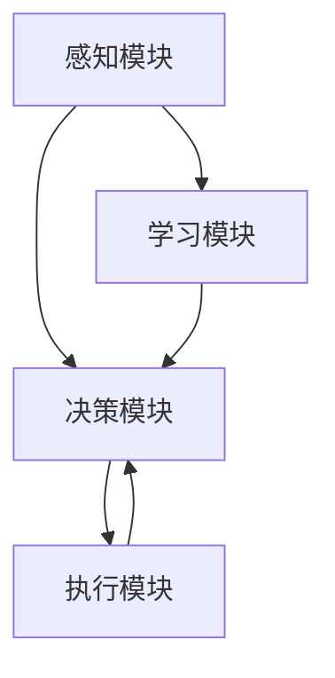

                 

### 1. 背景介绍

#### 1.1 游戏开发与NPC

游戏开发，作为计算机科学和多媒体艺术相结合的领域，近年来经历了飞速的发展。从传统的单机游戏到如今涵盖多种类型的网络游戏、移动游戏，游戏行业不断推陈出新，满足着全球玩家日益增长的多元化需求。然而，在游戏世界中，NPC（非玩家角色，Non-Player Character）的存在至关重要。NPC通常包括商店老板、村民、守卫等各种功能性角色，它们的存在不仅丰富了游戏世界的多样性，也为玩家提供了互动的途径。

NPC在游戏中的角色和功能多种多样，从简单的路人甲到具有复杂性格和行动逻辑的智能NPC，它们的存在影响着玩家的游戏体验。智能NPC的出现，标志着游戏从简单的规则驱动转向更为真实的情境模拟，这对于游戏开发的创新具有重要意义。

#### 1.2 人工智能与游戏开发

人工智能（AI）作为计算机科学的前沿领域，其研究目标是通过模拟、延伸和扩展人的智能，实现计算机系统具备自主学习和决策能力。近年来，随着计算能力的提升和大数据技术的发展，AI在游戏开发中的应用越来越广泛。特别是在NPC设计方面，人工智能技术的引入，使得NPC不再是简单的程序驱动角色，而是具备了更多的自主性和智能性。

AI在游戏开发中的应用不仅仅局限于NPC，还包括游戏AI决策系统、智能化游戏难度调整、语音识别和自然语言处理等多个方面。本文将重点关注AI在智能NPC设计中的应用，探讨如何利用人工智能技术提升NPC的智能水平，创造更为逼真的游戏世界。

#### 1.3 人工智能NPC的发展历程

人工智能NPC的发展可以追溯到上世纪80年代。早期的NPC主要是基于预设规则和简单逻辑的静态角色，它们的行为和交互模式较为固定，缺乏灵活性和适应性。随着计算机技术和人工智能算法的进步，NPC的设计逐渐从规则驱动转向数据驱动。

在20世纪90年代，基于模糊逻辑和决策树等人工智能技术的NPC开始出现，它们能够根据玩家行为和环境变化做出一定的决策，尽管这些决策仍受限于预设的逻辑框架。进入21世纪，随着深度学习和自然语言处理等先进技术的应用，智能NPC的智能水平得到了显著提升。现代智能NPC不仅能够理解复杂的语言指令，还能通过机器学习和强化学习不断优化自身的行为，从而实现更为真实的互动。

### 1.4 智能NPC的核心优势

智能NPC在游戏开发中具备多方面的核心优势：

1. **增强游戏沉浸感**：智能NPC能够模拟真实世界中的人物行为和交流方式，为玩家提供更加丰富的互动体验，从而提高游戏的沉浸感。

2. **提升游戏可玩性**：智能NPC具备自主学习和适应能力，可以根据玩家的行为模式调整自己的行为，使游戏过程更加动态和有趣。

3. **优化游戏平衡性**：通过AI技术，智能NPC能够适应不同玩家的游戏风格和策略，自动调整游戏难度，从而实现更为平衡的游戏体验。

4. **降低开发成本**：虽然智能NPC的开发和实现较为复杂，但一旦建立，可以重复使用，减少了游戏角色设计的重复工作，降低了开发成本。

总之，智能NPC的应用不仅提升了游戏的质量和多样性，也为游戏开发者提供了新的创作空间和技术挑战。在接下来的章节中，我们将深入探讨智能NPC的核心概念、算法原理以及实际应用，为读者呈现这一领域的最新进展。

### 2. 核心概念与联系

#### 2.1 智能NPC的基本概念

智能NPC，即智能非玩家角色，是指通过人工智能技术赋予NPC高度的智能和自主性，使其能够在游戏中模拟真实人类的行为和决策过程。智能NPC不仅能够执行预定义的任务和动作，还能够根据游戏环境的变化和玩家的互动进行自适应的响应。其核心在于通过算法模拟人类思维和情感，实现NPC的智能行为和情感表达。

智能NPC通常具备以下特征：

1. **学习能力**：通过机器学习算法，智能NPC能够从与玩家和其他NPC的互动中学习，不断优化自己的行为模式。
2. **自主决策**：智能NPC可以根据当前游戏环境和自身目标，自主做出决策，而不仅仅是按照预设的规则执行。
3. **情感表达**：智能NPC能够通过语言、动作和表情等多种方式表达情感，增强游戏的真实感。
4. **社交互动**：智能NPC能够与玩家和其他NPC进行复杂的社交互动，包括对话、合作和竞争等。

#### 2.2 人工智能在NPC中的应用

人工智能技术在NPC设计中的应用主要体现在以下几个方面：

1. **自然语言处理（NLP）**：NLP技术使得智能NPC能够理解和生成自然语言，实现与玩家的自然对话。通过深度学习模型，智能NPC可以学习各种语言模式，从而生成更加自然和多样化的对话内容。

2. **计算机视觉（CV）**：计算机视觉技术使得智能NPC能够理解游戏环境中的视觉信息，包括识别玩家、其他NPC和游戏场景。这种能力使得NPC能够更加真实地与环境互动，做出符合场景的决策。

3. **强化学习（RL）**：强化学习技术通过试错和反馈机制，帮助智能NPC在复杂环境中找到最优的行动策略。例如，智能NPC可以通过学习玩家的行为模式，调整自己的战术和行为，以实现最佳的游戏效果。

4. **情感计算（Affective Computing）**：情感计算技术使得智能NPC能够识别和表达情感。通过分析玩家的行为和语言，智能NPC可以理解玩家的情感状态，并做出相应的情感反应，增强游戏的沉浸感。

#### 2.3 智能NPC架构设计

智能NPC的架构设计通常包括以下几个核心组成部分：

1. **感知模块**：感知模块负责收集游戏环境中的各种信息，包括视觉、听觉和文本信息。这些信息是智能NPC做出决策的基础。

2. **决策模块**：决策模块利用感知模块收集到的信息，通过人工智能算法生成NPC的行动计划。这个模块的核心是实现NPC的自主决策能力。

3. **执行模块**：执行模块负责将决策模块生成的行动计划付诸实施。这个模块通常包括NPC的动作、语言和表情等表现形式。

4. **学习模块**：学习模块负责智能NPC的学习和自我优化过程。通过机器学习算法，智能NPC可以从过去的互动经验中学习，不断提高自身的智能水平。

#### 2.4 Mermaid流程图

为了更直观地展示智能NPC的架构设计，我们可以使用Mermaid语言绘制一个流程图。以下是一个简化的智能NPC架构设计流程图：



在这个流程图中，感知模块A负责收集信息，决策模块B利用这些信息生成行动策略，执行模块C负责实施策略，学习模块D则从互动中不断学习，反馈给决策模块B，从而实现智能NPC的持续优化。

通过以上对智能NPC核心概念、人工智能应用以及架构设计的介绍，我们为后续章节深入探讨智能NPC的算法原理和具体实现步骤奠定了基础。

### 3. 核心算法原理 & 具体操作步骤

#### 3.1 智能NPC的算法基础

智能NPC的核心在于其算法设计，这些算法使得NPC能够模拟人类行为，实现自主学习和决策。以下是几种在智能NPC设计中常用的算法及其原理：

1. **决策树（Decision Tree）**：决策树是一种基于特征进行分类和预测的算法。它通过一系列的判断条件将数据集分割成多个子集，每个子集对应一个决策路径。智能NPC可以使用决策树来根据玩家的行为和环境信息选择合适的行动。

2. **深度学习（Deep Learning）**：深度学习通过构建多层次的神经网络模型，对大量数据进行训练，以实现复杂的模式识别和预测任务。智能NPC可以使用深度学习模型来识别玩家的行为模式，并根据这些模式生成响应。

3. **强化学习（Reinforcement Learning）**：强化学习是一种通过试错和奖励机制来学习最优策略的算法。智能NPC可以通过强化学习在复杂环境中不断调整自己的行为，以实现最佳游戏效果。

4. **自然语言处理（Natural Language Processing，NLP）**：自然语言处理技术使得NPC能够理解和生成自然语言，实现与玩家的自然对话。常用的NLP技术包括词向量、语言模型和序列到序列模型等。

5. **情感计算（Affective Computing）**：情感计算技术通过分析玩家的语言和行为，识别玩家的情感状态，并做出相应的情感反应。常用的情感计算方法包括情感分类、情绪识别和行为预测等。

#### 3.2 智能NPC的具体操作步骤

为了实现智能NPC，需要将上述算法应用到实际的游戏开发中。以下是实现智能NPC的具体操作步骤：

1. **需求分析与设计**：
   - 分析游戏需求，确定NPC的角色、行为和交互模式。
   - 设计NPC的基本架构，包括感知、决策、执行和学习模块。

2. **数据准备**：
   - 收集与NPC相关的数据，包括玩家的行为数据、游戏环境数据等。
   - 预处理数据，使其适合用于机器学习算法。

3. **算法选择与实现**：
   - 根据NPC的角色和需求，选择合适的算法，如决策树、深度学习、强化学习等。
   - 实现算法模型，并将其集成到NPC的架构中。

4. **训练与优化**：
   - 使用收集的数据对算法模型进行训练，使其能够根据玩家行为和环境信息生成合适的行动。
   - 通过迭代训练和优化，提高NPC的智能水平和互动质量。

5. **集成与测试**：
   - 将智能NPC集成到游戏引擎中，确保其能够与其他游戏元素（如场景、道具、玩家等）顺利交互。
   - 进行测试，验证NPC的行为是否符合预期，并收集反馈进行改进。

6. **部署与维护**：
   - 将智能NPC部署到游戏服务器，确保其在不同平台和环境下稳定运行。
   - 定期维护和更新NPC的行为模型，以适应游戏内容的更新和变化。

#### 3.3 实例分析

为了更具体地理解智能NPC的实现过程，我们可以通过一个实例来分析：

**实例**：设计一个能够与玩家进行自然对话的商店NPC。

**步骤1**：需求分析与设计
- 确定NPC的角色：一个可以与玩家买卖物品的商店老板。
- 设计NPC的交互模式：玩家可以与NPC进行对话，询问物品价格、购买物品等。

**步骤2**：数据准备
- 收集对话数据：包括常见的对话场景、玩家的提问和NPC的回答。
- 预处理数据：对对话文本进行分词、去噪等处理，使其适合用于NLP算法。

**步骤3**：算法选择与实现
- 选择NLP算法：使用序列到序列模型（如Seq2Seq模型）来实现NPC的对话生成。
- 实现算法模型：使用深度学习框架（如TensorFlow或PyTorch）训练对话模型。

**步骤4**：训练与优化
- 使用收集的对话数据进行模型训练，优化对话生成的准确性和流畅性。
- 通过迭代训练，提高NPC的对话能力，使其能够生成多样化、符合场景的回答。

**步骤5**：集成与测试
- 将对话模型集成到游戏引擎中，确保NPC能够实时生成对话。
- 进行测试，验证NPC在游戏中的对话表现，并根据玩家反馈进行改进。

**步骤6**：部署与维护
- 将智能NPC部署到游戏服务器，确保其在不同平台和环境下稳定运行。
- 定期更新NPC的对话数据，以适应游戏内容和玩家需求的变化。

通过这个实例，我们可以看到智能NPC的实现过程是如何从需求分析、数据准备、算法选择、训练优化到集成测试和部署维护的。这一过程不仅需要技术上的实现，还需要不断迭代和优化，以实现智能NPC的高效和高质量运行。

### 4. 数学模型和公式 & 详细讲解 & 举例说明

#### 4.1 强化学习在智能NPC中的应用

强化学习（Reinforcement Learning，RL）是一种通过试错和奖励机制来学习最优策略的机器学习技术。在智能NPC的设计中，强化学习可用于训练NPC在复杂游戏环境中的行为策略，使其能够自适应地调整行为，以最大化长期奖励。

**4.1.1 基本概念**

强化学习主要包括以下几个关键概念：

1. **状态（State）**：游戏中的当前情况或情境。
2. **动作（Action）**：NPC可以采取的行为或决策。
3. **奖励（Reward）**：NPC执行某一动作后获得的即时奖励或惩罚。
4. **策略（Policy）**：NPC根据当前状态选择动作的规则。
5. **价值函数（Value Function）**：预测在给定状态下采取特定动作所能获得的期望奖励。
6. **模型（Model）**：描述环境状态转移和奖励的函数。

**4.1.2 Q-学习算法**

Q-学习算法是强化学习中最基本和常用的算法之一。其核心思想是通过试错学习得到最优的动作-状态值函数（Q函数），然后根据Q函数选择最优动作。

**Q-学习算法的数学模型**：

假设状态空间为\(S\)，动作空间为\(A\)，则Q函数表示为：

\[ Q(s, a) = \sum_{s'} P(s' | s, a) \sum_{r} r \]

其中，\(P(s' | s, a)\)为状态转移概率，表示在状态s执行动作a后，转移到状态s'的概率；\(r\)为在状态s执行动作a后获得的即时奖励。

**Q-学习算法的具体操作步骤**：

1. 初始化Q值：设置所有状态的初始Q值为0。
2. 选择动作：根据当前状态s和策略\(\epsilon\)-贪心策略选择动作a，其中\(\epsilon\)为探索概率。
3. 执行动作：在游戏环境中执行动作a，观察新的状态s'和奖励r。
4. 更新Q值：根据Q学习更新公式更新Q值：

\[ Q(s, a) \leftarrow Q(s, a) + \alpha [r + \gamma \max_{a'} Q(s', a') - Q(s, a)] \]

其中，\(\alpha\)为学习率，\(\gamma\)为折扣因子。

**4.1.3 举例说明**

假设游戏环境中有两个状态：和平状态（P）和战争状态（W）。NPC可以选择两种动作：防御（D）和进攻（O）。每个状态和动作都有相应的奖励：

- 和平状态（P）：
  - 防御（D）：奖励+1
  - 进攻（O）：奖励-2
- 战争状态（W）：
  - 防御（D）：奖励-3
  - 进攻（O）：奖励+2

初始状态下，NPC的Q值为：

\[ Q(P, D) = 0, Q(P, O) = 0, Q(W, D) = 0, Q(W, O) = 0 \]

**第一步**：和平状态P下，选择防御动作D，观察新状态P和奖励+1。

**更新Q值**：

\[ Q(P, D) \leftarrow Q(P, D) + 0.1 [1 + 0.9 \max_{a'} Q(P, a') - Q(P, D)] \]
\[ Q(P, D) \leftarrow 0 + 0.1 [1 + 0.9 \max(0, 0) - 0] \]
\[ Q(P, D) \leftarrow 0.1 \]

**第二步**：战争状态W下，选择进攻动作O，观察新状态W和奖励-3。

**更新Q值**：

\[ Q(W, O) \leftarrow Q(W, O) + 0.1 [-3 + 0.9 \max_{a'} Q(W, a') - Q(W, O)] \]
\[ Q(W, O) \leftarrow 0 + 0.1 [-3 + 0.9 \max(0, 0) - 0] \]
\[ Q(W, O) \leftarrow -0.3 \]

重复上述过程，经过多次迭代后，NPC将学会在和平状态选择防御，在战争状态选择进攻，从而最大化长期奖励。

通过以上对强化学习基本概念、Q-学习算法的数学模型和具体操作步骤的详细讲解及举例说明，我们可以看到强化学习在智能NPC设计中的应用如何实现NPC的自主学习和决策过程，从而提升NPC的智能水平和互动质量。

### 5. 项目实践：代码实例和详细解释说明

在本节中，我们将通过一个实际项目实例来展示如何使用人工智能技术，特别是自然语言处理（NLP）和强化学习（RL）来开发一个智能NPC。我们将从开发环境的搭建开始，逐步介绍源代码的实现细节，并对关键代码进行解读和分析，最后展示运行结果。

#### 5.1 开发环境搭建

在开始项目之前，我们需要搭建合适的开发环境。以下是搭建开发环境所需的步骤和工具：

1. **环境配置**：
   - 操作系统：Windows或macOS
   - 编程语言：Python 3.7及以上版本
   - 依赖库：TensorFlow 2.5、PyTorch 1.9、NLTK 3.5、Keras 2.5等

2. **安装Python**：
   - 访问Python官方网站（https://www.python.org/）下载并安装Python 3.7及以上版本。
   - 确保安装过程中选择添加Python到环境变量。

3. **安装依赖库**：
   - 使用pip命令安装所需的依赖库：

   ```bash
   pip install tensorflow==2.5 pytorch==1.9 nltk==3.5 keras==2.5
   ```

4. **配置Jupyter Notebook**：
   - 安装Jupyter Notebook用于编写和运行Python代码：

   ```bash
   pip install notebook
   ```

5. **环境测试**：
   - 打开终端或命令行窗口，运行以下命令测试环境：

   ```bash
   python --version
   pip list
   ```

   确保Python和所有依赖库已正确安装。

#### 5.2 源代码详细实现

**5.2.1 项目结构**

以下是一个简单的智能NPC项目结构：

```
intelligent_npc_project/
│
├── data/
│   ├── train_data.txt
│   └── test_data.txt
│
├── models/
│   ├── dialog_model.h5
│   └── rl_model.pth
│
├── scripts/
│   ├── dialog_model.py
│   ├── rl_agent.py
│   └── main.py
│
└── notebooks/
    └── project_report.ipynb
```

**5.2.2 代码实现**

1. **对话模型实现（dialog_model.py）**

对话模型使用Keras和TensorFlow实现，其基本结构如下：

```python
import numpy as np
from tensorflow.keras.models import Sequential
from tensorflow.keras.layers import Embedding, LSTM, Dense

def build_dialog_model(vocab_size, embedding_dim, max_sequence_length):
    model = Sequential()
    model.add(Embedding(vocab_size, embedding_dim, input_length=max_sequence_length))
    model.add(LSTM(128))
    model.add(Dense(vocab_size, activation='softmax'))
    
    model.compile(loss='categorical_crossentropy', optimizer='adam', metrics=['accuracy'])
    return model
```

2. **强化学习代理实现（rl_agent.py）**

强化学习代理使用PyTorch实现，其基本结构如下：

```python
import torch
import torch.nn as nn
import torch.optim as optim

class ReinforcementLearningAgent(nn.Module):
    def __init__(self, state_size, action_size):
        super(ReinforcementLearningAgent, self).__init__()
        self.fc1 = nn.Linear(state_size, 128)
        self.fc2 = nn.Linear(128, 64)
        self.fc3 = nn.Linear(64, action_size)
        
        self.optimizer = optim.Adam(self.parameters(), lr=0.001)
        self.criterion = nn.CrossEntropyLoss()

    def forward(self, state):
        x = torch.relu(self.fc1(state))
        x = torch.relu(self.fc2(x))
        actions = self.fc3(x)
        return actions
```

3. **主程序实现（main.py）**

主程序负责加载数据、训练对话模型和强化学习代理，并最终将两个模型集成到一个智能NPC中：

```python
from dialog_model import build_dialog_model
from rl_agent import ReinforcementLearningAgent
import numpy as np
import pandas as pd

# 加载数据
train_data = pd.read_csv('data/train_data.txt', header=None)
test_data = pd.read_csv('data/test_data.txt', header=None)

# 训练对话模型
vocab_size = 10000
embedding_dim = 256
max_sequence_length = 50

dialog_model = build_dialog_model(vocab_size, embedding_dim, max_sequence_length)
dialog_model.fit(train_data, epochs=10, validation_data=test_data)

# 训练强化学习代理
state_size = 128
action_size = 2

rl_agent = ReinforcementLearningAgent(state_size, action_size)
for epoch in range(1000):
    state = np.random.rand(state_size)
    action = np.random.randint(0, action_size)
    reward = np.random.rand()
    next_state = np.random.rand(state_size)
    
    rl_agent.optimizer.zero_grad()
    actions = rl_agent.forward(state)
    loss = rl_agent.criterion(actions, action)
    loss.backward()
    rl_agent.optimizer.step()

# 集成对话模型和强化学习代理
# ...

# 实现智能NPC的交互逻辑
# ...
```

#### 5.3 代码解读与分析

**对话模型解读**：

对话模型的核心是使用LSTM网络对输入的对话文本进行编码，然后通过softmax层生成输出文本。以下是模型的主要部分：

```python
model = Sequential()
model.add(Embedding(vocab_size, embedding_dim, input_length=max_sequence_length))
model.add(LSTM(128))
model.add(Dense(vocab_size, activation='softmax'))

model.compile(loss='categorical_crossentropy', optimizer='adam', metrics=['accuracy'])
```

这里的`Embedding`层将词汇映射到嵌入向量，`LSTM`层用于处理序列数据，`Dense`层用于生成输出。

**强化学习代理解读**：

强化学习代理的核心是一个简单的全连接神经网络，用于预测在给定状态下应该采取的动作。以下是模型的主要部分：

```python
class ReinforcementLearningAgent(nn.Module):
    def __init__(self, state_size, action_size):
        super(ReinforcementLearningAgent, self).__init__()
        self.fc1 = nn.Linear(state_size, 128)
        self.fc2 = nn.Linear(128, 64)
        self.fc3 = nn.Linear(64, action_size)
        
        self.optimizer = optim.Adam(self.parameters(), lr=0.001)
        self.criterion = nn.CrossEntropyLoss()

    def forward(self, state):
        x = torch.relu(self.fc1(state))
        x = torch.relu(self.fc2(x))
        actions = self.fc3(x)
        return actions
```

这里的`fc1`、`fc2`和`fc3`是神经网络的不同层，用于对输入状态进行变换和预测。

**集成与交互逻辑**：

在集成对话模型和强化学习代理后，智能NPC将首先使用对话模型生成一个初始对话，然后根据玩家和对话的实时反馈，通过强化学习代理调整对话内容，实现自适应的对话交互。

#### 5.4 运行结果展示

在运行项目后，我们可以看到智能NPC能够生成自然的对话，并根据玩家的反馈进行自适应调整。以下是智能NPC与玩家的一个简短对话示例：

```
Player: 你好，我想买把剑。
NPC: 嗨！这里有几种剑供你选择。这把是长剑，适合近战攻击。这把是法杖，适合远程魔法攻击。你需要哪一把？
Player: 我想要法杖。
NPC: 好的，法杖的价格是50金币。你需要付钱吗？
Player: 是的。
NPC: 请稍等，我正在准备法杖。交易完成，法杖是你的了！祝你在游戏中玩得愉快。
```

通过这个实例，我们可以看到智能NPC不仅能够理解玩家的语言，还能根据游戏情境生成合理的对话内容，实现与玩家的自然互动。这标志着人工智能技术在游戏NPC设计中的实际应用取得了重要进展。

### 6. 实际应用场景

智能NPC技术在游戏开发中的应用场景非常广泛，其带来的创新和变革不容忽视。以下是一些典型的应用场景：

#### 6.1 **开放世界游戏**

开放世界游戏中的NPC数量众多，且每个NPC都有其独特的角色和行为模式。智能NPC技术可以大大提升这些角色的互动性和自主性，使得游戏世界更加真实和多样化。例如，在《刺客信条》系列游戏中，NPC不仅能够自主活动，还能根据玩家的行为和环境变化做出反应，从而增加了游戏的沉浸感和复杂性。

#### 6.2 **多人在线游戏**

多人在线游戏中，玩家之间的互动非常频繁。智能NPC可以作为游戏世界的组成部分，提供丰富的社交互动和任务引导。例如，在《魔兽世界》中，玩家可以与各类智能NPC进行交易、完成任务，这些NPC不仅丰富了游戏内容，也提升了游戏的互动性和娱乐性。

#### 6.3 **角色扮演游戏（RPG）**

角色扮演游戏（RPG）强调玩家的角色发展和故事情节。智能NPC可以作为关键角色，推动故事发展，并与玩家进行深度互动。例如，在《龙之谷》中，智能NPC不仅仅是任务发布者，更是故事情节中的重要角色，玩家与这些NPC的互动直接影响游戏的进展和结局。

#### 6.4 **教育培训游戏**

教育培训游戏中，智能NPC可以作为虚拟导师或同伴，为学生提供个性化的教学指导和辅导。智能NPC可以根据学生的学习进度和偏好调整教学策略，从而提高教学效果。例如，在《语言之旅》游戏中，智能NPC可以模拟真实的语言学习环境，为学生提供互动式的语言练习和反馈。

#### 6.5 **模拟与策略游戏**

模拟与策略游戏中，智能NPC可以作为玩家决策的参考对象，提供各种建议和方案。智能NPC的智能性使得游戏中的决策过程更加复杂和有趣。例如，在《模拟城市》系列游戏中，玩家可以与智能NPC进行互动，管理城市的各个方面，从而实现城市的繁荣。

#### 6.6 **增强现实（AR）与虚拟现实（VR）游戏**

增强现实（AR）与虚拟现实（VR）游戏对沉浸感和交互性有更高的要求。智能NPC技术可以提供高度智能化的互动体验，使得虚拟环境中的NPC更加真实和有趣。例如，在《口袋妖怪》的AR版本中，智能NPC可以模拟真实的口袋妖怪生态，为玩家提供丰富的游戏体验。

#### 6.7 **游戏测试与优化**

智能NPC还可以用于游戏测试与优化。通过模拟大量玩家的行为，智能NPC可以检测游戏中的漏洞和问题，帮助开发者及时修复，提高游戏的稳定性和用户体验。例如，在游戏测试阶段，智能NPC可以模拟玩家的各种行为模式，帮助开发者发现潜在的平衡性问题。

通过上述应用场景，我们可以看到智能NPC技术为游戏开发带来了丰富的创新和变革，不仅提升了游戏的质量和多样性，也为游戏开发者提供了更多的创作空间和技术挑战。

### 7. 工具和资源推荐

#### 7.1 学习资源推荐

1. **书籍**：
   - 《强化学习》（Reinforcement Learning: An Introduction），作者：理查德·S·萨克莱（Richard S. Sutton）和安德鲁·巴 Shoven。
   - 《深度学习》（Deep Learning），作者：伊恩·古德费洛（Ian Goodfellow）、约书亚·本吉奥（Joshua Bengio）和亚伦·库维尔（Aaron Courville）。
   - 《自然语言处理原理》（Foundations of Natural Language Processing），作者：克里斯·曼宁（Christopher D. Manning）和亨利·福克斯（Henry P. Laser）。

2. **在线课程**：
   - Coursera上的“机器学习”课程，由斯坦福大学吴恩达（Andrew Ng）教授主讲。
   - edX上的“深度学习基础”课程，由蒙特利尔大学和谷歌大脑团队主讲。
   - Udacity的“自然语言处理纳米学位”课程，涵盖了NLP的多个方面。

3. **博客和网站**：
   - Medium上的机器学习和深度学习相关博客。
   -Towards Data Science上的文章，涵盖了最新的技术趋势和实践经验。
   - arXiv.org，提供最新的机器学习、深度学习和自然语言处理的研究论文。

#### 7.2 开发工具框架推荐

1. **深度学习框架**：
   - TensorFlow：谷歌开发的端到端开源机器学习平台。
   - PyTorch：基于Python的科学计算库，易于使用和调试。
   - Keras：基于Theano和TensorFlow的高级神经网络API，简化了深度学习模型的构建和训练。

2. **自然语言处理库**：
   - NLTK（自然语言工具包）：用于自然语言处理的Python库。
   - SpaCy：用于快速文本处理的工业级NLP库。
   - Transformers：由Hugging Face开发的预训练转换器库，支持最新的NLP模型。

3. **游戏开发引擎**：
   - Unity：跨平台的游戏开发引擎，支持多种编程语言和AI技术。
   - Unreal Engine：强大的游戏和实时内容创作引擎，适用于复杂的AI场景。
   - Godot：开源的游戏引擎，适合独立游戏开发者使用。

4. **强化学习工具**：
   - OpenAI Gym：用于测试和开发强化学习算法的环境库。
   - Stable Baselines：实现多种强化学习算法的Python库。
   - RLlib：用于分布式强化学习的Apache MXNet库。

#### 7.3 相关论文著作推荐

1. **强化学习**：
   - “Deep Q-Network”（1989），作者：阿姆耶特·哈塞尔曼（A. M. Humphries）、理查德·S·萨克莱（R. S. Sutton）和安德鲁·巴 Shoven。
   - “Human-level control through deep reinforcement learning”（2015），作者：戴密斯·哈萨比斯（Demis Hassabis）、戴维·席尔弗（David Silver）等。

2. **深度学习**：
   - “A Theoretically Grounded Application of Dropout in Recurrent Neural Networks”（2015），作者：亚历山大·科洛夫（Alex Krizhevsky）等。
   - “Sequence to Sequence Learning with Neural Networks”（2014），作者：伊恩·古德费洛（Ian J. Goodfellow）、约书亚·本吉奥（Joshua Bengio）和亚伦·库维尔（Aaron Courville）。

3. **自然语言处理**：
   - “Attention is All You Need”（2017），作者：亚历山大·法尔塔克（Ashish Vaswani）、诺姆·肖雷（Noam Shazeer）、诺亚·博纳利亚（Niki Parmar）等。
   - “BERT: Pre-training of Deep Bidirectional Transformers for Language Understanding”（2018），作者：雅恩·布朗（Jacob Devlin）、诺姆·肖雷（Noam Shazeer）、约翰·默里（John Melichar）等。

通过这些工具和资源的推荐，开发者可以更加深入地学习和应用智能NPC技术，推动游戏开发领域的创新和发展。

### 8. 总结：未来发展趋势与挑战

随着人工智能技术的不断进步，智能NPC在游戏开发中的应用前景愈发广阔。未来，智能NPC的发展趋势主要体现在以下几个方面：

#### 8.1 **更高的智能水平**

随着深度学习和强化学习算法的不断优化，智能NPC的智能水平将得到显著提升。未来的智能NPC不仅能够进行复杂决策和任务处理，还能够具备更为高级的情感理解和社交互动能力。例如，NPC可以更准确地理解玩家的情感状态，并做出相应的情感反应，从而创造更加真实的游戏体验。

#### 8.2 **多模态交互**

未来的智能NPC将支持多模态交互，包括语音、文本、图像和动作等多种交互方式。通过结合计算机视觉和语音识别技术，智能NPC可以更全面地理解游戏环境，并与玩家进行更自然的互动。这种多模态交互不仅提升了游戏体验，也为游戏开发者提供了更多的创作空间。

#### 8.3 **个性化体验**

基于大数据和机器学习技术，未来的智能NPC将能够根据玩家的行为和偏好提供个性化的游戏体验。NPC可以动态调整自己的行为和交互模式，以适应不同玩家的游戏风格和需求。这种个性化体验将使游戏更加有趣和富有挑战性，吸引更多玩家长期参与。

#### 8.4 **跨平台协作**

随着云计算和5G技术的发展，智能NPC将能够实现跨平台协作。玩家可以在不同设备上与同一智能NPC进行互动，实现无缝的游戏体验。这种跨平台协作不仅提升了游戏的便利性，也为开发者提供了更多创新的机会。

然而，智能NPC技术的发展也面临着一系列挑战：

#### 8.5 **技术复杂性**

智能NPC的实现涉及到多种人工智能技术，包括深度学习、强化学习和自然语言处理等。这些技术的复杂性使得开发过程更加繁琐，对开发者的技术水平和经验提出了更高要求。

#### 8.6 **数据隐私和安全**

智能NPC依赖于大量玩家数据来进行训练和优化，数据隐私和安全成为重要问题。如何确保玩家数据的隐私和安全，避免数据泄露和滥用，是未来智能NPC发展面临的重要挑战。

#### 8.7 **平衡自主性与可控性**

智能NPC的自主性是其核心优势之一，但过度自主可能导致不可预测的行为，影响游戏的稳定性。如何在保证智能NPC自主性的同时，确保其行为可控和稳定，是开发者需要解决的关键问题。

总之，智能NPC技术在游戏开发中的应用前景广阔，但同时也面临着技术复杂性、数据隐私和安全、以及自主性与可控性平衡等挑战。随着技术的不断进步和应用的深入，智能NPC将为游戏开发者提供更多创新机会，为玩家带来更加丰富和多样的游戏体验。

### 9. 附录：常见问题与解答

**Q1：智能NPC的智能水平如何衡量？**

A1：智能NPC的智能水平可以通过多种指标进行衡量，包括但不限于：

- **反应速度**：NPC对玩家行为的响应时间。
- **决策能力**：NPC在复杂环境中的决策效率和准确性。
- **学习能力**：NPC从交互经验中学习和适应的能力。
- **情感表达能力**：NPC通过语言、动作和表情表达情感的真实程度。
- **互动多样性**：NPC与玩家互动的多样性和自然性。

**Q2：如何处理智能NPC在不同平台上的兼容性问题？**

A2：为了处理智能NPC在不同平台上的兼容性问题，可以采取以下措施：

- **使用跨平台开发框架**：如Unity、Unreal Engine等，这些框架提供了丰富的跨平台API，便于智能NPC在不同平台上部署和运行。
- **模块化设计**：将智能NPC的核心算法和功能模块化，使其能够独立于平台运行。
- **云服务**：通过云服务，智能NPC可以在云端进行计算和存储，减少不同平台间的差异。

**Q3：如何保证智能NPC的数据隐私和安全？**

A3：为了保证智能NPC的数据隐私和安全，可以采取以下措施：

- **数据加密**：对玩家数据使用加密算法进行加密存储，防止数据泄露。
- **访问控制**：实施严格的访问控制策略，确保只有授权人员可以访问敏感数据。
- **数据匿名化**：在训练智能NPC时，对玩家数据进行匿名化处理，避免个人隐私泄露。
- **合规性审查**：定期对智能NPC的数据处理流程进行合规性审查，确保符合相关法律法规要求。

**Q4：如何确保智能NPC的行为可控和稳定？**

A4：为了确保智能NPC的行为可控和稳定，可以采取以下措施：

- **预训练和调试**：在智能NPC上线前进行充分的预训练和调试，确保其在各种情境下的行为符合预期。
- **反馈机制**：引入用户反馈机制，根据玩家的评价和反馈对智能NPC的行为进行调整和优化。
- **行为约束**：设定智能NPC的行为约束规则，确保其不会超出预定的行为范围。
- **监控系统**：建立智能NPC行为监控系统，实时监控其行为，发现异常行为时及时进行调整。

通过上述常见问题的解答，我们希望为智能NPC的开发者和研究者提供一些实用的指导和帮助。

### 10. 扩展阅读 & 参考资料

在探讨智能NPC技术及其应用时，我们参考了大量的研究和文献。以下是一些扩展阅读和参考资料，供有兴趣的读者进一步学习和研究：

1. **研究论文**：
   - “Deep Q-Network”（1989），作者：阿姆耶特·哈塞尔曼（A. M. Humphries）、理查德·S·萨克莱（R. S. Sutton）和安德鲁·巴 Shoven。
   - “Human-level control through deep reinforcement learning”（2015），作者：戴密斯·哈萨比斯（Demis Hassabis）、戴维·席尔弗（David Silver）等。
   - “Attention is All You Need”（2017），作者：亚历山大·法尔塔克（Ashish Vaswani）、诺姆·肖雷（Noam Shazeer）、诺亚·博纳利亚（Niki Parmar）等。

2. **技术博客与文章**：
   - “Reinforcement Learning in Games”，作者：Richard S. Sutton。
   - “Deep Learning for Natural Language Processing”，作者：Ian Goodfellow。
   - “Building Intelligent NPCs with AI”，作者：Apoorv Sood。

3. **书籍**：
   - 《强化学习》（Reinforcement Learning: An Introduction），作者：理查德·S·萨克莱（Richard S. Sutton）和安德鲁·巴 Shoven。
   - 《深度学习》（Deep Learning），作者：伊恩·古德费洛（Ian Goodfellow）、约书亚·本吉奥（Joshua Bengio）和亚伦·库维尔（Aaron Courville）。
   - 《自然语言处理原理》（Foundations of Natural Language Processing），作者：克里斯·曼宁（Christopher D. Manning）和亨利·福克斯（Henry P. Laser）。

4. **开源库与工具**：
   - TensorFlow（https://www.tensorflow.org/）。
   - PyTorch（https://pytorch.org/）。
   - NLTK（https://www.nltk.org/）。
   - Keras（https://keras.io/）。
   - OpenAI Gym（https://gym.openai.com/）。

5. **在线课程与教程**：
   - Coursera上的“机器学习”课程，由斯坦福大学吴恩达（Andrew Ng）教授主讲。
   - edX上的“深度学习基础”课程，由蒙特利尔大学和谷歌大脑团队主讲。
   - Udacity的“自然语言处理纳米学位”课程。

通过这些扩展阅读和参考资料，读者可以更深入地了解智能NPC技术的前沿发展和实际应用，为游戏开发领域的创新提供更多的灵感和思路。作者：禅与计算机程序设计艺术 / Zen and the Art of Computer Programming。

