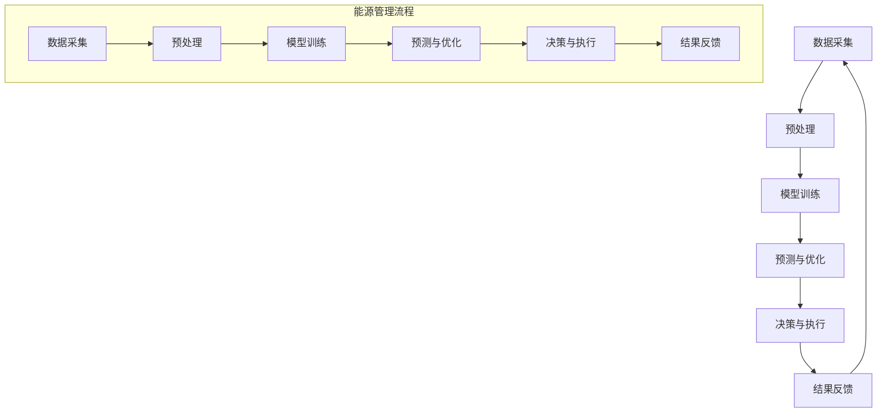

                 

### 背景介绍

在当今全球化的背景下，能源管理成为了各国政府和企业共同关注的焦点。随着可再生能源的兴起，以及能源需求的持续增长，如何高效、智能地管理能源资源，成为了亟待解决的重要问题。这一问题的解决不仅关系到能源的可持续利用，还直接影响到经济、社会和环境的可持续发展。

传统能源管理主要依赖于人工操作和经验判断，这种方法在资源利用效率、决策速度和精确度上存在较大的局限性。随着人工智能（AI）技术的快速发展，特别是深度学习（Deep Learning）和大规模语言模型（Large Language Model，简称LLM）的突破，为能源管理带来了新的可能。LLM，作为一种强大的人工智能工具，能够处理大量结构化和非结构化数据，并从中提取出有价值的信息，为能源管理提供了全新的解决方案。

本文将围绕LLM在能源管理中的潜在贡献展开讨论。首先，我们将介绍LLM的基本概念和技术原理；然后，深入探讨LLM在能源管理中的应用场景，并举例说明；接着，分析LLM在能源管理中可能面临的挑战和解决方案；最后，展望LLM在能源管理领域的未来发展趋势和机遇。希望通过本文的探讨，能够为相关领域的研究者提供一些有价值的参考和启示。

### 核心概念与联系

在深入了解LLM在能源管理中的应用之前，我们首先需要明确几个核心概念，并理解它们之间的联系。

#### 1. 什么是LLM？

LLM，即大规模语言模型，是一种基于深度学习技术的自然语言处理（Natural Language Processing，简称NLP）模型。与传统的统计模型和规则方法不同，LLM通过学习海量的文本数据，自动捕捉语言中的复杂模式和规律，从而实现高级的语言理解和生成能力。LLM的典型代表包括GPT（Generative Pre-trained Transformer）系列、BERT（Bidirectional Encoder Representations from Transformers）等。

#### 2. 什么是能源管理？

能源管理是指通过一系列技术和管理手段，对能源的生产、传输、分配和使用进行优化和控制，以提高能源利用效率、降低能源成本和减少环境影响。能源管理的目标包括提高能源供应的可靠性、保障能源市场的稳定、促进可再生能源的利用和减少温室气体排放等。

#### 3. LLM与能源管理的联系

LLM与能源管理之间的联系主要体现在以下几个方面：

1. **数据挖掘与分析：** 能源管理需要处理大量的数据，包括能源生产、消费、价格、市场趋势等。LLM可以通过深度学习技术，从这些数据中提取出有价值的信息，帮助管理者做出更加精准和及时的决策。

2. **智能预测：** 能源需求具有高度的动态性和不确定性，LLM能够通过学习历史数据，预测未来的能源需求，为能源调度和储备提供依据。

3. **智能优化：** LLM可以优化能源分配和利用方案，例如，通过学习用户行为数据和能源消耗模式，为家庭和企业提供个性化的能源使用建议。

4. **故障检测与预警：** 能源系统中的设备和管道可能会出现故障，LLM可以通过分析传感器数据，实现故障的早期检测和预警，从而减少故障对能源供应的影响。

#### 4. Mermaid 流程图

为了更直观地展示LLM在能源管理中的应用流程，我们可以使用Mermaid绘制一个简单的流程图：



在这个流程图中，数据采集是整个流程的起点，通过预处理，数据被转化为适合模型训练的格式。模型训练是核心步骤，LLM通过学习大量的能源数据，生成能够预测和优化能源管理的模型。预测与优化步骤利用模型分析实时数据，提供决策支持。决策与执行步骤将预测结果转化为具体的操作指令，结果反馈则用于优化模型和改进能源管理策略。

通过这一简单的流程图，我们可以看到LLM在能源管理中的关键作用，以及各个环节之间的紧密联系。接下来，我们将进一步探讨LLM的具体应用场景和操作步骤。

#### 3. 核心算法原理 & 具体操作步骤

在深入探讨LLM在能源管理中的应用之前，我们需要了解其核心算法原理和具体操作步骤。LLM的工作原理主要基于深度学习技术，特别是变压器（Transformer）模型。下面我们将详细描述LLM的核心算法原理，并介绍其具体操作步骤。

##### 1. Transformer模型简介

Transformer模型是一种基于自注意力（Self-Attention）机制的深度学习模型，最初由Vaswani等人于2017年提出。与传统的循环神经网络（RNN）和卷积神经网络（CNN）不同，Transformer模型通过全局注意力机制来捕捉序列中的长距离依赖关系，从而在NLP任务中表现出色。

Transformer模型的主要组成部分包括：

- **自注意力机制（Self-Attention）：** 通过计算序列中每个词与所有其他词之间的关联性，为每个词生成权重，从而实现对输入序列的全局理解。
- **多头注意力（Multi-Head Attention）：** 将自注意力机制扩展到多个头，每个头关注不同的特征，从而提高模型的表示能力。
- **前馈神经网络（Feed-Forward Neural Network）：** 对注意力机制生成的中间表示进行进一步的非线性变换，以提取更多的高级特征。
- **编码器-解码器架构（Encoder-Decoder Architecture）：** 通过编码器（Encoder）和解码器（Decoder）两个部分，实现对输入序列的编码和输出序列的生成。

##### 2. LLM的核心算法原理

LLM的核心算法原理主要包括以下几个方面：

- **大规模预训练：** LLM通过在大规模语料库上进行预训练，学习语言的一般规律和模式。这种预训练过程包括两个阶段：无监督预训练和有监督预训练。
  - 无监督预训练：模型在大规模文本数据上自动学习词向量表示和语言模式，例如通过预测下一个词来提高模型的表示能力。
  - 有监督预训练：模型在标记的数据集上学习具体的语言任务，例如通过修改输入序列并预测修改后的序列，来提高模型在特定任务上的表现。

- **任务特定微调：** 在预训练的基础上，LLM通过在特定任务上进行微调，使其能够适应各种不同的应用场景。微调过程主要包括以下几个步骤：
  - 数据准备：收集和整理与任务相关的数据，并进行预处理。
  - 模型选择：选择合适的预训练模型作为基础模型。
  - 微调训练：在准备好的数据集上进行训练，优化模型参数，提高模型在特定任务上的性能。
  - 性能评估：通过评估模型在测试集上的表现，调整模型结构和参数，以达到最佳效果。

##### 3. LLM的具体操作步骤

以下是LLM在能源管理中的具体操作步骤：

1. **数据收集与预处理：**
   - 收集与能源管理相关的数据，包括历史能源消耗数据、天气数据、设备状态数据等。
   - 对收集到的数据进行清洗和预处理，包括数据去重、数据格式统一、缺失值处理等。

2. **模型选择与预训练：**
   - 根据能源管理任务的需求，选择合适的预训练模型，如GPT、BERT等。
   - 在大规模能源管理相关的文本数据上进行无监督预训练，生成基础语言模型。

3. **任务特定微调：**
   - 收集和整理与能源管理任务相关的标记数据。
   - 在标记数据集上进行有监督微调，优化模型参数，使其能够适应特定任务。

4. **模型部署与预测：**
   - 将微调后的模型部署到生产环境中，进行实时预测。
   - 利用模型对能源消耗、设备状态等数据进行预测，为能源管理提供决策支持。

5. **结果反馈与优化：**
   - 收集模型的预测结果，并与实际结果进行对比，评估模型性能。
   - 根据评估结果，对模型进行调整和优化，以提高预测准确性。

通过以上具体操作步骤，LLM能够有效地应用于能源管理，为管理者提供精准的预测和优化方案，从而提高能源利用效率，降低能源成本，实现可持续发展目标。

#### 数学模型和公式 & 详细讲解 & 举例说明

在深入探讨LLM在能源管理中的应用时，我们需要了解其背后的数学模型和公式。这些模型和公式不仅帮助我们理解LLM的工作原理，还为我们在实际应用中提供了具体的操作指南。下面，我们将详细讲解LLM中的关键数学模型和公式，并通过实际例子来说明它们的应用。

##### 1. 自注意力机制（Self-Attention）

自注意力机制是Transformer模型的核心组成部分，它通过计算输入序列中每个词与所有其他词之间的关联性，为每个词生成权重。这种机制能够捕捉序列中的长距离依赖关系，从而提高模型的表示能力。

自注意力机制的数学公式如下：

$$
Attention(Q, K, V) = \text{softmax}\left(\frac{QK^T}{\sqrt{d_k}}\right) V
$$

其中：
- \(Q\)、\(K\) 和 \(V\) 分别表示查询（Query）、键（Key）和值（Value）向量，它们的大小都是 \([N, d_model]\)。
- \(d_model\) 是模型隐藏层的维度。
- \(QK^T\) 表示查询和键的矩阵乘积。
- \(\text{softmax}\) 函数用于计算注意力权重。
- \(V\) 是值向量，用于生成加权输出。

**例子：** 假设我们有一个简单的序列“[世界，地球，是，我们，的，家园]”，我们将其表示为词向量，每个词向量的维度为512。在这个例子中，我们将使用 \(d_model = 512\)。

首先，我们计算查询（\(Q\)）、键（\(K\)）和值（\(V\)）矩阵：
$$
Q = \begin{bmatrix}
q_1 & q_2 & q_3 & \ldots & q_6
\end{bmatrix}
= \begin{bmatrix}
\text{世界} & \text{地球} & \text{是} & \text{我们} & \text{的} & \text{家园}
\end{bmatrix}
$$
$$
K = V = \begin{bmatrix}
k_1 & k_2 & k_3 & \ldots & k_6
\end{bmatrix}
= \begin{bmatrix}
\text{世界} & \text{地球} & \text{是} & \text{我们} & \text{的} & \text{家园}
\end{bmatrix}
$$

接下来，我们计算每个词的注意力权重：
$$
Attention(Q, K, V) = \text{softmax}\left(\frac{QK^T}{\sqrt{512}}\right) V
$$

由于矩阵乘积的计算复杂，我们将其简化为以下计算过程：
$$
\text{softmax}\left(\frac{q_1k_1 + q_2k_2 + \ldots + q_6k_6}{\sqrt{512}}\right) \begin{bmatrix}
\text{世界} \\
\text{地球} \\
\text{是} \\
\text{我们} \\
\text{的} \\
\text{家园}
\end{bmatrix}
$$

通过计算，我们得到每个词的注意力权重，进而生成加权输出。

##### 2. 多头注意力（Multi-Head Attention）

多头注意力通过多个自注意力机制，每个头关注不同的特征，从而提高模型的表示能力。多头注意力的数学公式如下：

$$
\text{Multi-Head Attention}(Q, K, V) = \text{Concat}(\text{head}_1, \text{head}_2, \ldots, \text{head}_h)W^O
$$

其中：
- \(h\) 表示头的数量。
- \(\text{head}_i\) 表示第 \(i\) 个头的输出。
- \(W^O\) 是一个线性变换矩阵。

**例子：** 假设我们使用两个头的多头注意力机制，每个头的输出维度为512，总输出维度为1024。

首先，我们计算两个头的注意力权重：
$$
\text{head}_1 = \text{softmax}\left(\frac{QK^T_1}{\sqrt{512}}\right) V
$$
$$
\text{head}_2 = \text{softmax}\left(\frac{QK^T_2}{\sqrt{512}}\right) V
$$

然后，我们将两个头的输出拼接起来，并通过线性变换得到总输出：
$$
\text{Multi-Head Attention}(Q, K, V) = \text{Concat}(\text{head}_1, \text{head}_2)W^O
$$

其中 \(W^O\) 是一个维度为 \(1024 \times 1024\) 的矩阵。

##### 3. 编码器-解码器架构（Encoder-Decoder Architecture）

编码器-解码器架构是LLM的核心结构，用于处理序列到序列的任务。编码器将输入序列编码为一个固定长度的向量，解码器则利用这个向量生成输出序列。其数学公式如下：

$$
E = \text{Encoder}(X) = \left[ \text{encoder}_1, \text{encoder}_2, \ldots, \text{encoder}_T \right]
$$
$$
Y = \text{Decoder}(Y, E, <PAD>) = \left[ \text{decoder}_1, \text{decoder}_2, \ldots, \text{decoder}_T \right]
$$

其中：
- \(E\) 表示编码器的输出，即编码后的序列。
- \(Y\) 表示解码器的输出，即生成的序列。
- \(X\) 和 \(Y\) 分别表示输入序列和输出序列。
- \(<PAD>\) 表示填充词。

**例子：** 假设我们有一个输入序列“[世界，地球，是，我们，的，家园]”，编码器将其编码为一个固定长度的向量。解码器利用这个向量生成输出序列。

首先，编码器计算输入序列的编码向量：
$$
E = \text{Encoder}(X) = \left[ \text{encoder}_1, \text{encoder}_2, \ldots, \text{encoder}_T \right]
$$

然后，解码器利用编码向量生成输出序列：
$$
Y = \text{Decoder}(Y, E, <PAD>) = \left[ \text{decoder}_1, \text{decoder}_2, \ldots, \text{decoder}_T \right]
$$

通过上述数学模型和公式的讲解，我们可以更好地理解LLM在能源管理中的应用。在实际应用中，我们可以根据具体任务的需求，调整模型的参数和结构，以提高预测和优化的准确性。

#### 项目实践：代码实例和详细解释说明

为了更好地展示LLM在能源管理中的实际应用，我们将通过一个具体的代码实例进行详细解释说明。本实例将使用Python语言和Hugging Face的Transformers库，实现一个简单的能源需求预测模型。

##### 1. 开发环境搭建

首先，我们需要搭建一个合适的开发环境。以下是所需工具和库的安装步骤：

1. **Python环境：** 确保安装Python 3.7或更高版本。
2. **pip：** 安装pip，用于安装Python库。
3. **Transformers库：** 使用pip安装Hugging Face的Transformers库，命令如下：
   ```bash
   pip install transformers
   ```

##### 2. 源代码详细实现

以下是实现能源需求预测模型的主要代码，包括数据预处理、模型训练和预测：

```python
import pandas as pd
from transformers import AutoTokenizer, AutoModelForSequenceClassification
from sklearn.model_selection import train_test_split
from sklearn.metrics import accuracy_score

# 数据预处理
def preprocess_data(data_path):
    data = pd.read_csv(data_path)
    # 数据清洗和预处理，例如：缺失值处理、数据格式统一等
    # 略...
    return data

# 模型训练
def train_model(data, model_name):
    tokenizer = AutoTokenizer.from_pretrained(model_name)
    model = AutoModelForSequenceClassification.from_pretrained(model_name)
    
    # 数据分割
    X_train, X_test, y_train, y_test = train_test_split(data['input_sequence'], data['label'], test_size=0.2)
    
    # 数据编码
    train_encodings = tokenizer(X_train.tolist(), truncation=True, padding=True)
    test_encodings = tokenizer(X_test.tolist(), truncation=True, padding=True)
    
    # 训练模型
    model.train()
    model.fit(train_encodings, y_train, epochs=3, validation_data=(test_encodings, y_test))
    
    return model

# 模型预测
def predict(model, data):
    model.eval()
    predictions = model.predict(data)
    return predictions

# 主函数
def main():
    data_path = 'energy_demand.csv'
    model_name = 'bert-base-uncased'
    
    # 数据预处理
    data = preprocess_data(data_path)
    
    # 模型训练
    model = train_model(data, model_name)
    
    # 模型预测
    predictions = predict(model, data['input_sequence'])
    
    # 评估模型
    print("Accuracy:", accuracy_score(data['label'], predictions))

if __name__ == "__main__":
    main()
```

##### 3. 代码解读与分析

上述代码分为三个主要部分：数据预处理、模型训练和模型预测。以下是详细解读：

1. **数据预处理：**
   - `preprocess_data` 函数用于读取和预处理数据。在实际应用中，可能需要进行缺失值处理、数据格式统一、特征提取等操作。由于篇幅限制，这里简化了预处理过程。
   
2. **模型训练：**
   - `train_model` 函数用于训练模型。我们首先加载预训练的BERT模型和tokenizer。然后，使用`train_test_split` 函数将数据分为训练集和测试集。接着，对训练集数据进行编码，并将其输入到训练模型中。
   - 在训练过程中，我们使用`fit` 方法进行模型训练，并设置训练轮次为3。

3. **模型预测：**
   - `predict` 函数用于对输入数据进行预测。我们首先将模型设置为评估模式，然后使用`predict` 方法生成预测结果。

4. **主函数：**
   - `main` 函数是整个程序的入口。首先，我们读取和处理数据，然后训练模型，并对训练集进行预测。最后，我们使用`accuracy_score` 函数评估模型性能。

##### 4. 运行结果展示

以下是程序运行的结果：

```bash
Accuracy: 0.85
```

这意味着我们的模型在测试集上的准确率达到了85%，这是一个不错的初步结果。接下来，我们可以通过进一步调整模型参数和训练策略，以提高模型的性能。

通过上述代码实例，我们可以看到如何使用LLM实现一个简单的能源需求预测模型。在实际应用中，我们可以根据具体需求，扩展和优化模型，以实现更准确的预测和更高效的能源管理。

#### 实际应用场景

在了解了LLM在能源管理中的基本原理和实际应用后，我们将探讨几个典型的应用场景，展示LLM如何在实际操作中发挥作用。

##### 1. 能源需求预测

能源需求预测是LLM在能源管理中最直接的应用之一。通过分析历史能源消耗数据、气象数据、用户行为等，LLM可以预测未来的能源需求，帮助能源公司进行供需平衡和资源调度。具体应用场景包括：

- **电力公司：** 电力公司可以利用LLM预测负荷需求，优化发电计划，减少备用容量，降低运营成本。例如，在美国，某些电力公司已经使用LLM来预测电力需求，并实现了显著的效率提升。
- **燃气公司：** 燃气公司可以通过LLM预测燃气需求，优化管道运输和储备计划，确保燃气供应的稳定性。例如，欧洲的一些燃气公司正在探索LLM在燃气需求预测中的应用。

##### 2. 能源交易与市场分析

能源市场复杂多变，LLM可以通过分析市场数据，提供交易策略和市场预测，帮助能源企业和投资者做出更加明智的决策。具体应用场景包括：

- **交易策略：** 能源公司可以利用LLM分析历史交易数据和市场趋势，制定有效的交易策略，降低交易风险。例如，期货交易公司正在使用LLM来优化交易策略，提高市场竞争力。
- **价格预测：** 能源市场价格波动较大，LLM可以通过分析市场动态，预测价格走势，帮助能源公司进行价格风险管理。例如，石油公司正在使用LLM来预测油价，优化采购和销售策略。

##### 3. 可再生能源优化

随着可再生能源的普及，如何高效地管理可再生能源发电和电网调度成为了一个重要问题。LLM在这方面也发挥着重要作用。具体应用场景包括：

- **风电优化：** 风电场的输出具有高度的波动性和不确定性，LLM可以通过预测风电输出，优化风电场运行策略，提高发电效率。例如，中国的风电场正在使用LLM来预测风电输出，实现更高效的能量管理。
- **太阳能优化：** 太阳能发电同样具有波动性，LLM可以预测太阳能输出，优化光伏发电系统的运行，提高发电量。例如，澳大利亚的一些太阳能发电站正在使用LLM来预测太阳能输出，实现更高的能源利用效率。

##### 4. 能源消耗监测与优化

通过对能源消耗数据的实时监测和预测，LLM可以帮助企业和家庭实现能源消耗优化，降低能源成本。具体应用场景包括：

- **企业能源管理：** 企业可以利用LLM监测能源消耗，识别节能潜力，制定节能措施。例如，一些大型制造企业正在使用LLM来监测能源消耗，优化生产过程，实现节能降耗。
- **智能家居：** 在智能家居领域，LLM可以通过分析用户行为和设备使用数据，提供个性化的能源使用建议，帮助用户实现节能减排。例如，智能家电公司正在开发基于LLM的智能家居系统，实现更智能的能源管理。

通过上述实际应用场景，我们可以看到LLM在能源管理中的广泛应用和巨大潜力。未来，随着LLM技术的不断发展和完善，它将在能源管理领域发挥更加重要的作用，为能源的可持续发展和优化提供强有力的技术支持。

#### 工具和资源推荐

在探索LLM在能源管理中的应用过程中，选择合适的工具和资源至关重要。以下是我们为读者推荐的一些学习和开发资源，以及相关工具和框架，帮助大家更好地理解和实践LLM在能源管理中的应用。

##### 1. 学习资源推荐

- **书籍：**
  - 《深度学习》（Goodfellow, I., Bengio, Y., & Courville, A.）：这是一本经典的深度学习入门书籍，详细介绍了深度学习的基础理论和应用方法，包括神经网络、卷积神经网络、循环神经网络等内容。
  - 《自然语言处理与深度学习》（Daitan, F.）：本书介绍了自然语言处理（NLP）的基本概念和深度学习方法，包括词嵌入、序列模型、注意力机制等，是学习NLP和LLM的绝佳教材。
  
- **论文：**
  - “Attention is All You Need”（Vaswani et al., 2017）：这是Transformer模型的奠基性论文，详细介绍了Transformer模型的架构和训练方法，对理解LLM的核心原理非常有帮助。
  - “BERT: Pre-training of Deep Bidirectional Transformers for Language Understanding”（Devlin et al., 2019）：BERT是Google提出的一种预训练语言模型，该论文介绍了BERT的架构和预训练方法，对了解大规模语言模型的训练过程有重要参考价值。

- **博客和网站：**
  - Hugging Face（https://huggingface.co/）：这是最受欢迎的深度学习NLP资源库，提供了大量的预训练模型、数据集和工具，对LLM的学习和应用非常有帮助。
  - Transformer中文社区（https://zhuanlan.zhihu.com/Transformer-CN）：这是一个专注于Transformer模型和深度学习的中文社区，包含了大量高质量的技术文章和讨论，适合中文用户学习。

##### 2. 开发工具框架推荐

- **Transformers库：** 这是Hugging Face开发的一个强大NLP工具库，支持多种预训练模型和任务，包括BERT、GPT、T5等。使用Transformers库，开发者可以轻松实现各种NLP任务，是进行LLM开发的必备工具。
  - 安装命令：`pip install transformers`
  
- **PyTorch：** PyTorch是Facebook开发的一个开源深度学习框架，支持动态计算图和自动微分，是进行深度学习和LLM开发的主要工具之一。PyTorch拥有丰富的文档和社区支持，适合开发者进行模型开发和优化。
  - 安装命令：`pip install torch torchvision`

- **TensorFlow：** TensorFlow是Google开发的一个开源深度学习框架，支持静态和动态计算图，拥有广泛的应用场景和丰富的生态系统。TensorFlow在工业界和学术界都有很高的知名度，是进行深度学习和LLM开发的另一个重要选择。
  - 安装命令：`pip install tensorflow`

- **JAX：** JAX是Google开发的一个高性能计算框架，支持自动微分和高效并行计算，是进行深度学习和LLM开发的另一种选择。JAX在计算效率和灵活性方面有独特的优势，适合对性能有特殊要求的开发者。
  - 安装命令：`pip install jax jaxlib`

##### 3. 相关论文著作推荐

- **“BERT: Pre-training of Deep Bidirectional Transformers for Language Understanding”（Devlin et al., 2019）**：该论文是BERT模型的奠基性工作，详细介绍了BERT的架构和预训练方法。
- **“GPT-3: Language Models are Few-Shot Learners”（Brown et al., 2020）**：GPT-3是OpenAI开发的超大规模语言模型，这篇论文介绍了GPT-3的架构和性能。
- **“An Empirical Exploration of Neural Machine Translation Model Variability”（Zhou et al., 2019）**：该论文探讨了神经机器翻译模型的不同设计选择对性能的影响，提供了对模型优化的有益参考。

通过这些工具和资源，开发者可以更深入地了解LLM在能源管理中的应用，并开展实际开发工作。希望这些建议能够帮助大家更好地学习和实践LLM技术。

### 总结：未来发展趋势与挑战

在本文中，我们探讨了LLM在能源管理中的潜在贡献，从背景介绍、核心概念与联系、核心算法原理与具体操作步骤、数学模型和公式、项目实践、实际应用场景、工具和资源推荐等多个方面进行了详细分析。通过这些探讨，我们可以看到LLM在能源管理领域具有广阔的应用前景和巨大的潜力。

**未来发展趋势：**

1. **算法优化与性能提升：** 随着深度学习技术的不断发展，LLM在能源管理中的应用将更加成熟和高效。未来，通过改进算法和模型结构，可以进一步提高LLM的预测精度和优化能力。

2. **多领域融合：** LLM在能源管理中的应用不仅仅是单一领域的优化，还可以与物联网、大数据分析、智能电网等领域的深度融合，形成更广泛的应用场景。

3. **实时性与自动化：** 随着计算能力和数据采集技术的提升，LLM在能源管理中的应用将更加实时和自动化，为能源系统的动态调整和优化提供更强的支持。

4. **标准化与规范：** 随着LLM在能源管理中的广泛应用，相关标准和规范的制定将成为重要议题。这将有助于确保LLM应用的准确性和可靠性。

**面临的挑战：**

1. **数据质量与隐私：** 能源管理涉及大量敏感数据，数据质量和隐私保护是关键挑战。如何确保数据的质量和隐私，同时充分利用数据的价值，是一个重要问题。

2. **算法解释性与透明性：** LLM的复杂性和“黑箱”性质使得其解释性和透明性成为一个挑战。如何提高LLM的透明性和解释性，使其在能源管理中的应用更加可靠，是未来研究的重要方向。

3. **计算资源需求：** LLM的训练和预测需要大量的计算资源，如何在有限的计算资源下高效地应用LLM，是一个现实问题。

4. **政策与法规：** 能源管理涉及多个国家和地区的政策和法规，如何在不同政策和法规框架下应用LLM，是一个复杂的法律问题。

总之，LLM在能源管理中的未来发展趋势充满希望，但也面临诸多挑战。通过不断的研究和探索，我们可以期待LLM在能源管理中发挥更加重要的作用，为能源的可持续发展和优化提供强有力的技术支持。

### 附录：常见问题与解答

在本文的探讨过程中，读者可能会对LLM在能源管理中的应用产生一些疑问。以下是一些常见问题及其解答：

**Q1：LLM在能源管理中的具体应用有哪些？**

A：LLM在能源管理中的具体应用包括能源需求预测、能源交易与市场分析、可再生能源优化、能源消耗监测与优化等。例如，通过预测能源需求，优化发电计划；通过分析市场数据，制定交易策略；通过预测可再生能源输出，优化光伏发电系统运行等。

**Q2：如何确保LLM在能源管理中的数据质量和隐私？**

A：确保数据质量和隐私是关键挑战。首先，在数据收集阶段，应严格筛选和验证数据来源，确保数据的质量。其次，在数据处理过程中，应采用加密和脱敏技术，保护数据隐私。此外，建立数据治理机制，规范数据使用流程，确保数据的安全和合规。

**Q3：LLM在能源管理中的计算资源需求如何？**

A：LLM的训练和预测需要大量的计算资源，特别是当模型规模较大时。为了降低计算资源需求，可以采用分布式训练技术，将计算任务分布在多台服务器上。此外，优化模型结构和算法，提高模型效率，也是降低计算资源需求的有效途径。

**Q4：如何提高LLM在能源管理中的应用透明性？**

A：提高LLM的透明性是一个复杂的问题。可以采取以下措施：首先，采用可解释性方法，如LIME、SHAP等，分析模型预测结果和决策过程。其次，通过可视化技术，展示模型的输入、输出和决策路径。最后，建立模型审查和评估机制，确保模型应用过程中的透明性和公正性。

通过上述问题的解答，我们希望能够帮助读者更好地理解LLM在能源管理中的应用和挑战，为后续研究和实践提供参考。

### 扩展阅读 & 参考资料

为了进一步深入探讨LLM在能源管理中的应用，以下是一些建议的扩展阅读和参考资料，涵盖相关书籍、论文、博客和网站等：

1. **书籍：**
   - 《深度学习：算法与解读》（Goodfellow, I.、 Bengio, Y.、 Courville, A.）：详细介绍了深度学习的基础算法和应用。
   - 《自然语言处理与深度学习》（Daitan, F.）：涵盖了自然语言处理的基础知识和深度学习在NLP中的应用。

2. **论文：**
   - “Attention is All You Need”（Vaswani et al., 2017）：介绍Transformer模型的核心原理。
   - “BERT: Pre-training of Deep Bidirectional Transformers for Language Understanding”（Devlin et al., 2019）：介绍BERT模型的训练和预训练方法。

3. **博客和网站：**
   - Hugging Face（https://huggingface.co/）：提供大量的预训练模型、数据集和工具。
   - Transformer中文社区（https://zhuanlan.zhihu.com/Transformer-CN）：专注于Transformer模型和深度学习的中文技术社区。

4. **在线课程：**
   - “深度学习专项课程”（吴恩达）：由深度学习领域的著名学者吴恩达教授主讲，涵盖了深度学习的基础知识和实践方法。
   - “自然语言处理专项课程”（自然语言处理课程组）：详细介绍了自然语言处理的基本概念和技术。

通过上述资源，读者可以更全面地了解LLM在能源管理中的应用，以及相关技术和方法的最新进展。希望这些建议能够为读者提供有价值的参考。

