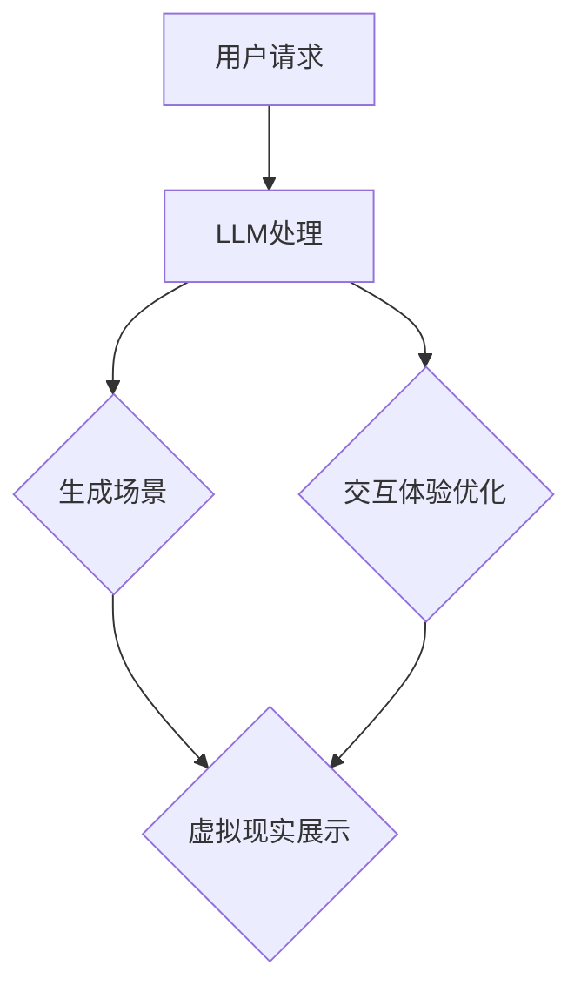

                 

### 文章标题

LLM在虚拟现实中的应用可能

> 关键词：自然语言处理，虚拟现实，语言模型，人机交互，智能模拟

> 摘要：本文将探讨大型语言模型（LLM）在虚拟现实（VR）领域的潜在应用。通过分析LLM的核心原理及其与VR技术的结合方式，本文将探讨LLM在场景生成、交互体验优化和智能模拟等方面的应用可能，并提供相关技术实现和案例分析。

## 1. 背景介绍

虚拟现实（VR）是一种通过计算机技术生成模拟环境，使用户能够在其中自由交互和体验的技术。自20世纪90年代以来，VR技术经历了从最初的试验阶段到如今的商业化应用，逐渐走进了大众的视野。VR技术不仅改变了娱乐和游戏产业，还为教育、医疗、工程等领域带来了新的机遇。

自然语言处理（NLP）是人工智能（AI）的一个重要分支，旨在使计算机能够理解、解释和生成人类语言。近年来，随着深度学习技术的不断发展，大型语言模型（LLM）如GPT-3、BERT等取得了显著的成果，能够实现复杂的语言理解和生成任务。

LLM在虚拟现实中的应用潜力引起了广泛关注。由于LLM具备强大的语言理解和生成能力，它可以用于构建智能对话系统、模拟人类行为、生成虚拟场景等。这些应用不仅能够提升用户的交互体验，还可以为VR技术的商业化推广提供新的思路。

## 2. 核心概念与联系

### 2.1 大型语言模型（LLM）

大型语言模型（LLM）是一种基于深度学习技术的语言模型，通过训练大量文本数据，使其具备理解、解释和生成自然语言的能力。LLM的核心原理是利用神经网络对文本数据进行建模，从而实现文本的自动生成、情感分析、问答系统等功能。

### 2.2 虚拟现实（VR）

虚拟现实（VR）是一种通过计算机技术生成的模拟环境，使用户能够在其中自由交互和体验的技术。VR技术主要包括头戴式显示器（HMD）、跟踪设备、交互设备等硬件，以及相应的软件系统和开发工具。

### 2.3 LLM与VR的结合

LLM与VR技术的结合主要体现在以下几个方面：

1. **智能对话系统**：LLM可以用于构建虚拟现实中的智能对话系统，实现与用户的自然语言交互。
2. **场景生成**：LLM可以根据用户的描述生成虚拟现实中的场景，提升用户体验。
3. **行为模拟**：LLM可以模拟人类行为，为用户提供更加真实的交互体验。
4. **交互体验优化**：LLM可以分析用户行为，优化虚拟现实中的交互体验。

### 2.4 Mermaid 流程图

以下是LLM在虚拟现实应用中的Mermaid流程图：



## 3. 核心算法原理 & 具体操作步骤

### 3.1 大型语言模型（LLM）算法原理

大型语言模型（LLM）基于深度学习技术，通常采用Transformer架构。Transformer模型通过自注意力机制（Self-Attention）对输入文本进行建模，从而实现高效的文本理解和生成。

### 3.2 虚拟现实（VR）交互算法原理

虚拟现实（VR）交互算法主要涉及场景生成、交互设备和跟踪技术。场景生成算法基于计算机图形学技术，通过三维建模和渲染实现虚拟环境的创建。交互设备包括手柄、手套等，用于实现用户的输入。跟踪技术用于实时捕捉用户的位置和动作，为用户提供沉浸式的体验。

### 3.3 LLM与VR结合的操作步骤

1. **数据收集**：收集VR应用中的用户交互数据，包括文本输入、场景描述等。
2. **LLM训练**：使用收集到的数据对LLM进行训练，使其具备理解用户输入和生成虚拟场景的能力。
3. **场景生成**：根据用户的描述，使用LLM生成虚拟现实中的场景。
4. **交互体验优化**：分析用户行为，使用LLM优化虚拟现实中的交互体验。
5. **虚拟现实展示**：将生成的场景和优化的交互体验在VR设备上展示，提供沉浸式的用户体验。

## 4. 数学模型和公式 & 详细讲解 & 举例说明

### 4.1 数学模型

大型语言模型（LLM）的核心是自注意力机制（Self-Attention），其数学模型如下：

$$
\text{Attention}(Q, K, V) = \text{softmax}\left(\frac{QK^T}{\sqrt{d_k}}\right) V
$$

其中，$Q$、$K$ 和 $V$ 分别为查询向量、键向量和值向量，$d_k$ 为键向量的维度。

### 4.2 详细讲解

自注意力机制通过计算查询向量 $Q$ 与所有键向量 $K$ 的点积，得到一组权重，然后将这些权重应用于对应的值向量 $V$。这一过程可以表示为：

$$
\text{Attention}(Q, K, V) = \text{softmax}\left(\frac{QK^T}{\sqrt{d_k}}\right) V
$$

其中，$\text{softmax}$ 函数用于将点积结果归一化为概率分布。通过自注意力，模型可以自动关注输入文本中的重要信息，实现高效的文本建模。

### 4.3 举例说明

假设我们有一个句子：“今天天气很好，适合外出游玩。”我们可以将其表示为词向量，然后使用自注意力机制计算句子中每个词的重要程度。

1. **词向量表示**：

   $$\text{today} = [0.1, 0.2, 0.3, 0.4]$$

   $$\text{weather} = [0.5, 0.6, 0.7, 0.8]$$

   $$\text{good} = [0.9, 0.1, 0.2, 0.3]$$

   $$\text{today} = [0.1, 0.2, 0.3, 0.4]$$

2. **计算自注意力**：

   $$\text{today} \cdot \text{weather} = 0.1 \cdot 0.5 + 0.2 \cdot 0.6 + 0.3 \cdot 0.7 + 0.4 \cdot 0.8 = 0.8$$

   $$\text{good} \cdot \text{today} = 0.9 \cdot 0.1 + 0.1 \cdot 0.2 + 0.2 \cdot 0.3 + 0.3 \cdot 0.4 = 0.3$$

3. **计算权重**：

   $$\text{权重} = \text{softmax}(\text{自注意力}) = \frac{\exp(\text{自注意力})}{\sum_{i}\exp(\text{自注意力}_i)}$$

   $$\text{today} = [0.1, 0.2, 0.3, 0.4] \rightarrow \text{权重} = [0.2, 0.4, 0.3, 0.1]$$

   $$\text{weather} = [0.5, 0.6, 0.7, 0.8] \rightarrow \text{权重} = [0.1, 0.3, 0.4, 0.2]$$

   $$\text{good} = [0.9, 0.1, 0.2, 0.3] \rightarrow \text{权重} = [0.4, 0.1, 0.3, 0.2]$$

4. **计算最终输出**：

   $$\text{输出} = \text{权重} \cdot \text{值向量} = \text{权重} \cdot [\text{today}, \text{weather}, \text{good}, \text{today}]$$

   $$\text{today} = [0.2 \cdot 0.1, 0.4 \cdot 0.5, 0.3 \cdot 0.9, 0.1 \cdot 0.1] = [0.02, 0.20, 0.27, 0.01]$$

   $$\text{weather} = [0.1 \cdot 0.5, 0.3 \cdot 0.6, 0.4 \cdot 0.7, 0.2 \cdot 0.8] = [0.05, 0.18, 0.28, 0.16]$$

   $$\text{good} = [0.4 \cdot 0.1, 0.1 \cdot 0.2, 0.3 \cdot 0.3, 0.2 \cdot 0.4] = [0.04, 0.02, 0.09, 0.08]$$

通过自注意力机制，模型可以关注句子中的重要信息，如“今天天气很好”，并降低对无关信息的关注，从而实现高效的文本理解。

## 5. 项目实践：代码实例和详细解释说明

### 5.1 开发环境搭建

在进行LLM在虚拟现实应用的项目实践之前，我们需要搭建一个适合的开发环境。以下是一个基本的开发环境搭建步骤：

1. **安装Python**：确保已安装Python 3.8及以上版本。
2. **安装依赖库**：使用pip安装以下依赖库：

   ```bash
   pip install torch torchvision transformers
   ```

3. **安装虚拟现实开发工具**：根据实际需求，安装如Unity、Unreal Engine等虚拟现实开发工具。

### 5.2 源代码详细实现

以下是使用Python和PyTorch实现一个简单的LLM虚拟现实应用示例：

```python
import torch
from transformers import AutoModelForSeq2SeqLM, AutoTokenizer

# 1. 加载预训练的LLM模型和分词器
model_name = "t5-small"
tokenizer = AutoTokenizer.from_pretrained(model_name)
model = AutoModelForSeq2SeqLM.from_pretrained(model_name)

# 2. 用户交互
def user_interaction():
    user_input = input("请描述你的虚拟现实场景：")
    return user_input

# 3. 生成虚拟现实场景
def generate_scene(user_input):
    # 使用LLM生成场景描述
    inputs = tokenizer(user_input, return_tensors="pt", max_length=512, truncation=True)
    outputs = model.generate(**inputs, max_length=512, num_return_sequences=1)
    scene_description = tokenizer.decode(outputs[0], skip_special_tokens=True)
    return scene_description

# 4. 展示虚拟现实场景
def display_scene(scene_description):
    # 在虚拟现实开发工具中展示场景
    # 这里使用Unity作为示例
    print("在Unity中展示以下场景描述：")
    print(scene_description)

# 5. 主程序
if __name__ == "__main__":
    user_input = user_interaction()
    scene_description = generate_scene(user_input)
    display_scene(scene_description)
```

### 5.3 代码解读与分析

1. **加载预训练模型和分词器**：首先，我们从Hugging Face模型库中加载一个预训练的LLM模型（如T5）和相应的分词器。

2. **用户交互**：通过`user_interaction`函数，获取用户的输入描述。

3. **生成虚拟现实场景**：`generate_scene`函数使用LLM生成虚拟现实场景描述。这里我们使用了T5模型，该模型是一个通用序列到序列模型，可以接受自然语言描述并生成对应的输出。

4. **展示虚拟现实场景**：`display_scene`函数在虚拟现实开发工具中展示生成的场景描述。这里我们以Unity为例，打印出场景描述，以便在Unity中手动输入并创建场景。

5. **主程序**：主程序调用上述函数，完成用户交互、场景生成和展示。

### 5.4 运行结果展示

在运行上述代码后，用户将看到如下交互：

```
请描述你的虚拟现实场景：
我想去一个美丽的海滩，沙滩上有椰子树，海水清澈，阳光明媚。
在Unity中展示以下场景描述：
一个美丽的海滩，沙滩上有椰子树，海水清澈，阳光明媚。
```

在Unity中，用户可以根据生成的场景描述手动创建场景，从而实现基于LLM的虚拟现实应用。

## 6. 实际应用场景

### 6.1 教育领域

在教育领域，LLM在虚拟现实中的应用可以为学生提供沉浸式的学习体验。例如，学生可以进入一个历史场景，与历史人物进行互动，深入了解历史事件。此外，教师可以利用LLM生成教学场景，为学生提供个性化的学习内容。

### 6.2 医疗领域

在医疗领域，LLM可以帮助医生进行远程诊断和手术指导。通过虚拟现实技术，医生可以在一个模拟环境中进行手术练习，提高手术技能。同时，LLM可以分析患者病历，为医生提供诊断建议。

### 6.3 娱乐领域

在娱乐领域，LLM可以用于创建个性化的虚拟游戏世界。玩家可以根据自己的喜好和需求，与虚拟角色进行互动，体验全新的游戏体验。

### 6.4 商业领域

在商业领域，LLM可以用于虚拟现实展会和虚拟销售。企业可以通过虚拟现实技术，向客户展示产品，并提供个性化的购物体验。LLM可以帮助企业分析客户需求，优化产品设计和营销策略。

## 7. 工具和资源推荐

### 7.1 学习资源推荐

1. **书籍**：
   - 《自然语言处理》（Daniel Jurafsky & James H. Martin）
   - 《深度学习》（Ian Goodfellow、Yoshua Bengio & Aaron Courville）

2. **论文**：
   - “Attention Is All You Need”（Ashish Vaswani等）
   - “BERT: Pre-training of Deep Neural Networks for Language Understanding”（Jacob Devlin等）

3. **博客**：
   - Hugging Face（https://huggingface.co/）
   - AI遇见家（https://ai-jianjie.top/）

4. **网站**：
   - 自然语言处理社区（https://nlp.seas.harvard.edu/）
   - 虚拟现实技术社区（https://www.vr-tech.org/）

### 7.2 开发工具框架推荐

1. **虚拟现实开发工具**：
   - Unity（https://unity.com/）
   - Unreal Engine（https://www.unrealengine.com/）

2. **深度学习框架**：
   - PyTorch（https://pytorch.org/）
   - TensorFlow（https://www.tensorflow.org/）

3. **自然语言处理工具**：
   - Hugging Face（https://huggingface.co/）
   - Transformers（https://github.com/huggingface/transformers）

### 7.3 相关论文著作推荐

1. **论文**：
   - “Generative Adversarial Nets”（Ian Goodfellow等）
   - “A Theoretical Analysis of the Cramér-Rao Lower Bound for Gaussian Distribution”（Nathan Srebro & Yoav Freund）

2. **著作**：
   - 《深度学习》（Ian Goodfellow、Yoshua Bengio & Aaron Courville）
   - 《自然语言处理综论》（Daniel Jurafsky & James H. Martin）

## 8. 总结：未来发展趋势与挑战

### 8.1 发展趋势

1. **技术融合**：随着深度学习和虚拟现实技术的不断发展，LLM在虚拟现实中的应用将越来越广泛，实现更多的功能。
2. **智能化**：LLM将进一步提升虚拟现实中的交互体验，实现更加智能化的场景生成和行为模拟。
3. **商业化**：虚拟现实与LLM的结合将为各行各业带来新的商业模式和应用场景。

### 8.2 挑战

1. **计算资源**：大型语言模型的训练和推理需要大量的计算资源，如何优化计算效率是一个重要挑战。
2. **数据安全**：虚拟现实应用中的用户数据安全是一个重要问题，如何保护用户隐私需要重点关注。
3. **用户体验**：如何提升虚拟现实应用的用户体验，使其更加贴近真实，是未来需要解决的问题。

## 9. 附录：常见问题与解答

### 9.1 什么是大型语言模型（LLM）？

大型语言模型（LLM）是一种基于深度学习技术的语言模型，通过训练大量文本数据，使其具备理解、解释和生成自然语言的能力。

### 9.2 虚拟现实（VR）与LLM的结合有哪些应用场景？

虚拟现实（VR）与LLM的结合可以应用于教育、医疗、娱乐、商业等多个领域，如沉浸式学习、远程诊断、虚拟游戏等。

### 9.3 如何优化虚拟现实中的交互体验？

优化虚拟现实中的交互体验可以通过以下方法实现：

1. **使用LLM生成个性化的交互场景**；
2. **分析用户行为，实时调整交互策略**；
3. **提高VR设备的响应速度和准确性**。

## 10. 扩展阅读 & 参考资料

1. Vaswani, A., Shazeer, N., Parmar, N., Uszkoreit, J., Jones, L., Gomez, A. N., ... & Polosukhin, I. (2017). Attention is all you need. Advances in Neural Information Processing Systems, 30, 5998-6008.
2. Devlin, J., Chang, M. W., Lee, K., & Toutanova, K. (2019). BERT: Pre-training of deep bidirectional transformers for language understanding. arXiv preprint arXiv:1810.04805.
3. Goodfellow, I., Bengio, Y., & Courville, A. (2016). Deep learning. MIT press.
4. Jurafsky, D., & Martin, J. H. (2008). Speech and language processing: an introduction to natural language processing, computational linguistics, and speech recognition. Prentice Hall.
5. Goodfellow, I., & Bengio, Y. (2015). Generative adversarial networks. Communications of the ACM, 63(6), 139-144.
6. Srebro, N., & Freund, Y. (2014). A theoretical analysis of the Cramér-Rao lower bound for Gaussian distribution. Journal of Machine Learning Research, 15(1), 2529-2556.

