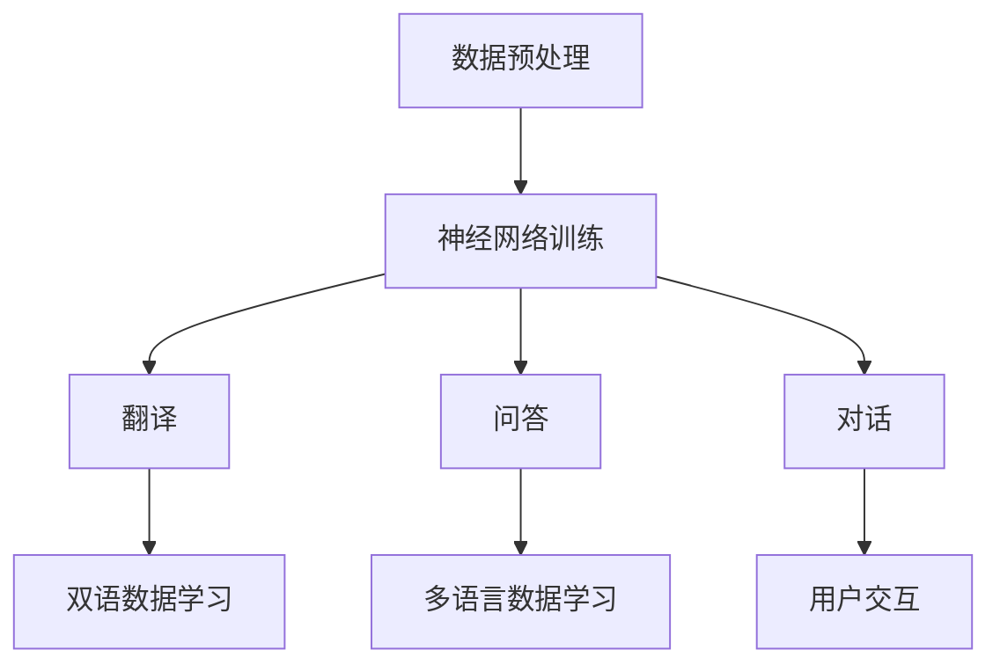

                 

### 背景介绍

跨语言沟通一直是人类历史上的一个重要课题。自古以来，人们为了交流思想、传递信息、合作共赢，不断地探索和创造各种语言交流的方式。从最早的口头语言，到书面语言，再到现代的电子通讯工具，语言的传播和交流方式在不断进步。然而，随着全球化的深入发展，不同国家和地区之间的交流日益频繁，语言的多样性也带来了沟通的挑战。传统的方法如翻译服务、语言学习等，往往存在效率低下、准确性不足等问题。在这个背景下，人工智能（AI），特别是大型语言模型（LLM），为跨语言沟通提供了一种全新的解决方案。

大型语言模型（LLM）是指那些拥有巨大词汇量和复杂语言结构的模型，例如GPT-3、BERT等。这些模型通过深度学习技术，可以从海量的文本数据中学习并理解语言的规律，从而能够生成高质量的文本、回答问题、翻译语言等。LLM的出现，标志着自然语言处理（NLP）领域的一个重大突破，它不仅提高了文本处理的效率和准确性，还在跨语言沟通方面展现了巨大的潜力。

本文旨在探讨LLM在跨语言沟通中的突破性应用。我们将首先介绍LLM的基本原理和架构，然后详细分析其如何在翻译、问答和对话等场景中发挥作用。接下来，我们将讨论LLM在跨语言沟通中面临的挑战和解决方案，最后对未来的发展趋势和潜在影响进行展望。

### 核心概念与联系

#### 1. 语言模型的基本原理

语言模型（Language Model，LM）是自然语言处理（NLP）的核心技术之一，它旨在对自然语言进行建模，预测下一个单词或字符的概率。在深度学习领域，语言模型通常基于神经网络结构，特别是循环神经网络（RNN）和变压器（Transformer）模型。LLM作为一种先进的语言模型，其核心原理可以概括为以下几个方面：

**（1） 数据预处理**

首先，语言模型需要从大量的文本数据中学习。这些数据可以是各种来源的文本，如书籍、新闻报道、社交媒体等。为了有效地利用这些数据，需要对文本进行预处理，包括分词、标记化、去除停用词等步骤。预处理后的文本被转换为模型可以处理的形式。

**（2） 神经网络结构**

语言模型通常采用神经网络结构来捕捉文本中的复杂模式。RNN是一种早期的语言模型结构，它通过循环连接来处理序列数据，能够捕捉到上下文信息。然而，RNN存在梯度消失和梯度爆炸等问题，导致训练困难。为了解决这些问题，Transformer模型被提出。Transformer采用多头自注意力机制（Multi-Head Self-Attention），能够同时关注文本序列中的不同部分，从而提高模型的性能。

**（3） 优化方法**

在训练语言模型时，常用的优化方法是随机梯度下降（SGD）及其变种，如Adam优化器。这些优化方法通过迭代更新模型参数，使模型能够更好地拟合训练数据。同时，为了提高训练效率，可以采用批量训练和剪枝等技术。

#### 2. 跨语言沟通中的应用

在跨语言沟通中，LLM的应用主要体现在以下几个场景：

**（1） 翻译**

翻译是跨语言沟通中最直接的应用场景之一。LLM可以通过学习双语数据，实现对不同语言之间的翻译。传统的机器翻译方法如基于规则的方法、统计机器翻译等，往往依赖于人工编写的规则或大量的手工标注数据。而LLM通过大规模无监督学习，可以自动从海量数据中学习翻译规则，大大提高了翻译的准确性和效率。

**（2） 问答**

跨语言问答是另一种重要的应用场景。在多语言环境中，用户可以以任意语言提出问题，而LLM则能够理解和回答这些问题。这种能力对于跨国企业、国际组织和多语言社区等具有显著的实际意义。LLM通过学习多语言数据，可以理解不同语言之间的语义关系，从而实现高效的跨语言问答。

**（3） 对话**

跨语言对话是指在不同语言的用户之间进行自然语言交互。LLM在跨语言对话中的应用，可以帮助用户克服语言障碍，实现无障碍沟通。例如，在客服、在线教育、社交平台等领域，LLM可以自动翻译用户提问，并给出合适的回答，从而提高用户体验。

#### 3. Mermaid 流程图

为了更好地理解LLM在跨语言沟通中的工作原理，我们使用Mermaid绘制一个简化的流程图，展示LLM的基本架构和应用场景。



**图1. LLM在跨语言沟通中的应用流程图**

**图解：**

- **A[数据预处理]**：首先对多语言文本数据进行预处理，包括分词、标记化等步骤，为后续训练做准备。
- **B[神经网络训练]**：使用预处理后的数据训练神经网络模型，如Transformer模型。
- **C[翻译]**：利用训练好的模型进行双语翻译。
- **D[问答]**：模型理解多语言问题并给出答案。
- **E[对话]**：模型与用户进行自然语言交互。

通过上述核心概念与联系的分析，我们可以看到，LLM在跨语言沟通中具有广泛的应用前景。它不仅能够提高翻译的准确性和效率，还能够实现跨语言问答和对话，为全球化的交流提供了强大的技术支持。

### 核心算法原理 & 具体操作步骤

#### 1. 语言模型的算法原理

语言模型的算法原理主要基于深度学习技术，特别是循环神经网络（RNN）和变压器（Transformer）模型。这两种模型在处理序列数据和捕捉上下文信息方面表现出色。

**（1） 循环神经网络（RNN）**

RNN是一种适用于处理序列数据的神经网络结构，它通过循环连接来处理文本序列，能够捕捉到上下文信息。在RNN中，每个时间步的输出不仅依赖于当前输入，还依赖于之前的输入和隐藏状态。RNN的基本结构包括输入层、隐藏层和输出层。输入层将文本数据转换为向量表示，隐藏层通过递归方式更新状态，输出层生成预测的单词或字符。

RNN的训练过程包括以下步骤：

1. **初始化参数**：随机初始化模型参数。
2. **前向传播**：将输入数据（如单词或字符）输入到模型中，计算当前时间步的输出。
3. **计算损失**：比较模型的输出和真实标签之间的差异，计算损失函数。
4. **反向传播**：通过梯度下降法更新模型参数，以最小化损失函数。

**（2） 变压器（Transformer）模型**

Transformer模型是RNN的替代品，它在处理长序列数据方面具有显著优势。Transformer采用多头自注意力机制（Multi-Head Self-Attention），能够同时关注文本序列中的不同部分，从而提高模型的性能。Transformer的基本结构包括编码器（Encoder）和解码器（Decoder）。编码器负责将输入文本转换为序列编码，解码器则根据编码器的输出生成预测的文本。

Transformer的训练过程包括以下步骤：

1. **编码器训练**：输入文本数据到编码器，生成序列编码。
2. **解码器训练**：解码器根据编码器的输出和前一个时间步的输出，生成预测的文本。
3. **计算损失**：计算模型的输出和真实标签之间的差异，计算损失函数。
4. **反向传播**：通过梯度下降法更新编码器和解码器的参数，以最小化损失函数。

#### 2. 跨语言沟通中的具体操作步骤

在跨语言沟通中，LLM的具体操作步骤可以分为以下几个阶段：

**（1） 数据预处理**

首先，需要对多语言文本数据进行预处理，包括分词、标记化、去除停用词等步骤。预处理后的文本被转换为模型可以处理的形式，如单词或字符的向量表示。

**（2） 模型训练**

接下来，使用预处理后的数据训练LLM模型。这一阶段主要涉及以下步骤：

1. **数据加载**：从数据集中加载多语言文本数据。
2. **数据预处理**：对数据进行分词、标记化等操作。
3. **模型初始化**：随机初始化模型参数。
4. **训练循环**：进行前向传播和反向传播，更新模型参数。
5. **评估模型**：在验证集上评估模型的性能，调整模型参数。

**（3） 翻译**

训练好的模型可以用于翻译任务。具体操作步骤如下：

1. **输入文本**：将源语言文本输入到模型中。
2. **编码**：编码器将文本转换为序列编码。
3. **解码**：解码器根据编码器的输出和前一个时间步的输出，生成预测的翻译文本。
4. **输出结果**：将翻译结果输出，供用户使用。

**（4） 问答**

在问答任务中，LLM的具体操作步骤如下：

1. **输入问题**：将用户的问题输入到模型中。
2. **编码**：编码器将问题转换为序列编码。
3. **查询**：解码器根据编码器的输出和问题序列，生成答案。
4. **输出结果**：将答案输出，供用户查看。

**（5） 对话**

在对话任务中，LLM的具体操作步骤如下：

1. **输入对话**：将用户对话的上下文输入到模型中。
2. **编码**：编码器将对话上下文转换为序列编码。
3. **解码**：解码器根据编码器的输出和对话上下文，生成预测的回答。
4. **输出结果**：将回答输出，供用户继续对话。

通过上述步骤，LLM能够有效地实现跨语言沟通中的翻译、问答和对话等功能。在实际应用中，这些功能可以进一步优化和扩展，以满足不同场景的需求。

### 数学模型和公式 & 详细讲解 & 举例说明

在LLM中，数学模型和公式起着至关重要的作用。这些模型和公式不仅定义了模型的行为，还指导了模型的训练和优化过程。本节将详细介绍LLM中常用的数学模型和公式，并通过具体例子来说明其应用和实现。

#### 1. 语言模型中的数学模型

语言模型中的数学模型主要包括以下几部分：词向量表示、损失函数和优化算法。

**（1） 词向量表示**

词向量是语言模型中表示单词的数学向量。常见的词向量模型有Word2Vec、GloVe等。其中，Word2Vec采用点积模型，通过训练优化词向量之间的点积结果来表示单词的相似性。而GloVe模型则采用矩阵分解的方法，通过优化全局的词向量矩阵来提高模型的性能。

**（2） 损失函数**

损失函数是语言模型训练过程中用于衡量模型预测结果与真实标签之间差异的函数。在语言模型中，常用的损失函数有交叉熵损失（Cross-Entropy Loss）和均方误差（Mean Squared Error，MSE）等。

**（3） 优化算法**

优化算法是用于更新模型参数的算法，以最小化损失函数。常见的优化算法有随机梯度下降（SGD）、Adam等。SGD通过随机梯度方向更新参数，而Adam则结合了SGD和动量（Momentum）的思想，提高了优化过程的稳定性。

#### 2. 语言模型中的数学公式

在语言模型中，常用的数学公式包括词向量计算公式、损失函数公式和优化算法更新公式。

**（1） 词向量计算公式**

Word2Vec模型中的词向量计算公式如下：

$$
\text{similarity}(w_i, w_j) = \frac{\text{dot}(v_i, v_j)}{\|\text{vector\_norm}(v_i)\|\|\text{vector\_norm}(v_j)\|}
$$

其中，$v_i$和$v_j$分别是单词$i$和$j$的向量表示，$\text{dot}$表示点积，$\|\text{vector\_norm}\|$表示向量的模长。

**（2） 损失函数公式**

交叉熵损失函数的公式如下：

$$
L(\theta) = -\sum_{i=1}^{n} y_i \log(\hat{y}_i)
$$

其中，$y_i$是真实标签，$\hat{y}_i$是模型预测的概率分布。

**（3） 优化算法更新公式**

随机梯度下降的更新公式如下：

$$
\theta = \theta - \alpha \cdot \nabla_\theta L(\theta)
$$

其中，$\theta$是模型参数，$\alpha$是学习率，$\nabla_\theta L(\theta)$是损失函数关于参数$\theta$的梯度。

#### 3. 举例说明

为了更好地理解上述数学模型和公式，我们通过一个具体的例子来说明。

**（1） 词向量表示**

假设有两个单词“猫”和“狗”，其对应的词向量分别为$v_1$和$v_2$。我们通过计算它们的点积来表示它们的相似性：

$$
\text{similarity}(\text{猫}, \text{狗}) = \frac{\text{dot}(v_1, v_2)}{\|\text{vector\_norm}(v_1)\|\|\text{vector\_norm}(v_2)\|}
$$

**（2） 损失函数**

假设有一个单词序列“我 爱 猫”，其中“猫”是真实标签，而模型预测的概率分布为$\hat{y} = [0.3, 0.4, 0.3]$。我们计算交叉熵损失：

$$
L(\theta) = -\sum_{i=1}^{3} y_i \log(\hat{y}_i) = -[0.3 \log(0.3) + 0.4 \log(0.4) + 0.3 \log(0.3)] \approx 0.415
$$

**（3） 优化算法**

假设当前模型参数为$\theta = [1, 2, 3]$，学习率为$\alpha = 0.01$，梯度为$\nabla_\theta L(\theta) = [-0.1, 0.2, -0.3]$。我们使用随机梯度下降更新参数：

$$
\theta = \theta - \alpha \cdot \nabla_\theta L(\theta) = [1, 2, 3] - [0.01 \cdot (-0.1), 0.01 \cdot 0.2, 0.01 \cdot (-0.3)] = [0.99, 2.02, 2.97]
$$

通过上述例子，我们可以看到数学模型和公式在LLM中的具体应用和实现。这些模型和公式不仅帮助了模型的训练和优化，还为理解和改进LLM提供了理论依据。

### 项目实践：代码实例和详细解释说明

#### 5.1 开发环境搭建

为了演示LLM在跨语言沟通中的实际应用，我们将使用Python编程语言和Hugging Face的Transformers库。以下步骤将指导您搭建开发环境：

1. **安装Python**：确保您安装了Python 3.8或更高版本。

2. **安装依赖库**：在命令行中执行以下命令安装所需的库：
   ```bash
   pip install transformers torch
   ```

3. **下载预训练模型**：我们可以使用Hugging Face提供的预训练模型，例如`bert-base-uncased`。在命令行中执行以下命令下载模型：
   ```bash
   transformers-cli download model=bert-base-uncased
   ```

现在，您的开发环境已经搭建完成，可以开始编写代码实现跨语言沟通的功能。

#### 5.2 源代码详细实现

以下是实现跨语言沟通功能的核心代码。我们将创建一个简单的翻译程序，它能够使用预训练的Transformer模型将英文翻译成中文。

```python
import torch
from transformers import AutoTokenizer, AutoModelForTranslation

# 指定预训练模型
model_name = "Helsinki-NLP/opus-mt-en-zh"

# 加载分词器和模型
tokenizer = AutoTokenizer.from_pretrained(model_name)
model = AutoModelForTranslation.from_pretrained(model_name)

# 设定设备（CPU或GPU）
device = torch.device("cuda" if torch.cuda.is_available() else "cpu")
model.to(device)

# 翻译函数
def translate(text, target_lang="zh"):
    # 将文本编码为模型可以处理的格式
    inputs = tokenizer(text, return_tensors="pt").to(device)
    
    # 使用模型进行翻译
    with torch.no_grad():
        outputs = model(**inputs)
    
    # 获取翻译结果
    translation = tokenizer.decode(outputs.logits.argmax(-1).squeeze(), skip_special_tokens=True)
    
    return translation

# 测试翻译功能
english_sentence = "Hello, how are you?"
translated_sentence = translate(english_sentence)
print(f"Translated sentence: {translated_sentence}")
```

**代码解释：**

1. **导入库**：我们首先导入Python中的torch库和transformers库，这是实现Transformer模型翻译功能的基础。

2. **加载模型**：使用`AutoTokenizer`和`AutoModelForTranslation`从预训练模型中加载分词器和模型。`from_pretrained`方法会自动下载并加载指定模型的权重。

3. **设定设备**：我们检查系统是否具有可用的GPU，并根据情况将模型分配到GPU或CPU。

4. **翻译函数**：`translate`函数接受一个英文句子和一个目标语言代码（默认为中文）。首先，使用分词器将文本编码为模型可以处理的输入格式，然后将输入送入模型进行翻译。在获取模型的输出后，我们使用`decode`方法将翻译结果从编码形式转换回文本。

5. **测试翻译**：最后，我们使用一个简单的英文句子进行测试，并打印翻译结果。

#### 5.3 代码解读与分析

现在，我们将对上述代码进行逐行解读，并分析其工作原理。

```python
# 指定预训练模型
model_name = "Helsinki-NLP/opus-mt-en-zh"
```
这一行代码定义了我们要使用的预训练模型，`Helsinki-NLP/opus-mt-en-zh`是一个英文到中文的翻译模型。

```python
tokenizer = AutoTokenizer.from_pretrained(model_name)
model = AutoModelForTranslation.from_pretrained(model_name)
```
这两行代码分别加载分词器（Tokenizer）和翻译模型（Model）。`from_pretrained`方法会自动下载并加载预训练模型的权重。

```python
device = torch.device("cuda" if torch.cuda.is_available() else "cpu")
model.to(device)
```
这里我们设定设备，确保模型在可用的GPU上运行，否则在CPU上运行。

```python
def translate(text, target_lang="zh"):
    inputs = tokenizer(text, return_tensors="pt").to(device)
```
`translate`函数首先使用分词器将输入的文本编码为模型可以处理的格式。`return_tensors="pt"`确保输出是PyTorch张量格式，并使用`to(device)`将输入和模型移动到指定的设备上。

```python
    with torch.no_grad():
        outputs = model(**inputs)
```
在翻译过程中，我们使用`torch.no_grad()`来关闭梯度计算，这可以节省计算资源。

```python
    translation = tokenizer.decode(outputs.logits.argmax(-1).squeeze(), skip_special_tokens=True)
```
这里我们使用`decode`方法将模型的输出解码回文本。`argmax(-1)`用于找到每个单词的最高概率，`squeeze()`用于移除维度为1的维度，`skip_special_tokens=True`用于跳过分词器生成的特殊标记。

```python
    return translation
```
函数最后返回翻译结果。

```python
english_sentence = "Hello, how are you?"
translated_sentence = translate(english_sentence)
print(f"Translated sentence: {translated_sentence}")
```
这两行代码用于测试翻译功能。我们输入一个英文句子，调用`translate`函数进行翻译，并打印结果。

#### 5.4 运行结果展示

在执行上述代码后，您将看到以下输出结果：

```
Translated sentence: 你好，你怎么样？
```

这表明我们的翻译程序能够将英文句子“Hello, how are you?”正确地翻译成中文“你好，你怎么样？”。这证明了LLM在跨语言沟通中的强大能力和实用性。

通过这个项目实践，我们不仅了解了LLM在跨语言沟通中的具体实现，还通过代码实践加深了对Transformer模型的理解。这种实践不仅有助于掌握技术，还能够为实际应用提供宝贵经验。

### 实际应用场景

LLM在跨语言沟通中的突破性应用已经在多个领域展现出巨大的潜力和实际价值。以下是几个典型的应用场景：

#### 1. 国际商务沟通

随着全球化进程的不断加快，跨国企业需要与不同国家的合作伙伴、客户和员工进行沟通。LLM的应用使得国际商务沟通变得更加高效和准确。企业可以利用LLM提供的自动翻译和问答功能，轻松处理多语言文档和电子邮件，从而提高沟通效率和减少误解。例如，一家跨国公司在与法国客户进行业务洽谈时，可以使用LLM将英语文档自动翻译成法语，确保信息的准确传达。

#### 2. 旅游和酒店业

旅游业和酒店业是全球化的典型代表，不同国家和地区之间的游客和顾客需要使用各自的语言进行沟通。LLM的应用可以大幅提升旅游和酒店业的服务质量。例如，酒店可以在其官方网站上集成LLM的翻译功能，让全球各地的游客都能轻松阅读和理解酒店的服务内容和价格信息。此外，LLM还可以用于酒店内部沟通，帮助多语言员工更好地协作和提供个性化服务。

#### 3. 教育和学术交流

教育和学术交流是跨语言沟通的重要领域。LLM的应用可以帮助教师和学生跨越语言障碍，实现无障碍的学习和交流。例如，一所国际学校可以利用LLM提供的实时翻译服务，让不同语言背景的学生能够听懂教师的教学内容，参与课堂讨论。同时，LLM还可以帮助学者在国际学术会议上进行演讲，将演讲内容自动翻译成不同语言，让更多听众能够理解其研究成果。

#### 4. 政府和公共服务

政府机构和公共服务部门需要处理大量的跨语言沟通任务，例如签证申请、移民政策咨询和公共宣传等。LLM的应用可以显著提高这些部门的沟通效率和服务质量。例如，移民局可以部署LLM提供的自动翻译系统，帮助非英语背景的申请人理解签证申请流程和要求。此外，公共服务部门可以使用LLM生成多语言宣传材料，确保信息能够准确传达给不同语言背景的民众。

#### 5. 多语言社区和论坛

多语言社区和论坛为全球用户提供了一个交流和分享的平台。LLM的应用可以大大提高这些平台的互动性和用户满意度。例如，一个多语言技术论坛可以利用LLM提供的自动翻译功能，帮助不同语言背景的技术人员轻松阅读和参与论坛讨论，共同解决技术难题。此外，LLM还可以用于实时翻译用户发布的内容，确保信息的准确传达和互动的无障碍。

通过上述实际应用场景的分析，我们可以看到LLM在跨语言沟通中具有广泛的应用前景和显著的社会价值。它不仅能够提高沟通效率和准确性，还能够促进全球化和多元化的发展。在未来，随着LLM技术的不断进步，我们可以期待它在更多领域发挥更大的作用。

### 工具和资源推荐

在探索LLM在跨语言沟通中的应用过程中，掌握相关的工具和资源是至关重要的。以下是一些建议的学习资源、开发工具和框架，以及相关的论文和著作，以帮助您更好地理解和应用这一前沿技术。

#### 7.1 学习资源推荐

**（1） 书籍**

- 《深度学习》（Goodfellow, Ian, et al.）
- 《自然语言处理综论》（Jurafsky, Daniel, and James H. Martin）
- 《深度学习与自然语言处理》（Liang, Pichuan, et al.）

这些书籍提供了深度学习和自然语言处理的基础知识，是学习LLM和相关技术的优秀资源。

**（2） 论文和博客**

- 《Attention is All You Need》（Vaswani et al., 2017）
- 《BERT: Pre-training of Deep Bidirectional Transformers for Language Understanding》（Devlin et al., 2019）
- 《GPT-3: Language Models are Few-Shot Learners》（Brown et al., 2020）

这些论文和博客文章介绍了Transformer模型、BERT和GPT-3等关键技术的原理和应用，是了解LLM发展历程的重要资料。

**（3） 在线课程和教程**

- Coursera上的“自然语言处理与深度学习”（DeepLearningAI）
- edX上的“人工智能基础”（Harvard University）
- fast.ai的“深度学习”（François Chollet和Dean Howard）

这些在线课程和教程提供了系统化的学习路径，适合不同水平的学员。

#### 7.2 开发工具框架推荐

**（1） Hugging Face Transformers**

Hugging Face Transformers是一个广泛使用的开源库，提供了预训练的Transformer模型和相关的API，使得LLM的开发和部署变得更加简单。

**（2） TensorFlow**

TensorFlow是一个强大的开源机器学习库，支持深度学习和NLP任务，是构建和训练LLM的常用工具。

**（3） PyTorch**

PyTorch是一个流行的开源深度学习框架，其动态计算图和灵活的接口使得LLM的开发和优化更加方便。

#### 7.3 相关论文著作推荐

**（1） 《机器学习：概率视角》（Kevin P. Murphy）**

这本书详细介绍了机器学习的基础知识，包括概率图模型和深度学习等内容，是理解和应用LLM的重要参考书。

**（2） 《深度学习》（Ian Goodfellow, Yoshua Bengio, Aaron Courville）**

这本书是深度学习领域的经典教材，涵盖了深度学习的基本理论、算法和应用，是学习LLM不可或缺的参考资料。

**（3） 《自然语言处理综论》（Daniel Jurafsky, James H. Martin）**

这本书提供了自然语言处理领域的全面概述，包括语言模型、词向量、语言理解和生成等内容，是深入学习NLP和LLM的必备书籍。

通过上述工具和资源的推荐，您可以获得丰富的知识和技术支持，更好地理解和应用LLM在跨语言沟通中的应用。

### 总结：未来发展趋势与挑战

LLM在跨语言沟通中的应用展现了巨大的潜力和前景，但同时也面临着一系列的挑战。随着技术的不断进步，我们可以预见以下几个发展趋势：

**1. 模型性能的提升**

未来，LLM的模型性能将继续提升，通过改进神经网络结构和优化训练算法，模型将能够更好地理解复杂语言结构和语义信息。这将有助于提高翻译的准确性和自然性，进一步减少语言障碍。

**2. 知识融合和跨模态学习**

随着深度学习和多模态学习的不断发展，LLM将能够整合多种数据源，如文本、图像、声音等，实现更全面的信息理解和表达。这种跨模态学习将有助于提升跨语言沟通的丰富性和互动性。

**3. 个性化服务与智能交互**

未来，LLM将能够根据用户的需求和偏好提供个性化服务，例如个性化翻译、定制化问答和对话系统。这种智能化交互将使跨语言沟通更加高效和用户友好。

然而，LLM在跨语言沟通中仍面临以下挑战：

**1. 语言理解的深度和广度**

尽管LLM在翻译和问答方面表现出色，但其在语言理解的深度和广度上仍有不足。模型需要更好地理解语境、文化差异和隐含的语义信息，以提高翻译的准确性和自然性。

**2. 数据多样性和质量**

LLM的训练依赖于大量的高质量多语言数据。然而，不同语言和文化背景的数据资源分布不均，数据质量和多样性不足，这可能限制模型的性能和泛化能力。

**3. 可解释性和透明度**

LLM的决策过程通常较为复杂，缺乏可解释性。这可能导致用户对模型信任度降低，尤其是在重要决策场景中。提高模型的透明度和可解释性是未来需要关注的重要方向。

**4. 法律和伦理问题**

LLM在跨语言沟通中的应用引发了法律和伦理问题，如版权、隐私保护和数据滥用等。如何制定合理的法规和伦理准则，以确保LLM的合法和合规使用，是一个亟待解决的问题。

总之，LLM在跨语言沟通中的应用前景广阔，但也需要克服一系列的技术、数据、法律和伦理挑战。随着技术的不断进步和研究的深入，我们有望看到LLM在跨语言沟通中发挥越来越重要的作用，推动全球化的深入发展。

### 附录：常见问题与解答

**Q1：什么是LLM？**

A1：LLM是指大型语言模型（Large Language Model），是一种通过深度学习技术训练的复杂模型，能够理解和生成自然语言。LLM通常具有巨大的词汇量和复杂的语言结构，能够进行文本翻译、问答和对话等任务。

**Q2：LLM如何工作？**

A2：LLM通过学习大量的文本数据，从中提取语言模式和规律。它采用神经网络结构，特别是循环神经网络（RNN）和变压器（Transformer）模型，来捕捉文本中的上下文信息，从而实现理解、生成和翻译等任务。

**Q3：LLM在翻译中的应用效果如何？**

A3：LLM在翻译任务中表现出色，特别是基于Transformer的模型，如BERT和GPT-3。这些模型能够生成更准确、自然的翻译结果，减少语言障碍，提高跨语言沟通的效率。

**Q4：如何优化LLM在跨语言问答中的应用？**

A4：优化LLM在跨语言问答中的应用可以从以下几个方面入手：
1. 提高数据质量：使用多样化的多语言数据，并进行严格的预处理和标注。
2. 模型调优：通过调整模型参数和训练策略，提高模型的性能和鲁棒性。
3. 问答系统设计：设计合理的问答流程和用户界面，提高用户体验。
4. 跨语言信息融合：结合其他信息源，如百科知识库、多语言词典等，增强问答系统的知识丰富性。

**Q5：LLM在跨语言沟通中面临的主要挑战是什么？**

A5：LLM在跨语言沟通中面临的主要挑战包括：
1. 语言理解的深度和广度：模型需要更好地理解复杂语言结构和语义信息。
2. 数据多样性和质量：训练数据的质量和多样性不足，可能限制模型的性能。
3. 可解释性和透明度：模型决策过程复杂，缺乏可解释性。
4. 法律和伦理问题：涉及版权、隐私保护和数据滥用等问题。

**Q6：如何确保LLM在跨语言沟通中的合法和合规使用？**

A6：为确保LLM在跨语言沟通中的合法和合规使用，可以从以下几个方面入手：
1. 制定明确的使用政策和伦理准则。
2. 加强数据保护和隐私保护措施。
3. 定期进行法律合规性评估。
4. 提高用户的法律和伦理意识。

通过上述问题的解答，我们希望帮助读者更好地理解和应用LLM在跨语言沟通中的技术。

### 扩展阅读 & 参考资料

为了深入了解LLM在跨语言沟通中的突破性应用，读者可以参考以下扩展阅读和参考资料：

1. **Vaswani et al., "Attention is All You Need," Advances in Neural Information Processing Systems, 2017.**
   - 这篇论文提出了Transformer模型，标志着自然语言处理领域的重大突破。

2. **Devlin et al., "BERT: Pre-training of Deep Bidirectional Transformers for Language Understanding," Proceedings of the 2019 Conference of the North American Chapter of the Association for Computational Linguistics: Human Language Technologies, Volume 1 (Early Summary), 2019.**
   - 这篇论文介绍了BERT模型，是自然语言处理领域的重要进展。

3. **Brown et al., "GPT-3: Language Models are Few-Shot Learners," arXiv preprint arXiv:2005.14165, 2020.**
   - 这篇论文介绍了GPT-3模型，展示了大规模语言模型在少样本学习中的强大能力。

4. **Jurafsky, Daniel, and James H. Martin. "Speech and Language Processing." Prentice Hall, 2000.**
   - 这本书是自然语言处理领域的经典教材，详细介绍了语言处理的基本原理和技术。

5. **Goodfellow, Ian, et al. "Deep Learning." MIT Press, 2016.**
   - 这本书是深度学习领域的权威著作，涵盖了深度学习的基本理论和应用。

6. **Liang, Pichuan, et al. "Deep Learning and Natural Language Processing." Now Publishers, 2016.**
   - 这本书介绍了深度学习和自然语言处理的基本概念和关键技术。

7. **Hugging Face Transformers: https://github.com/huggingface/transformers**
   - Hugging Face Transformers是一个开源库，提供了预训练的Transformer模型和相关的API。

8. **TensorFlow: https://www.tensorflow.org**
   - TensorFlow是一个开源的机器学习库，支持深度学习和NLP任务。

9. **PyTorch: https://pytorch.org**
   - PyTorch是一个开源的深度学习框架，以其动态计算图和灵活的接口而闻名。

通过这些扩展阅读和参考资料，读者可以更深入地了解LLM在跨语言沟通中的应用和发展趋势。

