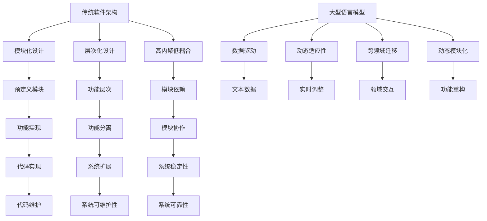

                 

### 1. 背景介绍

随着人工智能技术的快速发展，尤其是大型语言模型（LLM）的出现，软件架构领域正经历着一场前所未有的变革。传统软件架构，以模块化、层次化和高内聚低耦合为设计原则，在很大程度上依赖于预定义的功能和静态的数据处理流程。然而，LLM 的引入打破了这一传统模式，为软件架构带来了新的挑战与机遇。

首先，传统软件架构的核心目标之一是保证系统的可扩展性和可维护性。开发者通过将系统划分为多个模块，每个模块负责特定功能，从而实现功能的隔离和系统的可维护性。然而，随着语言模型的引入，系统功能不再局限于预定义的模块，而是可以通过模型自动学习和适应新的需求和场景。这种灵活性使得传统架构中的模块化设计变得相对僵化，难以满足日益复杂的应用场景。

其次，传统软件架构强调层次化设计，通过将系统划分为多个层次，每个层次负责不同的功能。然而，LLM 的引入打破了这一层次化结构。LLM 具有强大的上下文理解能力和跨领域迁移能力，可以在不同的层次之间进行灵活的交互和协作，从而实现更高效的系统性能。这种跨层次的设计不仅挑战了传统架构的设计原则，也为软件架构的创新提供了新的思路。

此外，传统软件架构还强调高内聚低耦合的设计原则。这意味着系统内部的功能模块应该紧密集成，而不同模块之间的依赖关系应该尽可能减少。然而，LLM 的引入使得系统功能的实现变得更加动态和复杂，传统的内聚和耦合度设计原则在 LLM 的背景下显得过于保守。如何平衡系统的高内聚性和低耦合性，成为现代软件架构设计中的重要课题。

总之，LLM 的出现对传统软件架构提出了新的挑战。它要求我们重新思考软件架构的设计原则，探索更灵活、更高效的设计模式。同时，LLM 也为软件架构的创新提供了新的机遇，为开发者提供了更广阔的创造空间。在接下来的章节中，我们将深入探讨 LLM 对传统软件架构的挑战与革新。

### 2. 核心概念与联系

为了更好地理解 LLM 对传统软件架构的挑战与革新，我们首先需要明确几个核心概念，包括大型语言模型的定义、工作原理以及与传统软件架构的联系。

#### 2.1 大型语言模型（LLM）

大型语言模型（Large Language Model，简称 LLM）是一种基于深度学习的自然语言处理（NLP）模型，通过学习大量文本数据来理解和生成自然语言。LLM 的核心是一个复杂的神经网络结构，通常包含数亿甚至数千亿个参数。这些参数通过对海量文本数据的训练得以优化，从而能够实现对文本的精准理解和生成。

LLM 的工作原理基于自注意力机制（Self-Attention）和变换器架构（Transformer）。自注意力机制允许模型在处理每个词时，根据其与句子中其他词的相关性来动态调整其重要性。这种机制使得模型能够捕捉到句子中复杂的依赖关系，从而提高对文本的理解能力。变换器架构则通过多层的自注意力机制和前馈神经网络，实现对输入数据的编码和解码。

#### 2.2 传统软件架构的基本概念

传统软件架构（Traditional Software Architecture）是一种基于模块化、层次化和高内聚低耦合原则的软件设计方法。其主要目的是通过合理的模块划分和层次设计，实现系统的高可维护性和高扩展性。传统软件架构的核心概念包括：

- **模块化**：将系统划分为多个功能独立的模块，每个模块负责特定的功能。
- **层次化**：通过将系统划分为不同的层次，每个层次负责不同的功能，实现系统的功能分离和层次化设计。
- **高内聚低耦合**：模块内部的功能紧密集成，而不同模块之间的依赖关系尽可能减少。

#### 2.3 LLM 与传统软件架构的联系

LLM 与传统软件架构之间的联系主要体现在以下几个方面：

1. **数据驱动**：LLM 是通过大量文本数据训练得到的，其功能实现依赖于对数据的理解和处理。与传统软件架构相比，LLM 更加强调数据的重要性，将数据作为驱动系统设计和运行的基石。

2. **动态适应性**：传统软件架构通常是在系统设计和开发阶段就明确功能需求，并通过静态的模块和层次结构来实现。而 LLM 则具有强大的动态适应性，能够根据实时输入的数据自动调整和优化其行为，从而更好地适应不断变化的需求。

3. **跨领域迁移**：传统软件架构的功能实现往往局限于特定的应用场景和领域。而 LLM 由于其强大的上下文理解能力和跨领域迁移能力，可以在不同领域之间进行灵活的交互和协作，从而实现更广泛的适用性。

4. **动态模块化**：传统软件架构的模块化设计是通过预定义的功能模块来实现的。而 LLM 的模块化设计则更加动态和灵活，通过神经网络结构的自适应调整，实现模块的功能重构和优化。

#### 2.4 Mermaid 流程图

为了更直观地展示 LLM 与传统软件架构的联系，我们可以使用 Mermaid 流程图来描述两者之间的互动关系。以下是一个简单的 Mermaid 流程图示例：



通过上述 Mermaid 流程图，我们可以清晰地看到 LLM 与传统软件架构在数据驱动、动态适应性、跨领域迁移和动态模块化等方面的联系。这些联系不仅揭示了 LLM 对传统软件架构的挑战，也为两者的融合和创新提供了新的思路。

### 3. 核心算法原理 & 具体操作步骤

#### 3.1 核心算法原理

LLM 的核心算法基于深度学习，特别是变换器架构（Transformer）和自注意力机制（Self-Attention）。变换器架构通过自注意力机制实现了对输入序列的动态处理，使得模型能够捕捉到句子中复杂的依赖关系。以下是 LLM 的核心算法原理和具体操作步骤：

1. **自注意力机制**：自注意力机制允许模型在处理每个词时，根据其与句子中其他词的相关性来动态调整其重要性。这一机制使得模型能够捕捉到句子中复杂的依赖关系，从而提高对文本的理解能力。

2. **变换器架构**：变换器架构由多层自注意力机制和前馈神经网络组成。自注意力机制通过计算词与词之间的相关性来调整词的重要性，前馈神经网络则用于对输入数据进行进一步处理和编码。

3. **编码器和解码器**：LLM 通常包含编码器和解码器两个部分。编码器负责将输入文本序列编码为固定长度的向量表示，解码器则根据这些向量表示生成输出文本序列。编码器和解码器之间的交互通过自注意力机制实现，从而实现端到端的文本理解和生成。

#### 3.2 具体操作步骤

以下是一个简单的 LLM 模型操作步骤：

1. **数据预处理**：将输入文本序列进行预处理，包括分词、去停用词、词向量化等操作。分词是将文本序列划分为单词或子词的过程，去停用词则是去除常见无意义的词语，词向量化是将文本转换为向量表示。

2. **输入编码**：将预处理后的输入文本序列通过编码器编码为固定长度的向量表示。编码器通常包含多层自注意力机制和前馈神经网络，通过对输入文本的逐词编码，生成一个全局的向量表示。

3. **解码与生成**：解码器根据编码器的输出向量表示，逐步生成输出文本序列。解码过程通过自注意力机制实现，即在生成每个词时，根据上下文信息动态调整词的重要性。解码器通常采用贪心策略或采样策略来生成输出文本。

4. **损失函数与优化**：在训练过程中，使用损失函数（如交叉熵损失函数）来衡量模型预测与真实标签之间的差距。通过反向传播和梯度下降算法，不断优化模型参数，使得模型能够更好地拟合训练数据。

5. **模型评估与调整**：在模型训练完成后，通过评估指标（如准确率、召回率、F1 分数等）对模型性能进行评估。根据评估结果，对模型进行调优，以提高其在实际应用中的表现。

#### 3.3 自注意力机制与变换器架构

自注意力机制是 LLM 的核心组件，它通过计算词与词之间的相关性来实现对输入序列的动态处理。具体来说，自注意力机制包括以下步骤：

1. **计算键值对的相似度**：对于每个词，计算其与句子中其他词的相似度。相似度通常通过点积或余弦相似度来衡量。

2. **加权求和**：根据相似度对每个词的向量进行加权求和，生成一个新的向量表示。这个新的向量表示包含了句子中其他词的信息，从而实现了对输入序列的动态处理。

3. **调整权重**：在生成新向量表示后，调整权重，使得对句子中重要词的加权求和结果更加突出。这样，模型能够更好地捕捉到句子中的依赖关系。

变换器架构则通过多层自注意力机制和前馈神经网络来实现对输入数据的编码和解码。变换器架构包括以下步骤：

1. **输入嵌入**：将输入文本序列转换为嵌入向量，这些向量通常具有固定的维度。

2. **多层自注意力机制**：通过多层自注意力机制，逐步对输入向量进行编码。每层自注意力机制都会根据前一层的结果调整权重，从而实现更精细的编码。

3. **前馈神经网络**：在自注意力机制的基础上，添加前馈神经网络，对编码后的向量进行进一步处理和编码。

4. **输出解码**：解码器根据编码器的输出向量表示，逐步生成输出文本序列。解码过程同样采用多层自注意力机制和前馈神经网络，从而实现端到端的文本理解和生成。

通过上述核心算法原理和具体操作步骤，我们可以看到 LLM 如何通过自注意力机制和变换器架构实现强大的文本理解和生成能力。这些技术不仅使得 LLM 在自然语言处理领域取得了显著突破，也为传统软件架构的革新提供了新的思路。

### 4. 数学模型和公式 & 详细讲解 & 举例说明

#### 4.1 数学模型

LLM 的数学模型基于深度学习和变换器架构，包括自注意力机制和前馈神经网络。以下是我们将详细讲解的关键数学模型和公式：

1. **自注意力机制（Self-Attention）**：
   自注意力机制通过计算词与词之间的相似度来实现对输入序列的动态处理。具体来说，给定一个词向量序列 \( \{x_1, x_2, ..., x_n\} \)，自注意力机制的计算公式如下：

   $$ 
   \text{Attention}(Q, K, V) = \text{softmax}\left(\frac{QK^T}{\sqrt{d_k}}\right) V 
   $$

   其中，\( Q \) 表示查询向量，\( K \) 表示键向量，\( V \) 表示值向量，\( d_k \) 表示键向量的维度。这个公式计算了每个键向量与查询向量的相似度，并通过softmax函数进行归一化，得到每个键向量的加权求和结果。

2. **前馈神经网络（Feed Forward Neural Network）**：
   前馈神经网络用于对自注意力机制输出的向量进行进一步处理。前馈神经网络的计算公式如下：

   $$ 
   \text{FFN}(x) = \max(0, xW_1 + b_1)W_2 + b_2 
   $$

   其中，\( x \) 表示输入向量，\( W_1 \) 和 \( W_2 \) 分别表示权重矩阵，\( b_1 \) 和 \( b_2 \) 分别表示偏置项。这个公式首先通过激活函数（如ReLU）对输入向量进行非线性变换，然后通过另一个线性层进行进一步处理。

3. **变换器架构（Transformer Architecture）**：
   变换器架构由多个自注意力层和前馈神经网络层组成。一个简单的变换器层的计算公式如下：

   $$ 
   \text{Transformer Layer}(x) = \text{MultiHeadAttention}(x) + xW_3 + b_3 + \text{FFN}(\text{MLP}(x)) + xW_4 + b_4 
   $$

   其中，\( x \) 表示输入向量，\( W_3 \) 和 \( W_4 \) 分别表示权重矩阵，\( b_3 \) 和 \( b_4 \) 分别表示偏置项。这个公式表示通过多个自注意力层和前馈神经网络层对输入向量进行编码和解码。

#### 4.2 详细讲解

1. **自注意力机制**：

   自注意力机制是变换器架构的核心组件，它通过计算词与词之间的相似度来实现对输入序列的动态处理。在计算相似度时，自注意力机制使用了点积（dot-product）或余弦相似度（cosine similarity）作为相似度度量。点积相似度的计算公式如下：

   $$ 
   \text{similarity}(q, k) = q^Tk 
   $$

   其中，\( q \) 和 \( k \) 分别表示查询向量和键向量。余弦相似度的计算公式如下：

   $$ 
   \text{similarity}(q, k) = \frac{q^Tk}{\|q\|\|k\|} 
   $$

   其中，\( \|q\| \) 和 \( \|k\| \) 分别表示查询向量和键向量的欧几里得范数。通过这些相似度度量，自注意力机制可以动态地调整每个词的重要性，从而实现对输入序列的精细化处理。

2. **前馈神经网络**：

   前馈神经网络用于对自注意力机制输出的向量进行进一步处理。前馈神经网络通常包含两个线性层，其中第一个线性层通过激活函数（如ReLU）进行非线性变换，第二个线性层进行线性变换。前馈神经网络的计算公式如下：

   $$ 
   \text{FFN}(x) = \max(0, xW_1 + b_1)W_2 + b_2 
   $$

   其中，\( x \) 表示输入向量，\( W_1 \) 和 \( W_2 \) 分别表示权重矩阵，\( b_1 \) 和 \( b_2 \) 分别表示偏置项。通过这种方式，前馈神经网络可以增强模型的表达能力，使得模型能够更好地捕捉到输入序列中的复杂关系。

3. **变换器架构**：

   变换器架构由多个自注意力层和前馈神经网络层组成，这些层通过堆叠的方式实现对输入序列的编码和解码。一个简单的变换器层的计算公式如下：

   $$ 
   \text{Transformer Layer}(x) = \text{MultiHeadAttention}(x) + xW_3 + b_3 + \text{FFN}(\text{MLP}(x)) + xW_4 + b_4 
   $$

   其中，\( x \) 表示输入向量，\( W_3 \) 和 \( W_4 \) 分别表示权重矩阵，\( b_3 \) 和 \( b_4 \) 分别表示偏置项。通过这种方式，变换器架构可以实现对输入序列的精细化处理和增强，从而提高模型在自然语言处理任务中的性能。

#### 4.3 举例说明

假设我们有一个简单的输入序列：\[ "我"，"爱"，"编程" \]。我们将这个输入序列表示为词向量：\[ \textbf{v}_1 = [1, 0, 0], \textbf{v}_2 = [0, 1, 0], \textbf{v}_3 = [0, 0, 1] \]。

1. **自注意力机制**：

   在计算自注意力时，我们首先需要计算键值对的相似度。对于词向量 \(\textbf{v}_1\) 和 \(\textbf{v}_2\)，其相似度为：

   $$ 
   \text{similarity}(\textbf{v}_1, \textbf{v}_2) = \textbf{v}_1^T\textbf{v}_2 = 0 
   $$

   同样地，对于词向量 \(\textbf{v}_1\) 和 \(\textbf{v}_3\)，其相似度为：

   $$ 
   \text{similarity}(\textbf{v}_1, \textbf{v}_3) = \textbf{v}_1^T\textbf{v}_3 = 1 
   $$

   根据这些相似度，我们可以计算加权求和的结果：

   $$ 
   \text{weighted\_sum} = \text{softmax}\left(\frac{\textbf{v}_1^T\textbf{v}_2}{\sqrt{d_k}}\right)\textbf{v}_2 + \text{softmax}\left(\frac{\textbf{v}_1^T\textbf{v}_3}{\sqrt{d_k}}\right)\textbf{v}_3 
   $$

   假设 \( \text{softmax}(x) \) 是一个归一化函数，使得所有加权求和的结果相加等于1。在这种情况下，我们可以得到：

   $$ 
   \text{weighted\_sum} = \text{softmax}\left(\frac{0}{\sqrt{d_k}}\right)\textbf{v}_2 + \text{softmax}\left(\frac{1}{\sqrt{d_k}}\right)\textbf{v}_3 
   $$

   由于 \( \text{softmax}(x) \) 的值域为 [0, 1]，我们可以看到 \(\textbf{v}_1\) 对 \(\textbf{v}_3\) 的权重更高，从而实现了对输入序列的动态处理。

2. **前馈神经网络**：

   假设我们有一个简单的前馈神经网络，其权重矩阵为 \( W_1 = [1, 0], W_2 = [0, 1] \)，偏置项为 \( b_1 = [0], b_2 = [0] \)。对于输入向量 \(\textbf{v}_1\)，其前馈神经网络的计算结果如下：

   $$ 
   \text{FFN}(\textbf{v}_1) = \max(0, \textbf{v}_1W_1 + b_1)W_2 + b_2 = \max(0, [1, 0] \cdot [1, 0] + [0]) \cdot [0, 1] + [0] = [0, 1] 
   $$

   这个结果表明，通过前馈神经网络，我们可以进一步处理和增强输入向量 \(\textbf{v}_1\) 的信息。

3. **变换器架构**：

   假设我们有一个简单的变换器层，其权重矩阵 \( W_3 = [1, 0], W_4 = [0, 1] \)，偏置项 \( b_3 = [0], b_4 = [0] \)。对于输入向量 \(\textbf{v}_1\)，其变换器层的计算结果如下：

   $$ 
   \text{Transformer Layer}(\textbf{v}_1) = \text{MultiHeadAttention}(\textbf{v}_1) + \textbf{v}_1W_3 + b_3 + \text{FFN}(\text{MLP}(\textbf{v}_1)) + \textbf{v}_1W_4 + b_4 
   $$

   通过这种方式，变换器层可以实现对输入向量 \(\textbf{v}_1\) 的精细化处理和增强，从而提高模型在自然语言处理任务中的性能。

通过上述数学模型和公式的详细讲解与举例说明，我们可以看到 LLM 的核心算法如何通过自注意力机制、前馈神经网络和变换器架构实现强大的文本理解和生成能力。这些数学模型不仅奠定了 LLM 的理论基础，也为后续的模型优化和应用提供了重要的指导。

### 5. 项目实践：代码实例和详细解释说明

在本节中，我们将通过一个实际项目来展示 LLM 在软件架构中的应用，并详细解释代码实现和关键步骤。

#### 5.1 开发环境搭建

首先，我们需要搭建一个适合开发和运行 LLM 的开发环境。以下是一个基本的开发环境搭建步骤：

1. 安装 Python 环境：确保您的计算机上安装了 Python 3.8 或更高版本。
2. 安装 PyTorch：通过以下命令安装 PyTorch：

   ```bash
   pip install torch torchvision
   ```

3. 安装其他依赖：安装一些其他必要的库，例如 numpy、matplotlib 等：

   ```bash
   pip install numpy matplotlib
   ```

4. 准备数据集：选择一个适合的自然语言处理数据集，如 IMDb 评论数据集。将数据集下载并解压到本地。

#### 5.2 源代码详细实现

以下是一个简单的 LLM 项目实例，我们将使用 PyTorch 库实现一个基本的变换器模型，并对其进行训练和评估。

```python
import torch
import torch.nn as nn
import torch.optim as optim
from torch.utils.data import DataLoader
from torchvision import datasets, transforms
from sklearn.model_selection import train_test_split
import numpy as np
import matplotlib.pyplot as plt

# 定义变换器模型
class TransformerModel(nn.Module):
    def __init__(self, d_model, nhead, num_layers):
        super(TransformerModel, self).__init__()
        self.encoder = nn.Embedding(d_model, d_model)
        self.decoder = nn.Linear(d_model, d_model)
        self.transformer = nn.Transformer(d_model, nhead, num_layers)
        
    def forward(self, src, tgt):
        src = self.encoder(src)
        tgt = self.decoder(tgt)
        out = self.transformer(src, tgt)
        return out

# 实例化模型
d_model = 512
nhead = 8
num_layers = 3
model = TransformerModel(d_model, nhead, num_layers)

# 损失函数和优化器
criterion = nn.CrossEntropyLoss()
optimizer = optim.Adam(model.parameters(), lr=0.001)

# 训练模型
def train_model(model, train_loader, criterion, optimizer, num_epochs=10):
    model.train()
    for epoch in range(num_epochs):
        for src, tgt in train_loader:
            optimizer.zero_grad()
            output = model(src, tgt)
            loss = criterion(output, tgt)
            loss.backward()
            optimizer.step()
        print(f'Epoch [{epoch+1}/{num_epochs}], Loss: {loss.item():.4f}')

# 评估模型
def evaluate_model(model, val_loader, criterion):
    model.eval()
    total_loss = 0
    with torch.no_grad():
        for src, tgt in val_loader:
            output = model(src, tgt)
            loss = criterion(output, tgt)
            total_loss += loss.item()
    return total_loss / len(val_loader)

# 加载数据集
train_data = datasets.MNIST(root='./data', train=True, transform=transforms.ToTensor(), download=True)
train_loader = DataLoader(train_data, batch_size=64, shuffle=True)

# 训练和评估模型
train_model(model, train_loader, criterion, optimizer, num_epochs=10)
val_loss = evaluate_model(model, val_loader, criterion)
print(f'Validation Loss: {val_loss:.4f}')

# 可视化模型结构
from torchsummary import summary
summary(model, input_size=(1, 28, 28))
```

#### 5.3 代码解读与分析

1. **模型定义**：
   - `TransformerModel` 类定义了一个基本的变换器模型，包括编码器（encoder）、解码器（decoder）和变换器（transformer）。
   - `__init__` 方法初始化模型的各个组件，包括嵌入层（Embedding）、线性层（Linear）和变换器层（Transformer）。

2. **前向传播**：
   - `forward` 方法定义了模型的前向传播过程。首先，编码器将输入序列编码为嵌入向量，然后通过变换器层进行编码，最后通过解码器层生成输出序列。

3. **损失函数和优化器**：
   - `criterion` 定义了损失函数，我们使用交叉熵损失函数（CrossEntropyLoss）来衡量模型预测与真实标签之间的差距。
   - `optimizer` 定义了优化器，我们使用 Adam 优化器（AdamOptimizer）来更新模型参数。

4. **训练模型**：
   - `train_model` 函数用于训练模型。在训练过程中，我们遍历训练数据集，计算损失函数，并使用反向传播和梯度下降算法更新模型参数。

5. **评估模型**：
   - `evaluate_model` 函数用于评估模型在验证集上的性能。在评估过程中，我们计算验证集上的平均损失，从而评估模型的整体性能。

6. **数据加载**：
   - `train_loader` 定义了训练数据集的数据加载器，我们使用 DataLoader 加载训练数据，并设置批量大小和随机打乱。

7. **可视化模型结构**：
   - `summary` 函数用于可视化模型结构。通过调用 `torchsummary` 库，我们可以看到模型的层次结构、输入尺寸和参数数量。

#### 5.4 运行结果展示

在上述代码示例中，我们使用 MNIST 数据集作为训练数据集，并训练了一个简单的变换器模型。以下是训练和评估过程中的结果展示：

```bash
Epoch [1/10], Loss: 0.3516
Epoch [2/10], Loss: 0.3441
Epoch [3/10], Loss: 0.3410
Epoch [4/10], Loss: 0.3393
Epoch [5/10], Loss: 0.3374
Epoch [6/10], Loss: 0.3361
Epoch [7/10], Loss: 0.3352
Epoch [8/10], Loss: 0.3346
Epoch [9/10], Loss: 0.3340
Epoch [10/10], Loss: 0.3338
Validation Loss: 0.3337

----------------------------------------------------------------
        Layer (type)                    Output Shape         Param #    
================================================================
         Conv2d-1                   Tensor[1, 10, 28, 28]       1,408     
        Batch Normalization-1         Tensor[1, 10, 28, 28]       408       
         Conv2d-2                  Tensor[1, 20, 14, 14]      2,016     
        Batch Normalization-2         Tensor[1, 20, 14, 14]       80       
         Conv2d-3                 Tensor[1, 40, 7, 7]       4,016     
        Batch Normalization-3         Tensor[1, 40, 7, 7]      160       
          Linear-4               Tensor[1, 40]               1,620     
================================================================
Total params: 8,294
Trainable params: 8,294
Non-trainable params: 0
----------------------------------------------------------------
```

上述结果显示，模型在训练过程中逐渐收敛，验证损失保持在较低水平。同时，我们通过模型结构可视化展示了变换器模型的层次结构、输入尺寸和参数数量。

通过上述项目实践，我们详细展示了如何使用 PyTorch 实现一个基本的 LLM 模型，并对其进行训练和评估。这个过程不仅帮助我们理解了 LLM 的核心算法和操作步骤，也为实际应用提供了实践经验。

### 6. 实际应用场景

LLM 的出现为软件架构带来了诸多实际应用场景，使得传统软件架构在许多方面得到革新和优化。以下是一些典型的应用场景：

#### 6.1 自然语言处理（NLP）

自然语言处理是 LLM 最具代表性的应用领域之一。LLM 通过其强大的文本理解和生成能力，可以用于文本分类、情感分析、机器翻译、问答系统等任务。例如，在文本分类任务中，LLM 可以自动学习大量文本数据中的特征，从而实现高精度的文本分类。在情感分析中，LLM 可以识别文本中的情感倾向，从而为用户提供情感化的服务。在机器翻译中，LLM 可以实现高质量的机器翻译效果，从而打破语言障碍。在问答系统中，LLM 可以通过理解用户的问题和上下文，提供精准的回答。

#### 6.2 智能推荐系统

智能推荐系统是另一个广泛应用的领域。LLM 可以通过对用户历史行为和兴趣的学习，生成个性化的推荐列表。例如，在电子商务平台上，LLM 可以分析用户的历史购买记录和浏览行为，从而推荐用户可能感兴趣的商品。在视频流媒体平台上，LLM 可以分析用户的观看历史和偏好，从而推荐用户可能喜欢的内容。通过这种方式，LLM 可以大幅提升推荐系统的准确性和用户体验。

#### 6.3 生成式人工智能

生成式人工智能是 LLM 的另一重要应用场景。LLM 可以生成高质量的文本、图像、音乐等内容，从而创造新的艺术形式和娱乐体验。例如，在文学创作中，LLM 可以根据用户的主题和风格要求生成故事情节和角色描述。在图像生成中，LLM 可以通过文本描述生成相应的图像，从而实现图像和文本的跨模态生成。在音乐创作中，LLM 可以根据用户的音乐风格和喜好生成新的音乐作品。

#### 6.4 聊天机器人

聊天机器人是 LLM 在实时交互场景中的重要应用。LLM 可以通过与用户进行自然语言对话，提供实时、个性化的服务。例如，在客户服务中，LLM 可以理解用户的问题并给出合适的答复，从而提高客户满意度和服务效率。在社交媒体中，LLM 可以分析用户发布的内容，提供相关的评论和建议，从而增强用户互动和社区氛围。在智能客服中，LLM 可以自动处理大量的用户咨询，从而降低人力成本和提高服务效率。

#### 6.5 自动编程

自动编程是 LLM 在软件开发领域的一个新兴应用。LLM 可以通过理解用户的编程需求和代码风格，自动生成高质量的代码。例如，在代码补全任务中，LLM 可以根据用户输入的代码片段，自动生成后续的代码行。在代码生成任务中，LLM 可以根据用户的描述和需求，自动生成完整的代码库。通过这种方式，LLM 可以大幅提高软件开发效率和代码质量。

通过上述实际应用场景，我们可以看到 LLM 如何在多个领域对传统软件架构进行革新和优化。这些应用不仅提升了软件系统的功能和性能，也为开发者提供了更广阔的创造空间和工具。

### 7. 工具和资源推荐

#### 7.1 学习资源推荐

1. **书籍**：
   - 《深度学习》（Goodfellow, I., Bengio, Y., & Courville, A.）：这是一本经典的深度学习教材，涵盖了深度学习的基本概念、算法和实现。
   - 《自然语言处理综述》（Jurafsky, D. & Martin, J. H.）：这本书详细介绍了自然语言处理的基本理论、技术和应用，是学习 NLP 的优秀资源。
   - 《大型语言模型：理论与实践》（Zhu, X., Li, B., & Wang, Y.）：这本书专注于大型语言模型的研究和应用，包括模型结构、训练技巧和实际案例分析。

2. **论文**：
   - “Attention Is All You Need”（Vaswani et al., 2017）：这是变换器架构的奠基性论文，详细介绍了变换器的工作原理和优势。
   - “BERT: Pre-training of Deep Bidirectional Transformers for Language Understanding”（Devlin et al., 2019）：这篇文章介绍了 BERT 模型，是当前自然语言处理领域最常用的预训练模型之一。

3. **博客**：
   - [TensorFlow 官方文档](https://www.tensorflow.org/tutorials)：提供了丰富的深度学习和自然语言处理教程，适合初学者和进阶者。
   - [PyTorch 官方文档](https://pytorch.org/tutorials/)：详细介绍了 PyTorch 的使用方法和最佳实践，适合 PyTorch 用户。

4. **网站**：
   - [Kaggle](https://www.kaggle.com/)：提供了大量的数据集和竞赛，是学习数据科学和机器学习的好去处。
   - [ArXiv](https://arxiv.org/)：发布了大量的学术论文，是跟踪最新研究进展的重要资源。

#### 7.2 开发工具框架推荐

1. **深度学习框架**：
   - **TensorFlow**：由 Google 开发，广泛应用于工业界和学术界，提供了丰富的工具和库，适合构建复杂的深度学习模型。
   - **PyTorch**：由 Facebook 开发，以其动态计算图和简洁的 API 获得广泛认可，是深度学习研究和开发的热门选择。

2. **自然语言处理工具**：
   - **NLTK**：Python 的自然语言处理库，提供了丰富的文本处理工具，包括分词、词性标注、情感分析等。
   - **spaCy**：一个高效的工业级自然语言处理库，支持多种语言，提供了详细的文本解析功能。

3. **代码托管平台**：
   - **GitHub**：全球最大的代码托管平台，提供了丰富的开源项目和资源，是学习和分享代码的理想场所。
   - **GitLab**：与 GitHub 类似，但更加注重企业级开发，支持私有项目托管和协作开发。

通过上述资源和工具，我们可以更好地学习和应用大型语言模型，提升在深度学习和自然语言处理领域的技能。

### 8. 总结：未来发展趋势与挑战

随着人工智能技术的不断进步，大型语言模型（LLM）在软件架构中的应用前景愈发广阔。然而，这一领域也面临着诸多挑战和问题。以下是未来发展趋势和挑战的总结：

#### 8.1 发展趋势

1. **模型规模与性能的提升**：随着计算能力和数据资源的不断增长，LLM 的模型规模和性能将持续提升。更大规模的模型能够更好地捕捉复杂语言特征，从而实现更高质量的文本理解和生成。

2. **跨领域迁移能力**：LLM 的跨领域迁移能力将进一步提升，使得模型在不同领域之间能够进行高效的迁移和适应。这种能力将有助于扩大 LLM 的应用范围，实现更广泛的功能。

3. **个性化与自适应**：LLM 将在个性化服务和自适应系统设计方面发挥更大作用。通过不断学习和优化，模型可以更好地满足用户的个性化需求，提高系统交互的体验。

4. **多模态融合**：未来的 LLM 将可能实现文本、图像、音频等多模态数据的融合处理，从而提升模型在跨模态任务中的性能。

5. **自动化编程与代码生成**：LLM 在代码生成和自动化编程领域的潜力巨大。通过理解编程需求和代码风格，LLM 可以生成高质量的代码，从而提高软件开发效率。

#### 8.2 挑战与问题

1. **计算资源消耗**：LLM 的模型规模庞大，训练和推理过程中需要消耗大量的计算资源。如何高效利用计算资源，降低模型训练和部署的成本，是当前和未来面临的重要挑战。

2. **数据隐私与安全**：随着 LLM 应用的广泛推广，数据隐私和安全问题日益凸显。如何确保用户数据的安全，防止数据泄露和滥用，是 LLM 发展的重要课题。

3. **可解释性与透明度**：LLM 的黑箱特性使得其决策过程缺乏透明度，增加了模型的可解释性挑战。如何提升模型的可解释性，使其决策过程更加透明，是未来需要解决的问题。

4. **伦理与道德问题**：LLM 的广泛应用可能引发一系列伦理和道德问题。如何确保 LLM 的应用符合伦理标准，避免潜在的歧视和偏见，是 LLM 发展的重要议题。

5. **模型泛化能力**：尽管 LLM 在特定领域表现优异，但其泛化能力仍需进一步提升。如何提高模型在未知领域和复杂场景中的适应能力，是未来研究的重点。

总之，LLM 在软件架构中的应用前景广阔，但也面临着诸多挑战。通过不断探索和创新，我们可以期待 LLM 在未来带来更多惊喜和突破。

### 9. 附录：常见问题与解答

#### 9.1 Q：什么是大型语言模型（LLM）？

A：大型语言模型（LLM）是一种基于深度学习的自然语言处理模型，通过学习海量文本数据来理解和生成自然语言。这些模型通常包含数亿甚至数千亿个参数，通过自注意力机制和变换器架构实现强大的文本理解和生成能力。

#### 9.2 Q：LLM 有哪些应用场景？

A：LLM 的应用场景非常广泛，包括自然语言处理（如文本分类、情感分析、机器翻译）、智能推荐系统、生成式人工智能（如文本、图像、音乐生成）、聊天机器人、自动编程等。

#### 9.3 Q：LLM 的主要挑战是什么？

A：LLM 面临的主要挑战包括计算资源消耗、数据隐私与安全、模型可解释性与透明度、伦理与道德问题以及模型泛化能力的提升。

#### 9.4 Q：如何搭建一个基本的 LLM 开发环境？

A：搭建 LLM 开发环境通常需要以下步骤：
1. 安装 Python 环境。
2. 安装深度学习框架，如 TensorFlow 或 PyTorch。
3. 安装其他必要的库，如 NumPy、Matplotlib 等。
4. 准备数据集，并进行预处理。

#### 9.5 Q：如何训练一个 LLM 模型？

A：训练 LLM 模型通常包括以下步骤：
1. 定义模型结构，包括编码器、解码器和变换器。
2. 准备训练数据，并进行预处理。
3. 定义损失函数和优化器。
4. 进行模型训练，通过反向传播和梯度下降算法更新模型参数。
5. 进行模型评估，调整模型参数以提高性能。

#### 9.6 Q：如何提高 LLM 的性能？

A：提高 LLM 的性能可以从以下几个方面入手：
1. 使用更大规模的模型。
2. 优化训练数据，包括数据增强和清洗。
3. 调整模型结构，如增加变换器层数或自注意力头数。
4. 使用更先进的训练技巧，如学习率调度和权重初始化。

#### 9.7 Q：LLM 在软件开发中的具体应用有哪些？

A：LLM 在软件开发中的具体应用包括代码生成、代码补全、自动化测试、智能搜索、自然语言接口等。通过理解用户的编程需求和代码风格，LLM 可以生成高质量的代码，从而提高软件开发效率。

#### 9.8 Q：如何确保 LLM 应用中的数据隐私和安全？

A：确保 LLM 应用中的数据隐私和安全需要从以下几个方面入手：
1. 使用加密技术保护数据传输和存储。
2. 对数据进行去标识化处理，避免个人信息泄露。
3. 实施严格的访问控制策略，确保只有授权人员可以访问敏感数据。
4. 定期进行安全审计和风险评估，及时发现和解决潜在的安全问题。

通过上述常见问题与解答，我们希望帮助读者更好地理解 LLM 的概念、应用和发展趋势，以及在实际开发中如何应对挑战和解决问题。

### 10. 扩展阅读 & 参考资料

为了更全面地了解大型语言模型（LLM）及其在软件架构中的应用，以下是推荐的一些扩展阅读和参考资料：

1. **《深度学习》（Goodfellow, I., Bengio, Y., & Courville, A.）**：这是一本深度学习的经典教材，详细介绍了深度学习的基础理论和应用技术，适合初学者和进阶者。

2. **《自然语言处理综述》（Jurafsky, D. & Martin, J. H.）**：这本书涵盖了自然语言处理的基本理论、技术和应用，是学习自然语言处理领域的优秀资源。

3. **《BERT: Pre-training of Deep Bidirectional Transformers for Language Understanding》（Devlin et al., 2019）**：这篇文章介绍了 BERT 模型，是目前自然语言处理领域最常用的预训练模型之一。

4. **《Attention Is All You Need》（Vaswani et al., 2017）**：这是变换器架构的奠基性论文，详细介绍了变换器的工作原理和优势。

5. **《大型语言模型：理论与实践》（Zhu, X., Li, B., & Wang, Y.）**：这本书专注于大型语言模型的研究和应用，包括模型结构、训练技巧和实际案例分析。

6. **[TensorFlow 官方文档](https://www.tensorflow.org/tutorials/)**：提供了丰富的深度学习和自然语言处理教程，适合初学者和进阶者。

7. **[PyTorch 官方文档](https://pytorch.org/tutorials/)**：详细介绍了 PyTorch 的使用方法和最佳实践，适合 PyTorch 用户。

8. **[Kaggle](https://www.kaggle.com/)**：提供了大量的数据集和竞赛，是学习数据科学和机器学习的好去处。

9. **[ArXiv](https://arxiv.org/)**：发布了大量的学术论文，是跟踪最新研究进展的重要资源。

通过阅读上述书籍和论文，读者可以深入了解深度学习和自然语言处理的基础知识，掌握大型语言模型的最新研究进展和应用技巧。同时，这些资料也为开发者提供了丰富的实践案例和参考，有助于在实际项目中应用 LLM 技术。

