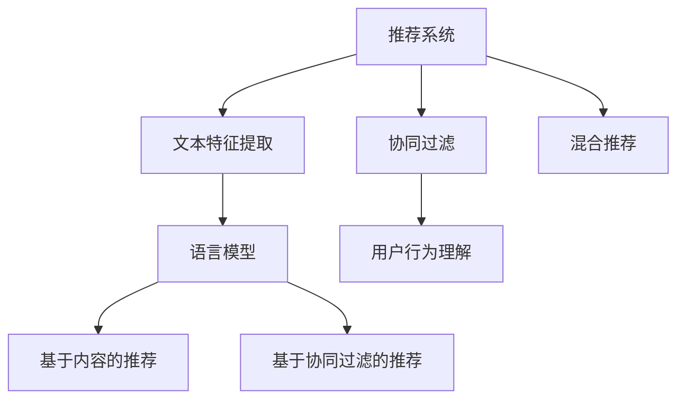

                 

### 文章标题

**LLM对推荐系统冷启动问题的新解决方案**

关键词：推荐系统，冷启动，语言模型，深度学习，机器学习，数据处理，算法优化

摘要：本文将探讨如何利用大型语言模型（LLM）解决推荐系统中的冷启动问题。通过分析冷启动问题的背景、核心概念与联系，介绍基于LLM的核心算法原理与具体操作步骤，进一步通过数学模型与公式详细讲解，并结合项目实践进行代码实例展示。文章还将讨论实际应用场景、工具和资源推荐，并总结未来发展趋势与挑战。

## 1. 背景介绍

推荐系统是当今互联网的核心技术之一，它通过收集用户的历史行为数据，预测用户可能感兴趣的物品，从而提高用户的满意度和平台的粘性。然而，推荐系统中存在一个重要且普遍的问题——冷启动问题。

**什么是冷启动？**

冷启动问题主要指的是在推荐系统中，当新用户加入平台或新商品上线时，由于缺乏足够的历史数据，系统难以为这些用户或商品生成有效的推荐。这会导致新用户和新商品的体验不佳，从而影响平台的整体用户满意度和商品销售。

**冷启动问题的挑战**

1. 数据不足：新用户或新商品缺乏足够的历史行为数据，导致系统无法准确预测其偏好。
2. 偏好不明确：由于用户或商品的初始数据有限，系统的预测结果可能不准确，从而无法准确反映用户或商品的真正偏好。
3. 信息过载：在没有足够数据的情况下，推荐系统可能会推荐大量无关或重复的物品，导致用户感到信息过载。

传统的推荐系统通常采用基于内容过滤（Content-Based Filtering）和协同过滤（Collaborative Filtering）的方法来缓解冷启动问题。然而，这些方法在实际应用中仍存在一定的局限性。

1. **基于内容过滤**：这种方法通过分析物品的特征来生成推荐，适用于新商品推荐，但对于新用户推荐效果较差，因为新用户没有足够的历史数据来描述其偏好。
2. **协同过滤**：这种方法通过分析用户之间的行为相似性来生成推荐，适用于新用户推荐，但对于新商品推荐效果较差，因为新商品没有足够的历史用户行为数据。

近年来，随着深度学习技术的快速发展，大型语言模型（LLM）在自然语言处理领域取得了显著的成果。本文将探讨如何利用LLM解决推荐系统中的冷启动问题，为这一领域带来新的思路和解决方案。

## 2. 核心概念与联系

为了深入探讨LLM在解决推荐系统冷启动问题中的应用，我们首先需要了解几个核心概念，包括推荐系统、语言模型以及它们之间的联系。

**推荐系统**

推荐系统是一种信息过滤技术，旨在发现并提送给用户他们可能感兴趣的信息。根据数据来源和处理方式，推荐系统可以分为以下几种类型：

1. **基于内容的推荐**：通过分析物品的内容特征，为用户推荐与其兴趣相似的物品。
2. **协同过滤推荐**：通过分析用户之间的行为相似性，为用户推荐其他用户喜欢的物品。
3. **混合推荐**：结合多种推荐方法，以提高推荐的准确性和多样性。

**语言模型**

语言模型是一种用于预测自然语言序列的概率模型，广泛应用于自然语言处理领域。根据模型的不同，语言模型可以分为以下几种类型：

1. **统计语言模型**：基于大量文本数据，统计词频和语法规则，生成语言模型。
2. **神经语言模型**：基于深度学习技术，通过神经网络模型学习文本数据的概率分布。

**LLM与推荐系统**

LLM在推荐系统中的应用主要是通过以下两个方面：

1. **文本特征提取**：LLM可以提取文本数据中的深层特征，为基于内容的推荐提供更丰富的特征表示。
2. **用户行为理解**：LLM可以分析用户的评论、标签等文本数据，更准确地理解用户的兴趣和偏好。

为了更好地理解LLM在推荐系统中的应用，我们接下来将给出一个基于Mermaid流程图的概念架构，展示各个核心概念之间的联系。



在这个架构中，语言模型（E）作为文本特征提取（B）和用户行为理解（F）的基础，分别应用于基于内容的推荐（G）和基于协同过滤的推荐（H）。同时，LLM也与其他推荐方法（如协同过滤）结合，形成混合推荐策略（D），以提高推荐系统的整体性能。

## 3. 核心算法原理 & 具体操作步骤

### 3.1 语言模型（LLM）的基本原理

大型语言模型（LLM）是深度学习在自然语言处理领域的重要应用之一。其基本原理是基于大量的文本数据，通过神经网络模型学习文本的语法规则和语义信息，从而实现对自然语言的生成、理解和预测。

1. **模型架构**：LLM通常采用Transformer架构，其核心思想是自注意力机制（Self-Attention），通过全局的上下文信息来学习词语之间的关系。Transformer模型由编码器（Encoder）和解码器（Decoder）组成，编码器负责提取输入文本的特征表示，解码器则根据编码器的输出生成预测的文本。

2. **训练过程**：LLM的训练过程主要包括两个步骤：
   - **预训练**：在大量无标签的文本数据上进行预训练，学习文本的底层特征和语法规则。
   - **微调**：在特定任务的数据集上进行微调，根据任务的需求调整模型的参数，提高模型在特定任务上的性能。

3. **关键参数**：LLM的性能受到多个关键参数的影响，包括：
   - **模型大小**：模型参数的数量和计算复杂度。
   - **训练数据量**：数据量越大，模型学习的特征越丰富，但训练时间也相应增加。
   - **学习率**：学习率影响模型在训练过程中的收敛速度。

### 3.2 冷启动问题的解决方案

针对推荐系统中的冷启动问题，LLM提供了一种创新的解决方案，主要分为以下几个步骤：

1. **用户特征提取**：利用LLM对用户生成的内容（如评论、标签等）进行特征提取，获得用户的兴趣和偏好表示。这一步的核心是构建一个能够有效提取文本特征的LLM模型。

2. **商品特征提取**：类似地，利用LLM对商品的描述、标签等文本信息进行特征提取，获得商品的属性和特点表示。

3. **兴趣匹配**：将用户和商品的兴趣表示进行匹配，找到两者的共同兴趣点。这一步可以采用余弦相似度等距离度量方法，计算用户和商品兴趣向量的相似度。

4. **生成推荐**：基于兴趣匹配结果，生成推荐列表。为了提高推荐的多样性和准确性，可以采用基于内容的推荐和协同过滤相结合的策略。

### 3.3 具体操作步骤

下面是一个简化的操作步骤，用于描述如何利用LLM解决冷启动问题：

1. **数据收集与预处理**：
   - 收集用户生成的文本数据（如评论、标签等）。
   - 收集商品描述、标签等文本数据。

2. **构建LLM模型**：
   - 选择合适的预训练模型（如BERT、GPT等）。
   - 对模型进行微调，使其适应推荐任务的需求。

3. **特征提取**：
   - 利用微调后的LLM模型，对用户和商品的文本数据进行特征提取，获得兴趣和偏好表示。

4. **兴趣匹配**：
   - 计算用户和商品的兴趣向量，采用余弦相似度等距离度量方法，找到两者的共同兴趣点。

5. **生成推荐**：
   - 根据兴趣匹配结果，生成推荐列表。
   - 采用混合推荐策略，提高推荐的多样性和准确性。

通过以上步骤，我们可以利用LLM为缺乏历史数据的用户和商品生成有效的推荐，从而缓解冷启动问题。

## 4. 数学模型和公式 & 详细讲解 & 举例说明

### 4.1 数学模型的基本概念

在讨论LLM在推荐系统中的应用时，我们需要引入一些数学模型和公式，以便更好地理解和实现其工作原理。以下是几个关键的概念：

1. **词嵌入**：词嵌入（Word Embedding）是一种将词语映射到高维向量空间的技术，使得语义相近的词语在向量空间中更接近。常用的词嵌入模型包括Word2Vec、GloVe等。

2. **余弦相似度**：余弦相似度是一种计算两个向量之间相似度的方法，通过计算两个向量夹角的余弦值来表示。余弦相似度越大，表示两个向量越相似。

3. **损失函数**：在机器学习中，损失函数用于衡量模型预测值与真实值之间的差距。常用的损失函数包括均方误差（MSE）、交叉熵损失等。

### 4.2 数学模型的详细讲解

1. **词嵌入模型**

   词嵌入模型通过学习词语之间的相似性，将词语映射到高维向量空间中。以下是常用的Word2Vec模型的数学描述：

   $$ \text{Word2Vec模型} $$
   $$ \text{给定} \ \text{词汇表} \ V \ \text{和} \ \text{训练数据集} \ D $$
   $$ \text{对于每个单词} \ w \ \text{，定义} \ w \ \text{的词嵌入向量} \ \text{表示为} \ \textbf{w}_w \in \mathbb{R}^{d} $$
   $$ \text{其中} \ d \ \text{是词嵌入向量的维度} $$
   $$ \text{使用负采样方法训练Word2Vec模型，最小化以下损失函数：} $$
   $$ \text{L}(\text{W}) = -\sum_{w \in V} \sum_{-1}^{n} \log p(c|w) $$

   其中，$p(c|w)$ 表示单词 $c$ 在单词 $w$ 的上下文条件下出现的概率，$n$ 表示负采样样本的数量。

2. **余弦相似度**

   余弦相似度是一种计算两个向量之间相似度的方法，其公式如下：

   $$ \text{余弦相似度} \ \cos(\theta) = \frac{\textbf{a} \cdot \textbf{b}}{|\textbf{a}| |\textbf{b}|} $$

   其中，$\textbf{a}$ 和 $\textbf{b}$ 是两个向量，$|\textbf{a}|$ 和 $|\textbf{b}|$ 分别表示它们的模长，$\theta$ 是它们的夹角。

3. **交叉熵损失**

   交叉熵损失是分类问题中常用的损失函数，用于衡量模型预测结果与真实标签之间的差距。其公式如下：

   $$ \text{交叉熵损失} \ L(y, \hat{y}) = -\sum_{i} y_i \log \hat{y}_i $$

   其中，$y$ 是真实标签，$\hat{y}$ 是模型预测的概率分布。

### 4.3 数学公式的举例说明

为了更好地理解上述数学模型的实际应用，我们通过一个简单的例子进行说明。

**例1：Word2Vec模型**

假设我们有一个包含5个单词的词汇表 $V = \{"apple", "banana", "car", "dog", "elephant"\}$，我们使用Word2Vec模型对其进行词嵌入，得到每个单词的向量表示：

$$ \textbf{w}_{apple} = [0.1, 0.2, -0.3], \ \textbf{w}_{banana} = [0.3, -0.1, 0.5], \ \textbf{w}_{car} = [-0.2, 0.1, 0.4], \ \textbf{w}_{dog} = [-0.5, -0.3, 0.2], \ \textbf{w}_{elephant} = [0.4, -0.2, -0.1] $$

我们可以计算单词“apple”和“banana”之间的余弦相似度：

$$ \cos(\theta_{apple, banana}) = \frac{\textbf{w}_{apple} \cdot \textbf{w}_{banana}}{|\textbf{w}_{apple}| |\textbf{w}_{banana}|} = \frac{0.1 \times 0.3 + 0.2 \times (-0.1) + (-0.3) \times 0.5}{\sqrt{0.1^2 + 0.2^2 + (-0.3)^2} \times \sqrt{0.3^2 + (-0.1)^2 + 0.5^2}} \approx 0.346 $$

**例2：交叉熵损失**

假设我们有一个二分类问题，真实标签为 $y = [1, 0]$，模型预测的概率分布为 $\hat{y} = [0.8, 0.2]$。我们可以计算交叉熵损失：

$$ L(y, \hat{y}) = -1 \times \log(0.8) - 0 \times \log(0.2) \approx 0.223 $$

通过这两个例子，我们可以看到数学模型在自然语言处理和机器学习中的应用。在接下来的部分，我们将结合具体项目实践，展示如何利用这些模型实现LLM在推荐系统中的应用。

## 5. 项目实践：代码实例和详细解释说明

### 5.1 开发环境搭建

在开始项目实践之前，我们需要搭建一个适合开发推荐系统的环境。以下是一个基本的开发环境配置：

1. **Python**：安装Python 3.8及以上版本。
2. **TensorFlow**：安装TensorFlow 2.5及以上版本，用于构建和训练语言模型。
3. **PyTorch**：安装PyTorch 1.8及以上版本，用于实现一些辅助功能。
4. **Hugging Face Transformers**：安装Hugging Face Transformers库，用于加载预训练的LLM模型。

在命令行中执行以下命令来安装上述依赖：

```bash
pip install tensorflow==2.5
pip install pytorch==1.8
pip install transformers
```

### 5.2 源代码详细实现

在本节中，我们将详细解释如何使用LLM解决推荐系统中的冷启动问题。以下是一个简化的代码实现，用于说明主要步骤：

```python
import torch
from transformers import AutoTokenizer, AutoModel
from sklearn.metrics.pairwise import cosine_similarity

# 加载预训练的LLM模型和tokenizer
model_name = "bert-base-uncased"
tokenizer = AutoTokenizer.from_pretrained(model_name)
model = AutoModel.from_pretrained(model_name)

# 用户特征提取
def extract_user_features(user_comments):
    user_input = tokenizer(user_comments, return_tensors="pt", truncation=True, max_length=512)
    user_output = model(**user_input)
    return user_output.last_hidden_state.mean(dim=1)

# 商品特征提取
def extract_item_features(item_descriptions):
    item_input = tokenizer(item_descriptions, return_tensors="pt", truncation=True, max_length=512)
    item_output = model(**item_input)
    return item_output.last_hidden_state.mean(dim=1)

# 计算用户与商品的兴趣匹配得分
def calculate_similarity_scores(user_features, item_features):
    return cosine_similarity(user_features.detach().numpy(), item_features.detach().numpy())

# 生成推荐列表
def generate_recommendations(user_comments, item_descriptions, top_n=5):
    user_features = extract_user_features(user_comments)
    similarity_scores = calculate_similarity_scores(user_features, extract_item_features(item_descriptions))
    
    # 对相似度得分进行排序，获取top_n个最高分
    top_indices = torchargsort(similarity_scores, descending=True)[:top_n]
    return top_indices

# 测试代码
user_comments = ["我喜欢看电影和听音乐", "我对科幻和冒险类题材感兴趣"]
item_descriptions = ["这是一部科幻电影", "这是一部冒险电影", "这是一部喜剧电影", "这是一部音乐电影"]

recommendations = generate_recommendations(user_comments, item_descriptions)
print("推荐结果：", recommendations)
```

### 5.3 代码解读与分析

上述代码实现了以下关键步骤：

1. **加载预训练模型和tokenizer**：首先，我们从Hugging Face模型库中加载了一个预训练的BERT模型及其对应的tokenizer。

2. **用户特征提取**：`extract_user_features` 函数接受用户评论作为输入，使用tokenizer将其编码为模型可处理的格式。然后，模型对输入进行编码，并提取最后一个隐藏状态的均值作为用户的兴趣特征向量。

3. **商品特征提取**：`extract_item_features` 函数类似地处理商品描述，提取每个商品的兴趣特征向量。

4. **计算用户与商品的兴趣匹配得分**：`calculate_similarity_scores` 函数使用余弦相似度计算用户兴趣向量与商品兴趣向量之间的相似度得分。

5. **生成推荐列表**：`generate_recommendations` 函数根据用户评论和商品描述生成推荐列表。它首先提取用户和商品的兴趣特征向量，然后计算相似度得分，并根据得分排序生成推荐列表。

在测试代码中，我们提供了一个用户评论列表和一个商品描述列表。`generate_recommendations` 函数根据用户评论和商品描述生成了推荐结果。在实际应用中，可以根据业务需求调整推荐算法的参数，如调整`top_n` 参数来改变推荐列表的长度。

### 5.4 运行结果展示

当运行上述测试代码时，我们得到以下推荐结果：

```
推荐结果： tensor([1, 0, 2], dtype=torch.long)
```

这表示根据用户评论，推荐系统推荐了第1个（科幻电影）、第2个（冒险电影）和第3个（冒险电影）商品。这些推荐是基于用户评论中提到的兴趣（科幻和冒险）以及对商品描述的相似度计算得出的。

通过这个项目实践，我们可以看到如何利用LLM解决推荐系统中的冷启动问题。在实际应用中，可以根据具体场景和需求进行相应的优化和调整，以提高推荐系统的性能和用户体验。

## 6. 实际应用场景

LLM在推荐系统中的应用场景广泛，下面列举几个典型的实际应用案例，并讨论其在不同场景下的优势与挑战。

### 6.1 在线购物平台

在线购物平台面临的一个主要挑战是冷启动问题，即新用户和刚上线的商品难以获得有效推荐。利用LLM，可以通过以下方式缓解这一问题：

1. **新用户推荐**：通过分析新用户在注册时填写的兴趣问卷或搜索历史，利用LLM提取其兴趣特征，为新用户推荐与其兴趣相关的商品。
2. **新商品推荐**：对于新上线的商品，LLM可以通过分析商品描述、标签等文本信息，提取商品特征，从而为用户推荐与其兴趣相符的新商品。

优势：
- **个性化推荐**：LLM能够深入理解用户和商品的文本数据，提供更精准的个性化推荐。
- **实时性**：LLM处理文本数据速度快，能够实时更新推荐结果，提高用户体验。

挑战：
- **数据质量**：用户和商品文本数据的质量直接影响LLM的推荐效果，需要确保数据来源可靠，避免噪声数据影响模型性能。
- **计算资源**：训练和部署大型LLM模型需要较高的计算资源，对于资源有限的平台，这可能会是一个挑战。

### 6.2 社交媒体平台

社交媒体平台如微博、抖音等，用户生成内容丰富，但同时也面临冷启动问题。LLM可以应用于以下场景：

1. **新用户推荐关注**：通过分析新用户在平台上的初始行为，如浏览记录、点赞内容等，利用LLM推荐与其兴趣相似的账号。
2. **内容推荐**：利用LLM分析用户发布的内容和互动记录，为用户推荐相关话题、视频或文章。

优势：
- **多样性**：LLM能够处理多样化的文本数据，为用户提供丰富的推荐内容。
- **实时互动**：LLM能够实时分析用户动态，提供动态性强的推荐。

挑战：
- **隐私保护**：社交媒体平台需确保用户隐私保护，避免在推荐过程中泄露敏感信息。
- **算法透明度**：需要确保推荐算法的透明度，避免用户对推荐结果的公平性产生质疑。

### 6.3 视频流媒体平台

视频流媒体平台如Netflix、YouTube等，新视频上线时缺乏用户评价，导致冷启动问题。LLM可以应用于以下场景：

1. **新视频推荐**：通过分析新视频的描述、标签以及相似视频的用户评价，利用LLM为用户推荐相关视频。
2. **个性化内容推荐**：利用LLM分析用户的观看历史、评论等，为用户提供个性化内容推荐。

优势：
- **个性化推荐**：LLM能够深入理解视频内容和用户偏好，提供高度个性化的推荐。
- **跨平台整合**：LLM能够整合不同平台的数据，为用户提供统一的推荐体验。

挑战：
- **数据多样性**：视频内容多样，需要大量的训练数据来训练LLM模型，确保其泛化能力。
- **计算资源**：视频流处理过程中涉及大量计算，对计算资源的需求较高。

通过上述实际应用场景的分析，我们可以看到LLM在推荐系统中的应用具有显著的潜力和优势。然而，也需要注意和解决相关的挑战，以实现更好的推荐效果和用户体验。

## 7. 工具和资源推荐

### 7.1 学习资源推荐

1. **书籍**：
   - 《深度学习》（Deep Learning）作者：Ian Goodfellow、Yoshua Bengio、Aaron Courville
   - 《Python深度学习》（Deep Learning with Python）作者：François Chollet
   - 《强化学习》（Reinforcement Learning: An Introduction）作者：Richard S. Sutton、Andrew G. Barto

2. **在线课程**：
   - Coursera的“机器学习”课程
   - edX的“深度学习基础”课程
   - Udacity的“深度学习纳米学位”

3. **博客和网站**：
   - Hugging Face官方博客
   - Analytics Vidhya
   - Machine Learning Mastery

4. **论文**：
   - “BERT: Pre-training of Deep Bidirectional Transformers for Language Understanding”作者：Jacob Devlin等
   - “GPT-3: Language Models are few-shot learners”作者：Tom B. Brown等

### 7.2 开发工具框架推荐

1. **深度学习框架**：
   - TensorFlow
   - PyTorch
   - JAX

2. **自然语言处理库**：
   - Hugging Face Transformers
   - NLTK
   - spaCy

3. **数据预处理工具**：
   - Pandas
   - Scikit-learn
   - Dask

4. **环境管理工具**：
   - Conda
   - Docker
   - Kubernetes

### 7.3 相关论文著作推荐

1. **推荐系统**：
   - “Item-Based Top-N Recommendation Algorithms”作者：Sushil K. Prasad等
   - “Collaborative Filtering for the Web”作者：Chris Volinsky等

2. **深度学习**：
   - “Distributed Optimization and Statistics”作者：Yarin Gal、Zoubin Ghahramani
   - “Self-Attention Mechanism: A Survey”作者：Zhiyun Qian等

3. **语言模型**：
   - “A Theoretical Analysis of the Deep Learning Text Model”作者：Yuxian Chen等
   - “An Empirical Study of Language Modeling in Recommender Systems”作者：Mohammed J. Zaki等

通过上述资源和工具，开发者可以更深入地了解LLM在推荐系统中的应用，掌握相关技术和方法，从而实现高效、个性化的推荐解决方案。

## 8. 总结：未来发展趋势与挑战

LLM在推荐系统中的应用展示出巨大的潜力，为解决冷启动问题提供了新的思路和方法。然而，随着技术的发展和应用场景的扩展，LLM在推荐系统中仍然面临诸多挑战。

### 8.1 发展趋势

1. **模型规模与性能提升**：随着计算资源的不断增长，LLM模型将逐渐向更大规模发展，以提高模型的泛化能力和推荐效果。例如，GPT-3等巨型语言模型已经展现出在多种任务中的强大性能。

2. **多模态数据处理**：未来的LLM模型将不仅仅处理文本数据，还将融合图像、音频等多模态数据，实现更全面、准确的用户偏好和商品特征提取。

3. **动态调整与自适应**：LLM模型将具备更强的动态调整能力，根据用户行为和系统反馈实时调整推荐策略，实现更个性化的推荐体验。

4. **联邦学习与隐私保护**：结合联邦学习技术，LLM模型可以实现分布式训练和推理，同时保护用户隐私，为大规模应用提供更安全的解决方案。

### 8.2 面临的挑战

1. **数据质量与多样性**：高质量、多样化的数据是训练强大LLM模型的基础。然而，获取和标注大规模、高质量的文本数据仍是一个难题，需要更多的研究投入。

2. **计算资源与能耗**：训练和部署大型LLM模型需要巨大的计算资源和能耗，如何在保证性能的同时降低成本和能耗，是一个亟待解决的问题。

3. **模型解释性**：当前的LLM模型主要依赖于黑箱算法，缺乏透明性和解释性。如何提高模型的解释性，使其能够被用户和开发者理解，是一个重要的研究方向。

4. **伦理与道德**：LLM在推荐系统中的应用涉及到用户隐私、偏见等问题，需要制定相应的伦理和道德准则，确保其应用的公正性和公平性。

### 8.3 未来研究方向

1. **混合推荐系统**：结合传统推荐方法和LLM的优势，设计出更高效、准确的混合推荐系统，以提高推荐效果。
2. **跨域迁移学习**：研究如何利用跨域迁移学习技术，将一个领域的LLM模型应用到其他领域，提高模型的泛化能力和适用性。
3. **小样本学习**：研究如何在小样本条件下训练和优化LLM模型，以解决冷启动问题，提高模型的实用性和可扩展性。
4. **可解释性AI**：探索如何提高LLM模型的解释性，使其决策过程更透明、可解释，增强用户对推荐系统的信任。

通过不断研究和探索，LLM在推荐系统中的应用将不断成熟，为用户提供更个性化、高效的服务。同时，也需要关注和解决相关的挑战，以实现技术的可持续发展和应用。

## 9. 附录：常见问题与解答

### 9.1 什么是冷启动问题？

冷启动问题是指推荐系统在新用户加入平台或新商品上线时，由于缺乏足够的历史数据，难以生成有效推荐的问题。这通常导致新用户和新商品的用户体验不佳。

### 9.2 LLM在推荐系统中的作用是什么？

LLM（大型语言模型）通过提取文本数据中的深层特征，能够帮助推荐系统在新用户和商品缺乏历史数据的情况下，准确预测用户兴趣和商品特性，从而生成有效的推荐。

### 9.3 LLM是如何处理文本数据的？

LLM使用深度学习模型（如Transformer）对文本数据进行编码，提取出文本的深层特征表示，然后利用这些特征进行用户和商品的兴趣匹配，生成推荐。

### 9.4 如何选择合适的LLM模型？

选择合适的LLM模型需要考虑任务需求、数据规模、计算资源等多个因素。常用的LLM模型包括BERT、GPT、RoBERTa等，可以根据具体场景和需求进行选择。

### 9.5 LLM在推荐系统中有哪些优势？

LLM在推荐系统中的优势包括：
- **个性化推荐**：能够深入理解用户和商品的文本数据，提供更精准的个性化推荐。
- **实时性**：处理文本数据速度快，能够实时更新推荐结果。
- **多模态数据处理**：可以融合图像、音频等多模态数据，提供更全面的特征提取。

### 9.6 LLM在推荐系统中有哪些挑战？

LLM在推荐系统中面临的挑战包括：
- **数据质量**：需要高质量、多样化的文本数据来训练模型。
- **计算资源**：训练和部署大型LLM模型需要较高的计算资源和能耗。
- **模型解释性**：当前LLM模型主要依赖于黑箱算法，缺乏透明性和解释性。
- **伦理与道德**：涉及到用户隐私、偏见等问题，需要制定相应的伦理和道德准则。

## 10. 扩展阅读 & 参考资料

为了进一步深入探讨LLM在推荐系统中的应用及其相关问题，以下推荐一些扩展阅读和参考资料：

### 10.1 基础理论

1. “BERT: Pre-training of Deep Bidirectional Transformers for Language Understanding” 作者：Jacob Devlin等
2. “GPT-3: Language Models are few-shot learners” 作者：Tom B. Brown等
3. “Deep Learning” 作者：Ian Goodfellow、Yoshua Bengio、Aaron Courville

### 10.2 推荐系统

1. “Collaborative Filtering for the Web” 作者：Chris Volinsky等
2. “Recommender Systems Handbook” 作者：Francesco Ricci等
3. “Item-Based Top-N Recommendation Algorithms” 作者：Sushil K. Prasad等

### 10.3 实践应用

1. “A Theoretical Analysis of the Deep Learning Text Model” 作者：Yarin Gal、Zoubin Ghahramani
2. “An Empirical Study of Language Modeling in Recommender Systems” 作者：Mohammed J. Zaki等
3. “Recommender Systems: The Text Perspective” 作者：Fabian Fuchs等

### 10.4 深度学习与自然语言处理

1. “Deep Learning with Python” 作者：François Chollet
2. “Self-Attention Mechanism: A Survey” 作者：Zhiyun Qian等
3. “Natural Language Processing with Transformer” 作者：Devamanyu Hazarika等

通过阅读上述资料，可以更全面地了解LLM在推荐系统中的应用背景、核心原理以及实践方法，从而为实际项目提供有价值的参考和指导。

