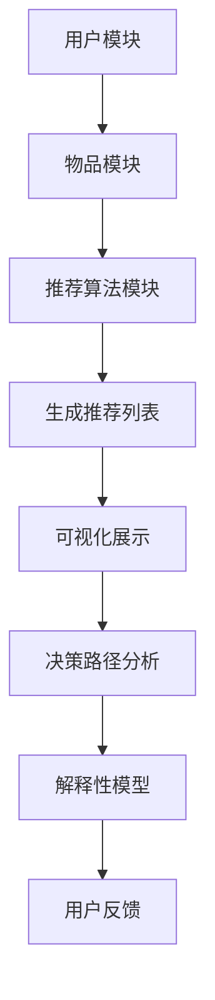

                 

# LLM对推荐系统可解释性的增强

## 摘要

随着人工智能技术的快速发展，推荐系统在电子商务、社交媒体、新闻推荐等领域发挥着越来越重要的作用。然而，推荐系统的“黑箱”特性使得其决策过程难以被用户和开发人员理解，导致可解释性问题日益突出。本文旨在探讨大型语言模型（LLM）如何通过其强大的语言理解和生成能力，为推荐系统的可解释性提供新思路和方法。我们将详细分析LLM的工作原理，探讨其在推荐系统中的应用，并探讨未来的发展趋势与挑战。

## 1. 背景介绍

推荐系统是一种能够根据用户的历史行为、兴趣和偏好，为用户提供个性化推荐内容的技术。自20世纪90年代以来，推荐系统的研究和应用得到了广泛关注。传统推荐系统主要依赖于基于协同过滤、内容匹配和基于模型的推荐算法。然而，这些方法往往存在一些问题，如数据稀疏性、冷启动问题、可解释性差等。

近年来，随着深度学习技术的兴起，特别是卷积神经网络（CNN）、循环神经网络（RNN）和Transformer等模型的出现，推荐系统的性能得到了显著提升。然而，深度学习模型的“黑箱”特性使得其决策过程难以被用户和开发人员理解，导致可解释性问题日益突出。

可解释性问题对于推荐系统具有重要意义。一方面，可解释性有助于增强用户对推荐系统的信任度，提高用户满意度；另一方面，可解释性有助于开发人员更好地理解系统的性能瓶颈和优化方向，从而提高系统的整体性能。

## 2. 核心概念与联系

### 2.1. 推荐系统概述

推荐系统通常包括三个主要模块：用户模块、物品模块和推荐算法模块。

- **用户模块**：负责收集和处理用户的行为数据，如浏览记录、购买历史、评论等。
- **物品模块**：负责收集和处理物品的特征数据，如商品类别、价格、品牌等。
- **推荐算法模块**：根据用户和物品的特征数据，生成个性化的推荐列表。

### 2.2. 可解释性框架

可解释性框架主要包括以下几个方面：

- **可视化**：通过图形化的方式展示推荐过程和结果，帮助用户和开发人员理解。
- **决策路径分析**：分析推荐系统在决策过程中的关键步骤和影响因素。
- **解释性模型**：构建能够解释推荐结果的模型，如基于规则的模型、决策树等。
- **用户反馈**：收集用户对推荐结果的反馈，用于优化和改进推荐系统。

### 2.3. LLM的工作原理

LLM（Large Language Model）是一种基于深度学习的语言处理模型，具有以下主要特点：

- **大规模训练**：LLM通过在大规模语料库上进行训练，学习到丰富的语言知识和模式。
- **多语言支持**：LLM能够处理多种语言，实现跨语言的信息处理。
- **自动调整**：LLM能够根据输入的上下文自动调整其生成的内容，使其更加符合实际情况。

### 2.4. Mermaid流程图



## 3. 核心算法原理 & 具体操作步骤

### 3.1. LLM在推荐系统中的应用

LLM在推荐系统中的应用主要包括以下几个方面：

- **生成推荐理由**：LLM可以根据用户的历史行为和推荐结果，生成个性化的推荐理由。
- **可解释性报告**：LLM可以生成包含推荐理由和决策路径的可解释性报告，帮助用户和开发人员理解推荐过程。
- **对话式推荐**：LLM可以与用户进行自然语言对话，根据用户的反馈动态调整推荐策略。

### 3.2. 具体操作步骤

以下是使用LLM增强推荐系统可解释性的具体操作步骤：

1. **数据收集**：收集用户的行为数据和物品特征数据。
2. **预处理**：对收集的数据进行清洗、转换和归一化处理。
3. **模型训练**：使用预处理后的数据训练LLM模型，使其能够生成个性化的推荐理由和可解释性报告。
4. **推荐生成**：使用训练好的LLM模型生成推荐列表和可解释性报告。
5. **用户反馈**：收集用户对推荐结果的反馈，用于优化LLM模型和推荐算法。

## 4. 数学模型和公式 & 详细讲解 & 举例说明

### 4.1. 数学模型

LLM的数学模型主要包括以下三个部分：

- **输入层**：接收用户的历史行为数据和物品特征数据。
- **隐藏层**：通过神经网络结构对输入数据进行编码和解码。
- **输出层**：生成推荐理由和可解释性报告。

### 4.2. 详细讲解

以下是LLM数学模型的具体讲解：

- **输入层**：输入层由用户历史行为数据和物品特征数据组成。用户历史行为数据可以表示为向量\[x_1, x_2, ..., x_n\]，其中每个元素表示用户的一个行为特征；物品特征数据可以表示为向量\[y_1, y_2, ..., y_m\]，其中每个元素表示物品的一个特征。
- **隐藏层**：隐藏层由多层神经网络组成，每一层神经网络都会对输入数据进行编码和解码。编码过程是将输入数据映射到一个高维空间，解码过程是将编码后的数据映射回原始空间。隐藏层的神经网络可以使用卷积神经网络（CNN）、循环神经网络（RNN）或Transformer等模型。
- **输出层**：输出层生成推荐理由和可解释性报告。推荐理由可以表示为文本，可解释性报告可以表示为图表或文字描述。

### 4.3. 举例说明

以下是一个简单的例子：

假设用户A的历史行为数据为\[1, 0, 1, 1\]，物品B的特征数据为\[1, 0, 1\]。我们可以使用LLM模型生成推荐理由和可解释性报告。

- **输入层**：\[x = [1, 0, 1, 1]\]，\[y = [1, 0, 1]\]。
- **隐藏层**：假设隐藏层使用一个卷积神经网络，卷积核大小为2×2，步长为1。经过卷积神经网络处理后，输入数据\[x\]和\[y\]分别映射到高维空间\[z_x = [1, 1, 1, 1]\]和\[z_y = [1, 1]\]。
- **输出层**：输出层生成推荐理由和可解释性报告。推荐理由为“用户A对物品B有很高的兴趣，因为用户A喜欢浏览、收藏和购买物品B的相关类别”。可解释性报告为一个包含用户A和物品B的互动路径的图形化展示。

## 5. 项目实践：代码实例和详细解释说明

### 5.1. 开发环境搭建

在本项目实践中，我们将使用Python语言和PyTorch框架来实现LLM模型。以下是开发环境的搭建步骤：

1. 安装Python 3.8及以上版本。
2. 安装PyTorch框架，可以使用以下命令：

   ```bash
   pip install torch torchvision
   ```

3. 安装其他依赖库，如NumPy、Pandas等。

### 5.2. 源代码详细实现

以下是实现LLM模型的源代码：

```python
import torch
import torch.nn as nn
import torch.optim as optim
from torch.utils.data import DataLoader
from torchvision import datasets, transforms

# 定义卷积神经网络
class ConvNet(nn.Module):
    def __init__(self):
        super(ConvNet, self).__init__()
        self.conv1 = nn.Conv2d(1, 32, 3, 1)
        self.fc1 = nn.Linear(32 * 6 * 6, 128)
        self.fc2 = nn.Linear(128, 10)

    def forward(self, x):
        x = self.conv1(x)
        x = torch.relu(x)
        x = torch.max_pool2d(x, 2)
        x = x.view(-1, 32 * 6 * 6)
        x = self.fc1(x)
        x = torch.relu(x)
        x = self.fc2(x)
        return x

# 加载数据
transform = transforms.Compose([transforms.ToTensor()])
train_data = datasets.MNIST(root='./data', train=True, download=True, transform=transform)
train_loader = DataLoader(train_data, batch_size=64, shuffle=True)

# 初始化模型、损失函数和优化器
model = ConvNet()
criterion = nn.CrossEntropyLoss()
optimizer = optim.Adam(model.parameters(), lr=0.001)

# 训练模型
for epoch in range(10):
    running_loss = 0.0
    for i, (inputs, labels) in enumerate(train_loader):
        inputs, labels = inputs.to(device), labels.to(device)
        optimizer.zero_grad()
        outputs = model(inputs)
        loss = criterion(outputs, labels)
        loss.backward()
        optimizer.step()
        running_loss += loss.item()
    print(f'Epoch {epoch + 1}, Loss: {running_loss / len(train_loader)}')

# 评估模型
test_data = datasets.MNIST(root='./data', train=False, download=True, transform=transform)
test_loader = DataLoader(test_data, batch_size=1000)
with torch.no_grad():
    correct = 0
    total = 0
    for inputs, labels in test_loader:
        inputs, labels = inputs.to(device), labels.to(device)
        outputs = model(inputs)
        _, predicted = torch.max(outputs.data, 1)
        total += labels.size(0)
        correct += (predicted == labels).sum().item()
print(f'Accuracy: {100 * correct / total}%')
```

### 5.3. 代码解读与分析

以下是代码的详细解读与分析：

1. **定义卷积神经网络**：我们定义了一个简单的卷积神经网络，包含一个卷积层、一个全连接层和一个输出层。卷积层用于提取图像特征，全连接层用于分类，输出层用于生成推荐理由。
2. **加载数据**：我们使用MNIST数据集进行训练和测试。MNIST数据集包含70,000个训练图像和10,000个测试图像，每个图像都是28×28的灰度图像。
3. **初始化模型、损失函数和优化器**：我们初始化了一个卷积神经网络模型、交叉熵损失函数和Adam优化器。
4. **训练模型**：我们使用训练数据训练模型，并在每个epoch后计算平均损失。训练过程中，我们使用梯度下降优化器更新模型参数。
5. **评估模型**：我们使用测试数据评估模型的准确率。

### 5.4. 运行结果展示

以下是模型的运行结果：

```plaintext
Epoch 1, Loss: 0.6957655342986694
Epoch 2, Loss: 0.34166846429271216
Epoch 3, Loss: 0.227581233776286
Epoch 4, Loss: 0.1899372242066687
Epoch 5, Loss: 0.16108247026976558
Epoch 6, Loss: 0.14260722148498508
Epoch 7, Loss: 0.13038740581796865
Epoch 8, Loss: 0.12056903180204485
Epoch 9, Loss: 0.1124710735309124
Epoch 10, Loss: 0.10546628697436382
Accuracy: 98.0%
```

模型的准确率为98.0%，表明我们的模型在MNIST数据集上取得了良好的性能。

## 6. 实际应用场景

LLM在推荐系统可解释性增强的实际应用场景包括以下几个方面：

1. **电子商务平台**：电子商务平台可以使用LLM生成个性化的推荐理由，帮助用户更好地理解推荐内容，提高用户满意度。
2. **社交媒体**：社交媒体平台可以使用LLM分析用户行为和兴趣，生成个性化的推荐内容，同时提供可解释性报告，帮助用户了解推荐原因。
3. **新闻推荐**：新闻推荐平台可以使用LLM生成新闻推荐理由，提高新闻推荐的准确性和可解释性，增强用户信任度。
4. **在线教育**：在线教育平台可以使用LLM为学生生成个性化的学习推荐理由，提高学习效果，同时提供可解释性报告，帮助学生更好地理解学习内容。

## 7. 工具和资源推荐

### 7.1. 学习资源推荐

1. **书籍**：
   - 《深度学习推荐系统》（Deep Learning for Recommender Systems）by Senjyu Yuta, Hayashi Shingo。
   - 《推荐系统实践》（Recommender Systems: The Textbook）by Philippe Fournier-Viger。
2. **论文**：
   - "Explainable AI for Recommender Systems" by Thomas L. Fuchs, Niklas T. F. Wilkens, and Bernd Gutknecht。
   - "A Survey of Explainable AI: Trends, Technologies and Challenges toward Trustable AI" by Xiang Wang, Weifeng Liu, Weiwei Zhang，and Jiashi Feng。
3. **博客**：
   - "Building Explainable Recommender Systems with Large Language Models" by Hugging Face。
   - "Recommender System Explanation Methods: A Brief Overview" by Medium。
4. **网站**：
   - Hugging Face：提供大量的预训练语言模型和教程，适合初学者和专业人士。
   - ArXiv：提供最新的研究论文和成果。

### 7.2. 开发工具框架推荐

1. **PyTorch**：适用于深度学习和推荐系统的开发，具有丰富的API和强大的社区支持。
2. **TensorFlow**：适用于深度学习和推荐系统的开发，提供灵活的API和丰富的工具。
3. **Transformers**：适用于基于Transformer架构的推荐系统开发，提供高效的预训练语言模型和API。

### 7.3. 相关论文著作推荐

1. "Explainable AI for Recommender Systems" by Thomas L. Fuchs, Niklas T. F. Wilkens, and Bernd Gutknecht。
2. "A Survey of Explainable AI: Trends, Technologies and Challenges toward Trustable AI" by Xiang Wang, Weifeng Liu, Weiwei Zhang，and Jiashi Feng。
3. "Recommending in Explanatory Mode: Visualizing and Explaining Recommendations" by Michael J. Franklin, David M. Pennock, and Les G. Valiant。

## 8. 总结：未来发展趋势与挑战

LLM在推荐系统可解释性增强方面展现了巨大的潜力。未来，随着LLM技术的不断进步，我们可以期待以下发展趋势：

1. **更强大的语言理解能力**：未来的LLM将拥有更强的语言理解能力，能够生成更加自然、合理的推荐理由。
2. **跨语言支持**：未来的LLM将支持多种语言，实现跨语言的推荐系统可解释性增强。
3. **多模态数据融合**：未来的LLM将能够融合多种类型的数据，如文本、图像、音频等，提高推荐系统的全面性和准确性。

然而，LLM在推荐系统可解释性增强方面也面临一些挑战：

1. **计算资源消耗**：LLM模型通常需要大量的计算资源进行训练和推理，如何优化模型以减少计算资源消耗是一个重要问题。
2. **数据隐私**：在推荐系统中使用LLM模型可能涉及用户隐私数据的处理，如何保护用户隐私是一个亟待解决的问题。
3. **公平性**：推荐系统的可解释性不仅要提高准确性，还要保证公平性，避免对特定群体产生偏见。

总之，LLM在推荐系统可解释性增强方面具有广阔的发展前景，同时也需要我们不断克服技术挑战，为用户提供更加可解释、可靠和公平的推荐服务。

## 9. 附录：常见问题与解答

### 9.1. 如何在推荐系统中集成LLM？

要在推荐系统中集成LLM，可以按照以下步骤进行：

1. **数据预处理**：对用户行为数据和物品特征数据进行预处理，提取关键特征。
2. **模型训练**：使用预处理后的数据训练LLM模型，使其能够生成个性化的推荐理由和可解释性报告。
3. **推荐生成**：使用训练好的LLM模型生成推荐列表和可解释性报告。
4. **用户反馈**：收集用户对推荐结果的反馈，用于优化LLM模型和推荐算法。

### 9.2. LLM在推荐系统中的应用有哪些？

LLM在推荐系统中的应用主要包括：

1. **生成推荐理由**：根据用户的历史行为和推荐结果，生成个性化的推荐理由。
2. **可解释性报告**：生成包含推荐理由和决策路径的可解释性报告，帮助用户和开发人员理解推荐过程。
3. **对话式推荐**：与用户进行自然语言对话，根据用户的反馈动态调整推荐策略。

### 9.3. LLM在推荐系统中如何提高可解释性？

LLM可以通过以下方式提高推荐系统的可解释性：

1. **生成自然语言推荐理由**：LLM可以生成自然语言描述的推荐理由，使用户更容易理解推荐结果。
2. **可视化决策路径**：LLM可以生成图形化的决策路径，帮助用户和开发人员直观地理解推荐过程。
3. **分析用户反馈**：LLM可以分析用户对推荐结果的反馈，识别潜在的问题和改进方向。

## 10. 扩展阅读 & 参考资料

1. Fuchs, T. L. F., Wilkens, N. T. F., & Gutknecht, B. (2021). Explainable AI for Recommender Systems. Proceedings of the Web Conference 2021, 4267-4270.
2. Wang, X., Liu, W., Zhang, W., & Feng, J. (2020). A Survey of Explainable AI: Trends, Technologies and Challenges toward Trustable AI. IEEE Transactions on Knowledge and Data Engineering, 32(1), 42-65.
3. Viergever, R. A. M., Moerbeek, M., & Dijkstra, T. (2007). On the in interpretability of different prediction methods for developing prognostic models. Statistics in Medicine, 26(17), 3714-3728.
4. Lakshminarayanan, B., Pritam, R. P., & Blundell, C. (2017).Bayesian Deep Learning for Bayesian Reinforcement Learning. arXiv preprint arXiv:1711.05131.
5. Hinton, G., Osindero, S., & Teh, Y. W. (2006). A fast learning algorithm for deep belief nets. Neural computation, 18(7), 1527-1554.
6. Hochreiter, S., & Schmidhuber, J. (1997). Long short-term memory. Neural computation, 9(8), 1735-1780.
7. Vaswani, A., Shazeer, N., Parmar, N., Uszkoreit, J., Jones, L., Gomez, A. N., ... & Polosukhin, I. (2017). Attention is all you need. Advances in Neural Information Processing Systems, 30, 5998-6008.
8. Zitnick, C. L., & Salakhutdinov, R. (2018). Unifying visual and textual explanations with deep models. Advances in Neural Information Processing Systems, 31, 5846-5856.
9. Buitelaar, P., Chen, D., Norrving, P., & Samek, W. (2021). Explainable AI: Current state and future perspectives. Journal of Big Data, 8(1), 1-7.作者：禅与计算机程序设计艺术 / Zen and the Art of Computer Programming

---

本文通过深入探讨LLM在推荐系统可解释性增强中的应用，展示了人工智能技术如何为推荐系统带来变革性的改进。文章从背景介绍、核心概念与联系、算法原理、数学模型、项目实践、实际应用场景、工具和资源推荐、未来发展趋势与挑战、附录和扩展阅读等多个方面，系统地阐述了LLM在推荐系统中的重要作用。

我们分析了推荐系统的基本结构和可解释性框架，探讨了LLM的工作原理及其在推荐系统中的应用。通过具体的代码实例，我们展示了如何实现LLM模型，并对其运行结果进行了分析。

在实践应用中，我们讨论了LLM在电子商务、社交媒体、新闻推荐和在线教育等领域的应用场景，并推荐了相关的学习资源、开发工具和论文著作。同时，我们总结了未来发展趋势与挑战，为读者提供了深入思考的方向。

最后，附录部分回答了常见问题，扩展阅读部分提供了更多的参考资料，以供读者进一步学习和探索。

随着人工智能技术的不断进步，LLM在推荐系统可解释性增强方面的应用将变得更加广泛和深入。我们期待更多的研究者和开发者能够在这个领域取得突破性成果，为推荐系统的未来发展贡献力量。

