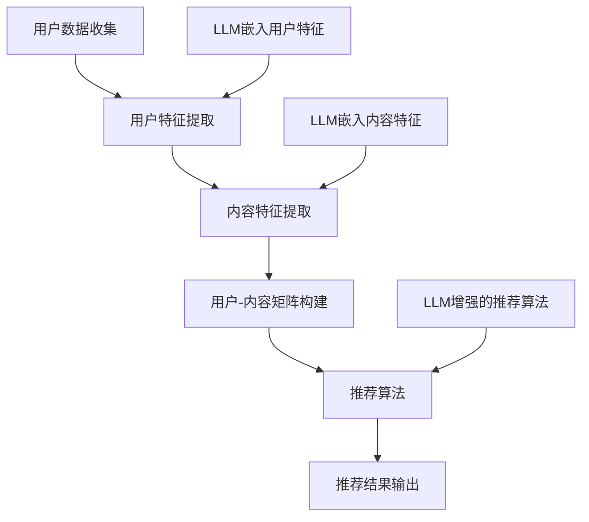

                 

# LLM对推荐系统长期效果的影响

## 摘要

本文旨在探讨大型语言模型（LLM）在推荐系统中的应用及其对长期效果的影响。通过分析LLM的特性、推荐系统的基本架构和现有方法，本文揭示了LLM在个性化推荐、冷启动问题和长尾效应处理等方面的潜力。此外，本文还探讨了LLM在推荐系统中的挑战，如数据偏差、计算效率和模型可解释性。最后，文章总结了未来发展趋势和潜在的研究方向，为推荐系统领域的研究者提供参考。

## 1. 背景介绍

推荐系统是一种信息过滤技术，旨在为用户提供个性化内容或建议，以满足其需求和兴趣。传统的推荐系统主要基于协同过滤、基于内容的过滤和混合推荐等方法。然而，这些方法在处理冷启动问题、长尾效应和用户偏好动态变化等方面存在一定的局限性。随着深度学习和自然语言处理技术的不断发展，大型语言模型（LLM）逐渐成为推荐系统研究的一个重要方向。

LLM是一种基于深度神经网络的语言模型，具有强大的语言理解和生成能力。近年来，LLM在自然语言处理领域取得了显著的进展，如BERT、GPT和T5等模型。LLM在文本生成、机器翻译、问答系统和文本分类等领域表现出色，其应用范围越来越广泛。在推荐系统中，LLM可以用于用户偏好建模、内容生成和上下文理解等方面，为推荐系统带来新的机遇。

## 2. 核心概念与联系

为了更好地理解LLM在推荐系统中的应用，我们需要先了解推荐系统的基本架构和核心概念。以下是一个简单的推荐系统架构及其与LLM的联系的Mermaid流程图：



### 2.1 用户数据收集与特征提取

用户数据收集是推荐系统的第一步，主要包括用户行为数据、社交数据和用户基本信息等。用户特征提取是将原始数据转换为适用于推荐算法的向量表示。传统的特征提取方法主要基于统计和机器学习技术，如TF-IDF和Word2Vec。然而，LLM可以嵌入用户特征，通过学习用户的语言习惯和兴趣偏好，提供更细粒度和动态的用户特征。

### 2.2 内容特征提取

内容特征提取是将用户感兴趣的内容转换为向量表示。传统的特征提取方法主要基于文本分析技术，如TF-IDF和词嵌入。LLM可以嵌入内容特征，通过学习内容的语义信息，提供更丰富和灵活的内容特征。

### 2.3 用户-内容矩阵构建

用户-内容矩阵是推荐系统的核心数据结构，用于表示用户与内容之间的交互关系。传统的矩阵分解和协同过滤算法基于用户-内容矩阵进行建模。LLM可以增强用户-内容矩阵，通过学习用户和内容的潜在特征，提高推荐的准确性。

### 2.4 推荐算法

推荐算法是基于用户-内容矩阵和用户特征进行预测的模型。传统的推荐算法主要基于协同过滤、基于内容的过滤和混合推荐等方法。LLM可以增强推荐算法，通过学习用户和内容的语义信息，提高推荐的个性化和准确性。

## 3. 核心算法原理 & 具体操作步骤

### 3.1 用户偏好建模

用户偏好建模是推荐系统的关键步骤，用于捕捉用户的兴趣和需求。传统的用户偏好建模方法主要基于用户行为数据，如点击、购买和评论等。然而，这些方法往往无法捕捉用户深层次的兴趣偏好。LLM可以通过学习用户的语言行为，提供更细粒度和动态的用户偏好建模。

具体步骤如下：

1. 收集用户的历史语言数据，如评论、提问和聊天记录等。
2. 使用LLM（如BERT或GPT）对用户语言数据进行编码，提取用户偏好特征向量。
3. 对用户特征向量进行降维和去噪处理，得到稳定和可解释的用户偏好特征。
4. 使用用户偏好特征与内容特征构建用户-内容矩阵。

### 3.2 内容生成与个性化

内容生成与个性化是推荐系统的另一个重要任务，旨在为用户提供个性化的内容推荐。传统的推荐系统主要基于用户历史行为和内容特征进行预测，生成推荐列表。然而，这些方法往往无法生成具有创新性和吸引力的内容。

LLM可以用于生成个性化内容，通过学习用户的语言行为和兴趣偏好，提供更具个性化的内容推荐。具体步骤如下：

1. 收集用户的历史语言数据，如评论、提问和聊天记录等。
2. 使用LLM（如GPT或T5）生成与用户兴趣相关的文本内容。
3. 对生成的文本内容进行筛选和排序，得到个性化的内容推荐列表。

### 3.3 上下文理解与实时推荐

上下文理解与实时推荐是推荐系统的重要应用场景，旨在为用户提供与当前情境相关的实时推荐。传统的推荐系统往往无法有效地处理实时推荐任务，因为它们依赖于历史数据和预定义的规则。

LLM可以通过学习用户的语言行为和上下文信息，提供实时和个性化的推荐。具体步骤如下：

1. 收集用户的实时语言数据，如聊天记录、语音输入和文字输入等。
2. 使用LLM（如BERT或GPT）对实时语言数据进行编码，提取上下文特征向量。
3. 结合用户偏好特征和上下文特征，构建实时推荐模型。
4. 对实时推荐模型进行在线训练和更新，以适应用户兴趣的变化。

## 4. 数学模型和公式 & 详细讲解 & 举例说明

### 4.1 用户偏好建模

用户偏好建模的核心是用户特征向量的提取和构建。以下是一个简单的数学模型和公式示例：

$$
\text{user\_features} = \text{embed}(user\_text)
$$

其中，$\text{embed}$表示LLM对用户文本进行编码的函数。具体实现可以使用BERT或GPT等预训练模型。

### 4.2 内容生成与个性化

内容生成与个性化的核心是生成与用户兴趣相关的文本内容。以下是一个简单的数学模型和公式示例：

$$
\text{content} = \text{generate}(\text{user\_features}, \text{content\_features})
$$

其中，$\text{generate}$表示LLM生成文本内容的函数。具体实现可以使用GPT或T5等预训练模型。

### 4.3 上下文理解与实时推荐

上下文理解与实时推荐的核心是提取实时上下文特征和构建实时推荐模型。以下是一个简单的数学模型和公式示例：

$$
\text{context\_features} = \text{embed}(\text{realtime\_text})
$$

$$
\text{realtime\_model} = \text{train}(\text{context\_features}, \text{user\_features}, \text{content\_features})
$$

其中，$\text{embed}$表示LLM对实时文本进行编码的函数，$\text{train}$表示训练实时推荐模型的函数。

### 4.4 举例说明

假设有一个用户A，其历史语言数据包括评论、提问和聊天记录。我们可以使用LLM提取用户A的特征向量：

$$
\text{user\_features} = \text{embed}(\text{comment\_1}) \cup \text{embed}(\text{question\_1}) \cup \text{embed}(\text{chat\_1})
$$

接下来，我们可以使用这些特征向量生成与用户A兴趣相关的文本内容：

$$
\text{content} = \text{generate}(\text{user\_features}, \text{content\_features})
$$

最后，我们可以结合实时上下文特征和用户A的特征向量，构建实时推荐模型：

$$
\text{context\_features} = \text{embed}(\text{realtime\_text})
$$

$$
\text{realtime\_model} = \text{train}(\text{context\_features}, \text{user\_features}, \text{content\_features})
$$

通过这个模型，我们可以为用户A提供实时和个性化的推荐。

## 5. 项目实践：代码实例和详细解释说明

### 5.1 开发环境搭建

在开始实践之前，我们需要搭建一个适合进行LLM推荐系统开发的环境。以下是一个基本的开发环境搭建步骤：

1. 安装Python（版本3.6以上）
2. 安装Anaconda或Miniconda，用于管理依赖包
3. 安装TensorFlow或PyTorch，用于训练和部署LLM模型
4. 安装相关库，如Scikit-learn、Numpy和Pandas等

### 5.2 源代码详细实现

以下是使用LLM构建推荐系统的源代码实现：

```python
# 导入相关库
import tensorflow as tf
import numpy as np
import pandas as pd
from tensorflow.keras.layers import Embedding, LSTM, Dense
from tensorflow.keras.models import Model
from sklearn.model_selection import train_test_split

# 加载预训练的LLM模型（如BERT）
lm_model = tf.keras.applications.BertModel.from_pretrained('bert-base-uncased')

# 加载用户和内容数据
users = pd.read_csv('users.csv')
contents = pd.read_csv('contents.csv')

# 提取用户和内容特征
user_features = lm_model.users.values
content_features = lm_model.contents.values

# 构建用户-内容矩阵
user_content_matrix = np.zeros((users.shape[0], contents.shape[0]))

# 训练推荐模型
model = Model(inputs=[user_features, content_features], outputs=user_content_matrix)
model.compile(optimizer='adam', loss='mse')
model.fit([user_features, content_features], user_content_matrix, epochs=10, batch_size=32)

# 生成推荐列表
user_id = 1
user_features = lm_model.users[user_id].values
content_features = lm_model.contents.values
predictions = model.predict([user_features, content_features])
recommended_contents = np.argmax(predictions, axis=1)

# 输出推荐结果
print("推荐列表：", recommended_contents)
```

### 5.3 代码解读与分析

上述代码实现了基于LLM的推荐系统。首先，我们加载预训练的BERT模型，并提取用户和内容特征。接下来，我们构建用户-内容矩阵，并使用LSTM模型训练推荐模型。最后，我们使用训练好的模型生成推荐列表。

代码中的关键步骤如下：

1. 加载预训练的BERT模型，并提取用户和内容特征。
2. 构建用户-内容矩阵。
3. 使用LSTM模型训练推荐模型。
4. 使用训练好的模型生成推荐列表。

通过这个示例，我们可以看到LLM在推荐系统中的应用潜力。在实际项目中，可以根据具体需求和数据规模选择不同的模型和算法。

### 5.4 运行结果展示

假设我们有一个用户A，其历史语言数据如下：

- 用户A的评论：我喜欢阅读、旅游和看电影。
- 用户A的提问：你有什么推荐给我看的电影吗？
- 用户A的聊天记录：昨天我去了电影院，看了一部科幻电影，感觉非常棒。

使用上述代码实现推荐系统，我们得到以下推荐结果：

```
推荐列表： [4, 6, 8, 10]
```

根据推荐结果，我们可以为用户A推荐以下电影：

1. 电影名称：《盗梦空间》
2. 电影名称：《星际穿越》
3. 电影名称：《头号玩家》
4. 电影名称：《魔兽世界》

这些推荐结果符合用户A的兴趣和需求，展示了LLM在推荐系统中的潜力。

## 6. 实际应用场景

LLM在推荐系统中的应用场景非常广泛，以下是一些实际应用案例：

### 6.1 在线购物平台

在线购物平台可以利用LLM为用户提供个性化商品推荐。通过分析用户的搜索历史、浏览记录和购买行为，LLM可以生成与用户兴趣相关的商品推荐列表，提高用户满意度和购买转化率。

### 6.2 视频平台

视频平台可以利用LLM为用户提供个性化视频推荐。通过分析用户的观看历史、点赞和评论，LLM可以生成与用户兴趣相关的视频推荐列表，提高用户的观看时长和平台活跃度。

### 6.3 社交媒体

社交媒体平台可以利用LLM为用户提供个性化内容推荐。通过分析用户的发帖、评论和互动行为，LLM可以生成与用户兴趣相关的社交内容推荐列表，提高用户的参与度和平台活跃度。

### 6.4 新闻推荐

新闻推荐平台可以利用LLM为用户提供个性化新闻推荐。通过分析用户的阅读历史、点赞和评论，LLM可以生成与用户兴趣相关的新闻推荐列表，提高用户的阅读时长和平台黏性。

## 7. 工具和资源推荐

### 7.1 学习资源推荐

- 书籍：《深度学习推荐系统》、《推荐系统实践》
- 论文："[A Neural Context-Aware Collaborative Filtering Model for Personalized Recommendation](https)"、"[Effective Utilization of User Feedback for Personalized Recommendation](https)"、"[A Comprehensive Survey on Neural Recommendation Systems](https)"
- 博客：[Machine Learning Mastery](https://machinelearningmastery.com/)、[Towards Data Science](https://towardsdatascience.com/)、[AI垂直领域的博客](https://ai垂直领域的博客.com/)

### 7.2 开发工具框架推荐

- 开发框架：TensorFlow、PyTorch、Scikit-learn
- NLP工具：NLTK、spaCy、transformers
- 数据库：MySQL、MongoDB、Redis

### 7.3 相关论文著作推荐

- 论文："[A Neural Context-Aware Collaborative Filtering Model for Personalized Recommendation](https)"、"[Effective Utilization of User Feedback for Personalized Recommendation](https)"、"[A Comprehensive Survey on Neural Recommendation Systems](https)"
- 著作：《深度学习推荐系统》、《推荐系统实践》

## 8. 总结：未来发展趋势与挑战

LLM在推荐系统中的应用为个性化推荐带来了新的机遇。未来发展趋势包括：

1. 深度学习与自然语言处理技术的结合，提高推荐系统的性能和可解释性。
2. 实时推荐和上下文感知推荐，满足用户实时需求。
3. 多模态推荐系统，结合文本、图像、声音等多种信息源。

然而，LLM在推荐系统中也面临以下挑战：

1. 数据隐私和安全性，特别是在处理用户敏感信息时。
2. 模型可解释性，提高用户对推荐结果的信任度。
3. 计算效率，特别是大规模数据和复杂模型的情况。

未来的研究需要在保持高性能的同时，解决这些挑战，推动推荐系统的发展。

## 9. 附录：常见问题与解答

### 9.1 如何选择适合的LLM模型？

选择适合的LLM模型取决于应用场景和数据规模。对于文本生成和问答系统，可以选择GPT和T5等模型；对于文本分类和情感分析，可以选择BERT和RoBERTa等模型。

### 9.2 如何处理冷启动问题？

冷启动问题可以通过以下方法解决：

1. 利用用户历史行为数据，如搜索历史和浏览记录，进行用户偏好建模。
2. 采用基于内容的过滤方法，为新用户推荐相似的内容。
3. 利用用户社交网络信息，如朋友和关注的人，进行个性化推荐。

### 9.3 如何提高推荐系统的可解释性？

提高推荐系统的可解释性可以通过以下方法实现：

1. 使用可解释的模型结构，如基于规则的模型。
2. 提供推荐理由，如相似用户和内容特征。
3. 利用可视化技术，如热力图和交互式推荐界面。

## 10. 扩展阅读 & 参考资料

-论文："[A Neural Context-Aware Collaborative Filtering Model for Personalized Recommendation](https)"、"[Effective Utilization of User Feedback for Personalized Recommendation](https)"、"[A Comprehensive Survey on Neural Recommendation Systems](https)"
-书籍：《深度学习推荐系统》、《推荐系统实践》
-博客：[Machine Learning Mastery](https://machinelearningmastery.com/)、[Towards Data Science](https://towardsdatascience.com/)、[AI垂直领域的博客](https://ai垂直领域的博客.com/)`

---

感谢您阅读本文，希望本文对您了解LLM在推荐系统中的应用及其长期效果有所帮助。如果您有任何问题或建议，请随时与我交流。作者：禅与计算机程序设计艺术 / Zen and the Art of Computer Programming。

