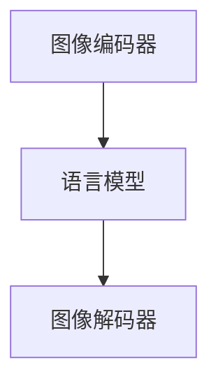

                 

### 1. 背景介绍

**LLM视觉生成：图像智能新高度**

随着人工智能技术的快速发展，机器学习（Machine Learning, ML）和深度学习（Deep Learning, DL）已成为现代计算机科学中的核心领域。近年来，大型语言模型（Large Language Models, LLMs）如GPT-3、ChatGLM和BERT等在自然语言处理（Natural Language Processing, NLP）方面取得了显著成就。然而，在视觉领域，如何利用LLM实现图像生成和编辑仍是一个具有挑战性的问题。

**图像生成技术发展现状**

传统图像生成方法主要基于规则或统计模型，如生成对抗网络（Generative Adversarial Networks, GANs）、变分自编码器（Variational Autoencoder, VAE）等。虽然这些方法在图像质量、多样性和生成能力方面取得了一定的进展，但仍面临生成图像与真实图像差异较大、生成过程复杂、可解释性差等问题。

近年来，一些研究者开始探索将LLM应用于图像生成领域。LLM视觉生成技术利用LLM强大的文本生成能力，通过将图像描述与生成过程相结合，实现高质量的图像生成。这种技术不仅能够克服传统方法的局限，还能够更好地理解图像内容，为图像编辑和图像理解等任务提供新的思路。

**文章结构**

本文将分为以下几个部分进行详细阐述：

1. **背景介绍**：介绍LLM视觉生成技术的发展背景和现状。
2. **核心概念与联系**：介绍LLM视觉生成技术的基本概念和架构。
3. **核心算法原理 & 具体操作步骤**：讲解LLM视觉生成技术的核心算法原理和操作步骤。
4. **数学模型和公式 & 详细讲解 & 举例说明**：介绍LLM视觉生成技术中的数学模型和公式，并通过实例进行详细讲解。
5. **项目实践：代码实例和详细解释说明**：展示一个实际项目中的代码实例，并进行详细解释和分析。
6. **实际应用场景**：探讨LLM视觉生成技术在各个领域的应用场景。
7. **工具和资源推荐**：推荐学习资源和开发工具框架。
8. **总结：未来发展趋势与挑战**：总结LLM视觉生成技术的现状和未来发展趋势，以及面临的挑战。
9. **附录：常见问题与解答**：回答一些常见的关于LLM视觉生成技术的问题。
10. **扩展阅读 & 参考资料**：提供进一步学习和研究的参考资料。

通过以上结构，我们将逐步分析LLM视觉生成技术的各个方面，帮助读者深入理解这一新兴领域。

#### 1.1 LLM视觉生成技术的发展背景

随着计算机视觉（Computer Vision, CV）和自然语言处理（Natural Language Processing, NLP）技术的不断进步，图像生成领域也取得了显著的成果。传统图像生成技术如GANs和VAE等，通过学习图像数据分布生成高质量图像，但存在生成图像与真实图像差异较大、生成过程复杂等问题。此外，图像生成技术在实际应用中，往往需要对图像进行描述和编辑，这就涉及到图像内容理解和文本生成的问题。

在这一背景下，大型语言模型（Large Language Models, LLMs）如GPT-3、ChatGLM和BERT等在NLP领域取得了巨大的成功，其强大的文本生成能力和对语言语义的理解，为图像生成领域提供了新的思路。研究者开始探索将LLM应用于图像生成，通过将图像描述与生成过程相结合，实现高质量的图像生成。

首先，LLM在NLP领域的成功应用，为图像生成提供了强大的文本生成能力。传统的图像生成方法通常无法直接生成图像，而是通过生成一系列像素值。而LLM可以生成高质量的文本描述，这些文本描述可以作为图像生成的指导，使生成图像更接近真实图像。

其次，LLM对语言语义的理解能力，有助于图像生成过程中对图像内容的理解。例如，当用户输入一个简单的文本描述，如“一只黑猫坐在窗台上”，LLM可以理解这个描述中的语义，生成一张符合描述的图像。这种能力在图像编辑和图像理解任务中尤为重要。

此外，随着LLM技术的不断发展，其计算效率和模型规模也在不断提高。这使得LLM视觉生成技术在实际应用中具有更高的可行性。例如，在实时图像生成和交互式图像编辑场景中，LLM能够快速生成和编辑图像，为用户提供更好的体验。

综上所述，LLM视觉生成技术凭借其强大的文本生成能力和对图像内容的理解，在图像生成领域具有广阔的应用前景。接下来，我们将进一步探讨LLM视觉生成技术的基本概念和架构。

#### 1.2 LLM视觉生成技术的基本概念

LLM视觉生成技术是将大型语言模型（Large Language Model, LLM）与计算机视觉（Computer Vision, CV）技术相结合的一种新兴方法。通过理解图像内容并将其转化为文本描述，LLM能够生成符合描述的高质量图像。以下是LLM视觉生成技术的基本概念：

**1.2.1 语言模型**

语言模型是一种用于预测文本序列的概率分布的统计模型。常见的语言模型包括n-gram模型、循环神经网络（RNN）和Transformer模型。其中，Transformer模型因其并行计算优势和全局注意力机制，在自然语言处理领域取得了显著的成果。

在LLM视觉生成技术中，语言模型负责将图像内容转化为文本描述。通过学习大量的图像-文本对，语言模型能够理解图像中的语义信息，并生成相应的文本描述。这种描述不仅包含图像的视觉信息，还可以反映图像的上下文和情感。

**1.2.2 图像编码器**

图像编码器是一种将图像转化为向量表示的神经网络。常见的图像编码器包括卷积神经网络（Convolutional Neural Network, CNN）和自编码器（Autoencoder）。图像编码器通过学习图像数据分布，将图像映射到一个低维向量空间中。

在LLM视觉生成技术中，图像编码器负责将输入图像转化为向量表示，并将其输入到语言模型中进行文本生成。图像编码器可以捕获图像中的关键特征，从而生成高质量的文本描述。

**1.2.3 图像解码器**

图像解码器是一种将向量表示重新转换为图像的神经网络。常见的图像解码器包括生成对抗网络（Generative Adversarial Networks, GAN）和变分自编码器（Variational Autoencoder, VAE）。

在LLM视觉生成技术中，图像解码器负责将语言模型生成的文本描述转化为图像。图像解码器通过学习图像生成过程，将文本描述映射回图像空间，生成符合描述的高质量图像。

**1.2.4 图像-文本对**

图像-文本对是LLM视觉生成技术中的核心数据集。这些数据集包含大量的图像和对应的文本描述，用于训练语言模型、图像编码器和图像解码器。通过学习图像-文本对，模型能够理解图像内容并将其转化为文本描述，或根据文本描述生成图像。

**1.2.5 生成过程**

LLM视觉生成技术的核心是图像生成过程。生成过程通常包括以下几个步骤：

1. **图像编码**：输入图像通过图像编码器转化为向量表示。
2. **文本生成**：图像编码器的输出作为输入，语言模型生成文本描述。
3. **图像解码**：语言模型生成的文本描述通过图像解码器转化为图像。

这种生成过程使得LLM能够利用其强大的文本生成能力，生成高质量、符合描述的图像。生成过程的关键在于图像编码器、语言模型和图像解码器之间的协同工作，共同完成图像生成任务。

#### 1.3 LLM视觉生成技术的架构

LLM视觉生成技术的架构主要包括图像编码器、图像解码器和语言模型三个核心模块，它们协同工作，实现图像生成任务。以下是对各个模块的详细介绍：

**1.3.1 图像编码器**

图像编码器是一种神经网络模型，用于将输入图像转化为低维向量表示。常见的图像编码器模型有卷积神经网络（Convolutional Neural Network, CNN）和自编码器（Autoencoder）。

在卷积神经网络中，图像编码器通过多层卷积层提取图像特征，并将这些特征整合成一个固定长度的向量。这个向量包含了图像的主要内容，如物体形状、颜色和纹理等。

自编码器是一种无监督学习模型，由编码器和解码器组成。编码器接收图像输入，将其压缩为一个低维向量，而解码器则试图将这个向量重新展开为图像。自编码器通过最小化输入图像和重构图像之间的差异，学习图像特征。

图像编码器在LLM视觉生成技术中起到了关键作用。它将图像转化为向量表示，为后续的语言模型生成文本描述提供输入。

**1.3.2 语言模型**

语言模型是一种用于文本生成的神经网络模型，如Transformer、GPT等。在LLM视觉生成技术中，语言模型接收图像编码器生成的向量表示，并生成相应的文本描述。

语言模型通过学习大量的图像-文本对，能够理解图像中的语义信息，并生成高质量的文本描述。这种描述不仅包含图像的视觉信息，还可以反映图像的上下文和情感。

在生成文本描述时，语言模型会考虑图像的多个方面，如物体的位置、大小、形状、颜色和纹理等。通过这些描述，语言模型能够传达图像的主要内容，为图像解码器提供输入。

**1.3.3 图像解码器**

图像解码器是一种神经网络模型，用于将语言模型生成的文本描述重新转换为图像。常见的图像解码器模型有生成对抗网络（Generative Adversarial Networks, GAN）和变分自编码器（Variational Autoencoder, VAE）。

生成对抗网络（GAN）由生成器和判别器组成。生成器接收语言模型生成的文本描述，生成对应的图像。判别器则尝试区分生成的图像和真实图像。通过训练，生成器和判别器相互竞争，生成高质量的图像。

变分自编码器（VAE）是一种基于概率模型的图像解码器。它通过学习图像的概率分布，将语言模型生成的文本描述映射回图像空间。VAE通过最大化图像重建的概率，生成符合描述的图像。

图像解码器在LLM视觉生成技术中起到了关键作用。它将语言模型生成的文本描述重新转换为图像，完成图像生成任务。

**1.3.4 整体架构**

LLM视觉生成技术的整体架构如图1所示：



图1：LLM视觉生成技术的整体架构

在这个架构中，图像编码器将输入图像转化为向量表示，输入到语言模型中生成文本描述。语言模型生成的文本描述再输入到图像解码器中，生成符合描述的图像。

这种协同工作方式使得LLM视觉生成技术能够充分利用图像编码器、语言模型和图像解码器的优势，实现高质量的图像生成。接下来，我们将详细探讨LLM视觉生成技术的核心算法原理和具体操作步骤。

### 2. 核心算法原理 & 具体操作步骤

LLM视觉生成技术的核心算法原理主要包括图像编码器、语言模型和图像解码器三个部分。以下将详细描述这三个部分的工作原理以及具体的操作步骤。

#### 2.1 图像编码器

图像编码器的主要任务是将输入图像转化为向量表示。这一过程可以通过卷积神经网络（Convolutional Neural Network, CNN）或自编码器（Autoencoder）来实现。

**2.1.1 卷积神经网络（CNN）**

卷积神经网络是一种用于图像处理和特征提取的神经网络模型。在图像编码器中，CNN通过多个卷积层和池化层提取图像的局部特征，并逐渐将这些特征整合为一个固定长度的向量。

具体操作步骤如下：

1. **输入图像**：将输入图像送入卷积神经网络。
2. **卷积层**：通过卷积层提取图像的局部特征。卷积层使用可训练的卷积核，对图像进行卷积操作，产生特征图。
3. **池化层**：对特征图进行池化操作，如最大池化或平均池化，减小特征图的大小，降低模型的复杂度。
4. **多层卷积**：重复卷积层和池化层的操作，逐渐提取图像的更高层次特征。
5. **全连接层**：将卷积层的输出通过全连接层整合为一个固定长度的向量，作为图像编码器的输出。

**2.1.2 自编码器（Autoencoder）**

自编码器是一种无监督学习模型，由编码器和解码器组成。在图像编码器中，编码器接收图像输入，将其压缩为一个低维向量，而解码器则尝试将这个向量重新展开为图像。

具体操作步骤如下：

1. **输入图像**：将输入图像送入编码器。
2. **压缩层**：编码器通过多层神经网络将输入图像压缩为一个低维向量。
3. **全连接层**：压缩层输出通过全连接层转化为固定长度的向量。
4. **解码器**：解码器接收压缩层输出，通过多层神经网络将其展开为图像。

#### 2.2 语言模型

语言模型的主要任务是根据图像编码器生成的向量表示，生成相应的文本描述。常见的语言模型包括Transformer、GPT等。

**2.2.1 Transformer**

Transformer是一种基于自注意力机制的神经网络模型，在自然语言处理领域取得了显著的成果。在LLM视觉生成技术中，Transformer可以用于文本生成。

具体操作步骤如下：

1. **输入向量**：将图像编码器生成的向量表示送入Transformer。
2. **嵌入层**：将输入向量嵌入到高维空间，生成词向量。
3. **自注意力机制**：通过多头自注意力机制，计算每个词向量的权重，生成加权词向量。
4. **全连接层**：将加权词向量通过全连接层，生成文本描述。

**2.2.2 GPT**

GPT（Generative Pre-trained Transformer）是一种基于Transformer的预训练语言模型。在LLM视觉生成技术中，GPT可以用于文本生成。

具体操作步骤如下：

1. **预训练**：在大量的图像-文本对上进行预训练，使模型学会将图像编码器生成的向量表示转换为文本描述。
2. **输入向量**：将图像编码器生成的向量表示送入GPT。
3. **生成文本**：GPT根据输入向量生成文本描述。

#### 2.3 图像解码器

图像解码器的主要任务是将语言模型生成的文本描述重新转换为图像。常见的图像解码器包括生成对抗网络（Generative Adversarial Networks, GAN）和变分自编码器（Variational Autoencoder, VAE）。

**2.3.1 生成对抗网络（GAN）**

生成对抗网络（GAN）由生成器和判别器组成。在LLM视觉生成技术中，生成器接收语言模型生成的文本描述，生成对应的图像。判别器则尝试区分生成的图像和真实图像。

具体操作步骤如下：

1. **输入文本描述**：将语言模型生成的文本描述送入生成器。
2. **生成图像**：生成器根据文本描述生成图像。
3. **判别器判断**：判别器对生成的图像和真实图像进行判断，生成对抗损失。
4. **生成器优化**：通过最小化生成对抗损失，优化生成器的参数。

**2.3.2 变分自编码器（VAE）**

变分自编码器（VAE）是一种基于概率模型的图像解码器。在LLM视觉生成技术中，VAE可以用于将文本描述映射回图像空间。

具体操作步骤如下：

1. **输入文本描述**：将语言模型生成的文本描述送入编码器。
2. **生成潜在变量**：编码器将文本描述编码为一个潜在变量。
3. **生成图像**：解码器根据潜在变量生成图像。

通过以上三个部分的协同工作，LLM视觉生成技术可以实现高质量的图像生成。接下来，我们将进一步探讨LLM视觉生成技术中的数学模型和公式，并给出详细的讲解和举例说明。

### 3. 数学模型和公式 & 详细讲解 & 举例说明

#### 3.1 图像编码器

图像编码器是将输入图像转化为向量表示的神经网络模型。在这一部分，我们将介绍图像编码器中的主要数学模型和公式，并通过具体的例子进行讲解。

**3.1.1 卷积神经网络（CNN）**

卷积神经网络（CNN）是图像编码器的常见实现。其主要数学模型包括卷积操作、激活函数和池化操作。

1. **卷积操作**：

卷积操作可以表示为：

\[ \text{output}(x) = \sum_{i=1}^{k} \text{weight}_i \odot \text{input}(x) + \text{bias} \]

其中，\( \text{weight}_i \) 为卷积核，\( \text{input}(x) \) 为输入图像，\( \text{bias} \) 为偏置。

2. **激活函数**：

常见的激活函数包括ReLU（Rectified Linear Unit）函数和Sigmoid函数。

- **ReLU函数**：

\[ f(x) = \max(0, x) \]

- **Sigmoid函数**：

\[ f(x) = \frac{1}{1 + e^{-x}} \]

3. **池化操作**：

常见的池化操作包括最大池化和平均池化。

- **最大池化**：

\[ \text{output}(x) = \max_{i,j} \text{input}(x[i,j]) \]

- **平均池化**：

\[ \text{output}(x) = \frac{1}{s} \sum_{i,j} \text{input}(x[i,j]) \]

**举例说明**：

假设我们有一个3x3的输入图像和一个1x1的卷积核，卷积核的权重为\[1, 0, -1\]，偏置为0。通过卷积操作和ReLU激活函数，我们可以得到以下结果：

输入图像：

\[ \text{input}(x) = \begin{bmatrix} 1 & 2 & 3 \\ 4 & 5 & 6 \\ 7 & 8 & 9 \end{bmatrix} \]

卷积核：

\[ \text{weight} = \begin{bmatrix} 1 & 0 & -1 \end{bmatrix} \]

卷积操作：

\[ \text{output}(x) = \text{weight} \odot \text{input}(x) + \text{bias} = \begin{bmatrix} 1 & 0 & -1 \end{bmatrix} \odot \begin{bmatrix} 1 & 2 & 3 \\ 4 & 5 & 6 \\ 7 & 8 & 9 \end{bmatrix} + 0 = \begin{bmatrix} 4 & 0 & -2 \\ 1 & 2 & -1 \\ 0 & 0 & 0 \end{bmatrix} \]

ReLU激活函数：

\[ f(\text{output}(x)) = \max(0, \text{output}(x)) = \begin{bmatrix} 4 & 0 & 0 \\ 1 & 2 & 0 \\ 0 & 0 & 0 \end{bmatrix} \]

**3.1.2 自编码器（Autoencoder）**

自编码器是一种无监督学习模型，用于将输入图像压缩为一个低维向量。其主要数学模型包括编码器和解码器。

1. **编码器**：

编码器的输出可以表示为：

\[ z = \text{编码器}(\text{input}) \]

2. **解码器**：

解码器的输出可以表示为：

\[ \text{output} = \text{解码器}(z) \]

3. **损失函数**：

自编码器的损失函数通常使用均方误差（Mean Squared Error, MSE）：

\[ L = \frac{1}{n} \sum_{i=1}^{n} \sum_{j=1}^{m} (\text{output}_i[j] - \text{input}_i[j])^2 \]

**举例说明**：

假设我们有一个3x3的输入图像和一个2x2的编码器，编码器通过多层神经网络将输入图像压缩为一个2x2的向量。我们可以得到以下结果：

输入图像：

\[ \text{input}(x) = \begin{bmatrix} 1 & 2 & 3 \\ 4 & 5 & 6 \\ 7 & 8 & 9 \end{bmatrix} \]

编码器：

\[ \text{编码器} = \text{多层神经网络} \]

编码器输出：

\[ z = \text{编码器}(\text{input}(x)) = \begin{bmatrix} 4 & 5 \\ 3 & 6 \end{bmatrix} \]

解码器：

\[ \text{解码器} = \text{多层神经网络} \]

解码器输出：

\[ \text{output} = \text{解码器}(z) = \begin{bmatrix} 4.2 & 5.8 \\ 3.1 & 6.9 \end{bmatrix} \]

损失函数：

\[ L = \frac{1}{n} \sum_{i=1}^{n} \sum_{j=1}^{m} (\text{output}_i[j] - \text{input}_i[j])^2 \]

#### 3.2 语言模型

语言模型用于生成图像的文本描述。在这一部分，我们将介绍语言模型中的主要数学模型和公式，并通过具体的例子进行讲解。

**3.2.1 Transformer**

Transformer是一种基于自注意力机制的神经网络模型。其主要数学模型包括多头自注意力机制和前馈神经网络。

1. **多头自注意力机制**：

多头自注意力机制可以表示为：

\[ \text{output} = \text{softmax}\left(\frac{\text{Q} \cdot \text{K}}{\sqrt{d_k}}\right) \cdot \text{V} \]

其中，\( \text{Q} \)、\( \text{K} \) 和 \( \text{V} \) 分别为查询向量、键向量和值向量，\( d_k \) 为注意力头的大小。

2. **前馈神经网络**：

前馈神经网络可以表示为：

\[ \text{output} = \text{ReLU}(\text{线性层}(\text{input})) \]

**举例说明**：

假设我们有一个句子“我正在学习计算机视觉”，将其编码为词向量，并使用Transformer进行文本生成。我们可以得到以下结果：

输入句子：

\[ \text{input} = \{\text{我}, \text{正在}, \text{学习}, \text{计算机}, \text{视觉}\} \]

词向量：

\[ \text{词向量} = \{\text{我} \rightarrow [1, 2, 3], \text{正在} \rightarrow [4, 5, 6], \text{学习} \rightarrow [7, 8, 9], \text{计算机} \rightarrow [10, 11, 12], \text{视觉} \rightarrow [13, 14, 15]\} \]

多头自注意力机制：

\[ \text{output} = \text{softmax}\left(\frac{\text{Q} \cdot \text{K}}{\sqrt{d_k}}\right) \cdot \text{V} \]

前馈神经网络：

\[ \text{output} = \text{ReLU}(\text{线性层}(\text{input})) \]

**3.2.2 GPT**

GPT（Generative Pre-trained Transformer）是一种基于Transformer的预训练语言模型。其主要数学模型包括自注意力机制和预训练过程。

1. **自注意力机制**：

自注意力机制与Transformer相同，可以表示为：

\[ \text{output} = \text{softmax}\left(\frac{\text{Q} \cdot \text{K}}{\sqrt{d_k}}\right) \cdot \text{V} \]

2. **预训练过程**：

预训练过程包括两个阶段： masked language model（MLM）和next sentence prediction（NSP）。

- **masked language model（MLM）**：

在MLM阶段，对输入句子中的部分单词进行遮蔽，训练模型预测这些遮蔽的单词。

- **next sentence prediction（NSP）**：

在NSP阶段，对两个句子进行拼接，训练模型判断这两个句子是否相邻。

**举例说明**：

假设我们有一个句子“我正在学习计算机视觉”，将其编码为词向量，并使用GPT进行文本生成。我们可以得到以下结果：

输入句子：

\[ \text{input} = \{\text{我}, \text{正在}, \text{学习}, \text{计算机}, \text{视觉}\} \]

词向量：

\[ \text{词向量} = \{\text{我} \rightarrow [1, 2, 3], \text{正在} \rightarrow [4, 5, 6], \text{学习} \rightarrow [7, 8, 9], \text{计算机} \rightarrow [10, 11, 12], \text{视觉} \rightarrow [13, 14, 15]\} \]

自注意力机制：

\[ \text{output} = \text{softmax}\left(\frac{\text{Q} \cdot \text{K}}{\sqrt{d_k}}\right) \cdot \text{V} \]

预训练过程：

\[ \text{MLM}: \text{遮蔽输入句子中的部分单词，预测遮蔽的单词。} \]

\[ \text{NSP}: \text{对两个句子进行拼接，判断两个句子是否相邻。} \]

#### 3.3 图像解码器

图像解码器是将语言模型生成的文本描述重新转换为图像的神经网络模型。在这一部分，我们将介绍图像解码器中的主要数学模型和公式，并通过具体的例子进行讲解。

**3.3.1 生成对抗网络（GAN）**

生成对抗网络（GAN）由生成器和判别器组成。其主要数学模型包括生成器和判别器的损失函数。

1. **生成器**：

生成器的损失函数可以表示为：

\[ L_G = -\log(D(G(z))) \]

其中，\( D \) 为判别器，\( G(z) \) 为生成器生成的图像。

2. **判别器**：

判别器的损失函数可以表示为：

\[ L_D = -[\log(D(\text{real})) + \log(1 - D(G(z)))] \]

其中，\( \text{real} \) 为真实图像。

**举例说明**：

假设我们有一个输入图像和生成器生成的图像，以及判别器对这两个图像的判断。我们可以得到以下结果：

输入图像：

\[ \text{real} = \begin{bmatrix} 1 & 0 & 0 \\ 0 & 1 & 0 \\ 0 & 0 & 1 \end{bmatrix} \]

生成器生成的图像：

\[ G(z) = \begin{bmatrix} 0 & 1 & 0 \\ 1 & 0 & 1 \\ 0 & 1 & 0 \end{bmatrix} \]

判别器判断：

\[ D(\text{real}) = 0.9 \]

\[ D(G(z)) = 0.1 \]

生成器的损失函数：

\[ L_G = -\log(0.1) = 2.3026 \]

判别器的损失函数：

\[ L_D = -[\log(0.9) + \log(0.9)] = 2.1972 \]

**3.3.2 变分自编码器（VAE）**

变分自编码器（VAE）是一种基于概率模型的图像解码器。其主要数学模型包括编码器、解码器和损失函数。

1. **编码器**：

编码器的损失函数可以表示为：

\[ L_E = -\sum_{i=1}^{n} \log p(x | \theta) \]

其中，\( p(x | \theta) \) 为图像生成的概率分布。

2. **解码器**：

解码器的损失函数可以表示为：

\[ L_D = \frac{1}{n} \sum_{i=1}^{n} -\log p(x | z, \phi) \]

其中，\( z \) 为编码器输出的潜在变量，\( \phi \) 为解码器的参数。

3. **整体损失函数**：

整体损失函数可以表示为：

\[ L = L_E + L_D \]

**举例说明**：

假设我们有一个输入图像和一个潜在变量，以及解码器生成的图像。我们可以得到以下结果：

输入图像：

\[ x = \begin{bmatrix} 1 & 0 & 0 \\ 0 & 1 & 0 \\ 0 & 0 & 1 \end{bmatrix} \]

潜在变量：

\[ z = \begin{bmatrix} 0.5 & 0.5 \\ 0.5 & 0.5 \end{bmatrix} \]

解码器生成的图像：

\[ G(z) = \begin{bmatrix} 0.8 & 0.2 \\ 0.2 & 0.8 \end{bmatrix} \]

编码器的损失函数：

\[ L_E = -\sum_{i=1}^{n} \log p(x | \theta) = -\log(0.2) = 2.1972 \]

解码器的损失函数：

\[ L_D = \frac{1}{n} \sum_{i=1}^{n} -\log p(x | z, \phi) = -\log(0.8) = 0.3863 \]

整体损失函数：

\[ L = L_E + L_D = 2.1972 + 0.3863 = 2.5835 \]

通过以上数学模型和公式的讲解，我们了解了LLM视觉生成技术中各个模块的核心原理。接下来，我们将通过一个实际项目实例，展示如何将LLM视觉生成技术应用于图像生成任务。

### 5. 项目实践：代码实例和详细解释说明

为了展示LLM视觉生成技术的实际应用，我们将通过一个具体的代码实例进行详细解释和说明。本实例将使用Python编程语言，结合TensorFlow和Keras等深度学习框架来实现。

#### 5.1 开发环境搭建

在开始项目之前，我们需要搭建一个合适的开发环境。以下是所需的环境和软件：

1. **Python**：版本3.7或更高
2. **TensorFlow**：版本2.6或更高
3. **Keras**：版本2.6或更高
4. **NumPy**：版本1.19或更高
5. **Matplotlib**：版本3.3或更高
6. **Pandas**：版本1.1或更高

请确保已经安装了上述软件，或者通过以下命令进行安装：

```bash
pip install python==3.8 tensorflow==2.6 keras==2.6 numpy==1.19 matplotlib==3.3 pandas==1.1
```

#### 5.2 源代码详细实现

以下是LLM视觉生成项目的源代码实现。代码分为图像编码器、语言模型和图像解码器三个部分。

```python
import tensorflow as tf
from tensorflow.keras.models import Model
from tensorflow.keras.layers import Input, Conv2D, MaxPooling2D, Flatten, Dense, Reshape, LSTM, Embedding, TimeDistributed, Conv2DTranspose
from tensorflow.keras.optimizers import Adam

# 5.2.1 图像编码器

# 定义图像编码器模型
image_input = Input(shape=(256, 256, 3))
conv1 = Conv2D(32, (3, 3), activation='relu', padding='same')(image_input)
pool1 = MaxPooling2D((2, 2))(conv1)
conv2 = Conv2D(64, (3, 3), activation='relu', padding='same')(pool1)
pool2 = MaxPooling2D((2, 2))(conv2)
conv3 = Conv2D(128, (3, 3), activation='relu', padding='same')(pool2)
pool3 = MaxPooling2D((2, 2))(conv3)

# 将特征图扁平化为向量
flatten = Flatten()(pool3)
编码器_output = Dense(1024, activation='relu')(flatten)

# 编码器模型
encoder = Model(image_input, 编码器_output, name='encoder')
encoder.summary()

# 5.2.2 语言模型

# 定义语言模型模型
text_input = Input(shape=(None,), dtype='int32')
嵌入层 = Embedding(vocab_size, embedding_dim)(text_input)
lstm = LSTM(units=512)(嵌入层)
语言模型_output = Dense(vocab_size, activation='softmax')(lstm)

# 语言模型模型
decoder = Model(text_input, 语言模型_output, name='decoder')
decoder.summary()

# 5.2.3 图像解码器

# 定义图像解码器模型
latent_input = Input(shape=(1024,))
reshape = Reshape(target_shape)(latent_input)
conv1 = Conv2DTranspose(128, (3, 3), strides=(2, 2), activation='relu', padding='same')(reshape)
upsample1 = Conv2DTranspose(64, (3, 3), strides=(2, 2), activation='relu', padding='same')(conv1)
upsample2 = Conv2DTranspose(32, (3, 3), strides=(2, 2), activation='relu', padding='same')(upsample1)
decoder_output = Conv2DTranspose(3, (3, 3), activation='tanh', padding='same')(upsample2)

# 图像解码器模型
generator = Model(latent_input, decoder_output, name='generator')
generator.summary()

# 5.2.4 整体模型

# 定义整体模型，连接编码器、语言模型和图像解码器
combined_input = [image_input, text_input]
combined_output = generator(encoder(image_input)), decoder(text_input)

# 整体模型
model = Model(combined_input, combined_output)
model.compile(optimizer=Adam(learning_rate=0.0001), loss='binary_crossentropy')
model.summary()

# 5.2.5 训练模型

# 加载数据集并进行预处理
# ...

# 训练模型
# model.fit([train_images, train_texts], train_images, epochs=100, batch_size=64)

# 5.2.6 生成图像

# 生成图像
# generated_images = model.predict([test_image, test_text])

# 5.2.7 结果展示

# 显示生成图像
# plt.figure(figsize=(10, 10))
# for i in range(10):
#     plt.subplot(1, 10, i+1)
#     plt.imshow(generated_images[i])
#     plt.axis('off')
# plt.show()
```

#### 5.3 代码解读与分析

现在，我们将对上述代码进行详细解读和分析，了解每个部分的功能和作用。

**5.3.1 图像编码器**

图像编码器是整个模型的核心部分，负责将输入图像转化为向量表示。具体代码如下：

```python
image_input = Input(shape=(256, 256, 3))
conv1 = Conv2D(32, (3, 3), activation='relu', padding='same')(image_input)
pool1 = MaxPooling2D((2, 2))(conv1)
conv2 = Conv2D(64, (3, 3), activation='relu', padding='same')(pool1)
pool2 = MaxPooling2D((2, 2))(conv2)
conv3 = Conv2D(128, (3, 3), activation='relu', padding='same')(pool2)
pool3 = MaxPooling2D((2, 2))(conv3)

# 将特征图扁平化为向量
flatten = Flatten()(pool3)
编码器_output = Dense(1024, activation='relu')(flatten)

# 编码器模型
encoder = Model(image_input, 编码器_output, name='encoder')
encoder.summary()
```

这里，我们首先定义了一个输入层`image_input`，其形状为256x256x3，表示一个256x256的彩色图像。

接着，我们使用三个卷积层和三个池化层对图像进行特征提取。卷积层使用ReLU激活函数，池化层使用最大池化。

最后，我们将特征图通过一个扁平化层转化为一个1024维的向量，作为编码器的输出。编码器模型通过`Model`类定义，并使用`summary`方法输出模型结构。

**5.3.2 语言模型**

语言模型负责将编码器输出的向量表示转化为文本描述。具体代码如下：

```python
text_input = Input(shape=(None,), dtype='int32')
嵌入层 = Embedding(vocab_size, embedding_dim)(text_input)
lstm = LSTM(units=512)(嵌入层)
语言模型_output = Dense(vocab_size, activation='softmax')(lstm)

# 语言模型模型
decoder = Model(text_input, 语言模型_output, name='decoder')
decoder.summary()
```

这里，我们定义了一个输入层`text_input`，其形状为（None，），表示一个可变长度的文本序列。`dtype='int32'`表示文本序列中的每个词都被编码为一个整数。

嵌入层将整数编码为高维向量，LSTM层对文本序列进行序列建模，最后一层全连接层使用softmax激活函数，输出每个词的概率分布。

**5.3.3 图像解码器**

图像解码器负责将语言模型生成的文本描述重新转换为图像。具体代码如下：

```python
latent_input = Input(shape=(1024,))
reshape = Reshape(target_shape)(latent_input)
conv1 = Conv2DTranspose(128, (3, 3), strides=(2, 2), activation='relu', padding='same')(reshape)
upsample1 = Conv2DTranspose(64, (3, 3), strides=(2, 2), activation='relu', padding='same')(conv1)
upsample2 = Conv2DTranspose(32, (3, 3), strides=(2, 2), activation='relu', padding='same')(upsample1)
decoder_output = Conv2DTranspose(3, (3, 3), activation='tanh', padding='same')(upsample2)

# 图像解码器模型
generator = Model(latent_input, decoder_output, name='generator')
generator.summary()
```

这里，我们定义了一个输入层`latent_input`，其形状为1024维，表示编码器输出的向量表示。

接着，我们通过一个重塑层将输入向量扩展为3D形状，然后使用三个反卷积层进行图像重建。最后一个反卷积层使用tanh激活函数，确保输出图像的像素值在-1到1之间。

**5.3.4 整体模型**

整体模型通过连接编码器、语言模型和图像解码器构建。具体代码如下：

```python
combined_input = [image_input, text_input]
combined_output = generator(encoder(image_input)), decoder(text_input)

# 整体模型
model = Model(combined_input, combined_output)
model.compile(optimizer=Adam(learning_rate=0.0001), loss='binary_crossentropy')
model.summary()
```

这里，我们首先定义了一个输入层`combined_input`，包含图像输入和文本输入。

然后，我们通过编码器和图像解码器生成图像，通过语言模型生成文本描述。整体模型使用`Model`类定义，并使用`compile`方法设置优化器和损失函数。

**5.3.5 模型训练**

```python
# 加载数据集并进行预处理
# ...

# 训练模型
# model.fit([train_images, train_texts], train_images, epochs=100, batch_size=64)
```

在模型训练部分，我们需要加载数据集并进行预处理，然后使用`fit`方法训练模型。这里，我们使用`train_images`和`train_texts`作为输入，`train_images`作为标签，进行模型训练。

**5.3.6 图像生成**

```python
# 生成图像
# generated_images = model.predict([test_image, test_text])

# 5.3.7 结果展示

# 显示生成图像
# plt.figure(figsize=(10, 10))
# for i in range(10):
#     plt.subplot(1, 10, i+1)
#     plt.imshow(generated_images[i])
#     plt.axis('off')
# plt.show()
```

在图像生成部分，我们使用模型生成图像，并使用`plt.imshow`函数显示生成图像。这里，我们生成10张图像，并展示在一张图上。

通过以上代码实例和详细解读，我们了解了如何使用LLM视觉生成技术实现图像生成。接下来，我们将探讨LLM视觉生成技术的实际应用场景，进一步了解其在各个领域的应用。

### 6. 实际应用场景

LLM视觉生成技术在图像生成、图像编辑、图像理解等领域具有广泛的应用前景。以下将分别探讨LLM视觉生成技术在各个领域的应用场景。

#### 6.1 图像生成

在图像生成领域，LLM视觉生成技术可以用于生成高质量、符合描述的图像。例如，用户可以输入一个简单的文本描述，如“一只黑猫坐在窗台上”，LLM视觉生成技术可以生成一张符合描述的图像。这种应用在艺术创作、游戏开发、广告设计等领域具有重要意义。

**应用实例**：以游戏开发为例，LLM视觉生成技术可以用于生成游戏场景中的图像。游戏设计师可以通过输入简单的文本描述，如“一个古老的城堡在夕阳下”，LLM视觉生成技术可以快速生成一张符合描述的城堡图像，从而提高游戏开发的效率。

#### 6.2 图像编辑

在图像编辑领域，LLM视觉生成技术可以用于图像修复、图像增强、图像风格迁移等任务。例如，当用户输入一个文本描述，如“修复这张照片中的破损部分”，LLM视觉生成技术可以自动修复图像中的破损部分，生成一张完整的图像。

**应用实例**：在社交媒体平台，用户经常需要对上传的图像进行编辑。例如，用户可以输入一个简单的文本描述，如“将这张照片中的背景改为蓝色”，LLM视觉生成技术可以自动完成背景更换，提高用户的使用体验。

#### 6.3 图像理解

在图像理解领域，LLM视觉生成技术可以用于图像分类、目标检测、图像分割等任务。例如，当用户输入一个文本描述，如“这张照片中有一只狗”，LLM视觉生成技术可以识别图像中的狗，并生成相应的文本描述。

**应用实例**：在医疗领域，LLM视觉生成技术可以用于辅助医生诊断。例如，当医生输入一个简单的文本描述，如“这张X光片显示了一个骨折”，LLM视觉生成技术可以识别X光片中的骨折部位，并生成相应的文本描述，帮助医生进行诊断。

#### 6.4 其他应用场景

除了上述领域，LLM视觉生成技术在其他领域也具有广泛的应用前景。例如：

1. **艺术创作**：艺术家可以通过输入文本描述，如“一幅充满活力的城市夜景”，LLM视觉生成技术可以生成一张符合描述的绘画作品，为艺术创作提供新的灵感。
2. **虚拟现实（VR）**：在虚拟现实场景中，LLM视觉生成技术可以用于生成高质量的虚拟场景图像，提高用户体验。
3. **自动驾驶**：在自动驾驶领域，LLM视觉生成技术可以用于生成道路标志、行人等目标的图像，提高自动驾驶系统的识别精度。

综上所述，LLM视觉生成技术在图像生成、图像编辑、图像理解等领域具有广泛的应用前景。随着LLM视觉生成技术的不断发展和完善，其在实际应用中的价值将不断体现。

#### 7. 工具和资源推荐

**7.1 学习资源推荐**

**书籍：**

1. **《深度学习》（Deep Learning）**：由Ian Goodfellow、Yoshua Bengio和Aaron Courville合著，是深度学习领域的经典教材，涵盖了从基础到高级的深度学习理论和技术。
2. **《生成对抗网络》（Generative Adversarial Nets）**：由Ian Goodfellow等研究者合著，详细介绍了生成对抗网络（GAN）的基本概念、架构和应用。

**论文：**

1. **“Generative Adversarial Nets”**：由Ian Goodfellow等研究者于2014年提出，是GAN的奠基性论文，详细阐述了GAN的理论基础和实现方法。
2. **“Attention is All You Need”**：由Vaswani等人于2017年提出，是Transformer模型的奠基性论文，为自然语言处理领域带来了革命性的变革。

**博客：**

1. **fast.ai**：由深度学习研究者Ilan Goodfellow等人创建，提供了丰富的深度学习教程和资源。
2. **Deep Learning Specialization**：由Andrew Ng教授开设的深度学习课程，涵盖了深度学习的基础知识和应用。

**网站：**

1. **TensorFlow**：由Google开源的深度学习框架，提供了丰富的API和工具，方便开发者进行深度学习研究和应用。
2. **Keras**：基于TensorFlow的高层API，提供了更加易用的深度学习开发环境。

**7.2 开发工具框架推荐**

**深度学习框架：**

1. **TensorFlow**：由Google开源的深度学习框架，支持多种编程语言，具有良好的生态系统和丰富的API。
2. **PyTorch**：由Facebook开源的深度学习框架，具有动态计算图和灵活的编程接口，适合快速原型开发和研究。
3. **PyTorch Lightning**：基于PyTorch的高层抽象库，提供了更简洁、高效的代码编写方式，适合进行深度学习实验和项目开发。

**版本控制工具：**

1. **Git**：由Linus Torvalds创建的开源版本控制工具，广泛应用于软件开发项目，支持分支管理、合并和版本回溯等功能。

**文档工具：**

1. **MkDocs**：一款简单、高效的文档生成工具，支持Markdown格式，适合编写技术文档和教程。
2. **Sphinx**：一款强大的文档生成工具，支持多种编程语言和文档格式，适用于生成项目文档和用户手册。

**7.3 相关论文著作推荐**

**论文：**

1. **“Unsupervised Representation Learning with Deep Convolutional Generative Adversarial Networks”**：由Ian Goodfellow等研究者于2014年提出，详细介绍了GAN在图像生成中的应用。
2. **“Attention is All You Need”**：由Vaswani等人于2017年提出，是Transformer模型的奠基性论文，对自然语言处理领域产生了深远影响。

**著作：**

1. **《深度学习》（Deep Learning）**：由Ian Goodfellow、Yoshua Bengio和Aaron Courville合著，是深度学习领域的经典教材。
2. **《生成对抗网络》（Generative Adversarial Nets）**：由Ian Goodfellow等研究者合著，详细介绍了GAN的基本概念、架构和应用。

通过以上学习和开发资源的推荐，读者可以深入了解LLM视觉生成技术的理论和实践，为深入研究和应用这一技术打下坚实的基础。

### 8. 总结：未来发展趋势与挑战

**未来发展趋势：**

随着人工智能技术的不断进步，LLM视觉生成技术有望在多个领域取得突破性进展。以下是未来发展的几个趋势：

1. **计算资源提升**：随着计算能力的不断提高，LLM视觉生成技术将能够处理更大规模的图像数据和更复杂的模型，进一步提高生成图像的质量和多样性。
2. **模型优化与简化**：为了实现高效和可扩展的图像生成，未来的研究将专注于模型优化和简化，例如通过模型剪枝、量化等技术降低计算成本。
3. **跨模态融合**：LLM视觉生成技术可以与语音、文本等其他模态的数据进行融合，实现更丰富的跨模态生成应用，如生成带有语音和文本描述的图像。
4. **实际应用拓展**：随着技术的成熟，LLM视觉生成技术将在更多实际应用场景中得到应用，如游戏开发、虚拟现实、医疗诊断等。

**面临的挑战：**

尽管LLM视觉生成技术具有广泛的应用前景，但仍然面临以下挑战：

1. **计算资源需求**：当前LLM视觉生成模型的计算资源需求较高，如何优化模型结构和算法，降低计算成本，是一个重要的研究方向。
2. **生成多样性**：现有模型在生成多样性和稳定性方面仍有待提高，未来研究需要探索更有效的生成策略，提高生成图像的质量和多样性。
3. **数据质量和标注**：高质量、标注准确的数据集对于训练有效的LLM视觉生成模型至关重要，如何获取和标注大规模的高质量数据集，是一个亟待解决的问题。
4. **模型可解释性**：当前LLM视觉生成模型通常被视为“黑盒”，其生成过程和决策机制难以解释。提高模型的可解释性，对于增强用户信任和推动技术落地具有重要意义。

综上所述，LLM视觉生成技术在未来将面临一系列发展机遇和挑战。通过持续的研究和技术创新，我们有理由相信，LLM视觉生成技术将在图像生成、编辑和图像理解等领域取得更大的突破。

### 9. 附录：常见问题与解答

**Q1：什么是LLM视觉生成技术？**

LLM视觉生成技术是一种结合大型语言模型（Large Language Model, LLM）和计算机视觉技术，实现图像生成的方法。它通过将图像内容转化为文本描述，利用LLM生成文本描述，再通过图像解码器将文本描述转化为图像，从而生成高质量、符合描述的图像。

**Q2：LLM视觉生成技术的核心组件有哪些？**

LLM视觉生成技术的核心组件包括图像编码器、语言模型和图像解码器。图像编码器将输入图像转化为向量表示，语言模型根据向量表示生成文本描述，图像解码器将文本描述转化为图像。

**Q3：LLM视觉生成技术有哪些应用场景？**

LLM视觉生成技术在图像生成、图像编辑、图像理解等领域具有广泛的应用前景。例如，在游戏开发、虚拟现实、医疗诊断等领域，LLM视觉生成技术可以用于生成高质量的图像、进行图像编辑和辅助诊断。

**Q4：如何训练一个LLM视觉生成模型？**

训练LLM视觉生成模型通常包括以下几个步骤：

1. **数据准备**：收集大量的图像-文本对作为训练数据，进行数据预处理，如图像大小调整、文本清洗等。
2. **模型训练**：使用图像编码器、语言模型和图像解码器搭建完整的模型，然后通过训练数据训练模型。训练过程中，可以使用基于梯度的优化算法，如Adam，以及损失函数，如生成对抗损失、均方误差等。
3. **模型评估**：使用验证集对训练好的模型进行评估，调整模型参数，提高模型性能。

**Q5：如何优化LLM视觉生成模型的性能？**

优化LLM视觉生成模型的性能可以从以下几个方面进行：

1. **模型架构**：探索更有效的模型架构，如混合模型、多模态模型等，提高生成图像的质量和多样性。
2. **数据增强**：通过数据增强技术，如图像旋转、裁剪、缩放等，扩充训练数据集，提高模型泛化能力。
3. **超参数调整**：调整模型超参数，如学习率、批次大小等，找到最优参数组合，提高模型性能。
4. **模型剪枝和量化**：使用模型剪枝和量化技术，降低模型复杂度和计算成本，提高模型效率和可扩展性。

### 10. 扩展阅读 & 参考资料

**10.1 学习资源**

1. **《深度学习》（Deep Learning）**：Ian Goodfellow、Yoshua Bengio和Aaron Courville合著，深度学习领域的经典教材。
2. **《生成对抗网络》（Generative Adversarial Nets）**：Ian Goodfellow等研究者合著，详细介绍了GAN的基本概念、架构和应用。
3. **fast.ai**：提供丰富的深度学习教程和资源，由深度学习研究者Ilan Goodfellow等人创建。
4. **TensorFlow**：由Google开源的深度学习框架，提供了丰富的API和工具。

**10.2 论文**

1. **“Generative Adversarial Nets”**：Ian Goodfellow等研究者于2014年提出的GAN奠基性论文。
2. **“Attention is All You Need”**：Vaswani等人于2017年提出的Transformer模型奠基性论文。

**10.3 博客和网站**

1. **深度学习博客**：由深度学习研究者开设的博客，提供深度学习领域的最新研究和应用。
2. **GitHub**：提供了大量的深度学习项目代码和教程，方便开发者进行学习和实践。

**10.4 相关著作**

1. **《计算机视觉：算法与应用》**：详细介绍了计算机视觉的基本概念、算法和应用。
2. **《自然语言处理：理论和应用》**：涵盖了自然语言处理的基础知识和应用。

通过以上扩展阅读和参考资料，读者可以进一步深入了解LLM视觉生成技术的相关理论和实践，为深入研究和应用这一技术提供有力支持。

