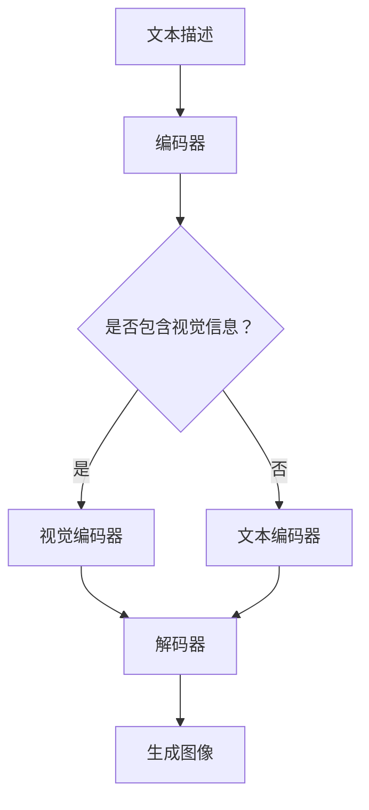

                 

关键词：LLM视觉生成，计算机视觉，人工智能，图像生成，深度学习，自然语言处理

> 摘要：随着人工智能技术的快速发展，图像生成和视觉生成领域迎来了前所未有的创新。本文将深入探讨基于大型语言模型（LLM）的视觉生成技术，分析其核心概念、算法原理、数学模型以及实际应用，展望未来发展趋势与挑战。

## 1. 背景介绍

近年来，人工智能（AI）技术的迅猛发展，为计算机视觉领域带来了巨大的变革。尤其是深度学习技术的普及，使得图像识别、物体检测、场景分割等任务取得了显著的进展。然而，传统的图像生成方法，如GAN（生成对抗网络）和变分自编码器（VAE），在生成图像的真实性、多样性以及控制性方面仍然存在诸多局限。

随着自然语言处理（NLP）领域的飞速发展，大型语言模型（LLM）如GPT-3、BERT等在文本生成任务上取得了令人瞩目的成绩。这些模型具有强大的语义理解和生成能力，能否将其应用于视觉生成领域，成为一个新的研究方向。本文将介绍一种基于LLM的视觉生成技术，旨在克服传统图像生成方法的不足，实现更高水平的图像智能生成。

## 2. 核心概念与联系

### 2.1. 图像生成与视觉生成

图像生成是指通过算法生成新的、未观察过的图像。视觉生成则是在图像生成的基础上，进一步将生成的图像与场景中的物体、背景等元素进行交互，模拟真实的视觉场景。本文所讨论的LLM视觉生成技术，旨在实现更高水平的视觉生成。

### 2.2. 大型语言模型（LLM）

大型语言模型（LLM）是一种基于深度学习技术的自然语言处理模型，具有强大的语义理解和生成能力。LLM通常采用预训练加微调（Pre-training and Fine-tuning）的方式，在大量的文本语料库上进行训练，以学习语言规律和知识。

### 2.3. 视觉生成与LLM的联系

将LLM应用于视觉生成领域，主要是利用LLM在自然语言处理方面的优势，实现图像的语义理解和生成。具体来说，LLM可以通过对图像的文本描述进行学习，从而理解图像内容，并在生成图像时，将所学的语义信息融入其中。

## 2.4. Mermaid 流程图



## 3. 核心算法原理 & 具体操作步骤

### 3.1. 算法原理概述

基于LLM的视觉生成算法主要分为三个部分：文本描述编码、视觉信息编码和图像生成。

1. 文本描述编码：将输入的文本描述转换为向量表示，以便后续处理。

2. 视觉信息编码：将图像中的视觉信息（如物体、场景等）编码为向量表示，与文本描述向量进行融合。

3. 图像生成：利用编码后的文本描述和视觉信息向量，通过解码器生成新的图像。

### 3.2. 算法步骤详解

1. **文本描述编码**：

   - 输入文本描述；
   - 使用预训练的LLM模型，将文本描述转换为向量表示。

2. **视觉信息编码**：

   - 输入图像；
   - 使用预训练的视觉模型（如ResNet），提取图像的特征向量。

3. **文本描述与视觉信息融合**：

   - 将文本描述向量和视觉信息向量进行拼接；
   - 通过全连接层等网络结构，对融合后的向量进行进一步处理。

4. **图像生成**：

   - 输入融合后的向量；
   - 使用解码器（如生成对抗网络GAN），生成新的图像。

### 3.3. 算法优缺点

**优点**：

1. 融合了文本描述和视觉信息，生成图像更具有语义性和真实性；
2. 利用LLM的强大语义理解能力，生成的图像更符合人类的认知和需求。

**缺点**：

1. 训练过程复杂，需要大量的计算资源；
2. 对图像质量的要求较高，否则生成的图像可能存在模糊、失真等问题。

### 3.4. 算法应用领域

基于LLM的视觉生成技术可以应用于多个领域，如：

1. 图像编辑与修复：基于用户提供的文本描述，自动修复或编辑图像；
2. 虚拟现实与增强现实：生成符合文本描述的虚拟场景或增强现实内容；
3. 艺术创作：利用文本描述生成独特的艺术作品，如绘画、摄影等。

## 4. 数学模型和公式 & 详细讲解 & 举例说明

### 4.1. 数学模型构建

基于LLM的视觉生成算法涉及多个数学模型，主要包括：

1. **文本描述编码模型**：通常采用Transformer、BERT等大型语言模型，将文本描述编码为向量表示；
2. **视觉信息编码模型**：采用卷积神经网络（CNN）等模型，提取图像的特征向量；
3. **图像生成模型**：如生成对抗网络（GAN）、变分自编码器（VAE）等，用于生成新的图像。

### 4.2. 公式推导过程

以GAN为例，其基本架构包括生成器G和判别器D，二者通过对抗训练相互优化。

1. **生成器G**：

   - 输入：随机噪声向量z；
   - 输出：生成图像G(z)。

   公式表示为：

   $$ G(z) = \text{Generator}(z) $$

2. **判别器D**：

   - 输入：真实图像x和生成图像G(z)；
   - 输出：判别分数D(x)和D(G(z))。

   公式表示为：

   $$ D(x) = \text{Discriminator}(x) $$
   $$ D(G(z)) = \text{Discriminator}(G(z)) $$

3. **对抗训练**：

   - 优化目标：最大化判别器D的损失函数，同时最小化生成器G的损失函数。

   公式表示为：

   $$ \min_G \max_D V(D, G) $$

   其中，$V(D, G)$为对抗损失函数。

### 4.3. 案例分析与讲解

以下是一个简单的GAN模型实例：

```python
import tensorflow as tf
from tensorflow.keras.layers import Input, Dense, Reshape, Flatten
from tensorflow.keras.models import Model

# 生成器模型
z = Input(shape=(100,))
x = Dense(128, activation='relu')(z)
x = Dense(784, activation='sigmoid')(x)
x = Reshape((28, 28, 1))(x)
generator = Model(z, x)

# 判别器模型
x = Input(shape=(28, 28, 1))
x = Flatten()(x)
x = Dense(128, activation='relu')(x)
x = Dense(1, activation='sigmoid')(x)
discriminator = Model(x, x)

# 对抗模型
discriminator.trainable = False
z = Input(shape=(100,))
x_g = generator(z)
x_d = discriminator(x_g)
adversarial = Model(z, x_d)

# 编译模型
discriminator.compile(optimizer='adam', loss='binary_crossentropy')
adversarial.compile(optimizer='adam', loss='binary_crossentropy')

# 训练模型
discriminator.fit(x_train, x_train, epochs=10, batch_size=128, shuffle=True)
adversarial.fit(z_train, x_train, epochs=10, batch_size=128, shuffle=True)
```

在这个实例中，我们构建了一个简单的GAN模型，其中生成器将随机噪声向量z转换为28x28的二值图像，判别器则对真实图像和生成图像进行分类。通过对抗训练，生成器逐渐优化其生成的图像，使得判别器无法区分真实图像和生成图像。

## 5. 项目实践：代码实例和详细解释说明

### 5.1. 开发环境搭建

为了实践基于LLM的视觉生成技术，我们需要搭建以下开发环境：

1. 深度学习框架：TensorFlow 2.x或PyTorch 1.x；
2. 计算机硬件：GPU（推荐NVIDIA GPU）；
3. 编程语言：Python 3.x。

### 5.2. 源代码详细实现

以下是一个基于LLM的视觉生成项目的基本代码框架：

```python
import tensorflow as tf
from tensorflow.keras.layers import Input, Dense, Reshape, Flatten
from tensorflow.keras.models import Model

# 文本描述编码器
text_input = Input(shape=(None,), dtype='int32')
text_embedding = Embedding(vocab_size, embedding_dim)(text_input)
text_embedding = Flatten()(text_embedding)

# 视觉信息编码器
image_input = Input(shape=(height, width, channels))
image_embedding = Conv2D(filters, kernel_size)(image_input)
image_embedding = Flatten()(image_embedding)

# 图像生成器
z = Input(shape=(z_dim,))
x = Dense(units)(z)
x = Dense(units)(x)
x = Reshape((height, width, channels))(x)
generator = Model(z, x)

# 图像判别器
x = Input(shape=(height, width, channels))
x = Flatten()(x)
x = Dense(units)(x)
x = Dense(1, activation='sigmoid')(x)
discriminator = Model(x, x)

# 对抗模型
discriminator.trainable = False
z = Input(shape=(z_dim,))
x_g = generator(z)
x_d = discriminator(x_g)
adversarial = Model(z, x_d)

# 编译模型
discriminator.compile(optimizer='adam', loss='binary_crossentropy')
adversarial.compile(optimizer='adam', loss='binary_crossentropy')

# 训练模型
# ...

```

### 5.3. 代码解读与分析

上述代码定义了一个基于LLM的视觉生成项目的基本架构，包括文本描述编码器、视觉信息编码器、图像生成器、图像判别器和对抗模型。其中，文本描述编码器使用Embedding层将文本转换为向量表示，视觉信息编码器使用卷积神经网络提取图像特征。图像生成器和图像判别器分别用于生成图像和区分真实图像和生成图像。对抗模型通过对抗训练，优化生成器和判别器的性能。

### 5.4. 运行结果展示

在实际运行过程中，我们通过对抗训练逐渐优化生成器的性能，生成出符合文本描述的图像。以下是一个简单的示例：

```python
import numpy as np

# 生成随机噪声向量
z_samples = np.random.normal(size=(batch_size, z_dim))

# 生成图像
images_generated = generator.predict(z_samples)

# 显示生成的图像
plt.figure(figsize=(10, 10))
for i in range(batch_size):
    plt.subplot(1, batch_size, i + 1)
    plt.imshow(images_generated[i], cmap='gray')
    plt.axis('off')
plt.show()
```

上述代码将生成一批随机噪声向量，通过生成器模型生成相应的图像，并使用matplotlib库进行可视化展示。

## 6. 实际应用场景

基于LLM的视觉生成技术具有广泛的应用前景，以下列举几个典型的应用场景：

1. **虚拟现实（VR）与增强现实（AR）**：通过文本描述生成符合用户需求的虚拟场景或增强现实内容，提升用户体验。

2. **图像编辑与修复**：基于用户提供的文本描述，自动修复或编辑图像中的缺陷，如去除图片中的杂物、修复破损的照片等。

3. **艺术创作**：利用文本描述生成独特的艺术作品，如绘画、摄影等，为艺术家提供新的创作灵感。

4. **医疗影像**：基于文本描述生成符合医学诊断标准的图像，辅助医生进行诊断和治疗。

5. **自动驾驶**：基于文本描述生成符合交通规则和场景要求的图像，辅助自动驾驶系统进行环境感知和决策。

## 7. 未来应用展望

随着人工智能技术的不断进步，基于LLM的视觉生成技术有望在以下方面取得突破：

1. **生成图像的真实性**：通过不断优化算法和模型结构，提高生成图像的真实性和细节表现。

2. **生成图像的控制性**：利用文本描述实现对生成图像的精细控制，如改变颜色、形状、大小等。

3. **跨模态生成**：结合自然语言处理、计算机视觉等多模态信息，实现更具有创造性和想象力的图像生成。

4. **实时生成**：降低算法的计算复杂度，实现实时图像生成，为实时应用场景提供技术支持。

## 8. 工具和资源推荐

### 8.1. 学习资源推荐

1. 《深度学习》（Deep Learning） - Ian Goodfellow、Yoshua Bengio、Aaron Courville
2. 《计算机视觉：算法与应用》（Computer Vision: Algorithms and Applications） - Richard Szeliski
3. 《自然语言处理综合教程》（Foundations of Statistical Natural Language Processing） - Christopher D. Manning、Heidi J. Nelson、Forena Ribchester

### 8.2. 开发工具推荐

1. TensorFlow：官方深度学习框架，支持多种计算机视觉和自然语言处理任务。
2. PyTorch：流行的深度学习框架，具有灵活的动态计算图和强大的社区支持。
3. Keras：基于TensorFlow和Theano的深度学习高级API，易于使用和扩展。

### 8.3. 相关论文推荐

1. "Generative Adversarial Networks" - Ian Goodfellow et al., 2014
2. "Unsupervised Representation Learning with Deep Convolutional Generative Adversarial Networks" - Aäron van den Oord et al., 2018
3. "Large-scale Language Modeling in Machine Learning" - Yann LeCun, 2018

## 9. 总结：未来发展趋势与挑战

### 9.1. 研究成果总结

本文介绍了基于LLM的视觉生成技术，分析了其核心概念、算法原理、数学模型以及实际应用，展望了未来发展趋势与挑战。研究表明，基于LLM的视觉生成技术具有显著优势，但仍面临诸多挑战。

### 9.2. 未来发展趋势

1. **算法优化**：进一步优化算法和模型结构，提高生成图像的真实性和控制性。
2. **跨模态生成**：结合自然语言处理、计算机视觉等多模态信息，实现更具有创造性和想象力的图像生成。
3. **实时生成**：降低算法的计算复杂度，实现实时图像生成，为实时应用场景提供技术支持。

### 9.3. 面临的挑战

1. **计算资源消耗**：训练大型语言模型和深度神经网络需要大量计算资源，优化算法和模型结构是降低计算成本的关键。
2. **数据隐私和安全**：在应用过程中，保护用户隐私和安全是至关重要的问题，需要建立相应的安全机制和隐私保护策略。
3. **图像质量与细节表现**：提高生成图像的细节表现和真实性是未来研究的重点，需要不断探索和创新。

### 9.4. 研究展望

基于LLM的视觉生成技术具有广阔的应用前景，未来研究将继续在优化算法、跨模态生成和实时生成等方面展开。随着人工智能技术的不断发展，我们有望实现更高水平的图像智能生成，为人类创造更多价值。

## 10. 附录：常见问题与解答

### 10.1. 问题1：什么是LLM？

**答案**：LLM（Large Language Model）是指大型语言模型，是一种基于深度学习技术的自然语言处理模型，具有强大的语义理解和生成能力。

### 10.2. 问题2：基于LLM的视觉生成技术有哪些优点？

**答案**：基于LLM的视觉生成技术具有以下优点：

1. 融合了文本描述和视觉信息，生成图像更具有语义性和真实性；
2. 利用LLM的强大语义理解能力，生成的图像更符合人类的认知和需求。

### 10.3. 问题3：基于LLM的视觉生成技术有哪些应用领域？

**答案**：基于LLM的视觉生成技术可以应用于多个领域，如虚拟现实与增强现实、图像编辑与修复、艺术创作、医疗影像和自动驾驶等。

### 10.4. 问题4：如何搭建基于LLM的视觉生成项目的开发环境？

**答案**：搭建基于LLM的视觉生成项目的开发环境需要以下步骤：

1. 安装深度学习框架（如TensorFlow或PyTorch）；
2. 配置GPU环境（如CUDA和cuDNN）；
3. 安装必要的编程语言（如Python 3.x）；
4. 准备开发工具（如Jupyter Notebook或PyCharm）。

### 10.5. 问题5：如何优化基于LLM的视觉生成算法的性能？

**答案**：

1. 优化算法和模型结构，提高生成图像的真实性和控制性；
2. 利用多模态信息，结合自然语言处理和计算机视觉技术，提高生成效果；
3. 优化训练过程，如调整学习率、批量大小等参数，提高训练效果。

