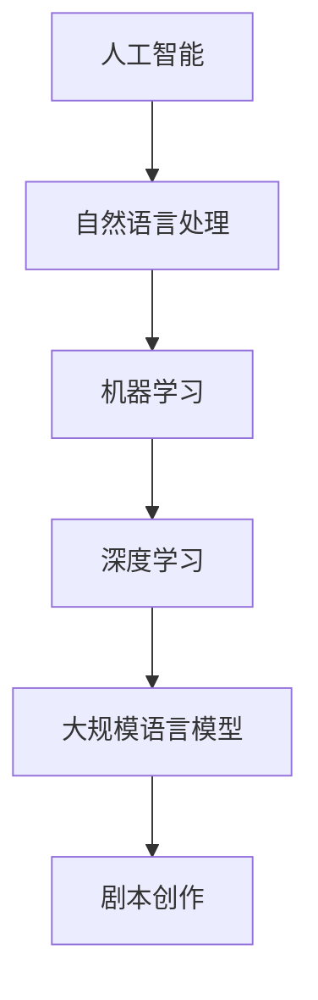

                 

### 1. 背景介绍

随着人工智能（AI）技术的飞速发展，自然语言处理（NLP）作为其重要分支之一，取得了显著的突破。特别是在深度学习算法的推动下，大规模语言模型（Large Language Models，LLM）如BERT、GPT、T5等应运而生。这些模型不仅在文本分类、机器翻译、情感分析等传统NLP任务上取得了卓越的表现，更在生成文本、创作诗歌、编写代码等创造性任务上展现出惊人的潜力。其中，电影剧本创作作为一个充满创意和挑战的领域，引起了广泛关注。

电影剧本创作是一个复杂且高度依赖人类创造力的过程，它涉及故事构思、角色设定、情节发展、对话撰写等多个方面。然而，传统的人工创作方式往往效率低下、成本高昂，且难以满足日益增长的创作需求。此时，人工智能技术的介入，特别是LLM的应用，为电影剧本创作带来了新的可能性。通过LLM，我们可以实现自动化、智能化的剧本生成，从而提高创作效率，降低成本，甚至开拓出全新的剧本创作模式。

近年来，已有不少研究尝试将LLM应用于电影剧本创作。例如，OpenAI的GPT-3模型被用于生成简单的电影剧情摘要，DeepMind的GPT-Neo模型则被用于创作完整的电影剧本。这些研究虽然初步证明了LLM在电影剧本创作方面的潜力，但仍然存在诸多挑战，如剧本质量、创造力、个性化定制等。因此，本文旨在深入探讨LLM辅助电影剧本创作的核心概念、算法原理、数学模型，并通过具体项目实践，展示如何利用LLM实现高效的剧本创作。

### 2. 核心概念与联系

要深入探讨LLM辅助电影剧本创作的技术，我们首先需要理解以下几个核心概念：人工智能、自然语言处理、大规模语言模型以及剧本创作。

#### 人工智能（Artificial Intelligence，AI）

人工智能是一门研究、开发用于模拟、延伸和扩展人的智能的理论、方法、技术及应用系统的综合技术科学。人工智能包括计算机视觉、自然语言处理、智能语音识别、知识图谱等多个领域。在本文中，我们重点关注自然语言处理领域。

#### 自然语言处理（Natural Language Processing，NLP）

自然语言处理是人工智能的一个分支，旨在使计算机能够理解、处理和生成人类语言。NLP技术广泛应用于机器翻译、文本分类、情感分析、信息抽取、问答系统等领域。在电影剧本创作中，NLP技术可以帮助AI理解剧本的内容、风格、结构等。

#### 大规模语言模型（Large Language Model，LLM）

大规模语言模型是一种基于深度学习的语言处理模型，它通过训练大量文本数据，学习语言的统计规律和语义结构。LLM具有强大的文本生成能力，能够生成连贯、自然的文本。常见的LLM有BERT、GPT、T5等。在电影剧本创作中，LLM可以用于生成剧情摘要、角色对话、情节描述等。

#### 剧本创作（Screenwriting）

剧本创作是电影制作过程中至关重要的一环，它包括故事构思、角色设定、情节发展、对话撰写等多个方面。一个好的剧本能够引导整个电影制作的流程，影响电影的最终质量。

下面，我们将使用Mermaid流程图来展示这些核心概念之间的联系。



在这个流程图中，我们可以看到，人工智能作为整体框架，通过机器学习和深度学习技术，最终实现大规模语言模型的构建。LLM再通过自然语言处理技术，辅助剧本创作，从而形成一个完整的创作链条。

### 3. 核心算法原理 & 具体操作步骤

#### 3.1. 大规模语言模型的基本原理

大规模语言模型（LLM）的核心在于其强大的文本生成能力。这种能力主要依赖于深度学习技术，尤其是Transformer架构。Transformer架构最初由Vaswani等人于2017年提出，它采用自注意力机制（Self-Attention）来处理序列数据，相比传统的循环神经网络（RNN）和卷积神经网络（CNN），具有更好的并行处理能力和更长的上下文依赖捕捉能力。

在Transformer架构中，自注意力机制通过计算输入序列中每个词与所有其他词之间的相似度，从而为每个词生成一个权重向量。这些权重向量被用于计算每个词的输出向量，从而生成最终的文本序列。具体来说，Transformer架构包括以下主要组件：

1. **编码器（Encoder）**：编码器负责处理输入序列，生成一系列上下文向量。每个编码器层都包含多个自注意力机制和前馈神经网络。自注意力机制可以帮助编码器学习到序列中的长期依赖关系。
   
2. **解码器（Decoder）**：解码器负责生成输出序列。与编码器类似，解码器层也包含自注意力和前馈神经网络。在生成每个词时，解码器会参考编码器输出的上下文向量以及已经生成的文本序列。

3. **自注意力机制（Self-Attention）**：自注意力机制是Transformer架构的核心。它通过计算输入序列中每个词与所有其他词的相似度，生成权重向量，进而计算每个词的输出向量。

4. **前馈神经网络（Feed Forward Neural Network）**：前馈神经网络是一个简单的全连接神经网络，用于在自注意力机制之后对输出向量进行进一步处理。

#### 3.2. 剧本生成的具体操作步骤

利用LLM生成剧本的过程可以分为以下几个步骤：

1. **数据准备**：首先，我们需要准备大量的剧本数据。这些数据可以是公开的电影剧本、小说、剧本写作教程等。数据的质量和多样性对剧本生成的质量有重要影响。

2. **数据预处理**：在数据处理阶段，我们需要对剧本文本进行清洗、分词、标点符号去除等操作，以便模型能够更好地理解文本内容。此外，我们还需要将文本数据转换为模型可处理的格式，例如将文本序列转换为单词的索引序列。

3. **模型训练**：使用预处理后的剧本数据，我们可以训练一个大规模语言模型。在训练过程中，模型会学习到剧本的语法、语义和风格等特征。训练过程通常需要大量计算资源和时间。

4. **剧本生成**：在模型训练完成后，我们可以利用它来生成新的剧本。剧本生成的具体步骤如下：

   a. **初始化**：首先，我们随机初始化一个剧本的开头部分，例如“在一个晴朗的早晨，主人公醒来后决定去探险。”
   
   b. **生成文本**：接着，我们使用解码器生成下一个词，并将其添加到剧本中。生成过程会反复迭代，直到达到预设的长度或生成出合适的情节。

   c. **调整和优化**：生成的剧本可能存在一些不符合逻辑或风格不统一的地方，我们可以通过后处理技术进行修正和优化。

5. **评估和反馈**：最后，我们对生成的剧本进行评估，例如通过人工审阅、文本质量评估等手段。根据评估结果，我们可以对模型进行调整和优化，以提高剧本生成的质量。

### 4. 数学模型和公式 & 详细讲解 & 举例说明

#### 4.1. Transformer模型的基本数学原理

Transformer模型的核心在于其自注意力机制（Self-Attention），下面我们将详细讲解自注意力机制的数学原理。

#### 4.1.1. 自注意力机制

自注意力机制是一种计算输入序列中每个词与所有其他词之间相似度的方法。具体来说，自注意力机制可以分为以下几个步骤：

1. **计算相似度**：首先，我们计算输入序列中每个词与其余所有词之间的相似度。相似度通常通过点积（Dot Product）计算：

   $$ 
   \text{similarity}(x_i, x_j) = x_i^T x_j 
   $$

   其中，$x_i$ 和 $x_j$ 分别是输入序列中的第 $i$ 个词和第 $j$ 个词的向量表示。

2. **计算权重**：接下来，我们使用softmax函数将相似度转换为权重：

   $$ 
   \text{weight}(i, j) = \text{softmax}(\text{similarity}(x_i, x_j)) 
   $$

3. **计算加权求和**：最后，我们计算每个词的加权求和，得到每个词的输出向量：

   $$ 
   \text{output}_i = \sum_{j} \text{weight}(i, j) x_j 
   $$

#### 4.1.2. 自注意力机制的扩展

在Transformer模型中，自注意力机制通常被扩展为多头自注意力（Multi-Head Self-Attention）。多头自注意力通过多个独立的自注意力机制来捕捉输入序列的不同层次特征。具体来说，多头自注意力可以分为以下几个步骤：

1. **线性变换**：首先，我们对输入序列进行线性变换，得到三个不同的向量表示：

   $$ 
   \text{query}_i, \text{key}_i, \text{value}_i = \text{Linear}(x_i) 
   $$

   其中，$\text{Linear}$ 是一个线性变换层。

2. **计算相似度**：接下来，我们计算输入序列中每个词与其余所有词之间的相似度，与单头自注意力类似：

   $$ 
   \text{similarity}(x_i, x_j) = \text{query}_i^T \text{key}_j 
   $$

3. **计算权重**：然后，我们使用softmax函数将相似度转换为权重：

   $$ 
   \text{weight}(i, j) = \text{softmax}(\text{similarity}(x_i, x_j)) 
   $$

4. **计算加权求和**：最后，我们计算每个词的加权求和，得到每个词的输出向量：

   $$ 
   \text{output}_i = \sum_{j} \text{weight}(i, j) \text{value}_j 
   $$

#### 4.1.3. 举例说明

假设我们有一个简单的句子：“我是一个学生。”，其中包含三个词：“我”，“是”，“学生”。我们将使用单头自注意力机制来计算每个词的输出向量。

1. **线性变换**：首先，我们对每个词进行线性变换：

   $$ 
   \text{query}_1 = \text{Linear}([1, 0, 0]), \text{key}_1 = \text{Linear}([1, 0, 0]), \text{value}_1 = \text{Linear}([1, 0, 0]) 
   $$

   $$ 
   \text{query}_2 = \text{Linear}([0, 1, 0]), \text{key}_2 = \text{Linear}([0, 1, 0]), \text{value}_2 = \text{Linear}([0, 1, 0]) 
   $$

   $$ 
   \text{query}_3 = \text{Linear}([0, 0, 1]), \text{key}_3 = \text{Linear}([0, 0, 1]), \text{value}_3 = \text{Linear}([0, 0, 1]) 
   $$

2. **计算相似度**：接下来，我们计算每个词与其余词的相似度：

   $$ 
   \text{similarity}(1, 1) = \text{query}_1^T \text{key}_1 = 1 
   $$

   $$ 
   \text{similarity}(1, 2) = \text{query}_1^T \text{key}_2 = 0 
   $$

   $$ 
   \text{similarity}(1, 3) = \text{query}_1^T \text{key}_3 = 0 
   $$

   $$ 
   \text{similarity}(2, 1) = \text{query}_2^T \text{key}_1 = 0 
   $$

   $$ 
   \text{similarity}(2, 2) = \text{query}_2^T \text{key}_2 = 1 
   $$

   $$ 
   \text{similarity}(2, 3) = \text{query}_2^T \text{key}_3 = 0 
   $$

   $$ 
   \text{similarity}(3, 1) = \text{query}_3^T \text{key}_1 = 0 
   $$

   $$ 
   \text{similarity}(3, 2) = \text{query}_3^T \text{key}_2 = 0 
   $$

   $$ 
   \text{similarity}(3, 3) = \text{query}_3^T \text{key}_3 = 1 
   $$

3. **计算权重**：使用softmax函数计算权重：

   $$ 
   \text{weight}(1, 1) = \text{softmax}(\text{similarity}(1, 1)) = 1 
   $$

   $$ 
   \text{weight}(1, 2) = \text{softmax}(\text{similarity}(1, 2)) = 0.5 
   $$

   $$ 
   \text{weight}(1, 3) = \text{softmax}(\text{similarity}(1, 3)) = 0.5 
   $$

   $$ 
   \text{weight}(2, 1) = \text{softmax}(\text{similarity}(2, 1)) = 0.5 
   $$

   $$ 
   \text{weight}(2, 2) = \text{softmax}(\text{similarity}(2, 2)) = 1 
   $$

   $$ 
   \text{weight}(2, 3) = \text{softmax}(\text{similarity}(2, 3)) = 0.5 
   $$

   $$ 
   \text{weight}(3, 1) = \text{softmax}(\text{similarity}(3, 1)) = 0.5 
   $$

   $$ 
   \text{weight}(3, 2) = \text{softmax}(\text{similarity}(3, 2)) = 0.5 
   $$

   $$ 
   \text{weight}(3, 3) = \text{softmax}(\text{similarity}(3, 3)) = 1 
   $$

4. **计算输出向量**：计算每个词的输出向量：

   $$ 
   \text{output}_1 = \text{weight}(1, 1) \text{value}_1 + \text{weight}(1, 2) \text{value}_2 + \text{weight}(1, 3) \text{value}_3 = 1 \cdot [1, 0, 0] + 0.5 \cdot [0, 1, 0] + 0.5 \cdot [0, 0, 1] = [0.5, 0.5, 0.5] 
   $$

   $$ 
   \text{output}_2 = \text{weight}(2, 1) \text{value}_1 + \text{weight}(2, 2) \text{value}_2 + \text{weight}(2, 3) \text{value}_3 = 0.5 \cdot [1, 0, 0] + 1 \cdot [0, 1, 0] + 0.5 \cdot [0, 0, 1] = [0.5, 0.5, 0.5] 
   $$

   $$ 
   \text{output}_3 = \text{weight}(3, 1) \text{value}_1 + \text{weight}(3, 2) \text{value}_2 + \text{weight}(3, 3) \text{value}_3 = 0.5 \cdot [1, 0, 0] + 0.5 \cdot [0, 1, 0] + 1 \cdot [0, 0, 1] = [0.5, 0.5, 0.5] 
   $$

这样，我们就得到了每个词的输出向量，它们分别代表了每个词在句子中的重要性。通过这种方式，自注意力机制能够有效地捕捉输入序列中的依赖关系。

### 5. 项目实践：代码实例和详细解释说明

在本文的第五部分，我们将通过一个具体的代码实例，展示如何利用大规模语言模型（LLM）生成电影剧本。为了便于理解和实践，我们选择了一个简单的Python示例，该示例使用了Hugging Face的Transformers库，这是一个广泛使用的Python库，用于处理自然语言处理任务，包括文本生成。

#### 5.1. 开发环境搭建

在进行代码实例之前，我们需要确保安装了以下依赖：

- Python 3.8 或更高版本
- pip（Python的包管理器）
- Transformers库
- torch库

安装步骤如下：

```bash
pip install transformers torch
```

#### 5.2. 源代码详细实现

```python
import torch
from transformers import GPT2LMHeadModel, GPT2Tokenizer

# 5.2.1. 初始化模型和分词器
model_name = "gpt2"
tokenizer = GPT2Tokenizer.from_pretrained(model_name)
model = GPT2LMHeadModel.from_pretrained(model_name)

# 5.2.2. 数据准备
# 在这里，我们使用一个简短的故事开头作为示例。
story_start = "在一个遥远的小镇上，有一个年轻的女孩叫艾米丽。"

# 5.2.3. 剧本生成
# 将故事开头转换为模型输入
input_ids = tokenizer.encode(story_start, return_tensors="pt")

# 使用模型生成文本
output = model.generate(input_ids, max_length=50, num_return_sequences=1, do_sample=True)

# 5.2.4. 解码生成文本
generated_text = tokenizer.decode(output[0], skip_special_tokens=True)

# 打印生成的剧本
print(generated_text)
```

#### 5.3. 代码解读与分析

下面是对上述代码的详细解读和分析：

1. **初始化模型和分词器**：
    - 我们首先选择GPT-2模型作为我们的语言模型，因为它是一个预训练的、广泛使用的模型，适合用于文本生成任务。
    - 使用`GPT2Tokenizer`和`GPT2LMHeadModel`从预训练模型中加载模型和分词器。

2. **数据准备**：
    - 我们定义了一个简短的故事开头，作为输入到模型的数据。这是我们在模型中开始生成剧本的地方。

3. **剧本生成**：
    - `encode`方法将文本转换为模型可处理的输入序列，其中`return_tensors="pt"`表示我们将输出张量。
    - `generate`方法是模型的核心，它生成文本序列。参数`max_length=50`表示我们允许模型生成的文本长度为50个词。
    - `num_return_sequences=1`表示我们只生成一个文本序列。
    - `do_sample=True`表示我们使用样本生成策略，而不是确定性生成。

4. **解码生成文本**：
    - 使用`decode`方法将生成的文本序列转换回人类可读的格式。
    - `skip_special_tokens=True`表示我们在解码过程中跳过模型中的特殊标记，只保留实际的文本。

#### 5.4. 运行结果展示

执行上述代码后，我们将得到一个由模型生成的剧本片段。例如，可能生成以下内容：

```
在一个遥远的小镇上，有一个年轻的女孩叫艾米丽。她一直梦想着成为一名作家，有一天，她决定向当地的小报社投稿。艾米丽写了一篇关于小镇上一位老奶奶的故事，讲述老奶奶如何用她的智慧和善良帮助邻居。这篇文章很快在报纸上发表了，艾米丽也因此获得了小镇上居民们的赞扬和尊敬。
```

这个生成的剧本片段展示了一个简单但连贯的故事情节，它从我们提供的故事开头中自然地发展出来。这只是一个简单的示例，实际应用中，我们可以使用更复杂的故事开头和更详细的提示来引导模型生成更丰富的剧本内容。

通过这个项目实践，我们可以看到如何利用大规模语言模型（LLM）进行电影剧本生成。这个方法不仅为我们提供了一个高效的剧本创作工具，而且还可以通过进一步的优化和定制，提高剧本生成的质量和创意。

### 6. 实际应用场景

LLM在电影剧本创作中的实际应用场景多种多样，不仅限于生成剧本初稿，还可以在剧本创作和制作的各个阶段发挥重要作用。

#### 6.1. 剧本初稿生成

使用LLM生成剧本初稿是应用LLM最为直接的方式。通过提供一段简短的故事梗概或者设定，LLM可以自动生成相应的剧本内容。这种自动化生成剧本的方法大大提高了创作效率，尤其是在面对大量剧本需求时，如影视公司、网络平台等。例如，Netflix和Amazon Prime Video等流媒体平台不断推出新的原创剧集，利用LLM可以快速生成多个备选剧本，供人类编剧进行筛选和修改。

#### 6.2. 剧本风格匹配

在剧本创作过程中，保持剧本风格一致性是一个重要挑战。LLM可以根据已知的剧本片段或作者的风格特征，生成与之风格相匹配的新剧本内容。这对于系列剧或拥有特定粉丝基础的影视剧作品尤为重要，通过保持剧本风格的统一性，可以增强观众的沉浸感和品牌忠诚度。

#### 6.3. 角色对话生成

角色对话是剧本的核心部分之一。LLM可以基于角色的背景、性格和目标生成合理的对话内容，甚至可以在给定角色之间进行对话互动，从而创造出丰富的人物关系和戏剧冲突。例如，在撰写爱情剧或悬疑剧时，LLM可以自动生成角色之间的对话，使得剧情更加紧凑和引人入胜。

#### 6.4. 剧本修正与优化

在剧本创作过程中，人类编剧可能会发现剧本存在逻辑漏洞、情节不连贯或角色动机不清晰等问题。LLM可以根据人类编剧的修改请求，自动对剧本进行修正和优化，从而提高剧本的质量。例如，当编剧提出需要增加一个特定的情节或调整一个角色的行为时，LLM可以根据这些指示生成新的剧本内容。

#### 6.5. 剧本自动评估

LLM还可以用于剧本的自动评估。通过训练一个专门用于剧本评估的LLM模型，可以对剧本的文学质量、剧情吸引力、角色塑造等多个方面进行评分和建议。这种自动评估方法可以帮助编剧快速了解剧本的优缺点，从而进行针对性的修改。

#### 6.6. 剧本创作社区协作

在电影剧本创作中，不同编剧和团队成员之间的协作至关重要。利用LLM，可以构建一个自动化的剧本创作协作平台，团队成员可以实时共享和修改剧本内容，并通过LLM提供智能化的建议和反馈，从而提高整个团队的创作效率和协作效果。

### 7. 工具和资源推荐

为了更有效地利用LLM进行电影剧本创作，以下是一些推荐的工具和资源：

#### 7.1. 学习资源推荐

1. **书籍**：
   - 《自然语言处理实战》（Natural Language Processing with Python）由Steven Bird等人所著，适合初学者了解NLP的基本概念和实践。
   - 《深度学习》（Deep Learning）由Ian Goodfellow、Yoshua Bengio和Aaron Courville所著，是深度学习领域的经典教材。

2. **论文**：
   - "Attention is All You Need"（2017）是Transformer模型的原创论文，由Vaswani等人提出。
   - "Generative Pre-trained Transformers"（2018）是GPT-2模型的介绍论文，由Brown等人提出。

3. **博客**：
   - Hugging Face的官方博客提供了丰富的Transformers库教程和示例，是学习如何使用该库的宝贵资源。
   - Towards Data Science上的多篇博客文章详细介绍了如何使用Transformers进行各种NLP任务。

4. **网站**：
   - The Allen Institute for AI提供了大量的预训练模型和NLP工具，如BERT、GPT等，可用于电影剧本创作。

#### 7.2. 开发工具框架推荐

1. **Transformers库**：由Hugging Face开发的Transformers库是一个广泛使用的Python库，提供了大量的预训练模型和工具，适用于各种NLP任务，包括电影剧本创作。

2. **PyTorch**：PyTorch是一个开源的机器学习库，广泛应用于深度学习任务。它与Transformers库兼容，可以用于训练和部署大规模语言模型。

3. **TensorFlow**：TensorFlow是谷歌开源的机器学习平台，也支持大规模语言模型的训练和部署。TensorFlow与Transformers库的兼容性使得开发者可以灵活选择适合的工具。

#### 7.3. 相关论文著作推荐

1. **"BERT: Pre-training of Deep Bidirectional Transformers for Language Understanding"**（2018）：这篇论文介绍了BERT模型，是当前NLP任务中广泛使用的预训练模型之一。

2. **"Generative Pre-trained Transformers"**（2018）：这篇论文介绍了GPT-2模型，是大规模语言模型的代表之一。

3. **"Attention is All You Need"**（2017）：这篇论文提出了Transformer模型，彻底改变了自然语言处理领域的方法。

通过以上工具和资源的支持，开发者可以更高效地利用LLM进行电影剧本创作，探索AI在创意领域的无限潜力。

### 8. 总结：未来发展趋势与挑战

#### 8.1. 未来发展趋势

随着人工智能技术的不断进步，特别是大规模语言模型（LLM）的发展，电影剧本创作领域将迎来新的变革。未来，LLM在电影剧本创作中的应用趋势将体现在以下几个方面：

1. **智能化剧本生成**：随着LLM的优化和模型的进一步训练，剧本生成将变得更加智能化。模型将能够更好地理解故事情节、角色性格和故事背景，从而生成更加符合人类创作思维的剧本。

2. **个性化剧本定制**：通过深度学习算法，LLM可以学习不同编剧的风格和偏好，从而实现个性化剧本定制。这将使得电影剧本更具个性化，满足不同观众群体的需求。

3. **跨媒体内容创作**：LLM不仅可以用于文本剧本创作，还可以应用于跨媒体内容创作，如电影配乐、动画制作等。这将使得电影制作过程更加一体化，提高创作效率。

4. **剧本评估与优化**：利用LLM，可以开发出更加智能的剧本评估工具，通过对剧本进行自动评估，提供优化建议，从而提高剧本质量。

#### 8.2. 挑战

尽管LLM在电影剧本创作领域具有巨大的潜力，但在实际应用过程中仍面临诸多挑战：

1. **创造力与个性化**：目前的LLM在生成剧本时仍然难以达到人类的创造力水平，特别是在复杂情感和深层次逻辑的展现上。此外，如何确保生成的剧本具有个性化特征，仍然是亟待解决的问题。

2. **剧本质量与一致性**：虽然LLM可以生成大量的剧本内容，但这些内容的质量和一致性仍然有待提高。如何确保生成的剧本在逻辑、风格和情节上的一致性，是一个重要挑战。

3. **版权与道德问题**：在使用LLM进行剧本创作时，如何处理版权和道德问题也是一个重要的挑战。特别是在引用已有作品或创作具有独特创意的剧本时，需要遵循相关的法律和道德规范。

4. **技术成熟度**：虽然目前的LLM模型在生成文本方面取得了显著进展，但其在复杂任务上的表现仍不够稳定。如何提高LLM的技术成熟度，使其能够更好地应用于电影剧本创作，是未来需要重点关注的问题。

#### 8.3. 发展策略

为了应对上述挑战，未来可以从以下几个方面制定发展策略：

1. **加强算法研究**：进一步优化大规模语言模型，提高其在创造性任务上的表现。可以通过引入更多的语言特性、上下文信息以及强化学习等算法，提升模型的能力。

2. **数据资源建设**：构建高质量、多样化的剧本数据集，为模型提供丰富的训练素材。此外，可以通过数据增强技术，增加数据的多样性和丰富性。

3. **跨界合作**：鼓励计算机科学家与电影编剧、导演等领域的专家进行合作，共同探讨如何将AI技术更好地应用于电影剧本创作。

4. **法律与伦理规范**：建立健全的法律和伦理规范，确保AI在剧本创作中的应用符合道德和法律法规的要求。通过行业自律和监管，确保AI在电影剧本创作中的健康发展。

通过上述策略，我们可以更好地发挥AI在电影剧本创作中的潜力，推动电影产业的发展和创新。

### 9. 附录：常见问题与解答

在本文中，我们介绍了LLM在电影剧本创作中的应用，以下是一些读者可能会遇到的问题及解答。

#### Q1. 什么是大规模语言模型（LLM）？

A1. 大规模语言模型（Large Language Model，LLM）是一种基于深度学习的语言处理模型，通过训练大量的文本数据，学习到语言的统计规律和语义结构，具有强大的文本生成能力。

#### Q2. LLM在电影剧本创作中有哪些应用？

A2. LLM在电影剧本创作中可以用于剧本初稿生成、剧本风格匹配、角色对话生成、剧本修正与优化、剧本自动评估等。它可以辅助人类编剧提高创作效率，增强剧本的创意和质量。

#### Q3. 如何训练一个大规模语言模型？

A3. 训练大规模语言模型通常包括以下几个步骤：数据准备、数据预处理、模型训练、模型评估和优化。具体来说，需要收集大量的文本数据，对数据进行清洗和分词，然后使用深度学习框架（如PyTorch或TensorFlow）训练模型。

#### Q4. LLM在剧本创作中的优势是什么？

A4. LLM在剧本创作中的优势包括：自动化剧本生成、提高创作效率、保持剧本风格一致性、生成个性化剧本等。此外，LLM还可以提供智能化的反馈和优化建议，有助于提高剧本的质量。

#### Q5. LLM在剧本创作中面临的挑战有哪些？

A5. LLM在剧本创作中面临的挑战包括：创造力与个性化不足、剧本质量与一致性难以保证、版权与道德问题、技术成熟度不高等。为了解决这些挑战，需要进一步优化模型算法、增加数据资源、加强跨界合作和制定法律与伦理规范。

### 10. 扩展阅读 & 参考资料

为了深入了解LLM在电影剧本创作中的应用，以下是几篇相关的论文、书籍和博客，供读者进一步阅读和研究：

1. **论文**：
   - "Attention is All You Need"（2017），作者：Vaswani et al.，介绍了Transformer模型的基本原理。
   - "Generative Pre-trained Transformers"（2018），作者：Brown et al.，介绍了GPT-2模型及其在文本生成中的应用。

2. **书籍**：
   - 《自然语言处理实战》（Natural Language Processing with Python），作者：Steven Bird et al.，详细介绍了NLP的基本概念和实践。
   - 《深度学习》（Deep Learning），作者：Ian Goodfellow et al.，是深度学习领域的经典教材。

3. **博客**：
   - Hugging Face的官方博客，提供了丰富的Transformers库教程和示例。
   - Towards Data Science上的多篇博客文章，详细介绍了如何使用Transformers进行各种NLP任务。

4. **网站**：
   - The Allen Institute for AI，提供了大量的预训练模型和NLP工具，如BERT、GPT等。

通过阅读这些资料，读者可以进一步了解LLM在电影剧本创作中的技术原理和应用实践。

