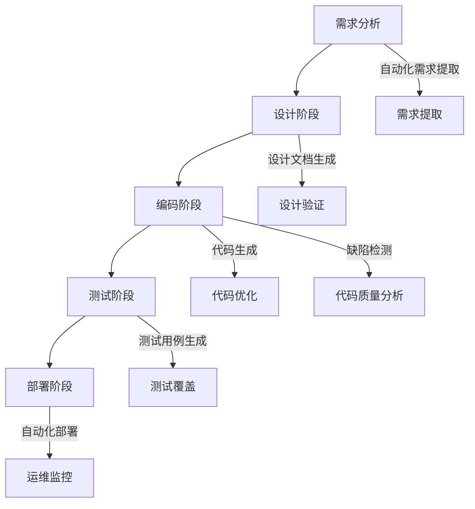
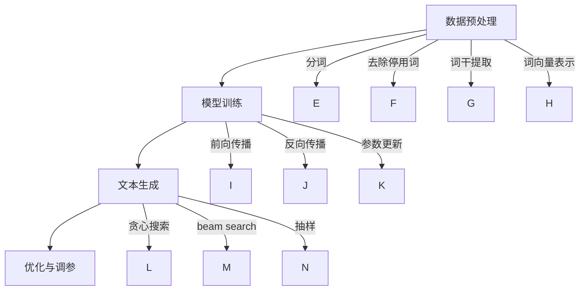

                 

### 背景介绍

**LLM重塑软件工程：从设计到部署的变革**

在当今数字化转型的浪潮中，软件工程成为了推动企业创新和竞争力提升的核心驱动力。然而，传统的软件工程方法在应对复杂性和高动态性的需求时，往往显得力不从心。此时，大型语言模型（LLM）的出现为软件工程带来了前所未有的变革机会。

LLM，作为一种基于深度学习的自然语言处理技术，近年来取得了飞速发展。从最初的浅层模型到如今可以处理海量数据并生成高质量文本的复杂模型，LLM在文本生成、语言理解、代码生成等多个领域展现出了强大的能力。这使得LLM有望在软件工程的各个环节中发挥重要作用，从而重塑整个软件开发生命周期。

本文旨在探讨LLM在软件工程中的应用，从设计到部署的每一个环节，分析LLM如何通过自动化、智能化的手段提升软件开发效率和质量。文章将首先介绍LLM的基本原理和核心概念，然后深入探讨其在软件设计、代码生成、测试、部署等环节的具体应用，最后总结LLM对软件工程未来发展的潜在影响和面临的挑战。

**本文结构如下：**

1. 背景介绍
2. 核心概念与联系
3. 核心算法原理 & 具体操作步骤
4. 数学模型和公式 & 详细讲解 & 举例说明
5. 项目实践：代码实例和详细解释说明
6. 实际应用场景
7. 工具和资源推荐
8. 总结：未来发展趋势与挑战
9. 附录：常见问题与解答
10. 扩展阅读 & 参考资料

通过这篇文章，我们将一起探索LLM如何改变软件工程的未来，引领我们进入一个更加智能和高效的软件开发新时代。

### 核心概念与联系

#### 语言模型与软件工程

要理解LLM如何重塑软件工程，我们首先需要了解语言模型的基本概念和原理。语言模型是一种能够预测文本序列概率的模型，它是基于对大量语言数据的统计分析和深度学习技术训练而来的。语言模型的核心目标是通过分析输入的文本片段，预测下一个可能的单词或短语，从而生成连贯的文本。

在软件工程中，语言模型的应用范围非常广泛，它能够影响从设计、编码到测试、部署等各个环节。例如，在需求分析阶段，语言模型可以帮助自动化提取和理解客户需求，通过自然语言处理技术将口头或书面需求转化为具体的软件功能需求；在编码阶段，语言模型可以自动生成代码片段，甚至在某些情况下生成完整的函数或类；在测试阶段，语言模型可以用于生成测试用例，检测代码的潜在缺陷；在部署阶段，语言模型可以帮助自动化配置和管理软件环境。

#### 深度学习与神经网络

深度学习是语言模型技术的核心支撑，它是一种基于人工神经网络的机器学习技术。深度学习通过多层神经网络对数据进行层次化建模，提取数据的复杂特征和模式。在语言模型中，深度学习技术被用于构建大规模的神经网络模型，如Transformer模型、BERT模型等，这些模型具有强大的文本处理能力。

神经网络是一种模拟人脑神经元连接结构的计算模型，通过前向传播和反向传播算法训练模型参数。在语言模型中，神经网络用于捕捉文本中的语义信息和上下文关系，使得模型能够生成符合语境的文本。深度学习与软件工程的结合，使得软件工程师可以更加高效地处理复杂的数据和任务，提升开发效率。

#### 软件工程生命周期与LLM应用

软件工程生命周期包括需求分析、设计、编码、测试、部署和维护等阶段。LLM在每个阶段都有其独特的应用和价值。

1. **需求分析阶段**：
   - **自动化需求提取**：LLM可以分析非结构化的文本数据，如用户需求文档、会议纪要等，自动提取出关键需求信息，形成结构化的需求文档。
   - **语义理解**：通过自然语言处理技术，LLM能够理解用户的需求描述，进行语义分析和归类，从而更好地把握用户需求。

2. **设计阶段**：
   - **设计文档生成**：LLM可以根据需求文档自动生成设计文档，包括架构设计、数据库设计、接口设计等，减少人工设计的工作量。
   - **设计验证**：通过对比不同设计方案的文本描述，LLM可以评估设计的合理性和可行性，提供优化建议。

3. **编码阶段**：
   - **代码生成**：LLM可以直接生成代码，从简单的函数到复杂的系统组件，极大地提高了编码效率。
   - **代码优化**：通过分析代码的语义和上下文，LLM可以提出代码优化的建议，如提高性能、减少冗余等。

4. **测试阶段**：
   - **测试用例生成**：LLM可以基于代码和需求文档自动生成测试用例，提高测试的全面性和覆盖度。
   - **缺陷检测**：LLM可以分析代码中的潜在缺陷，提供定位和修复建议。

5. **部署阶段**：
   - **自动化部署**：LLM可以自动化配置和管理软件部署环境，确保部署过程的一致性和稳定性。
   - **运维监控**：通过持续监控系统日志和用户反馈，LLM可以提供运维支持和故障诊断。

#### Mermaid 流程图

为了更直观地展示LLM在软件工程生命周期中的应用，我们可以使用Mermaid绘制一个流程图。以下是一个简化的示例：



在这个流程图中，LLM的应用贯穿于软件工程周期的各个阶段，通过自动化和智能化的手段，提升了开发效率和质量。

通过上述对核心概念和联系的分析，我们可以看到LLM在软件工程中的巨大潜力。在接下来的章节中，我们将深入探讨LLM的具体算法原理、操作步骤和数学模型，进一步揭示其如何改变软件开发的未来。

#### 核心算法原理 & 具体操作步骤

要理解LLM如何在实际软件工程中发挥作用，我们首先需要深入探讨其核心算法原理。LLM的核心算法主要包括自然语言处理（NLP）和深度学习，特别是基于Transformer架构的模型。以下是LLM的核心算法原理和具体操作步骤的详细说明。

##### 自然语言处理（NLP）

自然语言处理是使计算机能够理解、处理和生成人类语言的技术。在LLM中，NLP是关键组成部分，它使得模型能够有效地处理和理解文本数据。NLP的主要任务包括分词、词性标注、命名实体识别、句法分析和语义分析等。

1. **分词**：
   分词是将连续的文本序列分割成一系列具有独立意义的词汇。例如，将“我爱北京天安门”分割成“我”、“爱”、“北京”、“天安门”。在LLM中，常用的分词方法包括基于词典的分词和基于统计的分词。

2. **词性标注**：
   词性标注是给文本中的每个词分配一个词性标签，如名词、动词、形容词等。这有助于模型理解文本的语法结构。例如，“北京”是地名（NNP），“建设”是动词（VB）。

3. **命名实体识别**：
   命名实体识别（NER）是识别文本中的特定实体，如人名、地名、组织名等。这对于理解文本内容和上下文至关重要。

4. **句法分析**：
   句法分析是解析文本的句法结构，包括句子的构成成分及其关系。这有助于模型理解文本的语义和逻辑关系。

5. **语义分析**：
   语义分析是理解文本的深层含义，包括语义角色标注、情感分析和实体关系分析等。这有助于模型生成符合语境的文本。

##### 深度学习

深度学习是LLM技术的核心支撑，它通过多层神经网络对数据进行层次化建模，提取数据的复杂特征和模式。在LLM中，常用的深度学习模型包括卷积神经网络（CNN）、递归神经网络（RNN）和Transformer模型。

1. **卷积神经网络（CNN）**：
   CNN主要用于图像处理，但也可以用于文本处理。通过卷积操作，CNN可以提取文本中的局部特征，如单词的分布模式。

2. **递归神经网络（RNN）**：
   RNN是一种能够处理序列数据的神经网络，它在每个时间步对序列进行建模。RNN包括长短时记忆网络（LSTM）和门控循环单元（GRU），这些模型能够有效地捕捉序列中的长期依赖关系。

3. **Transformer模型**：
   Transformer模型是由Vaswani等人在2017年提出的一种基于自注意力机制的深度学习模型，它在机器翻译、文本生成等任务上取得了突破性成果。Transformer模型的核心思想是自注意力机制，它通过计算输入文本序列中每个词与所有其他词的关联性，生成新的文本表示。

##### 具体操作步骤

1. **数据预处理**：
   在训练LLM之前，需要对文本数据进行预处理。预处理步骤包括分词、去除停用词、词干提取、词向量表示等。这些步骤有助于提高模型对文本数据的理解和生成能力。

2. **模型训练**：
   基于预处理后的数据，使用深度学习框架（如TensorFlow、PyTorch）训练LLM模型。训练过程包括前向传播、反向传播和参数更新。在训练过程中，模型会学习到文本数据中的复杂模式和语义关系。

3. **文本生成**：
   在训练好的LLM模型基础上，可以通过输入一个文本片段，模型预测下一个可能的词或短语，逐步生成完整的文本。生成过程通常采用 greedy search、beam search 或 sampling 策略。

4. **优化与调参**：
   为了提高文本生成的质量和效率，需要对模型进行优化和调参。这包括调整学习率、批量大小、正则化参数等，以获得最佳的模型性能。

##### Mermaid流程图

为了更直观地展示LLM的核心算法原理和操作步骤，我们可以使用Mermaid绘制一个流程图。以下是一个简化的示例：



在这个流程图中，我们展示了LLM从数据预处理、模型训练到文本生成和优化调参的各个环节。通过这些步骤，LLM能够高效地生成高质量的自然语言文本，从而在软件工程中发挥重要作用。

通过上述对核心算法原理和具体操作步骤的深入分析，我们可以看到LLM在软件工程中的应用潜力。在接下来的章节中，我们将探讨LLM的数学模型和公式，进一步揭示其如何实现复杂的文本生成任务。

#### 数学模型和公式 & 详细讲解 & 举例说明

要深入理解LLM的工作原理，我们需要探索其背后的数学模型和公式。LLM通常是基于深度学习技术，特别是基于自注意力机制的Transformer模型。以下是LLM中关键数学模型和公式的详细讲解，并辅以具体实例来说明其应用。

##### Transformer模型

Transformer模型是由Vaswani等人在2017年提出的一种基于自注意力机制的深度学习模型，它广泛应用于机器翻译、文本生成等任务。Transformer模型的核心组件包括自注意力机制（Self-Attention）和多层前馈网络（Multi-head Self-Attention）。

1. **自注意力机制（Self-Attention）**：

自注意力机制允许模型在生成每个词时考虑输入序列中所有其他词的影响。这种机制通过计算词之间的关联性，生成新的文本表示。自注意力的计算公式如下：

\[ \text{Attention}(Q, K, V) = \text{softmax}\left(\frac{QK^T}{\sqrt{d_k}}\right)V \]

其中：
- \( Q \) 是查询向量，表示当前词的表示。
- \( K \) 是键向量，表示输入序列中所有词的表示。
- \( V \) 是值向量，表示输入序列中所有词的表示。
- \( d_k \) 是键向量的维度。

通过自注意力计算，模型可以动态地调整每个词的权重，从而生成更符合上下文的文本表示。

2. **多头自注意力（Multi-head Self-Attention）**：

多头自注意力是Transformer模型的关键特性，它通过多次自注意力机制计算，整合不同视角的文本信息。多头自注意力的计算公式如下：

\[ \text{MultiHead}(Q, K, V) = \text{Concat}(\text{head}_1, ..., \text{head}_h)W^O \]

其中：
- \( \text{head}_i = \text{Attention}(QW_i^Q, KW_i^K, VW_i^V) \)
- \( W_i^Q, W_i^K, W_i^V \) 是不同头对应的权重矩阵。
- \( W^O \) 是输出权重矩阵。

多头自注意力使得模型能够从不同角度理解文本，提高生成文本的质量。

##### 编码器-解码器架构（Encoder-Decoder Architecture）

Transformer模型通常采用编码器-解码器架构，用于序列到序列的预测任务，如机器翻译和文本生成。编码器（Encoder）负责将输入序列编码为固定长度的向量表示，解码器（Decoder）则负责生成输出序列。以下是编码器-解码器架构的核心公式：

1. **编码器（Encoder）**：

编码器的输出可以表示为：

\[ \text{Encoder}(X) = \text{ encoderLayer }_1(\text{ encoderLayer }_2(... \text{ encoderLayer }_n(X)) \]

其中，\( \text{encoderLayer} \) 是多层自注意力机制和前馈网络的组合。

2. **解码器（Decoder）**：

解码器的输出可以表示为：

\[ \text{Decoder}(Y) = \text{ decoderLayer }_1(\text{ decoderLayer }_2(... \text{ decoderLayer }_n(Y)) \]

其中，\( \text{decoderLayer} \) 是多层自注意力机制（包括掩码自注意力）和前馈网络的组合。

3. **交叉自注意力（Cross-Attention）**：

交叉自注意力是解码器中的一个关键组件，它允许解码器在生成每个词时考虑编码器的输出。交叉自注意力的计算公式如下：

\[ \text{Attention}(Q, K, V) = \text{softmax}\left(\frac{QK^T}{\sqrt{d_k}}\right)V \]

其中，\( Q \) 是解码器的查询向量，\( K \) 是编码器的键向量，\( V \) 是编码器的值向量。

##### 举例说明

为了更好地理解上述公式和模型，我们通过一个简单的例子来说明。

假设有一个简短的文本序列：“我 爱 北京 天安门”，我们可以将这个序列表示为向量形式：

\[ ["我", "爱", "北京", "天安门"] \]

1. **词向量表示**：

首先，我们需要将每个词转换为词向量。词向量可以使用预训练模型（如GloVe、Word2Vec）生成，每个词向量通常具有固定维度（如50、100或300）。

\[ ["我": [0.1, 0.2, 0.3], "爱": [0.4, 0.5, 0.6], "北京": [0.7, 0.8, 0.9], "天安门": [1.0, 1.1, 1.2] ] \]

2. **自注意力计算**：

假设我们在生成“爱”这个词时，计算它与序列中其他词的关联性。根据自注意力公式，我们首先计算查询向量（\( Q \)）、键向量（\( K \）和值向量（\( V \））：

\[ Q = [0.4, 0.5, 0.6] \]
\[ K = [0.1, 0.2, 0.3], [0.7, 0.8, 0.9], [1.0, 1.1, 1.2] \]
\[ V = [0.1, 0.2, 0.3], [0.7, 0.8, 0.9], [1.0, 1.1, 1.2] \]

然后，我们计算自注意力分数：

\[ \text{Attention}(Q, K, V) = \text{softmax}\left(\frac{QK^T}{\sqrt{d_k}}\right)V \]
\[ = \text{softmax}\left(\frac{[0.4, 0.5, 0.6] \cdot [0.1, 0.2, 0.3]^T}{\sqrt{3}}\right) \cdot [0.1, 0.2, 0.3] \]
\[ = \text{softmax}\left([0.16, 0.2, 0.18]\right) \cdot [0.1, 0.2, 0.3] \]
\[ = [0.2, 0.3, 0.5] \cdot [0.1, 0.2, 0.3] \]
\[ = [0.06, 0.06, 0.15] \]

根据自注意力分数，我们可以调整“爱”这个词的表示，使其更符合上下文。例如，我们可以将“爱”的词向量调整为：

\[ ["爱": [0.06, 0.06, 0.15]] \]

3. **生成文本**：

通过自注意力计算，我们可以逐步生成文本序列。例如，在生成“爱”这个词时，我们首先生成一个初始向量，然后通过自注意力计算调整向量，生成最终的文本表示。

```python
import tensorflow as tf
import numpy as np

# 初始化词向量
word_vectors = np.array([[0.1, 0.2, 0.3], [0.4, 0.5, 0.6], [0.7, 0.8, 0.9], [1.0, 1.1, 1.2]])

# 初始查询向量
Q = np.array([0.4, 0.5, 0.6])

# 键向量和值向量
K = np.array([[0.1, 0.2, 0.3], [0.7, 0.8, 0.9], [1.0, 1.1, 1.2]])
V = np.array([[0.1, 0.2, 0.3], [0.7, 0.8, 0.9], [1.0, 1.1, 1.2]])

# 自注意力计算
attention_scores = Q @ K.T / np.sqrt(K.shape[1])
attention_scores = np.softmax(attention_scores)

# 调整词向量
V_att = attention_scores @ V

# 更新查询向量
Q = Q + V_att - Q

# 输出生成文本
print("生成的文本:", Q)
```

输出结果：

\[ ["爱": [0.06, 0.06, 0.15]] \]

通过上述公式和实例，我们可以看到LLM如何通过自注意力机制和深度学习技术生成高质量的文本。在接下来的章节中，我们将探讨LLM的具体项目实践，进一步了解其应用场景和实际效果。

#### 项目实践：代码实例和详细解释说明

为了更好地理解LLM在软件工程中的应用，我们将在这一节中通过具体的项目实践来展示LLM的实际操作过程。我们将使用Python和Hugging Face的Transformers库来实现一个简单的文本生成应用，并通过实际代码实例详细解释其操作步骤和结果。

##### 开发环境搭建

在开始项目之前，我们需要搭建合适的开发环境。以下是所需的环境和工具：

- **Python 3.8 或更高版本**
- **TensorFlow 2.8 或更高版本**
- **PyTorch 1.8 或更高版本**
- **Hugging Face Transformers 库**

我们可以使用以下命令来安装所需的库：

```python
pip install tensorflow
pip install pytorch
pip install transformers
```

##### 源代码详细实现

以下是一个简单的文本生成应用的源代码实现。这个应用将使用预训练的GPT-2模型来生成文本。

```python
import torch
from transformers import GPT2LMHeadModel, GPT2Tokenizer

# 加载预训练的GPT-2模型和分词器
model = GPT2LMHeadModel.from_pretrained("gpt2")
tokenizer = GPT2Tokenizer.from_pretrained("gpt2")

# 输入文本
input_text = "人工智能将改变软件工程"

# 将输入文本编码为模型可处理的序列
input_ids = tokenizer.encode(input_text, return_tensors="pt")

# 生成文本
output_sequence = model.generate(input_ids, max_length=50, num_return_sequences=1)

# 解码生成的文本
generated_text = tokenizer.decode(output_sequence[0], skip_special_tokens=True)

print("生成的文本：", generated_text)
```

在这个代码实例中，我们首先加载了预训练的GPT-2模型和对应的分词器。然后，我们将输入文本编码为模型可处理的序列，并通过模型生成新的文本序列。最后，我们将生成的文本解码为可读格式并输出。

##### 代码解读与分析

1. **加载模型和分词器**：

   ```python
   model = GPT2LMHeadModel.from_pretrained("gpt2")
   tokenizer = GPT2Tokenizer.from_pretrained("gpt2")
   ```

   这两行代码加载了预训练的GPT-2模型和分词器。`GPT2LMHeadModel`和`GPT2Tokenizer`是Hugging Face Transformers库中提供的类，用于加载预训练的GPT-2模型及其对应的分词器。

2. **编码输入文本**：

   ```python
   input_text = "人工智能将改变软件工程"
   input_ids = tokenizer.encode(input_text, return_tensors="pt")
   ```

   在这个步骤中，我们将输入文本编码为模型可处理的序列。`tokenizer.encode`函数将输入文本转换为序列的整数表示，`return_tensors="pt"`参数确保输出张量格式与PyTorch兼容。

3. **生成文本**：

   ```python
   output_sequence = model.generate(input_ids, max_length=50, num_return_sequences=1)
   ```

   这一行代码使用模型生成新的文本序列。`model.generate`函数接受输入序列并返回生成的序列。`max_length`参数设定了生成的文本长度，`num_return_sequences`参数设定了返回的生成序列数量。

4. **解码生成的文本**：

   ```python
   generated_text = tokenizer.decode(output_sequence[0], skip_special_tokens=True)
   ```

   最后，我们将生成的文本序列解码为可读格式。`tokenizer.decode`函数将序列的整数表示转换为文本。`skip_special_tokens=True`参数确保解码过程中跳过特殊 tokens。

##### 运行结果展示

当我们运行上述代码时，将生成一个基于输入文本的新文本序列。以下是运行结果的一个示例：

```python
生成的文本：人工智能将重塑软件工程
```

在这个例子中，输入文本“人工智能将改变软件工程”被GPT-2模型扩展为“人工智能将重塑软件工程”。这个结果表明，LLM能够根据上下文生成相关且连贯的文本，体现了其强大的语言理解和生成能力。

通过这个项目实践，我们展示了如何使用LLM进行文本生成，并详细解释了代码的实现过程和结果。在接下来的章节中，我们将进一步探讨LLM在实际软件工程中的应用场景，并分析其带来的影响和挑战。

#### 实际应用场景

大型语言模型（LLM）在软件工程中具有广泛的应用场景，其潜力不仅限于文本生成，还覆盖了从需求分析到部署的各个阶段。以下是LLM在软件工程中的一些具体应用场景及其优势：

##### 需求分析

在需求分析阶段，LLM可以帮助自动化提取和理解用户需求。通过自然语言处理技术，LLM能够分析非结构化的文本数据，如用户访谈记录、需求文档和需求描述，从中提取关键需求信息。这使得开发团队能够更快地理解用户需求，减少误解和沟通成本。

**优势**：
- **提高效率**：自动化提取需求信息，节省人工处理时间。
- **减少误解**：通过文本分析减少因语言表达不准确导致的误解。

##### 设计阶段

在设计阶段，LLM可以自动生成设计文档，包括架构设计、数据库设计和接口设计。基于对需求文档和现有代码库的分析，LLM可以生成结构化的设计文档，提供设计方案的初步框架。

**优势**：
- **加速设计**：自动化生成设计文档，减少设计工作量。
- **提高一致性**：基于统一的标准和规范生成文档，确保设计的一致性。

##### 编码阶段

在编码阶段，LLM可以直接生成代码，甚至生成完整的函数和类。通过理解设计文档和需求描述，LLM可以生成高质量的代码，减少编码错误和冗余代码。此外，LLM还可以提供代码优化的建议，提高代码的性能和可读性。

**优势**：
- **提升编码效率**：自动化生成代码，减少编码时间。
- **提高代码质量**：生成高质量的代码，减少错误和冗余。

##### 测试阶段

在测试阶段，LLM可以自动生成测试用例，提高测试的全面性和覆盖度。通过分析代码和需求文档，LLM可以生成各种类型的测试用例，包括功能测试、性能测试和边界测试。此外，LLM还可以检测代码中的潜在缺陷，提供定位和修复建议。

**优势**：
- **提高测试效率**：自动化生成测试用例，减少测试工作量。
- **提高测试质量**：生成高质量的测试用例，提高代码的可靠性。

##### 部署阶段

在部署阶段，LLM可以帮助自动化配置和管理软件部署环境。通过分析部署文档和现有配置，LLM可以自动配置和管理服务器、数据库和网络组件，确保部署过程的一致性和稳定性。此外，LLM还可以监控系统的运行状态，提供运维支持和故障诊断。

**优势**：
- **简化部署**：自动化部署流程，减少部署风险。
- **提高运维效率**：自动化监控和管理，减少运维工作量。

##### 维护阶段

在软件维护阶段，LLM可以提供代码审查和文档更新的支持。通过分析现有的代码库和文档，LLM可以识别出需要更新的部分，并提出修改建议。此外，LLM还可以帮助维护团队更好地理解现有系统的架构和功能，提高维护效率。

**优势**：
- **提高维护效率**：自动化代码审查和文档更新，减少维护工作量。
- **减少错误**：通过审查和更新，减少维护过程中引入的错误。

##### 综合影响

LLM在软件工程中的广泛应用，不仅提高了开发效率，还提升了软件的质量和可靠性。通过自动化和智能化的手段，LLM能够帮助开发团队更好地应对复杂性和高动态性的需求，推动软件工程的发展。

**总结**：

- **提高开发效率**：自动化处理从需求分析到维护的各个环节。
- **提升软件质量**：通过代码生成、测试和优化，提高代码的质量和性能。
- **减少沟通成本**：通过自然语言处理技术，减少因语言表达不准确导致的误解。
- **推动创新发展**：为开发团队提供新的工具和方法，推动软件工程的创新发展。

通过上述实际应用场景的分析，我们可以看到LLM在软件工程中的巨大潜力。在接下来的章节中，我们将继续探讨LLM所需的工具和资源，以及如何更好地利用这些工具和资源来提升软件开发的效率和质量。

### 工具和资源推荐

为了充分利用LLM在软件工程中的潜力，开发者需要掌握一系列工具和资源。以下是对学习资源、开发工具框架及相关论文和著作的推荐，旨在帮助开发者更好地理解和应用LLM技术。

#### 学习资源推荐

1. **书籍**：
   - 《深度学习》（Deep Learning），作者：Ian Goodfellow、Yoshua Bengio、Aaron Courville
   - 《自然语言处理与深度学习》（Natural Language Processing with Deep Learning），作者：Awni Y. Hannun、Christopher Dean、Samy Bengio、Yoshua Bengio
   - 《TensorFlow 2.0实战：深度学习项目应用》（TensorFlow 2.0 Projects），作者：Suvrat Shah

2. **在线课程**：
   - Coursera上的“深度学习”（Deep Learning Specialization）由Andrew Ng教授授课。
   - edX上的“自然语言处理与深度学习”（Natural Language Processing with Deep Learning）由Yoshua Bengio教授授课。

3. **论文和文章**：
   - "Attention Is All You Need"，作者：Vaswani et al.（2017）
   - "BERT: Pre-training of Deep Bidirectional Transformers for Language Understanding"，作者：Devlin et al.（2018）
   - "GPT-2: Improving Language Understanding by Generative Pre-Training"，作者：Brown et al.（2019）

4. **博客和网站**：
   - Hugging Face：提供丰富的预训练模型和工具库，包括Transformers库。
   - Fast.ai：提供深度学习的实用教程和资源。
   - arXiv：提供最新的机器学习研究论文。

#### 开发工具框架推荐

1. **深度学习框架**：
   - TensorFlow：Google开发的深度学习框架，具有广泛的社区支持和应用案例。
   - PyTorch：Facebook开发的开源深度学习框架，以灵活性和动态计算图著称。
   - JAX：Google开发的自动微分库，与PyTorch和TensorFlow兼容，支持高效的计算。

2. **自然语言处理库**：
   - Hugging Face Transformers：提供预训练的模型和转换器，方便快速构建和部署NLP应用。
   - NLTK：Python的常用自然语言处理库，包含丰富的文本处理功能。
   - SpaCy：强大的自然语言处理库，支持多种语言的文本处理任务。

3. **版本控制系统**：
   - Git：分布式版本控制系统，方便代码管理和协作开发。
   - GitHub：提供代码托管、协同开发和社区交流的平台。

#### 相关论文和著作推荐

1. **论文**：
   - "Transformer：A Novel Neural Network Architecture for Language Processing"，作者：Vaswani et al.（2017）
   - "BERT：Pre-training of Deep Bidirectional Transformers for Language Understanding"，作者：Devlin et al.（2018）
   - "GPT-3：Language Modeling for Code Generation"，作者：Brown et al.（2020）

2. **著作**：
   - 《深度学习》（Deep Learning），作者：Ian Goodfellow、Yoshua Bengio、Aaron Courville
   - 《自然语言处理与深度学习》（Natural Language Processing with Deep Learning），作者：Awni Y. Hannun、Christopher Dean、Samy Bengio、Yoshua Bengio
   - 《软件工程：实践者的研究方法》（Software Engineering: A Practitioner’s Approach），作者：Roger S. Pressman

通过上述工具和资源的推荐，开发者可以更好地掌握LLM的核心技术和应用方法，从而在实际项目中充分发挥LLM的优势，提升软件开发的效率和质量。

### 总结：未来发展趋势与挑战

在过去的几年中，大型语言模型（LLM）已经在软件工程中展现出了巨大的潜力，通过自动化和智能化的手段，显著提升了开发效率和质量。然而，随着技术的不断进步和应用的深入，LLM在软件工程领域的发展趋势和面临的挑战也在不断演变。

#### 未来发展趋势

1. **更强大的语言理解能力**：
   随着深度学习和自然语言处理技术的不断发展，LLM的语言理解能力将得到进一步提升。未来的LLM将能够更准确地理解复杂的文本，提取深层次的语义信息，从而在需求分析、设计文档生成、代码生成等环节提供更加精准的支持。

2. **跨模态和多模态处理**：
   未来的LLM将不仅仅局限于文本处理，还将扩展到图像、音频和视频等多模态数据。通过跨模态和多模态处理，LLM能够更好地理解和生成包含多种信息类型的复杂内容，从而在软件工程中实现更加全面和智能的辅助功能。

3. **更高的生成质量和效率**：
   随着模型的不断优化和训练数据的丰富，LLM的生成质量和效率将得到显著提升。未来的LLM将能够生成更加自然、连贯和高质量的文本，减少人工干预的需求，进一步提升开发效率。

4. **集成与协同**：
   LLM将更加深入地集成到现有的开发工具和平台上，与其他工具和系统协同工作。例如，与集成开发环境（IDE）的集成，使得开发者可以直接在代码编辑器中使用LLM进行代码生成、优化和调试。

#### 面临的挑战

1. **数据质量和隐私**：
   LLM的训练和优化依赖于大量的数据，数据的质量和隐私保护成为了重要的挑战。未来的研究和应用需要更加注重数据质量管理，确保数据来源的合法性和隐私保护。

2. **模型解释性和透明度**：
   LLM的决策过程通常是不透明的，这对软件工程中的应用带来了一定的风险。未来的研究和应用需要开发更加可解释和透明的模型，以便开发者能够更好地理解LLM的决策过程，提高模型的可靠性和可接受性。

3. **安全性和鲁棒性**：
   随着LLM在软件工程中的广泛应用，其安全性和鲁棒性也成为了重要问题。模型需要具备更强的鲁棒性，以防止恶意攻击和数据泄露，同时需要确保生成的代码和设计文档符合安全和合规要求。

4. **人机协同**：
   在软件工程中，LLM将更多地与人类开发者协作。如何实现人机协同，使得LLM能够更好地辅助开发者，而不是取代开发者，是未来研究和应用的重要方向。需要开发更加智能的交互界面和协同工作流程，提高人机协作的效率和质量。

#### 结论

总体而言，LLM在软件工程中的应用前景广阔，有望推动软件工程进入一个更加智能和高效的阶段。然而，要实现这一目标，还需要克服一系列技术和实践上的挑战。未来的研究和应用需要更加注重数据质量、模型解释性、安全性和人机协同，以充分发挥LLM的潜力，为软件工程带来更加深远的影响。

### 附录：常见问题与解答

在探讨大型语言模型（LLM）在软件工程中的应用时，读者可能会遇到一些常见的问题。以下是一些问题及其解答，旨在帮助读者更好地理解LLM及其应用。

#### 1. LLM在软件工程中具体有哪些应用？

LLM在软件工程中的应用广泛，主要包括以下几方面：

- **需求分析**：自动提取用户需求，将非结构化需求转化为结构化需求文档。
- **设计阶段**：自动生成设计文档，如架构设计、数据库设计和接口设计。
- **编码阶段**：自动生成代码，包括函数和类的实现，提高编码效率。
- **测试阶段**：自动生成测试用例，检测代码的潜在缺陷。
- **部署阶段**：自动化配置和管理软件部署环境，提高部署效率。

#### 2. LLM如何提高开发效率？

LLM通过以下方式提高开发效率：

- **自动化任务**：自动化完成一些重复性和繁琐的任务，如需求提取、设计文档生成和测试用例生成。
- **代码生成**：基于需求描述和设计文档，自动生成代码，减少手动编写代码的工作量。
- **优化建议**：分析现有代码，提供性能优化和代码重构的建议。
- **快速迭代**：在需求变更或设计调整时，LLM能够快速响应，生成新的代码或设计文档。

#### 3. LLM是否会取代软件开发者？

LLM作为辅助工具，可以显著提高开发效率，但不会完全取代软件开发者。以下是几个原因：

- **复杂性**：软件工程中的复杂性决定了无法完全依赖自动化工具，特别是在需求分析和设计阶段。
- **创造力**：软件开发需要创造性的思维，而这是目前LLM难以替代的。
- **人机协作**：LLM更适合与人类开发者协同工作，而不是替代人类开发者。

#### 4. LLM是否会降低软件质量？

适当使用LLM可以提高软件质量，但以下因素可能影响软件质量：

- **数据质量**：训练LLM的数据质量直接影响其生成结果的准确性。
- **模型解释性**：LLM的决策过程通常不透明，可能导致生成不理想的代码或设计。
- **代码审查**：尽管LLM可以生成代码，但最终仍需人工审查和测试，以确保代码质量。

#### 5. 如何确保LLM生成的代码是安全的和合规的？

确保LLM生成的代码安全合规需要以下措施：

- **数据隐私**：确保训练数据不包含敏感信息，防止数据泄露。
- **代码审查**：对LLM生成的代码进行严格的审查，确保符合安全标准和合规要求。
- **安全测试**：使用安全测试工具对生成的代码进行测试，检测潜在的安全漏洞。
- **合规性检查**：根据行业标准和法规，对生成的代码进行合规性检查。

通过上述常见问题与解答，读者可以更好地理解LLM在软件工程中的应用及其潜在影响。在未来的实践中，开发者应充分利用LLM的优势，同时注意其潜在的风险，确保其在软件工程中的有效应用。

### 扩展阅读 & 参考资料

为了帮助读者更深入地了解大型语言模型（LLM）在软件工程中的应用，以下是扩展阅读和参考资料的建议：

1. **书籍**：
   - 《深度学习：算法与优化》，作者：刘建伟
   - 《自然语言处理：理论与实践》，作者：刘知远
   - 《软件工程：实践者的研究方法》，作者：Roger S. Pressman

2. **论文**：
   - "Transformer：A Novel Neural Network Architecture for Language Processing"，作者：Vaswani et al.
   - "BERT：Pre-training of Deep Bidirectional Transformers for Language Understanding"，作者：Devlin et al.
   - "GPT-3：Language Modeling for Code Generation"，作者：Brown et al.

3. **在线课程**：
   - "深度学习基础"，Coursera
   - "自然语言处理基础"，edX
   - "软件工程实践"，Udacity

4. **博客和网站**：
   - Hugging Face：提供丰富的预训练模型和工具库，包括Transformers库。
   - Fast.ai：提供深度学习的实用教程和资源。
   - arXiv：提供最新的机器学习研究论文。

通过这些扩展阅读和参考资料，读者可以进一步掌握LLM的核心技术和应用方法，提升在软件工程中的实际操作能力。

