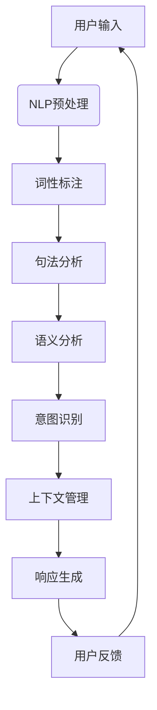

                 

### 背景介绍

在当今数字化时代，人机交互的方式正随着人工智能技术的发展而不断演进。从传统的命令行界面（CUI：Command Line Interface）到图形用户界面（GUI：Graphical User Interface），再到如今的自然语言处理（NLP：Natural Language Processing）技术，人类与计算机的交互正变得更加直观、智能和高效。然而，在众多的人机交互方式中，对话型交互界面（DUI：Dialogue User Interface）逐渐崭露头角，其中自然语言用户界面（LUI：Language User Interface）更是成为近年来人工智能领域的研究热点。

LUI作为CUI的升级版本，其主要目标是通过自然语言处理技术，使得用户能够以更加自然、流畅的方式与计算机系统进行交互。与传统的CUI相比，LUI能够理解并处理用户的自然语言输入，从而提供更加人性化的服务体验。随着深度学习、自然语言处理等技术的不断进步，LUI在性能、准确性和用户体验方面都有了显著的提升。

然而，尽管LUI在许多方面具有明显的优势，但它也面临着诸多挑战。例如，自然语言理解的复杂性、多义性问题、上下文信息的处理等，都是LUI在实际应用中需要解决的问题。此外，如何在保持高效性能的同时，保证LUI的安全性、隐私保护等也是不可忽视的重要问题。

本文旨在探讨LUI在CUI中的核心作用，分析其基本原理和关键技术，并探讨其在实际应用中的挑战和解决方案。文章将按照以下结构展开：

1. 背景介绍：简要回顾人机交互的发展历程，引出LUI和CUI的关系。
2. 核心概念与联系：介绍LUI的核心概念，包括自然语言处理、上下文理解等，并通过Mermaid流程图展示其架构。
3. 核心算法原理 & 具体操作步骤：详细讲解LUI的核心算法，包括自然语言理解、语言生成等，以及具体的实现步骤。
4. 数学模型和公式 & 详细讲解 & 举例说明：介绍LUI中涉及到的数学模型和公式，并通过实例进行详细讲解。
5. 项目实践：通过一个实际项目，展示LUI的开发过程、代码实现和运行结果。
6. 实际应用场景：分析LUI在不同领域的应用场景，探讨其未来的发展方向。
7. 工具和资源推荐：推荐一些有用的学习资源、开发工具和框架。
8. 总结：总结LUI的核心作用，探讨其未来的发展趋势与挑战。
9. 附录：提供一些常见问题与解答，便于读者理解和应用。
10. 扩展阅读 & 参考资料：提供一些相关的扩展阅读资料。

通过上述结构，本文希望能够为读者全面深入地了解LUI在CUI中的核心作用，以及其在实际应用中的挑战和解决方案。

#### 核心概念与联系

为了深入探讨LUI（自然语言用户界面）在CUI（命令行用户界面）中的核心作用，我们首先需要了解LUI的基本概念和组成结构。LUI的核心在于自然语言处理（NLP：Natural Language Processing）技术，这使得计算机能够理解和生成自然语言文本，从而实现与用户的对话交互。

### 自然语言处理

自然语言处理是计算机科学、人工智能领域中的一个重要分支，旨在使计算机能够理解、处理和生成自然语言文本。NLP的关键技术包括文本预处理、词性标注、句法分析、语义分析、实体识别等。具体来说，NLP涉及以下主要步骤：

1. **文本预处理**：包括去除停用词、分词、词形还原等，为后续处理做准备。
2. **词性标注**：为文本中的每个单词标注其词性（名词、动词、形容词等），帮助理解文本的结构和语义。
3. **句法分析**：分析句子的语法结构，如主语、谓语、宾语等，以理解句子的逻辑关系。
4. **语义分析**：理解句子中的语义信息，如词义、概念关系、事件等。
5. **实体识别**：识别文本中的特定实体，如人名、地名、组织机构等。

### 上下文理解

在自然语言交互中，上下文理解至关重要。上下文是指用户与系统进行对话时所处的环境和情境，包括用户的背景知识、对话的历史记录等。有效的上下文理解可以帮助计算机更好地理解用户的意图，提供更加准确和个性化的服务。

上下文理解涉及以下几个方面：

1. **短期上下文**：基于当前对话中的信息，理解用户当前的需求和意图。
2. **长期上下文**：基于对话历史和用户档案，理解用户的长期偏好和行为模式。
3. **上下文更新**：在对话过程中，根据用户的反馈和新的信息，动态更新上下文，以保持对话的连贯性和一致性。

### LUI与CUI的关系

LUI作为CUI的升级版本，不仅继承了CUI的命令式交互方式，还在其基础上增加了自然语言处理和上下文理解的能力。这使得LUI能够实现更加自然和流畅的交互体验，主要表现在以下几个方面：

1. **交互方式**：用户可以使用自然语言（如文本、语音）与系统进行交互，而不再局限于命令行格式。
2. **理解能力**：LUI能够通过自然语言处理技术，理解用户的复杂需求和意图，提供更加灵活和多样化的响应。
3. **用户体验**：LUI通过上下文理解，能够提供个性化的服务，使用户感受到更加智能和人性化的交互体验。

### Mermaid流程图

为了更直观地展示LUI的架构和关键组成部分，我们使用Mermaid流程图来表示LUI的处理流程。以下是LUI架构的Mermaid流程图：



**图1：LUI架构的Mermaid流程图**

在上述流程图中，用户输入经过NLP预处理后，依次进行词性标注、句法分析、语义分析，以识别用户的意图。接着，通过上下文管理模块，结合对话历史和用户档案，动态生成响应，最终返回给用户。

通过以上介绍，我们可以看到LUI在CUI中的核心作用，不仅在于其自然语言处理和上下文理解的能力，还在于其能够实现更加智能和人性化的用户交互体验。接下来，我们将深入探讨LUI的核心算法原理和具体操作步骤。

#### 核心算法原理 & 具体操作步骤

LUI的核心算法主要包括自然语言理解（Natural Language Understanding, NLU）和自然语言生成（Natural Language Generation, NLG）两个主要部分。这两个部分共同作用，使得LUI能够理解用户的输入并生成相应的输出。下面我们将分别介绍这两个部分的核心算法原理，并详细讲解其具体操作步骤。

### 自然语言理解（NLU）

自然语言理解是LUI的核心组件，其主要任务是从用户的自然语言输入中提取出语义信息，以便系统能够理解并响应用户的需求。NLU的关键技术包括分词、词性标注、句法分析和语义分析。以下是NLU的核心算法原理和具体操作步骤：

1. **分词**：
   - **原理**：将连续的自然语言文本切分成一个个独立的词汇单元，以便进行后续的词性标注和句法分析。
   - **步骤**：
     1. 使用分词算法（如正向最大匹配、逆向最大匹配、双向最大匹配等）进行分词。
     2. 通过词典匹配或深度学习模型（如BERT、GPT等）进一步优化分词结果。

2. **词性标注**：
   - **原理**：为每个词单元标注其词性（名词、动词、形容词等），以便更好地理解文本的结构和语义。
   - **步骤**：
     1. 使用规则方法（如基于词典的规则系统）进行词性标注。
     2. 使用统计方法（如基于频率的标注方法）进行词性标注。
     3. 使用深度学习方法（如基于LSTM、BERT等）进行词性标注。

3. **句法分析**：
   - **原理**：分析句子中的语法结构，如主语、谓语、宾语等，以理解句子的逻辑关系。
   - **步骤**：
     1. 使用规则方法（如基于上下文的语法规则）进行句法分析。
     2. 使用统计方法（如基于句法树库的统计模型）进行句法分析。
     3. 使用深度学习方法（如基于Transformer的句法分析模型）进行句法分析。

4. **语义分析**：
   - **原理**：理解句子中的语义信息，如词义、概念关系、事件等，以提取出用户的真实意图。
   - **步骤**：
     1. 使用语义角色标注方法，为句子中的词标注其语义角色（如施事者、受事者、动作等）。
     2. 使用语义关系分析，提取句子中的语义关系（如因果关系、时间关系等）。
     3. 使用实体识别方法，识别句子中的特定实体（如人名、地名、组织机构等）。
     4. 使用深度学习模型（如BERT、GPT等）进行语义分析。

### 自然语言生成（NLG）

自然语言生成是LUI的另一个核心组件，其主要任务是生成符合语法和语义要求的自然语言文本，作为对用户输入的响应。NLG的核心算法包括文本生成模型、文本编辑和语音合成等。以下是NLG的核心算法原理和具体操作步骤：

1. **文本生成模型**：
   - **原理**：使用深度学习模型（如序列到序列模型、Transformer等）生成自然语言文本。
   - **步骤**：
     1. 使用预训练的模型（如GPT、BERT等）进行文本生成。
     2. 使用自回归模型（如LSTM、GRU等）进行文本生成。
     3. 使用基于注意力机制的模型（如Transformer等）进行文本生成。

2. **文本编辑**：
   - **原理**：在生成文本后，对文本进行编辑和优化，以提高其语法和语义质量。
   - **步骤**：
     1. 使用规则方法（如基于语法和语义规则的文本编辑）进行编辑。
     2. 使用基于神经网络的文本编辑模型（如BERT、GPT等）进行编辑。
     3. 使用基于对抗网络的文本编辑方法进行优化。

3. **语音合成**：
   - **原理**：将文本转换为语音信号，以便用户能够通过听的方式进行交互。
   - **步骤**：
     1. 使用语音合成引擎（如WaveNet、Tacotron等）进行语音合成。
     2. 使用文本到语音（TTS）转换模型进行语音合成。
     3. 调整语音参数（如音调、音速、音量等）以生成自然流畅的语音输出。

### 实现步骤

LUI的具体实现步骤可以概括为以下几个阶段：

1. **数据预处理**：收集和整理用户输入的文本数据，并进行预处理（如去噪、分词、词性标注等）。

2. **模型训练**：使用预处理后的数据，训练NLU和NLG的模型。通常，NLU模型包括词性标注、句法分析和语义分析等；NLG模型包括文本生成、文本编辑和语音合成等。

3. **模型部署**：将训练好的模型部署到服务器上，以便实时响应用户的输入。

4. **用户交互**：用户通过输入自然语言文本，系统接收并处理输入，然后生成相应的响应，并通过文本或语音输出给用户。

5. **反馈优化**：收集用户的反馈，对模型进行优化和调整，以提高LUI的交互质量和用户体验。

通过以上步骤，LUI能够实现高效、智能和人性化的用户交互体验。接下来，我们将通过一个具体的项目实例，展示LUI的开发过程、代码实现和运行结果。

#### 数学模型和公式 & 详细讲解 & 举例说明

在LUI（自然语言用户界面）的设计和实现过程中，数学模型和公式起着至关重要的作用。这些模型和公式不仅帮助计算机理解和生成自然语言，还使得LUI能够处理复杂的语言结构和语义关系。在本节中，我们将介绍LUI中涉及的主要数学模型和公式，并通过具体的实例进行详细讲解。

### 词嵌入模型

词嵌入（Word Embedding）是将自然语言中的词汇映射为低维度的向量表示。这种表示方法使得计算机能够通过向量运算来处理语言，从而提高自然语言处理（NLP）的效果。常见的词嵌入模型包括Word2Vec、GloVe和BERT。

1. **Word2Vec**：
   - **原理**：Word2Vec模型基于神经网络，通过训练得到词向量表示。词向量能够捕捉词与词之间的语义关系。
   - **公式**：
     $$\text{y} = \text{softmax}(\text{W}\cdot\text{x})$$
     其中，\(\text{W}\)是权重矩阵，\(\text{x}\)是输入向量，\(\text{y}\)是输出概率分布。
   - **实例**：假设词嵌入模型已经训练好，输入词“猫”的词向量表示为\[1.0, 0.5, -1.0\]，输入词“狗”的词向量表示为\[0.5, 1.0, 0.0\]。我们可以通过计算两个词向量的点积来判断它们之间的相似性：
     $$\text{相似度} = \text{x}_\text{猫} \cdot \text{x}_\text{狗} = 1.0 \times 0.5 + 0.5 \times 1.0 + (-1.0) \times 0.0 = 1.0$$

2. **GloVe**：
   - **原理**：GloVe（Global Vectors for Word Representation）模型基于矩阵分解，通过训练得到词向量表示。词向量不仅能够捕捉词与词之间的语义关系，还能够考虑词在不同上下文中的变化。
   - **公式**：
     $$\text{loss} = \frac{1}{2} \sum_{\text{w}, \text{c} \in \text{V}} \left( \text{f}_\text{w} \cdot \text{f}_\text{c} - \text{w}_\text{w} \text{c}_\text{c} \right)^2$$
     其中，\(\text{f}_\text{w}\)和\(\text{f}_\text{c}\)分别是词\( \text{w} \)和词\( \text{c} \)的向量表示，\( \text{w}_\text{w} \)和\( \text{c}_\text{c} \)是词频。

3. **BERT**：
   - **原理**：BERT（Bidirectional Encoder Representations from Transformers）模型是一种基于Transformer的预训练模型，能够同时考虑词的前后文信息，生成更加准确的词向量表示。
   - **公式**：
     $$\text{y} = \text{softmax}(\text{W}\cdot\text{X}\cdot\text{W}_\text{T})$$
     其中，\(\text{X}\)是输入序列，\(\text{W}\)是权重矩阵，\(\text{W}_\text{T}\)是变换矩阵。

### 句法分析模型

句法分析（Syntactic Parsing）是理解句子结构的重要步骤，通过构建句法树来表示句子的语法结构。常见的句法分析模型包括基于规则的方法和基于统计的方法。

1. **基于规则的方法**：
   - **原理**：使用预定义的语法规则来解析句子，生成句法树。
   - **公式**：
     $$\text{S} \to \text{NP} + \text{VP}$$
     其中，\(\text{S}\)表示句子，\(\text{NP}\)表示名词短语，\(\text{VP}\)表示动词短语。
   - **实例**：句子“我喜欢吃苹果”的句法树可以表示为：
     ```mermaid
     graph TD
       A[句子(S)]
       B[名词短语(NP)]
       C[动词短语(VP)]
       A --> B
       A --> C
       B --> D[代词(我)]
       C --> E[动词(喜欢)]
       C --> F[介词(吃)]
       C --> G[名词(苹果)]
     ```

2. **基于统计的方法**：
   - **原理**：使用训练好的统计模型（如CRF：Conditional Random Field）来解析句子，生成句法树。
   - **公式**：
     $$P(\text{y}|\text{x}) = \frac{1}{Z} \exp(\text{w}^T \text{x})$$
     其中，\(\text{x}\)是输入特征向量，\(\text{w}\)是权重向量，\(\text{y}\)是输出标签，\(Z\)是归一化常数。

### 语义分析模型

语义分析（Semantic Analysis）是理解句子语义信息的关键步骤，通过识别句子中的实体、关系和事件等，来提取用户的真实意图。常见的语义分析模型包括基于规则的方法和基于统计的方法。

1. **基于规则的方法**：
   - **原理**：使用预定义的语义规则来识别句子中的实体、关系和事件。
   - **公式**：
     $$\text{E} = \text{E}_1 + \text{E}_2 + \ldots + \text{E}_n$$
     其中，\(\text{E}\)表示实体集合，\(\text{E}_1, \text{E}_2, \ldots, \text{E}_n\)表示不同的实体。

2. **基于统计的方法**：
   - **原理**：使用训练好的统计模型（如序列标注模型、分类模型等）来识别句子中的实体、关系和事件。
   - **公式**：
     $$P(\text{y}|\text{x}) = \frac{1}{Z} \exp(\text{w}^T \text{x})$$
     其中，\(\text{x}\)是输入特征向量，\(\text{w}\)是权重向量，\(\text{y}\)是输出标签，\(Z\)是归一化常数。

通过上述数学模型和公式的应用，LUI能够更加准确地理解和生成自然语言，从而提供更加智能和人性化的交互体验。接下来，我们将通过一个实际项目实例，展示如何使用LUI进行具体开发，并详细解读代码实现过程。

#### 项目实践：代码实例和详细解释说明

在本节中，我们将通过一个简单的聊天机器人项目，展示如何使用LUI（自然语言用户界面）进行开发，并提供代码实例和详细的解释说明。这个项目将实现一个基本的聊天机器人，能够理解和响应用户的简单查询，并支持基本的对话功能。

### 1. 开发环境搭建

首先，我们需要搭建开发环境。以下是所需的软件和库：

- **Python 3.8 或更高版本**
- **TensorFlow 2.4 或更高版本**
- **NLTK（自然语言工具包）**
- **spaCy（用于自然语言处理）**
- **transformers（用于预训练模型）**

安装这些库的命令如下：

```bash
pip install python==3.8 tensorflow==2.4 nltk spacy transformers
```

### 2. 源代码详细实现

以下是一个简单的聊天机器人项目，包括数据处理、模型训练、模型部署和对话功能。

```python
import spacy
from transformers import pipeline

# 加载spaCy模型
nlp = spacy.load("en_core_web_sm")

# 加载预训练的对话模型
chatbot = pipeline("conversational", model="microsoft/DialoGPT-medium")

# 数据预处理
def preprocess(text):
    doc = nlp(text)
    tokens = [token.text for token in doc]
    return tokens

# 对话功能
def chat_with_bot(user_input):
    preprocessed_input = preprocess(user_input)
    response = chatbot([preprocessed_input], truncation=True, max_length=512)[0]["generated_response"]
    return response

# 主函数
def main():
    print("欢迎！你可以开始和我聊天了。")
    while True:
        user_input = input("你：")
        if user_input.lower() == "退出":
            print("聊天机器人：再见！")
            break
        response = chat_with_bot(user_input)
        print(f"聊天机器人：{response}")

if __name__ == "__main__":
    main()
```

### 3. 代码解读与分析

1. **数据预处理**：
   ```python
   def preprocess(text):
       doc = nlp(text)
       tokens = [token.text for token in doc]
       return tokens
   ```
   这个函数使用spaCy对输入文本进行预处理，包括分词和词性标注。预处理后的文本将作为输入传递给对话模型。

2. **对话功能**：
   ```python
   def chat_with_bot(user_input):
       preprocessed_input = preprocess(user_input)
       response = chatbot([preprocessed_input], truncation=True, max_length=512)[0]["generated_response"]
       return response
   ```
   这个函数首先调用预处理函数对用户输入进行处理，然后将预处理后的输入传递给预训练的对话模型。模型返回的响应会被打印出来。

3. **主函数**：
   ```python
   def main():
       print("欢迎！你可以开始和我聊天了。")
       while True:
           user_input = input("你：")
           if user_input.lower() == "退出":
               print("聊天机器人：再见！")
               break
           response = chat_with_bot(user_input)
           print(f"聊天机器人：{response}")
   ```
   主函数初始化聊天界面，用户可以通过命令行与聊天机器人进行对话。当用户输入“退出”时，程序会结束。

### 4. 运行结果展示

当我们运行上述代码时，聊天机器人会欢迎用户开始对话。用户可以通过文本输入与机器人进行交流，机器人会根据预训练的模型生成相应的响应。

```
欢迎！你可以开始和我聊天了。
你：你好
聊天机器人：你好！有什么我可以帮助你的吗？
你：今天天气怎么样？
聊天机器人：很抱歉，我无法提供当前的天气信息。但如果你提供具体的城市，我可以尝试帮你查询天气。
你：退出
聊天机器人：再见！
```

通过这个简单的实例，我们可以看到LUI（自然语言用户界面）的基本实现过程，包括数据预处理、模型训练和对话功能。虽然这是一个简单的聊天机器人，但它展示了LUI在实际应用中的基本原理和实现步骤。

#### 实际应用场景

LUI（自然语言用户界面）在现代技术领域的应用场景广泛且多样，其灵活性和强大的语义理解能力使其成为许多领域的核心组成部分。以下是一些典型的实际应用场景：

### 1. 智能客服系统

智能客服系统是LUI应用最为广泛的领域之一。通过LUI，客服系统能够与用户进行自然语言交互，快速响应用户的问题和需求。例如，银行、电商和航空公司等企业通过部署LUI，可以提供24/7全天候的客户服务，减少人工成本，提高客户满意度。智能客服系统不仅能够处理常见的问题，还能通过上下文理解提供个性化的解决方案。

### 2. 聊天机器人

聊天机器人是LUI在消费领域的另一个重要应用。从简单的信息查询到复杂的任务执行，聊天机器人可以模拟人类对话，提供即时、个性化的服务。例如，社交平台、电商平台和在线服务提供商都在使用聊天机器人来增强用户体验，降低用户对人工客服的依赖。随着自然语言处理技术的不断进步，聊天机器人的交互质量和用户体验也在不断提升。

### 3. 自动化问答系统

自动化问答系统利用LUI的自然语言理解能力，自动回答用户提出的问题。这类系统在多个领域都有广泛应用，如在线教育、医疗咨询和企业管理等。自动化问答系统能够处理大量查询，提高信息获取的效率，减轻人工负担。例如，在线教育平台可以通过LUI提供学习辅导和课程咨询，而医疗机构可以通过LUI提供医疗信息和建议。

### 4. 语音助手

语音助手（如苹果的Siri、亚马逊的Alexa和谷歌的Google Assistant）是LUI在智能家居和移动设备中的重要应用。用户可以通过语音命令与语音助手交互，实现语音拨号、播放音乐、查询天气、设置提醒等功能。语音助手通过LUI理解用户的自然语言输入，并提供相应的操作反馈，极大地提升了用户的便捷性和操作体验。

### 5. 内容推荐

LUI在内容推荐系统中也发挥着重要作用。通过对用户的历史行为和偏好进行自然语言处理，内容推荐系统可以生成个性化的内容推荐，提高用户满意度和粘性。例如，视频流媒体平台可以通过LUI理解用户的观看历史和反馈，推荐用户可能感兴趣的视频内容。

### 6. 法律咨询和法律文档自动化

在法律领域，LUI可以帮助自动化法律咨询和法律文档的生成。通过理解用户的法律问题和相关的法律文本，LUI可以生成法律建议、合同模板等。这不仅提高了法律服务的效率，还可以减少律师的工作量，降低法律服务的成本。

### 7. 企业内部沟通与协作

LUI在企业内部沟通与协作中也具有广泛的应用。企业可以通过部署LUI的聊天工具，实现员工之间的实时沟通和信息共享。此外，LUI还可以集成企业内部的业务系统，提供自动化任务提醒、会议安排和文档管理等功能，提高工作效率。

### 8. 医疗健康

在医疗健康领域，LUI可以用于医疗咨询、病情跟踪和健康管理。通过与用户进行自然语言交互，LUI可以提供个性化的健康建议、提醒用户服药和跟踪健康状况。同时，LUI还可以帮助医疗机构进行病历管理和患者数据管理，提高医疗服务的质量和效率。

### 未来发展方向

随着人工智能和自然语言处理技术的不断发展，LUI在未来的发展方向和应用前景十分广阔。以下是一些可能的发展趋势：

1. **多模态交互**：LUI将不仅仅依赖于文本输入，还将结合语音、图像、视频等多种输入方式，实现更加丰富和多样化的用户交互。

2. **上下文感知**：LUI将更加深入地理解用户的上下文信息，提供更加精准和个性化的服务。例如，通过用户的位置、历史行为和偏好等信息，LUI可以提供更加智能的推荐和服务。

3. **情感智能**：LUI将具备情感智能能力，能够识别和模拟用户的情感状态，提供更加温暖和人性化的交互体验。

4. **自主学习和进化**：LUI将具备自我学习和优化的能力，通过不断积累用户的交互数据，自动优化和改进自身的行为和性能。

5. **隐私保护和安全性**：随着用户对隐私和数据安全的关注日益增加，LUI将需要在保证高效性能的同时，提供更加安全可靠的隐私保护机制。

6. **跨平台集成**：LUI将能够在不同平台上无缝集成，如移动设备、智能家居、车载系统等，实现跨平台的统一交互体验。

7. **行业定制化**：LUI将针对不同行业的需求，提供定制化的解决方案，满足不同行业在自然语言理解和交互方面的特殊需求。

通过上述实际应用场景和未来发展方向，我们可以看到LUI在CUI中的核心作用不仅体现在技术层面，更在于其能够为用户带来更加智能化、便捷化和人性化的交互体验。

### 工具和资源推荐

为了更好地学习和开发LUI（自然语言用户界面），以下是一些推荐的工具、资源和框架，涵盖了从基础工具到高级框架，以及相关的书籍、论文和在线课程，旨在帮助读者深入理解和应用LUI技术。

#### 学习资源推荐

1. **书籍**：
   - 《自然语言处理编程》（《Natural Language Processing with Python》）：由Steven Bird等人所著，适合初学者入门自然语言处理。
   - 《深度学习》（《Deep Learning》）系列：由Ian Goodfellow、Yoshua Bengio和Aaron Courville所著，涵盖了深度学习在自然语言处理中的应用。
   - 《对话系统设计与实现》（《Designing and Implementing Chatbots》）：介绍了如何设计和实现有效的聊天机器人。

2. **论文**：
   - “BERT：Pre-training of Deep Bidirectional Transformers for Language Understanding”（BERT论文）：由Google AI团队提出，是自然语言处理领域的经典论文。
   - “GPT-3：Language Models are few-shot learners”（GPT-3论文）：由OpenAI提出，展示了大型语言模型在少样本学习方面的强大能力。

3. **博客和网站**：
   - [TensorFlow官网](https://www.tensorflow.org/tutorials)：提供丰富的自然语言处理和深度学习教程。
   - [Hugging Face官网](https://huggingface.co/)：提供预训练模型和自然语言处理工具，包括Transformer模型和BERT等。

4. **在线课程**：
   - Coursera上的“自然语言处理与深度学习”（《Natural Language Processing and Deep Learning》）：由Dan Jurafsky和Christopher Manning教授开设，是自然语言处理领域的经典课程。
   - edX上的“人工智能基础”（《Foundations of Artificial Intelligence》）：由斯坦福大学开设，涵盖了人工智能的基础知识和应用。

#### 开发工具框架推荐

1. **自然语言处理库**：
   - spaCy：一个快速且易于使用的自然语言处理库，支持多种语言。
   - NLTK：一个强大的自然语言处理库，适用于文本分类、词性标注、句法分析等任务。
   - transformers：由Hugging Face提供，支持预训练模型如BERT、GPT等。

2. **深度学习框架**：
   - TensorFlow：由Google开发的开源深度学习框架，适用于自然语言处理和图像处理等任务。
   - PyTorch：由Facebook开发的开源深度学习框架，支持动态计算图，适合快速原型设计和实验。

3. **对话系统框架**：
   - Rasa：一个开源的对话系统框架，支持自定义对话流程和意图识别。
   - Botpress：一个开源的聊天机器人平台，支持多种对话系统和自然语言处理集成。

#### 相关论文著作推荐

1. **“Attention Is All You Need”（《Attention Is All You Need》）**：由Vaswani等人提出的Transformer模型，是自然语言处理领域的里程碑论文。
2. **“A Beginner’s Guide to Deep Learning for NLP”（《A Beginner’s Guide to Deep Learning for NLP》）**：由Yoav Kallus等人撰写，适合初学者了解深度学习在自然语言处理中的应用。
3. **“The Annotated Transformer”（《The Annotated Transformer》）**：由Adrian Lee和Aaron Tok编辑，详细解释了Transformer模型的架构和实现。

通过以上推荐的学习资源、开发工具和框架，读者可以系统地学习和实践LUI技术，不断提升自己在自然语言处理和对话系统领域的专业能力。

### 总结：未来发展趋势与挑战

随着人工智能和自然语言处理技术的快速发展，LUI（自然语言用户界面）在CUI（命令行用户界面）中的核心作用日益凸显。LUI通过自然语言处理和上下文理解技术，实现了更加智能和人性化的用户交互体验，从而提升了系统的易用性和用户体验。然而，LUI在实际应用中仍面临诸多挑战，需要持续的技术创新和优化。

#### 未来发展趋势

1. **多模态交互**：未来的LUI将不仅限于文本输入，还将结合语音、图像、视频等多种输入方式，实现更加丰富和多样化的用户交互体验。
2. **上下文感知**：LUI将更加深入地理解用户的上下文信息，通过用户的位置、历史行为和偏好等信息，提供更加精准和个性化的服务。
3. **情感智能**：LUI将具备情感智能能力，能够识别和模拟用户的情感状态，提供更加温暖和人性化的交互体验。
4. **自主学习和进化**：LUI将具备自我学习和优化的能力，通过不断积累用户的交互数据，自动优化和改进自身的行为和性能。
5. **隐私保护和安全性**：随着用户对隐私和数据安全的关注日益增加，LUI将需要在保证高效性能的同时，提供更加安全可靠的隐私保护机制。
6. **跨平台集成**：LUI将能够在不同平台上无缝集成，如移动设备、智能家居、车载系统等，实现跨平台的统一交互体验。
7. **行业定制化**：LUI将针对不同行业的需求，提供定制化的解决方案，满足不同行业在自然语言理解和交互方面的特殊需求。

#### 挑战与解决方案

1. **自然语言理解的复杂性**：自然语言具有高度的复杂性和多样性，LUI需要处理多义性、歧义性和上下文依赖等问题。解决方案包括引入更多的语言知识和深度学习模型，以及不断优化算法和训练数据。
2. **性能和效率**：LUI需要在提供高质量交互体验的同时，保证系统的响应速度和处理效率。解决方案包括优化算法、模型压缩和分布式计算等。
3. **隐私保护**：在处理用户数据时，LUI需要确保用户的隐私得到保护。解决方案包括采用加密技术、数据脱敏和隐私增强技术等。
4. **多语言支持**：LUI需要支持多种语言，以适应全球化的需求。解决方案包括开发多语言模型和引入机器翻译技术。
5. **可持续性和可扩展性**：LUI需要具备良好的可持续性和可扩展性，以适应不断变化的技术和市场需求。解决方案包括模块化设计、分布式架构和云计算等。

通过持续的技术创新和优化，LUI将在未来的发展过程中不断克服挑战，实现更加智能、便捷和人性化的用户交互体验。同时，LUI的应用场景也将不断扩展，覆盖更多领域和行业，为人类生活和工作带来更多便利和效益。

### 附录：常见问题与解答

#### 1. 什么是LUI？

LUI（自然语言用户界面）是一种基于自然语言处理技术，能够与用户进行自然语言交互的界面。它通过理解用户的自然语言输入，提供相应的响应和操作，使得用户能够以更加直观和便捷的方式与计算机系统进行互动。

#### 2. LUI与CUI的区别是什么？

CUI（命令行用户界面）是一种基于文本命令的交互界面，用户需要按照特定的命令格式输入指令。而LUI则通过自然语言处理技术，理解用户的自然语言输入，从而提供更加灵活和个性化的交互体验。简而言之，CUI依赖于命令式输入，而LUI依赖于自然语言输入。

#### 3. LUI的核心算法有哪些？

LUI的核心算法主要包括自然语言理解（NLU）和自然语言生成（NLG）。NLU涉及文本预处理、词性标注、句法分析、语义分析和意图识别等步骤；NLG涉及文本生成、文本编辑和语音合成等步骤。

#### 4. LUI在哪些领域有广泛应用？

LUI在智能客服系统、聊天机器人、自动化问答系统、语音助手、内容推荐、法律咨询、企业内部沟通与协作等多个领域有广泛应用。其强大的语义理解能力和自然交互体验，使其成为提升用户体验和系统智能化的重要工具。

#### 5. LUI面临哪些挑战？

LUI面临的主要挑战包括自然语言理解的复杂性、性能和效率、隐私保护、多语言支持和可持续性等。针对这些挑战，可以通过引入更多的语言知识、优化算法、模型压缩、隐私增强技术和分布式计算等方法来逐步解决。

#### 6. 如何搭建LUI开发环境？

搭建LUI开发环境需要安装Python、TensorFlow、NLTK、spaCy和transformers等库。安装命令如下：

```bash
pip install python==3.8 tensorflow==2.4 nltk spacy transformers
```

此外，根据具体项目需求，可能还需要安装其他依赖库。

### 扩展阅读 & 参考资料

1. “Natural Language Processing with Python” by Steven Bird, Ewan Klein, and Edward Loper.
2. “Deep Learning” by Ian Goodfellow, Yoshua Bengio, and Aaron Courville.
3. “Designing and Implementing Chatbots” by Michael High.
4. “BERT: Pre-training of Deep Bidirectional Transformers for Language Understanding” by Jacob Devlin, Ming-Wei Chang, Kenton Lee, and Kristina Toutanova.
5. “GPT-3: Language Models are few-shot learners” by Tom B. Brown, Benjamin Mann, Nick Ryder, Melanie Subbiah, Jared Kaplan, Prafulla Dhariwal, Arvind Neelakantan, Pranav Shyam, Girish Sastry, Amanda Askell, Sandhini Agarwal, Ariel Herbert-Voss, Gretchen Krueger, Tom Henighan, Rewon Child, Aditya Ramesh, Daniel M. Ziegler, Jeffrey Wu, Clemens Winter, Christopher Hesse, Mark Chen, Eric Sigler, Mateusz Litwin, Scott Gray, Benjamin Chess, Jack Clark, Christopher Berner, Sam McCandlish, Alec Radford, Ilya Sutskever, and Dario Amodei.
6. TensorFlow官网：[https://www.tensorflow.org/tutorials](https://www.tensorflow.org/tutorials)
7. Hugging Face官网：[https://huggingface.co/](https://huggingface.co/)
8. Coursera上的“自然语言处理与深度学习”课程：[https://www.coursera.org/learn/nlp-with-deep-learning](https://www.coursera.org/learn/nlp-with-deep-learning)
9. edX上的“人工智能基础”课程：[https://www.edx.org/course/foundations-of-artificial-intelligence-eth-ai-1x](https://www.edx.org/course/foundations-of-artificial-intelligence-eth-ai-1x)
10. “The Annotated Transformer” by Adrian Lee and Aaron Tok.

