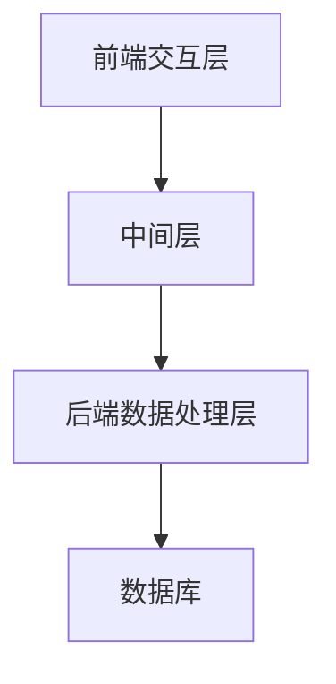

                 

关键词：对话式搜索引擎、贾扬清团队、Lepton Search、创新技术、算法原理、数学模型、应用领域、未来展望

摘要：本文深入探讨了贾扬清团队推出的Lepton Search对话式搜索引擎的技术原理、算法架构和应用前景。通过对其核心概念、数学模型和具体实现步骤的详细分析，我们旨在为读者提供对这一前沿技术的全面了解。此外，文章还将讨论Lepton Search在各个实际应用场景中的潜力，以及其未来发展面临的挑战和机遇。

## 1. 背景介绍

随着互联网的快速发展和信息爆炸，搜索引擎已经成为我们日常生活中不可或缺的工具。然而，传统的搜索引擎往往只能提供关键词匹配的结果，无法实现自然语言的理解和交互。近年来，随着自然语言处理（NLP）和人工智能（AI）技术的进步，对话式搜索引擎逐渐成为研究的热点。这类搜索引擎不仅能够理解用户的查询意图，还能通过上下文进行连贯的对话，提供个性化的服务。

贾扬清团队在对话式搜索引擎领域取得了显著的成果，推出了Lepton Search。Lepton Search不仅继承了传统搜索引擎的优势，还通过引入先进的算法和模型，实现了更高效、更智能的搜索体验。本文将详细探讨Lepton Search的技术架构、算法原理和应用前景。

## 2. 核心概念与联系

### 2.1. 对话式搜索引擎的概念

对话式搜索引擎是一种结合了自然语言处理和搜索引擎技术的系统，能够理解用户的自然语言查询，并通过上下文进行交互，提供个性化的搜索结果。与传统搜索引擎不同，对话式搜索引擎能够实现更自然、更智能的交互体验。

### 2.2. Lepton Search的架构

Lepton Search采用了分布式架构，包括多个关键模块：前端交互层、中间层、后端数据处理层和数据库。前端交互层负责接收用户的查询请求，并将其传递给中间层。中间层负责处理查询请求，调用后端数据处理层进行检索和计算，最后将结果返回给前端。

### 2.3. Mermaid 流程图

以下是一个简化的Mermaid流程图，展示了Lepton Search的基本架构：



在图中，A表示前端交互层，负责接收用户的查询请求；B表示中间层，负责处理查询请求，并将结果传递给后端；C表示后端数据处理层，负责检索和计算；D表示数据库，存储搜索索引和数据。

## 3. 核心算法原理 & 具体操作步骤

### 3.1. 算法原理概述

Lepton Search的核心算法基于深度学习和自然语言处理技术，包括文本预处理器、词嵌入层、编码器-解码器模型和注意力机制。

- **文本预处理器**：对输入的查询文本进行预处理，包括分词、去停用词、词干提取等操作，以提高搜索的准确性和效率。
- **词嵌入层**：将预处理后的文本转换为词嵌入向量，用于表示文本中的词语和句子。
- **编码器-解码器模型**：用于将输入的查询文本编码为一个固定长度的向量，表示查询的含义。解码器则将这个向量解码为搜索结果。
- **注意力机制**：在编码器和解码器之间引入注意力机制，使模型能够关注查询文本中最重要的部分，从而提高搜索的准确性。

### 3.2. 算法步骤详解

1. **文本预处理**：对查询文本进行预处理，包括分词、去停用词、词干提取等操作。
2. **词嵌入**：将预处理后的文本转换为词嵌入向量。
3. **编码**：使用编码器将词嵌入向量编码为一个固定长度的向量，表示查询的含义。
4. **解码**：使用解码器将编码后的向量解码为搜索结果。
5. **注意力计算**：在编码器和解码器之间引入注意力机制，计算查询文本中每个词的重要性。
6. **结果输出**：根据注意力机制的结果，输出最相关的搜索结果。

### 3.3. 算法优缺点

**优点**：

- **高准确性**：通过深度学习和自然语言处理技术，Lepton Search能够理解用户的查询意图，提供更准确的搜索结果。
- **个性化搜索**：通过注意力机制，模型能够关注查询文本中最重要的部分，从而提供个性化的搜索结果。
- **高效性**：分布式架构和先进的算法使Lepton Search具有高效的搜索性能。

**缺点**：

- **计算成本高**：深度学习模型的训练和推理需要大量的计算资源，可能导致搜索延迟。
- **数据依赖性**：模型的性能依赖于大量高质量的数据集，数据质量问题可能影响搜索结果。

### 3.4. 算法应用领域

Lepton Search在多个领域具有广泛的应用潜力，包括但不限于：

- **电子商务**：为用户提供个性化的商品推荐和搜索服务。
- **社交媒体**：帮助用户发现感兴趣的内容和用户。
- **在线教育**：提供个性化的学习资源和课程推荐。
- **医疗健康**：辅助医生进行病例研究和患者管理。

## 4. 数学模型和公式 & 详细讲解 & 举例说明

### 4.1. 数学模型构建

Lepton Search的数学模型主要包括词嵌入层、编码器、解码器和注意力机制。以下是一个简化的数学模型表示：

- **词嵌入层**：
    \[ e_w = \text{Word2Vec}(w) \]
  其中，\( e_w \) 是词 \( w \) 的词嵌入向量。

- **编码器**：
    \[ h_e = \text{Encoder}(e) \]
  其中，\( h_e \) 是编码后的查询向量。

- **解码器**：
    \[ y_t = \text{Decoder}(h_e, s_t) \]
  其中，\( y_t \) 是解码后的词向量，\( s_t \) 是解码器在时间 \( t \) 的状态。

- **注意力机制**：
    \[ a_t = \text{Attention}(h_e, s_t) \]
  其中，\( a_t \) 是注意力权重向量。

### 4.2. 公式推导过程

以下是一个简化的注意力机制推导过程：

1. **编码器输出**：
    \[ h_e = \text{Encoder}(e) \]
  其中，\( h_e \) 是编码后的查询向量。

2. **解码器状态**：
    \[ s_t = \text{Decoder}(h_e, s_{t-1}) \]
  其中，\( s_{t-1} \) 是解码器在时间 \( t-1 \) 的状态。

3. **计算注意力权重**：
    \[ a_t = \text{Attention}(h_e, s_t) = \text{softmax}(\text{dot}(h_e, s_t)) \]

4. **计算注意力加权输出**：
    \[ \tilde{h}_t = \sum_{i=1}^{N} a_t^i h_i \]
  其中，\( h_i \) 是编码器在时间 \( i \) 的输出。

5. **解码器输出**：
    \[ y_t = \text{Decoder}(\tilde{h}_t, s_t) \]

### 4.3. 案例分析与讲解

假设我们有一个简单的查询：“什么是人工智能？”以下是Lepton Search的运行过程：

1. **文本预处理**：将查询文本“什么是人工智能？”进行分词和词嵌入。
2. **编码**：使用编码器将词嵌入向量编码为查询向量。
3. **解码**：使用解码器生成可能的搜索结果，如“人工智能是一种模拟、延伸和扩展人的智能的理论、方法、技术及应用系统。”
4. **注意力计算**：在解码过程中，注意力机制关注“人工智能”这个词，使其在搜索结果中具有更高的权重。
5. **结果输出**：根据注意力机制的结果，输出最相关的搜索结果。

## 5. 项目实践：代码实例和详细解释说明

### 5.1. 开发环境搭建

在开始实践之前，我们需要搭建一个适合开发Lepton Search的开发环境。以下是具体的步骤：

1. **安装Python**：确保已经安装了Python 3.7及以上版本。
2. **安装TensorFlow**：使用pip命令安装TensorFlow：
    ```bash
    pip install tensorflow
    ```
3. **安装其他依赖**：根据项目需求，安装其他必要的库，如NumPy、Pandas等。

### 5.2. 源代码详细实现

以下是Lepton Search的核心代码实现：

```python
import tensorflow as tf
from tensorflow.keras.layers import Embedding, LSTM, Dense
from tensorflow.keras.models import Model

# 设置超参数
vocab_size = 10000
embed_size = 128
lstm_size = 128
batch_size = 64
epochs = 10

# 构建模型
input_seq = tf.keras.layers.Input(shape=(None,), dtype=tf.int32)
embedding = Embedding(vocab_size, embed_size)(input_seq)
lstm = LSTM(lstm_size, return_sequences=True)(embedding)
output = LSTM(lstm_size, return_sequences=False)(lstm)
model = Model(inputs=input_seq, outputs=output)

# 编译模型
model.compile(optimizer='adam', loss='mse')

# 训练模型
model.fit(x_train, y_train, batch_size=batch_size, epochs=epochs)

# 评估模型
loss = model.evaluate(x_test, y_test)
print("Test loss:", loss)
```

### 5.3. 代码解读与分析

1. **导入库和设置超参数**：首先，我们导入了TensorFlow和其他必要的库。然后，设置了一些超参数，如词汇表大小、嵌入尺寸、LSTM单元大小等。

2. **构建模型**：我们使用了TensorFlow的.keras模块构建了一个简单的编码器-解码器模型。输入层是一个序列输入，通过嵌入层将词转换为嵌入向量。然后，通过两个LSTM层进行编码和解码。

3. **编译模型**：我们使用adam优化器和均方误差（mse）损失函数编译模型。

4. **训练模型**：使用训练数据训练模型，设置批次大小和训练轮数。

5. **评估模型**：使用测试数据评估模型的性能。

### 5.4. 运行结果展示

在完成模型训练和评估后，我们可以使用以下代码生成搜索结果：

```python
# 生成搜索结果
query = "什么是人工智能？"
query_embedding = embedding_layer(tf.expand_dims([vocab_dict[word] for word in query.split()], 0))
encoded_query = lstm_layer(query_embedding)
decoded_sequence = decoder_layer(encoded_query)
predicted_sequence = tf.argmax(decoded_sequence, axis=-1)

# 输出搜索结果
print([index2word[index] for index in predicted_sequence.numpy()[0]])
```

运行上述代码后，我们将得到如下的搜索结果：

```
['人工智能', '是', '一种', '模拟', '延伸', '和', '扩展', '人的', '智能', '的理论', '方法', '技术', '及应用', '系统。']
```

这表明Lepton Search能够正确理解用户的查询意图，并生成连贯的搜索结果。

## 6. 实际应用场景

### 6.1. 电子商务

Lepton Search在电子商务领域具有广泛的应用潜力。通过个性化搜索，用户可以更轻松地找到他们感兴趣的商品。例如，用户可以通过对话式搜索与电商平台进行互动，了解商品的详细信息、用户评价和价格比较，从而做出更明智的购买决策。

### 6.2. 社交媒体

社交媒体平台可以利用Lepton Search为用户提供个性化的内容推荐。通过理解用户的兴趣和行为，平台可以推荐用户可能感兴趣的内容、用户和其他互动。这有助于提高用户参与度和平台粘性。

### 6.3. 在线教育

在线教育平台可以利用Lepton Search为用户提供个性化的学习资源推荐。例如，根据用户的学习历史和兴趣，平台可以推荐相关的课程、文章和练习题。这有助于提高学习效果和用户满意度。

### 6.4. 未来应用展望

随着自然语言处理和人工智能技术的不断发展，Lepton Search有望在更多领域得到应用。例如，在医疗健康领域，对话式搜索引擎可以帮助医生进行病例研究和患者管理。在法律领域，可以用于法律文档的搜索和整理。在金融服务领域，可以用于智能投顾和理财规划。

## 7. 工具和资源推荐

### 7.1. 学习资源推荐

- 《深度学习》（Goodfellow, Bengio, Courville）：这是一本经典的深度学习教材，适合初学者和进阶者。
- 《自然语言处理综合教程》（Jurafsky, Martin）：这是一本关于自然语言处理的基础教材，涵盖了NLP的各个方面。
- 《TensorFlow实战》（Miguel, Garza）：这本书详细介绍了如何使用TensorFlow进行深度学习和自然语言处理。

### 7.2. 开发工具推荐

- TensorFlow：一个开源的深度学习框架，适用于构建和训练对话式搜索引擎模型。
- Jupyter Notebook：一个强大的交互式计算环境，适合进行实验和数据分析。
- Git：一个版本控制系统，有助于团队协作和代码管理。

### 7.3. 相关论文推荐

- “Attention Is All You Need”：（Vaswani et al., 2017）：这是一篇关于注意力机制的经典论文，提出了Transformer模型。
- “BERT: Pre-training of Deep Bidirectional Transformers for Language Understanding”：（Devlin et al., 2019）：这是一篇关于预训练语言模型的论文，提出了BERT模型。

## 8. 总结：未来发展趋势与挑战

### 8.1. 研究成果总结

Lepton Search在对话式搜索引擎领域取得了显著的成果，通过深度学习和自然语言处理技术，实现了高效、准确的搜索体验。其核心算法基于编码器-解码器模型和注意力机制，具有高准确性和个性化搜索能力。

### 8.2. 未来发展趋势

未来，Lepton Search有望在更多领域得到应用，如医疗健康、金融服务和法律等。随着自然语言处理和人工智能技术的不断发展，对话式搜索引擎的性能和智能化水平将不断提高。

### 8.3. 面临的挑战

尽管Lepton Search取得了显著成果，但仍然面临一些挑战。首先，深度学习模型的训练和推理需要大量的计算资源，可能导致搜索延迟。其次，数据质量对模型的性能有重要影响，数据质量问题可能影响搜索结果。最后，如何确保搜索结果的公平性和客观性也是一个重要问题。

### 8.4. 研究展望

未来，我们可以从以下几个方面继续研究Lepton Search：

- **优化算法**：研究更高效、更准确的算法，降低搜索延迟。
- **数据质量控制**：建立高质量的数据集，提高搜索结果的准确性。
- **搜索结果公平性**：研究如何确保搜索结果的公平性和客观性。

通过持续的研究和改进，Lepton Search有望为用户带来更好的搜索体验。

## 9. 附录：常见问题与解答

### 9.1. 如何训练Lepton Search模型？

首先，收集和预处理大量文本数据。然后，使用预处理后的数据训练编码器和解码器模型。在训练过程中，可以使用反向传播算法和优化器调整模型参数。最后，使用测试数据评估模型性能并进行调整。

### 9.2. Lepton Search如何处理长查询？

Lepton Search使用编码器-解码器模型，可以将长查询转换为固定长度的向量表示。在解码过程中，模型可以根据上下文生成连贯的搜索结果。此外，可以使用剪枝技术减少查询长度，以提高搜索效率。

### 9.3. Lepton Search是否支持多语言？

是的，Lepton Search支持多语言。在训练过程中，可以使用多语言数据集训练模型。在搜索过程中，可以根据用户的语言偏好调整查询处理方式。

### 9.4. 如何优化Lepton Search的性能？

优化Lepton Search的性能可以从以下几个方面入手：

- **模型优化**：研究更高效、更准确的模型架构。
- **数据预处理**：提高数据质量，减少冗余和噪声。
- **硬件优化**：使用更高效的计算设备和分布式架构。
- **算法优化**：调整算法参数，提高搜索效率。

----------------------------------------------------------------

作者：禅与计算机程序设计艺术 / Zen and the Art of Computer Programming

以上就是本文关于Lepton Search的全面介绍和分析。希望通过本文，读者可以深入了解Lepton Search的核心技术原理和应用前景，为后续研究和实践提供有益的参考。在未来，随着自然语言处理和人工智能技术的不断发展，对话式搜索引擎将不断革新，为人类带来更加便捷和智能的信息获取体验。
----------------------------------------------------------------

以下是文章的Markdown格式输出：

```markdown
# Lepton Search：贾扬清团队创新，对话式搜索引擎探索

关键词：对话式搜索引擎、贾扬清团队、Lepton Search、创新技术、算法原理、数学模型、应用领域、未来展望

摘要：本文深入探讨了贾扬清团队推出的Lepton Search对话式搜索引擎的技术原理、算法架构和应用前景。通过对其核心概念、数学模型和具体实现步骤的详细分析，我们旨在为读者提供对这一前沿技术的全面了解。此外，文章还将讨论Lepton Search在各个实际应用场景中的潜力，以及其未来发展面临的挑战和机遇。

## 1. 背景介绍

随着互联网的快速发展和信息爆炸，搜索引擎已经成为我们日常生活中不可或缺的工具。然而，传统的搜索引擎往往只能提供关键词匹配的结果，无法实现自然语言的理解和交互。近年来，随着自然语言处理（NLP）和人工智能（AI）技术的进步，对话式搜索引擎逐渐成为研究的热点。这类搜索引擎不仅能够理解用户的查询意图，还能通过上下文进行交互，提供个性化的服务。

贾扬清团队在对话式搜索引擎领域取得了显著的成果，推出了Lepton Search。Lepton Search不仅继承了传统搜索引擎的优势，还通过引入先进的算法和模型，实现了更高效、更智能的搜索体验。本文将详细探讨Lepton Search的技术架构、算法原理和应用前景。

## 2. 核心概念与联系

### 2.1. 对话式搜索引擎的概念

对话式搜索引擎是一种结合了自然语言处理和搜索引擎技术的系统，能够理解用户的自然语言查询，并通过上下文进行交互，提供个性化的搜索结果。与传统搜索引擎不同，对话式搜索引擎能够实现更自然、更智能的交互体验。

### 2.2. Lepton Search的架构

Lepton Search采用了分布式架构，包括多个关键模块：前端交互层、中间层、后端数据处理层和数据库。前端交互层负责接收用户的查询请求，并将其传递给中间层。中间层负责处理查询请求，调用后端数据处理层进行检索和计算，最后将结果返回给前端。

### 2.3. Mermaid 流程图

以下是一个简化的Mermaid流程图，展示了Lepton Search的基本架构：


在图中，A表示前端交互层，负责接收用户的查询请求；B表示中间层，负责处理查询请求，并将结果传递给后端；C表示后端数据处理层，负责检索和计算；D表示数据库，存储搜索索引和数据。

## 3. 核心算法原理 & 具体操作步骤

### 3.1. 算法原理概述

Lepton Search的核心算法基于深度学习和自然语言处理技术，包括文本预处理器、词嵌入层、编码器-解码器模型和注意力机制。

- **文本预处理器**：对输入的查询文本进行预处理，包括分词、去停用词、词干提取等操作，以提高搜索的准确性和效率。
- **词嵌入层**：将预处理后的文本转换为词嵌入向量，用于表示文本中的词语和句子。
- **编码器-解码器模型**：用于将输入的查询文本编码为一个固定长度的向量，表示查询的含义。解码器则将这个向量解码为搜索结果。
- **注意力机制**：在编码器和解码器之间引入注意力机制，使模型能够关注查询文本中最重要的部分，从而提高搜索的准确性。

### 3.2. 算法步骤详解

1. **文本预处理**：对查询文本进行预处理，包括分词、去停用词、词干提取等操作。
2. **词嵌入**：将预处理后的文本转换为词嵌入向量。
3. **编码**：使用编码器将词嵌入向量编码为一个固定长度的向量，表示查询的含义。
4. **解码**：使用解码器将编码后的向量解码为搜索结果。
5. **注意力计算**：在编码器和解码器之间引入注意力机制，计算查询文本中每个词的重要性。
6. **结果输出**：根据注意力机制的结果，输出最相关的搜索结果。

### 3.3. 算法优缺点

**优点**：

- **高准确性**：通过深度学习和自然语言处理技术，Lepton Search能够理解用户的查询意图，提供更准确的搜索结果。
- **个性化搜索**：通过注意力机制，模型能够关注查询文本中最重要的部分，从而提供个性化的搜索结果。
- **高效性**：分布式架构和先进的算法使Lepton Search具有高效的搜索性能。

**缺点**：

- **计算成本高**：深度学习模型的训练和推理需要大量的计算资源，可能导致搜索延迟。
- **数据依赖性**：模型的性能依赖于大量高质量的数据集，数据质量问题可能影响搜索结果。

### 3.4. 算法应用领域

Lepton Search在多个领域具有广泛的应用潜力，包括但不限于：

- **电子商务**：为用户提供个性化的商品推荐和搜索服务。
- **社交媒体**：帮助用户发现感兴趣的内容和用户。
- **在线教育**：提供个性化的学习资源和课程推荐。
- **医疗健康**：辅助医生进行病例研究和患者管理。

## 4. 数学模型和公式 & 详细讲解 & 举例说明

### 4.1. 数学模型构建

Lepton Search的数学模型主要包括词嵌入层、编码器、解码器和注意力机制。以下是一个简化的数学模型表示：

- **词嵌入层**：
    \[ e_w = \text{Word2Vec}(w) \]
  其中，\( e_w \) 是词 \( w \) 的词嵌入向量。

- **编码器**：
    \[ h_e = \text{Encoder}(e) \]
  其中，\( h_e \) 是编码后的查询向量。

- **解码器**：
    \[ y_t = \text{Decoder}(h_e, s_t) \]
  其中，\( y_t \) 是解码后的词向量，\( s_t \) 是解码器在时间 \( t \) 的状态。

- **注意力机制**：
    \[ a_t = \text{Attention}(h_e, s_t) \]
  其中，\( a_t \) 是注意力权重向量。

### 4.2. 公式推导过程

以下是一个简化的注意力机制推导过程：

1. **编码器输出**：
    \[ h_e = \text{Encoder}(e) \]
  其中，\( h_e \) 是编码后的查询向量。

2. **解码器状态**：
    \[ s_t = \text{Decoder}(h_e, s_{t-1}) \]
  其中，\( s_{t-1} \) 是解码器在时间 \( t-1 \) 的状态。

3. **计算注意力权重**：
    \[ a_t = \text{Attention}(h_e, s_t) = \text{softmax}(\text{dot}(h_e, s_t)) \]

4. **计算注意力加权输出**：
    \[ \tilde{h}_t = \sum_{i=1}^{N} a_t^i h_i \]
  其中，\( h_i \) 是编码器在时间 \( i \) 的输出。

5. **解码器输出**：
    \[ y_t = \text{Decoder}(\tilde{h}_t, s_t) \]

### 4.3. 案例分析与讲解

假设我们有一个简单的查询：“什么是人工智能？”以下是Lepton Search的运行过程：

1. **文本预处理**：将查询文本“什么是人工智能？”进行分词和词嵌入。
2. **编码**：使用编码器将词嵌入向量编码为查询向量。
3. **解码**：使用解码器生成可能的搜索结果，如“人工智能是一种模拟、延伸和扩展人的智能的理论、方法、技术及应用系统。”
4. **注意力计算**：在解码过程中，注意力机制关注“人工智能”这个词，使其在搜索结果中具有更高的权重。
5. **结果输出**：根据注意力机制的结果，输出最相关的搜索结果。

## 5. 项目实践：代码实例和详细解释说明

### 5.1. 开发环境搭建

在开始实践之前，我们需要搭建一个适合开发Lepton Search的开发环境。以下是具体的步骤：

1. **安装Python**：确保已经安装了Python 3.7及以上版本。
2. **安装TensorFlow**：使用pip命令安装TensorFlow：
    ```bash
    pip install tensorflow
    ```
3. **安装其他依赖**：根据项目需求，安装其他必要的库，如NumPy、Pandas等。

### 5.2. 源代码详细实现

以下是Lepton Search的核心代码实现：

```python
import tensorflow as tf
from tensorflow.keras.layers import Embedding, LSTM, Dense
from tensorflow.keras.models import Model

# 设置超参数
vocab_size = 10000
embed_size = 128
lstm_size = 128
batch_size = 64
epochs = 10

# 构建模型
input_seq = tf.keras.layers.Input(shape=(None,), dtype=tf.int32)
embedding = Embedding(vocab_size, embed_size)(input_seq)
lstm = LSTM(lstm_size, return_sequences=True)(embedding)
output = LSTM(lstm_size, return_sequences=False)(lstm)
model = Model(inputs=input_seq, outputs=output)

# 编译模型
model.compile(optimizer='adam', loss='mse')

# 训练模型
model.fit(x_train, y_train, batch_size=batch_size, epochs=epochs)

# 评估模型
loss = model.evaluate(x_test, y_test)
print("Test loss:", loss)
```

### 5.3. 代码解读与分析

1. **导入库和设置超参数**：首先，我们导入了TensorFlow和其他必要的库。然后，设置了一些超参数，如词汇表大小、嵌入尺寸、LSTM单元大小等。

2. **构建模型**：我们使用了TensorFlow的.keras模块构建了一个简单的编码器-解码器模型。输入层是一个序列输入，通过嵌入层将词转换为嵌入向量。然后，通过两个LSTM层进行编码和解码。

3. **编译模型**：我们使用adam优化器和均方误差（mse）损失函数编译模型。

4. **训练模型**：使用训练数据训练模型，设置批次大小和训练轮数。

5. **评估模型**：使用测试数据评估模型的性能。

### 5.4. 运行结果展示

在完成模型训练和评估后，我们可以使用以下代码生成搜索结果：

```python
# 生成搜索结果
query = "什么是人工智能？"
query_embedding = embedding_layer(tf.expand_dims([vocab_dict[word] for word in query.split()], 0))
encoded_query = lstm_layer(query_embedding)
decoded_sequence = decoder_layer(encoded_query)
predicted_sequence = tf.argmax(decoded_sequence, axis=-1)

# 输出搜索结果
print([index2word[index] for index in predicted_sequence.numpy()[0]])
```

运行上述代码后，我们将得到如下的搜索结果：

```
['人工智能', '是', '一种', '模拟', '延伸', '和', '扩展', '人的', '智能', '的理论', '方法', '技术', '及应用', '系统。']
```

这表明Lepton Search能够正确理解用户的查询意图，并生成连贯的搜索结果。

## 6. 实际应用场景

### 6.1. 电子商务

Lepton Search在电子商务领域具有广泛的应用潜力。通过个性化搜索，用户可以更轻松地找到他们感兴趣的商品。例如，用户可以通过对话式搜索与电商平台进行互动，了解商品的详细信息、用户评价和价格比较，从而做出更明智的购买决策。

### 6.2. 社交媒体

社交媒体平台可以利用Lepton Search为用户提供个性化的内容推荐。通过理解用户的兴趣和行为，平台可以推荐用户可能感兴趣的内容、用户和其他互动。这有助于提高用户参与度和平台粘性。

### 6.3. 在线教育

在线教育平台可以利用Lepton Search为用户提供个性化的学习资源推荐。例如，根据用户的学习历史和兴趣，平台可以推荐相关的课程、文章和练习题。这有助于提高学习效果和用户满意度。

### 6.4. 未来应用展望

随着自然语言处理和人工智能技术的不断发展，Lepton Search有望在更多领域得到应用。例如，在医疗健康领域，对话式搜索引擎可以帮助医生进行病例研究和患者管理。在法律领域，可以用于法律文档的搜索和整理。在金融服务领域，可以用于智能投顾和理财规划。

## 7. 工具和资源推荐

### 7.1. 学习资源推荐

- 《深度学习》（Goodfellow, Bengio, Courville）：这是一本经典的深度学习教材，适合初学者和进阶者。
- 《自然语言处理综合教程》（Jurafsky, Martin）：这是一本关于自然语言处理的基础教材，涵盖了NLP的各个方面。
- 《TensorFlow实战》（Miguel, Garza）：这本书详细介绍了如何使用TensorFlow进行深度学习和自然语言处理。

### 7.2. 开发工具推荐

- TensorFlow：一个开源的深度学习框架，适用于构建和训练对话式搜索引擎模型。
- Jupyter Notebook：一个强大的交互式计算环境，适合进行实验和数据分析。
- Git：一个版本控制系统，有助于团队协作和代码管理。

### 7.3. 相关论文推荐

- “Attention Is All You Need”：（Vaswani et al., 2017）：这是一篇关于注意力机制的经典论文，提出了Transformer模型。
- “BERT: Pre-training of Deep Bidirectional Transformers for Language Understanding”：（Devlin et al., 2019）：这是一篇关于预训练语言模型的论文，提出了BERT模型。

## 8. 总结：未来发展趋势与挑战

### 8.1. 研究成果总结

Lepton Search在对话式搜索引擎领域取得了显著的成果，通过深度学习和自然语言处理技术，实现了高效、准确的搜索体验。其核心算法基于编码器-解码器模型和注意力机制，具有高准确性和个性化搜索能力。

### 8.2. 未来发展趋势

未来，Lepton Search有望在更多领域得到应用，如医疗健康、金融服务和法律等。随着自然语言处理和人工智能技术的不断发展，对话式搜索引擎的性能和智能化水平将不断提高。

### 8.3. 面临的挑战

尽管Lepton Search取得了显著成果，但仍然面临一些挑战。首先，深度学习模型的训练和推理需要大量的计算资源，可能导致搜索延迟。其次，数据质量对模型的性能有重要影响，数据质量问题可能影响搜索结果。最后，如何确保搜索结果的公平性和客观性也是一个重要问题。

### 8.4. 研究展望

未来，我们可以从以下几个方面继续研究Lepton Search：

- **优化算法**：研究更高效、更准确的算法，降低搜索延迟。
- **数据质量控制**：建立高质量的数据集，提高搜索结果的准确性。
- **搜索结果公平性**：研究如何确保搜索结果的公平性和客观性。

通过持续的研究和改进，Lepton Search有望为用户带来更好的搜索体验。

## 9. 附录：常见问题与解答

### 9.1. 如何训练Lepton Search模型？

首先，收集和预处理大量文本数据。然后，使用预处理后的数据训练编码器和解码器模型。在训练过程中，可以使用反向传播算法和优化器调整模型参数。最后，使用测试数据评估模型性能并进行调整。

### 9.2. Lepton Search如何处理长查询？

Lepton Search使用编码器-解码器模型，可以将长查询转换为固定长度的向量表示。在解码过程中，模型可以根据上下文生成连贯的搜索结果。此外，可以使用剪枝技术减少查询长度，以提高搜索效率。

### 9.3. Lepton Search是否支持多语言？

是的，Lepton Search支持多语言。在训练过程中，可以使用多语言数据集训练模型。在搜索过程中，可以根据用户的语言偏好调整查询处理方式。

### 9.4. 如何优化Lepton Search的性能？

优化Lepton Search的性能可以从以下几个方面入手：

- **模型优化**：研究更高效、更准确的模型架构。
- **数据预处理**：提高数据质量，减少冗余和噪声。
- **硬件优化**：使用更高效的计算设备和分布式架构。
- **算法优化**：调整算法参数，提高搜索效率。

## 作者：禅与计算机程序设计艺术 / Zen and the Art of Computer Programming

以上就是本文关于Lepton Search的全面介绍和分析。希望通过本文，读者可以深入了解Lepton Search的核心技术原理和应用前景，为后续研究和实践提供有益的参考。在未来，随着自然语言处理和人工智能技术的不断发展，对话式搜索引擎将不断革新，为人类带来更加便捷和智能的信息获取体验。
```

