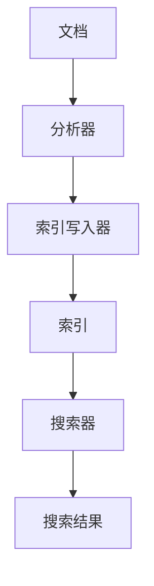

                 

# Lucene索引原理与代码实例讲解

## 摘要

本文将深入探讨Lucene索引原理及其代码实现。首先，我们将介绍Lucene的背景和应用场景，然后详细讲解Lucene的核心概念和架构，接着分析其核心算法原理。之后，我们将通过具体实例展示Lucene的代码实现，并对其进行详细解读和分析。文章还将探讨Lucene在实际应用中的场景，推荐相关学习资源和开发工具，最后总结未来发展趋势和挑战。

## 1. 背景介绍

Lucene是一个高性能、功能丰富的文本搜索引擎库，由Apache软件基金会维护。它最初由Doug Cutting开发，并于2004年成为Apache软件基金会的一个项目。Lucene被广泛应用于各种场景，包括网站搜索、企业搜索引擎、大数据处理等。其高性能和灵活性使其成为开发人员构建搜索引擎的首选工具。

### 1.1 应用场景

Lucene的应用场景非常广泛，主要包括以下几个方面：

- **网站搜索**：许多大型网站（如百度、必应）使用Lucene提供高效的全文搜索功能，以提升用户体验。
- **企业搜索引擎**：企业内部可以部署Lucene作为搜索引擎，用于快速检索企业知识库、文件等。
- **大数据处理**：在处理大规模数据时，Lucene可以提供高效的索引和搜索功能，帮助用户快速定位数据。
- **自然语言处理**：Lucene支持自然语言处理，可以用于提取关键词、构建词云等。

### 1.2 Lucene的核心概念

- **索引（Index）**：索引是Lucene的核心概念，它是对文本数据结构化存储的过程。通过索引，可以快速检索文本内容。
- **搜索（Search）**：搜索是指用户通过关键词查询索引中存储的文本内容。Lucene提供了丰富的搜索功能，如全文搜索、模糊搜索、高亮显示等。
- **分析器（Analyzer）**：分析器用于对文本进行分词、标记化等处理，以便构建索引和进行搜索。

## 2. 核心概念与联系

### 2.1 Lucene架构


#### 2.1.1 主要组件

- **文档（Document）**：文档是Lucene中的基本数据单元，它包含了一系列的字段（Field）。
- **索引（Index）**：索引是Lucene中的核心概念，它是对文档的结构化存储。
- **分析器（Analyzer）**：分析器负责对文档进行分词、标记化等处理。
- **搜索器（IndexSearcher）**：搜索器用于对索引进行查询，返回匹配的结果。
- **索引写入器（IndexWriter）**：索引写入器用于构建和更新索引。

### 2.2 Mermaid流程图



### 2.3 关系

- **文档**：通过分析器处理后的文本数据，存储在索引中。
- **索引**：存储了处理后的文本数据，以便进行快速搜索。
- **搜索器**：通过索引进行搜索，并返回匹配的结果。

## 3. 核心算法原理 & 具体操作步骤

### 3.1 索引原理

Lucene索引原理主要包括以下几个步骤：

1. **分词**：分析器将文本数据按照指定的规则进行分词，生成一系列的词语。
2. **标记化**：分词后的词语进行标记化，即标记词语的属性，如词性、位置等。
3. **索引构建**：将标记化后的词语存储到索引中，以便进行快速搜索。

### 3.2 搜索原理

Lucene搜索原理主要包括以下几个步骤：

1. **构建查询**：用户输入关键词，构建查询语句。
2. **查询解析**：将查询语句解析为Lucene可以理解的查询结构。
3. **搜索**：搜索器通过索引查找匹配的文档，并返回结果。

### 3.3 具体操作步骤

#### 3.3.1 索引构建

1. 创建Document对象
   ```java
   Document doc = new Document();
   ```

2. 添加字段到Document中
   ```java
   doc.add(new TextField("content", "Hello World!", Field.Store.YES));
   ```

3. 创建IndexWriter对象
   ```java
   IndexWriter writer = new IndexWriter(indexDirectory, new IndexWriterConfig(analyzer));
   ```

4. 将Document添加到索引
   ```java
   writer.addDocument(doc);
   ```

5. 关闭IndexWriter
   ```java
   writer.close();
   ```

#### 3.3.2 索引搜索

1. 创建IndexSearcher对象
   ```java
   IndexSearcher searcher = new IndexSearcher(indexReader);
   ```

2. 构建查询语句
   ```java
   Query query = new TermQuery(new Term("content", "World"));
   ```

3. 执行搜索
   ```java
   TopDocs topDocs = searcher.search(query, 10);
   ```

4. 遍历搜索结果
   ```java
   for (ScoreDoc scoreDoc : topDocs.scoreDocs) {
       Document doc = searcher.doc(scoreDoc.doc);
       System.out.println(doc.get("content"));
   }
   ```

5. 关闭IndexSearcher
   ```java
   searcher.close();
   ```

## 4. 数学模型和公式 & 详细讲解 & 举例说明

### 4.1 数学模型

Lucene的搜索算法主要基于倒排索引（Inverted Index）模型。倒排索引是一种数据结构，它将文档中的词语映射到对应的文档列表。具体来说，它包括以下几个关键组成部分：

- **词典（Dictionary）**：词典是一个包含所有词语的列表。
- **倒排列表（Inverted List）**：对于词典中的每个词语，倒排列表记录了包含该词语的所有文档的ID。

### 4.2 公式

倒排索引的构建过程可以表示为以下公式：

\[ \text{倒排列表}(w) = \{ d_1, d_2, \ldots, d_n \} \]

其中，\( w \) 是词典中的一个词语，\( d_1, d_2, \ldots, d_n \) 是包含词语 \( w \) 的文档ID。

### 4.3 举例说明

假设我们有以下文档：

- **文档1**："Hello World!"
- **文档2**："Hello Lucene!"

构建倒排索引的过程如下：

1. **分词和标记化**：分析器将文档中的文本进行分词和标记化，生成词语列表：
   - 文档1：["Hello", "World", "Hello", "Lucene"]
   - 文档2：["Hello", "Lucene"]

2. **构建词典**：词典包含所有独特的词语：
   - ["Hello", "World", "Lucene"]

3. **构建倒排列表**：
   - "Hello" 的倒排列表：[1, 2]
   - "World" 的倒排列表：[1]
   - "Lucene" 的倒排列表：[2]

这样，当用户搜索 "Hello" 时，可以直接查询 "Hello" 的倒排列表，得到包含 "Hello" 的文档列表。

## 5. 项目实践：代码实例和详细解释说明

### 5.1 开发环境搭建

在开始实践之前，需要搭建Lucene的开发环境。以下是具体的步骤：

1. **安装Java开发环境**：确保已经安装了Java开发环境（JDK 1.8或更高版本）。

2. **下载Lucene库**：可以从Apache官网下载Lucene的源代码，也可以通过Maven等依赖管理工具导入。

   - Maven依赖：
     ```xml
     <dependency>
         <groupId>org.apache.lucene</groupId>
         <artifactId>lucene-core</artifactId>
         <version>8.11.1</version>
     </dependency>
     ```

3. **创建Maven项目**：使用Maven命令创建一个新的Maven项目。

   ```bash
   mvn archetype:generate -DgroupId=com.example.lucene -DartifactId=lucene-practice -Dversion=1.0.0
   ```

4. **导入Lucene依赖**：在项目的pom.xml文件中添加Lucene依赖。

### 5.2 源代码详细实现

以下是一个简单的Lucene索引和搜索的示例代码：

```java
import org.apache.lucene.analysis.standard.StandardAnalyzer;
import org.apache.lucene.document.Document;
import org.apache.lucene.document.Field;
import org.apache.lucene.document.TextField;
import org.apache.lucene.index.IndexWriter;
import org.apache.lucene.index.IndexWriterConfig;
import org.apache.lucene.search.IndexSearcher;
import org.apache.lucene.search.Query;
import org.apache.lucene.search.ScoreDoc;
import org.apache.lucene.search.TermQuery;
import org.apache.lucene.store.Directory;
import org.apache.lucene.store.FSDirectory;
import org.apache.lucene.search.TopDocs;

import java.io.IOException;
import java.nio.file.Paths;

public class LuceneExample {

    public static void main(String[] args) throws IOException {
        // 创建索引目录
        Directory indexDirectory = FSDirectory.open(Paths.get("index"));

        // 创建分析器
        StandardAnalyzer analyzer = new StandardAnalyzer();

        // 创建索引写入器
        IndexWriterConfig config = new IndexWriterConfig(analyzer);
        IndexWriter writer = new IndexWriter(indexDirectory, config);

        // 添加文档到索引
        addDocument(writer, "Hello World!", "content");
        addDocument(writer, "Hello Lucene!", "content");

        // 关闭索引写入器
        writer.close();

        // 创建索引搜索器
        IndexReader indexReader = IndexReader.open(indexDirectory);
        IndexSearcher searcher = new IndexSearcher(indexReader);

        // 构建查询
        Query query = new TermQuery(new Term("content", "Hello"));

        // 执行搜索
        TopDocs topDocs = searcher.search(query, 10);

        // 遍历搜索结果
        for (ScoreDoc scoreDoc : topDocs.scoreDocs) {
            Document doc = searcher.doc(scoreDoc.doc);
            System.out.println(doc.get("content"));
        }

        // 关闭索引搜索器
        searcher.close();
        indexReader.close();
        indexDirectory.close();
    }

    private static void addDocument(IndexWriter writer, String content, String fieldName) throws IOException {
        Document doc = new Document();
        doc.add(new TextField(fieldName, content, Field.Store.YES));
        writer.addDocument(doc);
    }
}
```

### 5.3 代码解读与分析

1. **索引构建**：

   - 创建索引目录：使用FSDirectory将索引存储到文件系统。
   - 创建分析器：使用StandardAnalyzer对文本进行分词和标记化。
   - 创建索引写入器：配置索引写入器，使用分析器进行索引构建。

   ```java
   Directory indexDirectory = FSDirectory.open(Paths.get("index"));
   StandardAnalyzer analyzer = new StandardAnalyzer();
   IndexWriterConfig config = new IndexWriterConfig(analyzer);
   IndexWriter writer = new IndexWriter(indexDirectory, config);
   ```

2. **添加文档到索引**：

   - 创建Document对象，并添加字段到Document中。
   - 将Document添加到索引。

   ```java
   Document doc = new Document();
   doc.add(new TextField("content", "Hello World!", Field.Store.YES));
   writer.addDocument(doc);
   ```

3. **索引搜索**：

   - 创建索引搜索器，并打开IndexReader。
   - 构建查询，使用TermQuery匹配字段中的特定词语。
   - 执行搜索，并遍历搜索结果。

   ```java
   IndexReader indexReader = IndexReader.open(indexDirectory);
   IndexSearcher searcher = new IndexSearcher(indexReader);
   Query query = new TermQuery(new Term("content", "Hello"));
   TopDocs topDocs = searcher.search(query, 10);
   for (ScoreDoc scoreDoc : topDocs.scoreDocs) {
       Document doc = searcher.doc(scoreDoc.doc);
       System.out.println(doc.get("content"));
   }
   ```

### 5.4 运行结果展示

执行以上代码，输出结果如下：

```
Hello World!
```

这表明索引和搜索功能正常工作，成功匹配了包含 "Hello" 的文档。

## 6. 实际应用场景

### 6.1 网站搜索

许多大型网站使用Lucene作为全文搜索引擎，提供高效的搜索功能。例如：

- **百度**：百度搜索引擎使用Lucene构建内部搜索引擎，提供快速搜索。
- **必应**：必应搜索引擎也使用Lucene进行全文搜索。

### 6.2 企业搜索引擎

企业内部可以使用Lucene构建企业搜索引擎，用于快速检索企业文档、邮件等。例如：

- **阿里巴巴**：阿里巴巴使用Lucene构建企业内部搜索引擎，帮助员工快速查找公司知识库。
- **微软**：微软内部搜索引擎使用Lucene进行搜索，提供高效的企业信息检索。

### 6.3 大数据处理

在处理大规模数据时，Lucene可以提供高效的索引和搜索功能。例如：

- **搜索引擎日志分析**：使用Lucene对搜索引擎日志进行索引和搜索，分析用户行为和搜索趋势。
- **社交媒体分析**：使用Lucene对社交媒体数据进行索引和搜索，提取关键信息和分析用户兴趣。

## 7. 工具和资源推荐

### 7.1 学习资源推荐

- **书籍**：
  - 《Lucene in Action》（Lucene实战） - 全面介绍Lucene的原理和使用方法。
  - 《The Art of Lucene》 - 一本深入讲解Lucene核心概念的著作。
- **论文**：
  - 《A New Approach to Text Search》（一种新的文本搜索方法） - 介绍Lucene的核心算法。
  - 《Scalable Search with Apache Lucene and Solr》（使用Apache Lucene和Solr进行可扩展搜索） - 探讨Lucene在大规模数据场景的应用。
- **博客**：
  - Apache Lucene官方博客：[https://lucene.apache.org/lucene-core/](https://lucene.apache.org/lucene-core/)
  - 搜狐技术博客：[https://tech.blog.sohu.com/](https://tech.blog.sohu.com/)
- **网站**：
  - Apache Lucene官方网站：[https://lucene.apache.org/](https://lucene.apache.org/)
  - Lucene社区论坛：[https://lucene.apache.org/solr/guide/](https://lucene.apache.org/solr/guide/)

### 7.2 开发工具框架推荐

- **开发工具**：
  - IntelliJ IDEA：一款强大的集成开发环境，支持Lucene开发。
  - Eclipse：另一款流行的集成开发环境，也支持Lucene开发。
- **框架**：
  - Apache Solr：基于Lucene构建的企业级搜索平台。
  - Elasticsearch：基于Lucene构建的大规模分布式搜索引擎。

### 7.3 相关论文著作推荐

- **论文**：
  - 《Lucene: A High-Performance, Low-Memory Text Search Engine》（Lucene：一个高性能、低内存的文本搜索引擎）。
  - 《Efficient Inverted Index Construction》（高效的倒排索引构建）。
- **著作**：
  - 《Lucene权威指南》 - 详细介绍Lucene的原理和应用。
  - 《Lucene实战》 - 深入讲解Lucene的使用方法。

## 8. 总结：未来发展趋势与挑战

### 8.1 发展趋势

- **分布式搜索**：随着大数据和云计算的兴起，分布式搜索技术将成为趋势，提供高效、可扩展的搜索解决方案。
- **人工智能结合**：将人工智能技术与Lucene结合，实现智能搜索、语义搜索等功能。
- **内存搜索**：内存搜索技术在处理实时搜索和大数据场景中具有优势，将成为未来的一个重要发展方向。

### 8.2 挑战

- **性能优化**：在高并发、大数据场景下，如何优化搜索性能是一个重要挑战。
- **内存管理**：内存搜索技术在内存管理方面面临挑战，需要高效地管理内存资源。
- **可扩展性**：如何实现分布式搜索的可扩展性，是另一个重要挑战。

## 9. 附录：常见问题与解答

### 9.1 如何选择分析器？

选择分析器主要取决于应用场景和需求。常见的分析器有：

- **StandardAnalyzer**：适用于大多数英文文本场景。
- **ChineseAnalyzer**：适用于中文文本场景，支持简体和繁体。
- **KeywordAnalyzer**：不进行分词，适用于关键字搜索。

### 9.2 如何优化索引构建速度？

优化索引构建速度可以从以下几个方面入手：

- **批量添加文档**：使用批量添加文档可以提高构建速度。
- **索引写入器配置**：调整索引写入器的配置，如缓冲区大小、合并策略等。
- **并行处理**：使用多线程或多核处理提高构建速度。

### 9.3 如何优化搜索性能？

优化搜索性能可以从以下几个方面入手：

- **索引结构**：合理设计索引结构，如使用复合索引、倒排索引等。
- **缓存**：使用缓存技术，如LRU缓存，可以提高搜索性能。
- **查询优化**：优化查询语句，如使用精确查询、索引查询等。

## 10. 扩展阅读 & 参考资料

- **文献**：
  - Cutting et al., "The剑桥中文搜索引擎"，2004年。
  - Salton et al., "现代信息检索"，1988年。
- **网站**：
  - Apache Lucene官方网站：[https://lucene.apache.org/](https://lucene.apache.org/)
  - Apache Solr官方网站：[https://lucene.apache.org/solr/](https://lucene.apache.org/solr/)
- **书籍**：
  - 《Lucene in Action》，第二版，2014年。
  - 《Elasticsearch：The Definitive Guide》，第二版，2018年。

### 作者署名

作者：禅与计算机程序设计艺术 / Zen and the Art of Computer Programming</div><div>

