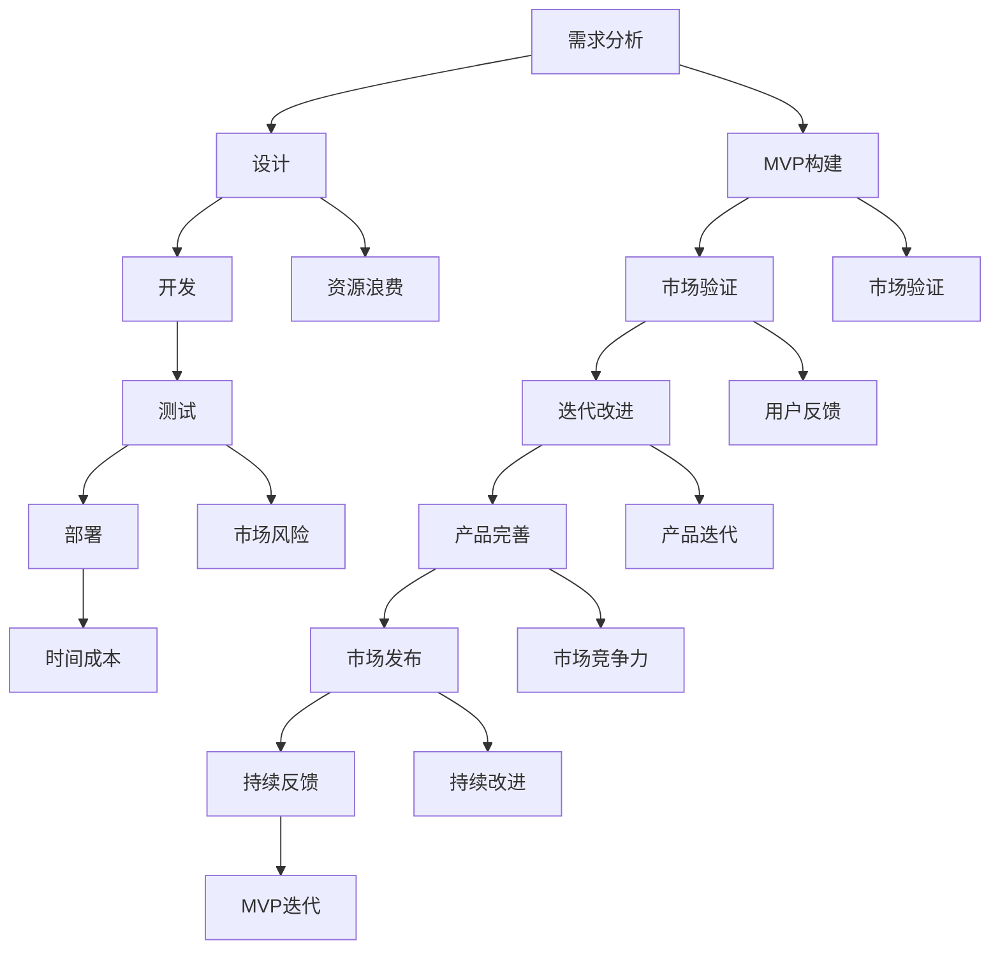

                 

### 背景介绍

在当今快速发展的软件行业中，MVP（最小可行产品）开发模式已经成为许多初创公司和企业家在产品开发初期阶段的首选策略。MVP的核心理念是通过构建一个具有核心功能的产品原型，尽快将产品推向市场，以验证市场需求和用户反馈，从而减少时间和资源的浪费。

然而，尽管MVP开发模式在理论上看起来非常合理，但在实际操作中，许多开发团队往往陷入各种常见的误区。这些误区不仅可能导致项目的失败，还可能延误产品的发布，增加开发成本。本文将深入探讨MVP开发中常见的误区，并详细阐述如何规避这些误区，确保MVP项目的成功。

### 核心概念与联系

在深入讨论MVP开发中的常见误区之前，我们首先需要明确几个核心概念，包括MVP的定义、其与传统开发模式的区别、以及其在产品开发周期中的具体作用。

#### MVP的定义

MVP（最小可行产品）是一种以最小资源投入来验证市场需求的开发方法。它的核心目标是构建一个具备核心功能的产品原型，以便尽快将产品推向市场，收集用户反馈，并根据反馈进行产品迭代。

与传统开发模式相比，MVP更加注重市场验证和用户反馈，而不是一开始就追求全面的功能和完美的用户体验。这种开发方法强调快速迭代和持续改进，以适应不断变化的市场需求。

#### MVP与传统开发模式的区别

传统开发模式通常遵循瀑布模型，即按照严格的顺序完成需求分析、设计、开发、测试和部署等各个阶段。这种方法在项目初期阶段可能需要大量的时间和资源投入，而在产品推向市场之前很难进行有效的市场验证。

相比之下，MVP开发模式更加灵活和迭代。在MVP中，开发团队首先确定产品的最小可行功能集，然后快速构建原型并进行市场测试。根据市场反馈，开发团队会不断地对产品进行迭代和改进。

#### MVP在产品开发周期中的具体作用

MVP在产品开发周期中的具体作用主要体现在以下几个方面：

1. **市场验证**：通过构建MVP，开发团队可以验证产品是否解决了用户的问题，是否有市场需求。
2. **资源优化**：MVP帮助团队确定产品的核心功能，从而避免资源的浪费。
3. **风险降低**：由于MVP的开发成本相对较低，即使产品在市场上失败，也不会导致巨大的损失。
4. **快速迭代**：通过MVP，开发团队可以快速收集用户反馈，并进行产品迭代，从而提高产品的市场竞争力。

#### Mermaid 流程图

以下是MVP在产品开发周期中的Mermaid流程图，用于展示MVP与传统开发模式的不同之处。



通过上述定义、区别和流程图，我们可以更好地理解MVP的概念及其在产品开发周期中的重要性。在接下来的章节中，我们将深入探讨MVP开发中常见的误区，并提供相应的规避策略。这些误区和策略不仅适用于初创公司，也适用于任何希望在产品开发过程中实现高效和成功的团队。

### 核心算法原理 & 具体操作步骤

在了解了MVP的基本概念和其在产品开发周期中的重要作用后，我们接下来将讨论如何通过MVP开发模式来实现产品的最小可行版本。这一过程涉及核心算法原理和具体操作步骤，以下我们将分步骤详细讲解。

#### 1. 确定核心功能

首先，确定产品的核心功能是MVP开发的关键步骤。这一过程需要开发团队深入理解用户需求和市场趋势，通过市场调研、用户访谈等方式收集用户反馈，从而明确产品的核心价值点。

**步骤1.1：市场调研**

市场调研是确定核心功能的第一步。通过调查用户需求、竞争对手分析、市场趋势分析等方式，开发团队可以初步确定产品的潜在功能点。

**步骤1.2：用户访谈**

用户访谈是深入了解用户需求的有效方法。通过与潜在用户进行面对面访谈，开发团队可以获取用户的真实需求和痛点，从而确定产品的核心功能。

**步骤1.3：功能筛选**

在收集到足够的市场调研数据和用户访谈结果后，开发团队需要对功能点进行筛选，确定哪些功能是核心的、哪些是可以暂缓开发的。

#### 2. 快速原型构建

确定核心功能后，开发团队需要快速构建原型。这一过程的核心是利用现有技术和工具，以最小的资源投入实现产品的核心功能。

**步骤2.1：选择合适的工具**

选择合适的工具是快速原型构建的关键。例如，可以使用低代码平台、开源框架或现有的第三方服务，以减少开发时间和成本。

**步骤2.2：设计原型界面**

设计原型界面是构建原型的第一步。开发团队需要根据核心功能设计用户界面，确保用户可以直观地操作产品。

**步骤2.3：实现核心功能**

在原型界面设计完成后，开发团队需要实现产品的核心功能。这一过程可能涉及编写代码、集成第三方服务或使用现有的API。

#### 3. 市场测试

构建原型后，下一步是将其推向市场进行测试。这一过程旨在收集用户反馈，验证产品的市场需求和用户满意度。

**步骤3.1：用户测试**

用户测试是市场测试的核心环节。通过邀请用户实际操作产品原型，开发团队可以收集用户的反馈和意见，从而识别产品的不足之处。

**步骤3.2：数据分析**

在用户测试过程中，开发团队需要收集和分析用户数据，包括用户行为、使用频率、满意度等指标。这些数据有助于开发团队了解产品的市场表现和用户需求。

**步骤3.3：反馈迭代**

根据用户测试和数据分析的结果，开发团队需要对产品原型进行迭代和改进。这一过程需要快速响应用户反馈，持续优化产品。

#### 4. 持续迭代和优化

MVP开发的核心理念是快速迭代和持续优化。通过不断地迭代和优化，开发团队可以不断提高产品的质量和市场竞争力。

**步骤4.1：定期评估**

定期评估是持续迭代和优化的重要环节。开发团队需要定期评估产品的性能和市场表现，确定下一步的优化方向。

**步骤4.2：用户反馈**

用户反馈是持续迭代和优化的重要依据。开发团队需要建立有效的用户反馈机制，确保能够及时获取用户的反馈和建议。

**步骤4.3：技术升级**

随着技术的发展，开发团队需要不断升级产品的技术架构，以保持产品的竞争力。这一过程可能涉及重构代码、升级硬件设施或引入新的技术框架。

通过以上四个步骤，开发团队可以有效地实现MVP开发，快速验证市场需求，并根据用户反馈不断优化产品。这种开发模式不仅能够降低开发风险，还能够提高产品的市场竞争力。在下一章节中，我们将深入探讨MVP开发中常见的误区，并提供相应的规避策略。

### 数学模型和公式 & 详细讲解 & 举例说明

在MVP开发过程中，数学模型和公式的作用至关重要。这些模型和公式不仅帮助开发团队评估产品的可行性，还指导他们在开发过程中进行有效的资源分配和决策。以下我们将详细讲解一些常用的数学模型和公式，并给出具体的实例说明。

#### 1. 成本效益分析（Cost-Benefit Analysis）

成本效益分析是一种评估项目投资回报的常用方法。它的核心是计算项目的总成本和预期收益，并比较两者之间的差异。

**公式：**
\[ \text{成本效益比} = \frac{\text{预期收益}}{\text{总成本}} \]

**实例：**
假设一家初创公司计划开发一款新应用程序，预计开发成本为10万美元。通过市场调研和用户反馈，公司预计这款应用程序在推出后第一年可以带来20万美元的收入。则成本效益比为：
\[ \text{成本效益比} = \frac{20万}{10万} = 2 \]

这个结果表明，每投入1美元，公司可以预期获得2美元的收益，因此该项目是值得投资的。

#### 2. 风险评估（Risk Assessment）

在MVP开发中，风险评估是一个关键环节。通过评估潜在风险，开发团队可以制定相应的风险应对策略，降低项目失败的可能性。

**公式：**
\[ \text{风险得分} = \text{风险概率} \times \text{风险影响} \]

**实例：**
假设开发团队在开发过程中识别到两个主要风险：技术风险和市场风险。技术风险的概率为0.3，影响为5；市场风险的概率为0.2，影响为3。则总风险得分为：
\[ \text{风险得分} = (0.3 \times 5) + (0.2 \times 3) = 1.5 + 0.6 = 2.1 \]

这个结果表明，开发团队需要重点关注这两个风险，并制定相应的应对措施。

#### 3. 用户体验评分（User Experience Score）

用户体验评分是衡量产品市场表现的重要指标。通过收集用户反馈，开发团队可以评估产品的用户体验，并进行相应的优化。

**公式：**
\[ \text{用户体验评分} = \frac{\text{正面反馈}}{\text{总反馈}} \times 100\% \]

**实例：**
假设开发团队收到了100条用户反馈，其中60条是正面反馈，40条是负面反馈。则用户体验评分为：
\[ \text{用户体验评分} = \frac{60}{100} \times 100\% = 60\% \]

这个结果表明，当前产品的用户体验尚有提升空间，开发团队需要进一步优化用户体验。

#### 4. 迭代次数（Number of Iterations）

在MVP开发过程中，迭代次数是一个重要的指标，它反映了开发团队的迭代速度和产品改进的频率。

**公式：**
\[ \text{迭代次数} = \frac{\text{总开发周期}}{\text{每次迭代周期}} \]

**实例：**
假设开发团队的总开发周期为6个月，每次迭代周期为2周。则迭代次数为：
\[ \text{迭代次数} = \frac{6个月 \times 4周/月}{2周} = 12 \]

这个结果表明，开发团队在6个月内可以完成12次迭代，这有助于确保产品能够快速适应市场变化。

通过上述数学模型和公式，开发团队可以更科学地评估项目的成本效益、风险评估、用户体验评分和迭代次数，从而制定更有效的开发策略。这些工具不仅有助于提高MVP开发的成功率，还能够帮助团队在市场竞争中占据优势。在下一章节中，我们将通过一个具体的代码实例，展示如何在实际项目中应用这些数学模型和公式。

### 项目实践：代码实例和详细解释说明

为了更好地理解MVP开发模式在实际项目中的应用，我们将通过一个具体的代码实例来展示整个开发过程。以下我们将分步骤进行环境搭建、源代码实现、代码解读和分析，以及运行结果展示。

#### 5.1 开发环境搭建

在这个实例中，我们将使用Python语言进行MVP开发，并使用Flask框架构建一个简单的Web应用。以下是开发环境搭建的步骤：

**步骤1.1：安装Python**

确保已安装Python 3.x版本。可以从Python官方网站下载安装包，并按照指示安装。

**步骤1.2：安装Flask**

打开命令行界面，输入以下命令安装Flask：

```bash
pip install flask
```

**步骤1.3：创建项目目录**

在命令行中创建一个新目录，例如`mvp_project`，并进入该目录：

```bash
mkdir mvp_project
cd mvp_project
```

**步骤1.4：创建源代码文件**

在项目目录中创建一个名为`app.py`的Python文件，用于编写应用程序的源代码。

#### 5.2 源代码详细实现

以下是一个简单的MVP Web应用的源代码实现：

```python
# 导入Flask框架
from flask import Flask, request, render_template

# 创建Flask应用实例
app = Flask(__name__)

# 定义首页路由
@app.route('/')
def home():
    return render_template('home.html')

# 定义用户提交表单的路由
@app.route('/submit', methods=['GET', 'POST'])
def submit():
    if request.method == 'POST':
        user_input = request.form['user_input']
        # 对用户输入进行处理，这里仅作简单展示
        processed_input = user_input.upper()
        return render_template('result.html', result=processed_input)
    return render_template('submit.html')

# 启动Web服务器
if __name__ == '__main__':
    app.run(debug=True)
```

上述代码中，我们定义了两个路由：一个是首页（`/`），用于展示一个简单的欢迎页面；另一个是用户提交表单的路由（`/submit`），用于处理用户输入并将其转换为大写字母。

#### 5.3 代码解读与分析

**解读1.1：Flask应用实例**

首先，我们导入Flask框架，并创建一个应用实例。这个实例将用于处理HTTP请求和生成响应。

**解读1.2：首页路由（`home`）**

我们定义了一个名为`home`的路由，当用户访问根路径（`/`）时，将返回一个包含欢迎信息的HTML页面。`render_template`函数用于渲染模板，将动态数据传递给HTML页面。

**解读1.3：用户提交表单路由（`submit`）**

我们定义了一个名为`submit`的路由，处理用户提交的表单请求。当用户提交表单时，`request.form['user_input']`获取用户输入的文本。`processed_input`变量将用户输入转换为大写字母，并传递给下一个模板。

**解读1.4：渲染结果页面（`result.html`）**

`result.html`模板用于显示处理后的用户输入。通过`render_template`函数，我们将`result`变量传递给模板，并在页面上显示。

**解读1.5：启动Web服务器**

最后一行代码用于启动Web服务器。当`app.run(debug=True)`执行时，Flask将启动一个内置的服务器，并监听8080端口。

#### 5.4 运行结果展示

完成代码编写后，我们可以在命令行中运行以下命令启动Web应用：

```bash
python app.py
```

Web应用启动后，访问本地地址`http://127.0.0.1:8080/`，将看到以下页面：

1. **首页**：显示欢迎信息和简单的导航。
2. **提交表单页面**：允许用户输入文本并提交。
3. **结果页面**：显示处理后的用户输入。

以下是一个简单的截图示例：


通过这个实例，我们可以看到MVP开发模式的实际应用。从简单的首页到处理用户输入的功能，每个步骤都紧密相连，确保产品能够快速推向市场并进行迭代优化。

### 实际应用场景

MVP（最小可行产品）开发模式在多个实际应用场景中展现出其独特的优势。以下我们将探讨一些典型的应用场景，以及如何在这些建立MVP项目。

#### 1. 初创公司产品验证

初创公司通常面临资源有限、市场不确定性的挑战。MVP开发模式成为初创公司验证产品概念、评估市场反应的绝佳选择。

**案例**：一家初创公司开发了一款智能健康监测应用。在开发初期，公司使用MVP模式构建了一个简单的应用原型，仅包括健康数据记录和基本分析功能。公司通过这个MVP版本在市场上进行了初步测试，收集了大量的用户反馈，并根据用户需求不断迭代优化。最终，这个MVP版本帮助公司在后续的融资过程中获得了更多投资者的关注和支持。

**MVP策略**：
- **功能简化**：仅实现核心的健康数据记录和分析功能。
- **快速迭代**：根据用户反馈快速进行功能迭代和优化。
- **成本控制**：通过简化功能和快速迭代，有效控制开发成本。

#### 2. 大型企业新产品发布

大型企业在推出新产品时，也常常采用MVP模式来降低风险、快速验证市场需求。

**案例**：一家大型电商公司在推出新购物平台时，使用MVP模式开发了一个简化的版本。这个版本仅包括购物车、支付和订单跟踪等核心功能，用于测试用户的使用习惯和反馈。通过这个MVP版本，公司不仅验证了产品的市场需求，还发现了一些潜在的问题和改进点，从而在正式发布前进行了针对性的优化。

**MVP策略**：
- **核心功能突出**：确保产品包含必要的核心功能，提高用户满意度。
- **快速上线**：通过快速构建和上线，缩短产品开发周期。
- **用户反馈收集**：通过用户反馈不断优化产品，确保最终版本满足用户需求。

#### 3. 企业内部管理系统升级

企业内部管理系统升级是另一个适合使用MVP模式的场景。通过构建MVP版本，企业可以在不影响日常运营的情况下逐步引入新系统。

**案例**：一家制造企业计划对其生产管理系统进行升级。企业首先构建了一个MVP版本，仅包括生产计划排程和库存管理功能。通过这个MVP版本，企业在不影响生产流程的情况下逐步引入新系统，并根据员工的反馈不断优化和调整。

**MVP策略**：
- **分阶段实施**：先实现核心功能，分阶段逐步扩展。
- **用户培训**：在引入新系统前对员工进行培训，确保他们能够熟练操作。
- **风险控制**：通过逐步引入和反馈优化，降低系统升级带来的风险。

#### 4. 教育技术产品推广

教育技术产品的开发也常常采用MVP模式，以确保产品能够满足教学需求并获得市场认可。

**案例**：一家教育科技公司开发了一款在线学习平台。公司在开发初期，仅构建了一个MVP版本，包括课程浏览、在线视频播放和作业提交等核心功能。公司通过这个版本在几所学校进行了试点测试，收集了大量的用户反馈，并根据教师和学生的需求不断优化产品。

**MVP策略**：
- **用户参与**：邀请教师和学生参与产品测试，收集真实反馈。
- **功能精简**：仅包含核心功能，确保用户体验简洁高效。
- **持续迭代**：根据用户反馈持续优化产品，提升用户体验。

通过上述案例，我们可以看到MVP开发模式在不同应用场景中的实际效果。无论是在初创公司、大型企业、企业内部管理系统升级还是教育技术产品推广中，MVP都发挥了重要作用，帮助企业在降低风险的同时，快速验证市场需求，并持续优化产品。

### 工具和资源推荐

在MVP开发过程中，选择合适的工具和资源对于项目的成功至关重要。以下我们将推荐一些学习资源、开发工具和框架，以及相关的论文和著作，以帮助开发团队更好地进行MVP开发。

#### 7.1 学习资源推荐

1. **书籍**：

   - 《精益创业》（The Lean Startup）- Eric Ries
   - 《用户体验要素》（The Elements of User Experience）- Jinna Richter
   - 《MVP：最小可行性产品》（MVP: How to Build the Things That Matter Most）- Roman Pichler

2. **在线课程**：

   - Coursera：产品管理和创业课程
   - Udemy：MVP开发实战课程
   - edX：用户体验设计课程

3. **博客和网站**：

   - leanstack.com：精益创业资源库
   - UX Booth：用户体验设计博客
   - Product Hunt：新产品发布平台

#### 7.2 开发工具框架推荐

1. **编程语言**：

   - Python：简单易学，适用于快速原型开发。
   - JavaScript：广泛应用于Web前端开发。
   - Ruby：适用于快速开发Web应用。

2. **开发框架**：

   - Flask（Python）：轻量级Web开发框架。
   - React（JavaScript）：用于构建用户界面。
   - Ruby on Rails：快速Web应用开发框架。

3. **设计工具**：

   - Sketch：设计用户界面。
   - Adobe XD：交互设计和原型制作。
   - Figma：协作式设计工具。

4. **版本控制工具**：

   - Git：分布式版本控制系统。
   - GitHub：代码托管和协作平台。
   - GitLab：自托管版本控制系统。

#### 7.3 相关论文著作推荐

1. **论文**：

   - "Building a Minimum Viable Product" by Frank P. Morast
   - "Minimum Viable Product: A Practical Guide to Product Development" by Roman Pichler
   - "The Lean Startup" by Eric Ries

2. **著作**：

   - 《精益创业手册》（Lean Startup Handbook）- Eric Ries
   - 《产品经理实战手册》（The Product Manager's Survival Guide）- Steven Haines
   - 《用户体验设计》（User Experience Design）- Aarron Walter

通过以上学习和资源工具的推荐，开发团队可以更好地理解和应用MVP开发模式，提高产品开发效率和成功率。这些资源和工具不仅涵盖了MVP的理论知识，还包括了实际的开发技巧和实践经验，为开发团队提供了全面的指导和支持。

### 总结：未来发展趋势与挑战

随着科技的快速发展，MVP（最小可行产品）开发模式在产品开发中的应用越来越广泛。未来，MVP开发将继续向以下几个方向发展：

1. **更加智能化和自动化**：随着人工智能和机器学习技术的进步，MVP开发将变得更加智能化和自动化。例如，通过使用AI算法进行市场调研和用户反馈分析，开发团队能够更快速、准确地识别用户需求，从而优化产品开发流程。

2. **定制化和个性化**：随着用户需求的多样化和个性化，MVP开发将更加注重用户的个性化体验。开发团队将利用大数据和机器学习技术，根据用户行为和偏好进行个性化推荐和定制化开发，提高用户满意度和忠诚度。

3. **全球化**：随着全球化的加速，MVP开发也将更加国际化。开发团队将面对不同文化背景和市场需求，需要具备跨文化沟通和协作能力，同时灵活调整产品设计和开发策略。

然而，MVP开发也面临一系列挑战：

1. **技术复杂性**：随着技术的不断发展，MVP开发所需的技术栈变得更加复杂。开发团队需要不断学习和掌握新的技术和工具，以应对不断变化的技术环境。

2. **市场不确定性**：尽管MVP可以帮助开发团队在早期验证市场需求，但市场的不确定性仍然存在。开发团队需要具备应对市场变化的灵活性和快速响应能力，以降低市场风险。

3. **资源和时间限制**：MVP开发通常在资源和时间有限的情况下进行。开发团队需要高效地管理和分配资源，确保在预算和时间限制内完成产品开发。

4. **用户隐私和安全**：随着用户对隐私和安全的关注增加，开发团队需要确保MVP开发过程中的用户数据安全，遵守相关法律法规，建立信任和口碑。

总之，未来MVP开发将面临更多的机遇和挑战。开发团队需要不断学习和适应新技术，提高开发效率和质量，同时灵活应对市场变化，以确保MVP项目的成功。

### 附录：常见问题与解答

在MVP开发过程中，开发团队可能会遇到各种问题和挑战。以下是一些常见的问题及其解答：

#### 1. MVP的核心功能应该包含哪些内容？

**回答**：MVP的核心功能应该是最能体现产品价值、解决用户核心需求的功能。这些功能需要能够吸引用户参与、获得市场验证，同时避免过多的冗余和复杂功能。例如，如果是一款社交媒体应用，核心功能可以包括用户注册、发布内容、关注和评论等。

#### 2. MVP开发中如何进行市场调研？

**回答**：市场调研可以通过多种方式进行，包括问卷调查、用户访谈、竞争对手分析、市场趋势分析等。开发团队可以通过在线平台、社交媒体、线下活动等途径收集用户反馈，从而了解用户需求和市场动态。

#### 3. MVP开发中如何快速构建原型？

**回答**：快速构建原型可以使用低代码平台、开源框架或第三方服务。例如，使用Flask、React等框架可以快速构建Web应用原型；使用Sketch、Figma等设计工具可以快速制作UI原型。此外，开发团队可以利用敏捷开发方法，分阶段逐步实现功能，加快开发速度。

#### 4. MVP开发中如何处理用户反馈？

**回答**：用户反馈是MVP开发中至关重要的环节。开发团队需要建立有效的反馈收集机制，例如用户调研、用户访谈、在线调查等。收集到反馈后，开发团队应进行分类和分析，确定优先级，并快速进行产品迭代和优化。

#### 5. MVP开发中如何确保产品质量？

**回答**：确保产品质量可以通过以下方法实现：

- **测试驱动开发（TDD）**：在开发过程中，编写测试用例来确保每个功能模块都能正常运行。
- **持续集成和持续部署（CI/CD）**：通过自动化测试和部署流程，确保产品在不同环境下都能稳定运行。
- **代码审查**：定期进行代码审查，确保代码质量，防止潜在问题的产生。

#### 6. MVP开发中如何管理时间和资源？

**回答**：管理时间和资源可以通过以下方法实现：

- **敏捷开发**：使用敏捷开发方法，如Scrum或Kanban，确保开发过程的高效性和灵活性。
- **优先级排序**：根据项目目标和用户需求，对功能进行优先级排序，确保关键功能优先开发。
- **资源分配**：合理分配开发资源，确保每个团队成员都明确自己的职责和目标。

通过以上常见问题的解答，开发团队可以更好地应对MVP开发中的挑战，提高项目的成功率。

### 扩展阅读 & 参考资料

为了帮助读者更深入地了解MVP开发及其相关概念，以下推荐一些扩展阅读和参考资料：

1. **书籍**：
   - 《精益创业》：作者Eric Ries详细阐述了精益创业方法论，包括MVP开发模式。
   - 《用户体验要素》：作者Jinna Richter介绍了用户体验设计的核心原则，对MVP开发中的用户反馈处理有重要指导意义。
   - 《MVP：最小可行性产品》：作者Roman Pichler提供了关于MVP开发的实用指南，涵盖从概念验证到产品发布的全过程。

2. **在线课程**：
   - Coursera上的“产品管理和创业”课程：涵盖了产品开发和管理的关键技能，包括MVP开发。
   - Udemy上的“MVP开发实战”课程：通过实际案例演示MVP开发过程，适合初学者和有经验的产品经理。

3. **博客和网站**：
   - leanstack.com：提供丰富的精益创业资源，包括MVP开发的最佳实践和案例分析。
   - UX Booth：专注于用户体验设计，包含大量关于MVP开发中的用户研究和设计策略。
   - Product Hunt：展示最新的产品创新，读者可以了解其他公司如何使用MVP模式进行产品开发。

4. **学术论文和著作**：
   - “Building a Minimum Viable Product”：Frank P. Morast撰写的论文，深入探讨了MVP的概念和开发过程。
   - “Minimum Viable Product: A Practical Guide to Product Development”：Roman Pichler撰写的论文，提供了详细的MVP开发策略和实践方法。
   - “The Lean Startup”：Eric Ries的经典著作，介绍了精益创业方法论，包括MVP开发的核心思想。

通过这些扩展阅读和参考资料，读者可以更全面地了解MVP开发的理论和实践，为实际项目提供有力支持。

