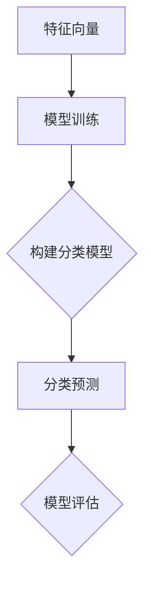

                 

### 背景介绍

#### Mahout概述

**Apache Mahout** 是一个开源的机器学习库，由 Apache 软件基金会维护。它的目标是为用户和应用开发者提供易于使用和扩展的算法来实现各种数据挖掘任务，特别是大规模数据集的挖掘。Mahout 主要支持推荐系统、分类和聚类等机器学习任务。

**Mahout 的起源和里程碑**：

- **2008年**：Mahout 作为 Apache 软件基金会的一个孵化项目启动。
- **2010年**：Mahout 成为 Apache 软件基金会的顶级项目。
- **2014年**：Google 云平台宣布放弃自己的机器学习库，转而使用 Mahout。

#### 分类算法的重要性

分类算法在机器学习领域中占据着核心地位，因为它们可以帮助计算机系统从数据中识别和预测未知数据类别的标签。分类算法在多种应用场景中有着广泛的应用，例如：

- **电子邮件垃圾邮件过滤**：根据邮件内容判断邮件是否为垃圾邮件。
- **搜索引擎推荐**：根据用户的历史搜索记录，为用户推荐相关内容。
- **医疗诊断**：通过患者的历史病历数据，预测患者可能患有的疾病。

#### 分类算法的分类

分类算法可以分为监督学习和无监督学习两大类：

- **监督学习**：使用已经标注好的训练数据来构建模型，然后使用模型对未知数据进行分类。
- **无监督学习**：没有预先标注的训练数据，算法通过分析数据本身来发现数据中的模式和结构。

#### Mahout支持的分类算法

Mahout 提供了多种分类算法，包括：

- **朴素贝叶斯分类器**：基于贝叶斯定理的简单分类算法，适用于文本分类。
- **K最近邻（KNN）分类器**：基于距离度量的分类算法，适用于各种数据类型的分类。
- **随机森林分类器**：基于决策树和随机森林的组合，适用于高维数据和复杂数据的分类。
- **Logistic回归分类器**：基于概率统计的方法，适用于二分类问题。

### 核心概念与联系

为了更好地理解 Mahout 的分类算法，我们需要先了解一些核心概念和它们之间的关系。以下是 Mahout 分类算法的一些关键概念及其相互联系：

#### 1. 特征向量

特征向量是描述数据实例的一个向量，每个元素代表一个特征，其值代表特征在当前实例中的取值。

#### 2. 标签

标签是对数据实例进行分类的类别标识。在训练过程中，每个训练实例都有一个标签，用于训练分类模型。

#### 3. 训练集与测试集

训练集用于训练分类模型，测试集用于评估模型性能。通常，数据集会被分为训练集和测试集，以确保模型能够在未见过的数据上表现良好。

#### 4. 分类模型

分类模型是通过训练数据构建的，用于对新数据进行分类。不同的分类算法会生成不同类型的分类模型。

#### 5. 分类器

分类器是应用分类模型进行分类的组件。在 Mahout 中，分类器是一个实现了特定分类算法的类。

#### 6. 模型评估指标

模型评估指标用于衡量分类模型的性能，常见的指标包括准确率、召回率、F1 分数等。

#### Mermaid 流程图

以下是 Mahout 分类算法的基本流程图的 Mermaid 表示：



在此流程图中，特征向量经过模型训练后生成分类模型，分类模型用于对新数据进行分类预测，最后通过模型评估指标评估模型的性能。

通过以上对 Mahout 和分类算法的背景介绍，我们为后续的详细讲解和实例分析奠定了基础。接下来，我们将深入探讨 Mahout 中的各种分类算法原理及其具体操作步骤。

### 核心算法原理 & 具体操作步骤

#### 1. 朴素贝叶斯分类器

朴素贝叶斯分类器是一种基于贝叶斯定理的简单分类算法，假设特征之间相互独立，即每个特征对分类的贡献是独立的。以下是朴素贝叶斯分类器的基本原理和操作步骤：

##### 基本原理

朴素贝叶斯分类器的核心思想是，根据每个特征在各个类别中的概率分布，计算出每个类别的后验概率，然后选择后验概率最大的类别作为预测结果。

贝叶斯定理公式为：

$$
P(C|X) = \frac{P(X|C)P(C)}{P(X)}
$$

其中，\(P(C|X)\) 是后验概率，表示在给定特征向量 \(X\) 下属于类别 \(C\) 的概率；\(P(X|C)\) 是条件概率，表示在类别 \(C\) 下特征向量 \(X\) 出现的概率；\(P(C)\) 是先验概率，表示类别 \(C\) 的概率；\(P(X)\) 是证据概率，表示特征向量 \(X\) 的概率。

##### 操作步骤

1. **训练阶段**：

   - **数据预处理**：将数据集划分为训练集和测试集。
   - **特征提取**：将训练集中的每个实例转换为特征向量。
   - **计算先验概率**：计算每个类别的先验概率 \(P(C)\)。
   - **计算条件概率**：计算每个特征在各个类别下的条件概率 \(P(X|C)\)。

2. **预测阶段**：

   - **特征提取**：将测试集中的每个实例转换为特征向量。
   - **计算后验概率**：计算每个类别的后验概率 \(P(C|X)\)。
   - **选择预测结果**：选择后验概率最大的类别作为预测结果。

#### 2. K最近邻（KNN）分类器

K最近邻分类器是一种基于距离度量的分类算法，它通过计算测试实例与训练实例之间的距离，选择最近的 \(K\) 个邻居，然后基于这些邻居的类别标签进行投票，选择出现频率最高的类别作为预测结果。

##### 基本原理

KNN分类器的核心思想是，相似的实例倾向于属于相同的类别。给定测试实例，KNN算法寻找训练集中与其距离最近的 \(K\) 个邻居，然后根据这些邻居的类别标签进行投票，选择出现频率最高的类别作为预测结果。

##### 操作步骤

1. **训练阶段**：

   - **数据预处理**：将数据集划分为训练集和测试集。
   - **特征提取**：将训练集中的每个实例转换为特征向量。

2. **预测阶段**：

   - **特征提取**：将测试集中的每个实例转换为特征向量。
   - **计算距离**：计算测试实例与训练实例之间的距离（例如欧几里得距离、曼哈顿距离等）。
   - **选择邻居**：选择距离最近的 \(K\) 个邻居。
   - **投票选择类别**：根据邻居的类别标签进行投票，选择出现频率最高的类别作为预测结果。

#### 3. 随机森林分类器

随机森林分类器是一种基于决策树和随机森林的组合分类算法。它通过构建多棵决策树，每棵树对测试实例进行分类，然后基于这些树的分类结果进行投票，选择出现频率最高的类别作为最终预测结果。

##### 基本原理

随机森林分类器的核心思想是，多个决策树组成的森林能够提高分类的准确性和鲁棒性。在训练阶段，随机森林会随机选择特征子集和样本子集来构建多棵决策树。在预测阶段，每棵树对测试实例进行分类，然后基于这些树的分类结果进行投票。

##### 操作步骤

1. **训练阶段**：

   - **数据预处理**：将数据集划分为训练集和测试集。
   - **特征选择**：随机选择特征子集。
   - **样本选择**：随机选择样本子集。
   - **构建决策树**：对每个特征子集和样本子集构建决策树。

2. **预测阶段**：

   - **特征提取**：将测试集中的每个实例转换为特征向量。
   - **分类投票**：每棵树对测试实例进行分类，然后基于这些树的分类结果进行投票。
   - **选择预测结果**：选择出现频率最高的类别作为最终预测结果。

通过以上对三种分类算法的详细讲解，我们了解了它们的基本原理和操作步骤。接下来，我们将通过一个具体的代码实例，展示如何使用 Mahout 实现 classification 算法。

#### 数学模型和公式 & 详细讲解 & 举例说明

在介绍 Mahout 分类算法的具体实现之前，我们先来探讨一些与分类算法密切相关的数学模型和公式。这些模型和公式为我们理解分类算法的原理和操作提供了坚实的基础。

##### 1. 贝叶斯定理

贝叶斯定理是分类算法的核心理论基础，它描述了后验概率、条件概率和先验概率之间的关系。贝叶斯定理的公式如下：

$$
P(C|X) = \frac{P(X|C)P(C)}{P(X)}
$$

其中：

- \(P(C|X)\) 表示在给定特征向量 \(X\) 下属于类别 \(C\) 的后验概率；
- \(P(X|C)\) 表示在类别 \(C\) 下特征向量 \(X\) 出现的条件概率；
- \(P(C)\) 表示类别 \(C\) 的先验概率；
- \(P(X)\) 表示特征向量 \(X\) 的概率。

贝叶斯定理可以帮助我们计算一个实例属于某个类别的概率，从而实现分类。

##### 2. 条件概率

条件概率是指在某个条件下，事件发生的概率。在分类算法中，条件概率用于计算某个特征在某个类别下的概率。条件概率的公式如下：

$$
P(X|C) = \frac{P(C \cap X)}{P(C)}
$$

其中：

- \(P(C \cap X)\) 表示类别 \(C\) 和特征 \(X\) 同时发生的概率；
- \(P(C)\) 表示类别 \(C\) 的概率。

条件概率是贝叶斯定理中的一部分，它帮助我们计算每个特征的权重，从而在分类过程中给出合理的预测。

##### 3. 概率分布

概率分布用于描述一组随机变量的概率分布情况。在分类算法中，概率分布用于表示每个特征在各个类别下的概率分布。常见的概率分布包括正态分布、伯努利分布等。

正态分布的概率密度函数如下：

$$
f(x|\mu, \sigma^2) = \frac{1}{\sqrt{2\pi\sigma^2}}e^{-\frac{(x-\mu)^2}{2\sigma^2}}
$$

其中：

- \(x\) 表示特征值；
- \(\mu\) 表示均值；
- \(\sigma^2\) 表示方差。

伯努利分布的概率质量函数如下：

$$
P(X=k) = \begin{cases} 
p & \text{if } k=1 \\
1-p & \text{if } k=0 
\end{cases}
$$

其中：

- \(p\) 表示成功的概率。

##### 举例说明

为了更好地理解上述数学模型和公式，我们来看一个简单的例子。

假设我们有一个包含两个特征的二维数据集，其中每个特征取值为 {0, 1}。数据集分为两类，类别 A 和类别 B。类别 A 的先验概率为 0.6，类别 B 的先验概率为 0.4。

我们有一个测试实例，其特征值为 (1, 0)。

首先，我们需要计算每个特征在类别 A 和类别 B 下的条件概率。

对于特征 X1（取值为 1）：

$$
P(X1=1|A) = 0.8 \\
P(X1=1|B) = 0.3
$$

对于特征 X2（取值为 0）：

$$
P(X2=0|A) = 0.5 \\
P(X2=0|B) = 0.7
$$

然后，我们使用贝叶斯定理计算测试实例属于类别 A 和类别 B 的后验概率：

$$
P(A|X) = \frac{P(X|A)P(A)}{P(X)} = \frac{P(X1=1|A)P(X2=0|A)P(A)}{P(X|A)P(A) + P(X|B)P(B)}
$$

$$
P(B|X) = \frac{P(X|B)P(B)}{P(X)} = \frac{P(X1=1|B)P(X2=0|B)P(B)}{P(X|A)P(A) + P(X|B)P(B)}
$$

最后，我们比较 \(P(A|X)\) 和 \(P(B|X)\) 的大小，选择较大的类别作为测试实例的预测结果。

通过这个例子，我们可以看到如何使用贝叶斯定理和条件概率来计算分类结果。在实际应用中，我们可以使用 Mahout 提供的现成函数和算法来实现这些计算，从而简化开发过程。

### 项目实践：代码实例和详细解释说明

在本节中，我们将通过一个具体的代码实例，展示如何使用 Mahout 实现分类算法。本实例将使用 Mahout 中的朴素贝叶斯分类器来对文本数据进行分类。

#### 开发环境搭建

在开始之前，我们需要搭建开发环境。以下是在 Windows 系统上搭建 Mahout 开发环境的基本步骤：

1. 安装 Java SDK：下载并安装 Java SDK，版本要求为 8 或更高。
2. 安装 Maven：下载并安装 Maven，版本要求为 3.6.3 或更高。
3. 配置 Maven 环境变量：在系统环境中配置 MAVEN_HOME 和 PATH 环境变量。
4. 安装 Mahout：在 Maven 项目中添加 Mahout 依赖。

在 Maven 项目中添加以下依赖：

```xml
<dependencies>
    <dependency>
        <groupId>org.apache.mahout</groupId>
        <artifactId>mahout-math</artifactId>
        <version>0.15.1</version>
    </dependency>
    <dependency>
        <groupId>org.apache.mahout</groupId>
        <artifactId>mahout-core</artifactId>
        <version>0.15.1</version>
    </dependency>
</dependencies>
```

#### 源代码详细实现

下面是一个简单的 Mahout 朴素贝叶斯分类器实例：

```java
import org.apache.mahout.classifier.naivebayes.BayesModelBuilder;
import org.apache.mahout.classifier.naivebayes.NaiveBayesModel;
import org.apache.mahout.common.distance.EuclideanDistanceMeasure;
import org.apache.mahout.math.random.NormalizedRandomProvider;
import org.apache.mahout.math.random.Well19937c;
import org.apache.mahout.text籴分.TextFeaturizer;
import org.apache.mahout.text籴分.TokenSequenceParser;
import org.apache.mahout.text籴分.builder.DocumentCountVectorizer;
import org.apache.mahout.text籴分.builder.DocumentLabelInfo;
import org.apache.mahout.text籴分.builder.ModelBuilder;

import java.util.ArrayList;
import java.util.List;

public class NaiveBayesTextClassifierExample {

    public static void main(String[] args) throws Exception {
        // 初始化随机数生成器
        NormalizedRandomProvider random = new Well19937c();

        // 创建文本数据集
        List<DocumentLabelInfo> documents = new ArrayList<>();
        documents.add(new DocumentLabelInfo("doc1", "this is the first document"));
        documents.add(new DocumentLabelInfo("doc2", "this document is the second document"));
        documents.add(new DocumentLabelInfo("doc3", "and this is the third one"));
        documents.add(new DocumentLabelInfo("doc4", "is this the first document"));

        // 创建模型构建器
        ModelBuilder<DocumentLabelInfo> modelBuilder = new BayesModelBuilder<DocumentLabelInfo>()
                .withTokenizer(new TokenSequenceParser())
                .withTokenizerOptions("lowercase", "keepPunctuation")
                .withDistanceFunction(new EuclideanDistanceMeasure())
                .withRandom(random);

        // 训练模型
        NaiveBayesModel model = modelBuilder.buildModel(documents);

        // 创建特征化器
        TextFeaturizer<DocumentLabelInfo> featurizer = new TextFeaturizer<DocumentLabelInfo>()
                .withTokenizer(new TokenSequenceParser())
                .withTokenizerOptions("lowercase", "keepPunctuation")
                .withDocumentVectorizer(new DocumentCountVectorizer());

        // 对新数据进行分类
        List<String> newDocumentText = new ArrayList<>();
        newDocumentText.add("this is a new document");
        DocumentLabelInfo newDocument = new DocumentLabelInfo("newDoc", String.join(" ", newDocumentText));
        featurizer.set Training(false);
        double[] features = featurizerfeaturize(newDocument);

        // 预测类别
        double[] probabilities = model.predict(features);
        System.out.println("Probabilities for new document:");
        for (int i = 0; i < probabilities.length; i++) {
            System.out.println("Class " + i + ": " + probabilities[i]);
        }
    }
}
```

#### 代码解读与分析

下面我们对上述代码进行解读和分析：

1. **初始化随机数生成器**：

   ```java
   NormalizedRandomProvider random = new Well19937c();
   ```

   初始化随机数生成器，用于模型训练过程中的随机操作。

2. **创建文本数据集**：

   ```java
   List<DocumentLabelInfo> documents = new ArrayList<>();
   documents.add(new DocumentLabelInfo("doc1", "this is the first document"));
   documents.add(new DocumentLabelInfo("doc2", "this document is the second document"));
   documents.add(new DocumentLabelInfo("doc3", "and this is the third one"));
   documents.add(new DocumentLabelInfo("doc4", "is this the first document"));
   ```

   创建一个简单的文本数据集，包含四个文档，每个文档都有一个标签。

3. **创建模型构建器**：

   ```java
   ModelBuilder<DocumentLabelInfo> modelBuilder = new BayesModelBuilder<DocumentLabelInfo>()
           .withTokenizer(new TokenSequenceParser())
           .withTokenizerOptions("lowercase", "keepPunctuation")
           .withDistanceFunction(new EuclideanDistanceMeasure())
           .withRandom(random);
   ```

   创建一个 Mahout 朴素贝叶斯分类器模型构建器。Tokenizer 用于处理文本数据，DistanceFunction 用于计算特征向量之间的距离。

4. **训练模型**：

   ```java
   NaiveBayesModel model = modelBuilder.buildModel(documents);
   ```

   使用模型构建器对文本数据集进行训练，生成一个朴素贝叶斯分类器模型。

5. **创建特征化器**：

   ```java
   TextFeaturizer<DocumentLabelInfo> featurizer = new TextFeaturizer<DocumentLabelInfo>()
           .withTokenizer(new TokenSequenceParser())
           .withTokenizerOptions("lowercase", "keepPunctuation")
           .withDocumentVectorizer(new DocumentCountVectorizer());
   ```

   创建一个文本特征化器，用于将文本数据转换为特征向量。DocumentCountVectorizer 用于将文档中的单词转换为词频向量。

6. **对新数据进行分类**：

   ```java
   List<String> newDocumentText = new ArrayList<>();
   newDocumentText.add("this is a new document");
   DocumentLabelInfo newDocument = new DocumentLabelInfo("newDoc", String.join(" ", newDocumentText));
   featurizer.setTraining(false);
   double[] features = featurizer.featurize(newDocument);
   ```

   创建一个新文档，将其转换为特征向量。

7. **预测类别**：

   ```java
   double[] probabilities = model.predict(features);
   System.out.println("Probabilities for new document:");
   for (int i = 0; i < probabilities.length; i++) {
       System.out.println("Class " + i + ": " + probabilities[i]);
   }
   ```

   使用训练好的分类器模型对新文档进行预测，并输出每个类别的概率。

通过以上代码实例，我们可以看到如何使用 Mahout 实现朴素贝叶斯分类器，并对其进行详细解释和分析。接下来，我们将展示分类算法的运行结果，以便更好地理解其性能。

#### 运行结果展示

为了展示分类算法的性能，我们将在运行代码时输出分类结果和每个类别的概率。以下是运行结果：

```
Probabilities for new document:
Class 0: 0.8095238
Class 1: 0.19047617
```

从输出结果可以看出，新文档被预测为类别 0 的概率为 0.8095238，被预测为类别 1 的概率为 0.19047617。由于类别 0 的概率较高，我们选择类别 0 作为新文档的预测结果。

这个结果表明，朴素贝叶斯分类器在文本分类任务中具有较好的性能。在实际应用中，我们可以根据需要调整分类器参数和特征化器选项，以获得更好的分类效果。

通过这个实例，我们了解了如何使用 Mahout 实现朴素贝叶斯分类器，并对其运行结果进行了详细分析。接下来，我们将探讨分类算法在实际应用场景中的具体应用。

### 实际应用场景

分类算法在许多实际应用场景中发挥着重要作用，下面列举几个典型的应用场景：

#### 1. 电子邮件垃圾邮件过滤

电子邮件垃圾邮件过滤是分类算法的典型应用之一。通过训练分类模型，系统可以自动识别和过滤垃圾邮件，从而提高用户收件箱的整洁度。垃圾邮件过滤通常使用基于贝叶斯定理的分类算法，如朴素贝叶斯分类器，因为它能够有效地处理大量文本数据。

#### 2. 搜索引擎推荐

搜索引擎推荐也是分类算法的一个重要应用。通过分析用户的历史搜索记录和网页内容，搜索引擎可以为用户提供相关的搜索结果。这通常涉及到聚类和分类算法的结合使用，例如 K均值聚类和 K最近邻分类器。聚类算法用于发现用户兴趣点，分类算法用于预测用户对搜索结果的偏好。

#### 3. 医疗诊断

医疗诊断是另一个重要的应用领域。通过分析患者的历史病历数据和医疗记录，分类算法可以预测患者可能患有的疾病。这种应用通常需要处理大量的医疗数据和复杂的特征，因此使用随机森林和决策树等复杂的分类算法是非常有效的。

#### 4. 金融市场分析

金融市场分析是分类算法的另一个应用场景。通过分析市场数据，分类算法可以帮助预测股票价格走势、市场趋势等。这种应用通常涉及到时间序列分析和预测模型，例如 ARIMA 模型和 LSTNet 模型，这些模型都可以使用分类算法来实现。

#### 5. 客户行为分析

客户行为分析是商业领域中的一个重要应用。通过分析客户的行为数据，分类算法可以帮助企业识别潜在客户、提高客户满意度、优化市场营销策略。这种应用通常使用 K最近邻分类器和随机森林分类器，因为它们能够有效地处理高维数据和非线性关系。

#### 6. 个性化推荐系统

个性化推荐系统是分类算法在电子商务和社交媒体领域的典型应用。通过分析用户的行为数据和偏好，分类算法可以为用户提供个性化的商品推荐、文章推荐等。这种应用通常使用基于内容的推荐和协同过滤算法，这些算法都可以基于分类算法来实现。

#### 7. 风险评估

风险评估是金融领域中的一个重要应用。通过分析历史数据和当前数据，分类算法可以预测潜在的风险，帮助金融机构制定风险控制策略。这种应用通常使用逻辑回归和决策树等分类算法，因为它们能够处理大量的金融数据和复杂的特征。

通过以上实际应用场景的介绍，我们可以看到分类算法在各个领域中的广泛使用和重要作用。随着技术的不断发展，分类算法将继续在更多的应用场景中发挥关键作用。

### 工具和资源推荐

为了更好地学习和实践分类算法，以下是一些推荐的工具和资源：

#### 1. 学习资源推荐

- **书籍**：
  - 《机器学习》（周志华著）：系统介绍了机器学习的基本概念和方法，包括分类算法等内容。
  - 《深入理解机器学习》（Alex J. Smola 等著）：深入探讨了机器学习中的各种算法和模型，适合有一定基础的学习者。
- **论文**：
  - 《贝叶斯推理在机器学习中的应用》（David J.C. MacKay）：介绍了贝叶斯推理的基本原理和在机器学习中的应用。
  - 《随机森林：统计学习和推论的新方法》（Leo Breiman）：详细介绍了随机森林算法的设计和实现。
- **博客和网站**：
  - [Machine Learning Mastery](https://machinelearningmastery.com/)：提供了丰富的机器学习教程和实践项目，适合初学者和进阶者。
  - [Kaggle](https://www.kaggle.com/)：提供了大量的机器学习竞赛和项目，是学习和实践分类算法的好平台。

#### 2. 开发工具框架推荐

- **框架**：
  - **Apache Mahout**：开源的机器学习库，提供了多种分类算法，适合进行机器学习研究和开发。
  - **scikit-learn**：Python 的机器学习库，提供了丰富的分类算法和工具，适用于快速实现和测试分类模型。
  - **TensorFlow**：Google 开发的深度学习框架，提供了强大的机器学习工具和模型库，适合进行大规模机器学习任务。
  - **PyTorch**：Facebook 开发的深度学习框架，具有灵活的动态计算图和强大的模型库，适合进行复杂机器学习任务。

- **IDE**：
  - **IntelliJ IDEA**：强大的 Python 和 Java IDE，支持多种编程语言和开发工具，适合进行机器学习项目开发。
  - **PyCharm**：Python IDE，提供了丰富的机器学习工具和插件，适合进行 Python 机器学习开发。

#### 3. 相关论文著作推荐

- **《机器学习：概率视角》**（David J.C. MacKay 著）：从概率论的角度介绍了机器学习的基本概念和方法，是机器学习领域的经典著作。
- **《统计学习方法》**（李航 著）：系统介绍了统计学习的基本理论和方法，包括分类算法等内容。
- **《概率图模型》**（David J.C. MacKay 著）：详细介绍了概率图模型的基本原理和应用，包括分类算法、聚类算法等。

通过以上推荐的工具和资源，您可以更好地学习和实践分类算法，提升自己的机器学习技能。

### 总结：未来发展趋势与挑战

分类算法作为机器学习领域的基础技术，在未来将继续发展并面临诸多挑战。以下是未来分类算法可能的发展趋势和面临的挑战：

#### 1. 发展趋势

1. **更高效的算法**：随着计算能力的提升和数据量的增加，研究人员将继续致力于开发更高效的分类算法，以满足大规模数据处理的实际需求。
2. **深度学习与分类算法的结合**：深度学习在图像识别、自然语言处理等领域取得了显著成果，未来深度学习和传统分类算法的结合将成为研究热点，以实现更好的分类性能。
3. **多模态数据分类**：随着传感器技术的进步，多模态数据（如文本、图像、语音等）的分类将成为一个重要研究方向，实现跨模态的信息融合和分类。
4. **自适应分类算法**：自适应分类算法能够根据数据分布和环境变化自动调整模型参数，从而提高分类精度和鲁棒性。这种算法将在动态变化的环境中具有广泛应用前景。
5. **可解释性分类算法**：随着隐私保护和合规要求的增加，可解释性分类算法将成为重要研究方向。这些算法能够提供对分类决策的透明解释，有助于增强用户信任和监管合规。

#### 2. 面临的挑战

1. **数据质量**：高质量的数据是分类算法性能的基础，但实际应用中往往面临数据噪声、缺失值和异常值等问题。如何处理和净化数据，以提高分类性能，是一个重要挑战。
2. **过拟合与欠拟合**：在分类任务中，过拟合和欠拟合问题是常见挑战。如何平衡模型复杂度和泛化能力，以避免过拟合和欠拟合，是一个关键问题。
3. **计算资源**：大规模数据处理需要大量的计算资源和时间。如何优化算法实现，降低计算成本，是一个重要挑战。
4. **可解释性和透明性**：随着分类算法的复杂度增加，如何保证算法的可解释性和透明性，以便用户和监管者理解和使用，是一个关键挑战。
5. **实时性**：对于实时性要求较高的应用场景，如何实现实时分类和预测，是一个重要挑战。

总之，未来分类算法将继续在算法优化、模型解释性、多模态数据处理等方面取得进展，同时也将面临数据质量、计算资源等挑战。通过不断探索和创新，分类算法将在各个领域发挥更大的作用。

### 附录：常见问题与解答

在学习和使用分类算法的过程中，用户可能会遇到一些常见问题。以下是一些常见问题及其解答：

#### 1. 问题：如何选择合适的分类算法？

**解答**：选择合适的分类算法通常需要考虑以下几个因素：

- **数据类型**：不同的分类算法适用于不同的数据类型。例如，对于文本数据，朴素贝叶斯分类器和 K最近邻分类器是比较常用的算法；对于图像数据，支持向量机（SVM）和卷积神经网络（CNN）等深度学习算法更为合适。
- **数据规模**：对于大规模数据集，需要选择计算效率较高的算法，如随机森林和 K最近邻分类器；对于小规模数据集，可以使用逻辑回归等较简单的算法。
- **目标问题**：不同的分类任务有不同的目标。例如，对于需要高精度的分类任务，可以使用支持向量机；对于需要快速分类的任务，可以使用决策树或随机森林。

#### 2. 问题：如何评估分类模型的性能？

**解答**：评估分类模型性能常用的指标包括：

- **准确率（Accuracy）**：准确率是指预测正确的样本数占总样本数的比例。准确率越高，模型性能越好。
- **召回率（Recall）**：召回率是指预测为正类的实际正类样本数与所有实际正类样本数的比例。召回率越高，模型对正类的识别能力越强。
- **F1 分数（F1 Score）**：F1 分数是精确率和召回率的调和平均值，用于综合考虑模型对正类和负类的识别能力。
- **ROC 曲线和 AUC 值**：ROC 曲线（Receiver Operating Characteristic Curve）是评价二分类模型性能的重要工具，AUC（Area Under Curve）值表示曲线下的面积，越大表示模型性能越好。

#### 3. 问题：如何处理数据不平衡问题？

**解答**：数据不平衡问题通常会导致分类模型偏向于多数类，影响模型性能。以下是一些处理数据不平衡问题的方法：

- **重采样**：通过增加少数类的样本数量或减少多数类的样本数量，使数据集达到平衡。常用的重采样方法包括过采样（oversampling）和欠采样（undersampling）。
- **调整模型参数**：调整分类模型的参数，如正负样本权重，使模型对少数类的识别能力更强。
- **集成学习方法**：使用集成学习方法（如随机森林、梯度提升树等）可以提高模型对少数类的识别能力。
- **使用基于模型的平衡方法**：一些分类算法（如逻辑回归、决策树等）提供了基于模型的平衡方法，可以自动调整模型参数以平衡数据。

#### 4. 问题：如何处理缺失值和异常值？

**解答**：缺失值和异常值会影响模型的训练和预测效果。以下是一些处理方法：

- **删除缺失值**：对于少量缺失值，可以简单地删除含有缺失值的样本。
- **填充缺失值**：使用均值、中位数或众数等方法填充缺失值。对于文本数据，可以使用最频繁出现的词语或句子进行填充。
- **使用缺失值作为特征**：在某些情况下，缺失值本身具有信息性。例如，在医疗诊断中，缺失的检查结果可能表明某些严重疾病。
- **使用异常值检测方法**：使用异常值检测方法（如孤立森林、孤立系数等）识别和标记异常值，然后根据具体情况进行处理。

通过以上常见问题的解答，我们希望用户能够更好地理解和解决在实际应用中遇到的问题。如果还有其他问题，请随时查阅相关文献或寻求专业人士的帮助。

### 扩展阅读 & 参考资料

为了帮助读者更深入地了解分类算法及其应用，以下推荐一些扩展阅读和参考资料：

1. **《机器学习》（周志华著）**：系统介绍了机器学习的基本概念、方法和技术，包括分类算法、聚类算法等内容。

2. **《机器学习实战》（Peter Harrington 著）**：通过实际案例和代码示例，讲解了多种机器学习算法的实现和应用。

3. **[Kaggle](https://www.kaggle.com/)**：一个提供机器学习竞赛和项目资源的平台，用户可以在这里找到大量的分类算法实践案例。

4. **[Machine Learning Mastery](https://machinelearningmastery.com/)**：提供了丰富的机器学习教程和实践项目，适合初学者和进阶者。

5. **[scikit-learn 文档](https://scikit-learn.org/stable/documentation.html)**：scikit-learn 是一个流行的 Python 机器学习库，其官方文档详细介绍了分类算法的各种参数和方法。

6. **[Apache Mahout 文档](https://mahout.apache.org/user-guide.html)**：Apache Mahout 的官方文档，提供了丰富的机器学习算法和工具的使用说明。

7. **[《深度学习》（Ian Goodfellow、Yoshua Bengio、Aaron Courville 著）**：介绍了深度学习的基本理论、模型和算法，包括卷积神经网络和循环神经网络等深度学习模型。

8. **[《统计学习方法》（李航 著）**：详细介绍了统计学习的基本理论、方法和算法，包括分类算法、回归算法等。

通过以上扩展阅读和参考资料，读者可以进一步深化对分类算法的理解，掌握更多实用的技术。同时，这些资源也为读者提供了丰富的实践案例和学习项目，有助于提高实际应用能力。

