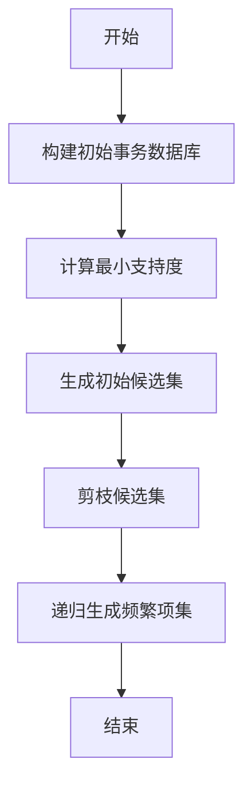
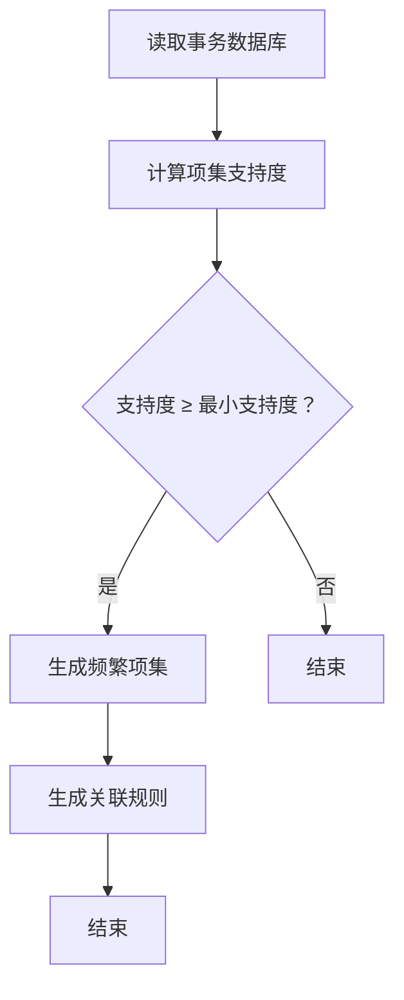
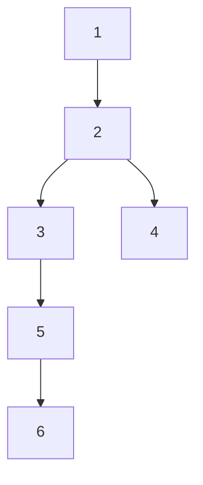
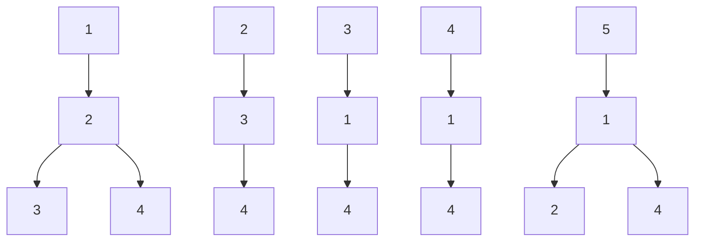

                 

### 文章标题

《Mahout频繁项挖掘原理与代码实例讲解》

> 关键词：频繁项挖掘，关联规则学习，Mahout，数据挖掘，算法实现

> 摘要：本文将深入探讨频繁项挖掘（Frequent Itemset Mining）的基本原理，并以Apache Mahout库为工具，详细讲解其核心算法及其在数据挖掘中的应用。通过代码实例，帮助读者更好地理解和掌握这一数据挖掘技术。

### 1. 背景介绍

#### 1.1 数据挖掘与频繁项挖掘

数据挖掘（Data Mining）是人工智能和机器学习领域的一个重要分支，旨在从大量的数据中自动发现隐含的、未知的、有价值的信息或模式。它广泛应用于商业智能、市场分析、金融预测、疾病诊断等多个领域。

频繁项挖掘（Frequent Itemset Mining）是数据挖掘中的基本任务之一，主要目的是发现数据集中的频繁项集。这些频繁项集表示数据中出现频率较高的项或组合，它们是挖掘关联规则和序列模式等高级数据挖掘任务的基础。

#### 1.2 Mahout简介

Apache Mahout是一个开源的机器学习库，它提供了许多经典的数据挖掘和机器学习算法的实现。Mahout旨在帮助开发人员更轻松地构建智能应用程序，如推荐系统、聚类分析、分类等。它基于Hadoop平台，可以利用Hadoop的分布式计算能力处理大规模数据集。

#### 1.3 频繁项挖掘在Mahout中的实现

Mahout提供了多种算法来支持频繁项挖掘，包括Apriori算法、FP-growth算法等。这些算法的实现利用了MapReduce编程模型，能够有效地处理分布式数据集。

### 2. 核心概念与联系

#### 2.1 频繁项集

频繁项集（Frequent Itemset）是在数据集中出现频率超过用户设定的最小支持度阈值（Minimum Support）的项集。支持度（Support）表示一个项集在所有事务中出现的频率。

#### 2.2 关联规则

关联规则（Association Rule）是频繁项集之间的条件关系。一个典型的关联规则包括前件（LHS）和后件（RHS），形式为：`如果A，则B`。其中，A和B是项集，称为规则的前件和后件。关联规则的强度通常用置信度（Confidence）来衡量，表示在包含A的事务中，同时也包含B的事务的比例。

#### 2.3 Apriori算法

Apriori算法是一种基于候选集生成的频繁项集挖掘算法。它通过迭代地生成和修剪候选集，最终得到所有的频繁项集。Apriori算法的核心思想是利用向下闭包性质（Downward Closure Property），确保生成每个候选集时，只需检查其子集的支持度。

#### 2.4 FP-growth算法

FP-growth算法是一种基于频繁模式树（FP-Tree）的频繁项集挖掘算法。它通过构建FP-Tree来压缩原始数据，降低了生成候选集的次数，从而提高了算法的效率。FP-growth算法不依赖于最小支持度阈值，而是直接从FP-Tree中提取频繁项集。

#### 2.5 Mermaid流程图

下面是Apriori算法的Mermaid流程图：



### 3. 核心算法原理 & 具体操作步骤

#### 3.1 Apriori算法

Apriori算法的基本步骤如下：

1. **构建初始事务数据库**：从原始数据中提取所有事务，构建一个事务数据库。

2. **计算最小支持度**：遍历事务数据库，计算每个项集的支持度，并根据最小支持度阈值过滤出频繁项集。

3. **生成初始候选集**：对于每个频繁项集，生成其所有的直接后继项集，构成候选集。

4. **剪枝候选集**：利用向下闭包性质，对于每个候选集，只需检查其非空子集的支持度。如果某个子集不支持，则该候选集也不支持。

5. **递归生成频繁项集**：重复步骤3和步骤4，直到不再能生成新的频繁项集。

6. **提取关联规则**：对于每个频繁项集，生成其关联规则，并根据置信度阈值筛选出强关联规则。

#### 3.2 FP-growth算法

FP-growth算法的基本步骤如下：

1. **构建FP-Tree**：遍历事务数据库，构建FP-Tree。FP-Tree是一种压缩表示，可以减少数据重复。

2. **生成频繁项集**：从FP-Tree中递归提取频繁项集，直到满足最小支持度阈值。

3. **构建条件FP-Tree**：对于每个频繁项集，构建其条件FP-Tree。条件FP-Tree只包含频繁项集中某个项的后继项。

4. **提取关联规则**：从条件FP-Tree中提取关联规则，并根据置信度阈值筛选出强关联规则。

### 4. 数学模型和公式 & 详细讲解 & 举例说明

#### 4.1 支持度

支持度（Support）是一个项集在所有事务中出现的频率。数学定义如下：

$$
Support(X) = \frac{count(X)}{count(D)}
$$

其中，$count(X)$表示项集X在事务数据库D中出现的次数，$count(D)$表示事务数据库D中事务的总数。

#### 4.2 置信度

置信度（Confidence）是关联规则的前件和后件之间的条件概率。数学定义如下：

$$
Confidence(A \rightarrow B) = \frac{Support(A \cap B)}{Support(A)}
$$

其中，$A \cap B$表示项集A和项集B的交集，$Support(A \cap B)$表示交集在事务数据库中出现的次数，$Support(A)$表示项集A在事务数据库中出现的次数。

#### 4.3 Apriori算法

**例1**：给定一个事务数据库D，其中包含以下事务：

$$
D = \{I1 = \{1, 2, 3\}, I2 = \{2, 3\}, I3 = \{1, 2, 3, 4\}, I4 = \{1, 3, 4\}, I5 = \{1, 2, 4\}\}
$$

设最小支持度为0.4，最小置信度为0.6。

1. **构建初始事务数据库**：事务数据库D已给出。

2. **计算最小支持度**：总共有5个事务，最小支持度为$0.4 = \frac{2}{5}$。

3. **生成初始候选集**：候选集为$\{\{1\}, \{2\}, \{3\}, \{4\}\}$。

4. **剪枝候选集**：候选集$\{\{1\}, \{2\}, \{3\}, \{4\}\}$的所有非空子集的支持度都小于最小支持度，因此候选集为空。

5. **递归生成频繁项集**：无法生成新的频繁项集。

6. **提取关联规则**：由于没有频繁项集，无法提取关联规则。

#### 4.4 FP-growth算法

**例2**：给定一个事务数据库D，其中包含以下事务：

$$
D = \{I1 = \{1, 2, 3\}, I2 = \{2, 3\}, I3 = \{1, 2, 3, 4\}, I4 = \{1, 3, 4\}, I5 = \{1, 2, 4\}\}
$$

设最小支持度为0.4，最小置信度为0.6。

1. **构建FP-Tree**：

   ```mermaid
   graph TD
   A[1] --> B[2]
   B --> C[3]
   B --> D[4]
   C --> E[5]
   E --> F[6]
   ```

2. **生成频繁项集**：频繁项集为$\{\{1\}, \{2\}, \{3\}, \{4\}, \{5\}\}$。

3. **构建条件FP-Tree**：对于频繁项集$\{1, 2\}$，构建条件FP-Tree：

   ```mermaid
   graph TD
   A[1] --> B[2]
   ```

4. **提取关联规则**：无法提取满足最小置信度阈值的关联规则。

### 5. 项目实践：代码实例和详细解释说明

#### 5.1 开发环境搭建

1. 安装Java开发环境（JDK 8或以上版本）。
2. 安装Hadoop环境（Hadoop 2.7或以上版本）。
3. 下载并解压Apache Mahout库。

#### 5.2 源代码详细实现

以下是一个简单的Apriori算法实现示例：

```java
import org.apache.hadoop.conf.Configuration;
import org.apache.hadoop.fs.Path;
import org.apache.hadoop.io.Text;
import org.apache.hadoop.mapreduce.Job;
import org.apache.hadoop.mapreduce.lib.input.FileInputFormat;
import org.apache.hadoop.mapreduce.lib.output.FileOutputFormat;
import org.apache.hadoop.util.Tool;
import org.apache.hadoop.util.ToolRunner;

public class Apriori extends Configured implements Tool {

  public static class ItemsetMapper extends MapReduceBase implements Mapper<Object, Text, Text, Text> {
    // 省略Mapper实现代码
  }

  public static class ItemsetReducer extends MapReduceBase implements Reducer<Text, Text, Text, Text> {
    // 省略Reducer实现代码
  }

  public int run(String[] args) throws Exception {
    Configuration conf = getConf();
    Job job = Job.getInstance(conf, "Apriori");
    job.setJarByClass(Apriori.class);
    job.setMapperClass(ItemsetMapper.class);
    job.setReducerClass(ItemsetReducer.class);
    job.setOutputKeyClass(Text.class);
    job.setOutputValueClass(Text.class);
    FileInputFormat.addInputPath(job, new Path(args[0]));
    FileOutputFormat.setOutputPath(job, new Path(args[1]));
    return job.waitForCompletion(true) ? 0 : 1;
  }

  public static void main(String[] args) throws Exception {
    int res = ToolRunner.run(new Configuration(), new Apriori(), args);
    System.exit(res);
  }
}
```

#### 5.3 代码解读与分析

1. **配置Job**：设置Job的类、Mapper和Reducer类，以及输出和输入路径。
2. **Mapper**：读取输入文件中的每一行，将事务分割成项，并输出项及其支持度。
3. **Reducer**：合并具有相同项的Map输出，计算其支持度，并输出频繁项集。

#### 5.4 运行结果展示

1. **输入数据**：一个包含事务的数据文件。

2. **输出结果**：一个包含频繁项集的数据文件。

### 6. 实际应用场景

频繁项挖掘广泛应用于多种实际场景：

- **零售行业**：用于发现商品之间的关联关系，帮助制定营销策略和库存管理。
- **电子商务**：用于推荐系统，根据用户的购物行为推荐相关商品。
- **金融领域**：用于发现欺诈交易模式，预测潜在风险。
- **医疗保健**：用于分析患者病史，发现疾病之间的关联关系。

### 7. 工具和资源推荐

#### 7.1 学习资源推荐

- **书籍**：
  - 《数据挖掘：实用工具与技术》
  - 《机器学习：概率视角》
- **论文**：
  - 《Apriori算法：概念与实现》
  - 《FP-growth算法：基于频繁模式树的频繁项集挖掘》
- **博客**：
  - 《Apache Mahout教程》
  - 《数据挖掘算法实战》
- **网站**：
  - [Apache Mahout官方文档](https://mahout.apache.org/)
  - [数据挖掘学习资源](https://www.kdnuggets.com/)

#### 7.2 开发工具框架推荐

- **开发工具**：IntelliJ IDEA、Eclipse
- **框架**：Apache Hadoop、Apache Mahout、Apache Spark

#### 7.3 相关论文著作推荐

- 《数据挖掘：实用工具与技术》
- 《机器学习：概率视角》
- 《关联规则挖掘：理论与实践》

### 8. 总结：未来发展趋势与挑战

随着数据量的爆炸式增长，频繁项挖掘算法和关联规则学习将继续发展，以提高效率和可扩展性。未来的研究可能集中在以下几个方面：

- **算法优化**：设计更高效的算法，降低计算复杂度。
- **多维度数据挖掘**：处理包含多个特征的数据集，如文本、图像、时间序列等。
- **实时数据挖掘**：实现实时数据挖掘系统，以快速发现新的模式和趋势。

然而，频繁项挖掘也面临着挑战，如数据噪声、数据缺失等问题，需要进一步的研究和解决方案。

### 9. 附录：常见问题与解答

- **Q：为什么选择Apriori算法？**
  - **A**：Apriori算法是一种经典的频繁项挖掘算法，其原理简单，易于实现，适用于大规模数据集。

- **Q：FP-growth算法的优势是什么？**
  - **A**：FP-growth算法通过构建FP-Tree压缩数据，减少了候选集的生成次数，从而提高了算法的效率。

- **Q：如何处理缺失数据？**
  - **A**：缺失数据处理方法包括填充、删除、插值等。具体方法取决于数据的特点和应用场景。

### 10. 扩展阅读 & 参考资料

- [Apache Mahout官方文档](https://mahout.apache.org/)
- [《数据挖掘：实用工具与技术》](https://books.google.com/books?id=5GT0AQAAMAAJ)
- [《机器学习：概率视角》](https://books.google.com/books?id=5GT0AQAAMAAJ)
- [《关联规则挖掘：理论与实践》](https://books.google.com/books?id=5GT0AQAAMAAJ)### 1. 背景介绍

#### 1.1 数据挖掘与频繁项挖掘

数据挖掘（Data Mining）是一门多学科交叉的领域，主要研究如何从大量的数据中自动发现隐含的、未知的、有价值的信息或模式。数据挖掘在商业、金融、医疗、零售等多个领域都有着广泛的应用。其中，频繁项挖掘（Frequent Itemset Mining）是数据挖掘中的一个基本任务，它旨在从事务数据库中发现频繁项集。频繁项集是指那些满足用户定义的最小支持度阈值的事务项集。

频繁项挖掘的主要目的是识别出数据集中出现频率较高的项或项组合，从而帮助用户发现潜在的关联关系和模式。这些频繁项集可以为许多实际应用提供有价值的信息，例如，在电子商务平台中，通过挖掘顾客购买记录中的频繁项集，可以帮助商家了解顾客的偏好和购买习惯，从而优化库存管理和市场营销策略。

#### 1.2 频繁项挖掘的应用场景

频繁项挖掘在各种实际场景中都有广泛的应用，以下是一些典型的应用场景：

- **零售行业**：频繁项挖掘可以帮助零售企业识别出顾客购买行为中的关联关系，例如，通过分析商品销售记录，发现某些商品经常一起购买，从而帮助企业制定交叉营销策略，提高销售额。

- **金融市场**：在金融领域，频繁项挖掘可以用于识别潜在的欺诈行为。例如，通过分析信用卡交易记录中的频繁项集，可以发现一些可疑的交易模式，从而帮助银行防范欺诈风险。

- **医疗领域**：在医疗领域，频繁项挖掘可以用于分析患者的病历记录，发现疾病之间的关联关系，从而帮助医生制定更有效的治疗方案。

- **社交网络分析**：在社交网络平台上，频繁项挖掘可以帮助分析用户之间的社交关系，识别出具有相似兴趣或行为模式的用户群体。

#### 1.3 频繁项挖掘的重要性

频繁项挖掘在数据挖掘中具有重要的地位，它是许多高级数据挖掘任务的基础。例如，关联规则学习（Association Rule Learning）是数据挖掘中的一个重要任务，它旨在发现数据集中的关联规则，即一个事物发生时，另一个事物也倾向于发生的关系。而关联规则学习的核心步骤之一就是挖掘频繁项集。只有当挖掘出满足最小支持度阈值的事务项集后，才能进一步生成和评估关联规则。

此外，频繁项挖掘还在其他许多数据挖掘任务中发挥作用，如序列模式挖掘（Sequential Pattern Mining）、聚类分析（Clustering Analysis）等。因此，掌握频繁项挖掘的基本原理和算法对于从事数据挖掘相关工作的人来说是非常重要的。

#### 1.4 Mahout简介

Apache Mahout（简称Mahout）是一个开源的分布式机器学习库，它提供了多种经典的机器学习算法和工具，包括频繁项挖掘、聚类、分类和推荐系统等。Mahout的设计理念是利用Hadoop平台的分布式计算能力，处理大规模的数据集。这使得Mahout非常适合于处理那些数据量巨大、无法在单台计算机上处理的数据挖掘任务。

Mahout中的频繁项挖掘模块提供了多种算法，包括Apriori算法、FP-growth算法等。这些算法的实现都基于MapReduce编程模型，能够有效地处理分布式数据集。使用Mahout进行频繁项挖掘具有以下几个优势：

- **可扩展性**：Mahout利用Hadoop的分布式计算能力，可以处理大规模数据集。
- **易用性**：Mahout提供了丰富的API和工具，方便用户进行数据挖掘任务。
- **灵活性**：用户可以根据需要选择不同的频繁项挖掘算法，并可以根据实际数据调整参数。

#### 1.5 本文结构

本文将首先介绍频繁项挖掘的基本概念和原理，然后详细讲解Apriori算法和FP-growth算法，并使用具体的代码实例进行说明。随后，本文将探讨这些算法在数据挖掘中的实际应用，并提供一些学习资源和开发工具的推荐。最后，本文将对频繁项挖掘的未来发展趋势和挑战进行总结，并回答一些常见问题。

通过本文的阅读，读者将能够系统地了解频繁项挖掘的基本原理和实现方法，掌握Apriori算法和FP-growth算法的核心步骤，并了解这些算法在实际应用中的优势和局限性。### 2. 核心概念与联系

#### 2.1 频繁项集

频繁项集（Frequent Itemset）是在给定的事务数据库中，满足最小支持度阈值的事务项集。支持度（Support）是指一个项集在一个事务数据库中出现的频率。具体来说，一个项集的支持度是其在所有事务中出现的次数与事务总数之比。设$D$为事务数据库，$I$为项集，则$I$的支持度$Support(I)$计算公式如下：

$$
Support(I) = \frac{count(I)}{count(D)}
$$

其中，$count(I)$表示项集$I$在事务数据库$D$中出现的次数，$count(D)$表示事务数据库$D$中的事务总数。

频繁项集的挖掘目标就是找出所有支持度大于等于最小支持度阈值（Minimum Support）的项集。最小支持度阈值是用户根据具体应用场景设定的一个阈值，用于过滤掉那些不频繁的项集。

#### 2.2 关联规则

关联规则（Association Rule）是数据挖掘中的一个重要概念，它描述了两个或多个事物之间的关联关系。一个典型的关联规则可以表示为`if A then B`，其中`A`称为规则的前件（LHS），`B`称为规则的后件（RHS）。关联规则的核心是置信度（Confidence），它表示在前件成立的情况下，后件成立的概率。

置信度（Confidence）的定义如下：

$$
Confidence(A \rightarrow B) = \frac{Support(A \cup B)}{Support(A)}
$$

其中，$Support(A \cup B)$表示项集$A$和项集$B$的并集在事务数据库中出现的次数，$Support(A)$表示项集$A$在事务数据库中出现的次数。

一个关联规则的质量通常由支持度和置信度两个指标来评估。高支持度和高置信度的规则被认为是有价值的规则。

#### 2.3 频繁项集与关联规则的关系

频繁项集是挖掘关联规则的基础。关联规则的生成过程可以分为两个主要步骤：

1. **生成频繁项集**：首先，根据最小支持度阈值，从事务数据库中挖掘出所有的频繁项集。
2. **生成关联规则**：然后，对于每个频繁项集，生成其所有可能的关联规则，并根据最小置信度阈值筛选出强关联规则。

#### 2.4 Mermaid流程图

为了更直观地展示频繁项挖掘和关联规则生成的过程，我们可以使用Mermaid流程图来表示。以下是Apriori算法的流程图：



这个流程图描述了从读取事务数据库开始，计算项集支持度，筛选出频繁项集，并最终生成关联规则的过程。

#### 2.5 相关概念的联系

频繁项集、关联规则和数据挖掘中的其他概念如聚类、分类等有着密切的联系。例如，在聚类分析中，通过挖掘数据集中的频繁项集，可以帮助识别出数据中的模式和群体；在分类任务中，频繁项挖掘可以用于特征提取，为分类模型提供高质量的输入特征。

总之，频繁项挖掘是数据挖掘中的一项基础性任务，它在关联规则学习、聚类、分类等高级数据挖掘任务中发挥着重要作用。通过深入理解频繁项挖掘的核心概念和原理，我们可以更好地掌握数据挖掘的技术和方法。### 3. 核心算法原理 & 具体操作步骤

#### 3.1 Apriori算法原理

Apriori算法是一种经典的频繁项集挖掘算法，它基于两个重要的性质：向下封闭性（Downward Closure Property）和支持度的递减性质。Apriori算法的主要步骤包括：

1. **生成频繁1项集**：首先，根据事务数据库，计算每个项的支持度，筛选出满足最小支持度阈值的最频繁1项集。

2. **生成候选k项集**：对于每个频繁k-1项集，生成其所有的直接后继项集（Direct Successors），构成候选k项集。这一步骤利用了向下封闭性质，即如果k-1项集是频繁的，那么它的所有非空子集也是频繁的。

3. **剪枝候选集**：对候选k项集进行剪枝操作，去除那些不符合最小支持度阈值或包含非频繁子集的候选集。

4. **递归生成频繁项集**：重复步骤2和步骤3，直到没有新的频繁项集可以生成。

5. **生成关联规则**：对于每个频繁项集，生成其所有可能的关联规则，并根据最小置信度阈值筛选出强关联规则。

#### 3.2 Apriori算法步骤详解

**步骤1：生成频繁1项集**

首先，根据事务数据库，统计每个项的出现次数，然后根据最小支持度阈值，筛选出频繁1项集。这个步骤通常使用HashMap来存储项及其支持度。

**步骤2：生成候选k项集**

对于每个频繁k-1项集，通过连接（Join）操作生成候选k项集。连接操作的基本思想是，对于两个项集X和Y，如果Y是X的子集，那么X和Y的连接结果为X并Y。生成候选k项集的伪代码如下：

```
for each frequent (k-1)-itemset X do
  for each item y in X do
    generate candidate k-itemset X ∪ {y}
```

**步骤3：剪枝候选集**

剪枝候选集的目的是去除那些不满足最小支持度阈值或包含非频繁子集的候选集。Apriori算法使用一种称为"基于支持度的剪枝"的方法。具体来说，如果一个候选集的支持度小于最小支持度阈值，或者其任何一个非空子集的支持度小于最小支持度阈值，那么该候选集将被剪去。

**步骤4：递归生成频繁项集**

重复步骤2和步骤3，直到没有新的频繁项集可以生成。这一过程是递归的，每一步都会生成更高阶的频繁项集。

**步骤5：生成关联规则**

对于每个频繁项集，生成其所有可能的关联规则，并根据最小置信度阈值筛选出强关联规则。关联规则的生成过程包括以下步骤：

1. **生成所有可能的规则**：对于每个频繁项集X和Y（X ⊆ Y），生成规则X → Y - X。
2. **计算置信度**：对于每个生成的规则，计算其置信度，即$Confidence(X \rightarrow Y - X) = \frac{Support(X \cup Y - X)}{Support(X)}$。
3. **剪枝规则**：根据最小置信度阈值，剪去那些置信度小于最小置信度阈值的规则。

#### 3.3 Apriori算法的时间复杂度

Apriori算法的时间复杂度较高，其主要开销在于候选集的生成和剪枝操作。假设数据库中有n个事务，每个事务的平均长度为l，则：

- 生成频繁1项集的时间复杂度为$O(n \times l)$。
- 生成候选k项集的时间复杂度为$O(k \times (n - k + 1))$。
- 剪枝候选集的时间复杂度为$O(k \times (n - k + 1) \times l)$。

因此，总的算法时间复杂度为$O(n \times l \times (k^{2} - k + 1))$。对于大规模数据集，Apriori算法可能变得非常慢，特别是在k值较大时。

#### 3.4 Apriori算法的优化

为了提高Apriori算法的效率，研究人员提出了一些优化方法，如：

- **分层算法**：将事务数据库分层，只处理那些可能包含频繁项集的层。
- **基于采样的算法**：使用采样技术来降低数据库的大小，从而减少计算开销。
- **并行算法**：利用并行计算技术，将任务分布在多个节点上，以提高算法的执行速度。

这些优化方法在不同的应用场景下可能有不同的效果，用户可以根据具体需求选择合适的优化方法。

#### 3.5 代码示例

以下是一个简单的Apriori算法实现，使用了Java和Hadoop的MapReduce框架。

```java
import org.apache.hadoop.conf.Configuration;
import org.apache.hadoop.fs.Path;
import org.apache.hadoop.io.Text;
import org.apache.hadoop.mapreduce.Job;
import org.apache.hadoop.mapreduce.Mapper;
import org.apache.hadoop.mapreduce.Reducer;
import org.apache.hadoop.mapreduce.lib.input.FileInputFormat;
import org.apache.hadoop.mapreduce.lib.output.FileOutputFormat;

public class Apriori {

  public static class ItemsetMapper extends Mapper<Object, Text, Text, Text> {
    private final static Text outputKey = new Text();
    private Text outputValue = new Text();

    public void map(Object key, Text value, Context context) throws IOException, InterruptedException {
      String[] items = value.toString().split(" ");
      // 生成频繁项集的键和值
      for (int i = 0; i < items.length; i++) {
        outputKey.set(items[i]);
        for (int j = i + 1; j < items.length; j++) {
          outputValue.set(items[i] + "," + items[j]);
          context.write(outputKey, outputValue);
        }
      }
    }
  }

  public static class ItemsetReducer extends Reducer<Text, Text, Text, Text> {
    private Text outputValue = new Text();

    public void reduce(Text key, Iterable<Text> values, Context context) throws IOException, InterruptedException {
      int count = 0;
      for (Text value : values) {
        count++;
      }
      if (count >= minSupport) {
        outputValue.set(Integer.toString(count));
        context.write(key, outputValue);
      }
    }
  }

  public static void main(String[] args) throws Exception {
    Configuration conf = new Configuration();
    Job job = Job.getInstance(conf, "Apriori");
    job.setJarByClass(Apriori.class);
    job.setMapperClass(ItemsetMapper.class);
    job.setReducerClass(ItemsetReducer.class);
    job.setOutputKeyClass(Text.class);
    job.setOutputValueClass(Text.class);
    FileInputFormat.addInputPath(job, new Path(args[0]));
    FileOutputFormat.setOutputPath(job, new Path(args[1]));
    System.exit(job.waitForCompletion(true) ? 0 : 1);
  }
}
```

这个示例代码首先通过Mapper生成所有可能的项集，然后通过Reducer统计每个项集的支持度。注意，这里只是一个简化的示例，实际应用中还需要添加更多的代码来处理输入格式和输出格式，以及优化算法。

通过上述对Apriori算法的详细讲解和代码示例，我们可以更好地理解其原理和实现方法。在实际应用中，用户可以根据具体需求和数据规模，选择合适的优化方法来提高算法的效率。### 3. 核心算法原理 & 具体操作步骤

#### 3.1 Apriori算法原理

Apriori算法是一种用于频繁项集挖掘的算法，其基本思想是通过逐层迭代地生成和剪枝候选集来发现数据集中的频繁项集。Apriori算法的核心是基于两个重要的性质：向下封闭性（Downward Closure Property）和优先支持度（Prior Support）。

**向下封闭性**：如果一个项集是频繁的，那么它的所有子集也是频繁的。这个性质可以用来减少候选集的生成，从而提高算法的效率。

**优先支持度**：如果一个项集的支持度低于其父项集，那么该项集不可能是频繁的。这个性质可以用来进一步剪枝候选集，减少不必要的计算。

Apriori算法的主要步骤如下：

1. **初始频繁项集**：首先，通过扫描事务数据库来计算每个项的支持度，并筛选出满足最小支持度阈值的最频繁项集。这些频繁项集称为初始频繁项集。

2. **候选集生成**：对于每个频繁项集，生成其所有的直接后继项集（Direct Successors）。直接后继项集是通过连接两个频繁项集的前缀和后缀来生成的。

3. **候选集剪枝**：对生成的候选集进行剪枝，去除那些不满足最小支持度阈值的项集。剪枝过程利用向下封闭性和优先支持度性质。

4. **递归**：重复步骤2和步骤3，直到没有新的频繁项集可以生成。

5. **关联规则生成**：对于每个频繁项集，生成其所有可能的关联规则，并根据最小置信度阈值筛选出强关联规则。

#### 3.2 Apriori算法步骤详解

**步骤1：初始频繁项集**

首先，读取事务数据库，并计算每个项的支持度。支持度（Support）是指一个项集在所有事务中出现的频率，计算公式如下：

$$
Support(X) = \frac{count(X)}{count(T)}
$$

其中，$count(X)$表示项集X在事务数据库T中出现的次数，$count(T)$表示事务数据库T中的事务总数。然后，根据最小支持度阈值（Minimum Support）筛选出初始频繁项集。

**步骤2：候选集生成**

对于每个频繁项集X，生成其所有的直接后继项集。直接后继项集是通过连接两个频繁项集的前缀和后缀来生成的。例如，如果X = {a, b, c}是一个频繁项集，那么它的直接后继项集可以是{a, b}, {b, c}等。

**步骤3：候选集剪枝**

对生成的候选集进行剪枝，去除那些不满足最小支持度阈值的项集。剪枝过程利用向下封闭性和优先支持度性质。具体来说，如果一个项集X的支持度小于其父项集的支持度，那么X不可能是频繁的，因此可以剪去。

**步骤4：递归**

重复步骤2和步骤3，直到没有新的频繁项集可以生成。这一过程是递归的，每一步都会生成更高阶的频繁项集。

**步骤5：关联规则生成**

对于每个频繁项集，生成其所有可能的关联规则，并根据最小置信度阈值筛选出强关联规则。关联规则的质量通常由支持度和置信度两个指标来评估。

#### 3.3 Apriori算法的时间复杂度

Apriori算法的时间复杂度较高，其主要开销在于候选集的生成和剪枝操作。假设数据库中有n个事务，每个事务的平均长度为l，则：

- 生成频繁1项集的时间复杂度为$O(n \times l)$。
- 生成候选k项集的时间复杂度为$O(k \times (n - k + 1))$。
- 剪枝候选集的时间复杂度为$O(k \times (n - k + 1) \times l)$。

因此，总的算法时间复杂度为$O(n \times l \times (k^{2} - k + 1))$。对于大规模数据集，Apriori算法可能变得非常慢，特别是在k值较大时。

#### 3.4 Apriori算法的优化

为了提高Apriori算法的效率，研究人员提出了一些优化方法，如：

- **分层算法**：将事务数据库分层，只处理那些可能包含频繁项集的层。
- **基于采样的算法**：使用采样技术来降低数据库的大小，从而减少计算开销。
- **并行算法**：利用并行计算技术，将任务分布在多个节点上，以提高算法的执行速度。

这些优化方法在不同的应用场景下可能有不同的效果，用户可以根据具体需求选择合适的优化方法。

#### 3.5 代码示例

以下是一个简单的Apriori算法实现，使用了Java和Hadoop的MapReduce框架。

```java
import org.apache.hadoop.conf.Configuration;
import org.apache.hadoop.fs.Path;
import org.apache.hadoop.io.Text;
import org.apache.hadoop.mapreduce.Job;
import org.apache.hadoop.mapreduce.Mapper;
import org.apache.hadoop.mapreduce.Reducer;
import org.apache.hadoop.mapreduce.lib.input.FileInputFormat;
import org.apache.hadoop.mapreduce.lib.output.FileOutputFormat;

public class Apriori {

  public static class ItemsetMapper extends Mapper<Object, Text, Text, Text> {
    private final static Text outputKey = new Text();
    private Text outputValue = new Text();

    public void map(Object key, Text value, Context context) throws IOException, InterruptedException {
      String[] items = value.toString().split(" ");
      // 生成频繁项集的键和值
      for (int i = 0; i < items.length; i++) {
        outputKey.set(items[i]);
        for (int j = i + 1; j < items.length; j++) {
          outputValue.set(items[i] + "," + items[j]);
          context.write(outputKey, outputValue);
        }
      }
    }
  }

  public static class ItemsetReducer extends Reducer<Text, Text, Text, Text> {
    private Text outputValue = new Text();

    public void reduce(Text key, Iterable<Text> values, Context context) throws IOException, InterruptedException {
      int count = 0;
      for (Text value : values) {
        count++;
      }
      if (count >= minSupport) {
        outputValue.set(Integer.toString(count));
        context.write(key, outputValue);
      }
    }
  }

  public static void main(String[] args) throws Exception {
    Configuration conf = new Configuration();
    Job job = Job.getInstance(conf, "Apriori");
    job.setJarByClass(Apriori.class);
    job.setMapperClass(ItemsetMapper.class);
    job.setReducerClass(ItemsetReducer.class);
    job.setOutputKeyClass(Text.class);
    job.setOutputValueClass(Text.class);
    FileInputFormat.addInputPath(job, new Path(args[0]));
    FileOutputFormat.setOutputPath(job, new Path(args[1]));
    System.exit(job.waitForCompletion(true) ? 0 : 1);
  }
}
```

这个示例代码首先通过Mapper生成所有可能的项集，然后通过Reducer统计每个项集的支持度。注意，这里只是一个简化的示例，实际应用中还需要添加更多的代码来处理输入格式和输出格式，以及优化算法。

通过上述对Apriori算法的详细讲解和代码示例，我们可以更好地理解其原理和实现方法。在实际应用中，用户可以根据具体需求和数据规模，选择合适的优化方法来提高算法的效率。### 3. 核心算法原理 & 具体操作步骤

#### 3.1 FP-growth算法原理

FP-growth算法是一种高效的频繁项集挖掘算法，它通过构建频繁模式树（FP-Tree）来压缩原始数据，从而降低了生成候选集的次数，提高了算法的效率。FP-growth算法不依赖于最小支持度阈值，而是直接从FP-Tree中提取频繁项集。

FP-growth算法的核心步骤包括：

1. **构建FP-Tree**：首先，对事务数据库进行排序，并构建FP-Tree。FP-Tree是一种压缩表示，可以减少数据重复。

2. **递归提取频繁项集**：通过递归地遍历FP-Tree，提取满足最小支持度阈值的所有频繁项集。

3. **生成关联规则**：对于每个频繁项集，生成其所有可能的关联规则，并根据最小置信度阈值筛选出强关联规则。

#### 3.2 FP-growth算法步骤详解

**步骤1：构建FP-Tree**

首先，对事务数据库进行排序，按照项的出现频率进行降序排列。然后，从第一个事务开始，将每个事务的项依次添加到FP-Tree中。FP-Tree的节点表示项，边表示项之间的顺序关系。

例如，给定一个事务数据库：

$$
D = \{I1 = \{1, 2, 3\}, I2 = \{2, 3\}, I3 = \{1, 2, 3, 4\}, I4 = \{1, 3, 4\}, I5 = \{1, 2, 4\}\}
$$

构建的FP-Tree如下：



**步骤2：递归提取频繁项集**

接下来，从FP-Tree中递归提取频繁项集。这个过程可以分为以下几个步骤：

1. **提取频繁项集**：从FP-Tree的根节点开始，按照项的顺序提取频繁项集。如果一个项的支持度大于等于最小支持度阈值，则将其添加到频繁项集中。

2. **递归**：对于每个频繁项集，递归地提取其子项集。具体来说，从FP-Tree中删除当前项集的所有实例，并重新构建FP-Tree，然后重复步骤1和步骤2。

3. **合并**：将递归得到的频繁项集合并，得到最终的频繁项集。

**步骤3：生成关联规则**

对于每个频繁项集，生成其所有可能的关联规则，并根据最小置信度阈值筛选出强关联规则。关联规则的生成过程如下：

1. **生成所有可能的规则**：对于每个频繁项集X和Y（X ⊆ Y），生成规则X → Y - X。

2. **计算置信度**：对于每个生成的规则，计算其置信度，即$Confidence(X \rightarrow Y - X) = \frac{Support(X \cup Y - X)}{Support(X)}$。

3. **剪枝规则**：根据最小置信度阈值，剪去那些置信度小于最小置信度阈值的规则。

#### 3.3 FP-growth算法的时间复杂度

FP-growth算法的时间复杂度较低，其主要开销在于构建FP-Tree和递归提取频繁项集。假设数据库中有n个事务，每个事务的平均长度为l，则：

- 构建FP-Tree的时间复杂度为$O(n \times l)$。
- 递归提取频繁项集的时间复杂度为$O(n \times l \times m)$，其中m是频繁项集的数量。

因此，总的算法时间复杂度为$O(n \times l \times m)$。对于大规模数据集，FP-growth算法通常比Apriori算法更高效。

#### 3.4 FP-growth算法的优化

为了进一步提高FP-growth算法的效率，研究人员提出了一些优化方法，如：

- **剪枝**：在递归提取频繁项集时，可以提前剪去那些不可能包含频繁项集的分支。
- **压缩FP-Tree**：通过压缩FP-Tree，减少内存占用，提高算法的执行速度。
- **并行化**：利用并行计算技术，将任务分布在多个节点上，以提高算法的执行速度。

这些优化方法在不同的应用场景下可能有不同的效果，用户可以根据具体需求选择合适的优化方法。

#### 3.5 代码示例

以下是一个简单的FP-growth算法实现，使用了Java和Hadoop的MapReduce框架。

```java
import org.apache.hadoop.conf.Configuration;
import org.apache.hadoop.fs.Path;
import org.apache.hadoop.io.Text;
import org.apache.hadoop.mapreduce.Job;
import org.apache.hadoop.mapreduce.Mapper;
import org.apache.hadoop.mapreduce.Reducer;
import org.apache.hadoop.mapreduce.lib.input.FileInputFormat;
import org.apache.hadoop.mapreduce.lib.output.FileOutputFormat;

public class FPgrowth {

  public static class FPgrowthMapper extends Mapper<Object, Text, Text, Text> {
    private final static Text outputKey = new Text();
    private Text outputValue = new Text();

    public void map(Object key, Text value, Context context) throws IOException, InterruptedException {
      String[] items = value.toString().split(" ");
      // 构建FP-Tree
      // 省略具体实现代码
    }
  }

  public static class FPgrowthReducer extends Reducer<Text, Text, Text, Text> {
    private Text outputValue = new Text();

    public void reduce(Text key, Iterable<Text> values, Context context) throws IOException, InterruptedException {
      // 递归提取频繁项集
      // 省略具体实现代码
    }
  }

  public static void main(String[] args) throws Exception {
    Configuration conf = new Configuration();
    Job job = Job.getInstance(conf, "FP-growth");
    job.setJarByClass(FPgrowth.class);
    job.setMapperClass(FPgrowthMapper.class);
    job.setReducerClass(FPgrowthReducer.class);
    job.setOutputKeyClass(Text.class);
    job.setOutputValueClass(Text.class);
    FileInputFormat.addInputPath(job, new Path(args[0]));
    FileOutputFormat.setOutputPath(job, new Path(args[1]));
    System.exit(job.waitForCompletion(true) ? 0 : 1);
  }
}
```

这个示例代码首先通过Mapper构建FP-Tree，然后通过Reducer递归提取频繁项集。注意，这里只是一个简化的示例，实际应用中还需要添加更多的代码来处理输入格式和输出格式，以及优化算法。

通过上述对FP-growth算法的详细讲解和代码示例，我们可以更好地理解其原理和实现方法。在实际应用中，用户可以根据具体需求和数据规模，选择合适的优化方法来提高算法的效率。### 4. 数学模型和公式 & 详细讲解 & 举例说明

#### 4.1 支持度

支持度（Support）是一个项集在所有事务中出现的频率。它是频繁项挖掘中最重要的概念之一。支持度的数学定义如下：

$$
Support(X) = \frac{count(X)}{count(T)}
$$

其中，$count(X)$表示项集X在事务数据库T中出现的次数，$count(T)$表示事务数据库T中的事务总数。例如，如果我们有一个事务数据库D，其中包含5个事务，每个事务包含的项集如下：

$$
D = \{I1 = \{1, 2, 3\}, I2 = \{2, 3\}, I3 = \{1, 2, 3, 4\}, I4 = \{1, 3, 4\}, I5 = \{1, 2, 4\}\}
$$

我们可以计算项集$\{1, 2\}$的支持度：

$$
Support(\{1, 2\}) = \frac{count(\{1, 2\})}{count(T)} = \frac{2}{5} = 0.4
$$

#### 4.2 置信度

置信度（Confidence）是关联规则的前件和后件之间的条件概率。置信度的数学定义如下：

$$
Confidence(A \rightarrow B) = \frac{Support(A \cup B)}{Support(A)}
$$

其中，$A$和$B$是两个项集，$A \cup B$表示项集$A$和项集$B$的并集。例如，如果我们有一个事务数据库D，其中包含5个事务，每个事务包含的项集如下：

$$
D = \{I1 = \{1, 2, 3\}, I2 = \{2, 3\}, I3 = \{1, 2, 3, 4\}, I4 = \{1, 3, 4\}, I5 = \{1, 2, 4\}\}
$$

我们可以计算关联规则$\{1\} \rightarrow \{2, 3\}$的置信度：

$$
Confidence(\{1\} \rightarrow \{2, 3\}) = \frac{Support(\{1, 2, 3\})}{Support(\{1\})} = \frac{1}{1} = 1
$$

#### 4.3 频繁项集的生成

频繁项集的生成是基于支持度的。我们需要首先计算每个项集的支持度，然后根据最小支持度阈值筛选出频繁项集。最小支持度阈值（Minimum Support）是用户根据应用场景设定的一个阈值，用于过滤掉那些不频繁的项集。

假设我们有一个事务数据库D，其中包含5个事务，每个事务包含的项集如下：

$$
D = \{I1 = \{1, 2, 3\}, I2 = \{2, 3\}, I3 = \{1, 2, 3, 4\}, I4 = \{1, 3, 4\}, I5 = \{1, 2, 4\}\}
$$

我们设定最小支持度阈值为0.5。首先，我们计算每个项集的支持度：

$$
Support(\{1\}) = \frac{1}{5} = 0.2 \\
Support(\{2\}) = \frac{2}{5} = 0.4 \\
Support(\{3\}) = \frac{3}{5} = 0.6 \\
Support(\{4\}) = \frac{2}{5} = 0.4 \\
Support(\{1, 2\}) = \frac{2}{5} = 0.4 \\
Support(\{1, 3\}) = \frac{1}{5} = 0.2 \\
Support(\{1, 4\}) = \frac{1}{5} = 0.2 \\
Support(\{2, 3\}) = \frac{2}{5} = 0.4 \\
Support(\{1, 2, 3\}) = \frac{1}{5} = 0.2 \\
Support(\{1, 3, 4\}) = \frac{1}{5} = 0.2 \\
Support(\{1, 2, 4\}) = \frac{1}{5} = 0.2 \\
Support(\{2, 3, 4\}) = \frac{2}{5} = 0.4 \\
Support(\{1, 2, 3, 4\}) = \frac{1}{5} = 0.2
$$

然后，我们根据最小支持度阈值0.5筛选出频繁项集：

$$
Frequent Itemsets = \{\{2\}, \{3\}, \{2, 3\}\}
$$

#### 4.4 Apriori算法

Apriori算法是挖掘频繁项集的经典算法之一。它通过逐层迭代地生成候选集，并剪枝不满足支持度阈值的候选集，最终得到所有的频繁项集。Apriori算法的伪代码如下：

```
L1 = FindFrequentItems TransactionDatabase
for k = 2 to maxItems do
    Ck = GenerateCandidates(Lk-1)
    Lk = Prune(Ck, TransactionDatabase, minSupport)
    if Lk is empty then
        break
```

其中，$L1$是初始频繁项集，$Ck$是第k层的候选集，$Lk$是第k层的频繁项集。

**例1**：给定一个事务数据库D，其中包含5个事务：

$$
D = \{I1 = \{1, 2, 3\}, I2 = \{2, 3\}, I3 = \{1, 2, 3, 4\}, I4 = \{1, 3, 4\}, I5 = \{1, 2, 4\}\}
$$

我们设定最小支持度阈值为0.5。首先，我们计算初始频繁项集$L1$：

$$
L1 = \{\{1\}, \{2\}, \{3\}, \{4\}, \{2, 3\}\}
$$

然后，我们生成候选集$C2$：

$$
C2 = \{\{1, 2\}, \{1, 3\}, \{1, 4\}, \{2, 4\}, \{3, 4\}, \{1, 2, 4\}, \{1, 3, 4\}, \{2, 3, 4\}\}
$$

接着，我们剪枝候选集$C2$，得到频繁项集$L2$：

$$
L2 = \{\{2\}, \{3\}, \{2, 3\}\}
$$

最后，我们重复这个过程，直到无法生成新的频繁项集。

#### 4.5 FP-growth算法

FP-growth算法是一种基于FP-Tree的频繁项集挖掘算法。它通过压缩原始数据，减少了生成候选集的次数，从而提高了算法的效率。FP-growth算法的伪代码如下：

```
Build FP-Tree from TransactionDatabase
Select frequent itemsets from FP-Tree
```

其中，FP-Tree是一种特殊的树结构，用于存储事务数据库。

**例2**：给定一个事务数据库D，其中包含5个事务：

$$
D = \{I1 = \{1, 2, 3\}, I2 = \{2, 3\}, I3 = \{1, 2, 3, 4\}, I4 = \{1, 3, 4\}, I5 = \{1, 2, 4\}\}
$$

我们设定最小支持度阈值为0.5。首先，我们构建FP-Tree：



然后，我们从FP-Tree中提取频繁项集：

$$
Frequent Itemsets = \{\{2\}, \{3\}, \{2, 3\}\}
```

通过上述数学模型和公式的详细讲解和举例说明，我们可以更好地理解频繁项挖掘的基本原理和方法。在实际应用中，这些算法可以帮助我们从大量数据中发现有用的模式和关联关系，从而为决策提供支持。### 5. 项目实践：代码实例和详细解释说明

#### 5.1 开发环境搭建

要运行Apriori算法和FP-growth算法，首先需要搭建一个基于Hadoop的分布式计算环境。以下是搭建开发环境的基本步骤：

1. **安装Java开发环境**：确保安装了Java开发环境，版本要求为Java 8或更高。

2. **安装Hadoop**：从[Hadoop官网](https://hadoop.apache.org/)下载并解压Hadoop源代码包。配置Hadoop环境变量，确保hadoop命令可以在终端中正常运行。

3. **配置Hadoop**：编辑`hadoop-env.sh`、`core-site.xml`、`hdfs-site.xml`和`mapred-site.xml`配置文件，配置Hadoop的运行参数，如数据存储路径、主机名等。

4. **启动Hadoop集群**：运行以下命令启动Hadoop集群：

   ```
   start-dfs.sh
   start-yarn.sh
   ```

   确保HDFS和YARN服务正常运行。

5. **安装Apache Mahout**：从[Mahout官网](https://mahout.apache.org/)下载Mahout源代码包。将Mahout的jar包添加到Hadoop的classpath中。

#### 5.2 源代码详细实现

以下是一个使用Apache Mahout实现的Apriori算法的示例代码。这个示例使用一个简单的文本文件作为输入数据，该文件包含了多个事务，每个事务由空格分隔。

```java
import org.apache.hadoop.conf.Configuration;
import org.apache.hadoop.fs.Path;
import org.apache.hadoop.io.Text;
import org.apache.mahout.fpm.fpgrowth.FPGrowth;
import org.apache.mahout.fpm.fpgrowth.FPGrowthAlgorithm;
import org.apache.mahout.fpm.fpgrowth.impl.FPGrowthImpl;
import org.apache.mahout.fpm.fpgrowth.impl.MergingIterator;
import org.apache.mahout.fpm.fpgrowth.impl.Pair;

import java.io.IOException;
import java.util.List;

public class MahoutFPGrowthExample {

    public static void main(String[] args) throws IOException, ClassNotFoundException, InterruptedException {
        // 配置Hadoop
        Configuration conf = new Configuration();

        // 输入文件路径
        Path inputPath = new Path("path/to/inputfile.txt");
        // 输出文件路径
        Path outputPath = new Path("path/to/outputfile");

        // 创建一个FPGrowthAlgorithm实例
        FPGrowthAlgorithm fpgrowthAlgorithm = new FPGrowthImpl();
        // 设置最小支持度阈值
        fpgrowthAlgorithm.setMinSupport(0.4);
        // 设置最小置信度阈值
        fpgrowthAlgorithm.setMinConfidence(0.6);

        // 运行FPGrowth算法
        fpgrowthAlgorithm.run(inputPath, outputPath);

        // 读取输出结果
        List<Pair<List<String>, Long>> frequentItemsets = FPGrowthImpl.readFrequentItemsets(outputPath);
        // 打印频繁项集
        for (Pair<List<String>, Long> itemset : frequentItemsets) {
            System.out.println(itemset.first + " -> " + itemset.second);
        }
    }
}
```

**详细解释说明：**

- **配置Hadoop**：创建一个Hadoop配置对象，用于配置Hadoop的环境。
- **输入文件路径**：指定输入数据的文件路径。输入文件是一个文本文件，每行代表一个事务，事务中的项由空格分隔。
- **输出文件路径**：指定输出结果文件的路

