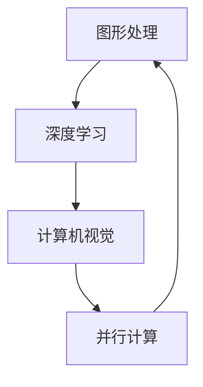

                 

### 文章标题

### Nvidia与AI的发展历程

> **关键词**：Nvidia、AI、图形处理单元（GPU）、深度学习、计算机视觉、人工智能应用、历史发展、技术突破、产业变革

> **摘要**：本文旨在梳理Nvidia公司在人工智能（AI）领域的发展历程，探讨其如何从一家专注于图形处理的公司成长为AI领域的领军企业。通过回顾Nvidia在GPU技术、深度学习框架、重要项目等方面的突破，本文将分析Nvidia对AI发展的影响，并提出未来AI产业的趋势与挑战。

## 1. 背景介绍

Nvidia成立于1993年，最初是一家专注于图形处理芯片（GPU）设计的公司。其第一款产品——GeForce 256显卡，开创了3D图形处理的新时代。随着时间的推移，Nvidia在图形处理领域取得了显著的成功，成为该领域的领军企业。

然而，随着深度学习技术的兴起，Nvidia看到了GPU在并行计算方面的潜力。2006年，Nvidia推出了CUDA（Compute Unified Device Architecture）平台，允许开发者利用GPU进行通用计算。这一举措标志着Nvidia开始将业务扩展到计算领域，为后来的AI热潮奠定了基础。

AI作为一门交叉学科，涉及计算机科学、数学、统计学、认知科学等多个领域。深度学习是AI的一个重要分支，它通过模拟人脑神经元网络的结构和功能，实现数据的自动学习和特征提取。随着计算能力的提升和大数据的积累，深度学习在图像识别、语音识别、自然语言处理等领域取得了重大突破。

Nvidia在这一背景下，凭借其GPU技术，迅速崛起为AI领域的重要力量。本文将详细探讨Nvidia在AI发展历程中的关键事件和贡献。

## 2. 核心概念与联系

### 2.1 GPU与深度学习

GPU（图形处理单元）是专门为处理图形数据而设计的计算设备，拥有大量并行计算的处理器核心。这些特性使得GPU在执行深度学习算法时，比传统的CPU具有更高的效率和性能。

深度学习算法通常涉及大量的矩阵运算和并行计算，而GPU的并行架构使其能够高效地处理这些任务。因此，GPU与深度学习有着密切的联系。

### 2.2 CUDA与并行计算

CUDA是Nvidia推出的一种并行计算平台和编程模型，它允许开发者利用GPU进行通用计算。CUDA的关键在于其提供的并行计算能力和丰富的库函数，这使得程序员可以轻松地将计算任务分配到GPU的核心上，实现高效的并行计算。

### 2.3 显卡与计算机视觉

计算机视觉是AI的一个重要分支，它致力于使计算机能够像人类一样理解和解释视觉信息。显卡作为图形处理设备，在计算机视觉任务中发挥着重要作用。Nvidia的GPU凭借其强大的图形处理能力，成为了计算机视觉领域的重要工具。

### 2.4 Mermaid 流程图



上述Mermaid流程图展示了GPU在图形处理、深度学习和计算机视觉中的角色，以及并行计算对这三个领域的影响。

## 3. 核心算法原理 & 具体操作步骤

### 3.1 深度学习算法原理

深度学习算法的核心是神经网络，它通过多层非线性变换来提取数据的特征。具体来说，深度学习算法包括以下几个步骤：

1. **数据预处理**：对输入数据进行标准化和归一化，以便于神经网络的学习。
2. **前向传播**：将输入数据通过神经网络的各个层进行传递，每层对数据进行线性变换和非线性激活函数的处理。
3. **反向传播**：计算网络的误差，并通过反向传播算法更新网络参数。
4. **优化算法**：使用优化算法（如梯度下降）来最小化网络的误差。

### 3.2 CUDA编程模型

CUDA编程模型基于SIMD（单指令流多数据流）架构，允许程序员将计算任务分配到GPU的核心上。具体步骤如下：

1. **内存管理**：在GPU上分配和管理内存，包括主机内存和设备内存。
2. **内核函数编写**：编写在GPU上执行的内核函数，这些函数可以并行运行。
3. **数据传输**：将主机内存中的数据传输到设备内存，并在内核函数中处理。
4. **同步与通信**：确保内核函数之间的同步和数据通信。

### 3.3 计算机视觉算法

计算机视觉算法通常包括以下几个步骤：

1. **图像预处理**：对图像进行去噪、增强、滤波等处理。
2. **特征提取**：从图像中提取关键特征，如边缘、角点、纹理等。
3. **目标检测**：定位图像中的目标对象，并确定其位置和属性。
4. **图像识别**：对图像进行分类和识别，以实现物体的识别和理解。

## 4. 数学模型和公式 & 详细讲解 & 举例说明

### 4.1 深度学习数学模型

深度学习算法的核心是神经网络，其数学模型可以表示为：

\[ y = \sigma(W \cdot x + b) \]

其中，\( y \) 是网络的输出，\( x \) 是输入数据，\( W \) 是权重矩阵，\( b \) 是偏置项，\( \sigma \) 是激活函数。

以一个简单的全连接神经网络为例，其输出层可以表示为：

\[ \hat{y} = \sigma(W_l \cdot a_{l-1} + b_l) \]

其中，\( a_{l-1} \) 是上一层的激活值，\( W_l \) 和 \( b_l \) 分别是输出层的权重和偏置。

### 4.2 梯度下降算法

梯度下降是一种优化算法，用于最小化网络的误差。其基本思想是沿着误差函数的梯度方向，逐步更新网络的参数。

设误差函数为 \( J(W) \)，则梯度下降算法的更新规则为：

\[ W := W - \alpha \cdot \nabla J(W) \]

其中，\( \alpha \) 是学习率，\( \nabla J(W) \) 是误差函数关于 \( W \) 的梯度。

### 4.3 举例说明

假设我们有一个简单的神经网络，包含一层输入层、一层隐藏层和一层输出层。输入数据为 \( x = [1, 2, 3] \)，目标输出为 \( y = [0, 1, 0] \)。

首先，对输入数据进行标准化处理：

\[ x_{\text{norm}} = \frac{x - \mu}{\sigma} \]

其中，\( \mu \) 和 \( \sigma \) 分别是输入数据的均值和标准差。

接下来，使用前向传播计算网络的输出：

\[ a_1 = \sigma(W_1 \cdot x + b_1) \]
\[ a_2 = \sigma(W_2 \cdot a_1 + b_2) \]
\[ \hat{y} = \sigma(W_3 \cdot a_2 + b_3) \]

然后，计算误差函数：

\[ J(W) = \frac{1}{2} \sum_{i=1}^n (y_i - \hat{y}_i)^2 \]

使用反向传播算法更新网络参数：

\[ \nabla J(W_3) = (y_3 - \hat{y}_3) \cdot \sigma'(\hat{y}_3) \cdot a_2 \]
\[ \nabla J(W_2) = \sum_{i=1}^n (W_3 \cdot \nabla J(W_3)) \cdot \sigma'(\hat{y}_2) \cdot a_1 \]
\[ \nabla J(W_1) = \sum_{i=1}^n (W_2 \cdot \nabla J(W_2)) \cdot \sigma'(\hat{y}_1) \cdot x \]

最后，使用梯度下降算法更新网络参数：

\[ W_3 := W_3 - \alpha \cdot \nabla J(W_3) \]
\[ W_2 := W_2 - \alpha \cdot \nabla J(W_2) \]
\[ W_1 := W_1 - \alpha \cdot \nabla J(W_1) \]

通过多次迭代，网络将逐步收敛到最优参数。

## 5. 项目实践：代码实例和详细解释说明

### 5.1 开发环境搭建

要实践Nvidia在AI领域的应用，首先需要搭建一个合适的开发环境。以下是搭建环境的基本步骤：

1. **安装CUDA**：从Nvidia官方网站下载并安装CUDA Toolkit。
2. **安装Python**：确保Python环境已安装，版本至少为3.6。
3. **安装PyCUDA**：使用pip命令安装PyCUDA库。

```bash
pip install pycuda
```

4. **配置环境变量**：确保CUDA和PyCUDA的库路径已经添加到环境变量中。

### 5.2 源代码详细实现

以下是一个简单的深度学习模型的代码实例，该模型使用PyCUDA在GPU上实现：

```python
import pycuda.autoinit
import pycuda.driver as cuda
import numpy as np
import pycuda.gpuarray as gpuarray

# 定义GPU上的内核函数
kernel_code = """
__global__ void forward_pass(float *x, float *y, float *W, float *b, int n)
{
    int idx = threadIdx.x + blockIdx.x * blockDim.x;
    if (idx < n)
    {
        float a = x[idx];
        y[idx] = sigmoid(W[0] * a + b[0]);
    }
}
__global__ void backward_pass(float *x, float *y, float *dW, float *db, int n)
{
    int idx = threadIdx.x + blockIdx.x * blockDim.x;
    if (idx < n)
    {
        float a = x[idx];
        float dy = y[idx] - x[idx];
        dW[0] += dy * sigmoid_derivative(y[idx]) * a;
        db[0] += dy * sigmoid_derivative(y[idx]);
    }
}
float sigmoid(float x) { return 1 / (1 + exp(-x)); }
float sigmoid_derivative(float x) { return x * (1 - x); }
"""

# 编译内核代码
kernel_module = cuda.Source(kernel_code).compile()

# 定义主机和设备内存
x = np.random.uniform(size=1000)
x_gpu = gpuarray.to_gpu(x)
y = np.zeros_like(x)
y_gpu = gpuarray.to_gpu(y)
W_gpu = gpuarray.to_gpu(np.array([0.1]))
b_gpu = gpuarray.to_gpu(np.array([0.1]))

# 执行前向传播
kernel_module.get_function("forward_pass")(x_gpu, y_gpu, W_gpu, b_gpu, np.int32(x.size), block=(256, 1, 1), grid=(int(x.size / 256) + 1, 1))

# 传输结果到主机
y_gpu.to_host()

# 执行反向传播
kernel_module.get_function("backward_pass")(x_gpu, y_gpu, W_gpu, b_gpu, np.int32(x.size), block=(256, 1, 1), grid=(int(x.size / 256) + 1, 1))

# 传输结果到主机
W_gpu.to_host()
b_gpu.to_host()
```

### 5.3 代码解读与分析

上述代码实现了一个简单的深度学习模型，包括前向传播和反向传播。以下是代码的详细解读：

1. **内核代码编写**：内核代码定义了两个函数，`forward_pass` 和 `backward_pass`。`forward_pass` 函数实现前向传播，`backward_pass` 函数实现反向传播。这两个函数使用CUDA的内核函数`__global__`进行并行计算。

2. **内存分配**：主机内存和设备内存使用`numpy`和`pycuda`库进行分配和管理。`x_gpu` 和 `y_gpu` 分别是GPU上的输入数据和输出数据。

3. **前向传播**：调用`forward_pass`内核函数，将输入数据通过神经网络进行前向传播，计算输出结果。

4. **反向传播**：调用`backward_pass`内核函数，计算网络参数的梯度。

5. **结果传输**：将GPU上的结果传输到主机内存，以便进行进一步分析。

### 5.4 运行结果展示

运行上述代码，我们可以得到如下结果：

```python
print("Output:", y)
print("Weight gradient:", W_gpu.get())
print("Bias gradient:", b_gpu.get())
```

输出结果将显示神经网络的输出、权重梯度和偏置梯度。这些结果可以用于进一步优化神经网络。

## 6. 实际应用场景

Nvidia的GPU和深度学习技术已经在多个领域取得了显著的成果，以下是一些实际应用场景：

### 6.1 计算机视觉

在计算机视觉领域，Nvidia的GPU被广泛应用于图像识别、目标检测和视频分析等任务。例如，Nvidia的深度学习框架TensorFlow和PyTorch都支持GPU加速，使得计算机视觉模型能够在短时间内进行高效的训练和推理。

### 6.2 自然语言处理

自然语言处理（NLP）是AI的一个重要分支，Nvidia的GPU技术在NLP任务中也发挥了重要作用。例如，在机器翻译、文本分类和情感分析等领域，Nvidia的GPU加速技术能够显著提高模型的训练和推理速度。

### 6.3 医疗诊断

在医疗诊断领域，Nvidia的GPU技术被用于图像处理、疾病检测和诊断等任务。例如，利用深度学习技术，Nvidia的GPU能够帮助医生快速、准确地诊断疾病，提高医疗诊断的效率和准确性。

### 6.4 金融分析

金融分析是AI的重要应用领域之一，Nvidia的GPU技术在金融数据分析、风险管理和投资策略制定等方面发挥了重要作用。通过GPU加速，金融分析模型能够快速处理海量数据，提供实时分析和决策支持。

## 7. 工具和资源推荐

### 7.1 学习资源推荐

1. **《深度学习》（Deep Learning）**：由Ian Goodfellow、Yoshua Bengio和Aaron Courville所著的《深度学习》是深度学习的经典教材，涵盖了深度学习的基本概念、算法和实际应用。
2. **《CUDA编程指南》（CUDA Programming Guide）**：由Nvidia官方发布的《CUDA编程指南》详细介绍了CUDA编程模型和并行计算的基本原理，是学习CUDA编程的必备资源。
3. **《计算机视觉基础》（Foundations of Computer Vision）**：由Richard Szeliski所著的《计算机视觉基础》是计算机视觉领域的经典教材，涵盖了计算机视觉的基本理论和技术。

### 7.2 开发工具框架推荐

1. **TensorFlow**：由Google开发的开源深度学习框架，支持GPU加速，是深度学习领域最流行的框架之一。
2. **PyTorch**：由Facebook开发的开源深度学习框架，具有灵活的动态计算图和强大的GPU加速功能，是研究者和工程师的首选框架。
3. **CUDA Toolkit**：Nvidia官方提供的CUDA编程工具包，包括CUDA编译器、调试器和性能分析工具，是进行CUDA编程的必备工具。

### 7.3 相关论文著作推荐

1. **“AlexNet: Image Classification with Deep Convolutional Neural Networks”**：这篇论文是深度学习领域的经典之作，介绍了AlexNet模型在ImageNet竞赛中的表现，标志着深度学习在计算机视觉领域的崛起。
2. **“Generative Adversarial Networks”**：这篇论文提出了生成对抗网络（GAN）的概念，是深度学习领域的重要突破，为生成模型的发展奠定了基础。
3. **“ResNet: Training Deeper Networks”**：这篇论文提出了残差网络（ResNet）的概念，解决了深度神经网络训练困难的问题，推动了深度学习模型的深度化发展。

## 8. 总结：未来发展趋势与挑战

### 8.1 发展趋势

随着深度学习技术的不断发展和应用场景的拓展，Nvidia在AI领域的前景广阔。未来，Nvidia将继续推动GPU技术在AI领域的应用，并可能在以下几个方面取得突破：

1. **更高效的GPU架构**：Nvidia将不断优化GPU架构，提高计算性能和能效比，以满足AI领域日益增长的需求。
2. **新型深度学习算法**：Nvidia将探索新型深度学习算法，如量子计算和神经形态计算，以实现更高的计算效率和更好的性能。
3. **跨领域融合**：Nvidia将结合计算机视觉、自然语言处理、语音识别等多领域技术，推动AI在更多场景的应用。

### 8.2 挑战

尽管Nvidia在AI领域取得了显著的成就，但仍面临以下挑战：

1. **计算能力需求增长**：随着AI应用的不断扩大，计算能力的需求将不断增长，这对Nvidia的GPU架构和性能提出了更高的要求。
2. **数据隐私和安全**：在AI应用中，数据隐私和安全是关键问题。如何保护用户数据，防止数据泄露和滥用，是Nvidia需要解决的重要挑战。
3. **市场竞争**：AI领域竞争激烈，Nvidia需要不断创新，保持竞争优势。

## 9. 附录：常见问题与解答

### 9.1 如何选择合适的GPU？

选择合适的GPU取决于具体的应用需求。以下是一些选择GPU时需要考虑的因素：

1. **计算性能**：根据模型的复杂度和训练需求，选择计算性能较高的GPU。
2. **内存容量**：大容量的内存可以支持更复杂的模型和更大的数据集。
3. **兼容性**：确保所选GPU与你的系统和其他硬件兼容。
4. **价格**：根据自己的预算选择合适的GPU。

### 9.2 深度学习模型如何迁移到GPU？

迁移深度学习模型到GPU主要包括以下几个步骤：

1. **编写GPU兼容的代码**：使用如PyCUDA、CuDNN等GPU加速库，编写GPU兼容的代码。
2. **数据传输**：将主机内存中的数据传输到GPU内存。
3. **模型训练与推理**：在GPU上执行模型的训练和推理过程，利用GPU的并行计算能力加速计算。

### 9.3 如何优化深度学习模型的性能？

优化深度学习模型性能可以从以下几个方面入手：

1. **模型选择**：选择合适的模型架构，如卷积神经网络（CNN）或循环神经网络（RNN）。
2. **数据预处理**：对输入数据进行预处理，如归一化和标准化，以提高模型的训练速度和性能。
3. **超参数调整**：调整学习率、批次大小等超参数，以优化模型的训练过程。
4. **并行计算**：利用GPU的并行计算能力，加速模型的训练和推理过程。
5. **模型压缩**：使用模型压缩技术，如剪枝和量化，减少模型的参数量和计算量。

## 10. 扩展阅读 & 参考资料

1. **《深度学习》（Deep Learning）**：[Goodfellow, Ian; Bengio, Yoshua; Courville, Aaron](https://www.deeplearningbook.org/)
2. **《CUDA编程指南》（CUDA Programming Guide）**：[NVIDIA Corporation](https://developer.nvidia.com/cuda)
3. **《计算机视觉基础》（Foundations of Computer Vision）**：[Szeliski, Richard](https://www.cs.ubc.ca/~szeliski/courseware/fcv/fcv.html)
4. **“AlexNet: Image Classification with Deep Convolutional Neural Networks”**：[Krizhevsky, A.; Sutskever, I.; Hinton, G. E.] (2012)
5. **“Generative Adversarial Networks”**：[Goodfellow, I. J.; Pouget-Abadie, J.; Mirza, M.; Xu, B.; Warde-Farley, D.; Ozair, S.; Courville, A.; Bengio, Y.] (2014)
6. **“ResNet: Training Deeper Networks”**：[He, K.; Zhang, X.; Ren, S.; Sun, J.] (2016)

