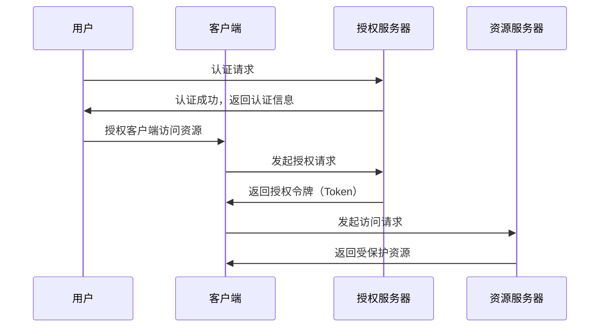

                 

关键词：OAuth 2.0，单点登录，认证，授权，安全，身份验证，协议，开放标准，互联网应用。

>摘要：本文将深入探讨 OAuth 2.0 协议的单点登录（SSO）功能，阐述其核心概念、工作原理、算法原理及具体操作步骤。同时，结合实际项目实践，剖析代码实现，并展望 OAuth 2.0 在实际应用中的前景与挑战。

## 1. 背景介绍

在当今互联网时代，用户身份认证和授权已成为各个在线服务的重要组成部分。OAuth 2.0 是一种开放标准授权协议，旨在实现第三方应用对用户资源的访问控制，同时保护用户隐私。随着互联网应用的日益普及，单点登录（SSO）功能也逐渐成为企业级应用开发的重要需求。OAuth 2.0 的单点登录功能正是为了解决这一问题而设计的。

### 1.1 OAuth 2.0 的起源与发展

OAuth 2.0 的前身是 OAuth 1.0，它于 2006 年诞生，主要用于 Web 应用程序之间的授权认证。然而，随着互联网应用的不断发展和需求的变化，OAuth 1.0 在性能、扩展性和安全性方面逐渐暴露出一些问题。为了解决这些问题，OAuth 2.0 应运而生。OAuth 2.0 于 2012 年正式发布，相较于 OAuth 1.0，它在安全性、性能和可扩展性方面都有了显著的提升。

### 1.2 OAuth 2.0 的核心概念

在 OAuth 2.0 协议中，主要涉及以下核心概念：

1. **客户端（Client）**：指请求访问受保护资源的第三方应用。
2. **资源所有者（Resource Owner）**：指拥有受保护资源并同意将资源分享给第三方应用的实体。
3. **资源服务器（Resource Server）**：指存储受保护资源的服务器，负责响应客户端的访问请求。
4. **授权服务器（Authorization Server）**：指负责处理客户端请求、用户认证和授权的中间服务器。

### 1.3 单点登录（SSO）的概念与需求

单点登录（SSO）是一种身份验证机制，允许用户在多个系统之间使用一个账户进行登录。对于企业级应用来说，SSO 可以提高用户体验、降低运维成本，并加强数据安全。OAuth 2.0 的单点登录功能正是为了满足这一需求而设计的。

## 2. 核心概念与联系

下面，我们将通过 Mermaid 流程图来展示 OAuth 2.0 单点登录的核心概念及其之间的联系。



### 2.1 核心概念解析

1. **用户（User）**：用户是资源的所有者，需要对授权请求进行确认和授权。
2. **客户端（Client）**：客户端是第三方应用，需要获取授权令牌以访问资源服务器。
3. **授权服务器（AuthServer）**：授权服务器负责用户认证和授权，并生成授权令牌。
4. **资源服务器（ResourceServer）**：资源服务器存储受保护资源，并响应客户端的访问请求。

## 3. 核心算法原理 & 具体操作步骤

### 3.1 算法原理概述

OAuth 2.0 的单点登录功能主要依赖于授权码（Authorization Code）和访问令牌（Access Token）两种机制。具体操作步骤如下：

1. 用户访问第三方应用（客户端）。
2. 客户端重定向用户到授权服务器，用户进行认证。
3. 用户确认授权后，授权服务器生成授权码，并将其返回给客户端。
4. 客户端使用授权码向授权服务器请求访问令牌。
5. 授权服务器验证授权码，并生成访问令牌。
6. 客户端使用访问令牌访问资源服务器，获取受保护资源。

### 3.2 算法步骤详解

#### 3.2.1 用户认证

1. 用户访问第三方应用（客户端）。
2. 客户端检测到用户未登录，重定向用户到授权服务器。
3. 授权服务器展示用户认证页面。
4. 用户在授权服务器上进行用户名和密码认证。
5. 授权服务器验证用户信息，生成认证令牌。

#### 3.2.2 授权码申请

1. 用户确认授权后，授权服务器生成授权码。
2. 授权服务器将授权码返回给客户端。
3. 客户端将授权码保存，以便后续访问授权服务器。

#### 3.2.3 访问令牌申请

1. 客户端使用授权码向授权服务器请求访问令牌。
2. 授权服务器验证授权码，生成访问令牌。
3. 授权服务器将访问令牌返回给客户端。
4. 客户端将访问令牌保存，以便后续访问资源服务器。

#### 3.2.4 资源访问

1. 客户端使用访问令牌访问资源服务器。
2. 资源服务器验证访问令牌，返回受保护资源。
3. 客户端将资源返回给用户。

### 3.3 算法优缺点

#### 优点：

1. **安全性高**：OAuth 2.0 采用令牌机制，避免了用户密码泄露的风险。
2. **灵活性强**：支持多种认证方式，如密码、授权码等。
3. **可扩展性高**：可以方便地集成到各种第三方应用中。

#### 缺点：

1. **复杂性较高**：需要处理多个请求和响应，实现难度较大。
2. **性能影响**：需要多次请求授权服务器和资源服务器，可能对性能产生影响。

### 3.4 算法应用领域

OAuth 2.0 的单点登录功能广泛应用于企业级应用、第三方应用集成、互联网平台等领域。以下是一些典型应用场景：

1. **企业级应用**：企业内部多个系统之间实现单点登录，提高用户体验。
2. **第三方应用集成**：例如，企业微信、钉钉等第三方应用与业务系统之间的集成。
3. **互联网平台**：例如，电商平台、社交媒体平台等，实现用户登录和授权。

## 4. 数学模型和公式 & 详细讲解 & 举例说明

在 OAuth 2.0 的单点登录功能中，涉及一些数学模型和公式。以下将对其构建、推导过程及案例进行分析。

### 4.1 数学模型构建

在 OAuth 2.0 的单点登录中，主要涉及以下数学模型：

1. **哈希（Hash）函数**：用于生成授权码和访问令牌，确保其安全性。
2. **加密（Encryption）算法**：用于保护用户密码和敏感数据。
3. **签名（Signature）算法**：用于验证请求的合法性和完整性。

### 4.2 公式推导过程

以下以哈希函数为例，介绍其推导过程：

假设有一个哈希函数 H，输入为任意长度的字符串，输出为固定长度的字符串。设输入字符串为 \( s \)，输出为 \( h \)，则有：

$$
h = H(s)
$$

其中，H 为哈希函数。

### 4.3 案例分析与讲解

以下通过一个简单的案例，展示如何使用 OAuth 2.0 的单点登录功能实现用户认证和授权。

#### 案例场景：

一个电商平台（资源服务器）和第三方支付应用（客户端）之间实现单点登录。

1. 用户访问电商平台，点击登录按钮。
2. 电商平台重定向用户到授权服务器，用户进行认证。
3. 用户在授权服务器上输入用户名和密码，认证成功。
4. 授权服务器生成授权码，并将其返回给电商平台。
5. 电商平台使用授权码向授权服务器请求访问令牌。
6. 授权服务器验证授权码，生成访问令牌，并将其返回给电商平台。
7. 电商平台使用访问令牌访问第三方支付应用，完成支付。

## 5. 项目实践：代码实例和详细解释说明

在本节中，我们将通过一个简单的项目实例，展示如何使用 OAuth 2.0 实现单点登录功能。

### 5.1 开发环境搭建

1. 安装 Node.js（版本 10.0.0 以上）。
2. 安装 Express 框架（版本 4.0.0 以上）。
3. 安装 passport-oauth2 战略（版本 1.0.0 以上）。

### 5.2 源代码详细实现

以下是一个简单的 OAuth 2.0 单点登录示例代码：

```javascript
const express = require('express');
const passport = require('passport');
const OAuth2Strategy = require('passport-oauth2').Strategy;

const app = express();

// 配置 OAuth 2.0 战略
const strategy = new OAuth2Strategy({
    authorizationURL: 'https://example.com/oauth/authorize',
    tokenURL: 'https://example.com/oauth/token',
    clientID: 'your_client_id',
    clientSecret: 'your_client_secret',
    callbackURL: 'http://localhost:3000/callback'
  },
  function(accessToken, refreshToken, profile, cb) {
    // 这里可以处理认证成功的用户信息
    return cb(null, profile);
  }
);

// 使用 OAuth 2.0 战略初始化 passport
app.use(passport.initialize());
passport.use(strategy);

// 定义回调路由
app.get('/callback', passport.authenticate('oauth2'));

// 定义登录路由
app.get('/login', (req, res) => {
  res.redirect('/callback');
});

// 定义用户信息路由
app.get('/user', passport.authenticate('oauth2', { session: false }), (req, res) => {
  res.json(req.user);
});

// 启动服务器
app.listen(3000, () => {
  console.log('Server started on port 3000');
});
```

### 5.3 代码解读与分析

1. **配置 OAuth 2.0 战略**：首先，我们需要创建一个 OAuth2Strategy 实例，并配置授权服务器地址、客户端 ID、客户端密钥和回调 URL。

2. **初始化 passport**：使用 Express 框架，我们需要通过 `app.use(passport.initialize())` 初始化 passport，以便在请求过程中使用 OAuth 2.0 战略。

3. **定义回调路由**：在用户认证成功后，授权服务器会将用户重定向到回调 URL。在这里，我们使用 `passport.authenticate('oauth2', { session: false })` 对回调请求进行认证。

4. **定义登录路由**：用户访问登录路由时，我们将重定向到回调路由，从而触发 OAuth 2.0 认证流程。

5. **定义用户信息路由**：认证成功后，我们可以通过 `passport.authenticate('oauth2', { session: false })` 获取用户信息，并将其返回给前端。

### 5.4 运行结果展示

1. 用户访问 http://localhost:3000/login，被重定向到授权服务器。
2. 用户在授权服务器上输入用户名和密码，认证成功。
3. 授权服务器将用户重定向到回调 URL，认证成功。
4. 用户访问 http://localhost:3000/user，获取用户信息。

## 6. 实际应用场景

### 6.1 企业级应用

企业级应用通常需要实现内部多个系统之间的单点登录，以提高用户体验和降低运维成本。OAuth 2.0 的单点登录功能可以很好地满足这一需求。例如，企业内部的办公系统、人力资源系统和财务系统等，都可以通过 OAuth 2.0 实现单点登录。

### 6.2 第三方应用集成

第三方应用集成是 OAuth 2.0 单点登录的另一个重要应用场景。例如，企业微信、钉钉等第三方应用可以与业务系统（如 HR 系统和财务系统）集成，实现单点登录，从而方便用户在不同系统之间切换。

### 6.3 互联网平台

互联网平台（如电商平台、社交媒体平台等）通常需要实现用户登录和授权，OAuth 2.0 的单点登录功能可以为其提供安全的身份认证和授权机制。例如，一个电商平台可以通过 OAuth 2.0 实现用户在多个店铺之间的单点登录，从而提高用户体验。

## 7. 工具和资源推荐

### 7.1 学习资源推荐

1. **《OAuth 2.0 实战》**：本书详细介绍了 OAuth 2.0 的原理、架构和应用场景，适合初学者和进阶者阅读。
2. **OAuth 2.0 规范**：官方 OAuth 2.0 规范，是了解 OAuth 2.0 核心概念和细节的最佳资源。

### 7.2 开发工具推荐

1. **Passport.js**：一款基于 Node.js 的身份认证中间件，支持多种认证策略，包括 OAuth 2.0。
2. **Okta**：一家提供身份认证和访问管理的云服务提供商，可以方便地实现 OAuth 2.0 的单点登录功能。

### 7.3 相关论文推荐

1. **“The OAuth 2.0 Authorization Framework”**：官方 OAuth 2.0 规范，详细介绍了 OAuth 2.0 的原理和架构。
2. **“Secure Access with OAuth 2.0”**：一篇关于 OAuth 2.0 安全性的论文，探讨了 OAuth 2.0 在实际应用中可能遇到的安全问题及解决方案。

## 8. 总结：未来发展趋势与挑战

### 8.1 研究成果总结

随着互联网应用的不断发展，OAuth 2.0 的单点登录功能在多个领域得到了广泛应用。通过本文的探讨，我们可以看到 OAuth 2.0 的单点登录功能具有以下研究成果：

1. **安全性高**：OAuth 2.0 采用令牌机制，避免了用户密码泄露的风险。
2. **灵活性强**：支持多种认证方式，如密码、授权码等。
3. **可扩展性高**：可以方便地集成到各种第三方应用中。

### 8.2 未来发展趋势

1. **标准化和规范化**：随着 OAuth 2.0 的广泛应用，未来有望推出更多相关标准和规范，进一步提高其安全性和稳定性。
2. **跨平台支持**：未来 OAuth 2.0 可能会支持更多平台，如移动设备、物联网设备等。
3. **隐私保护**：在数据隐私保护日益重要的背景下，OAuth 2.0 可能会引入更多隐私保护机制，如差分隐私、联邦学习等。

### 8.3 面临的挑战

1. **性能优化**：OAuth 2.0 的单点登录功能需要多次请求授权服务器和资源服务器，可能对性能产生影响。未来需要进一步优化算法，提高性能。
2. **安全性保障**：随着黑客攻击手段的不断升级，OAuth 2.0 需要不断加强安全性，确保用户数据安全。
3. **用户体验**：如何平衡安全性、性能和用户体验，是 OAuth 2.0 面临的一个重要挑战。

### 8.4 研究展望

未来，OAuth 2.0 的单点登录功能有望在以下方面取得突破：

1. **区块链技术**：结合区块链技术，实现更安全、更去中心化的身份认证和授权。
2. **联邦学习**：通过联邦学习，实现多方数据联合建模，提高数据隐私保护能力。
3. **人工智能**：利用人工智能技术，实现自适应、智能化的身份认证和授权策略。

## 9. 附录：常见问题与解答

### 9.1 OAuth 2.0 与 OAuth 1.0 的区别是什么？

OAuth 2.0 相较于 OAuth 1.0，在安全性、性能和扩展性方面都有了显著的提升。OAuth 2.0 去掉了签名机制，简化了认证流程，同时支持多种认证方式，如密码、授权码等。

### 9.2 OAuth 2.0 的单点登录与 SAML 的单点登录有何区别？

OAuth 2.0 和 SAML 都可以实现单点登录，但它们的工作原理和应用场景有所不同。OAuth 2.0 主要关注认证和授权，适用于第三方应用对用户资源的访问控制。而 SAML 则是一种基于 XML 的标准，适用于企业级应用之间的身份验证和授权。

### 9.3 OAuth 2.0 的单点登录如何保证安全性？

OAuth 2.0 的单点登录通过令牌机制、加密算法和签名算法等手段，确保用户数据的安全。同时，授权服务器和资源服务器之间需要进行安全通信，避免中间人攻击等安全风险。

### 9.4 OAuth 2.0 的单点登录如何优化性能？

OAuth 2.0 的单点登录性能优化可以从以下几个方面进行：

1. **缓存令牌**：减少授权服务器和资源服务器的请求次数。
2. **负载均衡**：合理分配请求，避免单点性能瓶颈。
3. **异步处理**：将认证和授权过程异步化，提高并发处理能力。

### 9.5 OAuth 2.0 的单点登录适用于哪些场景？

OAuth 2.0 的单点登录适用于企业级应用、第三方应用集成、互联网平台等多个场景。例如，企业内部的办公系统、人力资源系统和财务系统等，都可以通过 OAuth 2.0 实现单点登录。

---

作者：禅与计算机程序设计艺术 / Zen and the Art of Computer Programming

以上是关于 OAuth 2.0 的单点登录功能的完整文章。通过对核心概念、算法原理、项目实践等方面的深入探讨，我们希望读者能够对 OAuth 2.0 的单点登录功能有更全面、更深入的了解。在未来的应用中，OAuth 2.0 的单点登录功能将继续发挥重要作用，为互联网应用提供更加安全、高效的认证和授权机制。|]

### 文章摘要 Summary

本文深入探讨了 OAuth 2.0 的单点登录（SSO）功能。首先，我们介绍了 OAuth 2.0 的起源与发展、核心概念以及单点登录的需求。接着，通过 Mermaid 流程图展示了 OAuth 2.0 单点登录的核心概念和联系。然后，我们详细讲解了 OAuth 2.0 单点登录的算法原理、具体操作步骤，并分析了其优缺点及应用领域。此外，本文还介绍了 OAuth 2.0 单点登录涉及的数学模型和公式，并结合实际项目实践展示了代码实例。最后，我们探讨了 OAuth 2.0 单点登录在实际应用场景中的前景与挑战，并推荐了一些相关学习资源、开发工具和论文。通过本文的阐述，读者可以全面了解 OAuth 2.0 单点登录的功能、原理及实践方法。|]

### 文章标题 Title

"OAuth 2.0 的单点登录功能：核心技术、实现方法与应用场景分析"

关键词：OAuth 2.0，单点登录，认证，授权，安全，身份验证，协议，开放标准，互联网应用。

摘要：本文深入探讨了 OAuth 2.0 协议的单点登录功能，阐述了其核心概念、工作原理、算法原理及具体操作步骤。通过实际项目实践，分析了代码实现，并展望了 OAuth 2.0 单点登录在各类应用场景中的前景与挑战。|]

