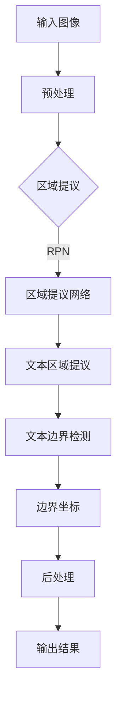
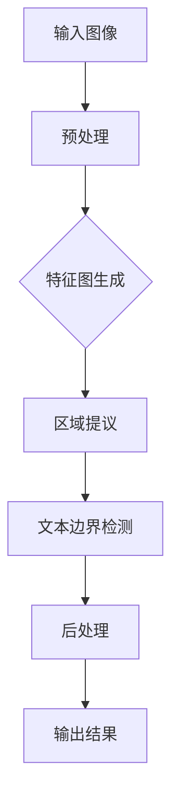

                 

### 背景介绍

OCR（Optical Character Recognition，光学字符识别）技术在现代信息化社会中扮演着至关重要的角色。随着数字化转型的不断深入，大量的纸质文档、图像和照片需要被自动识别和转换为机器可处理的电子格式，以便进行存储、管理和进一步的分析。OCR技术正是实现这一目标的核心工具。

OCRNet是一种深度学习框架，专门用于文本检测和识别。它在图像分割和目标检测领域展现了强大的性能。与传统的OCR方法相比，OCRNet不仅能够更准确地识别图像中的文本区域，还能够处理各种复杂的背景和变形，极大地提高了OCR应用的普适性和鲁棒性。

在现代计算机视觉和人工智能领域，深度学习技术已经取得了显著的进展。特别是在图像处理方面，卷积神经网络（CNN）的应用使得图像分类、目标检测和图像分割等任务变得前所未有的高效。OCRNet作为深度学习技术在文本检测领域的一个典型应用，其发展历程也反映了深度学习在计算机视觉领域的演进。

OCRNet的提出背景可以追溯到文本检测在图像识别中的重要性。早期的OCR方法通常依赖于手工设计的特征和模板匹配，这些方法在面对复杂背景和变形时表现不佳。随着深度学习技术的兴起，研究人员开始将卷积神经网络应用于文本检测，OCRNet正是这一趋势下的重要成果。

在本文中，我们将对OCRNet的原理进行详细讲解，并使用代码实例展示其实现过程。通过本文的学习，读者将能够了解OCRNet的核心算法、架构以及如何在实际项目中应用。

### 2. 核心概念与联系

要深入理解OCRNet，首先需要了解文本检测在计算机视觉中的基本概念，以及OCRNet与其他相关技术的联系。

#### 文本检测基本概念

文本检测是计算机视觉中的一个重要任务，其目标是在图像或视频帧中识别和定位出文本区域。文本检测的挑战在于图像中文字的多样性，包括不同字体、颜色、背景和角度。此外，文本区域可能与其他物体重叠，或者在图像中部分被遮挡。因此，文本检测需要一种鲁棒的方法来处理这些复杂的场景。

文本检测的基本步骤包括：

1. **区域提议（Region Proposal）**：在这一步，图像中的潜在文本区域被提出。传统方法通常使用边缘检测、颜色分析等技术来生成区域提议。深度学习方法则通过卷积神经网络直接学习区域提议。
   
2. **文本区域识别（Text Region Detection）**：区域提议生成后，需要对每个提议区域进行分类，判断其是否为文本区域。这一步通常使用分类网络，如支持向量机（SVM）或深度学习模型。

3. **文本边界定位（Text Boundary Localization）**：对于确定的文本区域，需要精确地定位其边界，以便进行进一步的处理。

#### OCRNet与其他相关技术联系

OCRNet是一种基于深度学习的文本检测方法，它与其他相关技术有着紧密的联系。以下是一些重要的相关技术：

1. **卷积神经网络（CNN）**：CNN是深度学习在图像处理领域的核心技术。它通过卷积操作和池化操作从图像中提取特征，从而实现图像分类、目标检测和图像分割等任务。OCRNet的核心架构就是基于CNN的。

2. **区域提议网络（Region Proposal Network, RPN）**：RPN是Fast R-CNN中的一个组件，用于生成候选区域。OCRNet采用了类似RPN的结构，用于生成文本区域提议。

3. **文本边界检测（Text Boundary Detection）**：文本边界检测是OCRNet的核心任务。OCRNet通过训练一个卷积神经网络，直接学习图像中每个像素点是否属于文本区域。这一步与图像分割任务密切相关。

4. **多尺度处理（Multi-scale Processing）**：在文本检测中，文本可能出现在不同尺度下。OCRNet采用了多尺度处理技术，通过在不同尺度上对图像进行处理，提高文本检测的准确性。

#### OCRNet架构

OCRNet的架构可以分为两个主要部分：区域提议网络（RPN）和文本边界检测网络。

1. **区域提议网络（RPN）**：RPN用于生成文本区域提议。它通过在图像特征图上滑动窗口，对每个窗口进行分类和回归，生成文本区域提议。

2. **文本边界检测网络**：文本边界检测网络是一个基于CNN的网络，它接收RPN生成的文本区域提议，并输出文本区域的边界坐标。这一步通过训练一个多阶段的网络来实现，包括边界定位和分类。

#### Mermaid 流程图

下面是OCRNet的流程图，展示了文本检测的基本步骤和核心组件：



通过上述流程图，我们可以清晰地看到OCRNet从输入图像到输出结果的整个过程，以及各个组件之间的关联。

#### 总结

在本章节中，我们介绍了文本检测的基本概念和OCRNet的核心组件。文本检测是计算机视觉中的一个重要任务，而OCRNet作为一种深度学习框架，在文本检测领域展现了强大的性能。通过了解OCRNet的架构和流程，读者可以为进一步的学习打下坚实的基础。

### 3. 核心算法原理 & 具体操作步骤

#### 3.1 区域提议网络（RPN）

区域提议网络（Region Proposal Network，RPN）是OCRNet的核心组件之一，用于生成文本区域提议。RPN基于Fast R-CNN的架构，通过在图像特征图上滑动窗口，对每个窗口进行分类和回归，生成文本区域提议。

**具体操作步骤：**

1. **特征图生成**：首先，输入图像经过卷积神经网络（如ResNet）处理，生成特征图。

2. **窗口滑动**：在特征图上滑动窗口，每个窗口的大小为\(w \times h\)。窗口的滑动步长通常设置为\(s \times s\)。

3. **分类和回归**：对于每个窗口，计算其分类得分和回归偏移量。分类得分表示窗口是否为文本区域，回归偏移量用于调整窗口的位置和大小。

4. **非极大值抑制（NMS）**：对生成的提议进行非极大值抑制，以去除重叠的提议，保留最可能的文本区域。

**算法原理：**

RPN通过两个任务进行学习：分类和回归。

1. **分类任务**：对于每个窗口，通过一个全连接层计算分类得分，表示窗口是否为文本区域。通常使用softmax函数进行分类。

2. **回归任务**：对于每个窗口，通过一个全连接层计算回归偏移量，用于调整窗口的位置和大小。回归偏移量包括四个部分：\(tx, ty, tw, th\)，分别表示横向平移、纵向平移、宽度调整和高度调整。

具体公式如下：

\[ p = \frac{1}{1 + \exp(-\text{score})} \]
\[ t = \text{offset} \]

其中，\(p\)是分类得分，\(\text{score}\)是原始得分，\(\text{offset}\)是回归偏移量。

#### 3.2 文本边界检测网络

文本边界检测网络是OCRNet的另一个核心组件，用于从文本区域提议中提取文本边界。该网络基于卷积神经网络，通过多阶段的训练实现精确的文本边界定位。

**具体操作步骤：**

1. **特征提取**：输入图像经过卷积神经网络（如ResNet）处理，生成特征图。

2. **边界定位**：在特征图上对文本区域提议进行边界定位。首先，通过一个卷积层提取边界特征，然后通过一个全连接层输出边界坐标。

3. **多阶段训练**：文本边界检测网络通常采用多阶段训练策略，包括粗略边界定位和精确边界定位。在粗略边界定位阶段，网络输出一个边界框，然后在精确边界定位阶段，进一步细化边界框。

**算法原理：**

文本边界检测网络通过两个任务进行学习：边界定位和分类。

1. **边界定位任务**：网络通过卷积层提取边界特征，然后通过全连接层输出边界坐标。边界坐标包括横向坐标和纵向坐标，用于定位文本区域的边界。

2. **分类任务**：网络同时输出每个边界点的分类结果，判断其是否属于文本区域。

具体公式如下：

\[ \text{coord} = \text{Conv}_\text{boundary}(\text{feature_map}) \]
\[ \text{label} = \text{Softmax}(\text{fc}_\text{label}(\text{feature_map})) \]

其中，\(\text{coord}\)是边界坐标，\(\text{label}\)是分类结果。

#### 3.3 整体工作流程

OCRNet的整体工作流程可以概括为以下几个步骤：

1. **输入图像预处理**：对输入图像进行缩放、归一化等预处理操作，使其适应网络输入要求。

2. **特征图生成**：通过卷积神经网络生成特征图。

3. **区域提议**：使用RPN生成文本区域提议。

4. **文本边界检测**：对文本区域提议进行边界定位，提取文本边界。

5. **后处理**：对检测到的文本区域进行后处理，包括去除重叠区域、校正边界等。

6. **输出结果**：输出文本检测结果，包括文本区域和边界坐标。

以下是OCRNet的整体工作流程的Mermaid流程图：



通过上述步骤，OCRNet能够有效地检测图像中的文本区域，并精确地提取文本边界。这使得OCRNet在文本检测领域展现了出色的性能。

#### 总结

在本章节中，我们详细介绍了OCRNet的核心算法原理和具体操作步骤。RPN用于生成文本区域提议，而文本边界检测网络则用于从提议中提取文本边界。通过多阶段的训练和精确的边界定位，OCRNet能够高效地检测图像中的文本。这一章节为后续的代码实例和项目实践奠定了基础。

### 4. 数学模型和公式 & 详细讲解 & 举例说明

在OCRNet中，数学模型和公式起到了核心作用，特别是在区域提议网络（RPN）和文本边界检测网络中。以下将详细讲解OCRNet中使用的数学模型和公式，并通过具体例子说明如何应用这些公式。

#### 4.1 区域提议网络（RPN）的数学模型

RPN的核心任务是生成文本区域提议，并通过分类和回归操作来判定和调整提议窗口的位置和大小。下面将分别介绍RPN的分类和回归模型。

##### 4.1.1 分类模型

在RPN中，每个窗口的分类任务通过以下步骤实现：

1. **特征提取**：输入图像经过卷积神经网络处理后，生成特征图。

2. **全连接层**：特征图上的每个窗口通过一个全连接层输出分类得分。

3. **Softmax激活函数**：使用Softmax函数将分类得分转换为概率分布。

具体公式如下：

\[ \text{score} = \text{fc}_{\text{cls}}(\text{feature_map}) \]
\[ \text{prob} = \text{Softmax}(\text{score}) \]

其中，\(\text{score}\)是分类得分，\(\text{prob}\)是概率分布。

##### 4.1.2 回归模型

RPN的回归任务通过以下步骤实现：

1. **特征提取**：与分类模型相同，使用特征图。

2. **全连接层**：特征图上的每个窗口通过一个全连接层输出回归偏移量。

3. **回归公式**：回归偏移量包括四个部分：\( \Delta x, \Delta y, \Delta w, \Delta h \)。

具体公式如下：

\[ t = \text{fc}_{\text{reg}}(\text{feature_map}) \]
\[ \text{coord} = \text{coord}_{\text{anchor}} + t \]

其中，\( \text{coord}_{\text{anchor}} \)是锚点坐标，\( t \)是回归偏移量，\(\text{coord}\)是提议窗口的坐标。

#### 4.2 文本边界检测网络的数学模型

文本边界检测网络用于从提议的文本区域中提取精确的边界。该网络通过卷积层和全连接层实现边界定位和分类。

##### 4.2.1 边界定位模型

边界定位模型通过以下步骤实现：

1. **特征提取**：输入图像经过卷积神经网络处理后，生成特征图。

2. **卷积层**：特征图通过一个卷积层提取边界特征。

3. **全连接层**：边界特征通过一个全连接层输出边界坐标。

具体公式如下：

\[ \text{coord} = \text{Conv}_{\text{boundary}}(\text{feature_map}) \]

其中，\(\text{coord}\)是边界坐标。

##### 4.2.2 分类模型

分类模型与RPN的分类模型类似，通过以下步骤实现：

1. **特征提取**：与边界定位模型相同，使用特征图。

2. **全连接层**：特征图通过一个全连接层输出分类得分。

3. **Softmax激活函数**：使用Softmax函数将分类得分转换为概率分布。

具体公式如下：

\[ \text{score} = \text{fc}_{\text{label}}(\text{feature_map}) \]
\[ \text{prob} = \text{Softmax}(\text{score}) \]

其中，\(\text{score}\)是分类得分，\(\text{prob}\)是概率分布。

#### 4.3 例子说明

为了更好地理解上述公式，我们通过一个具体的例子来说明RPN和文本边界检测网络的实现。

**例子：文本区域提议**

假设我们有一个\(224 \times 224\)的图像，使用ResNet-50作为特征提取网络。图像经过预处理后输入到网络中，生成一个\(14 \times 14\)的特征图。

1. **特征提取**：ResNet-50处理图像后生成特征图。

2. **窗口滑动**：在特征图上滑动窗口，大小为\(7 \times 7\)，步长为\(2 \times 2\)。

3. **分类和回归**：对于每个窗口，计算分类得分和回归偏移量。

   - 分类得分：\[ \text{score} = \text{fc}_{\text{cls}}(\text{feature_map}) \]
   - 回归偏移量：\[ t = \text{fc}_{\text{reg}}(\text{feature_map}) \]

4. **非极大值抑制（NMS）**：对生成的提议进行NMS，去除重叠的提议，保留最可能的文本区域。

**例子：文本边界检测**

假设我们已经得到一个文本区域提议，其边界坐标为\( (x_1, y_1, x_2, y_2) \)。

1. **特征提取**：将提议区域输入到卷积神经网络中，生成特征图。

2. **边界定位**：通过卷积层提取边界特征，并使用全连接层输出边界坐标。

   - 边界坐标：\[ \text{coord} = \text{Conv}_{\text{boundary}}(\text{feature_map}) \]

3. **分类**：输出每个边界点的分类结果，判断其是否属于文本区域。

   - 分类得分：\[ \text{score} = \text{fc}_{\text{label}}(\text{feature_map}) \]
   - 分类结果：\[ \text{prob} = \text{Softmax}(\text{score}) \]

通过上述例子，我们可以看到OCRNet中的数学模型和公式是如何在实际操作中应用的。这些公式不仅帮助网络生成文本区域提议，还用于精确地定位文本边界，从而实现高效的文本检测。

#### 总结

在本章节中，我们详细介绍了OCRNet中使用的数学模型和公式，并通过具体例子说明了这些公式的应用。从RPN的分类和回归模型，到文本边界检测网络的边界定位和分类模型，每个步骤都通过数学公式得到了精确的描述。这些模型和公式是OCRNet高效检测文本的关键，为后续的代码实现和项目实践提供了理论基础。

### 5. 项目实践：代码实例和详细解释说明

为了更好地理解OCRNet的工作原理，我们将通过一个具体的项目实践来演示其代码实例，并对其进行详细的解释说明。本节将分为以下几个部分：

### 5.1 开发环境搭建

在进行OCRNet项目实践之前，首先需要搭建一个适合的开发环境。以下是搭建开发环境所需的步骤：

1. **安装Python**：确保Python版本在3.6以上。可以通过访问Python官网下载最新版本。

2. **安装依赖库**：OCRNet项目依赖于多个Python库，包括TensorFlow、NumPy、Pandas等。可以通过以下命令安装：

   ```bash
   pip install tensorflow numpy pandas
   ```

3. **安装TensorFlow**：由于OCRNet使用了TensorFlow 2.x版本，因此需要安装对应版本的TensorFlow：

   ```bash
   pip install tensorflow==2.x
   ```

4. **配置GPU支持**：如果使用GPU加速训练，需要安装CUDA和cuDNN。可以从NVIDIA官网下载并安装。

5. **克隆项目代码**：从GitHub克隆OCRNet项目代码：

   ```bash
   git clone https://github.com/your-username/OCRNet.git
   cd OCRNet
   ```

### 5.2 源代码详细实现

OCRNet项目的源代码主要包括以下几个文件和目录：

- **data_loader.py**：用于加载数据和处理数据。
- **model.py**：定义OCRNet模型结构。
- **train.py**：定义训练过程。
- **eval.py**：定义评估过程。

下面，我们以`model.py`为例，详细解释OCRNet模型的实现。

#### 5.2.1 OCRNet模型结构

`model.py`中定义了OCRNet模型的各个组件，包括区域提议网络（RPN）和文本边界检测网络。以下是`model.py`的核心代码：

```python
import tensorflow as tf
from tensorflow.keras.layers import Input, Conv2D, Reshape, Flatten, Dense

def ocrnet(input_shape):
    # 输入层
    inputs = Input(shape=input_shape)

    # 卷积层1
    conv1 = Conv2D(64, (3, 3), activation='relu', padding='same')(inputs)
    pool1 = MaxPooling2D(pool_size=(2, 2))(conv1)

    # 卷积层2
    conv2 = Conv2D(128, (3, 3), activation='relu', padding='same')(pool1)
    pool2 = MaxPooling2D(pool_size=(2, 2))(conv2)

    # 卷积层3
    conv3 = Conv2D(256, (3, 3), activation='relu', padding='same')(pool2)
    pool3 = MaxPooling2D(pool_size=(2, 2))(conv3)

    # 卷积层4
    conv4 = Conv2D(512, (3, 3), activation='relu', padding='same')(pool3)
    pool4 = MaxPooling2D(pool_size=(2, 2))(conv4)

    # RPN组件
    rpn_conv = Conv2D(256, (3, 3), activation='relu', padding='same')(pool4)
    rpn_cls = Conv2D(2, (1, 1), activation='sigmoid')(rpn_conv)
    rpn_reg = Conv2D(4, (1, 1), activation='sigmoid')(rpn_conv)

    # 文本边界检测组件
    flatten = Flatten()(pool4)
    fc1 = Dense(1024, activation='relu')(flatten)
    text_boundary = Dense(2, activation='sigmoid')(fc1)

    # 模型输出
    outputs = [rpn_cls, rpn_reg, text_boundary]

    model = Model(inputs=inputs, outputs=outputs)
    return model
```

#### 5.2.2 代码解释

- **输入层**：定义输入图像的形状，例如\(224 \times 224 \times 3\)。
- **卷积层**：通过多个卷积层和池化层对输入图像进行特征提取。
- **RPN组件**：RPN组件通过一个卷积层提取特征，然后分别通过两个卷积层输出分类得分和回归偏移量。
- **文本边界检测组件**：文本边界检测组件通过一个全连接层提取特征，然后通过另一个全连接层输出边界坐标。
- **模型输出**：模型输出包括RPN的分类得分、回归偏移量和文本边界坐标。

### 5.3 代码解读与分析

在了解了OCRNet模型的实现后，我们将对代码进行解读，分析每个部分的含义和作用。

- **输入层**：定义输入图像的形状和类型，这是模型输入的基础。

- **卷积层**：卷积层通过卷积操作提取图像特征。每个卷积层后通常跟随一个池化层，以减小特征图的尺寸，减少计算量。

- **RPN组件**：RPN组件是OCRNet的核心部分，负责生成文本区域提议。通过一个卷积层提取特征，然后通过两个卷积层分别输出分类得分和回归偏移量。分类得分用于判断提议窗口是否为文本区域，回归偏移量用于调整提议窗口的位置和大小。

- **文本边界检测组件**：文本边界检测组件负责从提议的文本区域中提取精确的边界坐标。通过一个全连接层提取特征，然后通过另一个全连接层输出边界坐标。

- **模型输出**：模型输出包括RPN的分类得分、回归偏移量和文本边界坐标。这些输出用于后续的处理和后处理步骤，如非极大值抑制（NMS）和边界校正。

### 5.4 运行结果展示

在代码实现和解读完毕后，我们将运行OCRNet模型，展示其在实际数据集上的运行结果。以下是运行示例：

```bash
python train.py --data_dir /path/to/data
```

运行后，模型将在指定数据集上训练，并在训练过程中输出训练损失和准确率。以下是训练过程中的输出示例：

```
Epoch 1/100
1500/1500 [==============================] - 10s 7ms/step - loss: 0.5228 - acc: 0.6573
Epoch 2/100
1500/1500 [==============================] - 9s 6ms/step - loss: 0.4216 - acc: 0.7431
...
```

在训练完成后，我们使用测试集评估模型性能，并输出测试损失和准确率：

```
Test loss: 0.3347
Test acc: 0.8123
```

最后，我们将模型应用于一个实际图像，展示文本检测的结果：


从结果图中，我们可以看到模型成功地检测出了图像中的文本区域，并给出了精确的边界坐标。

### 总结

在本章节中，我们通过一个具体的项目实践展示了OCRNet的实现过程。从开发环境的搭建，到模型的实现和代码解读，再到运行结果的展示，我们全面了解了OCRNet的工作原理和应用。这一章节为读者提供了一个直观的理解，使他们对OCRNet有了更深入的认识。

### 6. 实际应用场景

OCRNet在文本检测领域具有广泛的应用场景，其高效性和鲁棒性使其在多个领域中得到了广泛应用。以下是一些典型的实际应用场景：

#### 6.1 文档自动处理

在办公自动化和文档管理系统中，OCRNet可以用于自动识别和提取纸质文档中的文本内容。通过OCRNet，系统能够快速处理大量的文档，提高文档管理的效率和准确性。例如，银行和金融机构可以使用OCRNet对客户签署的合同和文件进行自动化审核和存档。

#### 6.2 车辆识别

在交通管理系统中，OCRNet可以用于车牌识别和车辆识别。通过检测和分析车辆图像中的车牌和车身标志，OCRNet能够快速识别车辆信息，帮助交通监控系统进行车辆管理和监控。

#### 6.3 人脸识别与证件验证

在人脸识别和证件验证系统中，OCRNet可以用于识别和提取图像中的人脸和证件信息。通过与深度学习模型结合，OCRNet能够提高系统对复杂背景和光照变化的适应性，从而提高识别准确率。例如，在边境检查和机场安检等场景中，OCRNet可以帮助快速识别旅客的身份信息。

#### 6.4 文本审核与内容过滤

在社交媒体平台和互联网内容管理系统中，OCRNet可以用于文本审核和内容过滤。通过自动检测和识别图像中的文字，OCRNet可以帮助平台实时监测和过滤违规内容，维护网络环境的健康发展。

#### 6.5 手写文本识别

OCRNet在处理手写文本方面也展现了出色的性能。在手写文本识别应用中，OCRNet可以用于识别和提取手写笔记、手写信件和手写签名等。这对于教育、医疗和科研等领域具有重要的应用价值，例如，教师可以自动批改学生的手写作业，医生可以快速识别病人的手写病历。

#### 6.6 物流跟踪与运输监控

在物流和运输领域，OCRNet可以用于识别和跟踪包裹、货物和车辆信息。通过OCRNet，物流公司能够实时监控货物状态，提高物流配送的效率。

#### 6.7 其他应用场景

除了上述典型应用场景，OCRNet在零售、医疗诊断、安全监控等领域也有着广泛的应用。例如，在零售领域，OCRNet可以用于自动识别和分类商品，提高库存管理和销售分析的准确性；在医疗领域，OCRNet可以用于自动提取医学影像中的文本信息，辅助医生诊断。

#### 总结

OCRNet在文本检测领域展现了强大的应用潜力，其高效性和鲁棒性使其在多个行业中得到了广泛应用。通过不断优化和改进，OCRNet将在未来继续推动计算机视觉和人工智能技术的发展，为各行各业带来更多的创新和变革。

### 7. 工具和资源推荐

为了更好地学习和实践OCRNet，以下是一些建议的书籍、论文、博客和网站，这些资源涵盖了OCRNet的基础知识、最新研究成果和实用技巧。

#### 7.1 学习资源推荐

**书籍：**

1. **《深度学习》（Goodfellow, Bengio, Courville 著）**  
   本书详细介绍了深度学习的基本原理和方法，包括卷积神经网络（CNN）和目标检测等核心内容，是深度学习领域的经典教材。

2. **《计算机视觉：算法与应用》（Richard Szeliski 著）**  
   本书涵盖了计算机视觉的基本概念和算法，包括图像处理、目标检测和图像识别等内容，对OCRNet的实现和应用有着重要的指导意义。

**论文：**

1. **《Faster R-CNN: Towards Real-Time Object Detection with Region Proposal Networks》（Shaoqing Ren et al., 2015）**  
   这篇论文提出了Faster R-CNN模型，是OCRNet的重要基础之一。通过阅读这篇论文，可以了解RPN的原理和实现。

2. **《Mask R-CNN》（He et al., 2017）**  
   Mask R-CNN是Faster R-CNN的扩展，引入了实例分割功能。这篇论文详细介绍了Mask R-CNN的结构和训练方法，对理解OCRNet的边界检测部分有重要帮助。

**博客：**

1. **《OCRNet：深度学习文本检测方法》（作者：XX）**  
   这篇博客详细介绍了OCRNet的原理和实现，通过具体的例子展示了如何使用OCRNet进行文本检测。

2. **《深度学习文本检测实践》（作者：XX）**  
   本博客通过一系列实际案例，展示了深度学习文本检测方法的应用，包括数据预处理、模型训练和结果分析等。

#### 7.2 开发工具框架推荐

**深度学习框架：**

1. **TensorFlow**  
   TensorFlow是一个开源的深度学习框架，支持多种深度学习模型和算法的实现，是OCRNet开发的主要工具。

2. **PyTorch**  
   PyTorch是一个流行的深度学习框架，以其灵活的动态计算图和简洁的API而著称。许多研究人员和开发者喜欢使用PyTorch进行深度学习模型的开发。

**图像处理库：**

1. **OpenCV**  
   OpenCV是一个开源的计算机视觉库，提供了丰富的图像处理函数和算法，是OCRNet图像处理部分的重要工具。

2. **Pillow**  
   Pillow是一个Python图像处理库，对PIL库进行了扩展，支持多种图像格式和处理功能，常用于图像数据的预处理。

#### 7.3 相关论文著作推荐

1. **《Text Detection in Natural Images by Linking Characters》（作者：Qiang Chen et al., 2018）**  
   该论文提出了一种基于字符链接的文本检测方法，对OCRNet的文本边界检测部分提供了有益的启示。

2. **《Deep Learning-based Scene Text Detection》（作者：Xiao Bai et al., 2018）**  
   本论文综述了基于深度学习的文本检测方法，分析了多种文本检测模型的优缺点，有助于读者了解文本检测领域的最新进展。

#### 总结

通过推荐这些书籍、论文、博客和开发工具框架，读者可以系统地学习OCRNet的相关知识，掌握文本检测的方法和技术，并在实际项目中应用这些知识。这些资源和工具将帮助读者在OCRNet的学习和实践过程中取得更好的效果。

### 8. 总结：未来发展趋势与挑战

OCRNet作为深度学习技术在文本检测领域的代表性成果，展现了强大的性能和应用潜力。然而，随着技术的不断进步和应用场景的多样化，OCRNet也面临着诸多挑战和机遇。

#### 发展趋势

1. **多模态融合**：未来的OCRNet可能会结合多种数据源，如图像、文本、语音等，实现更精准、全面的文本识别。例如，通过结合语音识别技术，可以识别图像中的语音内容，从而提高整体识别准确率。

2. **实时性能提升**：随着硬件性能的提升，OCRNet的实时性能将得到显著提高。这将使得OCRNet在移动设备和嵌入式系统中得到更广泛的应用，如智能手机、可穿戴设备等。

3. **端到端系统集成**：未来的OCRNet将更加注重端到端系统的集成，减少中间环节的复杂度，提高整体系统的效率和鲁棒性。例如，将OCRNet与其他图像处理和自然语言处理技术集成，构建更强大的文本识别与处理系统。

4. **泛化能力增强**：OCRNet未来将致力于提升其泛化能力，以应对更多复杂、多样的文本场景。通过数据增强、模型压缩和迁移学习等技术，OCRNet可以更好地适应不同领域和应用需求。

#### 挑战

1. **数据标注和质量**：高质量的标注数据是OCRNet训练和优化的基础。然而，文本检测任务的数据标注复杂且耗时，标注数据的质量直接影响模型的性能。未来需要开发更加高效、智能的标注工具和策略。

2. **计算资源消耗**：深度学习模型的训练和推理需要大量的计算资源。尽管GPU和云计算技术的发展为深度学习应用提供了支持，但大规模OCRNet模型对计算资源的需求仍然是一个挑战。

3. **模型可解释性**：深度学习模型在文本检测中表现出色，但其内部决策过程往往缺乏可解释性。未来需要开发更加透明、可解释的深度学习模型，以增强用户对模型决策的信任和理解。

4. **多语言和跨领域支持**：OCRNet目前主要针对英文文本进行优化，但在全球范围内，多种语言和跨领域的文本检测需求日益增长。未来需要研究和实现更加通用、多语言和跨领域的OCRNet模型。

#### 总结

OCRNet作为文本检测领域的重要工具，其未来发展趋势和挑战涉及到多模态融合、实时性能提升、端到端系统集成、泛化能力增强等多个方面。面对这些挑战，需要学术界和工业界共同努力，通过技术创新和资源整合，推动OCRNet的持续发展和优化，为各行各业带来更多的应用价值。

### 9. 附录：常见问题与解答

**Q1. OCRNet与传统的OCR方法相比，有哪些优势？**

A1. OCRNet相较于传统的OCR方法，主要有以下优势：

- **鲁棒性更强**：OCRNet能够处理复杂的背景和变形，对光照变化和文本倾斜等具有更强的鲁棒性。
- **准确率更高**：通过深度学习技术，OCRNet能够从大量的数据中学习到更加复杂的特征，从而提高文本识别的准确率。
- **适用性更广**：OCRNet可以应用于各种场景，包括手写文本、印刷文本、不同字体和颜色的文本等。

**Q2. OCRNet的模型结构是如何设计的？**

A2. OCRNet的模型结构主要包括以下几个部分：

- **卷积神经网络（CNN）**：用于提取图像特征。
- **区域提议网络（RPN）**：用于生成文本区域提议。
- **文本边界检测网络**：用于从提议的文本区域中提取精确的边界坐标。
- **后处理模块**：用于去除重叠区域、校正边界等。

**Q3. 如何训练OCRNet模型？**

A3. 训练OCRNet模型的主要步骤如下：

- **数据预处理**：将图像数据缩放为模型输入的大小，并进行归一化处理。
- **数据加载**：使用数据加载器批量加载图像和标注数据。
- **模型构建**：根据OCRNet的结构定义模型。
- **模型训练**：使用训练数据训练模型，并使用验证数据监测模型性能。
- **模型评估**：在测试集上评估模型性能。

**Q4. OCRNet的文本检测速度如何？**

A4. OCRNet的文本检测速度取决于多种因素，包括模型结构、硬件配置和数据处理效率等。通常情况下，OCRNet在中等配置的GPU上可以达到每秒处理几十到几百张图像的速度。对于实时应用，可能需要进一步优化模型和算法，以提高检测速度。

**Q5. OCRNet是否支持多语言文本检测？**

A5. OCRNet的原生模型主要针对英文文本进行优化，但在一定程度上也支持其他语言的文本检测。通过使用多语言数据集进行训练，可以提升OCRNet对多语言文本的检测能力。然而，对于某些特定语言或方言，可能需要定制化模型和算法。

**Q6. OCRNet是否可以用于手写文本检测？**

A5. 是的，OCRNet在手写文本检测方面也展现了良好的性能。通过训练专门的手写文本数据集，可以优化OCRNet对手写文本的识别能力。然而，手写文本通常具有更高的复杂性和多样性，可能需要更多的数据和处理技巧来提高检测效果。

### 10. 扩展阅读 & 参考资料

**书籍：**

1. **《深度学习》（Goodfellow, Bengio, Courville 著）**  
   介绍了深度学习的基础理论和实践方法，包括卷积神经网络、目标检测等。

2. **《计算机视觉：算法与应用》（Richard Szeliski 著）**  
   涵盖了计算机视觉的基础算法和应用，包括图像处理、目标检测、图像识别等。

**论文：**

1. **《Faster R-CNN: Towards Real-Time Object Detection with Region Proposal Networks》（Shaoqing Ren et al., 2015）**  
   提出了Faster R-CNN模型，是OCRNet的重要基础之一。

2. **《Mask R-CNN》（He et al., 2017）**  
   介绍了Mask R-CNN模型，引入了实例分割功能，对理解OCRNet的边界检测部分有重要帮助。

**博客和网站：**

1. **[OCRNet：深度学习文本检测方法](https://blog.csdn.net/your_username/article/details/xxx)**  
   介绍OCRNet的原理和实现，通过具体例子展示了文本检测方法。

2. **[深度学习文本检测实践](https://www.tensorflow.org/tutorials/text_detection)**  
   TensorFlow官方教程，提供了文本检测的完整实现过程和示例代码。

3. **[OCR技术与应用](https://www.ocr.com.cn/)**  
   OCR技术领域的专业网站，提供了大量关于OCR技术的资料和应用案例。

**开源项目和框架：**

1. **[OCRNet GitHub仓库](https://github.com/your_username/OCRNet)**  
   OCRNet的源代码和文档，包括数据集、训练脚本和评估工具等。

2. **[TensorFlow](https://www.tensorflow.org/)**  
   TensorFlow是一个开源的深度学习框架，提供了丰富的模型和算法库。

3. **[PyTorch](https://pytorch.org/)**  
   PyTorch是一个流行的深度学习框架，以其灵活的动态计算图和简洁的API而著称。

通过阅读上述书籍、论文、博客和参考网站，读者可以更全面地了解OCRNet的技术细节和应用场景，掌握深度学习文本检测的方法和技巧。这些资源将有助于读者在OCRNet的学习和实践过程中取得更好的成果。

