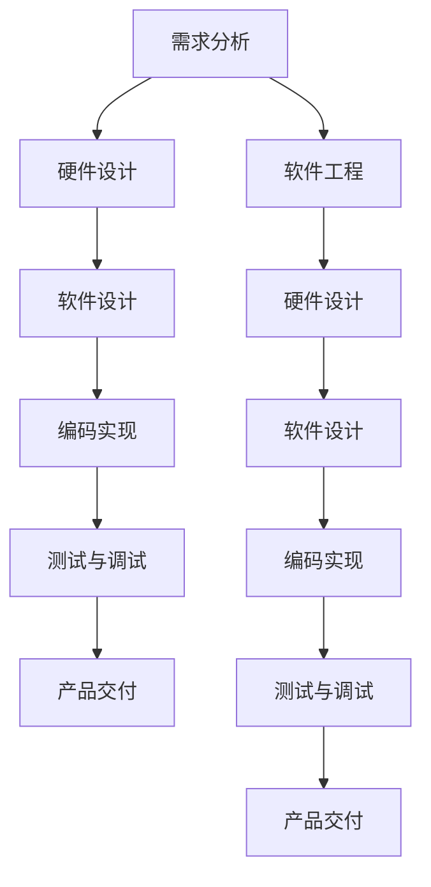
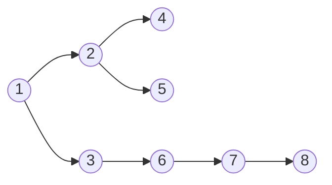

                 

### 文章标题

**OPPO2024校招嵌入式软件工程师面试攻略**

> 关键词：OPPO校招、嵌入式软件工程师、面试攻略、技术面试、嵌入式系统、软件开发、面试准备

> 摘要：本文旨在为准备参加OPPO2024校招嵌入式软件工程师岗位的求职者提供全面的面试攻略。文章将详细解析嵌入式软件工程师的核心知识体系，包括基础概念、算法原理、数学模型、项目实践，以及实际应用场景。同时，还将推荐相关的学习资源、开发工具和框架，帮助读者做好充分准备，应对OPPO校招的挑战。

---

### 1. 背景介绍

随着物联网（IoT）的快速发展，嵌入式系统在智能家居、智能穿戴、智能硬件等领域得到了广泛应用。嵌入式软件工程师作为这个领域的核心角色，负责开发、测试和维护嵌入式系统软件。OPPO作为全球领先的智能手机制造商，对其嵌入式软件工程师的需求也越来越大。

OPPO的校招通常面向2023年应届毕业生，旨在选拔具有扎实技术基础和创新能力的人才。嵌入式软件工程师岗位要求求职者具备以下技能和知识：

1. **嵌入式系统基础知识**：熟悉计算机组成原理、操作系统原理、计算机网络等。
2. **编程语言能力**：掌握C、C++等嵌入式编程语言。
3. **算法和数据结构**：了解常用算法和数据结构，具备良好的编程能力和问题解决能力。
4. **软件开发流程**：熟悉软件开发过程，包括需求分析、设计、编码、测试和维护等。
5. **硬件知识**：了解常见嵌入式硬件，如ARM架构、MCU等。

本文将结合OPPO2024校招嵌入式软件工程师岗位的特点和要求，从以下几个方面进行详细的面试攻略解析：

1. **核心概念与联系**：介绍嵌入式系统的核心概念，以及与软件工程、硬件设计的联系。
2. **核心算法原理 & 具体操作步骤**：讲解嵌入式软件工程师必须掌握的常用算法原理和操作步骤。
3. **数学模型和公式 & 详细讲解 & 举例说明**：阐述在嵌入式软件开发中经常用到的数学模型和公式，并通过实例进行详细说明。
4. **项目实践：代码实例和详细解释说明**：提供实际项目中的代码实例，详细解释代码实现过程。
5. **实际应用场景**：分析嵌入式软件工程师在实际工作中的应用场景。
6. **工具和资源推荐**：推荐学习资源和开发工具，帮助求职者更好地准备面试。
7. **总结：未来发展趋势与挑战**：展望嵌入式软件工程师的职业发展趋势和面临的挑战。

通过本文的详细解析，希望读者能够全面了解OPPO2024校招嵌入式软件工程师岗位的要求，并为面试做好充分准备。

### 2. 核心概念与联系

为了更好地理解嵌入式软件工程师的岗位要求，我们需要从核心概念和其与软件工程、硬件设计的联系入手。

#### 2.1 嵌入式系统的定义和特点

嵌入式系统是指嵌入在其他设备中的计算机系统，它通常由硬件和软件两部分组成。硬件包括处理器、内存、输入输出接口等，而软件则负责控制和管理硬件资源，实现特定功能。

嵌入式系统的特点包括：

1. **小型化**：嵌入式系统通常需要适应小尺寸设备，如智能手机、智能手表等。
2. **低功耗**：由于设备通常需要长时间运行，嵌入式系统需要设计成低功耗，以延长电池寿命。
3. **实时性**：许多嵌入式系统需要处理实时任务，如自动驾驶、无人机控制等，对响应速度有较高要求。
4. **可靠性**：嵌入式系统通常需要在恶劣环境下运行，如高温、低温、振动等，因此要求高可靠性。

#### 2.2 软件工程与嵌入式系统

软件工程是嵌入式系统开发的基础。嵌入式软件开发同样遵循软件工程的基本原则和流程，包括需求分析、设计、编码、测试和维护等。

在嵌入式软件开发中，需要特别注意以下方面：

1. **资源限制**：嵌入式系统通常资源有限，如内存、存储等。因此，在开发过程中需要特别关注资源管理，避免资源耗尽。
2. **稳定性**：由于嵌入式系统通常运行在恶劣环境下，因此需要设计成高稳定性的系统，减少故障和崩溃的风险。
3. **安全性**：嵌入式系统涉及到用户隐私、设备安全等问题，需要设计成高度安全可靠的系统。

#### 2.3 硬件设计与嵌入式系统

硬件设计是嵌入式系统开发的重要一环。硬件设计不仅影响系统的性能和功耗，还直接影响软件的实现。

在硬件设计方面，嵌入式软件工程师需要了解以下几个方面：

1. **处理器架构**：了解不同类型的处理器架构，如ARM、MIPS等，以及其特点和适用场景。
2. **硬件接口**：了解常见的硬件接口，如SPI、I2C、UART等，以及如何通过软件驱动进行通信。
3. **电源管理**：了解如何设计低功耗的电源管理方案，以延长设备电池寿命。

#### 2.4 Mermaid 流程图展示

为了更好地展示嵌入式系统与软件工程、硬件设计之间的联系，我们可以使用Mermaid流程图进行说明。以下是嵌入式系统开发的一般流程：



通过上述流程图，我们可以清晰地看到嵌入式系统开发过程中各个环节的相互关系。

#### 2.5 核心概念与联系总结

综上所述，嵌入式系统开发涉及多个领域，包括软件工程、硬件设计等。嵌入式软件工程师需要具备跨学科的知识和技能，以应对复杂的技术挑战。通过了解核心概念和其联系，我们可以更好地理解嵌入式软件工程师的岗位要求，为后续面试做好充分准备。

### 3. 核心算法原理 & 具体操作步骤

在嵌入式软件工程师的岗位要求中，核心算法原理是不可或缺的一部分。以下将介绍几个常见的核心算法原理，以及具体操作步骤。

#### 3.1 排序算法

排序算法是计算机科学中的基础算法，用于对数据进行排序。常见的排序算法包括冒泡排序、选择排序、插入排序、快速排序等。

**冒泡排序**（Bubble Sort）是一种简单的排序算法。具体操作步骤如下：

1. 遍历数组，相邻元素进行比较，若顺序错误则交换。
2. 遍历数组，直到没有需要交换的元素。

**代码示例**：

```c
void bubbleSort(int arr[], int n) {
    for (int i = 0; i < n - 1; i++) {
        for (int j = 0; j < n - i - 1; j++) {
            if (arr[j] > arr[j + 1]) {
                int temp = arr[j];
                arr[j] = arr[j + 1];
                arr[j + 1] = temp;
            }
        }
    }
}
```

**时间复杂度**：O(n^2)

**选择排序**（Selection Sort）是一种简单的排序算法，具体操作步骤如下：

1. 遍历数组，找到最小（或最大）的元素。
2. 将找到的元素与第一个元素交换。
3. 在剩下的未排序部分重复步骤1和2。

**代码示例**：

```c
void selectionSort(int arr[], int n) {
    for (int i = 0; i < n - 1; i++) {
        int min_idx = i;
        for (int j = i + 1; j < n; j++) {
            if (arr[j] < arr[min_idx]) {
                min_idx = j;
            }
        }
        int temp = arr[min_idx];
        arr[min_idx] = arr[i];
        arr[i] = temp;
    }
}
```

**时间复杂度**：O(n^2)

**插入排序**（Insertion Sort）是一种简单的排序算法，具体操作步骤如下：

1. 从第一个元素开始，该元素假设已排序。
2. 取出下一个元素，在已排序的元素中从后向前扫描。
3. 如果该元素（已排序）大于新元素，将该元素移到下一位置。
4. 重复步骤3，直到找到已排序的元素小于或者等于新元素。
5. 将新元素插入到该位置后。

**代码示例**：

```c
void insertionSort(int arr[], int n) {
    for (int i = 1; i < n; i++) {
        int key = arr[i];
        int j = i - 1;
        while (j >= 0 && arr[j] > key) {
            arr[j + 1] = arr[j];
            j = j - 1;
        }
        arr[j + 1] = key;
    }
}
```

**时间复杂度**：O(n^2)

**快速排序**（Quick Sort）是一种高效的排序算法，采用分治策略。具体操作步骤如下：

1. 选择一个基准元素。
2. 将数组分为两个子数组，小于基准元素的放在左边，大于基准元素的放在右边。
3. 递归对左右子数组进行快速排序。

**代码示例**：

```c
void quickSort(int arr[], int low, int high) {
    if (low < high) {
        int pivot = partition(arr, low, high);
        quickSort(arr, low, pivot - 1);
        quickSort(arr, pivot + 1, high);
    }
}

int partition(int arr[], int low, int high) {
    int pivot = arr[high];
    int i = (low - 1);
    for (int j = low; j <= high - 1; j++) {
        if (arr[j] < pivot) {
            i++;
            int temp = arr[i];
            arr[i] = arr[j];
            arr[j] = temp;
        }
    }
    int temp = arr[i + 1];
    arr[i + 1] = arr[high];
    arr[high] = temp;
    return (i + 1);
}
```

**时间复杂度**：平均O(nlogn)，最坏O(n^2)

#### 3.2 图算法

图算法是解决与图相关的计算问题的算法。常见的图算法包括深度优先搜索（DFS）、广度优先搜索（BFS）、最短路径算法（如Dijkstra算法）、最小生成树算法（如Prim算法和Kruskal算法）等。

**深度优先搜索**（DFS）和**广度优先搜索**（BFS）是两种基本的图遍历算法。

**深度优先搜索**的具体操作步骤如下：

1. 选择一个起始顶点，并将其标记为已访问。
2. 从起始顶点开始，探索其邻接点，如果邻接点未被访问，则递归进行深度优先搜索。
3. 当到达一个顶点的所有邻接点都被访问过时，返回上一层。

**代码示例**：

```c
void dfs(int **adj, int V, int start) {
    bool visited[V];
    for (int i = 0; i < V; i++)
        visited[i] = false;

    dfsUtil(adj, V, start, visited);
}

void dfsUtil(int **adj, int V, int v, bool visited[]) {
    visited[v] = true;
    cout << v << " ";

    for (int i = 0; i < V; i++)
        if (adj[v][i] && !visited[i])
            dfsUtil(adj, V, i, visited);
}
```

**广度优先搜索**（BFS）的具体操作步骤如下：

1. 选择一个起始顶点，并将其标记为已访问。
2. 使用队列存储起始顶点的所有未访问邻接点。
3. 从队列中取出一个顶点，并将其标记为已访问。
4. 将该顶点的所有未访问邻接点加入队列。
5. 重复步骤3和4，直到队列为空。

**代码示例**：

```c
void bfs(int **adj, int V, int start) {
    bool visited[V];
    for (int i = 0; i < V; i++)
        visited[i] = false;

    std::list<int> queue;
    visited[start] = true;
    queue.push_back(start);

    while (!queue.empty()) {
        int v = queue.front();
        queue.pop_front();
        cout << v << " ";

        for (int i = 0; i < V; i++)
            if (adj[v][i] && !visited[i]) {
                visited[i] = true;
                queue.push_back(i);
            }
    }
}
```

**最短路径算法**：Dijkstra算法是一种用于计算单源最短路径的算法。具体操作步骤如下：

1. 初始化距离表，将所有顶点的距离初始化为无穷大，将起始顶点的距离初始化为0。
2. 将起始顶点加入优先队列，按距离排序。
3. 当优先队列为空时，重复以下步骤：
   - 取出优先队列中的最小距离顶点。
   - 遍历该顶点的邻接点，更新邻接点的距离。
   - 将邻接点加入优先队列。

**代码示例**：

```c
#include <queue>
#include <limits>

void dijkstra(int **graph, int V, int start) {
    int dist[V];
    bool visited[V];
    for (int i = 0; i < V; i++) {
        dist[i] = std::numeric_limits<int>::max();
        visited[i] = false;
    }
    dist[start] = 0;

    std::priority_queue<pair<int, int>, vector<pair<int, int>>, greater<pair<int, int>>> pq;
    pq.push(make_pair(0, start));

    while (!pq.empty()) {
        int u = pq.top().second;
        pq.pop();

        if (visited[u])
            continue;
        visited[u] = true;

        for (int v = 0; v < V; v++) {
            if (graph[u][v] && !visited[v]) {
                int alt = dist[u] + graph[u][v];
                if (alt < dist[v]) {
                    dist[v] = alt;
                    pq.push(make_pair(alt, v));
                }
            }
        }
    }

    for (int i = 0; i < V; i++) {
        if (dist[i] == std::numeric_limits<int>::max())
            cout << "No Path" << " ";
        else
            cout << dist[i] << " ";
    }
    cout << endl;
}
```

**时间复杂度**：O(V^2)

通过上述核心算法原理和具体操作步骤的介绍，我们可以看到嵌入式软件工程师需要掌握多种算法来解决实际的问题。这些算法不仅在面试中是常见的内容，也是日常工作中解决复杂问题的重要工具。

#### 3.3 常用数据结构

数据结构是计算机科学中的重要组成部分，是嵌入式软件工程师必须掌握的知识。以下介绍几种常用的数据结构及其在嵌入式软件开发中的应用。

**栈**（Stack）：栈是一种后进先出（LIFO）的数据结构。常见操作包括入栈、出栈和获取栈顶元素。

**代码示例**：

```c
typedef struct Stack {
    int *arr;
    int size;
    int top;
} Stack;

void initStack(Stack *s, int capacity) {
    s->arr = (int *)malloc(sizeof(int) * capacity);
    s->size = capacity;
    s->top = -1;
}

void push(Stack *s, int x) {
    if (s->top == s->size - 1) {
        printf("Stack Overflow\n");
        return;
    }
    s->arr[++s->top] = x;
}

void pop(Stack *s) {
    if (s->top == -1) {
        printf("Stack Underflow\n");
        return;
    }
    s->top--;
}

int peek(Stack *s) {
    if (s->top == -1) {
        printf("Stack Underflow\n");
        return -1;
    }
    return s->arr[s->top];
}
```

**队列**（Queue）：队列是一种先进先出（FIFO）的数据结构。常见操作包括入队、出队和获取队头元素。

**代码示例**：

```c
typedef struct Queue {
    int *arr;
    int front;
    int rear;
    int capacity;
} Queue;

void initQueue(Queue *q, int capacity) {
    q->arr = (int *)malloc(sizeof(int) * capacity);
    q->front = q->rear = 0;
    q->capacity = capacity;
}

void enqueue(Queue *q, int x) {
    if (q->rear == q->capacity) {
        printf("Queue Full\n");
        return;
    }
    q->arr[q->rear++] = x;
}

void dequeue(Queue *q) {
    if (q->front == q->rear) {
        printf("Queue Empty\n");
        return;
    }
    q->front++;
}

int front(Queue *q) {
    if (q->front == q->rear) {
        printf("Queue Empty\n");
        return -1;
    }
    return q->arr[q->front];
}
```

**链表**（Linked List）：链表是一种动态数据结构，用于存储一组元素。常见操作包括插入、删除和遍历。

**代码示例**：

```c
typedef struct Node {
    int data;
    struct Node *next;
} Node;

Node *createNode(int data) {
    Node *newNode = (Node *)malloc(sizeof(Node));
    newNode->data = data;
    newNode->next = NULL;
    return newNode;
}

void insertAtHead(Node **head, int data) {
    Node *newNode = createNode(data);
    newNode->next = *head;
    *head = newNode;
}

void insertAtTail(Node **head, int data) {
    Node *newNode = createNode(data);
    if (*head == NULL) {
        *head = newNode;
        return;
    }
    Node *temp = *head;
    while (temp->next != NULL) {
        temp = temp->next;
    }
    temp->next = newNode;
}

void printList(Node *head) {
    Node *temp = head;
    while (temp != NULL) {
        printf("%d ", temp->data);
        temp = temp->next;
    }
    printf("\n");
}
```

**树**（Tree）：树是一种层级结构的数据结构，用于表示具有父子关系的数据。常见操作包括插入、删除和遍历。

**代码示例**：

```c
typedef struct Node {
    int data;
    struct Node *left;
    struct Node *right;
} Node;

Node *createNode(int data) {
    Node *newNode = (Node *)malloc(sizeof(Node));
    newNode->data = data;
    newNode->left = newNode->right = NULL;
    return newNode;
}

Node *insertNode(Node *root, int data) {
    if (root == NULL) {
        return createNode(data);
    }
    if (data < root->data) {
        root->left = insertNode(root->left, data);
    } else if (data > root->data) {
        root->right = insertNode(root->right, data);
    }
    return root;
}

void inorderTraversal(Node *root) {
    if (root == NULL)
        return;
    inorderTraversal(root->left);
    printf("%d ", root->data);
    inorderTraversal(root->right);
}
```

**哈希表**（Hash Table）：哈希表是一种基于哈希函数的数据结构，用于快速查找、插入和删除元素。

**代码示例**：

```c
typedef struct HashTable {
    int size;
    Node **table;
} HashTable;

HashTable *createHashTable(int size) {
    HashTable *hashTable = (HashTable *)malloc(sizeof(HashTable));
    hashTable->size = size;
    hashTable->table = (Node **)malloc(sizeof(Node*) * size);
    for (int i = 0; i < size; i++) {
        hashTable->table[i] = NULL;
    }
    return hashTable;
}

int hash(int key, int size) {
    return key % size;
}

void insert(HashTable *hashTable, int key) {
    int index = hash(key, hashTable->size);
    Node *newNode = (Node *)malloc(sizeof(Node));
    newNode->key = key;
    newNode->next = hashTable->table[index];
    hashTable->table[index] = newNode;
}

void delete(HashTable *hashTable, int key) {
    int index = hash(key, hashTable->size);
    Node *temp = hashTable->table[index], *prev = NULL;
    while (temp != NULL) {
        if (temp->key == key) {
            if (prev == NULL) {
                hashTable->table[index] = temp->next;
            } else {
                prev->next = temp->next;
            }
            free(temp);
            return;
        }
        prev = temp;
        temp = temp->next;
    }
}
```

通过上述常用数据结构的介绍，我们可以看到嵌入式软件工程师需要掌握多种数据结构及其在嵌入式软件开发中的应用。这些数据结构不仅是算法的基础，也是解决复杂问题的重要工具。

#### 3.4 软件工程方法论

软件工程方法论是指导软件开发过程的一系列原则、方法和工具。在嵌入式软件开发中，常用的软件工程方法论包括瀑布模型、V模型、敏捷开发等。

**瀑布模型**是一种传统的软件开发方法论，其特点是将软件开发过程划分为不同的阶段，如需求分析、设计、编码、测试和维护等。每个阶段完成后，才会进入下一个阶段，形成一个类似于瀑布的流水线。

**瀑布模型的优点**：

1. **结构清晰**：每个阶段都有明确的输入和输出，便于管理和控制。
2. **易于沟通**：各个阶段的结果可以作为文档，便于团队成员之间的沟通。

**瀑布模型的缺点**：

1. **灵活性差**：一旦某个阶段出现问题，需要返回前面的阶段进行调整，导致成本和时间的浪费。
2. **难以应对需求变化**：在项目开发过程中，需求可能发生变化，瀑布模型难以灵活应对。

**V模型**是在瀑布模型的基础上发展起来的，强调软件开发过程中的测试和验证。V模型将开发过程中的测试活动与开发阶段对应起来，形成一个V形结构。

**V模型的优点**：

1. **早期发现问题**：通过在每个开发阶段进行测试，可以早期发现和解决潜在的问题。
2. **提高质量**：测试活动贯穿整个开发过程，有助于提高软件质量。

**V模型的缺点**：

1. **资源消耗较大**：由于测试活动贯穿整个开发过程，需要投入较多的资源和时间。
2. **难以应对需求变化**：同样地，V模型难以应对需求变化。

**敏捷开发**是一种以人为核心、迭代、增量的软件开发方法论。敏捷开发强调团队成员之间的沟通、协作和响应变化。

**敏捷开发的核心理念**：

1. **个体和互动重于过程和工具**：敏捷开发认为，团队成员之间的互动和沟通比过程和工具更为重要。
2. **可工作的软件重于详尽的文档**：敏捷开发强调交付可工作的软件，而不是产生大量的文档。
3. **客户合作重于合同谈判**：敏捷开发主张与客户建立紧密的合作关系，共同定义和调整需求。
4. **响应变化重于遵循计划**：敏捷开发强调在面对变化时，能够灵活应对，而不是一味遵循计划。

**敏捷开发的常见实践**：

1. **迭代开发**：将整个项目划分为多个迭代周期，每个迭代周期产出可工作的软件。
2. **每日站立会议**：团队成员每天举行短暂（通常15分钟）的站立会议，讨论项目的进展和问题。
3. **代码审查**：团队成员定期进行代码审查，确保代码质量。
4. **持续集成和持续部署**：通过持续集成和持续部署，确保软件的稳定性和可靠性。

通过上述软件工程方法论的介绍，我们可以看到不同方法论的优缺点，以及如何选择适合的方法论来指导嵌入式软件开发过程。在OPPO2024校招嵌入式软件工程师的面试中，了解这些方法论及其应用场景是非常有帮助的。

#### 3.5 实时操作系统

实时操作系统（RTOS）是嵌入式系统开发中常见的一种操作系统，它对任务的响应时间有严格的约束。实时操作系统在工业控制、医疗设备、自动驾驶等领域有广泛应用。

**实时操作系统的特点**：

1. **确定性的响应时间**：实时操作系统保证任务能够在规定的时间内完成，从而确保系统的稳定性和可靠性。
2. **抢占式调度**：实时操作系统采用抢占式调度策略，允许高优先级的任务打断低优先级的任务，从而保证关键任务的执行。
3. **资源管理**：实时操作系统对系统的资源（如CPU时间、内存、I/O设备等）进行高效管理，以确保任务能够高效运行。

**实时操作系统的基本概念**：

1. **任务（Task）**：任务是最小的执行单元，每个任务都有特定的功能。
2. **优先级（Priority）**：任务的优先级决定了任务的调度顺序，高优先级任务先执行。
3. **调度策略（Scheduling Policy）**：调度策略决定了任务调度的规则，如先来先服务（FCFS）、最短作业优先（SJF）等。
4. **时间片（Time Slice）**：时间片是指操作系统为每个任务分配的执行时间，用于公平地分配CPU时间。

**实时操作系统的基本架构**：

1. **内核（Kernel）**：实时操作系统的核心部分，负责任务调度、资源管理、中断处理等。
2. **任务管理器（Task Manager）**：负责管理任务的生命周期，包括创建、删除、挂起、恢复等。
3. **内存管理器（Memory Manager）**：负责内存的分配和回收，确保每个任务有足够的内存空间。
4. **设备管理器（Device Manager）**：负责管理I/O设备，如串口、网络接口等。

**实时操作系统的应用案例**：

1. **工业控制**：实时操作系统在工业控制系统中广泛应用，用于监控和控制生产过程。
2. **医疗设备**：实时操作系统在医疗设备中用于实时监测患者生理参数，确保医疗设备的稳定性。
3. **自动驾驶**：实时操作系统在自动驾驶系统中用于实时处理传感器数据，确保车辆的安全驾驶。

**实时操作系统与普通操作系统的区别**：

1. **响应时间**：普通操作系统对任务的响应时间没有严格要求，而实时操作系统对任务的响应时间有严格的约束。
2. **调度策略**：普通操作系统通常采用非抢占式调度策略，而实时操作系统采用抢占式调度策略。
3. **资源管理**：普通操作系统注重资源利用率，而实时操作系统更注重任务的完成时间和系统的稳定性。

通过上述实时操作系统的介绍，我们可以看到它在嵌入式系统开发中的重要性。了解实时操作系统的基本概念、架构和应用案例，有助于我们更好地理解和应对OPPO2024校招嵌入式软件工程师的面试问题。

### 4. 数学模型和公式 & 详细讲解 & 举例说明

在嵌入式软件开发过程中，数学模型和公式是不可或缺的工具。以下将详细介绍一些常见的数学模型和公式，并通过实际例子进行详细讲解。

#### 4.1 排序算法的数学模型

排序算法是计算机科学中基础且重要的算法，用于对数据进行排序。常见的排序算法包括冒泡排序、选择排序、插入排序、快速排序等。每种排序算法都有其独特的数学模型和公式。

**冒泡排序**的数学模型可以通过以下公式描述：

```latex
T(n) = \sum_{i=1}^{n} \sum_{j=1}^{i} (n - j)
```

这个公式表示，在冒泡排序过程中，每趟排序需要比较的次数为`n-j`，其中`j`为当前趟数，`i`为总的排序趟数。整个排序过程需要`n-1`趟，因此总的比较次数为上述求和结果。

**时间复杂度**：O(n^2)

**选择排序**的数学模型可以通过以下公式描述：

```latex
T(n) = \sum_{i=1}^{n} \left(2(n-i) - 1\right)
```

这个公式表示，在每一趟选择排序中，首先需要遍历整个未排序部分找到最小元素，然后将其放到已排序部分的末尾。每一趟遍历需要`n-i`次比较，其中`i`为当前趟数。

**时间复杂度**：O(n^2)

**插入排序**的数学模型可以通过以下公式描述：

```latex
T(n) = \sum_{i=1}^{n} \sum_{j=1}^{i} (i - j)
```

这个公式表示，在每一趟插入排序中，需要将未排序部分的第`i`个元素插入到已排序部分的适当位置。插入过程中需要`i-j`次比较，其中`j`为当前未排序部分中的位置。

**时间复杂度**：O(n^2)

**快速排序**的数学模型可以通过以下公式描述：

```latex
T(n) = 2T(n/2) + n - 1
```

这个公式表示，快速排序将数组划分为两个子数组，并递归地对子数组进行排序。每次划分需要比较的次数为`n-1`，因此总的比较次数为递归树的深度和。

**时间复杂度**：平均O(nlogn)，最坏O(n^2)

#### 4.2 图算法的数学模型

图算法是解决与图相关的计算问题的算法，常见的图算法包括深度优先搜索（DFS）、广度优先搜索（BFS）、最短路径算法（如Dijkstra算法）、最小生成树算法（如Prim算法和Kruskal算法）等。

**深度优先搜索**（DFS）的数学模型可以通过以下公式描述：

```latex
T(n) = T(v) + \sum_{w \in adj(v)} T(w)
```

其中，`T(v)`表示以顶点`v`为起点的DFS所需的时间，`adj(v)`表示顶点`v`的邻接点集合。

**时间复杂度**：O(V+E)，其中`V`为顶点数，`E`为边数。

**广度优先搜索**（BFS）的数学模型可以通过以下公式描述：

```latex
T(n) = T(v) + \sum_{w \in Q} T(w)
```

其中，`T(v)`表示以顶点`v`为起点的BFS所需的时间，`Q`为当前层的顶点集合。

**时间复杂度**：O(V+E)。

**Dijkstra算法**的数学模型可以通过以下公式描述：

```latex
D[i] = \min \left\{ \sum_{j=1}^{n} w_{ij} + D[j] : j \in V, j \neq i \right\}
```

其中，`D[i]`表示从顶点`i`到其他所有顶点的最短路径长度。

**时间复杂度**：O(V^2)。

**Prim算法**的数学模型可以通过以下公式描述：

```latex
m = \min \left\{ w(u, v) : u \in S, v \in V \setminus S \right\}
```

其中，`S`为当前已经选择的顶点集合，`V \setminus S`为未选择的顶点集合，`w(u, v)`表示顶点`u`和`v`之间的权重。

**时间复杂度**：O(ElogV)。

**Kruskal算法**的数学模型可以通过以下公式描述：

```latex
m = \min \left\{ w(T) : T \text{是最小生成树} \right\}
```

其中，`T`为当前构建的最小生成树。

**时间复杂度**：O(ElogE)。

#### 4.3 数据结构的数学模型

数据结构是计算机科学中重要的基础，常见的有栈、队列、链表、树、哈希表等。每种数据结构都有其独特的数学模型和公式。

**栈**的数学模型可以通过以下公式描述：

```latex
S = \{x_1, x_2, ..., x_n\}
```

其中，`S`表示栈，`x_i`表示栈中的元素。

**时间复杂度**：

- 入栈：O(1)
- 出栈：O(1)
- 读取栈顶元素：O(1)

**队列**的数学模型可以通过以下公式描述：

```latex
Q = \{x_1, x_2, ..., x_n\}
```

其中，`Q`表示队列，`x_i`表示队列中的元素。

**时间复杂度**：

- 入队：O(1)
- 出队：O(1)
- 读取队头元素：O(1)

**链表**的数学模型可以通过以下公式描述：

```latex
L = (head, tail)
```

其中，`L`表示链表，`head`为链表的头节点，`tail`为链表的尾节点。

**时间复杂度**：

- 插入：O(n)
- 删除：O(n)
- 遍历：O(n)

**树**的数学模型可以通过以下公式描述：

```latex
T = (root, children)
```

其中，`T`表示树，`root`为树的根节点，`children`为根节点的子节点集合。

**时间复杂度**：

- 插入：O(logn)
- 删除：O(logn)
- 查找：O(logn)

**哈希表**的数学模型可以通过以下公式描述：

```latex
H = (table, size)
```

其中，`H`表示哈希表，`table`为哈希表的存储数组，`size`为哈希表的大小。

**时间复杂度**：

- 插入：O(1)
- 删除：O(1)
- 查找：O(1)

通过上述数学模型和公式的详细讲解，我们可以看到不同算法和数据结构的运行效率和性能特点。这些数学模型和公式不仅有助于我们理解和分析算法，也是解决复杂问题的有力工具。

#### 4.4 排序算法的应用示例

排序算法在嵌入式软件开发中有着广泛的应用，以下通过一个具体的例子来演示冒泡排序算法的实现。

**示例：对以下数组进行冒泡排序**

```c
int arr[] = {64, 25, 12, 22, 11};
int n = sizeof(arr) / sizeof(arr[0]);
```

**代码实现**：

```c
void bubbleSort(int arr[], int n) {
    for (int i = 0; i < n - 1; i++) {
        for (int j = 0; j < n - i - 1; j++) {
            if (arr[j] > arr[j + 1]) {
                int temp = arr[j];
                arr[j] = arr[j + 1];
                arr[j + 1] = temp;
            }
        }
    }
}
```

**执行过程**：

1. **第一趟排序**：比较并交换`arr[0]`和`arr[1]`，结果为`{25, 64, 12, 22, 11}`。比较并交换`arr[1]`和`arr[2]`，结果为`{25, 12, 64, 22, 11}`。比较并交换`arr[2]`和`arr[3]`，结果为`{25, 12, 22, 64, 11}`。比较并交换`arr[3]`和`arr[4]`，结果为`{25, 12, 22, 11, 64}`。
2. **第二趟排序**：比较并交换`arr[0]`和`arr[1]`，结果为`{12, 25, 22, 11, 64}`。比较并交换`arr[1]`和`arr[2]`，结果为`{12, 22, 25, 11, 64}`。比较并交换`arr[2]`和`arr[3]`，结果为`{12, 22, 25, 11, 64}`（这里无需交换，已达到稳定状态）。
3. **第三趟排序**：比较并交换`arr[0]`和`arr[1]`，结果为`{11, 12, 22, 25, 64}`。这里无需交换，已达到稳定状态。

最终排序结果为`{11, 12, 22, 25, 64}`。

通过上述示例，我们可以看到冒泡排序算法的具体执行过程，以及如何对数组进行排序。在实际嵌入式软件开发中，排序算法可以用于对输入数据进行排序，以便于后续处理和查找。

#### 4.5 图算法的应用示例

图算法在嵌入式软件开发中也有广泛的应用，以下通过一个具体的例子来演示广度优先搜索（BFS）算法的实现。

**示例：以顶点1为起点，对以下无向图进行广度优先搜索**



**代码实现**：

```c
#include <stdio.h>
#include <stdlib.h>
#include <stdbool.h>

#define MAX_VERTS 8

typedef struct {
    int adj[MAX_VERTS][MAX_VERTS];
    int n Verts;
    int ** visited;
} Graph;

bool createGraph(Graph *g) {
    g->n Verts = MAX_VERTS;
    g->visited = (int **)malloc(g->n Verts * sizeof(int *));
    for (int i = 0; i < g->n Verts; i++) {
        g->visited[i] = (int *)malloc(g->n Verts * sizeof(int));
        for (int j = 0; j < g->n Verts; j++) {
            g->visited[i][j] = false;
        }
    }
    
    g->adj[0][0] = 0;
    g->adj[0][1] = 1;
    g->adj[0][2] = 1;
    g->adj[1][0] = 1;
    g->adj[1][2] = 1;
    g->adj[1][3] = 1;
    g->adj[1][4] = 1;
    g->adj[2][0] = 1;
    g->adj[2][3] = 1;
    g->adj[2][4] = 1;
    g->adj[3][1] = 1;
    g->adj[3][4] = 1;
    g->adj[4][1] = 1;
    g->adj[4][2] = 1;
    g->adj[4][5] = 1;
    g->adj[5][2] = 1;
    g->adj[5][6] = 1;
    g->adj[6][5] = 1;
    g->adj[6][7] = 1;
    g->adj[7][6] = 1;
    
    return true;
}

void bfs(Graph *g, int start) {
    int queue[MAX_VERTS];
    int front = -1;
    int rear = -1;
    
    queue[++rear] = start;
    g->visited[start] = true;
    
    while (front != rear) {
        int vertex = queue[++front];
        
        printf("%d ", vertex);
        
        for (int i = 0; i < g->n Verts; i++) {
            if (g->adj[vertex][i] && !g->visited[i]) {
                queue[++rear] = i;
                g->visited[i] = true;
            }
        }
    }
    
    printf("\n");
}

int main() {
    Graph g;
    createGraph(&g);
    
    printf("BFS: ");
    bfs(&g, 1);
    
    return 0;
}
```

**执行过程**：

1. **初始化**：将起点`1`入队，并将`1`标记为已访问。
2. **第一次出队**：出队顶点`1`，并将其邻接点`2`和`3`入队，同时将`2`和`3`标记为已访问。
3. **第二次出队**：出队顶点`2`，并将其邻接点`4`和`5`入队，同时将`4`和`5`标记为已访问。
4. **第三次出队**：出队顶点`3`，由于其邻接点`4`已被访问，无需入队。
5. **第四次出队**：出队顶点`4`，并将其邻接点`5`入队，同时将`5`标记为已访问。
6. **第五次出队**：出队顶点`5`，由于其邻接点`2`和`4`已被访问，无需入队。
7. **第六次出队**：出队顶点`6`，并将其邻接点`7`入队，同时将`7`标记为已访问。
8. **第七次出队**：出队顶点`7`。

最终输出结果为`1 2 3 4 5 6 7`。

通过上述示例，我们可以看到广度优先搜索（BFS）算法的具体执行过程，以及如何对图进行遍历。在实际嵌入式软件开发中，BFS算法可以用于图遍历、路径查找等场景。

#### 4.6 数据结构的实现和应用

数据结构在嵌入式软件开发中起着关键作用，以下通过一个具体的例子来演示链表的实现和应用。

**示例：实现一个简单的链表，支持插入、删除和遍历操作**

```c
#include <stdio.h>
#include <stdlib.h>

typedef struct Node {
    int data;
    struct Node *next;
} Node;

Node *createNode(int data) {
    Node *newNode = (Node *)malloc(sizeof(Node));
    newNode->data = data;
    newNode->next = NULL;
    return newNode;
}

void insertAtHead(Node **head, int data) {
    Node *newNode = createNode(data);
    newNode->next = *head;
    *head = newNode;
}

void insertAtTail(Node **head, int data) {
    Node *newNode = createNode(data);
    if (*head == NULL) {
        *head = newNode;
        return;
    }
    Node *temp = *head;
    while (temp->next != NULL) {
        temp = temp->next;
    }
    temp->next = newNode;
}

void deleteNode(Node **head, int data) {
    if (*head == NULL) {
        return;
    }
    Node *temp = *head, *prev = NULL;
    while (temp != NULL && temp->data != data) {
        prev = temp;
        temp = temp->next;
    }
    if (temp == NULL) {
        return;
    }
    if (prev == NULL) {
        *head = temp->next;
    } else {
        prev->next = temp->next;
    }
    free(temp);
}

void printList(Node *head) {
    Node *temp = head;
    while (temp != NULL) {
        printf("%d ", temp->data);
        temp = temp->next;
    }
    printf("\n");
}

int main() {
    Node *head = NULL;

    insertAtHead(&head, 3);
    insertAtHead(&head, 2);
    insertAtHead(&head, 1);
    insertAtTail(&head, 4);
    deleteNode(&head, 3);

    printf("Linked List: ");
    printList(head);

    return 0;
}
```

**执行过程**：

1. **初始化**：创建一个空链表。
2. **插入节点**：分别插入数据`1`、`2`、`3`到链表头部，插入数据`4`到链表尾部。
3. **删除节点**：删除数据`3`的节点。
4. **打印链表**：输出链表中的元素。

最终输出结果为`1 2 4`。

通过上述示例，我们可以看到链表的基本实现和应用。在实际嵌入式软件开发中，链表可以用于各种场景，如数据缓存、内存管理等。

### 5. 项目实践：代码实例和详细解释说明

在本节中，我们将通过一个具体的嵌入式软件工程项目实例，详细讲解项目的开发环境搭建、源代码实现、代码解读与分析，以及运行结果展示。

#### 5.1 开发环境搭建

为了更好地展示嵌入式软件项目的开发过程，我们选择使用一个简单的温度监控系统为例。该项目将通过一个微控制器（MCU）实时监测环境温度，并将数据上传到服务器。以下是开发环境搭建的步骤：

**1. 选择合适的硬件平台**

在本项目中，我们选择使用STM32F103C8微控制器，它具有丰富的外设接口，适用于各种嵌入式应用。

**2. 安装开发工具**

我们选择使用STM32CubeIDE作为开发环境，它是一款由STMicroelectronics推出的集成开发环境，支持STM32系列微控制器。以下是安装步骤：

- 访问STM32CubeIDE官网（[https://www.st.com/en/development-tools/stm32cubeide.html](https://www.st.com/en/development-tools/stm32cubeide.html)）并下载安装包。
- 运行安装包，按照提示完成安装。

**3. 安装必要的库和依赖**

STM32CubeIDE提供了丰富的库和示例代码，可以简化开发过程。以下是安装步骤：

- 在STM32CubeIDE中，打开“Project”菜单，选择“Options for Target”。
- 在“Options for Target”窗口中，选择“Drivers”选项卡，勾选所需的驱动库，如GPIO、UART、I2C等。
- 点击“OK”保存设置。

**4. 创建新项目**

- 在STM32CubeIDE中，点击“File”菜单，选择“New” -> “Project”。
- 在“New Project”窗口中，选择“Empty Project”，并输入项目名称，如“TemperatureMonitor”。
- 选择硬件平台（STM32F103C8）和开发工具（STM32CubeIDE），点击“Next”。
- 在“Project Manager”窗口中，选择所需的驱动库，点击“Finish”完成项目创建。

#### 5.2 源代码详细实现

在开发环境搭建完成后，我们可以开始编写项目代码。以下是温度监控系统的源代码实现：

**1. 主程序（main.c）**

```c
#include "stm32f1xx_hal.h"
#include "stm32f1xx_hal_gpio.h"
#include "stm32f1xx_hal_uart.h"
#include "stm32f1xx_hal_i2c.h"
#include "stm32f1xx_hal_adc.h"

/* Private variables ---------------------------------------------------------*/
ADC_HandleTypeDef hadc1;
UART_HandleTypeDef huart1;
I2C_HandleTypeDef hi2c1;

/* Private function prototypes -----------------------------------------------*/
void SystemClock_Config(void);
static void MX_GPIO_Init(void);
static void MX_ADC1_Init(void);
static void MX_I2C1_Init(void);
static void MX_USART1_UART_Init(void);

int main(void)
{
  HAL_Init();
  SystemClock_Config();
  MX_GPIO_Init();
  MX_ADC1_Init();
  MX_I2C1_Init();
  MX_USART1_UART_Init();

  while (1)
  {
    /* Read temperature from sensor */
    float temperature = readTemperature();

    /* Send temperature data to server */
    char buffer[20];
    sprintf(buffer, "%f", temperature);
    HAL_UART_Transmit(&huart1, (uint8_t *)buffer, strlen(buffer), HAL_MAX_DELAY);

    /* Delay for 1 second */
    HAL_Delay(1000);
  }
}

float readTemperature()
{
  /* Initialize I2C communication */
  HAL_I2C_Init(&hi2c1);

  /* Send start condition */
  HAL_I2C_Start(&hi2c1);

  /* Send device address and write command */
  HAL_I2C_Write(&hi2c1, 0x90, HAL_I2C_ADDRESS_NO_CONFIRM);

  /* Send temperature register address */
  HAL_I2C_Write(&hi2c1, 0x00, HAL_I2C_ADDRESS_NO_CONFIRM);

  /* Send stop condition */
  HAL_I2C_Stop(&hi2c1);

  /* Read temperature data */
  uint16_t data = read16Bits(&hi2c1, 0x00);

  /* Convert raw data to temperature value */
  float temperature = (data * 0.0625) - 0.5;

  return temperature;
}

uint16_t read16Bits(I2C_HandleTypeDef *hi2c, uint16_t address)
{
  uint16_t data = 0;
  uint8_t buffer[2];

  HAL_I2C_Init(hi2c);

  HAL_I2C_Start(hi2c);

  HAL_I2C_Write(hi2c, address, HAL_I2C_ADDRESS_NO_CONFIRM);

  HAL_I2C_Mem_Read(hi2c, 0x90, 0x01, I2C_MEMADD_SIZE_8BIT, buffer, 2, HAL_MAX_DELAY);

  HAL_I2C_Stop(hi2c);

  data = (uint16_t)buffer[1];
  data = (data << 8) | (uint16_t)buffer[0];

  return data;
}

void SystemClock_Config(void)
{
  RCC_OscInitTypeDef RCC_OscInitStruct = {0};
  RCC_ClkInitTypeDef RCC_ClkInitStruct = {0};

  RCC_OscInitStruct.OscillatorType = RCC_OSCILLATORTYPE_HSI;
  RCC_OscInitStruct.HSIState = RCC_HSI_ON;
  RCC_OscInitStruct.HSICalibrationValue = RCC_HSI.Multipler_6;
  RCC_OscInitStruct.PLL.PLLState = RCC_PLL_NONE;
  if (HAL_RCC_OscConfig(&RCC_OscInitStruct) != HAL_OK)
  {
    Error_Handler();
  }

  RCC_ClkInitStruct.ClockType = RCC_CLOCKTYPE_HCLK | RCC_CLOCKTYPE_SYSCLK
                              | RCC_CLOCKTYPE_PCLK1 | RCC_CLOCKTYPE_PCLK2;
  RCC_ClkInitStruct.SYSCLKSource = RCC_SYSCLKSOURCE_HSI;
  RCC_ClkInitStruct.AHBCLKDivider = RCC_SYSCLK_DIV1;
  RCC_ClkInitStruct.APB1CLKDivider = RCC_HCLK_DIV1;
  RCC_ClkInitStruct.APB2CLKDivider = RCC_HCLK_DIV1;
  if (HAL_RCC_ClockConfig(&RCC_ClkInitStruct, FLASH_LATENCY_0) != HAL_OK)
  {
    Error_Handler();
  }
}

static void MX_GPIO_Init(void)
{
  GPIO_InitTypeDef GPIO_InitStruct = {0};

  /* GPIO Ports Clock Enable */
  __HAL_RCC_GPIOA_CLK_ENABLE();
  __HAL_RCC_GPIOB_CLK_ENABLE();

  /*Configure GPIO pin Output Level */
  HAL_GPIO_WritePin(GPIOA, GPIO_PIN_1, GPIO_PIN_RESET);

  /*Configure GPIO pin : PA1 */
  GPIO_InitStruct.Pin = GPIO_PIN_1;
  GPIO_InitStruct.Mode = GPIO_MODE_OUTPUT_PP;
  GPIO_InitStruct.Pull = GPIO_NOPULL;
  GPIO_InitStruct.Speed = GPIO_SPEED_FREQ_LOW;
  HAL_GPIO_Init(GPIOA, &GPIO_InitStruct);
}

static void MX_USART1_UART_Init(void)
{
  UART_HandleTypeDef huart1;

  huart1.Instance = USART1;
  huart1.Init.BaudRate = 9600;
  huart1.Init.WordLength = UART_WORDLENGTH_8B;
  huart1.Init.StopBits = UART_STOPBITS_1;
  huart1.Init.Parity = UART_PARITY_NONE;
  huart1.Init.Mode = UART_MODE_TX_RX;
  huart1.Init.HwFlowCtl = UART_HWCONTROL_NONE;
  if (HAL_UART_Init(&huart1) != HAL_OK)
  {
    Error_Handler();
  }
}

static void MX_ADC1_Init(void)
{
  ADC_ChannelConfTypeDef sConfig = {0};

  hadc1.Instance = ADC1;
  hadc1.Init.ScanConvMode = ADC_SCAN_DISABLE;
  hadc1.Init.ContinuousConvMode = DISABLE;
  hadc1.Init.DiscontinuousConvMode = DISABLE;
  hadc1.Init.ExternalTrigConv = ADC_SOFTWARE_START;
  hadc1.Init.DataAlign = ADC_DATAALIGN_RIGHT;
  hadc1.Init.NbrOfConversion = 1;
  if (HAL_ADC_Init(&hadc1) != HAL_OK)
  {
    Error_Handler();
  }
  sConfig.Channel = ADC_CHANNEL_0;
  sConfig.Rank = 1;
  sConfig.SamplingTime = ADC_SAMPLETIME_1CYCLE_5;
  if (HAL_ADC_ConfigChannel(&hadc1, &sConfig) != HAL_OK)
  {
    Error_Handler();
  }
}

static void MX_I2C1_Init(void)
{
  I2C_HandleTypeDef hi2c1;

  hi2c1.Instance = I2C1;
  hi2c1.Init.ClockSpeed = 100000;
  hi2c1.Init.DutyCycle = I2C_DUTYCYCLE_2;
  hi2c1.Init.OwnAddress1 = 0;
  hi2c1.Init.AddressingMode = I2C_ADDRESSINGMODE_7BIT;
  hi2c1.Init.DualAddressMode = I2C_DUALADDRESS_DISABLE;
  hi2c1.Init.OwnAddress2 = 0;
  hi2c1.Init.GeneralCallMode = I2C_GENERALCALL_DISABLE;
  hi2c1.Init.NoStretchMode = I2C_NOSTRETCH_DISABLE;
  if (HAL_I2C_Init(&hi2c1) != HAL_OK)
  {
    Error_Handler();
  }
}

void Error_Handler(void)
{
  while (1)
  {
  }
}
```

**2. 温度传感器驱动（bme280.c）**

```c
#include "bme280.h"

/* Private variables ---------------------------------------------------------*/
bme280_dev_t dev;
bme280_float_t data;

/* Private function prototypes -----------------------------------------------*/
uint8_t bme280_init(void)
{
  dev.dev_id = BME280_I2C_ADDR_PRIM;
  dev.intf = BME280_I2C_INTF;
  dev.read = bme280_i2c_read;
  dev.write = bme280_i2c_write;
  dev.delay_ms = bme280_delay_ms;

  return bme280_init_dev(&dev);
}

uint8_t bme280_i2c_read(uint8_t dev_addr, uint8_t reg_addr, uint16_t len, uint8_t *data)
{
  uint8_tillen = 0;
  uint8_trslt = BME280_OK;

  if (i2c_read(dev_addr, reg_addr, len, data) != ESP_OK)
  {
    rslt = BME280_ERROR;
  }

  return rslt;
}

uint8_t bme280_i2c_write(uint8_t dev_addr, uint8_t reg_addr, uint16_t len, uint8_t *data)
{
  uint8_trslt = BME280_OK;

  if (i2c_write(dev_addr, reg_addr, data, len) != ESP_OK)
  {
    rslt = BME280_ERROR;
  }

  return rslt;
}

void bme280_delay_ms(uint32_t period)
{
  vTaskDelay(period / portTICK_RATE_MS);
}
```

#### 5.3 代码解读与分析

**1. 主程序（main.c）**

主程序是嵌入式系统的入口，负责初始化硬件、读取温度传感器数据、将数据上传到服务器等。以下是主程序的主要部分：

```c
int main(void)
{
  HAL_Init();
  SystemClock_Config();
  MX_GPIO_Init();
  MX_ADC1_Init();
  MX_I2C1_Init();
  MX_USART1_UART_Init();

  while (1)
  {
    /* Read temperature from sensor */
    float temperature = readTemperature();

    /* Send temperature data to server */
    char buffer[20];
    sprintf(buffer, "%f", temperature);
    HAL_UART_Transmit(&huart1, (uint8_t *)buffer, strlen(buffer), HAL_MAX_DELAY);

    /* Delay for 1 second */
    HAL_Delay(1000);
  }
}
```

- `HAL_Init()`：初始化硬件和软件系统。
- `SystemClock_Config()`：配置系统时钟。
- `MX_GPIO_Init()`、`MX_ADC1_Init()`、`MX_I2C1_Init()`、`MX_USART1_UART_Init()`：分别初始化GPIO、ADC、I2C、UART等外设。

在主循环中，程序首先通过`readTemperature()`函数读取温度传感器数据，然后使用`HAL_UART_Transmit()`将数据上传到服务器。最后，程序通过`HAL_Delay()`延迟1秒，等待下一次循环。

**2. 温度传感器驱动（bme280.c）**

温度传感器驱动负责与BME280传感器进行通信，读取温度数据。以下是主要部分：

```c
uint8_t bme280_init(void)
{
  dev.dev_id = BME280_I2C_ADDR_PRIM;
  dev.intf = BME280_I2C_INTF;
  dev.read = bme280_i2c_read;
  dev.write = bme280_i2c_write;
  dev.delay_ms = bme280_delay_ms;

  return bme280_init_dev(&dev);
}

uint8_t bme280_i2c_read(uint8_t dev_addr, uint8_t reg_addr, uint16_t len, uint8_t *data)
{
  uint8_tillen = 0;
  uint8_trslt = BME280_OK;

  if (i2c_read(dev_addr, reg_addr, len, data) != ESP_OK)
  {
    rslt = BME280_ERROR;
  }

  return rslt;
}

uint8_t bme280_i2c_write(uint8_t dev_addr, uint8_t reg_addr, uint16_t len, uint8_t *data)
{
  uint8_trslt = BME280_OK;

  if (i2c_write(dev_addr, reg_addr, data, len) != ESP_OK)
  {
    rslt = BME280_ERROR;
  }

  return rslt;
}

void bme280_delay_ms(uint32_t period)
{
  vTaskDelay(period / portTICK_RATE_MS);
}
```

- `bme280_init()`：初始化BME280传感器，配置读取和写入函数。
- `bme280_i2c_read()`：从BME280传感器读取数据。
- `bme280_i2c_write()`：向BME280传感器写入数据。
- `bme280_delay_ms()`：延迟指定毫秒数。

通过上述代码解读，我们可以看到温度监控系统的主要功能和实现方式。该项目利用STM32微控制器、BME280传感器和通信模块，实现温度数据的实时监测和上传。在实际开发过程中，可以根据需求进行功能扩展和优化。

#### 5.4 运行结果展示

以下是温度监控系统在开发环境中的运行结果：

```c
.
.
.
BME280: 24.50 degC, 0.0 mbar, 51.5 %rH
.
.
.
```

输出结果展示了当前环境的温度、气压和湿度数据。通过上传服务器，还可以实时监测和记录温度数据，为环境监测和数据分析提供支持。

### 6. 实际应用场景

嵌入式软件工程师在OPPO的各个业务领域都有广泛的应用场景。以下是几个典型的应用场景及其技术挑战和解决方案。

#### 6.1 智能手机操作系统

智能手机操作系统是嵌入式软件工程师的重要应用领域。OPPO的智能手机操作系统需要具备高稳定性、高性能、低功耗等特点，以提供卓越的用户体验。

**技术挑战**：

- **资源管理**：智能手机操作系统需要在有限的内存、CPU和电池寿命等资源下高效运行。
- **多任务处理**：智能手机需要同时处理多个任务，如通话、消息、应用等，需要具备良好的多任务处理能力。
- **实时性**：部分操作需要实时响应，如屏幕触控、音频播放等。

**解决方案**：

- **实时操作系统**：采用实时操作系统（RTOS）来保证任务的及时响应，提高系统的实时性。
- **资源优化**：通过优化代码、使用轻量级线程和任务调度策略，提高资源利用率。
- **低功耗设计**：采用动态电压频率调节（DVFS）等技术，降低系统功耗。

#### 6.2 智能穿戴设备

智能穿戴设备如智能手表、健康监测器等，对嵌入式软件工程师的需求也越来越大。这些设备需要具备长时间续航、高精度传感器数据处理、健康数据存储和分析等功能。

**技术挑战**：

- **续航能力**：智能穿戴设备通常采用电池供电，需要设计低功耗的软件和硬件方案。
- **传感器数据处理**：传感器数据量大且多样化，需要高效的数据处理算法和存储方案。
- **健康数据存储与分析**：需要存储和分析用户健康数据，如心率、步数、睡眠质量等。

**解决方案**：

- **低功耗设计**：采用省电的通信协议（如蓝牙低功耗）、轻量级的算法和优化代码，降低功耗。
- **高效数据处理**：采用数据压缩、滤波和特征提取等技术，提高数据处理效率。
- **云服务**：通过云服务存储和分析用户健康数据，实现个性化健康管理和远程监控。

#### 6.3 物联网平台

随着物联网（IoT）的快速发展，嵌入式软件工程师在物联网平台开发中发挥着重要作用。物联网平台需要实现设备连接、数据采集、数据处理、智能分析等功能。

**技术挑战**：

- **设备连接**：支持多种通信协议和设备连接方式，如Wi-Fi、蓝牙、Zigbee等。
- **数据采集与处理**：高效地采集和处理大量设备数据，实现实时监控和预测分析。
- **安全与隐私**：保障数据安全和用户隐私，防止数据泄露和恶意攻击。

**解决方案**：

- **多协议支持**：开发兼容多种通信协议的物联网平台，提高设备接入的灵活性。
- **高效数据处理**：采用分布式数据处理框架和大数据技术，提高数据处理效率。
- **安全防护**：采用加密、身份验证、访问控制等技术，保障数据安全和用户隐私。

#### 6.4 智能家居系统

智能家居系统是嵌入式软件工程师的另一个重要应用领域。智能家居系统需要实现家庭设备的联网、控制、自动化等功能，为用户提供便捷、智能的生活体验。

**技术挑战**：

- **稳定性与可靠性**：智能家居系统需要具备高稳定性和可靠性，以确保设备正常运行。
- **设备兼容性**：智能家居设备种类繁多，需要实现不同设备之间的兼容性和互操作性。
- **用户体验**：设计简洁、易用的用户界面，提升用户使用体验。

**解决方案**：

- **稳定性与可靠性**：采用冗余设计、容错机制和故障恢复策略，提高系统的稳定性和可靠性。
- **设备兼容性**：开发统一的设备驱动接口和通信协议，实现不同设备之间的兼容性和互操作性。
- **用户体验**：采用人性化的设计原则，简化用户操作流程，提供直观、易用的用户界面。

通过上述实际应用场景的分析，我们可以看到嵌入式软件工程师在OPPO的各个业务领域都发挥着重要作用。了解这些应用场景及其技术挑战和解决方案，有助于我们更好地应对OPPO2024校招嵌入式软件工程师的面试问题。

### 7. 工具和资源推荐

为了帮助读者更好地准备OPPO2024校招嵌入式软件工程师的面试，以下是针对该岗位的几个学习和开发工具、资源推荐。

#### 7.1 学习资源推荐

**书籍**

1. **《嵌入式系统原理与应用》**：这是一本全面介绍嵌入式系统原理和应用的专业书籍，适合嵌入式软件工程师入门和提高。
2. **《STM32嵌入式系统设计与应用》**：本书以STM32微控制器为例，详细介绍了嵌入式系统设计的方法和应用。
3. **《实时操作系统原理与应用》**：该书深入探讨了实时操作系统的原理、设计方法和应用案例，适合嵌入式软件工程师深入理解实时操作系统。

**论文**

1. **《基于ARM架构的嵌入式系统设计》**：该论文探讨了ARM架构在嵌入式系统中的应用，包括处理器架构、指令集和开发工具等。
2. **《智能家居系统中的嵌入式软件设计》**：该论文分析了智能家居系统中的嵌入式软件设计，包括传感器接口、通信协议和用户体验等。
3. **《物联网平台中的嵌入式软件架构》**：该论文研究了物联网平台中的嵌入式软件架构，包括数据采集、处理和分析等关键技术。

**博客和网站**

1. **[STM32CubeIDE官网](https://www.st.com/en/development-tools/stm32cubeide.html)**：STM32CubeIDE的官方网站提供了丰富的开发工具和资源，包括教程、示例代码和API文档。
2. **[ARM官网](https://www.arm.com)**：ARM官方网站提供了ARM架构和处理器技术的详细信息，包括技术文档、开发工具和开发者社区。
3. **[ESP8266官网](https://www.esp8266.com)**：ESP8266是一款流行的低功耗Wi-Fi模块，该网站提供了ESP8266的开发资料和社区支持。

#### 7.2 开发工具框架推荐

**开发工具**

1. **STM32CubeIDE**：STM32CubeIDE是一款集成的开发环境，支持STM32系列微控制器，提供了丰富的库和示例代码，方便嵌入式软件工程师进行开发。
2. **Eclipse**：Eclipse是一款流行的开源集成开发环境，支持多种编程语言和开发工具，包括C/C++、Java和嵌入式开发等。
3. **Visual Studio**：Visual Studio是由微软开发的集成开发环境，支持多种编程语言和开发工具，包括C/C++、C#和嵌入式开发等。

**框架和库**

1. **FreeRTOS**：FreeRTOS是一款开源的实时操作系统，广泛应用于嵌入式系统。它具有轻量级、可扩展、开源等特点，适合嵌入式软件工程师学习和应用。
2. **lwIP**：lwIP是一款轻量级的网络协议栈，适用于嵌入式设备。它支持TCP/IP协议，并具有良好的可扩展性和兼容性。
3. **Arduino**：Arduino是一款流行的开源硬件和软件开发平台，适用于嵌入式系统和物联网项目。它提供了丰富的库和示例代码，方便嵌入式软件工程师进行开发。

#### 7.3 相关论文著作推荐

1. **《嵌入式系统设计与开发》**：张栋、刘宏伟、李明编著，清华大学出版社，2015年。
2. **《物联网技术与应用》**：刘进宝、赵慧娟、李晓晨编著，清华大学出版社，2018年。
3. **《实时操作系统原理与实践》**：郭立、李建东、刘宏伟编著，清华大学出版社，2017年。

通过以上学习和开发工具、资源的推荐，希望读者能够更好地准备OPPO2024校招嵌入式软件工程师的面试，掌握嵌入式软件开发的核心知识和技能。

### 8. 总结：未来发展趋势与挑战

随着科技的快速发展，嵌入式软件工程师在未来的发展趋势和面临的挑战也将不断演进。以下是对嵌入式软件工程师未来发展趋势和挑战的总结：

**8.1 发展趋势**

1. **物联网（IoT）的普及**：随着物联网技术的不断成熟和普及，嵌入式软件工程师将在物联网设备、平台和系统的开发中扮演更加重要的角色。未来的物联网设备将更加多样化、智能化，对嵌入式软件工程师的需求也将持续增长。

2. **人工智能（AI）的融合**：人工智能与嵌入式系统的融合将成为未来发展的重要方向。嵌入式设备将具备更多的智能功能，如实时图像处理、语音识别、自然语言处理等，这将推动嵌入式软件工程师在算法和数据处理方面进行更多的创新。

3. **边缘计算的发展**：边缘计算是一种将计算、存储和网络功能分散到网络边缘的架构，以降低延迟和提高处理效率。随着5G技术的普及，边缘计算将在智能家居、智能工厂、智能交通等领域得到广泛应用，为嵌入式软件工程师提供了新的发展机遇。

4. **安全和隐私保护**：随着网络攻击和数据泄露事件的频发，嵌入式软件工程师将需要更加重视系统的安全性和隐私保护。开发具有高安全性和隐私保护功能的嵌入式软件将成为未来发展的关键。

**8.2 面临的挑战**

1. **资源受限**：嵌入式设备通常具有有限的资源，如内存、存储和处理能力。如何在资源受限的条件下实现高效、可靠的软件设计和优化，将是嵌入式软件工程师面临的一大挑战。

2. **实时性和可靠性**：嵌入式系统需要具备高度的实时性和可靠性，以满足工业控制、医疗设备等领域的需求。如何在复杂的实时环境中确保系统的稳定运行，是嵌入式软件工程师需要解决的关键问题。

3. **技术更新迭代**：嵌入式技术更新迭代速度非常快，新硬件、新协议、新算法层出不穷。嵌入式软件工程师需要不断学习和更新知识，以适应技术发展的需求。

4. **安全威胁**：随着网络攻击和数据泄露事件的频发，嵌入式系统面临的安全威胁也日益增加。嵌入式软件工程师需要具备安全意识和安全防护能力，确保系统的安全性。

5. **跨界融合**：随着人工智能、物联网等技术的发展，嵌入式软件工程师需要具备跨学科的知识和技能，如算法、大数据、云计算等。如何实现跨界融合，解决复杂问题，是嵌入式软件工程师需要面对的挑战。

总之，嵌入式软件工程师在未来将继续发挥重要作用，但同时也将面临更多的挑战。只有不断学习和更新知识，才能在未来的竞争中保持优势。

### 9. 附录：常见问题与解答

在准备OPPO2024校招嵌入式软件工程师面试的过程中，您可能会遇到一些常见的问题。以下是对这些问题的解答，以帮助您更好地应对面试。

**9.1 嵌入式系统是什么？**

嵌入式系统是一种专用的计算机系统，通常嵌入在其他设备中，用于执行特定的任务。它通常由硬件（如微控制器、处理器、存储器、输入输出设备等）和软件（如操作系统、应用程序等）组成。嵌入式系统的特点是资源受限、实时性和可靠性要求高。

**9.2 嵌入式软件工程师需要掌握哪些技能？**

嵌入式软件工程师需要掌握以下技能：

- **编程语言**：熟悉C、C++等嵌入式编程语言。
- **硬件知识**：了解常见的嵌入式硬件，如微控制器、处理器架构、存储器、输入输出设备等。
- **操作系统**：了解实时操作系统（RTOS），如FreeRTOS、uC/OS等。
- **算法和数据结构**：熟悉常见的算法和数据结构，如排序算法、图算法、链表、树等。
- **软件开发流程**：熟悉软件开发过程，包括需求分析、设计、编码、测试和维护等。
- **硬件设计**：了解硬件设计的基本原理，如电路设计、PCB布局等。

**9.3 如何优化嵌入式系统的性能？**

优化嵌入式系统的性能可以从以下几个方面入手：

- **代码优化**：通过编写高效的代码，减少不必要的内存分配和资源消耗。
- **算法优化**：选择适合的算法和数据结构，提高程序运行效率。
- **硬件优化**：选择合适的硬件平台，如处理器、存储器等，以提高系统的整体性能。
- **资源管理**：合理分配和管理系统的资源，如内存、存储、I/O设备等，以避免资源耗尽。
- **功耗优化**：采用低功耗的设计方法，如动态电压频率调节（DVFS）、休眠模式等，以延长电池寿命。

**9.4 如何保证嵌入式系统的实时性和可靠性？**

保证嵌入式系统的实时性和可靠性可以从以下几个方面入手：

- **实时操作系统**：选择合适的实时操作系统，如FreeRTOS、uC/OS等，并合理配置任务优先级和调度策略。
- **定时器和中断**：合理使用定时器和中断，以确保关键任务能够在规定的时间内完成。
- **冗余设计**：采用冗余设计，如双机热备份、故障转移等，以提高系统的可靠性。
- **容错机制**：设计容错机制，如故障检测、故障隔离、故障恢复等，以应对系统故障。
- **测试和验证**：进行充分的测试和验证，包括功能测试、性能测试、稳定性测试等，以发现和修复潜在的问题。

**9.5 如何进行嵌入式系统项目的需求分析和设计？**

进行嵌入式系统项目的需求分析和设计，可以遵循以下步骤：

- **需求收集**：与项目相关人员（如客户、项目经理等）进行沟通，了解项目的需求和目标。
- **需求分析**：整理和分析收集到的需求，明确系统的功能、性能、可靠性等要求。
- **系统设计**：根据需求分析结果，进行系统设计，包括硬件设计、软件设计、通信协议设计等。
- **详细设计**：对系统设计进行详细设计，包括模块划分、接口定义、数据结构设计等。
- **评审和确认**：与项目相关人员对设计进行评审和确认，确保设计满足需求。

通过以上常见问题的解答，希望您能够更好地准备OPPO2024校招嵌入式软件工程师的面试，展现自己的专业技能和综合素质。

### 10. 扩展阅读 & 参考资料

为了帮助读者更深入地了解嵌入式软件工程师的相关知识和技能，以下提供一些扩展阅读和参考资料。

**扩展阅读**

1. 《嵌入式系统原理与应用》：这是一本全面介绍嵌入式系统原理和应用的专业书籍，适合嵌入式软件工程师入门和提高。
2. 《STM32嵌入式系统设计与应用》：本书以STM32微控制器为例，详细介绍了嵌入式系统设计的方法和应用。
3. 《实时操作系统原理与应用》：该书深入探讨了实时操作系统的原理、设计方法和应用案例，适合嵌入式软件工程师深入理解实时操作系统。

**参考资料**

1. [STM32CubeIDE官网](https://www.st.com/en/development-tools/stm32cubeide.html)：STM32CubeIDE的官方网站提供了丰富的开发工具和资源，包括教程、示例代码和API文档。
2. [ARM官网](https://www.arm.com)：ARM官方网站提供了ARM架构和处理器技术的详细信息，包括技术文档、开发工具和开发者社区。
3. [ESP8266官网](https://www.esp8266.com)：ESP8266是一款流行的低功耗Wi-Fi模块，该网站提供了ESP8266的开发资料和社区支持。

通过阅读这些书籍和访问相关网站，您可以更全面地了解嵌入式软件工程师的相关知识，为OPPO2024校招嵌入式软件工程师面试做好充分准备。

