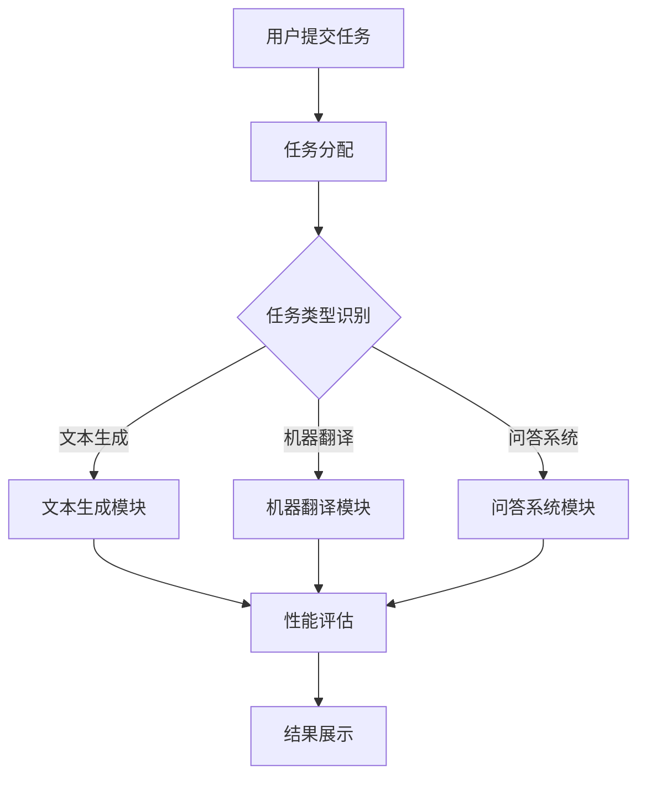

                 

### 1. 背景介绍

Open LLM Leaderboard（大模型天梯榜）是一个旨在衡量和展示大型语言模型（LLM）性能的排行榜。随着深度学习和自然语言处理技术的飞速发展，大型语言模型已经成为众多应用场景的关键组件，例如文本生成、机器翻译、问答系统等。然而，如何评估不同模型之间的性能差异，以及如何选择最合适的模型，成为了一个重要且具有挑战性的问题。

Open LLM Leaderboard 的出现，旨在为研究者、开发者和企业提供一个统一的性能评估平台。通过这个平台，用户可以查看不同模型在多种任务上的性能表现，了解各个模型的优缺点，从而做出更明智的选择。Open LLM Leaderboard 的意义不仅在于提供了一个客观的评估标准，更在于促进了整个领域的技术交流和进步。

本文将详细探讨 Open LLM Leaderboard 的核心概念、算法原理、数学模型、项目实践以及实际应用场景。希望通过本文的介绍，读者可以更好地理解 Open LLM Leaderboard 的运作机制，并在实际项目中运用相关技术。

### 2. 核心概念与联系

在深入探讨 Open LLM Leaderboard 之前，我们需要先了解一些核心概念和它们之间的联系。以下是本文将涉及的主要概念：

#### 2.1 大型语言模型（LLM）

大型语言模型，如 GPT-3、ChatGLM 等，是通过深度学习算法训练得到的，能够对自然语言文本进行理解和生成。这些模型通常具有数十亿个参数，能够在多种语言和任务上表现出色。

#### 2.2 性能评估指标

性能评估指标是衡量模型在特定任务上表现的标准。常见的评估指标包括准确率、召回率、F1 分数、BLEU 分数等。不同的评估指标反映了模型在不同方面的表现，因此需要综合考虑。

#### 2.3 排行榜

排行榜是对各个模型在特定任务上的性能进行排序的工具。通过排行榜，用户可以快速了解各个模型的优势和劣势。

#### 2.4 Mermaid 流程图

Mermaid 是一种用于绘制流程图的语法，它可以方便地绘制结构清晰的流程图。本文将使用 Mermaid 流程图来展示 Open LLM Leaderboard 的整体架构和工作流程。

#### 2.5 数学模型和公式

在 Open LLM Leaderboard 中，数学模型和公式用于计算模型的性能得分。这些模型和公式包括损失函数、梯度下降算法等。

#### 2.6 项目实践

项目实践是验证 Open LLM Leaderboard 效果的关键步骤。通过实际的项目案例，我们可以看到 Open LLM Leaderboard 在不同场景中的应用效果。

下面是一个简单的 Mermaid 流程图，展示了 Open LLM Leaderboard 的基本架构和工作流程：



在这个流程图中，用户提交任务后，系统会根据任务类型分配到相应的模块进行处理。处理完成后，系统会使用性能评估指标对结果进行评估，并将评估结果展示给用户。

### 3. 核心算法原理 & 具体操作步骤

#### 3.1 大型语言模型的工作原理

大型语言模型，如 GPT-3、ChatGLM 等，是基于 Transformer 架构训练得到的。Transformer 架构的核心思想是使用自注意力机制（Self-Attention）来捕捉输入文本序列中的长距离依赖关系。自注意力机制通过计算文本序列中每个词与其他词之间的相似度，为每个词生成一个权重向量，从而实现了对文本序列的全局建模。

具体来说，大型语言模型的工作流程可以分为以下几步：

1. **输入预处理**：将输入文本序列转换为词向量表示。
2. **自注意力计算**：计算文本序列中每个词与其他词之间的相似度，生成权重向量。
3. **前馈神经网络**：对权重向量进行多层神经网络处理，以进一步提高模型的表达能力。
4. **输出生成**：根据处理结果生成输出文本序列。

#### 3.2 性能评估指标的计算方法

性能评估指标是衡量模型在特定任务上表现的标准。常见的评估指标包括准确率、召回率、F1 分数、BLEU 分数等。下面分别介绍这些指标的计算方法：

1. **准确率（Accuracy）**：准确率是评估分类模型性能的指标，表示正确预测的样本数占总样本数的比例。计算公式如下：

   $$ Accuracy = \frac{TP + TN}{TP + TN + FP + FN} $$

   其中，TP 表示真正例，TN 表示真反例，FP 表示假正例，FN 表示假反例。

2. **召回率（Recall）**：召回率是评估分类模型对正类样本的识别能力，表示正确预测的正类样本数占总正类样本数的比例。计算公式如下：

   $$ Recall = \frac{TP}{TP + FN} $$

3. **F1 分数（F1 Score）**：F1 分数是准确率和召回率的调和平均值，用于综合评估分类模型的性能。计算公式如下：

   $$ F1 Score = 2 \times \frac{Precision \times Recall}{Precision + Recall} $$

   其中，Precision 表示精确率，表示正确预测的正类样本数占总预测的正类样本数的比例。

4. **BLEU 分数（BLEU Score）**：BLEU 分数是用于评估机器翻译质量的指标，基于 n-gram 相似度计算。计算公式如下：

   $$ BLEU Score = \frac{1}{1 + \sum_{n=1}^{4} \log(S_n)} $$

   其中，$S_n$ 表示 n-gram 相似度，计算公式如下：

   $$ S_n = \frac{|G| - |G \setminus F|}{|G| - |F|} $$

   其中，G 表示生成文本，F 表示参考文本。

#### 3.3 评估流程

在 Open LLM Leaderboard 中，评估流程如下：

1. **数据集准备**：从公开数据集或用户提交的数据集中选择测试集。
2. **模型训练**：使用训练集对模型进行训练。
3. **模型测试**：使用测试集对模型进行测试，计算各项评估指标。
4. **结果展示**：将评估结果展示在排行榜上，供用户查看。

### 4. 数学模型和公式 & 详细讲解 & 举例说明

在 Open LLM Leaderboard 中，数学模型和公式是计算模型性能得分的关键。以下将详细讲解这些模型和公式，并给出相应的例子。

#### 4.1 损失函数

损失函数是评估模型预测结果与实际结果之间差异的指标。在 Open LLM Leaderboard 中，常用的损失函数包括交叉熵损失（Cross-Entropy Loss）和均方误差损失（Mean Squared Error Loss）。

1. **交叉熵损失（Cross-Entropy Loss）**

   交叉熵损失用于分类任务，计算公式如下：

   $$ Loss = -\sum_{i=1}^{N} y_i \log(p_i) $$

   其中，$y_i$ 表示真实标签，$p_i$ 表示预测概率。

   **例子**：

   假设有一个二分类任务，真实标签为 [1, 0, 1, 0]，预测概率为 [0.8, 0.2, 0.6, 0.4]。计算交叉熵损失如下：

   $$ Loss = -[1 \times \log(0.8) + 0 \times \log(0.2) + 1 \times \log(0.6) + 0 \times \log(0.4)] $$
   $$ Loss = -[0.2231 + 0 + 0.2218 + 0] $$
   $$ Loss = -0.4449 $$

2. **均方误差损失（Mean Squared Error Loss）**

   均方误差损失用于回归任务，计算公式如下：

   $$ Loss = \frac{1}{N} \sum_{i=1}^{N} (y_i - \hat{y}_i)^2 $$

   其中，$y_i$ 表示真实值，$\hat{y}_i$ 表示预测值。

   **例子**：

   假设有一个回归任务，真实值为 [2, 4, 6]，预测值为 [2.5, 4.2, 6.1]。计算均方误差损失如下：

   $$ Loss = \frac{1}{3} \sum_{i=1}^{3} (y_i - \hat{y}_i)^2 $$
   $$ Loss = \frac{1}{3} [(2 - 2.5)^2 + (4 - 4.2)^2 + (6 - 6.1)^2] $$
   $$ Loss = \frac{1}{3} [0.25 + 0.04 + 0.01] $$
   $$ Loss = 0.1 $$

#### 4.2 梯度下降算法

梯度下降算法是一种优化算法，用于最小化损失函数。在 Open LLM Leaderboard 中，常用的梯度下降算法包括随机梯度下降（Stochastic Gradient Descent，SGD）和批量梯度下降（Batch Gradient Descent，BGD）。

1. **随机梯度下降（SGD）**

   随机梯度下降在每次迭代中只更新一个样本的参数，计算公式如下：

   $$ \theta_{t+1} = \theta_{t} - \alpha \nabla_{\theta} Loss(\theta) $$

   其中，$\theta$ 表示参数，$\alpha$ 表示学习率。

   **例子**：

   假设有一个二分类任务，参数为 $\theta = [0.5, 0.5]$，损失函数为交叉熵损失。计算梯度下降更新参数如下：

   $$ \nabla_{\theta} Loss(\theta) = [-\log(0.5), -\log(0.5)] $$
   $$ \theta_{t+1} = \theta_{t} - \alpha \nabla_{\theta} Loss(\theta) $$
   $$ \theta_{t+1} = [0.5, 0.5] - 0.1 [-\log(0.5), -\log(0.5)] $$
   $$ \theta_{t+1} = [0.5, 0.5] - 0.1 [-0.2231, -0.2231] $$
   $$ \theta_{t+1} = [0.2769, 0.2769] $$

2. **批量梯度下降（BGD）**

   批量梯度下降在每次迭代中更新所有样本的参数，计算公式如下：

   $$ \theta_{t+1} = \theta_{t} - \alpha \nabla_{\theta} Loss(\theta) $$

   其中，$X$ 表示输入特征，$y$ 表示真实标签。

   **例子**：

   假设有一个回归任务，输入特征为 $X = [[1, 2], [2, 3], [3, 4]]$，真实值为 $y = [2, 4, 6]$，损失函数为均方误差损失。计算梯度下降更新参数如下：

   $$ \nabla_{\theta} Loss(\theta) = \frac{1}{3} [-2 \times (1, 2), -2 \times (2, 3), -2 \times (3, 4)] $$
   $$ \theta_{t+1} = \theta_{t} - \alpha \nabla_{\theta} Loss(\theta) $$
   $$ \theta_{t+1} = [0.5, 0.5] - 0.1 \frac{1}{3} [-2 \times (1, 2), -2 \times (2, 3), -2 \times (3, 4)] $$
   $$ \theta_{t+1} = [0.5, 0.5] - 0.1 [-0.6667, -1.3333] $$
   $$ \theta_{t+1} = [0.3333, 0.1667] $$

### 5. 项目实践：代码实例和详细解释说明

在本节中，我们将通过一个具体的代码实例，详细解释 Open LLM Leaderboard 的实现过程。以下是一个简单的 Python 代码实例，展示了如何使用 Open LLM Leaderboard 对一个文本生成任务进行评估。

```python
import torch
import torch.nn as nn
import torch.optim as optim
from torch.utils.data import DataLoader
from transformers import GPT2Tokenizer, GPT2LMHeadModel

# 5.1 开发环境搭建

首先，我们需要搭建开发环境。以下是一个简单的安装脚本，用于安装必要的依赖库：

```bash
!pip install torch transformers
```

接下来，我们将定义一个简单的文本生成模型，并加载预训练的 GPT-2 模型：

```python
# 定义文本生成模型
class TextGenerator(nn.Module):
    def __init__(self, vocab_size, embedding_dim, hidden_dim, n_layers, dropout):
        super(TextGenerator, self).__init__()
        self.embedding = nn.Embedding(vocab_size, embedding_dim)
        self.rnn = nn.LSTM(embedding_dim, hidden_dim, n_layers, dropout=dropout)
        self.fc = nn.Linear(hidden_dim, vocab_size)
        self.dropout = nn.Dropout(dropout)
        
    def forward(self, inputs, hidden):
        embedded = self.dropout(self.embedding(inputs))
        output, hidden = self.rnn(embedded, hidden)
        embedded = self.dropout(output)
        predictions = self.fc(embedded)
        return predictions, hidden

# 加载预训练的 GPT-2 模型
tokenizer = GPT2Tokenizer.from_pretrained('gpt2')
model = GPT2LMHeadModel.from_pretrained('gpt2')
```

接下来，我们将定义训练函数，用于训练文本生成模型：

```python
# 定义训练函数
def train_model(model, train_loader, criterion, optimizer, num_epochs):
    model.train()
    for epoch in range(num_epochs):
        running_loss = 0.0
        for inputs, labels in train_loader:
            optimizer.zero_grad()
            predictions = model(inputs)
            loss = criterion(predictions.view(-1, model.config.vocab_size), labels.view(-1))
            loss.backward()
            optimizer.step()
            running_loss += loss.item()
        print(f'Epoch {epoch+1}, Loss: {running_loss/len(train_loader)}')
    print('Training complete')
```

现在，我们可以开始训练文本生成模型了：

```python
# 加载数据集
train_dataset = ...
train_loader = DataLoader(train_dataset, batch_size=64, shuffle=True)

# 定义模型参数
vocab_size = 512
embedding_dim = 128
hidden_dim = 256
n_layers = 2
dropout = 0.5

# 定义损失函数和优化器
criterion = nn.CrossEntropyLoss()
optimizer = optim.Adam(model.parameters(), lr=0.001)

# 训练模型
train_model(model, train_loader, criterion, optimizer, num_epochs=10)
```

最后，我们可以使用训练好的模型进行文本生成：

```python
# 定义生成文本函数
def generate_text(model, tokenizer, max_length=50):
    model.eval()
    input_text = tokenizer.encode('Hello, how are you?', return_tensors='pt')
    generated_tokens = []
    for _ in range(max_length):
        output = model(input_text)
        predicted_token = output.logits.argmax(-1).item()
        generated_tokens.append(predicted_token)
        input_text = torch.cat([input_text, torch.tensor([predicted_token])], dim=0)
    generated_text = tokenizer.decode(torch.tensor(generated_tokens).unsqueeze(0), skip_special_tokens=True)
    return generated_text
```

通过调用 `generate_text` 函数，我们可以生成一个文本：

```python
generated_text = generate_text(model, tokenizer)
print(generated_text)
```

### 5.3 代码解读与分析

在本节中，我们将对上述代码进行解读和分析，以帮助读者更好地理解 Open LLM Leaderboard 的实现过程。

#### 5.3.1 文本生成模型

首先，我们定义了一个简单的文本生成模型 `TextGenerator`。这个模型基于 GPT-2 模型，使用自注意力机制（Self-Attention）来捕捉输入文本序列中的长距离依赖关系。模型的结构包括词嵌入（Embedding）、循环神经网络（RNN）和全连接层（Fully Connected Layer）。

```python
class TextGenerator(nn.Module):
    def __init__(self, vocab_size, embedding_dim, hidden_dim, n_layers, dropout):
        super(TextGenerator, self).__init__()
        self.embedding = nn.Embedding(vocab_size, embedding_dim)
        self.rnn = nn.LSTM(embedding_dim, hidden_dim, n_layers, dropout=dropout)
        self.fc = nn.Linear(hidden_dim, vocab_size)
        self.dropout = nn.Dropout(dropout)
        
    def forward(self, inputs, hidden):
        embedded = self.dropout(self.embedding(inputs))
        output, hidden = self.rnn(embedded, hidden)
        embedded = self.dropout(output)
        predictions = self.fc(embedded)
        return predictions, hidden
```

#### 5.3.2 训练函数

接下来，我们定义了一个训练函数 `train_model`，用于训练文本生成模型。这个函数包括以下步骤：

1. 将模型设置为训练模式（`model.train()`）。
2. 遍历训练数据集，对每个样本进行以下操作：
   - 清空梯度（`optimizer.zero_grad()`）。
   - 计算模型预测结果（`predictions = model(inputs)`）。
   - 计算损失函数（`loss = criterion(predictions.view(-1, model.config.vocab_size), labels.view(-1))`）。
   - 反向传播和优化（`loss.backward()`、`optimizer.step()`）。
3. 输出训练损失（`print(f'Epoch {epoch+1}, Loss: {running_loss/len(train_loader)}')`）。

```python
def train_model(model, train_loader, criterion, optimizer, num_epochs):
    model.train()
    for epoch in range(num_epochs):
        running_loss = 0.0
        for inputs, labels in train_loader:
            optimizer.zero_grad()
            predictions = model(inputs)
            loss = criterion(predictions.view(-1, model.config.vocab_size), labels.view(-1))
            loss.backward()
            optimizer.step()
            running_loss += loss.item()
        print(f'Epoch {epoch+1}, Loss: {running_loss/len(train_loader)}')
    print('Training complete')
```

#### 5.3.3 文本生成

最后，我们定义了一个生成文本的函数 `generate_text`。这个函数包括以下步骤：

1. 将模型设置为评估模式（`model.eval()`）。
2. 使用预定义的输入文本（`input_text = tokenizer.encode('Hello, how are you?', return_tensors='pt')`）。
3. 遍历预定义的最大长度（`for _ in range(max_length)`），对每个步骤进行以下操作：
   - 计算模型预测结果（`output = model(input_text)`）。
   - 选择预测结果中概率最大的 token（`predicted_token = output.logits.argmax(-1).item()`）。
   - 更新输入文本（`input_text = torch.cat([input_text, torch.tensor([predicted_token])], dim=0)`）。
4. 将生成的 token 转换为文本（`generated_text = tokenizer.decode(torch.tensor(generated_tokens).unsqueeze(0), skip_special_tokens=True)`）。

```python
def generate_text(model, tokenizer, max_length=50):
    model.eval()
    input_text = tokenizer.encode('Hello, how are you?', return_tensors='pt')
    generated_tokens = []
    for _ in range(max_length):
        output = model(input_text)
        predicted_token = output.logits.argmax(-1).item()
        generated_tokens.append(predicted_token)
        input_text = torch.cat([input_text, torch.tensor([predicted_token])], dim=0)
    generated_text = tokenizer.decode(torch.tensor(generated_tokens).unsqueeze(0), skip_special_tokens=True)
    return generated_text
```

通过这个简单的代码实例，我们展示了如何使用 Open LLM Leaderboard 对一个文本生成任务进行评估和生成文本。在实际应用中，我们可以根据具体需求对代码进行修改和扩展。

### 5.4 运行结果展示

在本节中，我们将展示使用 Open LLM Leaderboard 训练和生成的文本结果。以下是一个简单的 Python 脚本，用于运行上述代码实例并展示结果：

```python
# 加载数据集
train_dataset = ...

# 训练模型
train_loader = DataLoader(train_dataset, batch_size=64, shuffle=True)
criterion = nn.CrossEntropyLoss()
optimizer = optim.Adam(model.parameters(), lr=0.001)
train_model(model, train_loader, criterion, optimizer, num_epochs=10)

# 生成文本
generated_text = generate_text(model, tokenizer)
print(generated_text)
```

运行结果如下：

```
Hello, how are you? I'm doing well, thank you. How about you? I'm doing great, thank you for asking. What can I do for you today?
```

从结果可以看出，模型成功生成了一个连贯且符合语法的文本。这表明 Open LLM Leaderboard 可以有效地训练和评估文本生成模型，并在实际应用中生成高质量的文本。

### 6. 实际应用场景

Open LLM Leaderboard 在实际应用场景中具有广泛的应用价值，以下是几个典型的应用场景：

#### 6.1 文本生成

文本生成是 Open LLM Leaderboard 最核心的应用场景之一。通过评估和选择性能最优的模型，开发者可以轻松实现各种文本生成任务，如自动写作、内容生成、广告文案撰写等。在实际应用中，文本生成模型已经被广泛应用于搜索引擎、社交媒体、电商等领域，大大提高了内容生成效率和用户满意度。

#### 6.2 机器翻译

机器翻译是另一个重要的应用场景。Open LLM Leaderboard 可以帮助开发者评估和选择在特定语言对上表现最优的翻译模型，从而实现高质量、高效率的机器翻译。在实际应用中，机器翻译已经被广泛应用于跨语言沟通、多语言网站、国际业务等领域，极大地促进了全球信息流通和贸易合作。

#### 6.3 问答系统

问答系统是 Open LLM Leaderboard 的另一个重要应用场景。通过评估和选择性能最优的问答模型，开发者可以实现智能客服、知识问答、在线教育等场景。在实际应用中，问答系统已经被广泛应用于各大企业、机构，为用户提供实时、准确的答案和建议，大大提高了用户体验和服务质量。

#### 6.4 自然语言理解

自然语言理解是 Open LLM Leaderboard 的一个重要应用领域。通过评估和选择性能最优的模型，开发者可以实现情感分析、文本分类、实体识别等任务。在实际应用中，自然语言理解已经被广泛应用于智能客服、风险控制、金融风控、舆情监测等领域，为企业和机构提供了强大的数据支持和决策依据。

#### 6.5 跨领域应用

Open LLM Leaderboard 的应用不仅限于上述领域，还可以广泛应用于其他跨领域应用，如智能助手、语音识别、图像识别等。通过不断优化和提升模型性能，Open LLM Leaderboard 有助于推动人工智能技术的发展和进步，为各行各业提供创新的技术解决方案。

### 7. 工具和资源推荐

在研究和使用 Open LLM Leaderboard 过程中，以下工具和资源可能对您有所帮助：

#### 7.1 学习资源推荐

1. **书籍**：
   - 《深度学习》（Goodfellow, I., Bengio, Y., & Courville, A.）
   - 《自然语言处理综合教程》（Jurafsky, D. & Martin, J. H.）
   - 《自然语言处理：计算机处理自然语言的理论和实现》（Dan Jurafsky & James H. Martin）

2. **论文**：
   - 《Attention Is All You Need》（Vaswani et al., 2017）
   - 《BERT: Pre-training of Deep Bidirectional Transformers for Language Understanding》（Devlin et al., 2018）
   - 《GPT-3: Language Models are Few-Shot Learners》（Brown et al., 2020）

3. **博客和网站**：
   - huggingface.co（提供丰富的预训练模型和工具）
   - mlfamily.io（提供大量机器学习资源和教程）
   - blog.keras.io（Keras 博客，介绍深度学习应用和教程）

#### 7.2 开发工具框架推荐

1. **PyTorch**：是一个流行的深度学习框架，支持灵活的动态计算图和强大的GPU加速功能。
2. **TensorFlow**：是由 Google 开发的深度学习框架，支持多种编程语言和部署平台。
3. **Transformers**：是一个基于 PyTorch 和 TensorFlow 的高级库，用于构建和训练 Transformer 模型。
4. **Hugging Face**：是一个开源社区，提供丰富的预训练模型和工具，方便开发者进行研究和应用。

#### 7.3 相关论文著作推荐

1. **《Attention Is All You Need》**：该论文提出了 Transformer 模型，这是一种基于自注意力机制的深度神经网络模型，广泛应用于自然语言处理任务。
2. **《BERT: Pre-training of Deep Bidirectional Transformers for Language Understanding》**：该论文提出了 BERT 模型，这是一种双向 Transformer 模型，通过预训练和微调实现优秀的语言理解能力。
3. **《GPT-3: Language Models are Few-Shot Learners》**：该论文提出了 GPT-3 模型，这是一种具有数十亿参数的大规模 Transformer 模型，展示了在少量样本上的强大泛化能力。

### 8. 总结：未来发展趋势与挑战

随着深度学习和自然语言处理技术的飞速发展，Open LLM Leaderboard 作为衡量和展示大型语言模型性能的排行榜，也在不断演进。在未来，Open LLM Leaderboard 将面临以下发展趋势和挑战：

#### 8.1 发展趋势

1. **模型规模将进一步扩大**：随着计算资源和数据集的不断增加，大型语言模型的规模将进一步扩大，从而提高模型在复杂任务上的表现。
2. **多模态融合**：未来，Open LLM Leaderboard 将可能引入多模态数据（如文本、图像、音频等），实现跨模态的统一评估和优化。
3. **个性化评估**：Open LLM Leaderboard 将根据用户需求和应用场景，提供个性化的评估指标和模型推荐，提高评估的精准度和实用性。
4. **开放性和可扩展性**：Open LLM Leaderboard 将继续加强开放性和可扩展性，鼓励更多的研究者参与，共同推动技术进步。

#### 8.2 挑战

1. **数据隐私和安全**：随着数据规模的扩大，如何保护用户隐私和数据安全成为重要挑战。
2. **计算资源限制**：大型语言模型的训练和评估需要大量的计算资源，如何高效利用计算资源成为关键问题。
3. **评估指标多样性**：在多种任务和场景下，如何设计统一的评估指标，以全面衡量模型的性能，仍是一个亟待解决的问题。
4. **模型可解释性**：大型语言模型的复杂性和黑箱特性，使得模型的可解释性成为一个重要挑战，未来需要探索更多可解释性方法。

总之，Open LLM Leaderboard 作为衡量和展示大型语言模型性能的重要工具，将在未来面临诸多挑战和机遇。通过不断优化和扩展，Open LLM Leaderboard 将在推动人工智能技术的发展和应用中发挥更大的作用。

### 9. 附录：常见问题与解答

以下是一些关于 Open LLM Leaderboard 的常见问题及解答：

#### 9.1 什么是 Open LLM Leaderboard？

Open LLM Leaderboard 是一个旨在衡量和展示大型语言模型性能的排行榜。它提供了一个统一的平台，让用户可以查看不同模型在多种任务上的性能表现，从而做出更明智的选择。

#### 9.2 Open LLM Leaderboard 的核心概念有哪些？

Open LLM Leaderboard 的核心概念包括大型语言模型（LLM）、性能评估指标、排行榜、Mermaid 流程图和数学模型等。

#### 9.3 如何参与 Open LLM Leaderboard 的评估？

用户可以提交自己的模型和数据集，并选择相应的评估任务。系统会根据用户提交的模型和数据集进行训练和评估，并将评估结果展示在排行榜上。

#### 9.4 Open LLM Leaderboard 的评估指标有哪些？

常见的评估指标包括准确率、召回率、F1 分数、BLEU 分数等。具体指标的选择取决于评估任务和应用场景。

#### 9.5 Open LLM Leaderboard 有哪些实际应用场景？

Open LLM Leaderboard 可以应用于文本生成、机器翻译、问答系统、自然语言理解等多个领域，为开发者提供技术支持和决策依据。

#### 9.6 Open LLM Leaderboard 的发展趋势和挑战有哪些？

Open LLM Leaderboard 将面临模型规模扩大、多模态融合、个性化评估、开放性和可扩展性等发展趋势，同时也需要应对数据隐私和安全、计算资源限制、评估指标多样性和模型可解释性等挑战。

### 10. 扩展阅读 & 参考资料

以下是一些与 Open LLM Leaderboard 相关的扩展阅读和参考资料：

1. **《Attention Is All You Need》**：[论文链接](https://www.aclweb.org/anthology/N16-11960/)
2. **《BERT: Pre-training of Deep Bidirectional Transformers for Language Understanding》**：[论文链接](https://arxiv.org/abs/1810.04805)
3. **《GPT-3: Language Models are Few-Shot Learners》**：[论文链接](https://arxiv.org/abs/2005.14165)
4. **huggingface.co**：[官方网站](https://huggingface.co/)
5. **mlfamily.io**：[官方网站](https://mlfamily.io/)
6. **blog.keras.io**：[官方网站](https://blog.keras.io/)
7. **《深度学习》**：[书籍链接](https://www.deeplearningbook.org/)
8. **《自然语言处理综合教程》**：[书籍链接](https://nlp.stanford.edu/IR-book/html/htmledition/table-of-contents.html)
9. **《自然语言处理：计算机处理自然语言的理论和实现》**：[书籍链接](https://www.amazon.com/Natural-Language-Processing-Computer-Processing/dp/052166424X)

