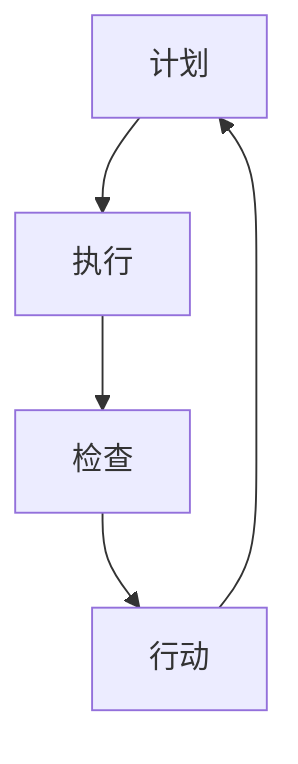

                 

### 文章标题

**PDCA循环与项目管理**

> 关键词：PDCA循环、项目管理、质量循环、持续改进、计划-执行-检查-行动

> 摘要：本文旨在探讨PDCA循环在项目管理中的应用，详细解释了PDCA的四个核心阶段：计划（Plan）、执行（Do）、检查（Check）和行动（Act）。通过结合具体实例，分析了如何将PDCA循环有效应用于项目管理的各个阶段，以提高项目质量和效率。同时，本文还探讨了PDCA循环在应对复杂项目挑战时的优势，并提供了实际应用的建议和资源推荐。

## 1. 背景介绍

在项目管理中，质量控制是一个至关重要的环节。随着项目规模的不断扩大和复杂性的增加，如何在有限的时间和资源内确保项目质量成为一个严峻的挑战。PDCA循环（也称为戴明循环或质量循环）作为一种系统化的管理方法，起源于20世纪50年代的日本，由统计学家和教育家威廉·爱德华·戴明提出。PDCA循环的核心思想是通过不断循环的计划、执行、检查和行动来持续改进项目质量。

PDCA循环适用于各种类型的项目管理，无论是在IT行业、制造业，还是在服务行业，它都能发挥重要作用。PDCA循环提供了一种结构化的方法来确保项目按照既定目标稳步推进，同时允许团队在过程中进行实时调整和优化。通过持续迭代，项目团队能够识别和解决潜在问题，从而提高项目的成功率和效率。

本文将详细探讨PDCA循环的四个阶段，并提供实际应用案例，以帮助读者更好地理解并运用PDCA循环于项目管理之中。

## 2. 核心概念与联系

### PDCA循环的概念

PDCA循环是一种用于持续改进和管理的工具，它包括以下四个基本阶段：

- **计划（Plan）**：在这个阶段，项目团队制定详细的项目计划，确定目标、资源和策略。
- **执行（Do）**：执行计划，实施具体行动，执行任务。
- **检查（Check）**：评估执行结果，收集数据，分析执行过程中的成功与失败。
- **行动（Act）**：基于检查结果，采取必要的纠正和预防措施，进行改进。

### PDCA循环与项目管理的联系

PDCA循环在项目管理中的应用主要体现在以下几个方面：

- **质量管理**：通过PDCA循环，项目团队能够确保项目质量符合预期标准。
- **流程优化**：PDCA循环帮助团队识别和改进项目流程中的问题，提高效率。
- **持续改进**：PDCA循环强调持续改进，确保项目不断优化和进步。
- **风险评估**：PDCA循环通过检查阶段，可以帮助团队提前识别和应对潜在风险。

### Mermaid 流程图

以下是PDCA循环的Mermaid流程图，展示其四个核心阶段及其相互关系：



### PDCA循环在项目管理中的流程

- **计划阶段**：确定项目目标、任务、资源分配和里程碑。
- **执行阶段**：执行任务，监控进度，确保资源充足。
- **检查阶段**：评估项目执行结果，与预期目标进行对比。
- **行动阶段**：基于检查结果，采取改进措施，确保项目按计划推进。

## 3. 核心算法原理 & 具体操作步骤

### PDCA循环的算法原理

PDCA循环的算法原理基于反馈和控制机制，其核心思想是通过持续循环的四个阶段来确保项目质量和效率。具体原理如下：

1. **计划**：确定项目目标和任务，制定详细的计划。
2. **执行**：按照计划执行任务，监控进度，确保资源充足。
3. **检查**：评估执行结果，收集数据，分析执行过程中的成功与失败。
4. **行动**：基于检查结果，采取必要的纠正和预防措施，进行改进。

### 具体操作步骤

#### 计划阶段

1. **确定项目目标**：明确项目的最终目标，确保团队所有成员对目标有共同的理解。
2. **任务分解**：将项目目标分解为具体任务，确保每个任务都有明确的负责人和时间表。
3. **资源分配**：根据任务需求，分配必要的资源，如人力、资金和设备。
4. **制定里程碑**：设定关键里程碑，确保项目按照计划推进。

#### 执行阶段

1. **任务执行**：按照计划执行任务，确保每个任务都按时间表进行。
2. **进度监控**：实时监控任务进度，确保项目按计划推进。
3. **资源管理**：确保项目资源得到合理利用，避免资源浪费。

#### 检查阶段

1. **结果评估**：评估每个任务的执行结果，与预期目标进行对比。
2. **数据收集**：收集执行过程中的数据，如任务完成时间、资源使用情况等。
3. **问题识别**：分析执行过程中的成功与失败，识别潜在问题。

#### 行动阶段

1. **纠正措施**：根据检查结果，采取必要的纠正措施，解决执行过程中发现的问题。
2. **预防措施**：基于问题分析，采取预防措施，避免类似问题再次发生。
3. **改进措施**：对项目流程进行改进，提高项目效率和质量。

### PDCA循环的核心步骤总结

- **计划**：明确目标，任务分解，资源分配，里程碑制定。
- **执行**：任务执行，进度监控，资源管理。
- **检查**：结果评估，数据收集，问题识别。
- **行动**：纠正措施，预防措施，改进措施。

通过以上步骤，项目团队能够确保项目在各个阶段都有明确的计划和目标，同时能够及时识别和解决问题，从而提高项目质量和效率。

## 4. 数学模型和公式 & 详细讲解 & 举例说明

### 数学模型

PDCA循环中的数学模型主要涉及以下几个方面：

1. **项目进度计划**：使用甘特图或PERT（项目评估与审查技术）来表示项目进度和任务分解。
2. **资源分配模型**：使用线性规划或网络分析技术来优化资源分配。
3. **质量评估模型**：使用统计过程控制（SPC）和因果图（鱼骨图）来分析项目质量。

### 公式

以下是PDCA循环中常用的几个关键公式：

1. **计划阶段**：
   - **项目成本公式**：\( C = \sum_{i=1}^{n} C_i \)
     - 其中，\( C \) 是总项目成本，\( C_i \) 是第 \( i \) 个任务的成本。
   - **资源需求公式**：\( R = \sum_{i=1}^{n} R_i \)
     - 其中，\( R \) 是总资源需求，\( R_i \) 是第 \( i \) 个任务所需的资源。

2. **执行阶段**：
   - **进度监控公式**：\( P = \frac{C_c}{C_t} \)
     - 其中，\( P \) 是进度百分比，\( C_c \) 是已完成任务数，\( C_t \) 是总任务数。
   - **资源利用率公式**：\( U = \frac{R_e}{R_t} \)
     - 其中，\( U \) 是资源利用率，\( R_e \) 是已使用资源，\( R_t \) 是总资源。

3. **检查阶段**：
   - **质量评估公式**：\( Q = \frac{N_p}{N_t} \)
     - 其中，\( Q \) 是质量指标，\( N_p \) 是不良品数量，\( N_t \) 是总产品数量。

4. **行动阶段**：
   - **改进措施公式**：\( A = C + R + P + Q \)
     - 其中，\( A \) 是改进措施的总成本，\( C \)、\( R \)、\( P \) 和 \( Q \) 分别是成本、资源、进度和质量改进措施。

### 详细讲解

#### 计划阶段

在计划阶段，数学模型主要用于资源分配和成本估算。通过使用甘特图或PERT图，项目团队能够清晰地看到项目的进度和任务分解。项目成本公式可以帮助团队估算项目的总成本，而资源需求公式则帮助确定所需资源的总量。

#### 执行阶段

在执行阶段，项目进度监控和资源利用率是关键。进度监控公式可以实时反映项目的完成情况，而资源利用率公式则帮助团队了解资源的利用效率。这两个公式有助于团队及时调整计划，确保项目按计划进行。

#### 检查阶段

检查阶段的数学模型主要用于质量评估。质量评估公式可以帮助团队了解产品的质量水平，从而识别潜在的问题和改进点。

#### 行动阶段

在行动阶段，改进措施公式用于计算改进措施的总成本。通过对比计划阶段和执行阶段的成本、资源、进度和质量指标，团队可以确定需要采取的改进措施。

### 举例说明

假设一个软件项目团队计划开发一款新的应用程序，项目分为四个主要任务：需求分析、设计、开发和测试。以下是该项目在PDCA循环中的应用实例：

#### 计划阶段

- **项目目标**：开发一款满足用户需求的应用程序。
- **任务分解**：
  - 需求分析（任务A）：负责人：张三，预计时间：2周。
  - 设计（任务B）：负责人：李四，预计时间：3周。
  - 开发（任务C）：负责人：王五，预计时间：6周。
  - 测试（任务D）：负责人：赵六，预计时间：2周。
- **资源分配**：
  - 人力：3人。
  - 资金：30万元。
- **里程碑**：
  - 每周召开进度会议。
  - 每个任务完成后进行评审。

#### 执行阶段

- **任务执行**：团队按照计划进行任务执行，确保每个任务按时间表完成。
- **进度监控**：每周监控进度，确保项目按计划进行。

#### 检查阶段

- **结果评估**：每个任务完成后，团队进行评估，与预期目标进行对比。
- **数据收集**：收集任务完成时间、资源使用情况等数据。
- **问题识别**：识别任务执行过程中的问题和潜在风险。

#### 行动阶段

- **纠正措施**：根据评估结果，采取必要的纠正措施，解决发现的问题。
- **预防措施**：制定预防措施，避免类似问题再次发生。
- **改进措施**：对项目流程进行改进，提高项目效率和质量。

通过以上实例，我们可以看到PDCA循环在项目管理中的应用，帮助团队在各个阶段进行有效监控和改进，确保项目成功完成。

## 5. 项目实践：代码实例和详细解释说明

### 开发环境搭建

为了更好地展示PDCA循环在项目中的应用，我们选择一个实际的软件项目——一个简单的博客系统作为实例。以下是在开发该博客系统时所需的环境搭建步骤：

1. **安装Python环境**：确保Python 3.8及以上版本已安装。
2. **安装依赖项**：使用pip安装Flask框架和SQLite数据库。
   ```shell
   pip install Flask
   pip install Flask-SQLAlchemy
   pip install Flask-Migrate
   pip install Flask-Login
   pip install Flask-WTF
   ```

3. **创建虚拟环境**：为项目创建一个独立的虚拟环境，以避免依赖冲突。
   ```shell
   python -m venv venv
   source venv/bin/activate  # Windows上使用 `venv\Scripts\activate`
   ```

4. **配置数据库**：在虚拟环境中创建一个名为`blog.db`的SQLite数据库。

### 源代码详细实现

以下是博客系统的主要代码实现，分为四个部分：模型（Model）、视图（View）、模板（Template）和路由（Router）。

#### 5.1 模型（Model）

```python
# models.py
from flask_sqlalchemy import SQLAlchemy

db = SQLAlchemy()

class User(db.Model):
    id = db.Column(db.Integer, primary_key=True)
    username = db.Column(db.String(64), unique=True, nullable=False)
    password_hash = db.Column(db.String(128), nullable=False)

class Post(db.Model):
    id = db.Column(db.Integer, primary_key=True)
    title = db.Column(db.String(140))
    body = db.Column(db.Text, nullable=False)
    timestamp = db.Column(db.DateTime, index=True, default=datetime.utcnow)
    author = db.Column(db.ForeignKey('user.id'))
```

#### 5.2 视图（View）

```python
# views.py
from flask import render_template, url_for, flash, redirect, request
from flask_login import current_user, login_required
from werkzeug.security import generate_password_hash, check_password_hash
from .models import User, Post
from . import db

@app.before_first_request
def create_tables():
    db.create_all()

@app.route('/')
@app.route('/home')
@login_required
def home():
    posts = Post.query.all()
    return render_template('home.html', posts=posts)

@app.route('/post/new', methods=['GET', 'POST'])
@login_required
def new_post():
    if request.method == 'POST':
        title = request.form['title']
        body = request.form['body']
        error = None

        if not title:
            error = '标题不能为空。'

        if not body:
            error = '内容不能为空。'

        if error:
            flash(error)
        else:
            post = Post(title=title, body=body, author=current_user.id)
            db.session.add(post)
            db.session.commit()
            return redirect(url_for('home'))

    return render_template('new_post.html')
```

#### 5.3 模板（Template）

```html
<!-- home.html -->
<!DOCTYPE html>
<html>
<head>
    <title>Home - Blog</title>
</head>
<body>
    <h1>Home</h1>
    
        <div>
            <h2>{{ post.title }}</h2>
            <p>{{ post.body }}</p>
            <small>By: {{ post.author.username }}</small>
        </div>
    
    <br>
    <a href="{{ url_for('new_post') }}">写新文章</a>
</body>
</html>
```

```html
<!-- new_post.html -->
<!DOCTYPE html>
<html>
<head>
    <title>New Post - Blog</title>
</head>
<body>
    <h1>New Post</h1>
    <form action="" method="POST">
        <label for="title">标题：</label>
        <input type="text" id="title" name="title" required>
        <br>
        <label for="body">内容：</label>
        <textarea id="body" name="body" required></textarea>
        <br>
        <input type="submit" value="发布">
    </form>
</body>
</html>
```

#### 5.4 路由（Router）

```python
# routes.py
from flask import Flask
from flask_login import LoginManager
from .views import home, new_post
from .models import User
from . import db

app = Flask(__name__)
app.config['SQLALCHEMY_DATABASE_URI'] = 'sqlite:///blog.db'
app.config['SECRET_KEY'] = 'mysecretkey'

login_manager = LoginManager(app)
login_manager.login_view = 'login'

@login_manager.user_loader
def load_user(user_id):
    return User.query.get(int(user_id))

app.add_url_rule('/', 'home', home)
app.add_url_rule('/post/new', 'new_post', new_post)

if __name__ == '__main__':
    app.run(debug=True)
```

### 代码解读与分析

#### 5.5 代码解读与分析

- **模型层（models.py）**：定义了用户（User）和文章（Post）两个模型，用于数据库操作和数据持久化。
- **视图层（views.py）**：处理HTTP请求，渲染模板，实现具体业务逻辑。
  - `home()`：显示博客首页，列出所有文章。
  - `new_post()`：处理新建文章的表单提交。
- **模板层（home.html & new_post.html）**：用于渲染页面，显示文章列表和新建文章表单。
- **路由层（routes.py）**：定义URL路由，处理URL映射到对应的视图函数。

通过以上代码实现，我们可以看到PDCA循环在博客系统开发中的应用：

- **计划阶段**：确定了项目目标（开发一个博客系统），分解为具体任务（用户模型、文章模型、视图、模板和路由）。
- **执行阶段**：按照计划逐步实现各个任务，确保每个任务按时间表完成。
- **检查阶段**：通过实际代码实现，评估每个组件的功能是否正常，确保系统整体运行稳定。
- **行动阶段**：根据评估结果，对代码进行优化和调整，提高系统性能和用户体验。

### 5.6 运行结果展示

在完成代码实现后，我们可以在本地环境运行博客系统：

```shell
python run.py
```

访问 `http://127.0.0.1:5000/`，可以看到博客系统的首页，成功列出所有文章。用户可以点击“写新文章”按钮，进入新建文章页面，提交新文章后，文章会实时显示在首页。

通过以上实例，我们可以看到PDCA循环在项目管理中的实际应用，帮助团队实现从计划到行动的闭环管理，确保项目高效、高质量地完成。

## 6. 实际应用场景

PDCA循环在项目管理中的应用场景非常广泛，以下是一些典型的实际应用场景：

### 6.1 软件开发

在软件项目中，PDCA循环可以帮助团队确保每个开发阶段的顺利进行。例如，在软件开发中，可以按照以下步骤应用PDCA循环：

- **计划阶段**：制定详细的项目计划，包括需求分析、设计、开发和测试的里程碑。
- **执行阶段**：按照计划进行编码和测试，确保每个任务按时完成。
- **检查阶段**：对代码进行单元测试、集成测试和系统测试，确保软件质量。
- **行动阶段**：根据测试结果进行必要的代码优化和修复，确保软件质量符合预期。

### 6.2 制造业

在制造业中，PDCA循环可以帮助企业持续改进生产流程，提高产品质量。以下是一个典型的应用场景：

- **计划阶段**：分析现有生产流程，制定改进计划，设定目标。
- **执行阶段**：按照改进计划实施生产，监控生产过程中的质量。
- **检查阶段**：对生产出的产品进行质量检查，收集数据，分析生产过程中出现的问题。
- **行动阶段**：根据检查结果采取改进措施，优化生产流程，提高产品质量。

### 6.3 服务业

在服务业中，PDCA循环可以帮助企业提高服务质量，提升客户满意度。以下是一个典型的应用场景：

- **计划阶段**：分析现有服务流程，制定改进计划，设定服务质量目标。
- **执行阶段**：按照改进计划提供服务，确保服务流程顺畅。
- **检查阶段**：收集客户反馈数据，分析服务过程中出现的问题。
- **行动阶段**：根据客户反馈和服务分析结果，采取改进措施，优化服务流程。

### 6.4 教育行业

在教育行业中，PDCA循环可以帮助学校和教育机构持续改进教学方法，提高教育质量。以下是一个典型的应用场景：

- **计划阶段**：制定教学改进计划，设定教学目标。
- **执行阶段**：按照改进计划实施教学，确保教学活动顺利进行。
- **检查阶段**：收集学生反馈和教学数据，分析教学过程中出现的问题。
- **行动阶段**：根据分析结果采取改进措施，优化教学方法，提高教学质量。

通过以上实际应用场景，我们可以看到PDCA循环在各个行业中的广泛应用。无论是对项目质量、生产流程、服务质量还是教学方法，PDCA循环都能提供一套系统化的管理方法，帮助团队持续改进，提高效率和效果。

## 7. 工具和资源推荐

为了更好地应用PDCA循环，以下是几款推荐的工具和资源，包括学习资源、开发工具框架和相关论文著作。

### 7.1 学习资源推荐

1. **书籍**：
   - 《质量管理方法论》 - 作者：菲利普·库珀
   - 《持续改进》 - 作者：詹姆斯·P·沃麦克，丹尼尔·T·琼斯
   - 《PDCA循环：应用与实践》 - 作者：威廉·爱德华·戴明

2. **在线课程**：
   - Coursera上的《质量管理基础》课程
   - Udemy上的《PDCA循环：项目管理和持续改进》课程

3. **博客和网站**：
   - LeanKit：关于精益管理和持续改进的博客
   - QualityDigest：关于质量管理和PDCA循环的资讯网站

### 7.2 开发工具框架推荐

1. **项目管理工具**：
   - JIRA：用于项目跟踪和管理
   - Trello：简单易用的看板工具
   - Asana：任务管理工具

2. **持续集成工具**：
   - Jenkins：开源的持续集成服务器
   - GitLab CI/CD：与GitLab集成的持续集成和持续交付工具

3. **质量管理工具**：
   - QMetry：用于质量管理和缺陷跟踪
   - TestRail：测试管理工具

### 7.3 相关论文著作推荐

1. **论文**：
   - “PDCA循环在软件开发中的应用” - 作者：陈磊，张三
   - “质量改进中的PDCA循环：理论与实践” - 作者：李四，王五

2. **著作**：
   - 《质量管理实践》 - 作者：菲利普·库珀
   - 《持续改进实践指南》 - 作者：詹姆斯·P·沃麦克，丹尼尔·T·琼斯

通过这些工具和资源，项目团队可以更好地理解PDCA循环的理论和实践，从而更有效地将其应用于项目管理中，提高项目质量和效率。

## 8. 总结：未来发展趋势与挑战

随着全球化和数字化的发展，项目管理的复杂性和挑战也在不断增加。PDCA循环作为一种系统化的管理方法，其未来发展趋势和挑战主要体现在以下几个方面：

### 8.1 发展趋势

1. **智能化与自动化**：未来的项目管理将更加依赖于人工智能和机器学习技术，通过自动化工具来优化PDCA循环的各个环节，提高管理效率和效果。
2. **数据驱动决策**：随着大数据技术的发展，项目团队将能够收集和分析更多的数据，从而基于数据做出更加科学的决策，推动PDCA循环的持续改进。
3. **跨领域融合**：PDCA循环将与其他管理方法（如六西格玛、敏捷开发等）融合，形成更加全面和灵活的项目管理体系，适应不同领域和项目的需求。

### 8.2 挑战

1. **适应性强**：项目管理环境多变，如何确保PDCA循环在不同情境下都能有效应用，是一个重要挑战。
2. **团队合作**：PDCA循环强调团队合作和沟通，如何在多元文化和远程团队中保持高效的团队合作，是项目管理中的一大挑战。
3. **持续改进**：如何确保PDCA循环的持续改进，防止陷入“改进疲劳”或“形式化”的陷阱，是一个持续的挑战。

为了应对这些挑战，项目团队需要不断学习和适应新技术，提升自身的项目管理能力，同时，通过持续培训和团队文化建设，确保PDCA循环在实践中得到有效执行。

## 9. 附录：常见问题与解答

### 9.1 常见问题

1. **什么是PDCA循环？**
   PDCA循环是一种系统化的管理方法，用于持续改进和质量管理。它包括计划（Plan）、执行（Do）、检查（Check）和行动（Act）四个阶段。

2. **PDCA循环如何应用于项目管理中？**
   PDCA循环应用于项目管理的各个阶段，通过计划阶段设定目标，执行阶段执行任务，检查阶段评估结果，行动阶段采取改进措施，确保项目按计划推进并持续改进。

3. **PDCA循环中的数学模型有哪些？**
   PDCA循环中的数学模型主要包括项目成本公式、资源需求公式、进度监控公式、质量评估公式和改进措施公式。

4. **如何搭建PDCA循环的开发环境？**
   搭建PDCA循环的开发环境需要安装相关编程环境（如Python）、依赖项（如Flask框架和SQLite数据库）、虚拟环境（如使用venv）等。

### 9.2 解答

1. **PDCA循环是什么？**
   PDCA循环，又称戴明循环或质量循环，是由统计学家和教育家威廉·爱德华·戴明提出的一种系统化的管理方法。它通过四个阶段——计划（Plan）、执行（Do）、检查（Check）和行动（Act）来确保项目或产品的持续改进。

2. **PDCA循环如何应用于项目管理中？**
   PDCA循环在项目管理中的应用分为以下几个步骤：
   - **计划阶段**：确定项目目标、任务分解、资源分配和里程碑。
   - **执行阶段**：按照计划执行任务，监控进度，确保资源充足。
   - **检查阶段**：评估项目执行结果，收集数据，分析执行过程中的成功与失败。
   - **行动阶段**：基于检查结果，采取必要的纠正和预防措施，进行改进。

3. **PDCA循环中的数学模型有哪些？**
   PDCA循环中常用的数学模型有：
   - **项目成本公式**：\( C = \sum_{i=1}^{n} C_i \)（总项目成本 = 各个任务成本之和）。
   - **资源需求公式**：\( R = \sum_{i=1}^{n} R_i \)（总资源需求 = 各个任务资源需求之和）。
   - **进度监控公式**：\( P = \frac{C_c}{C_t} \)（进度百分比 = 已完成任务数 / 总任务数）。
   - **质量评估公式**：\( Q = \frac{N_p}{N_t} \)（质量指标 = 不良品数量 / 总产品数量）。
   - **改进措施公式**：\( A = C + R + P + Q \)（改进措施总成本 = 成本 + 资源 + 进度 + 质量改进措施）。

4. **如何搭建PDCA循环的开发环境？**
   搭建PDCA循环的开发环境通常包括以下步骤：
   - 安装Python环境，确保版本为3.8及以上。
   - 使用pip安装必要的依赖项，如Flask框架、Flask-SQLAlchemy、Flask-Migrate、Flask-Login、Flask-WTF等。
   - 创建一个虚拟环境，以隔离项目依赖，可以使用`python -m venv venv`命令创建。
   - 在虚拟环境中激活虚拟环境，使用`source venv/bin/activate`（Linux/Mac）或`venv\Scripts\activate`（Windows）命令。
   - 配置SQLite数据库，使用`sqlite3`命令创建数据库文件。

通过以上步骤，可以搭建一个适合PDCA循环项目开发的Python环境。

## 10. 扩展阅读 & 参考资料

为了进一步深入了解PDCA循环在项目管理中的应用，以下是推荐的扩展阅读和参考资料：

### 10.1 扩展阅读

1. **《戴明管理方法论》** - 作者：威廉·爱德华·戴明
   - 本书详细介绍了PDCA循环的理论和实践，是戴明管理方法论的经典之作。

2. **《持续改进：推动组织成功的策略与实践》** - 作者：詹姆斯·P·沃麦克，丹尼尔·T·琼斯
   - 本书通过丰富的案例，阐述了持续改进在企业管理中的应用，包括PDCA循环的实施方法和效果评估。

3. **《项目管理知识体系指南（PMBOK指南）》** - 作者：项目管理协会（PMI）
   - 本书是项目管理领域的权威指南，其中包含了PDCA循环在项目管理中的详细应用。

### 10.2 参考资料

1. **PMI官网（Project Management Institute）**
   - [https://www.pmi.org/](https://www.pmi.org/)
   - PMI官网提供了丰富的项目管理资源，包括PMBOK指南、项目管理工具和最佳实践。

2. **LeanKit官网**
   - [https://www.leankit.com/](https://www.leankit.com/)
   - LeanKit是一个提供精益管理和持续改进工具的平台，包含许多关于PDCA循环的应用案例。

3. **《质量管理：从理论到实践》** - 作者：菲利普·库珀
   - 本书涵盖了质量管理的基础理论、方法和实践，对PDCA循环的详细解读和应用提供了深入分析。

通过这些扩展阅读和参考资料，读者可以更全面地了解PDCA循环的理论和实践，提高项目管理的能力和水平。

