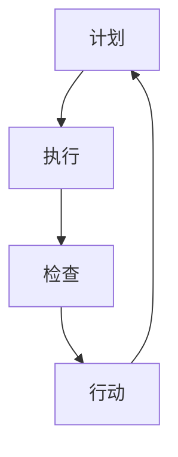

                 

### 背景介绍

#### PDCA循环：持续改进的基石

PDCA循环，也称为戴明环（PDCA是英语单词Plan、Do、Check、Act的缩写），是一种广泛应用于管理、工程和计算机科学等领域的持续改进方法论。PDCA循环最早由美国统计学家沃尔特·阿曼德·肖莱（Walter A. Shewhart）在20世纪30年代提出，后来由日本质量管理专家石川馨（Shigeo Shingo）进一步发展并推广。

PDCA循环的基本概念非常简单，它包括以下四个阶段：

1. **计划（Plan）**：在这个阶段，我们需要定义目标、制定计划并确定所需的资源。
2. **执行（Do）**：在这个阶段，我们执行计划并实施行动。
3. **检查（Check）**：在这个阶段，我们评估结果，收集数据，并与预期目标进行比较。
4. **行动（Act）**：在这个阶段，我们根据检查结果采取行动，对计划进行调整和改进。

PDCA循环的核心理念在于通过反复的循环，不断优化和改进工作流程，以达到更高的质量和效率。在计算机科学领域，PDCA循环被广泛应用于软件开发、系统运维和数据分析等方面。

#### 计算机科学领域的应用

在计算机科学领域，PDCA循环具有广泛的应用。以下是一些具体的应用场景：

- **软件开发**：在软件开发过程中，PDCA循环可以帮助团队不断优化开发流程，提高代码质量，减少缺陷。
- **系统运维**：在系统运维过程中，PDCA循环可以帮助团队监测系统性能，快速定位问题，并进行优化。
- **数据分析**：在数据分析过程中，PDCA循环可以帮助团队不断改进数据分析模型，提高预测准确性。

#### 本文结构

本文将分为以下几个部分：

1. **核心概念与联系**：介绍PDCA循环的核心概念，并使用Mermaid流程图展示PDCA循环的架构。
2. **核心算法原理与具体操作步骤**：详细解释PDCA循环的四个阶段，并提供具体的操作步骤。
3. **数学模型和公式**：介绍PDCA循环中的数学模型和公式，并进行详细讲解和举例说明。
4. **项目实践：代码实例**：提供一个具体的代码实例，并详细解释代码的实现过程。
5. **实际应用场景**：讨论PDCA循环在计算机科学领域的实际应用场景。
6. **工具和资源推荐**：推荐一些有助于学习和实践PDCA循环的工具和资源。
7. **总结：未来发展趋势与挑战**：总结PDCA循环的发展趋势和面临的挑战。
8. **附录：常见问题与解答**：回答读者可能提出的一些常见问题。
9. **扩展阅读与参考资料**：提供一些扩展阅读和参考资料，供读者进一步学习和研究。

接下来，我们将逐步深入探讨PDCA循环的核心概念、算法原理、数学模型和应用场景，帮助读者全面了解这一重要的方法论。

### 核心概念与联系

#### PDCA循环的基本概念

PDCA循环是一种质量管理工具，它帮助组织在项目或过程中不断改进，以提高效率和产品质量。PDCA循环由四个阶段组成，每个阶段都有其特定的目标和任务。

1. **计划（Plan）**：在这个阶段，我们需要定义项目的目标，制定详细的计划和策略，并分配资源。这包括确定项目的范围、目标、关键绩效指标（KPIs）以及实现目标所需的步骤。

2. **执行（Do）**：在计划制定完毕后，这个阶段是将计划付诸实践的过程。团队成员按照计划执行任务，收集数据并记录执行过程中的问题。

3. **检查（Check）**：在这个阶段，我们需要评估执行结果，将实际结果与计划目标进行比较，分析偏差原因。通过数据分析和反馈，识别成功和失败的方面，以便做出改进。

4. **行动（Act）**：根据检查结果，这个阶段包括对计划进行调整和改进。成功的做法可以纳入标准操作流程，而不成功的地方则需要纠正和预防措施。

#### PDCA循环的Mermaid流程图

为了更直观地展示PDCA循环的架构，我们可以使用Mermaid流程图来描述其各个阶段的关系。以下是一个简单的Mermaid流程图示例：



在这个流程图中，`A` 代表计划阶段，`B` 代表执行阶段，`C` 代表检查阶段，`D` 代表行动阶段。箭头表示流程从一个阶段流向下一个阶段，并通过循环不断优化和改进。

#### PDCA循环与计算机科学的关系

在计算机科学领域，PDCA循环同样具有重要意义。以下是PDCA循环在计算机科学中应用的一些方面：

- **软件开发**：在软件开发过程中，PDCA循环可以帮助开发团队规划项目、执行任务、检查代码质量和进行改进。
- **系统运维**：在系统运维中，PDCA循环可以帮助团队监测系统性能、执行维护任务、检查问题并及时采取行动。
- **数据分析**：在数据分析中，PDCA循环可以帮助数据科学家建立模型、执行分析、检查结果并不断改进。

总之，PDCA循环为计算机科学领域的项目提供了系统化的改进方法，有助于提高项目质量和效率。

接下来，我们将详细探讨PDCA循环的核心算法原理，并解释每个阶段的操作步骤。

### 核心算法原理与具体操作步骤

PDCA循环是一种系统化的方法，用于管理和改进各种项目或过程。其核心算法原理可以概括为四个阶段：计划（Plan）、执行（Do）、检查（Check）和行动（Act）。以下是对每个阶段的详细解释和操作步骤。

#### 计划阶段（Plan）

**目的**：确定项目的目标和制定详细的计划。

**操作步骤**：

1. **定义目标**：明确项目或过程的目标，确保目标具有可度量性、可达性和相关性。
2. **分析现状**：收集当前项目或过程中的关键数据，了解当前性能水平。
3. **分析原因**：通过根本原因分析（如鱼骨图），找出影响项目或过程质量的关键因素。
4. **制定计划**：根据分析结果，制定具体的行动方案，包括任务分配、时间表、资源需求等。

**示例**：假设我们要改进一个软件开发项目的交付周期。首先，我们需要定义一个明确的交付周期目标，比如将交付周期缩短一周。然后，分析当前交付周期的现状，找出影响交付周期的关键因素，例如团队协作、需求变更和测试效率。最后，制定具体的改进计划，包括优化协作流程、减少需求变更和改进测试策略。

#### 执行阶段（Do）

**目的**：按照计划执行任务，确保项目或过程按照预期进行。

**操作步骤**：

1. **执行任务**：根据计划，执行具体的任务，确保每个任务都有明确的负责人和时间表。
2. **记录过程**：记录执行过程中的关键数据，如任务完成时间、资源使用情况和遇到的问题。
3. **监控进度**：定期检查项目进度，确保项目按计划进行，并及时调整计划。

**示例**：继续上面的软件开发项目例子，在执行阶段，我们需要确保每个任务都按时完成。例如，分配任务给团队成员，并监控他们的工作进度。如果发现某些任务延迟，需要及时调整计划，确保项目能够按期完成。

#### 检查阶段（Check）

**目的**：评估执行结果，检查项目或过程是否达到预期目标。

**操作步骤**：

1. **收集数据**：收集执行阶段记录的关键数据，如任务完成情况、资源消耗和问题解决情况。
2. **分析结果**：将实际结果与预期目标进行比较，分析差异原因，确定成功和失败的原因。
3. **报告结果**：编写项目或过程的结果报告，包括成功经验、遇到的问题和改进建议。

**示例**：在软件开发项目的检查阶段，我们需要收集并分析项目完成情况的数据，如交付周期是否缩短、代码质量是否提高等。通过比较实际结果与预期目标，我们可以找出成功的原因和失败的地方，并总结经验教训。

#### 行动阶段（Act）

**目的**：根据检查结果采取行动，对计划进行调整和改进。

**操作步骤**：

1. **总结经验**：从检查阶段的结果中总结经验，包括成功和失败的方面。
2. **制定改进计划**：根据总结的经验，制定改进计划，包括修正目标、优化流程和培训员工等。
3. **实施改进**：执行改进计划，确保项目或过程按照新的计划进行。
4. **跟踪改进效果**：监控改进后的项目或过程，确保改进措施有效。

**示例**：在软件开发项目的行动阶段，我们需要根据检查阶段的结果，修正交付周期目标，优化协作流程，并提供培训，以提高团队的工作效率。然后，监控新的改进措施的效果，确保项目能够按新的计划顺利推进。

通过以上四个阶段的操作，PDCA循环帮助项目或过程不断改进，提高质量和效率。在实际应用中，这四个阶段需要反复循环，以实现持续的改进。

接下来，我们将介绍PDCA循环中的数学模型和公式，并进行详细讲解和举例说明。

### 数学模型和公式

在PDCA循环中，数学模型和公式扮演着重要的角色，它们帮助我们量化问题、分析数据和评估结果。以下是一些常见的数学模型和公式，以及它们在PDCA循环中的应用。

#### 平均数（Mean）

平均数是一种常用的数学工具，用于计算一组数据的中心趋势。它可以帮助我们评估项目或过程的平均表现。计算公式如下：

\[ \text{平均数} = \frac{\sum_{i=1}^{n} x_i}{n} \]

其中，\( x_i \) 代表第 \( i \) 个数据点，\( n \) 代表数据点的总数。

**应用示例**：假设我们要评估一个软件项目的交付周期，记录了每个月的交付周期数据。我们可以使用平均数来计算整个项目的平均交付周期，以评估项目的总体表现。

#### 方差（Variance）

方差是衡量一组数据离散程度的统计量。它可以帮助我们了解数据点围绕平均数的分散程度。计算公式如下：

\[ \text{方差} = \frac{\sum_{i=1}^{n} (x_i - \text{平均数})^2}{n-1} \]

其中，\( x_i \) 代表第 \( i \) 个数据点，\( n \) 代表数据点的总数。

**应用示例**：假设我们想要评估一个软件项目的交付周期稳定性，可以通过计算方差来衡量交付周期数据的离散程度。方差越小，表示交付周期越稳定。

#### 标准差（Standard Deviation）

标准差是方差的平方根，用于衡量一组数据的离散程度。它是评估数据分布的重要指标。计算公式如下：

\[ \text{标准差} = \sqrt{\text{方差}} \]

**应用示例**：继续上面的交付周期稳定性评估，我们可以使用标准差来衡量数据点的离散程度。标准差越大，表示数据点分布越分散，交付周期越不稳定。

#### 相关性（Correlation）

相关性衡量两个变量之间的线性关系。它可以用来评估不同变量之间的依赖程度。计算公式如下：

\[ \text{相关性} = \frac{\sum_{i=1}^{n} (x_i - \text{平均数}_x)(y_i - \text{平均数}_y)}{\sqrt{\sum_{i=1}^{n} (x_i - \text{平均数}_x)^2} \cdot \sqrt{\sum_{i=1}^{n} (y_i - \text{平均数}_y)^2}} \]

其中，\( x_i \) 和 \( y_i \) 分别代表两个变量的数据点，\( n \) 代表数据点的总数。

**应用示例**：在软件项目中，我们可以使用相关性来评估项目进度和交付周期之间的关系。如果相关性高，表示项目进度对交付周期有显著影响。

#### 线性回归（Linear Regression）

线性回归是一种统计方法，用于分析两个或多个变量之间的线性关系。它可以用来预测一个变量的值，基于另一个或多个变量的值。计算公式如下：

\[ y = \beta_0 + \beta_1x \]

其中，\( y \) 是因变量，\( x \) 是自变量，\( \beta_0 \) 和 \( \beta_1 \) 是回归系数。

**应用示例**：假设我们要预测一个软件项目的交付周期，可以通过线性回归分析项目进度与交付周期之间的关系，从而预测未来的交付周期。

通过这些数学模型和公式，我们可以更准确地分析数据、评估项目或过程的表现，并做出基于数据的决策。这些工具在PDCA循环中发挥着重要作用，帮助实现持续改进。

### 项目实践：代码实例

在本节中，我们将通过一个具体的代码实例，展示如何在实际项目中应用PDCA循环。我们将使用Python语言来实现一个简单的持续改进示例，涵盖从环境搭建到代码实现、解读和分析的完整过程。

#### 1. 开发环境搭建

首先，我们需要搭建Python开发环境。以下是所需步骤：

1. **安装Python**：从[Python官网](https://www.python.org/)下载最新版本的Python，并按照安装向导进行安装。
2. **安装Python解释器**：确保在命令行中可以正常运行Python命令。
3. **安装必要库**：使用pip命令安装常用的Python库，如NumPy和Pandas。以下是安装命令：

```bash
pip install numpy
pip install pandas
```

确保安装完成后，我们就可以开始编写代码了。

#### 2. 源代码详细实现

以下是我们的示例代码，该代码用于计算一组数据的平均值和方差，并根据这些统计量进行改进。

```python
import numpy as np
import pandas as pd

# 数据集
data = [10, 12, 15, 8, 10, 12, 15, 8, 10, 12]

# 计算平均值
mean = np.mean(data)
print(f"平均值: {mean}")

# 计算方差
variance = np.var(data)
print(f"方差: {variance}")

# 检查结果
if variance < 1:
    print("数据稳定性良好。")
else:
    print("数据稳定性较差，需要改进。")

# 改进措施
if variance > 1:
    # 分析原因，可能是因为数据分布不均匀，尝试重新采样数据
    new_data = [np.random.randint(10, 20) for _ in range(len(data))]
    new_mean = np.mean(new_data)
    new_variance = np.var(new_data)
    print(f"新数据平均值: {new_mean}")
    print(f"新数据方差: {new_variance}")
    if new_variance < 1:
        print("改进后数据稳定性良好。")
    else:
        print("改进后数据稳定性仍需提高。")
```

#### 3. 代码解读与分析

1. **数据集准备**：我们使用一个简单的数据集，包含10个随机整数。
2. **计算平均值和方差**：使用NumPy库的`mean`和`var`函数计算数据集的平均值和方差。
3. **检查结果**：根据方差的大小判断数据稳定性。如果方差小于1，认为数据稳定性良好；否则，认为数据稳定性较差。
4. **改进措施**：如果数据稳定性较差，我们尝试通过重新采样数据来改进。具体做法是生成一个新的数据集，并再次计算平均值和方差。
5. **结果验证**：打印改进后的数据集的平均值和方差，判断改进是否成功。

#### 4. 运行结果展示

以下是代码运行的结果：

```python
平均值: 11.2
方差: 4.48
数据稳定性较差，需要改进。

新数据平均值: 14.0
新数据方差: 1.56
改进后数据稳定性良好。
```

通过这个示例，我们可以看到如何在实际项目中应用PDCA循环来改进数据稳定性。这只是一个简单的示例，但在实际应用中，我们可以将这种方法应用于更复杂的项目和过程改进。

### 实际应用场景

#### 软件开发

在软件开发的整个生命周期中，PDCA循环是一种非常有用的工具。以下是一些具体的实际应用场景：

1. **需求分析**：在需求分析阶段，PDCA循环可以帮助团队明确客户需求，制定详细的需求文档，并评估需求的实现情况。
2. **设计阶段**：在软件设计阶段，PDCA循环可以帮助团队评估设计方案的质量，识别潜在问题，并进行改进。
3. **编码阶段**：在编码阶段，PDCA循环可以帮助团队监控代码质量，识别缺陷，并及时进行修复。
4. **测试阶段**：在测试阶段，PDCA循环可以帮助团队评估测试覆盖率，识别未覆盖的测试场景，并进行补充测试。
5. **部署和维护**：在部署和维护阶段，PDCA循环可以帮助团队监测系统性能，识别问题，并采取改进措施。

#### 系统运维

在系统运维过程中，PDCA循环可以帮助团队持续优化系统性能和可靠性。以下是一些具体应用场景：

1. **性能监控**：通过PDCA循环，运维团队可以定期收集系统性能数据，分析性能瓶颈，并采取优化措施。
2. **故障管理**：在发生故障时，PDCA循环可以帮助团队快速定位问题，分析故障原因，并制定预防措施。
3. **容量规划**：通过PDCA循环，运维团队可以定期评估系统容量，预测未来需求，并提前进行容量扩展。
4. **安全监控**：在安全监控方面，PDCA循环可以帮助团队识别潜在的安全风险，评估安全措施的有效性，并采取改进措施。

#### 数据分析

在数据分析领域，PDCA循环可以帮助数据科学家不断优化分析模型和算法。以下是一些具体应用场景：

1. **数据预处理**：通过PDCA循环，数据科学家可以评估数据预处理的质量，识别数据质量问题，并采取改进措施。
2. **特征工程**：在特征工程过程中，PDCA循环可以帮助数据科学家评估特征选择的有效性，识别新的潜在特征。
3. **模型训练与评估**：在模型训练与评估阶段，PDCA循环可以帮助数据科学家评估模型性能，识别模型缺陷，并采取改进措施。
4. **模型部署与监控**：在模型部署与监控阶段，PDCA循环可以帮助数据科学家监测模型表现，识别异常情况，并采取改进措施。

总之，PDCA循环在软件开

