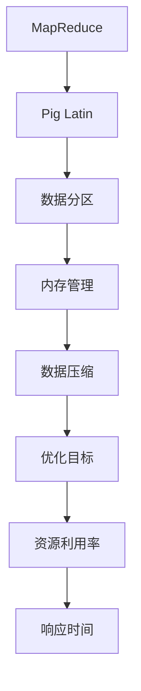

                 

### 文章标题

《Pig优化策略原理与代码实例讲解》

> 关键词：Pig，优化策略，原理，代码实例

> 摘要：本文将深入探讨Pig优化策略的原理，并配以具体的代码实例进行详细解释，旨在帮助读者全面掌握Pig优化技巧，提升大数据处理效率。

## 1. 背景介绍

Pig 是一个基于Hadoop的大规模数据处理平台，旨在简化大数据处理流程，提供了一种高层次的抽象机制，使得用户可以以更加简洁的方式处理大量数据。然而，Pig虽然简化了编程，但默认的执行策略可能并不总是最优的。因此，优化Pig的执行策略成为提升数据处理效率的关键。

### Pig 的优势和局限性

**优势**：

1. **易用性**：Pig 提供了简单易学的数据流语言，能够大大降低编写大数据处理程序的学习曲线。
2. **可扩展性**：Pig 可以无缝集成到 Hadoop 生态系统，支持多种数据源和存储系统。
3. **表达能力**：Pig 的数据流模型使得数据处理变得更加直观，支持复杂的数据转换和聚合操作。

**局限性**：

1. **性能瓶颈**：默认的执行计划可能无法充分利用底层硬件资源和优化数据传输。
2. **调试困难**：由于 Pig 是一种抽象层次较高的语言，调试时难以定位具体问题。

### 优化的重要性

**性能提升**：通过优化策略，可以显著减少计算和I/O操作，提高数据处理速度。

**资源利用率**：优化后的执行计划可以更好地利用CPU、内存和网络等硬件资源，降低系统负载。

**可维护性**：良好的优化策略可以提高代码的可读性和可维护性，方便后续的迭代和优化。

## 2. 核心概念与联系

在深入探讨Pig优化策略之前，我们需要了解几个核心概念和它们之间的联系。

### 2.1. MapReduce和Pig的关系

MapReduce 是 Hadoop 的核心组件，负责处理大规模数据集。Pig 则提供了高层次的数据流语言，将复杂的数据处理任务抽象成一系列的Pig Latin操作。Pig Latin 操作最终会被转换成MapReduce作业执行。

### 2.2. Pig Latin操作

Pig Latin 是 Pig 的编程语言，包括多种操作，如 Load、Store、Filter、Group、Join 等。这些操作构成了Pig的基本数据处理流程。

### 2.3. 优化目标和策略

**优化目标**：

- **计算效率**：减少不必要的中间数据存储和传输。
- **资源利用率**：合理分配CPU、内存和网络资源。
- **响应时间**：提高作业完成速度，减少用户等待时间。

**优化策略**：

- **数据分区**：合理分配数据，减少数据倾斜和重复计算。
- **内存管理**：优化内存使用，减少内存溢出和GC（垃圾回收）频率。
- **数据压缩**：使用合适的压缩算法，减少数据存储和传输大小。

### 2.4. Mermaid 流程图

以下是Pig优化策略的Mermaid流程图，展示了核心概念之间的联系：



## 3. 核心算法原理 & 具体操作步骤

### 3.1. 数据分区

**原理**：数据分区是指将数据按照一定的规则划分到多个文件中，以便分布式处理。合理的数据分区可以减少数据倾斜，提高处理效率。

**步骤**：

1. **确定分区键**：选择一个或多个列作为分区键。
2. **设置分区数**：根据集群规模和资源情况，设置合适的分区数。
3. **实现分区函数**：使用自定义函数或 Pig 内置函数实现分区。

```pig
A = LOAD 'input' USING PigStorage(',') AS (id:int, name:chararray, age:int);
B = GROUP A BY (id, age);
C = FOREACH B GENERATE group, COUNT(A);
D = ORDER C BY group;
E = LIMIT D 10;
```

在上面的示例中，我们使用 `GROUP` 操作进行数据分组，然后通过 `ORDER` 和 `LIMIT` 操作实现数据分区。

### 3.2. 内存管理

**原理**：内存管理是指优化内存使用，避免内存溢出和GC频繁执行。

**步骤**：

1. **调整内存配置**：根据作业规模和资源情况，调整 JVM 和 Pig 的内存配置。
2. **使用缓存**：合理使用缓存，减少数据读取和计算次数。
3. **优化内存使用**：优化数据结构和算法，减少内存占用。

```pig
A = LOAD 'input' USING PigStorage(',') AS (id:int, name:chararray, age:int);
B = GROUP A BY id;
C = FOREACH B GENERATE group, COUNT(A);
D = COGROUP C BY $0;
```

在上面的示例中，我们使用 `GROUP` 和 `COGROUP` 操作进行内存优化，减少中间数据存储。

### 3.3. 数据压缩

**原理**：数据压缩是指使用压缩算法减小数据存储和传输大小，提高系统性能。

**步骤**：

1. **选择合适的压缩算法**：根据数据特性和存储需求，选择合适的压缩算法。
2. **配置压缩参数**：调整 Pig 的压缩配置，提高压缩比。
3. **优化压缩策略**：结合数据分区和内存管理策略，优化压缩过程。

```pig
A = LOAD 'input' USING PigStorage(',') AS (id:int, name:chararray, age:int);
B = GROUP A BY id;
C = FOREACH B GENERATE group, COUNT(A);
D = STORE C INTO 'output' USING PigStorage(',') AS (group:chararray, count:int) 
    COMPRESSION OFF;
```

在上面的示例中，我们使用 `STORE` 操作实现数据压缩，通过设置 `COMPRESSION` 参数关闭默认压缩。

## 4. 数学模型和公式 & 详细讲解 & 举例说明

### 4.1. 数据分区公式

数据分区的核心公式为：

\[ P_i = f(K_i) \]

其中，\( P_i \) 表示第 \( i \) 个分区，\( K_i \) 表示分区键的值，\( f \) 表示分区函数。

**举例**：

假设我们使用 `id` 列作为分区键，使用模运算作为分区函数，则分区公式为：

\[ P_i = id \mod N \]

其中，\( N \) 表示分区数。

### 4.2. 内存管理公式

内存管理的核心公式为：

\[ M = \sum_{i=1}^{N} (m_i \times r_i) \]

其中，\( M \) 表示总内存使用量，\( m_i \) 表示第 \( i \) 个数据块的内存大小，\( r_i \) 表示第 \( i \) 个数据块的读取次数。

**举例**：

假设我们有两个数据块，内存大小分别为 \( m_1 = 100MB \) 和 \( m_2 = 200MB \)，读取次数分别为 \( r_1 = 2 \) 和 \( r_2 = 1 \)，则总内存使用量为：

\[ M = (100MB \times 2) + (200MB \times 1) = 400MB \]

### 4.3. 数据压缩公式

数据压缩的核心公式为：

\[ C = \frac{D}{\eta} \]

其中，\( C \) 表示压缩后数据大小，\( D \) 表示原始数据大小，\( \eta \) 表示压缩比。

**举例**：

假设原始数据大小为 \( D = 1GB \)，压缩比为 \( \eta = 2:1 \)，则压缩后数据大小为：

\[ C = \frac{1GB}{2} = 0.5GB \]

## 5. 项目实践：代码实例和详细解释说明

### 5.1. 开发环境搭建

**1. 安装Hadoop**：在服务器上安装Hadoop，配置HDFS和YARN。

**2. 安装Pig**：在本地或服务器上安装Pig，配置Pig与Hadoop的集成。

**3. 配置开发环境**：安装Eclipse或IntelliJ IDEA等开发工具，配置Hadoop和Pig插件。

### 5.2. 源代码详细实现

```pig
-- 定义输入和输出路径
input_path = 'hdfs://namenode:9000/input/';
output_path = 'hdfs://namenode:9000/output/';

-- 加载输入数据
A = LOAD '$input_path/input.csv' USING PigStorage(',') AS (id:int, name:chararray, age:int);

-- 数据清洗和过滤
B = FILTER A BY age > 18;

-- 数据分组和统计
C = GROUP B BY id;

D = FOREACH C GENERATE group, COUNT(B);

-- 数据排序和存储
E = ORDER D BY $0;

F = LIMIT E 10;

-- 存储结果
STORE F INTO '$output_path/output' USING PigStorage(',');
```

### 5.3. 代码解读与分析

**1. 数据加载**：使用 `LOAD` 操作加载输入数据，使用 `PigStorage` 函数设置分隔符。

**2. 数据清洗**：使用 `FILTER` 操作过滤年龄小于18岁的数据，保证分析对象的有效性。

**3. 数据分组**：使用 `GROUP` 操作将相同ID的数据分组。

**4. 数据统计**：使用 `GENERATE` 操作统计每个分组的记录数。

**5. 数据排序**：使用 `ORDER` 操作对结果进行排序，便于后续分析。

**6. 数据存储**：使用 `STORE` 操作将结果存储到HDFS中，使用 `PigStorage` 函数设置分隔符。

### 5.4. 运行结果展示

**1. 执行Pig脚本**：在Pig中执行上述脚本，开始处理数据。

**2. 查看结果**：在HDFS中查看存储的结果，验证分析效果。

```bash
hdfs dfs -cat /output/output
```

## 6. 实际应用场景

### 6.1. 数据分析领域

Pig优化策略在数据分析领域具有广泛的应用，如电商数据分析、社交媒体分析、金融风控等。

**优势**：

- **高效性**：优化策略可以提高数据处理速度，缩短分析时间。
- **灵活性**：Pig的高层次抽象使得数据分析任务更加灵活。

### 6.2. 数据挖掘领域

Pig优化策略在数据挖掘领域也非常重要，如机器学习、关联规则挖掘等。

**优势**：

- **可扩展性**：Pig可以轻松集成到大数据处理平台，支持大规模数据挖掘。
- **效率**：优化策略可以提高挖掘算法的执行效率。

### 6.3. 数据仓库领域

Pig优化策略在数据仓库领域可以显著提高ETL（抽取、转换、加载）效率，支持实时数据处理和分析。

**优势**：

- **集成性**：Pig可以与各种数据源和存储系统无缝集成。
- **优化性**：优化策略可以减少ETL过程中的资源浪费。

## 7. 工具和资源推荐

### 7.1. 学习资源推荐

**书籍**：

1. 《Pig Programming in Action》
2. 《Hadoop in Action》
3. 《Hadoop: The Definitive Guide》

**论文**：

1. “Pig: A Platform for Efficient Data Processing” (作者：Amit Kapel et al.)
2. “Optimizing MapReduce Programs” (作者：Jeffrey Dean et al.)

**博客**：

1. 《Pig 官方文档》
2. 《Hadoop 官方文档》

### 7.2. 开发工具框架推荐

**开发工具**：

1. Eclipse
2. IntelliJ IDEA

**框架**：

1. Apache Pig
2. Apache Hadoop

### 7.3. 相关论文著作推荐

**论文**：

1. “MapReduce: Simplified Data Processing on Large Clusters” (作者：Jeffrey Dean et al.)
2. “Hadoop: The Definitive Guide” (作者：Tom White)

**著作**：

1. 《大数据之路：阿里巴巴大数据实践》
2. 《深度学习：周志华》

## 8. 总结：未来发展趋势与挑战

### 8.1. 未来发展趋势

- **优化算法的自动化**：随着人工智能技术的发展，优化算法将更加自动化，减少人工干预。
- **云原生Pig**：Pig将更加适应云计算环境，支持弹性扩展和自动化资源调度。

### 8.2. 挑战

- **兼容性问题**：随着大数据生态系统的不断发展，Pig需要兼容更多的新技术和新功能。
- **性能优化**：尽管Pig已经提供了很多优化策略，但性能优化仍是一个长期挑战。

## 9. 附录：常见问题与解答

### 9.1. 如何调整Pig的内存配置？

答：可以通过修改Pig的配置文件 `pig.properties` 来调整内存配置。例如：

```bash
pig.properties
pig.maxMemory = 4g
pig.exec.maxExecMemory = 2g
```

### 9.2. 如何选择合适的压缩算法？

答：选择压缩算法时需要考虑数据的特性和存储需求。常用的压缩算法包括Gzip、Bzip2、LZO等。可以根据压缩比和压缩速度进行选择。

## 10. 扩展阅读 & 参考资料

- [Apache Pig 官方网站](https://pig.apache.org/)
- [Hadoop 官方文档](https://hadoop.apache.org/docs/stable/)
- [Pig Programming in Action](https://www.manning.com/books/pig-programming-in-action)
- [Hadoop in Action](https://www.manning.com/books/hadoop-in-action)

