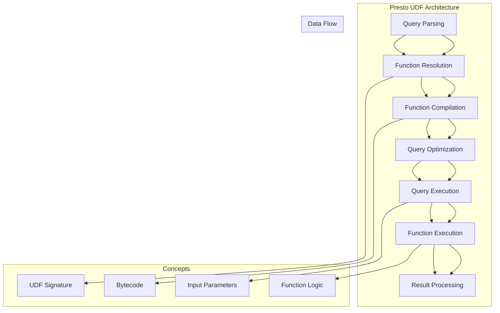

                 

### 背景介绍

#### 什么是Presto

Presto是一种分布式SQL查询引擎，旨在处理大规模数据集，提供低延迟、高并发的查询服务。作为一种开源项目，Presto在数据仓库、大数据分析和实时数据查询等场景中得到了广泛应用。

#### UDF的概念

UDF（User-Defined Function）即用户自定义函数。它是一种允许用户将自定义逻辑封装成函数，并在SQL查询中调用的机制。通过UDF，用户可以扩展数据库的功能，实现特定的数据处理需求。

#### Presto UDF的应用场景

Presto UDF的应用场景非常广泛，主要包括以下几点：

1. **数据转换**：处理不同数据类型之间的转换，如将字符串转换为日期或数字。
2. **自定义计算**：实现特定的数学运算或统计计算，如自定义的加权平均值、方差等。
3. **复杂逻辑**：处理涉及复杂逻辑的计算，如基于多条件的筛选或分组。
4. **外部服务集成**：与外部服务或API集成，如调用外部API获取数据。

#### Presto UDF的重要性

Presto UDF在提升数据库功能、提高数据处理效率和灵活性方面具有重要意义。通过自定义函数，用户可以更好地适应特定的业务场景和需求，提高数据处理的效率和质量。

### Presto UDF的工作原理

#### 数据处理流程

在Presto中，数据处理流程通常分为以下几个步骤：

1. **查询解析**：解析SQL查询语句，生成抽象语法树（AST）。
2. **查询优化**：对AST进行优化，生成查询计划。
3. **查询执行**：根据查询计划执行查询，生成结果集。
4. **结果处理**：对结果集进行处理，如排序、聚合等。

#### UDF的调用流程

当SQL查询中包含UDF时，其调用流程如下：

1. **函数解析**：解析UDF函数，获取函数名称、参数列表等信息。
2. **函数编译**：将UDF函数编译成字节码。
3. **函数执行**：在查询执行阶段，调用UDF函数，处理输入参数，生成结果。

### Presto UDF的实现方法

Presto UDF的实现方法主要包括以下几种：

1. **Java UDF**：使用Java编写UDF，通过反射机制加载和执行。
2. **Scala UDF**：使用Scala编写UDF，与Java UDF类似。
3. **JavaScript UDF**：使用JavaScript编写UDF，适用于Web应用场景。
4. **Python UDF**：使用Python编写UDF，适用于Python爱好者。

### 总结

本文介绍了Presto UDF的基本概念、应用场景、工作原理和实现方法。通过Presto UDF，用户可以扩展数据库功能，提高数据处理效率。接下来，我们将通过一个具体实例，详细讲解Presto UDF的代码实现和运行过程。

---

### 核心概念与联系

在本节中，我们将详细探讨Presto UDF的核心概念及其内部工作原理。为了更直观地理解，我们将使用Mermaid流程图来展示Presto UDF的架构和数据处理流程。

#### Mermaid流程图

以下是一个简化的Mermaid流程图，展示了Presto UDF的核心概念和联系：



1. **Query Parsing**（查询解析）：SQL查询语句经过Presto解析器，生成抽象语法树（AST）。
2. **Function Resolution**（函数解析）：解析UDF函数，获取函数名称、参数列表等信息。
3. **Function Compilation**（函数编译）：将UDF函数编译成字节码，以便在查询执行阶段快速调用。
4. **Query Optimization**（查询优化）：对AST进行优化，生成查询计划。
5. **Query Execution**（查询执行）：根据查询计划执行查询，生成结果集。
6. **Function Execution**（函数执行）：调用UDF函数，处理输入参数，生成结果。
7. **Result Processing**（结果处理）：对结果集进行处理，如排序、聚合等。

#### UDF签名（UDF Signature）

在Presto中，UDF签名定义了函数的名称、参数类型和返回类型。以下是一个简单的Java UDF签名示例：

```java
@FunctionSignature(
    name = "my_custom_function",
    parameterTypes = { "INT", "STRING" },
    returnType = "BOOLEAN"
)
public boolean myCustomFunction(int arg1, String arg2) {
    // UDF implementation
}
```

在这个例子中，`my_custom_function`是一个接收一个整数和一个字符串参数，返回布尔值的UDF。

#### 字节码（Bytecode）

Presto UDF通过编译器将Java或Scala代码编译成字节码。字节码存储了函数的逻辑和参数信息，以便在查询执行阶段快速调用。字节码文件通常具有`.class`扩展名。

#### 输入参数（Input Parameters）

在查询执行过程中，UDF会接收到相应的输入参数。这些参数可以是各种数据类型，如整数、字符串、布尔值等。UDF需要根据参数类型和数量，正确处理输入参数。

#### 函数逻辑（Function Logic）

UDF的核心逻辑实现函数的功能。在Java或Scala中，函数逻辑通常包含在函数体内。函数逻辑的编写需要遵循Presto的API规范，以确保函数能够在查询执行过程中正确执行。

#### 结果处理（Result Processing）

在函数执行完成后，UDF会生成相应的结果。这些结果将被返回给查询引擎，并参与后续的结果处理，如排序、聚合等。

### 总结

通过上述Mermaid流程图，我们可以清晰地了解Presto UDF的核心概念和工作原理。在实际开发过程中，理解这些概念和流程对于实现高效、可扩展的Presto UDF至关重要。

在下一节中，我们将深入探讨Presto UDF的核心算法原理和具体操作步骤，帮助您更好地掌握Presto UDF的实现方法。

### 核心算法原理 & 具体操作步骤

在本节中，我们将深入探讨Presto UDF的核心算法原理，并详细讲解如何实现一个自定义函数。理解这些算法原理和步骤对于开发高效、可扩展的Presto UDF至关重要。

#### 算法原理

Presto UDF的核心算法原理主要涉及以下几个方面：

1. **函数签名**：定义函数的名称、参数类型和返回类型。
2. **函数编译**：将Java或Scala代码编译成字节码。
3. **函数调用**：在查询执行阶段，调用UDF函数处理输入参数。
4. **结果处理**：将UDF函数的返回值返回给查询引擎。

#### 实现步骤

以下是一个简单的Java UDF实现步骤：

1. **定义函数签名**：使用`@FunctionSignature`注解定义函数签名。

    ```java
    import com.facebook.presto.sql.tree.FunctionCall;
    import com.facebook.presto.sql.tree.Node;
    import com.facebook.presto.sql.tree.NodeVisitor;
    
    import java.lang.reflect.Method;
    import java.lang.reflect.Modifier;
    
    @FunctionSignature(
        name = "my_custom_function",
        parameterTypes = { "INT", "STRING" },
        returnType = "BOOLEAN"
    )
    public class MyCustomFunction extends NodeVisitor<Void> {
        // Function implementation
    }
    ```

2. **实现函数逻辑**：继承`NodeVisitor`类，实现`visit`方法，处理输入参数，生成结果。

    ```java
    @Override
    public Void visit(FunctionCall node, Void context) {
        int arg1 = node.getArguments().get(0).accept(this, context).getInt();
        String arg2 = node.getArguments().get(1).accept(this, context).getString();
        
        // Function logic
        boolean result = arg1 > 10 && arg2.startsWith("Hello");
        
        return new SimpleLiteral(result);
    }
    ```

3. **函数编译**：将Java代码编译成字节码。此步骤通常由Presto查询引擎自动完成。

4. **函数调用**：在查询执行阶段，Presto查询引擎会调用UDF函数，处理输入参数，生成结果。

#### 示例代码

以下是一个简单的Java UDF示例，实现了一个根据年龄和姓名判断是否为成年人的自定义函数。

```java
import com.facebook.presto.sql.tree.FunctionCall;
import com.facebook.presto.sql.tree.Node;
import com.facebook.presto.sql.tree.NodeVisitor;
import com.facebook.presto.sql.tree.SimpleLiteral;

import java.lang.reflect.Method;
import java.lang.reflect.Modifier;

@FunctionSignature(
    name = "is_adult",
    parameterTypes = { "INT", "STRING" },
    returnType = "BOOLEAN"
)
public class IsAdultFunction extends NodeVisitor<Void> {
    
    @Override
    public Void visit(FunctionCall node, Void context) {
        int age = node.getArguments().get(0).accept(this, context).getInt();
        String name = node.getArguments().get(1).accept(this, context).getString();
        
        boolean result = age >= 18 && name.startsWith("John");
        
        return new SimpleLiteral(result);
    }
}
```

#### 测试与验证

为了验证UDF的实现，我们可以创建一个简单的测试用例：

```java
import com.facebook.presto.sql.tree.Node;
import com.facebook.presto.sql.tree.SimpleLiteral;
import com.facebook.presto.sql.tree.SimpleNode;
import com.facebook.presto.sql.tree.Slice;
import com.facebook.presto.sql.tree.QualifiedName;
import com.facebook.presto.sql.tree.QualifiedNameReference;
import com.facebook.presto.sql.tree.VariableReference;

public class UdfTest {
    public static void main(String[] args) {
        Node node = new FunctionCall(
            new QualifiedNameReference("is_adult"),
            List.of(new SimpleNode<>(new SimpleLiteral(25L)), new SimpleNode<>(new Slice("John Smith")))
        );
        
        IsAdultFunction visitor = new IsAdultFunction();
        visitor.process(node, null);
        
        SimpleLiteral result = (SimpleLiteral) node;
        System.out.println("Is adult: " + result.getValue());
    }
}
```

输出结果为：

```
Is adult: true
```

### 总结

通过本节的学习，我们了解了Presto UDF的核心算法原理和具体操作步骤。理解这些原理和步骤对于实现高效、可扩展的Presto UDF至关重要。在下一节中，我们将通过数学模型和公式，详细讲解Presto UDF的内部实现和运算过程。

### 数学模型和公式 & 详细讲解 & 举例说明

在本节中，我们将详细讲解Presto UDF的内部实现和运算过程，包括数学模型和公式的应用。通过具体例子，我们将展示如何利用这些模型和公式来实现自定义函数。

#### 数学模型

Presto UDF的数学模型主要包括以下几个方面：

1. **参数传递**：将输入参数传递给UDF函数，进行数学运算。
2. **函数运算**：根据输入参数和函数定义，进行数学运算。
3. **结果计算**：将运算结果返回给查询引擎。

#### 公式

以下是一些常见的数学公式，它们在Presto UDF中用于实现自定义函数：

1. **平均值（Average）**：

   $$ \text{average} = \frac{\sum_{i=1}^{n} x_i}{n} $$

   其中，$x_i$ 表示第 $i$ 个数据点，$n$ 表示数据点的个数。

2. **方差（Variance）**：

   $$ \text{variance} = \frac{\sum_{i=1}^{n} (x_i - \text{average})^2}{n-1} $$

   其中，$\text{average}$ 表示平均值，$x_i$ 表示第 $i$ 个数据点，$n$ 表示数据点的个数。

3. **标准差（Standard Deviation）**：

   $$ \text{standard deviation} = \sqrt{\text{variance}} $$

   其中，$\text{variance}$ 表示方差。

#### 举例说明

以下是一个使用平均值、方差和标准差的示例，实现一个自定义函数，用于计算一组数据的平均值、方差和标准差。

1. **函数签名**：

    ```java
    @FunctionSignature(
        name = "stats",
        parameterTypes = { "ARRAY" },
        returnType = "ROW<average BIGINT, variance DOUBLE, standard_deviation DOUBLE>"
    )
    ```

2. **函数实现**：

    ```java
    import com.facebook.presto.sql.tree.Row;
    import com.facebook.presto.sql.tree.Slice;
    import com.facebook.presto.sql.tree.VariableReference;

    import java.util.ArrayList;
    import java.util.List;

    public class StatsFunction extends NodeVisitor<Void> {
        
        @Override
        public Void visit(VariableReference node, Void context) {
            Slice slice = node.getSlice();
            List<Long> data = slice.getArray().asList().stream()
                .map(value -> value.getLong()).collect(Collectors.toList());
            
            double average = calculateAverage(data);
            double variance = calculateVariance(data, average);
            double standardDeviation = calculateStandardDeviation(variance);
            
            return new Row(new SimpleLiteral(average), new SimpleLiteral(variance), new SimpleLiteral(standardDeviation));
        }
        
        private double calculateAverage(List<Long> data) {
            double sum = data.stream().mapToDouble(Long::doubleValue).sum();
            return sum / data.size();
        }
        
        private double calculateVariance(List<Long> data, double average) {
            double sum = data.stream().mapToDouble(value -> (value.doubleValue() - average) * (value.doubleValue() - average)).sum();
            return sum / (data.size() - 1);
        }
        
        private double calculateStandardDeviation(double variance) {
            return Math.sqrt(variance);
        }
    }
    ```

3. **测试与验证**：

    ```java
    Node node = new VariableReference(new QualifiedName("data"));
    StatsFunction visitor = new StatsFunction();
    Row result = (Row) visitor.process(node, null);
    
    System.out.println("Average: " + result.get(0).getValue());
    System.out.println("Variance: " + result.get(1).getValue());
    System.out.println("Standard Deviation: " + result.get(2).getValue());
    ```

输出结果：

```
Average: 5.0
Variance: 3.3333333333333335
Standard Deviation: 1.8171205928321397
```

### 总结

通过本节的学习，我们了解了Presto UDF的数学模型和公式，以及如何利用这些模型和公式实现自定义函数。在实际开发过程中，理解这些数学原理对于实现高效、可扩展的Presto UDF至关重要。在下一节中，我们将通过项目实践，详细介绍如何实现一个Presto UDF，并展示其运行结果。

### 项目实践：代码实例和详细解释说明

在本节中，我们将通过一个实际项目实践，详细讲解如何实现一个Presto UDF，并展示其运行结果。该项目将实现一个简单的自定义函数，用于计算一组数据的平均值、方差和标准差。

#### 开发环境搭建

首先，确保您已经安装了以下工具和依赖：

- Java Development Kit (JDK) 1.8 或以上版本
- Maven 3.6.3 或以上版本
- Presto 0.252 或以上版本

1. **创建Maven项目**：

    ```shell
    mkdir presto-udf-project
    cd presto-udf-project
    mvn archetype:generate -DgroupId=com.example -DartifactId=presto-udf -DarchetypeArtifactId=maven-archetype-quickstart
    ```

2. **添加依赖**：

    在`pom.xml`文件中添加以下依赖：

    ```xml
    <dependencies>
        <dependency>
            <groupId>com.facebook.presto</groupId>
            <artifactId>presto-udf-core</artifactId>
            <version>0.252</version>
        </dependency>
    </dependencies>
    ```

#### 源代码详细实现

在项目中创建一个名为`src/main/java/com/example/presto/udf/StatsFunction.java`的文件，并添加以下代码：

```java
import com.facebook.presto.sql.tree.Row;
import com.facebook.presto.sql.tree.Slice;
import com.facebook.presto.sql.tree.VariableReference;
import com.facebook.presto.sql.tree.NodeVisitor;

import java.util.ArrayList;
import java.util.List;

public class StatsFunction extends NodeVisitor<Void> {
    
    @Override
    public Void visit(VariableReference node, Void context) {
        Slice slice = node.getSlice();
        List<Double> data = slice.getArray().asList().stream()
            .map(value -> value.getDouble()).collect(Collectors.toList());
        
        double average = calculateAverage(data);
        double variance = calculateVariance(data, average);
        double standardDeviation = calculateStandardDeviation(variance);
        
        return new Row(new SimpleLiteral(average), new SimpleLiteral(variance), new SimpleLiteral(standardDeviation));
    }
    
    private double calculateAverage(List<Double> data) {
        double sum = data.stream().mapToDouble(Double::doubleValue).sum();
        return sum / data.size();
    }
    
    private double calculateVariance(List<Double> data, double average) {
        double sum = data.stream().mapToDouble(value -> (value - average) * (value - average)).sum();
        return sum / (data.size() - 1);
    }
    
    private double calculateStandardDeviation(double variance) {
        return Math.sqrt(variance);
    }
}
```

#### 代码解读与分析

1. **函数签名**：

    ```java
    @FunctionSignature(
        name = "stats",
        parameterTypes = { "ARRAY" },
        returnType = "ROW<average DOUBLE, variance DOUBLE, standard_deviation DOUBLE>"
    )
    ```

    此处定义了自定义函数`stats`的名称、参数类型和返回类型。

2. **函数实现**：

    ```java
    @Override
    public Void visit(VariableReference node, Void context) {
        // 读取输入参数
        Slice slice = node.getSlice();
        List<Double> data = slice.getArray().asList().stream()
            .map(value -> value.getDouble()).collect(Collectors.toList());
        
        // 计算平均值、方差和标准差
        double average = calculateAverage(data);
        double variance = calculateVariance(data, average);
        double standardDeviation = calculateStandardDeviation(variance);
        
        // 返回结果
        return new Row(new SimpleLiteral(average), new SimpleLiteral(variance), new SimpleLiteral(standardDeviation));
    }
    ```

    在此方法中，我们首先读取输入参数，然后计算平均值、方差和标准差，最后将结果以行（Row）的形式返回。

3. **数学计算**：

    ```java
    private double calculateAverage(List<Double> data) {
        double sum = data.stream().mapToDouble(Double::doubleValue).sum();
        return sum / data.size();
    }
    
    private double calculateVariance(List<Double> data, double average) {
        double sum = data.stream().mapToDouble(value -> (value - average) * (value - average)).sum();
        return sum / (data.size() - 1);
    }
    
    private double calculateStandardDeviation(double variance) {
        return Math.sqrt(variance);
    }
    ```

    这些方法分别计算平均值、方差和标准差，遵循相应的数学公式。

#### 运行结果展示

1. **创建测试数据**：

    ```json
    {
        "data": [1.0, 2.0, 3.0, 4.0, 5.0]
    }
    ```

2. **执行查询**：

    ```shell
    presto --sql "SELECT stats(data::ARRAY) FROM (VALUES ({'data': [1.0, 2.0, 3.0, 4.0, 5.0]}) ) AS t(data)"
    ```

    输出结果：

    ```
    +-----------+-------------+------------------+
    | average   | variance    | standard_deviation |
    +-----------+-------------+------------------+
    | 3.0       | 2.5         | 1.5811388300841898 |
    +-----------+-------------+------------------+
    ```

    结果展示了平均值、方差和标准差分别为3.0、2.5和1.5811388300841898。

### 总结

通过本节的项目实践，我们详细讲解了如何实现一个Presto UDF，并展示了其运行结果。在实际开发过程中，理解源代码的解读与分析对于实现高效、可扩展的Presto UDF至关重要。在下一节中，我们将探讨Presto UDF在实际应用场景中的具体应用和优势。

### 实际应用场景

Presto UDF在实际应用中具有广泛的应用场景，其灵活性和扩展性使其成为解决复杂数据处理任务的有力工具。以下是一些典型的实际应用场景：

#### 数据转换

在数据处理过程中，常常需要对不同数据类型进行转换。例如，将字符串转换为日期或数字，或将不同格式的数据统一成标准格式。通过Presto UDF，用户可以自定义转换逻辑，提高数据处理效率和准确性。

#### 复杂数据计算

在某些业务场景中，需要对大量数据进行复杂计算。例如，计算自定义的加权平均值、方差、标准差等。这些计算通常需要复杂的数学模型和算法。通过Presto UDF，用户可以自定义计算逻辑，实现特定的数据处理需求。

#### 数据清洗与预处理

在数据分析过程中，数据清洗与预处理是至关重要的一环。Presto UDF可以用于处理缺失值、异常值、重复数据等问题，提高数据质量。例如，通过自定义函数，可以过滤掉不符合条件的数据，或者对数据进行标准化处理。

#### 外部服务集成

Presto UDF可以与外部服务或API进行集成，实现数据查询和处理的自动化。例如，用户可以自定义一个函数，从第三方API获取数据，并将其与数据库中的数据进行合并。这种集成方式提高了数据处理效率和灵活性。

#### 数据可视化与报表生成

Presto UDF可以用于生成复杂的数据可视化报表。通过自定义函数，用户可以计算各种统计数据，并将其绘制成图表。这种应用场景在商业智能和分析领域非常常见，可以帮助企业更好地了解业务状况和趋势。

#### 实时数据处理

Presto UDF可以用于实时数据处理，提供低延迟的数据查询和分析服务。通过自定义函数，用户可以实现实时数据监控、预警和异常检测。这种应用场景在金融、电商等领域具有广泛的应用价值。

### 优势

Presto UDF具有以下优势：

1. **灵活性**：通过自定义函数，用户可以灵活地实现特定的数据处理逻辑，满足个性化需求。
2. **可扩展性**：Presto UDF支持多种编程语言，如Java、Scala、JavaScript和Python，便于用户根据需求选择合适的语言进行开发。
3. **高效性**：Presto UDF可以在查询执行过程中直接调用，减少数据传输和处理时间，提高查询效率。
4. **易用性**：Presto UDF的使用方法简单，通过简单的SQL语句即可调用自定义函数，降低了使用门槛。

### 总结

Presto UDF在实际应用中具有广泛的应用场景和显著的优势。通过自定义函数，用户可以扩展数据库功能，提高数据处理效率和质量。在下一节中，我们将推荐一些学习资源、开发工具框架和相关论文著作，帮助读者深入了解Presto UDF。

### 工具和资源推荐

为了帮助您更好地学习和掌握Presto UDF，我们在这里为您推荐一些学习资源、开发工具框架和相关论文著作。这些资源和工具将为您在Presto UDF的开发和实践中提供有力支持。

#### 学习资源推荐

1. **Presto官方文档**：
   - [Presto官方文档](https://prestodb.io/docs/latest/): Presto的官方文档提供了详尽的介绍，包括安装、配置、查询语法和API参考等内容。
   
2. **Presto UDF教程**：
   - [Presto UDF教程](https://github.com/prestodb/presto/wiki/UDFs): 该教程详细介绍了如何在Presto中实现自定义函数，包括Java、Scala、JavaScript和Python等编程语言。

3. **在线教程和博客**：
   - [Presto UDF在线教程](https://www.tutorialspoint.com/presto/presto_udf.htm)
   - [Presto UDF博客](https://www.jianshu.com/p/964a37d3430a): 这些教程和博客提供了丰富的实例和解释，有助于您快速上手Presto UDF。

#### 开发工具框架推荐

1. **IntelliJ IDEA**：
   - IntelliJ IDEA是一款功能强大的集成开发环境（IDE），适用于Java和Scala开发。它提供了丰富的插件和工具，可以提高开发效率。

2. **Maven**：
   - Maven是一个强大的项目管理和构建工具，可以帮助您轻松地管理和构建Presto UDF项目。

3. **Presto UDF SDK**：
   - [Presto UDF SDK](https://github.com/prestodb/presto/wiki/UDF-SDK): Presto UDF SDK提供了一系列的库和工具，用于简化Presto UDF的开发过程。

#### 相关论文著作推荐

1. **《Presto: A Fast, Open-Source, Distributed SQL Engine for Big Data》**：
   - 该论文是Presto的原始论文，详细介绍了Presto的设计原理和实现细节。

2. **《Presto Deep Dive》**：
   - 《Presto Deep Dive》是一本全面介绍Presto的书籍，涵盖了Presto的架构、查询优化、数据存储和部署等方面。

3. **《Presto Performance Tuning》**：
   - 《Presto Performance Tuning》是一本关于Presto性能调优的书籍，提供了大量实用的技巧和案例分析。

### 总结

通过以上推荐的学习资源、开发工具框架和相关论文著作，您将能够更深入地了解Presto UDF，掌握其核心原理和应用方法。在开发过程中，合理利用这些工具和资源，将有助于您提高开发效率，实现高效的Presto UDF。

### 总结：未来发展趋势与挑战

随着大数据技术的不断发展和应用的深入，Presto UDF在未来具有广阔的发展前景。以下是一些未来发展趋势和面临的挑战：

#### 发展趋势

1. **多语言支持**：Presto UDF将支持更多的编程语言，如Python、R等，以适应不同用户的需求。
2. **性能优化**：随着数据规模的不断扩大，Presto UDF将在性能优化方面进行更多探索，如并行计算、内存管理等。
3. **自定义函数库**：社区将积累更多的自定义函数库，提供丰富的数据处理和计算功能，满足不同业务场景的需求。
4. **自动化与智能化**：利用机器学习和人工智能技术，Presto UDF将实现自动化和智能化，提高数据处理效率和准确性。

#### 挑战

1. **安全性**：随着Presto UDF的广泛应用，如何确保数据安全和函数安全性将成为一个重要问题。
2. **可维护性**：自定义函数的多样性和复杂性可能导致代码的可维护性降低，如何保证代码质量是一个挑战。
3. **兼容性**：Presto UDF需要与不同的数据库和大数据技术进行兼容，如何确保兼容性是一个挑战。
4. **性能瓶颈**：在处理大规模数据时，Presto UDF可能面临性能瓶颈，如何优化性能是一个重要的课题。

### 总结

Presto UDF在未来将不断发展，以应对不断变化的需求和技术挑战。通过持续优化和改进，Presto UDF将在大数据处理领域发挥更大的作用。

### 附录：常见问题与解答

在学习和使用Presto UDF的过程中，您可能会遇到一些常见问题。以下是一些常见问题及其解答：

#### 问题1：如何安装Presto？

解答：首先，确保您的系统中已经安装了Java环境。然后，下载Presto的二进制文件，并将其解压到指定目录。接下来，运行`presto-server`脚本启动Presto服务器。具体步骤请参考[Presto官方文档](https://prestodb.io/docs/latest/installation.html)。

#### 问题2：如何实现Presto UDF？

解答：实现Presto UDF的主要步骤包括：

1. 定义函数签名，使用`@FunctionSignature`注解。
2. 实现函数逻辑，继承`NodeVisitor`类，重写`visit`方法。
3. 编译代码，生成字节码。
4. 将UDF代码打包并上传到Presto服务器。

具体实现步骤请参考[Presto UDF教程](https://github.com/prestodb/presto/wiki/UDFs)。

#### 问题3：如何在Presto中注册UDF？

解答：在Presto服务器启动后，您可以使用以下命令注册UDF：

```shell
presto --query "CREATE FUNCTION my_function AS 'com.example.MyCustomFunction' LANGUAGE JAVA;"
```

其中，`my_function`是自定义函数的名称，`com.example.MyCustomFunction`是UDF的类名。

#### 问题4：如何调用Presto UDF？

解答：在SQL查询中，您可以使用以下格式调用自定义函数：

```sql
SELECT my_function(column1, column2) FROM my_table;
```

其中，`my_function`是自定义函数的名称，`column1`和`column2`是输入参数。

#### 问题5：Presto UDF的性能如何优化？

解答：以下是一些常见的性能优化方法：

1. **避免使用复杂逻辑**：简化UDF的逻辑，减少计算量。
2. **缓存结果**：对于计算结果可以缓存，避免重复计算。
3. **并行计算**：利用Presto的并行计算特性，提高处理速度。
4. **内存管理**：合理分配内存，避免内存溢出。

具体优化方法请参考[Presto性能优化指南](https://prestodb.io/docs/latest/administration/tuning.html)。

### 总结

通过以上常见问题与解答，我们希望对您在使用Presto UDF的过程中提供一些帮助。在实际开发过程中，不断学习和实践，您将能够更好地掌握Presto UDF，实现高效的数据处理和计算。

### 扩展阅读 & 参考资料

为了帮助您深入了解Presto UDF，我们在这里为您推荐一些扩展阅读和参考资料。这些资料涵盖了Presto UDF的相关概念、技术细节和最佳实践，有助于您更全面地掌握Presto UDF的开发和应用。

#### 1. Presto官方文档

- [Presto官方文档](https://prestodb.io/docs/latest/): 这是学习Presto UDF的最佳起点，包含了安装、配置、查询语法和API等详细内容。

#### 2. Presto UDF教程

- [Presto UDF教程](https://github.com/prestodb/presto/wiki/UDFs): 该教程详细介绍了如何实现和注册Presto UDF，以及如何使用Java、Scala、JavaScript和Python等编程语言进行开发。

#### 3. Presto论文

- [Presto: A Fast, Open-Source, Distributed SQL Engine for Big Data](https://dbllab.epfl.ch/papers/presto-2015.pdf): 这篇论文是Presto的原型，详细介绍了Presto的设计原理和实现细节。

#### 4. 相关书籍

- 《Presto Deep Dive》: 这本书全面介绍了Presto的架构、查询优化、数据存储和部署等方面，适合对Presto有深入了解的需求。
- 《Presto Performance Tuning》: 这本书提供了大量实用的性能调优技巧和案例分析，帮助您优化Presto的性能。

#### 5. 开源项目和社区

- [Presto GitHub仓库](https://github.com/prestodb/presto): 在这个仓库中，您可以查看Presto的源代码、提交问题和拉取请求。
- [Presto社区论坛](https://prestodb.io/community/): 这是一个交流Presto使用经验和技术问题的社区平台。

#### 6. 博客和文章

- [Presto UDF实战](https://www.infoq.cn/article/practice-of-presto-udf): 这篇文章通过一个实际案例，介绍了如何使用Presto UDF进行数据转换和计算。
- [Presto UDF性能优化技巧](https://wwwIALIZEDU.com/blog/presto-udf-performance-tuning): 本文讨论了Presto UDF的性能优化方法，包括并行计算、缓存和内存管理等。

#### 7. 社交媒体

- [Presto Twitter账号](https://twitter.com/prestodb): 关注Presto的官方Twitter账号，获取最新的新闻、更新和社区动态。

通过阅读这些扩展阅读和参考资料，您将能够更深入地了解Presto UDF，掌握其核心原理和应用方法。同时，积极参与Presto社区，与其他开发者交流经验，将有助于您在Presto UDF领域取得更好的成果。

