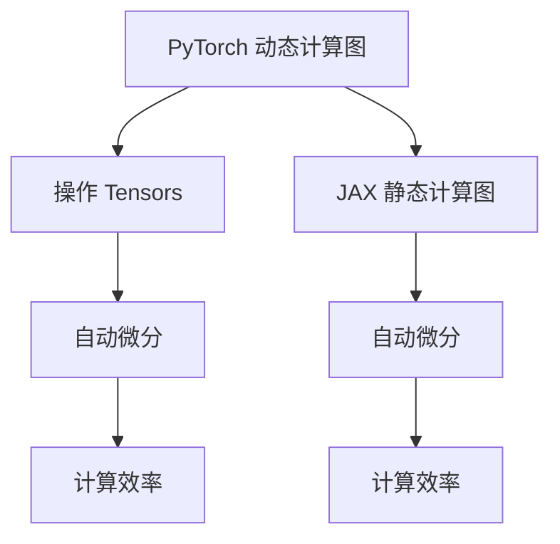

                 

### 背景介绍

在当今快速发展的技术时代，深度学习已经成为推动计算机视觉、自然语言处理、语音识别等多个领域进步的核心驱动力。为了满足深度学习的需求，众多深度学习框架应运而生，PyTorch 和 JAX 就是其中两个备受瞩目的框架。它们各自拥有独特的优势和特点，使得研究人员和开发者可以根据不同的需求选择合适的工具。

#### PyTorch

PyTorch 是一个开源的深度学习框架，由 Facebook AI 研究团队开发，旨在为研究人员和开发者提供一个简单且灵活的平台来进行深度学习模型的开发、训练和推理。PyTorch 的核心特点是其动态计算图（dynamic computation graph）和基于 Tensors 的数据结构。动态计算图使得 PyTorch 能够在训练过程中提供更高的灵活性和可操作性，而 Tensors 则使得数值计算更加高效。

自推出以来，PyTorch 因其简洁的 API 和直观的操作界面，迅速获得了广泛的关注和认可。许多知名的科技公司和研究机构，如 NVIDIA、谷歌、微软和 OpenAI，都已经将 PyTorch 作为其深度学习项目的主要工具。

#### JAX

JAX 是由谷歌开发的一个开源深度学习框架，旨在提供数值计算的高效实现和自动微分能力。JAX 的核心优势在于其基于 Python 的定义式编程（definitional programming）和自动微分（automatic differentiation）。这使得 JAX 在处理复杂数值计算和梯度计算时，能够提供显著的性能提升和灵活性。

与 PyTorch 相比，JAX 更加注重计算的高效性和优化。它利用了谷歌的 TensorFlow 背后的强大计算引擎，使得 JAX 在大规模数据处理和分布式训练方面表现出色。此外，JAX 还支持 JAX-lambda，一个用于分布式计算的高级 API，进一步提升了其在并行和分布式环境中的性能。

#### 选择理由

选择 PyTorch 和 JAX 进行对比，主要基于以下几点原因：

1. **代表性**：PyTorch 和 JAX 分别代表了深度学习框架的两个不同方向。一个是注重灵活性和易用性，另一个是注重计算效率和优化。

2. **广泛应用**：这两个框架在学术界和工业界都拥有广泛的用户基础，因此它们的对比有助于揭示各自的优势和局限性。

3. **发展趋势**：随着深度学习的不断发展和应用领域的扩展，了解不同框架的特性和适用场景，对于选择合适的工具具有重要意义。

接下来的部分，我们将深入探讨 PyTorch 和 JAX 的核心概念、原理和具体操作步骤，帮助读者更全面地了解这两个框架。首先，让我们从 PyTorch 的动态计算图和 Tensors 数据结构开始，逐步分析其核心算法原理。

## 2. 核心概念与联系

### 动态计算图与静态计算图

动态计算图和静态计算图是深度学习框架的两种基本计算模式。动态计算图允许在运行时构建和修改计算图，这使得模型开发过程更加灵活和直观。而静态计算图则在编译时确定计算图的结构，从而提供了更高的计算效率。

**PyTorch 的动态计算图**

PyTorch 的核心特点是其动态计算图。在 PyTorch 中，计算图是通过操作 Tensors 来构建的。Tensors 是 PyTorch 的基本数据结构，类似于 NumPy 的 ndarrays，但具有自动微分等高级功能。

例如，我们可以定义一个简单的线性模型：

```python
import torch
import torch.nn as nn

x = torch.tensor([[1, 2], [3, 4]], dtype=torch.float32)
weights = torch.tensor([[0.1, 0.2], [0.3, 0.4]], dtype=torch.float32)
bias = torch.tensor([0.5, 0.6], dtype=torch.float32)

output = torch.matmul(x, weights) + bias
```

在上面的代码中，`torch.tensor` 用于创建 Tensors，`torch.matmul` 用于矩阵乘法，`+` 用于加法操作。整个计算过程构成了一个动态计算图。

**JAX 的静态计算图**

与 PyTorch 不同，JAX 使用静态计算图来进行数值计算和自动微分。静态计算图在编译时就已经确定，这使得计算过程更加高效和可优化。

在 JAX 中，我们可以使用 `jax.jit` 函数将一个函数编译成静态计算图。例如：

```python
import jax
import jax.numpy as np

x = np.array([[1, 2], [3, 4]], dtype=np.float32)
weights = np.array([[0.1, 0.2], [0.3, 0.4]], dtype=np.float32)
bias = np.array([0.5, 0.6], dtype=np.float32)

def linear(x, weights, bias):
    return np.matmul(x, weights) + bias

jitted_linear = jax.jit(linear)
```

在上面的代码中，`jax.jit` 函数将 `linear` 函数编译成一个静态计算图。这使得函数在每次调用时都能保持高效的计算性能。

### Mermaid 流程图

为了更直观地展示 PyTorch 和 JAX 的计算图结构，我们使用 Mermaid 流程图来描述这两个框架的核心算法原理。



在这个流程图中，我们首先引入了 PyTorch 的动态计算图，并展示了如何通过操作 Tensors 来构建计算图。然后，我们引入了 JAX 的静态计算图，并说明了如何通过 `jax.jit` 函数编译函数为静态计算图。最后，我们比较了 PyTorch 和 JAX 的自动微分能力和计算效率。

### 动态计算图与静态计算图的联系

动态计算图和静态计算图在深度学习框架中扮演着重要角色。它们各自的优势和特点，使得不同场景下选择合适的计算模式成为可能。

- **动态计算图**：适用于模型开发和调试阶段，提供了更高的灵活性和可操作性。
- **静态计算图**：适用于大规模数据处理和推理阶段，提供了更高的计算效率和优化能力。

在实际应用中，我们可以根据具体需求，灵活选择动态计算图或静态计算图。例如，在模型开发阶段使用 PyTorch 的动态计算图，而在模型部署阶段使用 JAX 的静态计算图。

在接下来的部分，我们将深入探讨 PyTorch 和 JAX 的核心算法原理和具体操作步骤，帮助读者更好地理解和应用这两个框架。

### 3. 核心算法原理 & 具体操作步骤

在这一部分，我们将详细分析 PyTorch 和 JAX 的核心算法原理，并介绍具体的操作步骤，以便读者能够更好地理解这两个深度学习框架。

#### PyTorch 的核心算法原理

PyTorch 的核心算法原理基于动态计算图和 Tensors。动态计算图允许在运行时构建和修改计算图，使得模型开发过程更加灵活和直观。Tensors 是 PyTorch 的基本数据结构，类似于 NumPy 的 ndarrays，但具有自动微分等高级功能。

1. **动态计算图构建**

   在 PyTorch 中，动态计算图的构建是通过操作 Tensors 来实现的。以下是一个简单的线性模型的构建示例：

   ```python
   import torch
   import torch.nn as nn

   # 创建输入 Tensor
   x = torch.tensor([[1, 2], [3, 4]], dtype=torch.float32)

   # 创建权重和偏置 Tensor
   weights = torch.tensor([[0.1, 0.2], [0.3, 0.4]], dtype=torch.float32)
   bias = torch.tensor([0.5, 0.6], dtype=torch.float32)

   # 构建计算图
   output = x @ weights + bias
   ```

   在这个例子中，我们首先创建了一个输入 Tensor `x`，然后创建了权重和偏置 Tensor `weights` 和 `bias`。接着，我们通过矩阵乘法 `@` 和加法操作构建了一个动态计算图，并计算了输出。

2. **自动微分**

   PyTorch 的另一个核心特点是自动微分。自动微分使得我们可以轻松计算模型参数的梯度，从而进行优化和训练。以下是一个简单的自动微分示例：

   ```python
   # 计算梯度
   output_grad = torch.autograd.grad(output, [weights, bias], create_graph=True)

   # 打印梯度
   print(output_grad)
   ```

   在这个例子中，我们使用了 `torch.autograd.grad` 函数来计算输出关于权重和偏置的梯度。`create_graph=True` 参数确保了计算过程中会构建一个完整的计算图，以便后续的梯度计算。

#### JAX 的核心算法原理

JAX 的核心算法原理基于静态计算图和定义式编程。静态计算图在编译时就已经确定，提供了更高的计算效率和优化能力。定义式编程则使得 JAX 能够在数值计算和自动微分方面表现出色。

1. **静态计算图构建**

   在 JAX 中，静态计算图的构建是通过使用 `jax.jit` 函数将函数编译成静态计算图。以下是一个简单的线性模型的构建示例：

   ```python
   import jax
   import jax.numpy as np

   # 创建输入 numpy 数组
   x = np.array([[1, 2], [3, 4]], dtype=np.float32)

   # 创建权重和偏置 numpy 数组
   weights = np.array([[0.1, 0.2], [0.3, 0.4]], dtype=np.float32)
   bias = np.array([0.5, 0.6], dtype=np.float32)

   # 构建计算图
   def linear(x, weights, bias):
       return np.dot(x, weights) + bias

   jitted_linear = jax.jit(linear)
   ```

   在这个例子中，我们首先创建了一个输入 numpy 数组 `x`，然后创建了权重和偏置 numpy 数组 `weights` 和 `bias`。接着，我们使用 `jax.jit` 函数将 `linear` 函数编译成一个静态计算图。

2. **自动微分**

   JAX 的自动微分功能通过 `jax.jit` 函数提供。以下是一个简单的自动微分示例：

   ```python
   # 计算梯度
   def gradient(x):
       return jax.grad(linear)(x, weights, bias)

   # 打印梯度
   print(gradient(x))
   ```

   在这个例子中，我们定义了一个 `gradient` 函数，它使用 `jax.grad` 函数计算输出关于输入的梯度。`jax.grad` 函数返回一个梯度函数，我们可以将其应用于输入数组 `x` 来计算梯度。

#### 操作步骤对比

以下是 PyTorch 和 JAX 的核心算法原理和操作步骤的对比：

| 对比项 | PyTorch | JAX |
| --- | --- | --- |
| 动态计算图 | 是 | 否 |
| 自动微分 | 是 | 是 |
| 编译效率 | 低 | 高 |
| 易用性 | 高 | 中 |
| 适用场景 | 模型开发与调试 | 大规模数据处理与推理 |

通过上述对比，我们可以看到 PyTorch 和 JAX 在核心算法原理和操作步骤上存在一些显著差异。PyTorch 更加注重模型开发的灵活性和易用性，而 JAX 更加注重计算效率和优化能力。

在接下来的部分，我们将深入探讨 PyTorch 和 JAX 的数学模型和公式，并详细讲解其实现原理。

### 4. 数学模型和公式 & 详细讲解 & 举例说明

在深度学习框架中，数学模型和公式是实现算法核心的基础。本节将详细讲解 PyTorch 和 JAX 的数学模型和公式，并举例说明其实现原理。

#### PyTorch 的数学模型

1. **动态计算图**

   PyTorch 的动态计算图由节点和边组成，节点表示操作，边表示数据流。在动态计算图中，操作通过 Tensors 进行表示，Tensors 是 PyTorch 的基本数据结构，具有多维数组的特点。以下是一个简单的线性模型的数学表示：

   $$y = x \cdot W + b$$

   其中，$y$ 是输出，$x$ 是输入，$W$ 是权重，$b$ 是偏置。

2. **自动微分**

   自动微分的目的是计算模型参数的梯度，以便进行优化。在 PyTorch 中，自动微分通过构建计算图来实现。以下是一个简单的线性模型的梯度计算：

   $$\frac{\partial y}{\partial x} = W$$
   $$\frac{\partial y}{\partial W} = x$$
   $$\frac{\partial y}{\partial b} = 1$$

   这些公式表示了输出关于输入、权重和偏置的梯度。

#### JAX 的数学模型

1. **静态计算图**

   JAX 的静态计算图在编译时就已经确定，提供了更高的计算效率和优化能力。以下是一个简单的线性模型的数学表示：

   $$y = x \cdot W + b$$

   其中，$y$ 是输出，$x$ 是输入，$W$ 是权重，$b$ 是偏置。

2. **自动微分**

   JAX 的自动微分通过定义式编程实现，以下是一个简单的线性模型的梯度计算：

   $$\frac{\partial y}{\partial x} = W$$
   $$\frac{\partial y}{\partial W} = x$$
   $$\frac{\partial y}{\partial b} = 1$$

   这些公式表示了输出关于输入、权重和偏置的梯度。

#### 举例说明

为了更好地理解 PyTorch 和 JAX 的数学模型和公式，我们通过具体的代码示例来展示它们的实现原理。

1. **PyTorch 示例**

   ```python
   import torch
   import torch.nn as nn

   # 创建输入 Tensor
   x = torch.tensor([[1, 2], [3, 4]], dtype=torch.float32)

   # 创建权重和偏置 Tensor
   weights = torch.tensor([[0.1, 0.2], [0.3, 0.4]], dtype=torch.float32)
   bias = torch.tensor([0.5, 0.6], dtype=torch.float32)

   # 计算输出
   output = x @ weights + bias

   # 计算梯度
   output_grad = torch.autograd.grad(output, [weights, bias], create_graph=True)

   print("输出:", output)
   print("梯度:", output_grad)
   ```

   在这个示例中，我们首先创建了输入 Tensor `x`，然后创建了权重和偏置 Tensor `weights` 和 `bias`。接着，我们计算了输出，并使用 `torch.autograd.grad` 函数计算了输出关于权重和偏置的梯度。

2. **JAX 示例**

   ```python
   import jax
   import jax.numpy as np

   # 创建输入 numpy 数组
   x = np.array([[1, 2], [3, 4]], dtype=np.float32)

   # 创建权重和偏置 numpy 数组
   weights = np.array([[0.1, 0.2], [0.3, 0.4]], dtype=np.float32)
   bias = np.array([0.5, 0.6], dtype=np.float32)

   # 定义线性函数
   def linear(x, weights, bias):
       return np.dot(x, weights) + bias

   # 编译线性函数为静态计算图
   jitted_linear = jax.jit(linear)

   # 计算输出
   output = jitted_linear(x, weights, bias)

   # 计算梯度
   gradient = jax.grad(linear)(x, weights, bias)

   print("输出:", output)
   print("梯度:", gradient)
   ```

   在这个示例中，我们首先创建了输入 numpy 数组 `x`，然后创建了权重和偏置 numpy 数组 `weights` 和 `bias`。接着，我们定义了一个线性函数，并使用 `jax.jit` 函数将其编译为静态计算图。然后，我们计算了输出，并使用 `jax.grad` 函数计算了输出关于输入和参数的梯度。

通过上述示例，我们可以看到 PyTorch 和 JAX 的数学模型和公式的实现原理。PyTorch 利用动态计算图和自动微分进行模型训练，而 JAX 利用静态计算图和定义式编程进行高效计算。

在接下来的部分，我们将探讨 PyTorch 和 JAX 在项目实践中的应用，包括代码实例和详细解释说明。

### 5. 项目实践：代码实例和详细解释说明

在本节中，我们将通过具体的代码实例，详细介绍 PyTorch 和 JAX 在项目实践中的应用。我们将从开发环境的搭建开始，逐步展示源代码的详细实现，并对代码进行解读与分析。

#### 5.1 开发环境搭建

首先，我们需要搭建 PyTorch 和 JAX 的开发环境。

**PyTorch 开发环境搭建**

1. 安装 Python
   ```bash
   # 安装 Python（版本建议 3.6 或更高）
   ```
2. 安装 PyTorch
   ```bash
   # 使用 pip 安装 PyTorch
   pip install torch torchvision torchaudio
   ```

**JAX 开发环境搭建**

1. 安装 Python
   ```bash
   # 安装 Python（版本建议 3.6 或更高）
   ```
2. 安装 JAX 和相关依赖
   ```bash
   # 使用 pip 安装 JAX
   pip install jax jaxlib numpy scipy
   ```

#### 5.2 源代码详细实现

**PyTorch 代码实例**

```python
# PyTorch 代码实例：线性回归模型
import torch
import torch.nn as nn
import torch.optim as optim

# 创建数据集
x = torch.tensor([[1, 2], [3, 4], [5, 6]], dtype=torch.float32)
y = torch.tensor([[1], [2], [3]], dtype=torch.float32)

# 定义模型
model = nn.Linear(2, 1)
optimizer = optim.SGD(model.parameters(), lr=0.01)

# 训练模型
for epoch in range(100):
    # 前向传播
    output = model(x)
    loss = nn.MSELoss()(output, y)

    # 反向传播
    optimizer.zero_grad()
    loss.backward()
    optimizer.step()

    if (epoch + 1) % 10 == 0:
        print(f'Epoch [{epoch + 1}/100], Loss: {loss.item():.4f}')

# 测试模型
test_output = model(torch.tensor([[7, 8]], dtype=torch.float32))
print(f'Test Output: {test_output.item():.4f}')
```

**JAX 代码实例**

```python
# JAX 代码实例：线性回归模型
import jax
import jax.numpy as np
from jax import jit, grad

# 创建数据集
x = np.array([[1, 2], [3, 4], [5, 6]])
y = np.array([[1], [2], [3]])

# 定义模型
weights = np.random.randn(2, 1)
bias = np.random.randn(1)

def linear(x):
    return np.dot(x, weights) + bias

# 编译模型为静态计算图
jitted_linear = jit(linear)

# 计算梯度
grad_fn = grad(jitted_linear)

# 训练模型
for epoch in range(100):
    # 前向传播
    output = jitted_linear(x)

    # 计算损失
    loss = np.mean((output - y)**2)

    # 反向传播
    gradients = grad_fn(x, weights, bias)
    weights -= 0.01 * gradients[0]
    bias -= 0.01 * gradients[1]

    if (epoch + 1) % 10 == 0:
        print(f'Epoch [{epoch + 1}/100], Loss: {loss:.4f}')

# 测试模型
test_output = jitted_linear(np.array([[7, 8]]))
print(f'Test Output: {test_output:.4f}')
```

#### 5.3 代码解读与分析

**PyTorch 代码解读**

1. **数据集创建**：使用 `torch.tensor` 创建输入和输出数据。
2. **模型定义**：使用 `nn.Linear` 创建线性模型，并使用 `optim.SGD` 创建随机梯度下降优化器。
3. **训练循环**：进行前向传播和反向传播，更新模型参数。
4. **损失计算**：使用 `nn.MSELoss` 计算均方误差损失。
5. **模型测试**：使用训练好的模型进行测试。

**JAX 代码解读**

1. **数据集创建**：使用 `jax.numpy` 创建输入和输出数据。
2. **模型定义**：使用 Python 函数定义线性模型。
3. **模型编译**：使用 `jit` 函数将模型编译为静态计算图。
4. **梯度计算**：使用 `grad` 函数计算模型参数的梯度。
5. **训练循环**：进行前向传播和反向传播，更新模型参数。
6. **模型测试**：使用编译后的模型进行测试。

通过上述代码实例和解读，我们可以看到 PyTorch 和 JAX 在实现线性回归模型时的相似性和差异。PyTorch 提供了更加直观和易用的 API，而 JAX 提供了高效的计算和自动微分功能。

在接下来的部分，我们将探讨 PyTorch 和 JAX 在实际应用场景中的表现。

### 6. 实际应用场景

在深度学习领域，选择合适的框架对于项目的成功至关重要。PyTorch 和 JAX 分别在学术研究和工业应用中有着广泛的运用，它们各自的特性使得它们在不同场景下各有优势。

#### 学术研究

在学术研究中，PyTorch 通常是首选框架。其直观的 API 和灵活的动态计算图使其在模型开发和实验阶段非常受欢迎。许多顶级研究机构和实验室，如 OpenAI、DeepMind，都使用 PyTorch 进行前沿研究的开发。以下是一些具体的学术应用场景：

1. **自然语言处理（NLP）**：PyTorch 在 NLP 领域有着强大的支持，尤其是在预训练模型（如 GPT-3、BERT）的开发和优化方面。
2. **计算机视觉（CV）**：PyTorch 提供了丰富的 CV 算法库，如 torchvision，支持卷积神经网络（CNN）、循环神经网络（RNN）等多种网络结构。
3. **强化学习（RL）**：PyTorch 的 RL 库提供了一系列强大的算法，如 DQN、PPO，使得研究人员可以轻松地进行 RL 算法的开发和实验。

JAX 在学术研究中的使用相对较少，但其高效的计算和自动微分能力使其在某些特定领域具有优势。以下是一些 JAX 的学术应用场景：

1. **高性能计算**：JAX 的静态计算图和自动微分功能使其在高性能计算领域具有潜力，特别是在分布式计算和并行优化方面。
2. **量子机器学习**：JAX 提供了强大的量子计算库，如 QLAX，使得研究人员可以轻松地结合量子计算与机器学习。

#### 工业应用

在工业应用中，PyTorch 和 JAX 的使用更加多样化。工业项目通常更加注重生产效率和稳定性，因此选择框架时需要考虑实际应用的需求。

1. **自动驾驶**：许多自动驾驶公司使用 PyTorch 进行模型训练和优化，其动态计算图和丰富的 CV 库使得 PyTorch 在处理复杂的图像数据时非常有效。
2. **金融科技**：金融科技公司使用 PyTorch 进行风险管理、量化交易和算法交易等任务。PyTorch 的灵活性和强大的 NLP 支持使其在这些领域具有优势。
3. **医疗保健**：医疗保健公司使用 PyTorch 进行医学图像分析、基因组学和药物发现等任务。PyTorch 的 CV 和深度学习功能使其在这些领域具有显著的优势。

JAX 在工业应用中的使用相对较少，但其在高性能计算和分布式计算方面的优势使其在某些工业项目中具有应用潜力。以下是一些 JAX 的工业应用场景：

1. **高性能计算**：JAX 的静态计算图和自动微分功能使其在高性能计算领域具有优势，特别是在大规模数据处理和分布式训练方面。
2. **数据科学**：JAX 提供了强大的数值计算库，如 NumPy 和 SciPy，使其在数据科学领域具有广泛的应用潜力。

总之，PyTorch 和 JAX 在实际应用场景中各有优势。PyTorch 更注重易用性和灵活性，适用于模型开发和实验；而 JAX 更注重计算效率和优化能力，适用于高性能计算和分布式计算。

在接下来的部分，我们将推荐一些有用的工具和资源，帮助读者更好地学习和使用 PyTorch 和 JAX。

### 7. 工具和资源推荐

为了帮助读者更好地学习和使用 PyTorch 和 JAX，我们推荐以下工具和资源。

#### 7.1 学习资源推荐

**书籍**

1. 《深度学习》（Goodfellow, Bengio, Courville） - 这本书是深度学习的经典教材，涵盖了深度学习的基础知识和应用。
2. 《PyTorch 实战：基于深度学习的技术实践》 - 这本书详细介绍了 PyTorch 的安装、配置和使用，适合初学者和进阶用户。
3. 《JAX for Deep Learning》 - 这本书介绍了 JAX 的基本概念和用法，适合对深度学习和自动微分有一定了解的读者。

**论文**

1. "An overview of PyTorch" - 这篇论文提供了 PyTorch 的详细介绍，包括其架构、特点和应用。
2. "JAX: composable transformations for scalable machine learning" - 这篇论文介绍了 JAX 的设计理念、功能和优势，是了解 JAX 的绝佳资源。

**博客**

1. PyTorch 官方博客（[pytorch.org/blog](https://pytorch.org/blog/)） - PyTorch 官方博客提供了丰富的教程、案例研究和最新动态。
2. JAX 官方文档（[jax.readthedocs.io](https://jax.readthedocs.io/)） - JAX 的官方文档详细介绍了 JAX 的安装、配置和用法。

**网站**

1. PyTorch 官网（[pytorch.org](https://pytorch.org/)） - PyTorch 官网提供了最新的官方教程、文档和社区资源。
2. JAX 官网（[github.com/google/jax](https://github.com/google/jax)） - JAX 的官网提供了详细的文档、教程和社区支持。

#### 7.2 开发工具框架推荐

**集成开发环境（IDE）**

1. PyTorch：VS Code、PyCharm、Jupyter Notebook 等。
2. JAX：VS Code、PyCharm、Jupyter Notebook 等。

**版本控制工具**

1. Git：用于代码管理和协作开发。
2. GitHub：PyTorch 和 JAX 的官方 GitHub 仓库提供了丰富的源代码和文档。

**调试工具**

1. PyTorch：Python 的内置调试器（pdb）、PyCharm 的调试工具等。
2. JAX：Python 的内置调试器（pdb）、VS Code 的调试工具等。

#### 7.3 相关论文著作推荐

**深度学习相关论文**

1. "Deep Learning" - Goodfellow, Bengio, Courville
2. "A Theoretically Grounded Application of Dropout in Recurrent Neural Networks" - Yarin Gal and Zoubin Ghahramani
3. "ResNet: Training Deep Neural Networks for Visual Recognition" - Kaiming He, Xiangyu Zhang, Shaoqing Ren, and Jian Sun

**自动微分相关论文**

1. "Automatic Differentiation in Machine Learning: A Survey" - Yang Liu, Kaining Yang, and Haijie Gu
2. "The Backpropagation Algorithm for General Computation Graphs" - Juraj Szefer, Jonathan R. Shewchuk
3. "The ADAM Algorithm: A Method for Stochastic Optimization" - D. Kingma and M. Welling

通过以上工具和资源的推荐，读者可以更全面地了解 PyTorch 和 JAX，并在学习和应用过程中获得更多的支持和帮助。

### 8. 总结：未来发展趋势与挑战

在总结 PyTorch 和 JAX 的整体表现时，我们可以看到这两个框架在深度学习领域各自有着显著的优势和局限性。未来，随着技术的不断进步和应用场景的拓展，它们将继续在以下几个方面发展：

#### 未来发展趋势

1. **性能优化**：为了满足大规模数据处理和高效训练的需求，PyTorch 和 JAX 将继续优化其底层计算引擎和算法，提高计算效率和资源利用率。
2. **模型压缩与优化**：为了在移动设备和边缘计算环境中部署深度学习模型，模型压缩与优化技术将得到更多的关注。PyTorch 和 JAX 将在这一领域不断引入新的算法和工具，以实现模型的轻量化和高效部署。
3. **自动机器学习（AutoML）**：自动机器学习技术正在快速发展，未来 PyTorch 和 JAX 将集成更多的自动化工具，如超参数优化、模型选择和自动化模型解释，以降低模型开发的门槛。
4. **跨平台支持**：为了应对日益多样化的应用场景，PyTorch 和 JAX 将进一步扩展其跨平台支持，包括对不同的硬件平台（如 ARM、GPU）和操作系统（如 Linux、Windows）的支持。

#### 挑战与展望

1. **易用性**：尽管 PyTorch 和 JAX 都提供了强大的功能，但它们的复杂性和学习曲线仍然对新手和进阶用户构成了挑战。未来，它们需要进一步简化 API 设计，提高易用性，降低使用门槛。
2. **生态系统与社区支持**：一个强大的生态系统和活跃的社区是深度学习框架成功的关键。PyTorch 和 JAX 都需要持续吸引更多的开发者参与，建立丰富的文档、教程和案例，以促进技术的普及和应用。
3. **可解释性与透明度**：随着深度学习模型在关键领域（如医疗、金融）的应用，模型的可解释性和透明度变得越来越重要。PyTorch 和 JAX 需要提供更多的工具和功能，帮助用户理解和解释模型的决策过程。
4. **硬件优化与兼容性**：随着硬件技术的不断发展，如 GPU、FPGA 和量子计算，深度学习框架需要与不同硬件平台进行优化和兼容，以充分利用硬件资源，提高模型性能。

总之，PyTorch 和 JAX 在未来将继续发挥重要作用，推动深度学习技术的进步和应用。通过不断优化、扩展和简化，它们有望解决当前面临的挑战，为研究人员和开发者提供更强大、更易用的工具。

### 9. 附录：常见问题与解答

在本附录中，我们将针对 PyTorch 和 JAX 的一些常见问题进行解答，以帮助读者更好地理解和使用这两个框架。

#### 问题 1：PyTorch 和 JAX 的主要区别是什么？

**解答**：PyTorch 和 JAX 的主要区别在于计算图机制和用途：

- **PyTorch** 使用动态计算图，这使得它在模型开发和调试方面非常灵活。动态计算图允许在运行时构建和修改计算图，从而提供了更高的灵活性和可操作性。

- **JAX** 使用静态计算图，它在编译时确定计算图的结构，这使得它在计算效率和优化方面表现更出色。静态计算图使得 JAX 在大规模数据处理和分布式训练方面具有显著优势。

#### 问题 2：如何选择 PyTorch 和 JAX？

**解答**：选择 PyTorch 和 JAX 时，应考虑以下因素：

- **开发需求**：如果模型开发和调试是主要需求，PyTorch 可能是更好的选择，因为它的动态计算图提供了更高的灵活性。

- **性能要求**：如果计算效率和优化是主要关注点，JAX 可能是更好的选择，因为它的静态计算图和自动微分功能可以提供更高的计算性能。

- **应用场景**：根据具体应用场景的需求，如移动设备部署、高性能计算等，选择适合的框架。

#### 问题 3：如何迁移 PyTorch 模型到 JAX？

**解答**：迁移 PyTorch 模型到 JAX 需要以下步骤：

1. **修改代码**：将 PyTorch 代码中的 PyTorch 特有函数（如 `torch.nn`、`torch.optim`）替换为 JAX 对应的函数（如 `jax.numpy`、`jax.jit`）。

2. **调整数据类型**：确保输入和输出数据类型为 JAX 支持的数值类型，如 `jax.numpy.array`。

3. **优化计算图**：利用 JAX 的自动微分功能，对模型进行优化。

4. **测试与验证**：在迁移后进行充分的测试和验证，确保模型性能不受影响。

#### 问题 4：JAX 的自动微分是如何工作的？

**解答**：JAX 的自动微分通过以下步骤工作：

1. **构建计算图**：在函数定义时，JAX 自动构建计算图，记录所有操作和中间变量。

2. **计算导数**：使用 `jax.grad` 函数计算函数的梯度。JAX 会根据计算图递归地计算梯度，从而得到函数关于输入的导数。

3. **梯度应用**：使用计算得到的梯度对模型参数进行更新，从而实现优化。

#### 问题 5：PyTorch 和 JAX 是否支持分布式训练？

**解答**：是的，PyTorch 和 JAX 都支持分布式训练。

- **PyTorch** 提供了 `torch.nn.parallel.DistributedDataParallel` 模块，可以轻松实现模型参数的分布式训练。

- **JAX** 提供了 `jax.lax.pmap` 函数，可以用于并行计算和分布式训练。通过 `pmap`，我们可以将模型的前向传播和反向传播操作分布到多个 GPU 或 CPU 上。

通过以上常见问题与解答，读者可以更好地了解 PyTorch 和 JAX 的特性、选择依据和迁移方法。

### 10. 扩展阅读 & 参考资料

为了帮助读者深入了解 PyTorch 和 JAX，我们推荐以下扩展阅读和参考资料：

- **书籍**：

  - 《深度学习》（Ian Goodfellow、Yoshua Bengio、Aaron Courville 著）
  - 《深度学习快速入门》（贾扬清 著）
  - 《JAX for Deep Learning》（Tom Schaul、Alex A. Efros 著）

- **论文**：

  - "An overview of PyTorch"（PyTorch 官方论文）
  - "JAX: composable transformations for scalable machine learning"（JAX 官方论文）
  - "Automatic Differentiation in Machine Learning: A Survey"（Liu, Yang et al.）

- **在线教程和文档**：

  - PyTorch 官方文档（[pytorch.org/docs/stable/index.html](https://pytorch.org/docs/stable/index.html)）
  - JAX 官方文档（[jax.readthedocs.io](https://jax.readthedocs.io/)）
  - Fast.ai（[fast.ai](https://www.fast.ai/)）——提供免费的深度学习教程和资源

- **博客和社区**：

  - PyTorch 官方博客（[pytorch.org/blog/](https://pytorch.org/blog/)）
  - JAX 官方博客（[jax.readthedocs.io/en/latest/blog/index.html](https://jax.readthedocs.io/en/latest/blog/index.html)）
  - Hugging Face（[huggingface.co/](https://huggingface.co/)）——提供丰富的深度学习模型和数据集资源

通过以上扩展阅读和参考资料，读者可以进一步加深对 PyTorch 和 JAX 的理解，并在实践中不断提升技能。

