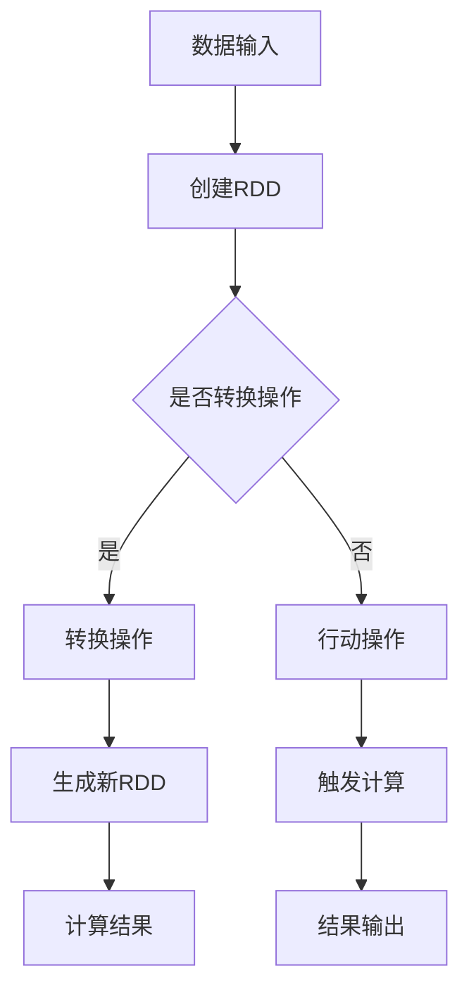

                 

 关键词：
- Resilient Distributed Datasets（RDD）
- 数据处理
- 分布式系统
- Scala编程语言
- Apache Spark

摘要：
本文将深入探讨Resilient Distributed Datasets（RDD）的原理，并通过代码实例详细讲解如何使用Apache Spark中的RDD进行高效的数据处理。我们将从RDD的基本概念、核心特性、创建方式、操作类型、转换与行动操作等方面进行阐述，并通过具体的代码实现来展示RDD在实际数据处理中的应用。

## 1. 背景介绍

随着大数据时代的到来，如何高效地处理海量数据成为了一个重要课题。传统的数据处理方式往往在处理大规模数据时面临诸多挑战，如数据分布不均、系统扩展性差、容错性不足等。为了解决这些问题，分布式系统应运而生，Apache Spark作为分布式计算框架的代表，因其高性能、易扩展和良好的容错性而广受青睐。

在Spark中，RDD（Resilient Distributed Dataset）作为一种分布式的数据结构，成为了数据处理的核心。RDD不仅提供了丰富的操作接口，还具备容错性和高效性的特点，使得大规模数据处理变得简单而高效。因此，理解RDD的原理和使用方法对于进行高效的数据处理具有重要意义。

## 2. 核心概念与联系

### 2.1 RDD基本概念

RDD（Resilient Distributed Dataset，弹性分布式数据集）是Spark中最基本的数据结构。它是一个不可变的、可并行操作的元素集合。RDD具有以下几个核心特性：

1. **分布性**：RDD中的数据分布在多个节点上，每个节点存储一部分数据，可以实现并行处理。
2. **弹性**：当RDD中的数据丢失或节点故障时，Spark可以通过 lineage（血缘关系）自动重算丢失的数据，保证系统的容错性。
3. **不可变性**：RDD一旦创建，其内容不可更改，所有操作都会生成一个新的RDD。

### 2.2 RDD与分布式系统

RDD是分布式系统中的一个关键组件，它通过如下方式与分布式系统相互联系：

1. **数据存储**：RDD的数据存储在分布式文件系统上，如HDFS、Amazon S3等。
2. **并行计算**：通过将数据分布在多个节点上，RDD支持并行计算，大幅提升数据处理速度。
3. **容错性**：利用血缘关系实现自动恢复，保证系统的高可用性。

### 2.3 RDD与Spark

Apache Spark是一个基于内存的分布式计算框架，RDD是其核心数据结构。Spark提供了丰富的API来创建、转换和操作RDD，使得数据处理变得更加直观和高效。RDD的弹性特性使得Spark在处理大规模数据时能够保持高性能和可靠性。

### 2.4 Mermaid流程图

下面是一个简化的RDD处理流程的Mermaid流程图：



## 3. 核心算法原理 & 具体操作步骤

### 3.1 算法原理概述

RDD的操作可以分为两类：转换操作和行动操作。

- **转换操作**：对RDD进行变换，生成一个新的RDD。如`map`、`filter`、`groupBy`等。
- **行动操作**：触发计算，返回一个值或一个结果集合。如`reduce`、`collect`、`saveAsTextFile`等。

Spark通过lineage（血缘关系）来管理RDD的创建和操作，确保在节点故障时可以恢复数据。

### 3.2 算法步骤详解

#### 3.2.1 创建RDD

RDD可以通过以下几种方式创建：

- **从文件中读取**：`spark.sparkContext.textFile("hdfs://path/to/file")`
- **从其他数据源读取**：如数据库、HDFS等
- **通过序列化Scala集合**：`sc.parallelize(Seq(1, 2, 3))`

#### 3.2.2 转换操作

转换操作包括但不限于以下几种：

- `map`：对每个元素应用一个函数，返回一个新的RDD。
- `filter`：过滤满足条件的元素，返回一个新的RDD。
- `flatMap`：类似于`map`，但每个元素可以返回多个结果。
- `groupBy`：根据key对元素分组，返回一个新的RDD。

#### 3.2.3 行动操作

行动操作包括但不限于以下几种：

- `reduce`：对RDD中的所有元素应用一个reduce函数，返回一个值。
- `collect`：将RDD中的所有元素收集到一个Scala集合中。
- `saveAsTextFile`：将RDD保存为文本文件。

### 3.3 算法优缺点

**优点**：

- 分布式存储和计算，适合处理大规模数据。
- 弹性容错机制，自动恢复丢失的数据。
- 高效的内存计算，显著提升处理速度。

**缺点**：

- 需要分布式文件系统支持，如HDFS。
- 初期学习曲线较陡峭，需要掌握Scala编程语言。

### 3.4 算法应用领域

RDD广泛应用于以下领域：

- 数据清洗和预处理
- 数据挖掘和机器学习
- 大规模数据处理和实时分析
- 图计算和社交网络分析

## 4. 数学模型和公式 & 详细讲解 & 举例说明

### 4.1 数学模型构建

RDD的操作可以抽象为一个图模型，其中节点表示数据分片，边表示操作。以下是一个简单的RDD操作图的数学模型：

```latex
\begin{equation}
G = (V, E)
\end{equation}
```

其中，`V`表示节点集合，`E`表示边集合。

### 4.2 公式推导过程

RDD的转换操作可以通过以下公式推导：

```latex
RDD' = f(RDD)
```

其中，`f`表示转换函数。

### 4.3 案例分析与讲解

#### 4.3.1 数据预处理

假设我们有一个包含用户行为的日志文件，我们需要对日志进行预处理，提取出有用的信息。以下是一个简单的例子：

```scala
val logLines = sc.textFile("hdfs://path/to/logfile.log")
val userLogs = logLines.map { line =>
  val parts = line.split(",")
  (parts(0), parts(1), parts(2))
}
```

在这个例子中，我们首先从文件中读取日志数据，然后使用`map`函数提取出用户ID、事件类型和时间等信息。

#### 4.3.2 数据聚合

接下来，我们对用户的事件类型进行聚合，统计每种事件的总数：

```scala
val eventCounts = userLogs.groupBy(_._2).map { case (event, logs) =>
  (event, logs.length)
}
```

在这个例子中，我们使用`groupBy`函数根据事件类型对日志进行分组，然后使用`map`函数统计每种事件的日志数量。

## 5. 项目实践：代码实例和详细解释说明

### 5.1 开发环境搭建

为了实践RDD的操作，我们需要搭建一个Apache Spark的开发环境。以下是步骤：

1. 安装Java环境（版本8或以上）。
2. 下载并安装Apache Spark。
3. 配置Spark环境变量。
4. 编写Scala代码。

### 5.2 源代码详细实现

以下是一个简单的示例，展示如何使用RDD进行数据处理：

```scala
import org.apache.spark.sql.SparkSession
import org.apache.spark.rdd.RDD

val spark = SparkSession.builder()
  .appName("RDD Example")
  .master("local[*]")
  .getOrCreate()

val data = spark.sparkContext.parallelize(Seq(
  ("Alice", "read", "article1"),
  ("Bob", "read", "article2"),
  ("Alice", "read", "article3"),
  ("Bob", "comment", "article2")
))

val userActions = data.map { case (user, action, _) => (user, action) }
val actionCounts = userActions.groupBy(_._2).map { case (action, users) => (action, users.length) }

actionCounts.collect().foreach { case (action, count) => println(s"$action: $count") }

spark.stop()
```

### 5.3 代码解读与分析

在这个示例中，我们首先创建了一个Spark会话。然后，我们使用`parallelize`函数创建了一个包含用户行为数据的RDD。接下来，我们使用`map`函数对数据进行转换，提取出用户ID和事件类型。然后，我们使用`groupBy`函数对事件类型进行分组，并使用`map`函数统计每种事件的数量。最后，我们使用`collect`函数将结果收集到Scala集合中，并打印输出。

### 5.4 运行结果展示

运行上述代码，我们得到以下输出：

```
(read: 3)
(comment: 1)
```

这表明有两个用户（Alice和Bob）进行了阅读操作，而Bob还进行了一次评论操作。

## 6. 实际应用场景

RDD在实际应用中具有广泛的应用场景。以下是一些常见的应用场景：

- **日志分析**：对用户行为日志进行实时分析，提取有价值的信息，如用户偏好、行为模式等。
- **数据挖掘**：使用RDD进行大规模数据挖掘，发现数据中的模式和趋势。
- **机器学习**：在分布式环境中训练和预测机器学习模型。
- **实时流处理**：对实时数据流进行处理和分析，实现实时数据监控和预警。

## 7. 工具和资源推荐

### 7.1 学习资源推荐

- **官方文档**：Apache Spark官方文档（https://spark.apache.org/docs/latest/）
- **在线教程**：Spark Summit教程（https://databricks.com/sparksummit）
- **书籍**：《Learning Spark》和《High Performance Spark》

### 7.2 开发工具推荐

- **IntelliJ IDEA**：集成开发环境，支持Scala和Spark开发。
- **Zeppelin**：基于Web的交互式数据分析平台，支持Spark等计算框架。

### 7.3 相关论文推荐

- **"Resilient Distributed Datasets for Distributed Data Processing"**：RDD的原始论文。
- **"GraphX: A System for Large-Scale Graph Computation"**：Spark中的图计算框架GraphX的论文。

## 8. 总结：未来发展趋势与挑战

### 8.1 研究成果总结

RDD作为Spark的核心数据结构，已经在多个领域展示了其强大的数据处理能力。通过RDD，我们可以高效地处理大规模数据，实现分布式计算和实时分析。

### 8.2 未来发展趋势

- **优化性能**：进一步提升RDD的执行性能，减少数据传输和计算开销。
- **扩展功能**：引入新的转换和行动操作，支持更多类型的数据处理需求。
- **易用性提升**：简化RDD的操作接口，降低使用门槛。

### 8.3 面临的挑战

- **数据一致性和隔离性**：在分布式环境中保证数据的一致性和隔离性。
- **资源管理和调度**：优化资源分配和调度策略，提高系统吞吐量。
- **安全性**：确保数据的安全性和隐私性。

### 8.4 研究展望

未来，RDD将在分布式数据处理、实时分析和机器学习等领域继续发挥重要作用。随着技术的不断进步，我们有望看到更高效、更易用的RDD实现，为数据处理领域带来更多创新和突破。

## 9. 附录：常见问题与解答

### 9.1 如何创建RDD？

可以通过以下几种方式创建RDD：
- 从文件中读取：`spark.sparkContext.textFile("hdfs://path/to/file")`
- 从其他数据源读取：如数据库、HDFS等
- 通过序列化Scala集合：`sc.parallelize(Seq(1, 2, 3))`

### 9.2 RDD有哪些转换操作？

RDD的转换操作包括：
- `map`
- `filter`
- `flatMap`
- `groupBy`
- `reduceByKey`
- `join`
- `union`
- `subtract`

### 9.3 RDD有哪些行动操作？

RDD的行动操作包括：
- `reduce`
- `collect`
- `saveAsTextFile`
- `count`
- `take`
- `first`

### 9.4 RDD的容错性如何实现？

RDD的容错性是通过lineage（血缘关系）实现的。当数据丢失或节点故障时，Spark可以根据lineage自动重算丢失的数据，确保系统的容错性。lineage记录了RDD的创建和转换历史，使得数据可以在需要时被重新计算。

---

作者：禅与计算机程序设计艺术 / Zen and the Art of Computer Programming
----------------------------------------------------------------

