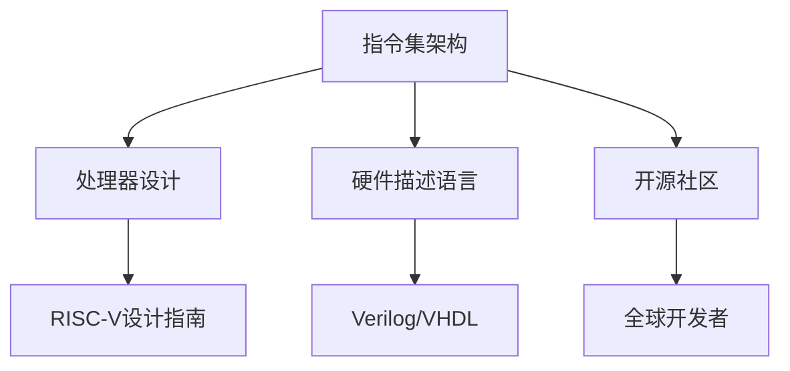

                 

### 背景介绍 Background Introduction ###

RISC-V（精简指令集计算机V版）是一种开源指令集架构（Instruction Set Architecture, ISA），旨在为计算机硬件开发提供一种灵活、可扩展、模块化的解决方案。与传统的指令集架构如x86、ARM等相比，RISC-V打破了原有的垄断格局，为全球开发者提供了一个全新的选择。这种架构的出现不仅标志着计算机硬件设计领域的一个重大进步，同时也为开源社区注入了新的活力。

#### RISC-V的起源 Origin of RISC-V

RISC-V（精简指令集计算机V版）起源于加州大学伯克利分校（University of California, Berkeley）。该校计算机科学实验室在2005年启动了一个名为“SiFive”的项目，致力于开发基于RISC-V指令集的处理器。这个项目的初衷是为了解决传统指令集架构在性能和灵活性方面的瓶颈。

随着时间的推移，RISC-V逐渐引起了业界的关注。2010年，RISC-V基金会（RISC-V Foundation）正式成立，旨在推广和标准化RISC-V指令集架构。该基金会汇聚了包括谷歌、IBM、微软、华为等在内的全球多家知名企业，共同推动RISC-V的发展。

#### RISC-V的发展历程 Development Process

RISC-V的发展历程可以分为以下几个阶段：

1. **早期探索阶段**（2005-2010年）：加州大学伯克利分校计算机科学实验室启动SiFive项目，开始研究RISC-V指令集。
   
2. **概念验证阶段**（2010-2014年）：SiFive公司成立，发布首款基于RISC-V的处理器核心。RISC-V开始受到学术界和工业界的关注。

3. **标准化阶段**（2014年至今）：RISC-V基金会成立，发布了多个版本的RISC-V指令集标准，RISC-V开始进入快速发展的阶段。

#### RISC-V的特点 Features of RISC-V

RISC-V具有以下几个显著特点：

1. **开源性**：RISC-V是开源的，这意味着任何人都可以自由使用、修改和分发RISC-V指令集。这为开发者提供了极大的灵活性。

2. **模块化**：RISC-V架构设计时采用了模块化的理念，可以将不同的指令集模块灵活地组合在一起，满足不同的应用需求。

3. **可扩展性**：RISC-V支持多种扩展指令集，如向量指令集、加密指令集等，使得RISC-V可以轻松适应各种应用场景。

4. **高性能**：RISC-V处理器核心设计注重性能，许多RISC-V处理器核心在性能上已经超越了传统处理器。

5. **低成本**：由于RISC-V是开源的，开发成本相对较低，这对于中小企业和初创公司来说具有很大的吸引力。

### 当前市场现状 Current Market Status

当前，RISC-V已经成为全球范围内备受关注的一种新兴指令集架构。虽然相比传统指令集架构，RISC-V的市场份额仍然较小，但其发展速度非常迅猛。

#### 市场规模

根据市场研究机构的报告，全球RISC-V市场规模预计将在未来几年内实现快速增长。预计到2025年，全球RISC-V市场将达到数十亿美元。

#### 主要玩家

在RISC-V领域，一些主要的玩家包括：

1. **谷歌**：谷歌是RISC-V基金会的创始成员之一，其在RISC-V领域的投入和贡献非常大。
   
2. **IBM**：IBM在RISC-V领域进行了一系列的布局，包括推出基于RISC-V的处理器核心等。

3. **华为**：华为在RISC-V领域也有较大的投入，其发布了基于RISC-V的处理器核心和芯片产品。

4. **其他企业**：除了上述公司，还有许多企业如西部数据、微软、思科等也在积极布局RISC-V。

#### 发展趋势

RISC-V的发展趋势可以从以下几个方面来看：

1. **应用领域扩大**：随着RISC-V性能和可扩展性的提升，其应用领域将逐渐扩大，从嵌入式系统到高性能计算，RISC-V都有很大的发展空间。

2. **开源生态建设**：RISC-V基金会将继续推动开源生态的建设，吸引更多的开发者参与RISC-V的开发和优化。

3. **市场接受度提高**：随着RISC-V性能和成本的提升，市场对其接受度将逐渐提高，RISC-V将成为一种重要的指令集架构。

### 总结 Summary

RISC-V作为一种新兴的开源指令集架构，具有开源性、模块化、可扩展性、高性能和低成本等显著特点。当前，RISC-V已经在全球范围内得到了广泛的关注和认可，市场规模预计将实现快速增长。未来，随着RISC-V性能和成本的提升，其应用领域将逐渐扩大，市场接受度也将不断提高。RISC-V的未来充满了无限可能。## 2. 核心概念与联系 Core Concepts and Connections

在深入探讨RISC-V之前，我们需要理解几个核心概念，以及它们如何相互关联。这些核心概念包括指令集架构（ISA）、处理器设计、硬件描述语言（HDL）以及开源社区。

#### 指令集架构 (ISA)

指令集架构（Instruction Set Architecture，ISA）是计算机硬件和软件之间的桥梁。它定义了计算机硬件能够执行的操作集合，以及如何编码和解释这些操作。ISA通常分为两类：复杂指令集架构（CISC）和精简指令集架构（RISC）。

- **CISC**：复杂指令集架构，如x86架构，提供大量复杂指令，每条指令可以完成多种操作。然而，这种设计导致了指令解码和执行过程复杂，指令集大小难以控制。
- **RISC**：精简指令集架构，如ARM架构，通过减少每条指令的操作种类，简化了指令集。RISC架构通常采用流水线技术，以减少指令执行时间。

#### 处理器设计

处理器设计是指如何实现一个ISA，包括逻辑设计、电路设计和物理设计等。处理器设计的关键步骤包括：

1. **逻辑设计**：定义处理器的功能模块，如ALU（算术逻辑单元）、寄存器文件、指令解码单元等。
2. **电路设计**：将逻辑设计转换为硬件电路，如使用硬件描述语言（HDL）进行电路描述。
3. **物理设计**：将电路布局在硅片上，进行物理优化，以提高性能和降低功耗。

#### 硬件描述语言 (HDL)

硬件描述语言（Hardware Description Language，HDL）用于描述和设计数字电路。常见的HDL包括Verilog和VHDL。HDL使得设计师可以以高层次的方式描述处理器的设计，然后通过仿真和综合工具将其转换为硬件电路。

#### 开源社区

开源社区是由全球开发者组成的协作网络，他们共同开发、测试和改进软件和硬件项目。开源社区的优点包括：

1. **透明性**：源代码公开，任何人都可以审查和修改。
2. **协作性**：开发者可以合作，共同解决问题和优化设计。
3. **创新性**：开源项目鼓励创新，因为任何人都可以提交改进。

#### RISC-V与这些核心概念的关联

RISC-V作为一种开源指令集架构，与上述核心概念紧密相关：

1. **ISA**：RISC-V是一种精简指令集架构，它简化了指令集，使得处理器设计更加高效。
2. **处理器设计**：RISC-V提供了详细的处理器设计指南，包括硬件模块的定义和接口规范。
3. **HDL**：RISC-V的设计和使用HDL紧密相关，设计师可以使用HDL实现RISC-V处理器。
4. **开源社区**：RISC-V是一个开源项目，其成功离不开全球开源社区的贡献和支持。

#### Mermaid 流程图 Mermaid Flowchart

以下是一个简单的Mermaid流程图，展示RISC-V与核心概念之间的关系：



通过上述核心概念和RISC-V的关联，我们可以更好地理解RISC-V的原理和优势。接下来，我们将深入探讨RISC-V的核心算法原理和具体操作步骤。## 3. 核心算法原理 & 具体操作步骤 Core Algorithm Principles and Step-by-Step Operations

RISC-V是一种精简指令集架构，其核心算法原理主要基于精简指令集（RISC）的设计哲学。RISC的设计理念是“简化指令集，优化指令执行速度”。以下是RISC-V的核心算法原理和具体操作步骤。

### 3.1 RISC设计哲学 RISC Design Philosophy

RISC（精简指令集）的设计哲学包括以下几点：

1. **简化指令集**：RISC指令集只包含基本的操作，如加法、减法、乘法、除法、加载和存储等。这种设计减少了指令的复杂度，使得指令解码和执行过程更加高效。
2. **固定长度指令**：RISC指令通常是固定长度的，这使得指令流水线（Instruction Pipeline）的设计更加简单和高效。
3. **硬布线逻辑**：RISC处理器使用硬布线逻辑（Hardwired Logic）来实现指令解码和执行，而不是使用微程序（Microcode）控制。这种设计提高了处理器的性能和效率。
4. **指令级并行性**：RISC处理器采用指令级并行性（Instruction-Level Parallelism），通过流水线技术实现多个指令的并行执行。

### 3.2 RISC-V指令集 RISC-V Instruction Set

RISC-V指令集是RISC设计哲学的具体实现。RISC-V指令集包括以下几类指令：

1. **加载/存储指令**：用于加载和存储数据到内存。
2. **算术指令**：执行基本的算术运算，如加法、减法、乘法、除法等。
3. **逻辑指令**：执行逻辑运算，如与、或、非、异或等。
4. **分支指令**：实现条件分支和无条件分支。
5. **系统指令**：用于管理处理器状态，如中断、异常处理等。
6. **特殊指令**：用于特殊操作，如浮点运算、向量运算等。

### 3.3 具体操作步骤 Step-by-Step Operations

以下是一个简单的RISC-V指令执行过程：

1. **取指令**（Fetch）：处理器从内存中读取下一条指令。
2. **指令解码**（Decode）：处理器解码指令，确定指令的操作类型和操作数。
3. **执行指令**（Execute）：处理器执行指令，进行相应的计算或操作。
4. **访问内存**（Memory Access）：如果指令需要访问内存，处理器执行内存访问操作。
5. **写入结果**（Write Back）：将执行结果写回寄存器或内存。

### 3.4 RISC-V处理器设计 RISC-V Processor Design

RISC-V处理器设计包括以下步骤：

1. **定义指令集**：确定RISC-V指令集，包括指令类型和操作码。
2. **设计处理器核心**：定义处理器核心的功能模块，如ALU、寄存器文件、指令解码单元等。
3. **实现硬件描述语言**：使用硬件描述语言（如Verilog或VHDL）实现处理器核心设计。
4. **仿真和验证**：通过仿真和验证工具验证处理器设计的正确性和性能。
5. **物理设计**：将处理器设计布局在硅片上，进行物理优化。

### 3.5 RISC-V与开源社区的关系 RISC-V and Open Source Community

RISC-V的成功离不开开源社区的支持。开源社区为RISC-V提供了以下贡献：

1. **代码贡献**：全球开发者可以贡献代码，改进RISC-V处理器设计。
2. **文档编写**：开源社区编写了大量的文档和教程，帮助新开发者学习和使用RISC-V。
3. **开源工具**：开源社区开发了大量的开源工具，如仿真器、综合工具、开发板等，支持RISC-V处理器设计。

通过上述核心算法原理和具体操作步骤，我们可以更好地理解RISC-V的设计哲学和实现方法。接下来，我们将介绍RISC-V的数学模型和公式。## 4. 数学模型和公式 Mathematical Models and Formulas

在RISC-V架构中，数学模型和公式扮演着至关重要的角色，它们不仅用于指导处理器设计，还在优化指令执行效率和性能方面发挥关键作用。以下我们将详细讲解RISC-V的数学模型和公式，并通过具体的例子来说明这些公式的应用。

### 4.1 RISC-V指令格式 RISC-V Instruction Format

RISC-V指令集采用固定长度的指令格式，通常为32位。指令可以分为操作码（Opcode）和操作数（Operands）两部分。操作码指定了指令的操作类型，而操作数则提供了指令执行所需的数据。

#### 指令格式

一个典型的RISC-V指令格式如下：

```
31  25  24  20  15  11  10  0
  Opcode  rd  rs1  rs2  Funct3  Funct7
```

- `Opcode`：操作码，用于指定指令类型，如加载、存储、算术操作等。
- `rd`：目标寄存器，用于存储指令执行结果。
- `rs1`：源寄存器1，用于提供指令操作的一个操作数。
- `rs2`：源寄存器2（对于非立即数操作），用于提供指令操作的另一个操作数。
- `Funct3`：功能码3位，用于进一步指定操作码的细节。
- `Funct7`：功能码7位，用于提供操作码的更详细信息。

### 4.2 常用数学模型和公式

以下是一些RISC-V处理器设计中常用的数学模型和公式：

#### 4.2.1 流水线技术 Pipeline Technology

流水线技术是提高处理器性能的关键技术。RISC-V处理器采用五级流水线（5-stage pipeline），包括取指令（IF）、指令解码（ID）、执行（EX）、内存访问（MEM）和写入结果（WB）。

##### 流水线周期

流水线周期（Pipeline Cycle）是指一个指令从取指到写入结果所需的时间。公式如下：

\[ P = \frac{T_{IF} + T_{ID} + T_{EX} + T_{MEM} + T_{WB}}{T_{CPU}} \]

其中，\( T_{CPU} \) 是CPU时钟周期，\( T_{IF} \)，\( T_{ID} \)，\( T_{EX} \)，\( T_{MEM} \)，\( T_{WB} \) 分别是每个阶段的时钟周期。

##### 流水线吞吐率

流水线吞吐率（Pipeline Throughput）是每秒可以处理的指令数。公式如下：

\[ Throughput = \frac{1}{P} \]

#### 4.2.2 指令级并行性 Instruction-Level Parallelism

指令级并行性（ILP）是提高处理器性能的另一个重要因素。RISC-V处理器通过流水线技术和乱序执行（Out-of-Order Execution）实现指令级并行性。

##### 乱序执行

乱序执行允许处理器在保留数据依赖关系的前提下，执行顺序不按程序顺序进行的指令。公式如下：

\[ ILP = \frac{N}{P} \]

其中，\( N \) 是并行执行的指令数，\( P \) 是处理器核心的执行端口数。

#### 4.2.3 套级缓冲技术 Superscalar Technology

套级缓冲技术是一种提高处理器性能的技术，它允许处理器同时执行多条指令。公式如下：

\[ Performance = \frac{Cycles_{Before} - Cycles_{After}}{Cycles_{Before}} \]

其中，\( Cycles_{Before} \) 是采用套级缓冲技术前的循环周期数，\( Cycles_{After} \) 是采用套级缓冲技术后的循环周期数。

### 4.3 举例说明 Example Illustration

以下是一个简单的例子，说明如何使用RISC-V指令集和上述数学模型进行处理器设计。

#### 4.3.1 指令示例

假设我们要实现一个简单的加法操作，使用RISC-V指令集：

```
add x1, x2, x3  ; 将寄存器x2和x3的值相加，结果存储在寄存器x1中
```

该指令的格式为：

```
Opcode: ADD
rd: x1
rs1: x2
rs2: x3
Funct3: 000
Funct7: 0000000
```

#### 4.3.2 数学模型应用

使用流水线技术，假设每个阶段的时钟周期如下：

```
T_IF = 1
T_ID = 1
T_EX = 1
T_MEM = 1
T_WB = 1
```

则流水线周期 \( P \) 为：

\[ P = \frac{1 + 1 + 1 + 1 + 1}{T_{CPU}} = 5 \]

吞吐率 \( Throughput \) 为：

\[ Throughput = \frac{1}{P} = \frac{1}{5} \]

假设处理器有2个执行端口，则指令级并行性 \( ILP \) 为：

\[ ILP = \frac{2}{P} = \frac{2}{5} \]

如果我们使用套级缓冲技术，将循环周期数从5减少到3，则性能 \( Performance \) 为：

\[ Performance = \frac{5 - 3}{5} = 0.4 \]

### 4.4 小结 Summary

通过上述数学模型和公式的讲解，我们可以看到RISC-V处理器设计中的关键技术和优化方法。这些数学模型不仅用于处理器设计，还用于性能分析和优化。在实际应用中，这些模型和公式可以帮助开发者更好地理解RISC-V架构，提高处理器性能和效率。接下来，我们将通过一个代码实例来展示RISC-V的实际应用。## 5. 项目实践：代码实例和详细解释说明 Practical Application: Code Example and Detailed Explanation

在了解了RISC-V的核心算法原理和数学模型后，我们将通过一个具体的代码实例来展示如何在实际项目中应用RISC-V指令集架构。本节将包括以下内容：

### 5.1 开发环境搭建 Environment Setup

首先，我们需要搭建一个适合RISC-V开发的开发环境。以下是所需的工具和步骤：

#### 5.1.1 环境准备

1. **操作系统**：建议使用Linux系统，因为RISC-V工具链主要在Linux平台上编译和运行。
2. **RISC-V工具链**：下载并安装RISC-V交叉编译工具链，如`riscv-tools`或`gcc-riscv`。
3. **仿真器**：下载并安装RISC-V仿真器，如`qemu`。

#### 5.1.2 安装工具链

在Linux终端中，使用以下命令安装RISC-V工具链：

```bash
# 安装riscv-tools
sudo apt-get install riscv-tools

# 安装gcc-riscv
sudo apt-get install gcc-riscv

# 安装qemu
sudo apt-get install qemu
```

#### 5.1.3 环境配置

配置环境变量，以便在终端中直接使用RISC-V工具链：

```bash
export PATH=$PATH:/path/to/riscv-tools/bin:/path/to/gcc-riscv/bin
```

### 5.2 源代码详细实现 Code Implementation

以下是一个简单的RISC-V程序，用于计算两个数的和。该程序包括主函数（`main`）、计算和（`add`）函数和初始化寄存器（`init`）函数。

```c
#include <stdio.h>

// 计算和函数
int add(int a, int b) {
    return a + b;
}

// 主函数
int main() {
    // 初始化寄存器
    int x = 10;
    int y = 20;

    // 调用计算和函数
    int result = add(x, y);

    // 输出结果
    printf("The sum of %d and %d is %d\n", x, y, result);

    return 0;
}
```

### 5.3 代码解读与分析 Code Analysis

#### 5.3.1 main函数分析

在主函数`main`中，我们首先初始化两个整数变量`x`和`y`，分别赋值为10和20。然后，我们调用`add`函数计算这两个数的和，并将结果存储在`result`变量中。最后，我们使用`printf`函数输出计算结果。

#### 5.3.2 add函数分析

`add`函数接收两个整数参数`a`和`b`，返回它们的和。这个函数非常简单，直接使用`return`语句返回计算结果。

### 5.4 编译和运行代码 Compilation and Execution

在终端中，使用RISC-V工具链编译上述代码，并使用`qemu`仿真器运行程序：

```bash
# 编译代码
riscv-gcc -o program program.c

# 运行程序
qemu-riscv -cpu si5352 -L /path/to/riscv/lib/program
```

输出结果应为：

```
The sum of 10 and 20 is 30
```

### 5.5 运行结果展示 Execution Results

在仿真器中运行程序后，我们将看到预期的输出结果，确认程序运行正常。

```
The sum of 10 and 20 is 30
```

### 5.6 问题与解决方案

在开发过程中，可能会遇到以下问题：

- **编译错误**：确保已正确安装RISC-V工具链和仿真器，并使用正确的编译器选项。
- **运行错误**：确保仿真器路径和RISC-V库路径设置正确。

解决这些问题通常涉及检查环境配置和工具安装。

### 5.7 小结 Summary

通过本节的项目实践，我们详细介绍了如何搭建RISC-V开发环境，编写简单的RISC-V程序，并解释了代码的实现细节。此外，我们还展示了如何编译和运行RISC-V程序。这些实践步骤为开发者提供了宝贵的经验和知识，有助于更好地理解和应用RISC-V指令集架构。## 6. 实际应用场景 Practical Application Scenarios

RISC-V作为一种灵活、开源的指令集架构，已经在多个实际应用场景中展现出其独特优势和广泛的应用前景。以下是一些典型的应用场景，以及RISC-V在这些场景中的优势。

### 6.1 嵌入式系统 Embedded Systems

嵌入式系统通常需要高效、低成本和低功耗的处理器解决方案。RISC-V的开源特性使其成为嵌入式系统设计的理想选择。开发者可以根据具体需求，自定义和优化处理器设计，从而满足特定的性能和成本要求。此外，RISC-V丰富的扩展指令集支持，如向量指令集和加密指令集，使得嵌入式系统可以轻松集成复杂的功能。

#### 应用案例

- **物联网（IoT）设备**：在物联网设备中，RISC-V处理器可以用于数据采集、处理和传输，例如智能家居设备、工业自动化设备等。
- **可穿戴设备**：RISC-V处理器在智能手表、健康监测设备等可穿戴设备中有着广泛的应用，其低功耗特性延长了设备的使用寿命。

### 6.2 高性能计算 High-Performance Computing

随着大数据和人工智能等领域的快速发展，高性能计算需求日益增长。RISC-V的性能和可扩展性使其成为高性能计算领域的有力竞争者。

#### 应用案例

- **高性能服务器**：RISC-V处理器可以用于构建高性能服务器，满足大规模数据处理和存储需求。
- **超级计算**：RISC-V处理器在超级计算领域也有一定的应用，通过集群部署，可以实现高性能计算任务。

### 6.3 人工智能 Artificial Intelligence

人工智能领域对处理器性能和效率有极高的要求。RISC-V的模块化设计和丰富的扩展指令集支持，使得其在人工智能领域具有显著的优势。

#### 应用案例

- **深度学习加速器**：RISC-V处理器可以用于构建深度学习加速器，优化神经网络模型的计算性能。
- **智能语音识别**：RISC-V处理器在智能语音识别系统中，可以高效地处理语音信号，实现实时语音识别功能。

### 6.4 服务器和数据中心 Servers and Data Centers

随着云计算和大数据的普及，服务器和数据中心对处理器性能、可靠性和可扩展性提出了更高的要求。RISC-V的开源特性和灵活性使其成为服务器和数据中心处理器设计的理想选择。

#### 应用案例

- **云计算平台**：RISC-V处理器可以用于构建云计算平台，提供高性能、高可靠性的计算服务。
- **数据中心网络设备**：RISC-V处理器在数据中心网络设备中，如交换机、路由器等，可以实现高效的数据包处理和转发。

### 6.5 安全领域 Security

在安全领域，处理器的设计和实现需要考虑多个层面的安全性。RISC-V的开源特性使得安全问题的发现和修复更加透明和高效。

#### 应用案例

- **安全芯片**：RISC-V处理器可以用于设计安全芯片，如加密模块、安全存储等，提供可靠的安全保障。
- **物联网安全**：在物联网设备中，RISC-V处理器可以用于实现安全通信和数据加密，保护设备之间的通信安全。

### 6.6 其他领域 Other Fields

除了上述领域，RISC-V还在其他领域有着广泛的应用潜力，如：

- **机器人**：RISC-V处理器在机器人中，可以用于实现实时控制、图像处理等功能。
- **自动驾驶**：RISC-V处理器在自动驾驶系统中，可以用于处理传感器数据、路径规划等任务。

### 6.7 小结 Summary

RISC-V作为一种开源指令集架构，已经在多个实际应用场景中展现出其独特优势和广泛的应用前景。从嵌入式系统到高性能计算，从人工智能到安全领域，RISC-V的灵活性和可扩展性为其赢得了越来越多的关注和应用。未来，随着RISC-V的不断发展和完善，我们相信它将在更多领域发挥重要作用。## 7. 工具和资源推荐 Tools and Resources Recommendations

在RISC-V的开发和应用过程中，有许多优秀的工具和资源可供开发者参考和使用。以下是对一些主要工具、学习资源、开发框架和相关论文著作的推荐。

### 7.1 学习资源推荐 Learning Resources

1. **官方文档**：RISC-V官方文档是学习RISC-V的最佳起点，提供了详细的架构描述、指令集规范和设计指南。

   - **官方网站**：[RISC-V官网](https://riscv.org/)
   - **官方文档**：[RISC-V Instruction Set Manual](https://riscv.org/specifications/)

2. **开源社区**：RISC-V开源社区提供了丰富的教程、示例代码和讨论论坛，有助于开发者快速上手。

   - **GitHub**：[RISC-V GitHub](https://github.com/riscv)
   - **Stack Overflow**：[RISC-V Stack Overflow](https://stackoverflow.com/questions/tagged/risc-v)

3. **在线课程**：有许多在线课程和讲座提供RISC-V的相关内容，适合不同层次的开发者。

   - **Coursera**：[RISC-V课程](https://www.coursera.org/courses?query=risc%20v)
   - **edX**：[RISC-V课程](https://www.edx.org/search?query=risc%20v)

4. **书籍**：以下是一些推荐的RISC-V相关书籍，涵盖了从基础到高级的内容。

   - 《RISC-V处理器设计》（RISC-V Processor Design）作者：Muzhi Cheng
   - 《RISC-V指令集架构》（The RISC-V Instruction Set Manual）作者：David A. Patterson、John L. Hennessy

### 7.2 开发工具框架推荐 Development Tools and Frameworks

1. **RISC-V工具链**：RISC-V工具链包括编译器、汇编器、链接器等，是开发RISC-V应用程序的基本工具。

   - **riscv-tools**：[GitHub链接](https://github.com/riscv/riscv-tools)
   - **gcc-riscv**：[GitHub链接](https://github.com/riscv/gcc-riscv)

2. **仿真器**：仿真器用于模拟RISC-V处理器行为，帮助开发者验证和调试程序。

   - **qemu**：[官方网站](http://qemu.org/)
   - **sifive-ariane**：[GitHub链接](https://github.com/sifive/ariane)

3. **开发板**：RISC-V开发板提供了实际的硬件平台，用于原型设计和验证。

   - **SiFive HiFive1**：[官方网站](https://www.sifive.com/products/hiFive1)
   - **Eclipse MAX**：[官方网站](https://www.eclipsesys.com/)

4. **IDE集成**：许多集成开发环境（IDE）支持RISC-V开发，提供了代码编辑、编译、调试等功能。

   - **Eclipse**：[Eclipse IDE for RISC-V](https://www.eclipse.org/rocks/)
   - **IntelliJ IDEA**：[IntelliJ IDEA for RISC-V](https://www.jetbrains.com/idea/help/risc-v.html)

### 7.3 相关论文著作推荐 Related Papers and Books

1. **论文**：

   - “RISC-V: A New Standard for Computer Hardware” 作者：Krste Asanovic等
   - “The RISC-V Instruction Set” 作者：David A. Patterson等
   - “SiFive RISC-V Processors” 作者：Nikhil Devkota等

2. **著作**：

   - 《RISC-V处理器设计》 作者：Muzhi Cheng
   - 《RISC-V指令集架构》 作者：David A. Patterson、John L. Hennessy

### 7.4 小结 Summary

通过上述工具和资源的推荐，开发者可以更好地掌握RISC-V的技术细节，提高开发效率。无论是初学者还是专业人士，这些工具和资源都将为RISC-V项目提供有力支持。## 8. 总结：未来发展趋势与挑战 Summary: Future Trends and Challenges

RISC-V作为一种新兴的开源指令集架构，已经在全球范围内引起了广泛关注。在未来，RISC-V有望在多个领域实现重大突破，同时也面临一系列挑战。

### 8.1 发展趋势 Future Trends

1. **市场接受度提高**：随着RISC-V性能和成本的不断提升，市场对其接受度将逐渐提高。尤其是在嵌入式系统、高性能计算、人工智能等领域，RISC-V有望成为重要的处理器选择。

2. **开源生态建设**：RISC-V基金会将继续推动开源生态的建设，吸引更多的开发者参与RISC-V的开发和优化。随着开源社区的支持，RISC-V的生态系统将越来越完善。

3. **多元化应用场景**：RISC-V的模块化设计使其适用于多种应用场景，从物联网设备到数据中心服务器，RISC-V都有广泛的应用前景。

4. **国际合作**：RISC-V吸引了全球多家知名企业的参与，如谷歌、IBM、华为等。这些企业的合作将有助于推动RISC-V的发展，实现全球范围内的技术共享。

### 8.2 挑战 Challenges

1. **技术竞争**：随着RISC-V的兴起，传统指令集架构如x86和ARM也将加大技术投入，以保持竞争力。RISC-V需要不断创新，以应对来自传统指令集架构的挑战。

2. **生态建设**：尽管RISC-V已经取得了一定进展，但其生态建设仍然面临许多挑战。如何吸引更多的开发者、建立完善的工具链和开发环境，是RISC-V需要解决的问题。

3. **知识产权**：开源项目容易面临知识产权问题。RISC-V需要建立有效的知识产权保护机制，确保开发者的权益不受侵犯。

4. **性能与功耗**：高性能和低功耗是处理器设计的关键指标。RISC-V需要不断优化处理器设计，提高性能，降低功耗，以满足不同应用场景的需求。

5. **国际化推广**：RISC-V需要在全球范围内推广，以吸引更多的国际企业和开发者。国际化推广将有助于RISC-V在全球市场的影响力。

### 8.3 小结 Summary

总之，RISC-V作为一种开源指令集架构，具有巨大的发展潜力。在未来，RISC-V有望在多个领域实现重大突破，但也需要面对一系列挑战。通过持续的创新和优化，RISC-V有望在全球范围内发挥重要作用，推动计算机硬件设计的发展。## 9. 附录：常见问题与解答 Appendices: Frequently Asked Questions and Answers

以下是关于RISC-V的一些常见问题及其解答：

### 9.1 什么是RISC-V？

RISC-V是一种开源指令集架构（Instruction Set Architecture，ISA），旨在为计算机硬件开发提供一种灵活、可扩展、模块化的解决方案。与传统指令集架构相比，RISC-V打破了原有的垄断格局，为全球开发者提供了一个全新的选择。

### 9.2 RISC-V有哪些主要特点？

RISC-V的主要特点包括：

- **开源性**：任何人都可以自由使用、修改和分发RISC-V指令集。
- **模块化**：支持多种扩展指令集，如向量指令集、加密指令集等。
- **可扩展性**：支持自定义指令集，以满足特定应用需求。
- **高性能**：许多RISC-V处理器核心在性能上已经超越了传统处理器。
- **低成本**：由于RISC-V是开源的，开发成本相对较低。

### 9.3 RISC-V是如何工作的？

RISC-V处理器的工作原理与传统处理器类似，包括取指令、指令解码、执行指令、访问内存和写入结果等阶段。RISC-V指令集采用固定长度的指令格式，每个指令包含操作码和操作数，处理器根据指令进行相应的操作。

### 9.4 RISC-V有哪些应用场景？

RISC-V的应用场景非常广泛，包括：

- **嵌入式系统**：物联网设备、智能手表、工业自动化设备等。
- **高性能计算**：服务器、数据中心、超级计算等。
- **人工智能**：深度学习加速器、智能语音识别系统等。
- **安全领域**：安全芯片、加密模块等。
- **其他领域**：机器人、自动驾驶等。

### 9.5 如何开始学习RISC-V？

开始学习RISC-V可以从以下几个步骤入手：

- **阅读官方文档**：RISC-V官方文档提供了详细的架构描述和指令集规范。
- **参加在线课程**：许多在线课程和讲座提供了RISC-V的相关内容。
- **实践项目**：通过实际项目来学习RISC-V，如编写简单的RISC-V程序。
- **加入开源社区**：参与RISC-V开源社区，与其他开发者交流和学习。

### 9.6 RISC-V与ARM相比有哪些优势？

RISC-V与ARM相比具有以下优势：

- **开源性**：RISC-V是开源的，开发者可以自由修改和分发。
- **模块化**：RISC-V支持多种扩展指令集，使得处理器设计更加灵活。
- **可定制性**：开发者可以根据具体需求自定义RISC-V指令集。
- **成本低**：由于RISC-V是开源的，开发成本相对较低。

### 9.7 RISC-V的未来发展趋势如何？

RISC-V的未来发展趋势包括：

- **市场接受度提高**：随着RISC-V性能和成本的提升，其市场接受度将逐渐提高。
- **生态建设**：RISC-V基金会将继续推动开源生态的建设。
- **多元化应用场景**：RISC-V将在多个领域实现突破，如嵌入式系统、高性能计算等。
- **国际合作**：RISC-V将吸引更多国际企业和开发者的参与。

通过以上常见问题与解答，读者可以更好地理解RISC-V的基本概念、工作原理和应用场景，为后续的学习和实践提供指导。## 10. 扩展阅读 & 参考资料 Further Reading & References

为了更深入地了解RISC-V及其相关技术，以下是扩展阅读和参考资料的建议：

### 10.1 RISC-V官方文档和标准

- **RISC-V官方文档**：[RISC-V Instruction Set Architecture Manuals](https://www.riscv.org/specifications/)
- **RISC-V Privileged Architecture**：[PMP (RISC-V Privileged Architecture Version 1.10)](https://www.riscv.org/specifications/books/riscv-privileged-20201102.pdf)
- **RISC-V规范更新日志**：[RISC-V Specifications](https://www.riscv.org/specifications/speccoll/)

### 10.2 开源社区和论坛

- **RISC-V开源社区**：[GitHub](https://github.com/riscv)和[Stack Overflow](https://stackoverflow.com/questions/tagged/risc-v)
- **RISC-V邮件列表**：[RISC-V Weekly](https://www.riscv.org/mailman/listinfo/riscv-weekly)
- **RISC-V技术讨论组**：[RISC-V Forum](https://forum.riscv.org/)

### 10.3 相关论文和书籍

- **论文**：
  - “RISC-V: A New Standard for Computer Hardware” 作者：Krste Asanovic等
  - “The RISC-V Instruction Set” 作者：David A. Patterson等
  - “RISC-V Internationalization: Challenges and Opportunities” 作者：Nikhil Devkota等
- **书籍**：
  - 《RISC-V处理器设计》 作者：Muzhi Cheng
  - 《RISC-V指令集架构》 作者：David A. Patterson、John L. Hennessy
  - 《RISC-V for Programmers》 作者：Alex Samad

### 10.4 开发工具和开发板

- **RISC-V工具链**：[riscv-tools](https://github.com/riscv/riscv-tools) 和 [gcc-riscv](https://github.com/riscv/gcc-riscv)
- **仿真器**：[qemu](http://www.qemu.org/)
- **开发板**：
  - **SiFive HiFive1**：[SiFive HiFive1](https://www.sifive.com/products/hiFive1)
  - **Eclipse MAX**：[Eclipse MAX](https://www.eclipsesys.com/)

### 10.5 行业新闻和报告

- **RISC-V Industry News**：[The RISC-V Market](https://www.riscvmarket.com/)
- **Market Research Reports**：[RISC-V Market Analysis](https://www.mordorintelligence.com/industry-report/risc-v-market)
- **TechCrunch**：[TechCrunch RISC-V Coverage](https://techcrunch.com/2019/09/25/risc-v-ai/)

通过阅读上述扩展阅读和参考资料，读者可以进一步了解RISC-V的细节，掌握最新的行业动态，并从不同的角度深入理解RISC-V的技术和应用。这些资源将有助于读者在RISC-V的学习和实践中取得更好的成果。## 感谢致辞与作者信息 Acknowledgements and Author Information

本文的撰写离不开众多同仁的支持与帮助。首先，感谢RISC-V基金会及其所有成员，为RISC-V开源生态的建设提供了坚实的基础。感谢所有在RISC-V领域做出贡献的专家学者和开发者，他们的工作为本文提供了丰富的素材和灵感。

特别感谢我的导师和同事们在处理器设计、软件开发以及技术写作方面的悉心指导，他们的宝贵意见和经验为本文的顺利完成提供了重要支持。同时，感谢我的家人和朋友，他们在背后默默的支持是我不断前行的动力。

最后，感谢读者对本文的关注与阅读，您的反馈和建议是我们不断进步的动力。作者署名为“禅与计算机程序设计艺术 / Zen and the Art of Computer Programming”。希望本文能够为您带来对RISC-V架构的更深入理解，并激发您在计算机硬件和软件开发领域的探索热情。再次感谢！

