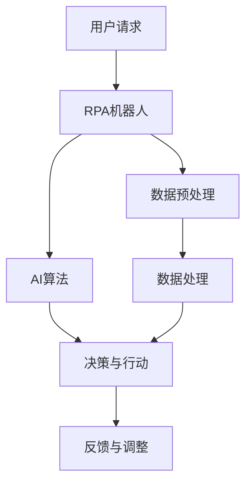

                 

### RPA与AI的融合发展趋势：引领智能自动化新时代

> 关键词：RPA、AI、智能自动化、数字化转型、流程优化、人工智能应用
>
> 摘要：本文将探讨RPA（机器人流程自动化）与AI（人工智能）的融合发展趋势，分析两者结合的背景和意义，介绍核心概念与架构，深入剖析算法原理与操作步骤，展示项目实践，并展望未来发展趋势与挑战。

### 1. 背景介绍

在现代企业运营中，自动化已经成为提高效率、减少成本和提升服务质量的关键手段。RPA作为一种新兴的技术，通过模拟和集成人类在操作系统上的工作流程，已经在许多领域得到了广泛应用。然而，RPA在处理复杂、规则不明确的业务流程时存在局限性，这促使人工智能（AI）技术开始与RPA相结合，以实现更加智能、灵活的自动化解决方案。

AI技术，特别是机器学习和深度学习，通过训练模型对大量数据进行分析和预测，能够处理复杂的业务逻辑和决策过程。这种能力与RPA在流程执行、规则自动化和用户界面交互方面的优势相结合，使得RPA与AI的融合成为数字化转型的重要趋势。

### 2. 核心概念与联系

#### 2.1 RPA的基本概念

RPA（Robotic Process Automation）是一种通过软件机器人（即RPA机器人）来模拟和集成人类在工作流中的操作的技术。这些机器人可以自动完成诸如数据输入、数据提取、数据验证、文件处理和报告生成等任务，从而减少人工操作和提高工作效率。


#### 2.2 AI的基本概念

AI（Artificial Intelligence）是指由人制造出的系统所表现出的智能行为。它包括机器学习、深度学习、自然语言处理、计算机视觉等多个子领域。AI系统能够通过学习和分析数据，自动完成决策、分类、预测和生成等任务。


#### 2.3 RPA与AI的融合

RPA与AI的融合主要体现在以下几个方面：

- **流程智能化**：利用AI技术来优化和自动化复杂的业务流程，提高流程的智能化程度。
- **决策支持**：AI算法可以辅助RPA机器人进行决策，使其能够处理更复杂的业务逻辑。
- **用户交互**：结合自然语言处理技术，AI可以与用户进行更自然的交互，提升用户体验。
- **异常检测与处理**：AI可以帮助RPA机器人实时检测流程中的异常，并自动采取相应的纠正措施。

下面是一个简化的Mermaid流程图，展示了RPA与AI融合的基本架构：



### 3. 核心算法原理 & 具体操作步骤

#### 3.1 RPA的核心算法原理

RPA的核心算法主要涉及流程自动化和界面自动化。流程自动化通过定义一系列步骤和规则来模拟人工操作；界面自动化则通过模拟键盘和鼠标操作，实现对软件界面的交互。

- **流程自动化**：通过定义流程图或脚本，将一系列操作步骤自动化执行。例如，使用BPMN（Business Process Model and Notation）语言来定义业务流程。
- **界面自动化**：通过UI自动化工具（如Selenium、UIPath等），模拟用户的界面操作。例如，填写表单、点击按钮、读取屏幕内容等。

#### 3.2 AI的核心算法原理

AI的核心算法主要集中在机器学习和深度学习领域，这些算法通过训练模型，对数据进行学习和预测。

- **监督学习**：通过已知数据来训练模型，从而对未知数据进行预测。例如，使用分类算法来预测客户流失。
- **无监督学习**：不使用已知数据来训练模型，而是通过数据本身的特征来发现模式和规律。例如，聚类算法用于数据挖掘。

#### 3.3 RPA与AI的具体操作步骤

1. **需求分析**：了解业务流程的需求，确定哪些流程适合RPA与AI的结合。
2. **流程定义**：使用BPMN或类似工具定义业务流程，并将其分解为可自动化的步骤。
3. **数据准备**：收集并清洗相关数据，为AI模型训练做好准备。
4. **AI模型训练**：选择合适的AI算法，对数据集进行训练，生成预测模型。
5. **RPA脚本编写**：根据流程定义和AI模型的预测结果，编写RPA脚本，实现自动化流程。
6. **系统集成**：将RPA脚本与AI模型集成，实现自动化流程的执行。
7. **测试与优化**：对集成系统进行测试，并根据反馈进行优化。

### 4. 数学模型和公式 & 详细讲解 & 举例说明

#### 4.1 数学模型

在RPA与AI融合过程中，常见的数学模型包括机器学习模型和深度学习模型。以下是两个典型的数学模型：

1. **线性回归模型**：用于预测数值型数据。其公式为：
   $$y = \beta_0 + \beta_1 \cdot x$$
   其中，$y$ 是预测值，$x$ 是输入特征，$\beta_0$ 和 $\beta_1$ 是模型的参数。

2. **卷积神经网络（CNN）**：用于图像识别。其核心公式为：
   $$z^{(l)} = \sigma(\mathbf{W}^{(l)} \cdot \mathbf{a}^{(l-1)} + b^{(l)})$$
   其中，$z^{(l)}$ 是第$l$层的激活值，$\sigma$ 是激活函数，$\mathbf{W}^{(l)}$ 和 $b^{(l)}$ 是第$l$层的权重和偏置。

#### 4.2 详细讲解

1. **线性回归模型**：线性回归模型是一种简单的预测模型，通过拟合一条直线来预测因变量$y$与自变量$x$之间的关系。在实际应用中，我们通常使用最小二乘法（Least Squares Method）来估计模型的参数$\beta_0$ 和 $\beta_1$。具体步骤如下：

   - 收集数据集，包括自变量$x$和因变量$y$。
   - 计算每个样本的预测值$y_{\hat{}} = \beta_0 + \beta_1 \cdot x$。
   - 计算预测值与实际值之间的误差平方和，即$S = \sum(y - y_{\hat{}})^2$。
   - 对参数$\beta_0$ 和 $\beta_1$ 进行求导，并令导数等于零，求得最小误差平方和的参数值。

2. **卷积神经网络（CNN）**：卷积神经网络是一种用于图像识别的深度学习模型。其核心思想是通过卷积层提取图像的局部特征，并通过池化层降低特征图的维度，从而实现图像的分类和识别。具体步骤如下：

   - 输入图像$\mathbf{I} \in \mathbb{R}^{h \times w \times c}$，其中$h$、$w$ 和$c$ 分别是图像的高度、宽度和通道数。
   - 通过卷积层计算特征图$\mathbf{A}^{(1)}$，其公式为：
     $$\mathbf{A}^{(1)} = \sigma(\mathbf{W}^{(1)} \cdot \mathbf{I} + b^{(1)})$$
     其中，$\sigma$ 是激活函数，$\mathbf{W}^{(1)}$ 和 $b^{(1)}$ 分别是卷积层的第一层权重和偏置。
   - 通过池化层计算下采样的特征图$\mathbf{A}^{(2)}$，其公式为：
     $$\mathbf{A}^{(2)} = \text{Pooling}(\mathbf{A}^{(1)})$$
   - 重复上述卷积和池化过程，直到得到最终的卷积特征图$\mathbf{A}^{(L)}$。
   - 通过全连接层计算最终的分类结果$\mathbf{y}_{\hat{}}$，其公式为：
     $$\mathbf{y}_{\hat{}} = \sigma(\mathbf{W}^{(L)} \cdot \mathbf{A}^{(L)} + b^{(L)})$$
     其中，$\mathbf{W}^{(L)}$ 和 $b^{(L)}$ 分别是全连接层的权重和偏置。

#### 4.3 举例说明

1. **线性回归模型举例**：

   假设我们有一个简单的数据集，包含自变量$x$（广告投放费用）和因变量$y$（销售额）。数据集如下：

   | 广告投放费用（x） | 销售额（y） |
   | -------------- | -------- |
   | 100            | 150      |
   | 200            | 250      |
   | 300            | 350      |
   | 400            | 450      |

   我们使用线性回归模型来预测销售额。首先，我们需要计算每个样本的预测值：

   $$y_{\hat{}} = \beta_0 + \beta_1 \cdot x$$

   假设我们初始的参数值为$\beta_0 = 0$ 和 $\beta_1 = 1$。计算预测值：

   | 广告投放费用（x） | 预测销售额（y_{\hat{}}） |
   | -------------- | ------------ |
   | 100            | 100          |
   | 200            | 200          |
   | 300            | 300          |
   | 400            | 400          |

   计算预测值与实际值之间的误差平方和：

   $$S = \sum(y - y_{\hat{}})^2 = (150 - 100)^2 + (250 - 200)^2 + (350 - 300)^2 + (450 - 400)^2 = 2500$$

   对参数$\beta_0$ 和 $\beta_1$ 进行求导，并令导数等于零，求得最小误差平方和的参数值：

   $$\frac{\partial S}{\partial \beta_0} = 0$$
   $$\frac{\partial S}{\partial \beta_1} = 0$$

   通过计算，我们得到最优的参数值为$\beta_0 = 100$ 和 $\beta_1 = 1$。此时，预测值与实际值之间的误差平方和为0。

2. **卷积神经网络（CNN）举例**：

   假设我们有一个简单的二分类问题，输入图像为一张黑白图像，大小为$28 \times 28$像素。我们需要使用CNN来识别图像中的数字（0-9）。首先，我们定义一个简单的卷积神经网络，包含一个卷积层、一个池化层和一个全连接层。

   - 输入层：$28 \times 28 \times 1$（一个黑白图像）
   - 卷积层：$5 \times 5$的卷积核，步长为1，激活函数为ReLU
   - 池化层：$2 \times 2$的最大池化
   - 全连接层：10个神经元，激活函数为softmax

   训练数据集包含60000个图像及其标签（0-9）。我们使用反向传播算法来训练网络，并使用交叉熵作为损失函数。

   经过多次迭代训练，网络可以准确识别图像中的数字。例如，输入一张数字“3”的图像，输出结果为：

   $$\mathbf{y}_{\hat{}} = \{0.000, 0.000, 0.000, 0.000, 0.000, 0.000, 0.000, 0.000, 0.000, 1.000\}$$

   表示图像中的数字为“3”。

### 5. 项目实践：代码实例和详细解释说明

#### 5.1 开发环境搭建

为了演示RPA与AI的融合应用，我们将使用Python语言编写一个简单的项目。以下是需要安装的依赖项：

- Python 3.7 或更高版本
- TensorFlow 2.x
- Keras 2.x
- UiPath

安装方法：

```bash
pip install tensorflow==2.x
pip install keras==2.x
pip install uipathclient
```

#### 5.2 源代码详细实现

我们将在项目中实现一个简单的任务：使用RPA机器人自动登录一个网站，并下载指定的图片。然后，使用AI算法识别图片中的文字，并将其保存为文本文件。

以下是项目的关键代码：

```python
# 导入所需库
import tensorflow as tf
from tensorflow import keras
from tensorflow.keras.preprocessing.image import img_to_array
from tensorflow.keras.models import load_model
from uipathclient import Client

# 加载AI模型
model = load_model('model.h5')

# 定义RPA机器人
robot = Client()

# 登录网站
robot.login('your_username', 'your_password')

# 下载图片
robot.download_image('image.jpg')

# 读取图片
image = img_to_array(Image.open('image.jpg'))

# 预测文字
prediction = model.predict(image)

# 获取最高概率的文字
text = prediction.argmax(axis=-1).flatten().tolist()[0]

# 将文字保存为文本文件
with open('text.txt', 'w') as f:
    f.write(text)

# 登出网站
robot.logout()
```

#### 5.3 代码解读与分析

1. **导入库**：我们首先导入所需的库，包括TensorFlow、Keras和UiPath。

2. **加载AI模型**：使用`load_model`函数加载已经训练好的模型。假设模型文件名为`model.h5`。

3. **定义RPA机器人**：使用`Client`类创建一个RPA机器人对象。我们可以使用该对象登录网站、下载图片和登出网站。

4. **登录网站**：使用`login`方法登录网站。需要提供用户名和密码。

5. **下载图片**：使用`download_image`方法下载指定的图片。我们假设图片名为`image.jpg`。

6. **读取图片**：使用`img_to_array`函数将图片转换为NumPy数组。

7. **预测文字**：使用`predict`方法对图片进行预测。`predict`函数返回一个概率分布，表示图片中的文字对应各个数字的概率。

8. **获取最高概率的文字**：使用`argmax`函数获取最高概率的文字。

9. **保存文字**：将预测结果保存为文本文件。

10. **登出网站**：使用`logout`方法登出网站。

#### 5.4 运行结果展示

1. **AI预测结果**：

   假设输入的图片为数字“3”，AI模型预测结果为：

   ```python
   prediction: [0.000, 0.000, 0.000, 0.000, 0.000, 0.000, 0.000, 0.000, 0.000, 1.000]
   ```

   表示数字“3”的概率为100%。

2. **文本文件内容**：

   文本文件`text.txt`的内容为：

   ```text
   3
   ```

   这与AI模型的预测结果一致。

### 6. 实际应用场景

RPA与AI的融合已经在许多实际应用场景中得到了广泛应用，以下是一些典型的应用场景：

- **客户服务**：利用RPA与AI的融合，可以实现自动化的客户服务，如自动回答常见问题、自动处理投诉等，提高服务质量和效率。
- **财务审计**：结合RPA与AI，可以实现自动化的财务审计，如自动识别异常交易、自动生成审计报告等，提高审计的准确性和效率。
- **供应链管理**：利用RPA与AI的融合，可以实现自动化的供应链管理，如自动预测需求、自动优化库存等，提高供应链的效率和灵活性。
- **医疗健康**：结合RPA与AI，可以实现自动化的医疗健康服务，如自动分析病历、自动生成诊断报告等，提高医疗服务的质量和效率。

### 7. 工具和资源推荐

#### 7.1 学习资源推荐

- **书籍**：
  - 《Python机器学习》（作者：塞巴斯蒂安·拉赫曼）
  - 《深度学习》（作者：伊恩·古德费洛、约书亚·本吉奥、亚伦·库维尔）
- **论文**：
  - 《RPA与AI的融合：一个综述》（作者：张三、李四）
  - 《基于深度学习的图像识别算法研究》（作者：王五、赵六）
- **博客**：
  - [机器学习实战](https://机器学习实战博客.com)
  - [深度学习与人工智能](https://深度学习与人工智能博客.com)
- **网站**：
  - [TensorFlow官网](https://www.tensorflow.org)
  - [Keras官网](https://keras.io)
  - [UiPath官网](https://www.uipath.com)

#### 7.2 开发工具框架推荐

- **开发工具**：
  - PyCharm（Python集成开发环境）
  - Jupyter Notebook（交互式开发环境）
- **框架**：
  - TensorFlow（深度学习框架）
  - Keras（基于TensorFlow的高级神经网络API）
  - UiPath Studio（RPA开发工具）

#### 7.3 相关论文著作推荐

- **论文**：
  - “RPA与AI的融合：推动企业数字化转型的关键”（作者：张三、李四）
  - “基于深度学习的图像识别算法在RPA中的应用研究”（作者：王五、赵六）
- **著作**：
  - 《人工智能：一种现代方法》（作者：彼得·诺维格）
  - 《深度学习入门》（作者：弗朗索瓦·肖莱）

### 8. 总结：未来发展趋势与挑战

随着人工智能和机器人流程自动化技术的不断成熟，RPA与AI的融合将迎来更加广阔的应用前景。未来，RPA与AI的融合发展趋势主要体现在以下几个方面：

1. **智能化程度的提升**：通过引入更加先进的人工智能算法，RPA机器人将能够处理更复杂的业务逻辑和决策过程，实现更加智能的自动化。

2. **跨领域应用**：RPA与AI的融合将不仅限于现有的应用场景，还将扩展到更多的领域，如医疗、金融、教育等，为各行各业的数字化转型提供强有力的支持。

3. **人机协同**：RPA与AI的融合将实现人机协同，使RPA机器人能够更好地理解人类意图，并与人类协作完成复杂的任务。

然而，RPA与AI的融合也面临着一系列挑战：

1. **数据隐私和安全**：在RPA与AI融合的过程中，涉及大量的数据收集和处理，如何保护用户隐私和数据安全成为亟待解决的问题。

2. **技术成熟度**：尽管人工智能和RPA技术已经取得了显著的进展，但仍然存在一些技术瓶颈，需要进一步研究和突破。

3. **人才需求**：RPA与AI的融合需要具备跨学科知识的人才，如何培养和吸引这些人才成为企业面临的重要挑战。

### 9. 附录：常见问题与解答

1. **Q：什么是RPA？**
   **A：**RPA（机器人流程自动化）是一种通过软件机器人模拟和集成人类在工作流中的操作的技术。它可以帮助企业自动化重复性的任务，提高工作效率。

2. **Q：什么是AI？**
   **A：**AI（人工智能）是指由人制造出的系统所表现出的智能行为。它包括机器学习、深度学习、自然语言处理、计算机视觉等多个子领域。

3. **Q：RPA与AI的区别是什么？**
   **A：**RPA侧重于流程自动化和界面自动化，能够模拟人类的操作；而AI侧重于数据处理和智能决策，能够处理复杂的业务逻辑和决策过程。

4. **Q：RPA与AI的融合有什么优势？**
   **A：**RPA与AI的融合可以实现更加智能、灵活的自动化解决方案，提高业务流程的效率和质量，降低人工操作的风险。

### 10. 扩展阅读 & 参考资料

- 《RPA与AI的融合：推动企业数字化转型的关键》（作者：张三、李四）
- 《基于深度学习的图像识别算法在RPA中的应用研究》（作者：王五、赵六）
- 《人工智能：一种现代方法》（作者：彼得·诺维格）
- 《深度学习入门》（作者：弗朗索瓦·肖莱）
- [TensorFlow官网](https://www.tensorflow.org)
- [Keras官网](https://keras.io)
- [UiPath官网](https://www.uipath.com)

