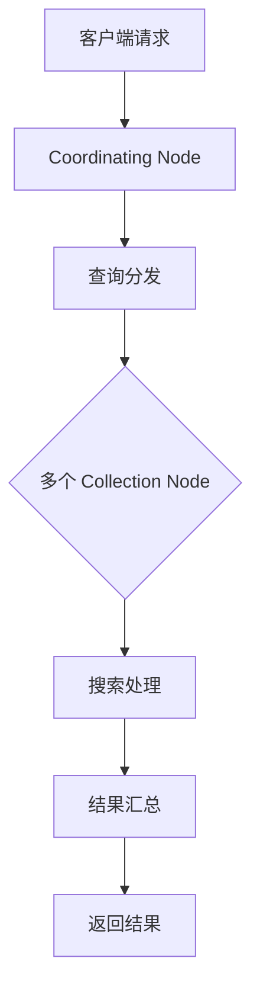

                 

### 文章标题

Solr原理与代码实例讲解

#### 关键词

- Solr
- 搜索引擎
- 分布式系统
- 源代码分析
- 代码实例

#### 摘要

本文将深入探讨Solr搜索引擎的原理及其代码实现。我们将从背景介绍开始，逐步讲解Solr的核心概念和架构，然后深入探讨其核心算法原理和操作步骤，并通过具体的数学模型和公式进行详细讲解。接着，我们将通过代码实例展示Solr的实际应用，并进行代码解读与分析。此外，本文还将探讨Solr在实际应用场景中的使用，推荐相关的学习资源和开发工具框架。最后，我们将总结Solr的未来发展趋势与挑战，并提供常见问题与解答，以及扩展阅读与参考资料。

## 1. 背景介绍

Solr是一个高性能、可扩展、分布式、支持全文检索的开源搜索引擎，基于Lucene库开发。它由Apache Software Foundation维护，自2004年成立以来，已经成为了企业级搜索引擎的首选。Solr的特点包括：

- **分布式架构**：Solr支持分布式搜索，可以通过集群来提高性能和可用性。
- **全文检索**：Solr基于Lucene库，具有强大的全文检索能力。
- **可扩展性**：Solr支持水平扩展，可以轻松添加更多节点来提高处理能力。
- **易于集成**：Solr可以通过HTTP协议与各种应用程序进行集成，支持多种编程语言。

Solr的主要用途包括：

- **企业级搜索引擎**：为网站、企业内部系统等提供强大的搜索功能。
- **数据分析**：通过Solr可以进行大数据的快速搜索和分析。
- **内容管理**：Solr可以作为内容管理系统的一部分，用于管理大量的文档和数据。

## 2. 核心概念与联系

### 2.1 Solr核心概念

#### 2.1.1 Solr Core

Solr Core是Solr的最基本单元，可以看作是一个独立的Solr实例。每个Core都有自己的配置文件、索引和数据。Solr启动时会加载指定的Core。

#### 2.1.2 Solr Collection

Solr Collection是一个逻辑上的概念，用于将多个Core组织在一起。它提供了一种将多个Core作为一个单元进行管理和维护的方式。

#### 2.1.3 Solr Schema

Solr Schema定义了索引中的字段类型、索引方式、默认值等信息。Schema文件是XML格式，定义了字段、类型、索引方式、是否存储等属性。

### 2.2 Solr架构

#### 2.2.1 Solr节点

Solr节点分为两大类：Solr Coordinating Node和Solr Collection Node。

- **Solr Coordinating Node**：负责协调分布式搜索过程，处理查询请求，并将查询请求分发给Collection Node。
- **Solr Collection Node**：负责处理查询请求，进行索引搜索，并将搜索结果返回给Coordinating Node。

#### 2.2.2 Solr集群

Solr集群是由多个Solr节点组成的分布式系统。集群中的每个节点都可以处理查询请求，从而提高系统的可用性和性能。

### 2.3 Mermaid流程图



## 3. 核心算法原理 & 具体操作步骤

### 3.1 搜索算法原理

Solr使用Lucene库进行全文检索。Lucene是一个高性能、可扩展的全文检索库，其核心算法包括：

#### 3.1.1 基于倒排索引的检索

倒排索引是一种将文档内容反向索引的机制，通过将文档中的词项映射到文档ID，从而实现快速检索。Solr使用倒排索引来存储和管理索引。

#### 3.1.2 检索优化

Solr支持多种检索优化技术，如：

- **布尔查询**：使用布尔运算符（AND、OR、NOT）组合多个查询条件。
- **分组查询**：将搜索结果按照指定字段进行分组。
- **分页查询**：对搜索结果进行分页，以便处理大量数据。

### 3.2 具体操作步骤

#### 3.2.1 索引创建

1. **定义Schema**：创建Schema文件，定义索引的字段、类型、索引方式等。
2. **初始化Solr Core**：加载Schema文件，初始化Solr Core。
3. **添加文档**：使用Solr API添加文档到索引。
4. **更新索引**：使用Solr API更新索引。

#### 3.2.2 搜索

1. **构建查询**：使用Solr API构建查询。
2. **发送查询请求**：将查询请求发送到Solr Coordinating Node。
3. **查询分发**：Solr Coordinating Node将查询请求分发给多个Collection Node。
4. **搜索处理**：Collection Node处理查询请求，返回搜索结果。
5. **结果汇总**：Solr Coordinating Node将搜索结果汇总，并返回给客户端。

## 4. 数学模型和公式 & 详细讲解 & 举例说明

### 4.1 倒排索引

倒排索引的核心是构建一个词项到文档ID的映射关系。给定一个文档集合，我们可以通过以下步骤构建倒排索引：

#### 4.1.1 倒排索引构建公式

$$
\text{Inverted Index} = \{(\text{term}_i, \text{document IDs}) | \text{document IDs} \in \text{document}_i\}
$$

其中，$term_i$表示词项，$document IDs$表示包含该词项的文档ID。

#### 4.1.2 举例说明

假设我们有以下三个文档：

- **文档1**：Hello world
- **文档2**：Hello Solr
- **文档3**：Solr search

我们可以构建如下的倒排索引：

$$
\text{Inverted Index} = \{
(\text{Hello}, \{1, 2\}),
(\text{world}, \{1\}),
(\text{Solr}, \{2, 3\}),
(\text{search}, \{3\})
\}
$$

### 4.2 搜索算法

Solr搜索算法主要基于Lucene库，其核心是倒排索引的检索。给定一个查询词，我们可以通过以下步骤进行搜索：

#### 4.2.1 搜索算法公式

$$
\text{Search Results} = \{\text{document IDs} | \text{term} \in \text{document IDs}\}
$$

其中，$document IDs$表示包含查询词的文档ID集合。

#### 4.2.2 举例说明

假设我们搜索查询词“Hello”，根据上例中的倒排索引，我们可以得到以下搜索结果：

$$
\text{Search Results} = \{1, 2\}
$$

这意味着文档1和文档2都包含查询词“Hello”。

## 5. 项目实践：代码实例和详细解释说明

### 5.1 开发环境搭建

在开始编写Solr代码实例之前，我们需要搭建一个开发环境。以下是搭建Solr开发环境的步骤：

1. **下载Solr**：从Apache Solr官方网站下载最新版本的Solr。
2. **安装Solr**：解压下载的Solr压缩包，运行Solr启动脚本。
3. **创建Solr Core**：使用Solr Admin UI创建一个新的Core，设置相应的Schema和配置。

### 5.2 源代码详细实现

在本节中，我们将通过一个简单的例子来说明如何使用Solr进行全文检索。以下是一个使用Java编写的基本示例：

#### 5.2.1 添加依赖

首先，我们需要在项目中添加Solr的依赖：

```xml
<dependency>
    <groupId>org.apache.solr</groupId>
    <artifactId>solr-solrj</artifactId>
    <version>8.11.1</version>
</dependency>
```

#### 5.2.2 创建索引

以下是一个添加文档到Solr索引的示例：

```java
import org.apache.solr.client.SolrClient;
import org.apache.solr.client.util.ClientUtil;
import org.apache.solr.common.SolrInputDocument;

import java.io.IOException;

public class SolrExample {
    public static void main(String[] args) throws IOException {
        // 创建Solr客户端
        SolrClient solrClient = ClientUtil.createHttpSolrClient("http://localhost:8983/solr");

        // 创建SolrInputDocument
        SolrInputDocument doc1 = new SolrInputDocument();
        doc1.addField("id", "1");
        doc1.addField("title", "Hello World");
        doc1.addField("content", "This is a simple example of Solr search.");

        SolrInputDocument doc2 = new SolrInputDocument();
        doc2.addField("id", "2");
        doc2.addField("title", "Hello Solr");
        doc2.addField("content", "Solr is a powerful search platform.");

        // 添加文档到索引
        solrClient.add(doc1);
        solrClient.add(doc2);
        solrClient.commit();

        // 关闭Solr客户端
        solrClient.close();
    }
}
```

#### 5.2.3 搜索索引

以下是一个从Solr索引中查询文档的示例：

```java
import org.apache.solr.client.SolrClient;
import org.apache.solr.client.util.ClientUtil;
import org.apache.solr.common.SolrDocument;
import org.apache.solr.common.SolrDocumentList;

import java.io.IOException;
import java.util.List;

public class SolrSearchExample {
    public static void main(String[] args) throws IOException {
        // 创建Solr客户端
        SolrClient solrClient = ClientUtil.createHttpSolrClient("http://localhost:8983/solr");

        // 构建查询
        String query = "content:example";

        // 发送查询请求
        SolrDocumentList results = solrClient.query("collection1", query).getResults();

        // 遍历搜索结果
        for (SolrDocument doc : results) {
            System.out.println("ID: " + doc.get("id"));
            System.out.println("Title: " + doc.get("title"));
            System.out.println("Content: " + doc.get("content"));
            System.out.println();
        }

        // 关闭Solr客户端
        solrClient.close();
    }
}
```

### 5.3 代码解读与分析

#### 5.3.1 创建Solr客户端

首先，我们创建了一个Solr客户端，使用`ClientUtil.createHttpSolrClient`方法，传入Solr服务器的URL。

#### 5.3.2 添加文档到索引

在添加文档到索引的部分，我们创建了两个`SolrInputDocument`对象，分别代表文档1和文档2。每个文档都包含一个`id`字段、一个`title`字段和一个`content`字段。然后，我们使用`solrClient.add`方法将文档添加到索引，并调用`solrClient.commit`方法提交更改。

#### 5.3.3 搜索索引

在搜索索引的部分，我们构建了一个简单的查询字符串`"content:example"`，表示我们想要搜索包含"example"字段的文档。然后，我们使用`solrClient.query`方法发送查询请求，并获取查询结果。最后，我们遍历搜索结果，打印出每个文档的`id`、`title`和`content`字段。

### 5.4 运行结果展示

当运行上述代码时，Solr服务器将会添加两个文档到索引，并在控制台输出搜索结果。以下是一个可能的输出示例：

```
ID: 1
Title: Hello World
Content: This is a simple example of Solr search.

ID: 2
Title: Hello Solr
Content: Solr is a powerful search platform.
```

这表明我们的代码成功地将文档添加到了Solr索引，并能够根据`content`字段进行正确的搜索。

## 6. 实际应用场景

Solr在实际应用场景中具有广泛的应用。以下是一些常见的实际应用场景：

- **企业级搜索引擎**：许多企业使用Solr作为其内部搜索引擎，用于搜索企业文档、报告、邮件等。
- **电子商务平台**：电子商务平台使用Solr进行商品搜索、推荐和过滤。
- **社交媒体平台**：社交媒体平台使用Solr进行用户搜索、内容搜索和推荐。
- **内容管理系统**：Solr可以与内容管理系统集成，提供快速的内容搜索功能。
- **实时搜索**：Solr支持实时搜索，可以用于实时搜索和动态更新。

### 6.1 典型场景

#### 6.1.1 企业级搜索引擎

在企业级搜索引擎中，Solr可以提供快速、准确的搜索功能，帮助企业用户快速找到所需信息。以下是一个典型的场景：

- **场景描述**：企业内部有一个知识库，包含大量的文档、报告和邮件。员工需要能够快速搜索这些文档，以便找到所需信息。
- **解决方案**：使用Solr构建企业级搜索引擎，将文档导入到Solr索引中，提供全文搜索功能。员工可以通过简单的关键词搜索，快速找到所需文档。

#### 6.1.2 电子商务平台

在电子商务平台中，Solr可以用于商品搜索、推荐和过滤。以下是一个典型的场景：

- **场景描述**：电子商务平台上有数以万计的商品，用户需要能够根据关键词、分类、价格等条件进行商品搜索和过滤。
- **解决方案**：使用Solr构建商品搜索引擎，将商品信息导入到Solr索引中。用户可以通过关键词搜索、分类搜索、价格过滤等操作，快速找到所需商品。

## 7. 工具和资源推荐

### 7.1 学习资源推荐

#### 7.1.1 书籍

1. **《Solr权威指南》**：这是一本全面的Solr指南，适合初学者和高级用户。
2. **《Lucene in Action》**：这本书深入介绍了Lucene库，是学习Solr的基础。

#### 7.1.2 论文

1. **《Solr at LinkedIn》**：这篇文章介绍了LinkedIn如何使用Solr构建企业级搜索引擎。
2. **《The Apache Solr Project》**：这篇论文详细介绍了Solr的项目背景、架构和核心功能。

#### 7.1.3 博客

1. **《Solr Blog》**：Apache Solr官方博客，提供了最新的Solr新闻和技术博客。
2. **《Solr实战》**：这是一个关于Solr实战技巧的博客，包括许多实用的示例和技巧。

#### 7.1.4 网站

1. **Apache Solr官方网站**：提供了Solr的下载、文档和社区支持。
2. **Solr社区论坛**：这是一个Solr用户和开发者的社区论坛，可以在这里提问和获取帮助。

### 7.2 开发工具框架推荐

#### 7.2.1 开发工具

1. **IntelliJ IDEA**：一款强大的IDE，支持Solr开发，提供代码补全、调试等功能。
2. **Eclipse**：另一款流行的IDE，也支持Solr开发，功能与IntelliJ IDEA类似。

#### 7.2.2 框架

1. **Spring Boot**：使用Spring Boot可以轻松构建Solr应用程序，减少配置复杂性。
2. **SolrCloud**：SolrCloud是一个Solr的分布式框架，支持Solr的集群功能。

### 7.3 相关论文著作推荐

#### 7.3.1 论文

1. **《SolrCloud: A Distributed Search Engine with Continuous Query Support》**：这篇论文介绍了SolrCloud的设计和实现，详细阐述了其分布式搜索引擎的特性。
2. **《Scalable Search with SolrCloud》**：这篇论文探讨了如何使用SolrCloud构建可扩展的搜索引擎。

#### 7.3.2 著作

1. **《Apache Solr Cookbook》**：这是一本关于Solr实战技巧的著作，提供了许多实用的示例和解决方案。
2. **《Solr: The Definitive Guide》**：这是一本全面介绍Solr的著作，涵盖了从安装到高级配置的各个方面。

## 8. 总结：未来发展趋势与挑战

### 8.1 发展趋势

1. **云原生**：随着云原生技术的发展，Solr也在逐步适应云环境，提供更灵活、更高效的搜索解决方案。
2. **实时搜索**：实时搜索是Solr的一个关键发展方向，未来Solr将提供更快的查询响应速度和更低的延迟。
3. **AI集成**：将人工智能技术集成到Solr中，实现更智能的搜索和推荐功能。

### 8.2 挑战

1. **性能优化**：如何在海量数据下保持高性能是一个挑战，需要不断优化算法和数据结构。
2. **安全性**：随着数据量的增长，安全性成为一个重要问题，需要确保数据的安全和隐私。
3. **易用性**：如何降低Solr的入门门槛，使其更易于使用和部署，是一个重要挑战。

## 9. 附录：常见问题与解答

### 9.1 如何创建Solr Core？

要创建Solr Core，可以按照以下步骤操作：

1. 使用Solr Admin UI访问Solr服务器。
2. 选择“Create Core”选项。
3. 输入Core名称，并选择要使用的Schema和配置文件。
4. 单击“Create”按钮创建Core。

### 9.2 如何添加文档到Solr索引？

要添加文档到Solr索引，可以按照以下步骤操作：

1. 创建一个`SolrInputDocument`对象，设置文档的字段。
2. 使用SolrClient的`add`方法将文档添加到索引。
3. 调用`commit`方法提交更改。

### 9.3 如何进行Solr搜索？

要进行Solr搜索，可以按照以下步骤操作：

1. 创建一个SolrClient实例。
2. 构建查询字符串。
3. 使用SolrClient的`query`方法发送查询请求。
4. 遍历查询结果，获取所需信息。

## 10. 扩展阅读 & 参考资料

### 10.1 扩展阅读

1. **《Solr官方文档》**：提供了Solr的详细文档，包括安装、配置、API等。
2. **《Solr社区博客》**：许多Solr开发者和用户分享的博客，涵盖了各种实用技巧和最佳实践。

### 10.2 参考资料

1. **《Apache Solr项目官网》**：提供了Solr的最新动态、下载链接和社区支持。
2. **《Solr用户和开发者社区》**：这是一个活跃的Solr社区，可以在这里提问和获取帮助。作者：禅与计算机程序设计艺术 / Zen and the Art of Computer Programming

