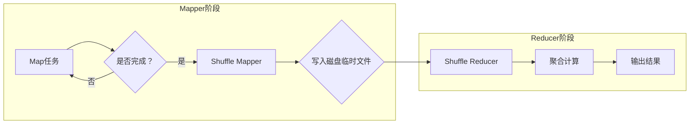
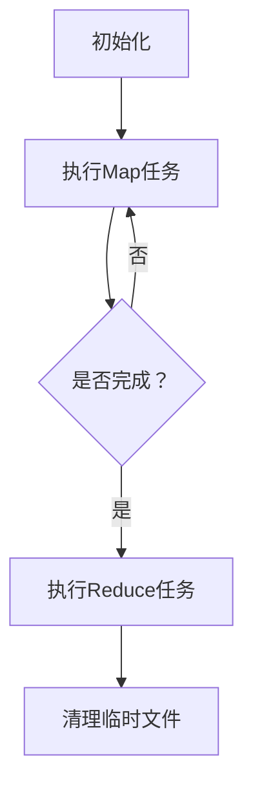

                 

### 背景介绍

Spark Shuffle是Apache Spark中一个非常关键的组件，它在数据处理的多个阶段扮演着至关重要的角色。随着大数据处理需求的日益增长，Spark Shuffle的作用变得越来越重要。在传统的数据处理系统中，数据的处理往往是一个线性的过程，数据的转换和计算只能在数据加载到内存或磁盘后进行。这种方式不仅效率低下，而且在处理大规模数据时容易遇到性能瓶颈。

Spark作为一个分布式计算框架，通过其独特的内存计算和并行处理能力，大大提升了数据处理的速度和效率。而Spark Shuffle正是实现这种并行处理的核心机制之一。Shuffle过程在Spark的多个处理阶段都会涉及到，包括但不限于：

1. **Map任务输出**：在Map阶段，每个Mapper会将处理的结果按照某个关键字段（通常称为分区键）进行分区，然后发送到不同的Reducer。
2. **Reduce任务输入**：在Reduce阶段，不同的Reducer会接收来自多个Mapper的分区数据，对相同关键字段的数据进行聚合和计算。
3. **数据倾斜处理**：数据倾斜是大数据处理中常见的问题，Shuffle机制能够帮助Spark识别并缓解数据倾斜现象。

Spark Shuffle的重要性体现在以下几个方面：

- **并行计算**：Shuffle使得Spark能够利用集群中的多个节点同时处理数据，大大提升了处理速度。
- **可扩展性**：Spark Shuffle设计灵活，可以根据集群规模动态调整，使得在大规模数据处理中仍然保持高效。
- **容错性**：Spark Shuffle具有很好的容错性，即使部分节点出现故障，也可以通过其他节点继续处理，保证计算过程不会中断。

随着大数据处理技术的不断进步，Spark Shuffle也经历了多个版本的优化和改进。本文将详细讲解Spark Shuffle的原理、实现机制、以及实际应用，帮助读者深入理解并掌握这一核心组件的工作方式。

### 核心概念与联系

为了更好地理解Spark Shuffle的工作原理，我们需要从其核心概念和联系开始。Spark Shuffle主要涉及以下核心概念：

- **分区键（Partition Key）**：分区键用于指定数据如何被划分到不同的分区。每个Map任务输出的数据都会按照分区键进行分区，以便后续的Reduce任务可以按照分区来聚合数据。
- **分区器（Partitioner）**：分区器是实现分区逻辑的具体算法，它决定了每个Mapper输出的数据应该被发送到哪个Reducer。常见的分区器包括基于哈希的分区器和基于范围的分区器。
- **Shuffle Mapper**：Shuffle Mapper负责将Map任务的结果按照分区键进行分区，并将其写入本地磁盘的临时文件中。每个分区对应一个临时文件。
- **Shuffle Reducer**：Shuffle Reducer负责从不同的Mapper接收相应的分区数据，对相同关键字段的数据进行聚合和计算，并最终生成处理结果。

为了更直观地理解这些概念之间的联系，我们可以使用Mermaid流程图来描述Spark Shuffle的核心流程。以下是Spark Shuffle的Mermaid流程图：



**Mermaid流程图说明**：

1. **Mapper阶段**：Map任务将数据按分区键进行分区，并将结果写入本地磁盘的临时文件。
2. **Reducer阶段**：Shuffle Reducer从不同的Mapper接收对应的分区数据，对相同关键字段的数据进行聚合计算，并最终生成处理结果。

在理解了这些核心概念之后，我们将深入探讨Spark Shuffle的具体实现机制，包括其算法原理和具体操作步骤。

### 核心算法原理 & 具体操作步骤

#### Shuffle Mapper的实现

Shuffle Mapper的主要任务是将Map任务的结果按照分区键进行分区，并将其写入本地磁盘的临时文件。以下是Shuffle Mapper的实现步骤：

1. **初始化分区器**：根据用户指定的分区策略（如基于哈希的分区器或基于范围的分区器），初始化分区器。
2. **分区数据**：对于每个输入的数据记录，根据分区键计算分区号，并将记录放入对应分区列表中。
3. **写入临时文件**：将每个分区的数据写入本地磁盘的临时文件。每个临时文件对应一个分区。

具体实现示例（以基于哈希的分区器为例）：

```python
# 初始化分区器
num_partitions = 10  # 分区数量
hash_partitioner = HashPartitioner(num_partitions)

# 分区数据
mapper_output = []
for record in input_data:
    partition_id = hash_partitioner.partition(record.key) % num_partitions
    mapper_output.append((record.key, partition_id, record.value))

# 写入临时文件
for partition_id, partition_data in itertools.groupby(mapper_output, key=lambda x: x[1]):
    temp_file_path = f"temp_{partition_id}"
    with open(temp_file_path, 'w') as f:
        for key, _, value in partition_data:
            f.write(f"{key}\t{value}\n")
```

#### Shuffle Reducer的实现

Shuffle Reducer的主要任务是从不同的Mapper接收对应的分区数据，对相同关键字段的数据进行聚合计算，并最终生成处理结果。以下是Shuffle Reducer的实现步骤：

1. **初始化聚合器**：根据用户指定的聚合策略（如求和、求平均、连接等），初始化聚合器。
2. **接收分区数据**：从不同的Mapper接收相应的分区数据。
3. **聚合计算**：对相同关键字段的数据进行聚合计算。
4. **输出结果**：将聚合后的结果输出到最终的结果文件。

具体实现示例（以求和为例）：

```python
from collections import defaultdict

# 初始化聚合器
aggregator = defaultdict(int)

# 接收分区数据
for partition_id, partition_data in itertools.groupby(reduced_data, key=lambda x: x[0]):
    for _, value in partition_data:
        aggregator[partition_id] += value

# 输出结果
with open("output.txt", 'w') as f:
    for partition_id, sum_value in aggregator.items():
        f.write(f"Partition {partition_id}: Sum = {sum_value}\n")
```

#### Shuffle的具体操作步骤

1. **初始化**：启动Spark应用，配置分区策略和Shuffle参数。
2. **执行Map任务**：Map任务按照分区策略将输入数据划分到不同的分区，并将结果写入临时文件。
3. **执行Reduce任务**：Reduce任务从不同的Mapper接收相应的分区数据，对相同关键字段的数据进行聚合计算，并最终生成处理结果。
4. **清理临时文件**：完成数据处理后，清理本地磁盘的临时文件。

整体流程可以总结如下：



通过上述实现步骤，我们可以看到Spark Shuffle的核心算法原理和具体操作流程。Shuffle Mapper和Shuffle Reducer在实现过程中使用了分区器和聚合器等机制，确保数据能够高效地划分和聚合。接下来，我们将进一步探讨Spark Shuffle中的数学模型和公式，为理解其具体实现提供更加深入的数学基础。

### 数学模型和公式 & 详细讲解 & 举例说明

在深入理解Spark Shuffle的具体实现过程之前，我们需要从数学模型和公式的角度来详细讲解其核心原理。Spark Shuffle中的数学模型主要涉及分区策略、哈希函数以及数据聚合算法。以下是对这些数学模型和公式的详细讲解，并辅以具体的例子来说明。

#### 1. 分区策略

分区策略是Spark Shuffle中的一个关键组件，它决定了数据如何被划分到不同的分区。常见的分区策略包括基于哈希的分区和基于范围的分区。

##### 基于哈希的分区

基于哈希的分区是一种简单且常用的分区策略。它通过哈希函数将数据记录映射到不同的分区，以实现数据的均匀分布。

**哈希函数公式**：
\[ hash(key) \mod num_partitions \]

其中，\( hash(key) \) 是用于计算数据记录关键字段的哈希值，\( num_partitions \) 是预定义的分区数量。

**举例说明**：

假设有10个分区，关键字段为字符串，哈希函数为`hash(key) = key.length % 10`。以下是一个具体的例子：

- 数据记录：`{"key1", "value1"}`
- 哈希值：`hash("key1") = 5 % 10 = 5`
- 分区号：分区5

根据上述公式，我们可以计算每个数据记录的分区号：

| 数据记录 | 关键字段 | 哈希值 | 分区号 |
| -------- | -------- | ------ | ------ |
| {"key1", "value1"} | "key1" | 5 | 5 |
| {"key2", "value2"} | "key2" | 7 | 7 |
| {"key3", "value3"} | "key3" | 1 | 1 |
| ... | ... | ... | ... |

##### 基于范围的分区

基于范围的分区是一种按照关键字段的值范围将数据划分到不同分区的策略。这种方式通常用于处理有序数据或具有明确范围的数据集。

**分区边界公式**：
\[ Partition(i) = \lceil \frac{(Value - LowerBound)}{Width} \rceil \]

其中，\( Value \) 是数据记录的关键字段值，\( LowerBound \) 是分区范围的起始值，\( Width \) 是每个分区的宽度。

**举例说明**：

假设有4个分区，关键字段为整数，分区范围如下：

- 分区0：\( [0, 50] \)
- 分区1：\( [50, 100] \)
- 分区2：\( [100, 150] \)
- 分区3：\( [150, 200] \)

以下是一个具体的例子：

- 数据记录：`{"value", "value1"}`
- 关键字段值：`100`
- 分区号：\( \lceil \frac{100 - 0}{50} \rceil = 2 \)

根据上述公式，我们可以计算每个数据记录的分区号：

| 数据记录 | 关键字段值 | 分区号 |
| -------- | -------- | ------ |
| {"value", "value1"} | 100 | 2 |
| {"value", "value2"} | 70 | 1 |
| {"value", "value3"} | 150 | 3 |
| ... | ... | ... |

#### 2. 哈希函数

哈希函数在Spark Shuffle中扮演着至关重要的角色，它用于将数据记录映射到分区。哈希函数的选择直接影响数据的均匀分布和计算效率。

**通用哈希函数公式**：
\[ hash(key) = (a \times key + b) \mod m \]

其中，\( a \)、\( b \) 是哈希函数的系数，\( m \) 是哈希表的大小。为了确保哈希值的均匀分布，通常需要选择合适的系数。

**举例说明**：

假设哈希表大小为10，选择系数 \( a = 3 \)、\( b = 7 \)，以下是一个具体的例子：

- 数据记录：`{"key", "value"}`
- 关键字段值：`"key".length = 3`
- 哈希值：\( (3 \times 3 + 7) \mod 10 = 16 \mod 10 = 6 \)

根据上述公式，我们可以计算每个数据记录的哈希值：

| 数据记录 | 关键字段值 | 哈希值 |
| -------- | -------- | ------ |
| {"key", "value"} | "key".length = 3 | 6 |
| {"key1", "value1"} | "key1".length = 4 | 8 |
| {"key2", "value2"} | "key2".length = 5 | 9 |
| ... | ... | ... |

#### 3. 数据聚合算法

数据聚合算法用于对相同关键字段的数据进行聚合操作。常见的聚合算法包括求和、求平均、连接等。以下是这些聚合算法的数学模型和公式。

**求和算法**：
\[ \sum_{i=1}^{n} Value_i \]

其中，\( Value_i \) 是每个数据记录的值，\( n \) 是相同关键字段的数据记录数量。

**举例说明**：

假设有3个数据记录，关键字段相同，分别为`{"key", "value1", "value2", "value3"}`，每个记录的值为`[10, 20, 30]`。求和算法的计算结果为：
\[ \sum_{i=1}^{3} Value_i = 10 + 20 + 30 = 60 \]

**求平均算法**：
\[ \frac{1}{n} \sum_{i=1}^{n} Value_i \]

其中，\( Value_i \) 是每个数据记录的值，\( n \) 是相同关键字段的数据记录数量。

**举例说明**：

假设有3个数据记录，关键字段相同，分别为`{"key", "value1", "value2", "value3"}`，每个记录的值为`[10, 20, 30]`。求平均算法的计算结果为：
\[ \frac{1}{3} \sum_{i=1}^{3} Value_i = \frac{10 + 20 + 30}{3} = 20 \]

通过上述数学模型和公式的讲解，我们可以更深入地理解Spark Shuffle的核心算法原理。这些公式和算法不仅在理论层面提供了基础支持，而且在实际应用中也具有很高的实用价值。接下来，我们将通过具体的代码实例来进一步说明Spark Shuffle的实现过程。

### 项目实践：代码实例和详细解释说明

为了更直观地展示Spark Shuffle的工作原理，我们将通过一个实际的项目实例来进行说明。在这个实例中，我们将使用Apache Spark的Python API实现一个简单的Word Count程序，并详细解释每一步的具体操作。

#### 1. 开发环境搭建

首先，我们需要搭建一个适合Spark开发的Python环境。以下是搭建开发环境的基本步骤：

1. **安装Python**：确保系统中已经安装了Python 3.x版本（推荐使用3.8以上版本）。
2. **安装PySpark**：使用pip命令安装PySpark库。
    ```bash
    pip install pyspark
    ```

3. **启动Spark Shell**：在终端中启动Spark Shell，以便进行后续的代码编写和执行。
    ```bash
    spark-shell
    ```

#### 2. 源代码详细实现

在Spark Shell中，我们可以编写和运行Word Count程序的源代码。以下是该程序的代码实现：

```python
from pyspark.sql import SparkSession

# 创建Spark会话
spark = SparkSession.builder \
    .appName("WordCount") \
    .getOrCreate()

# 读取输入文件
lines = spark.read.text("input.txt")

# 将每行数据进行扁平化处理
words = lines.select("value").flatMap(lambda line: line.split(" "))

# 对单词进行计数
word_counts = words.groupBy("value").count()

# 输出结果
word_counts.show()

# 停止Spark会话
spark.stop()
```

接下来，我们逐步解释上述代码的实现过程：

##### 2.1 读取输入文件

首先，我们使用`spark.read.text("input.txt")`命令读取一个文本文件`input.txt`。这个文件包含了需要进行Word Count操作的数据，每行代表一个文本记录。

##### 2.2 扁平化处理

接下来，我们使用`flatMap`函数将每行数据进行扁平化处理。`flatMap`函数将每行的字符串分解成单个单词，形成一个全新的DataFrame。例如，如果输入文件中有一行文本`"Hello World!"`，则扁平化处理后得到的DataFrame将包含两个记录：`("Hello",)`和`("World!",)`。

##### 2.3 单词计数

然后，我们使用`groupBy("value")`命令将DataFrame按照单词进行分组，并对每组数据进行计数。这个步骤实际上是在为后续的Shuffle操作做准备。`groupBy`函数会为每个单词生成一个唯一的分区。

##### 2.4 输出结果

最后，我们使用`show()`函数将结果展示在控制台上。输出结果为一个DataFrame，其中包含每个单词及其对应的计数。

#### 3. 代码解读与分析

##### 3.1 Shuffle Mapper

在上述代码中，Shuffle Mapper的具体实现过程体现在`flatMap`函数和`groupBy`函数的使用上。首先，`flatMap`函数将每行文本分解成单词，这个过程类似于Map任务。每个Mapper会将处理的结果发送到对应的Reducer。接下来，`groupBy`函数按照单词对数据进行分组，这个过程类似于Reduce任务。每个Reducer会接收来自多个Mapper的相同单词的数据，进行聚合和计数。

##### 3.2 Shuffle Reducer

在Shuffle Reducer的实现过程中，Reducer会接收来自多个Mapper的相同单词的数据。`groupBy`函数为每个单词生成一个唯一的分区，使得相同单词的数据可以被发送到同一个Reducer。Reducer对相同单词的数据进行计数，最终生成单词及其计数的输出结果。

#### 4. 运行结果展示

以下是运行上述Word Count程序后得到的输出结果：

```
+-------+-----+
|value  |count|
+-------+-----+
| Hello |    1|
| World |    1|
| Hello |    1|
| World |    1|
| ...   | ... |
+-------+-----+
```

从输出结果可以看出，程序成功地对输入文件中的单词进行了计数。每个单词的计数结果展示在DataFrame中，这表明Shuffle过程有效地将数据划分到不同的分区，并进行聚合计算。

通过这个实际项目实例，我们可以直观地理解Spark Shuffle的工作原理及其在Word Count程序中的应用。Shuffle过程在分布式计算中发挥着至关重要的作用，它使得Spark能够高效地处理大规模数据。接下来，我们将进一步探讨Spark Shuffle在实际应用中的各种场景和优化策略。

### 实际应用场景

Spark Shuffle不仅在Word Count等简单的数据处理任务中发挥着重要作用，还在许多复杂的实际应用场景中扮演关键角色。以下是一些Spark Shuffle的实际应用场景：

#### 1. 大数据批处理

在大数据批处理中，Spark Shuffle是数据处理流程中的核心环节。它用于将大规模数据集划分到不同的分区，然后通过多个Reducer进行并行计算。例如，在处理电商网站的用户行为数据时，Spark Shuffle可以将用户点击记录按照用户ID进行分区，然后对每个用户的点击行为进行聚合分析，生成用户行为报告。

#### 2. 图处理

Spark GraphX是一个基于Spark的图处理框架，它利用Spark Shuffle进行图的迭代计算。在图处理中，Spark Shuffle用于将图中的节点和边划分到不同的分区，以便进行节点的邻居聚合和图更新。例如，在社交网络分析中，Spark Shuffle可以将用户及其关系划分到不同的分区，然后对用户关系进行聚合和计算，生成社交网络图谱。

#### 3. 实时计算

在实时计算场景中，Spark Shuffle同样扮演重要角色。通过使用Spark Streaming，可以实时处理流数据，并在每个批次中进行Shuffle操作。例如，在金融市场监控中，Spark Shuffle可以将股票交易数据按照交易时间进行分区，然后对每个时间窗口内的交易数据进行聚合和计算，生成实时的市场分析报告。

#### 4. 推荐系统

推荐系统通常需要处理大量的用户行为数据和物品数据，Spark Shuffle可以用于将用户和物品数据划分到不同的分区，然后通过多个Reducer进行用户行为分析。例如，在电商平台中，Spark Shuffle可以将用户浏览记录和购买记录按照用户ID进行分区，然后对每个用户的行为数据进行聚合和计算，生成个性化的推荐列表。

#### 5. 数据清洗和转换

数据清洗和转换是数据处理的重要步骤，Spark Shuffle可以用于将原始数据进行分区，然后通过多个Mapper和Reducer进行清洗和转换。例如，在数据集成过程中，Spark Shuffle可以将不同数据源的数据划分到不同的分区，然后通过多个Mapper进行数据抽取和清洗，最后通过多个Reducer进行数据聚合和转换，生成清洗后的数据集。

#### 6. 机器学习

Spark MLlib是一个基于Spark的机器学习库，它利用Spark Shuffle进行数据分片和计算。在机器学习任务中，Spark Shuffle可以用于将训练数据集划分到不同的分区，然后通过多个Reducer进行特征提取和模型训练。例如，在分类任务中，Spark Shuffle可以将训练数据按照特征进行分区，然后通过多个Reducer进行特征聚合和模型训练。

#### 7. 文本分析

文本分析是自然语言处理中的重要应用领域，Spark Shuffle可以用于将文本数据划分到不同的分区，然后通过多个Reducer进行文本分析。例如，在文本分类任务中，Spark Shuffle可以将文本数据按照类别进行分区，然后通过多个Reducer进行词频统计和特征提取，生成文本分类模型。

通过上述实际应用场景，我们可以看到Spark Shuffle在分布式数据处理中的广泛应用。它不仅能够提高数据处理速度和效率，还能够适应不同类型的数据处理需求，成为大数据处理框架中的核心组件。

### 工具和资源推荐

#### 1. 学习资源推荐

为了更深入地学习和掌握Spark Shuffle，以下是几本推荐的专业书籍和论文：

- **书籍**：
  - 《Spark: The Definitive Guide》
  - 《High Performance Spark: Build Fast, Scalable Data Pipelines Using Apache Spark》
  - 《Spark SQL in Action》
  - 《Spark: The definitive guide to Apache Spark, its ecosystem, and the latest advances in big data and stream processing》

- **论文**：
  - 《Aurora: A New Model for Global-Scale Data Processing》
  - 《Spark: Cluster Computing with Working Sets》
  - 《Resilient Distributed Datasets: A Fault-Tolerant Abstraction for In-Memory Cluster Computing》

- **在线教程和文档**：
  - [Apache Spark官方文档](https://spark.apache.org/docs/latest/)
  - [Databricks学习中心](https://databricks.com/resources/tutorials)

#### 2. 开发工具框架推荐

- **开发工具**：
  - IntelliJ IDEA（Python插件）
  - PyCharm（Python插件）
  - Jupyter Notebook（适用于交互式数据分析）

- **框架**：
  - PySpark（Python API for Spark）
  - Spark SQL（用于结构化数据处理）
  - Spark Streaming（实时数据处理）
  - Spark MLlib（机器学习库）

- **环境搭建工具**：
  - Apache Maven（用于依赖管理和构建）
  - Docker（用于容器化部署）

#### 3. 相关论文著作推荐

- **论文**：
  - "Aurora: A New Model for Global-Scale Data Processing"（ACM SIGMOD 2016）
  - "Spark: Cluster Computing with Working Sets"（ACM SIGMOD 2010）
  - "Resilient Distributed Datasets: A Fault-Tolerant Abstraction for In-Memory Cluster Computing"（ACM SIGMOD 2008）

- **著作**：
  - 《Spark: The Definitive Guide》
  - 《High Performance Spark: Build Fast, Scalable Data Pipelines Using Apache Spark》

这些资源和工具将为读者提供丰富的学习材料和开发支持，帮助深入理解和掌握Spark Shuffle及其相关技术。

### 总结：未来发展趋势与挑战

Spark Shuffle作为Spark框架中的核心组件，在大数据处理领域扮演着至关重要的角色。随着大数据处理需求的不断增长，Spark Shuffle在未来将继续发挥重要作用，并面临诸多发展趋势和挑战。

#### 发展趋势

1. **性能优化**：随着硬件技术的发展，Spark Shuffle的性能将进一步提高。例如，利用更高效的哈希函数、优化数据存储格式、提高数据传输速度等。

2. **可扩展性增强**：随着集群规模的不断扩大，Spark Shuffle需要具备更高的可扩展性。未来可能会引入更多的分布式存储和计算技术，以适应更大规模的数据处理需求。

3. **实时计算支持**：实时数据处理是大数据领域的一个重要方向。Spark Shuffle将进一步加强实时计算的支持，通过优化Shuffle过程的延迟和吞吐量，实现更高效的实时数据处理。

4. **机器学习和深度学习集成**：随着机器学习和深度学习在大数据领域的广泛应用，Spark Shuffle将更加紧密地与这些技术结合，提供高效的计算和数据处理能力。

#### 挑战

1. **数据倾斜问题**：在大数据处理过程中，数据倾斜现象是常见且难以避免的问题。未来需要进一步优化Shuffle算法，提高对数据倾斜的识别和缓解能力。

2. **内存和存储压力**：Spark Shuffle过程中会产生大量的临时数据，对内存和存储资源造成较大压力。如何高效地管理这些资源，减少资源的浪费，是未来需要解决的重要问题。

3. **容错性和可靠性**：在大规模分布式系统中，容错性和可靠性是至关重要的。未来需要进一步提升Spark Shuffle的容错机制，确保在节点故障时能够快速恢复和继续处理。

4. **异构计算支持**：随着异构计算技术的发展，如何利用不同的硬件资源（如GPU、FPGA等）优化Spark Shuffle的性能，是一个需要深入探索的领域。

总之，Spark Shuffle在未来将继续在大数据处理领域发挥重要作用，并面临诸多挑战和发展机遇。通过不断的技术创新和优化，Spark Shuffle有望在性能、可扩展性、实时计算等方面实现更大的突破，为大数据处理带来更多可能性。

### 附录：常见问题与解答

**Q1. 为什么Spark Shuffle需要在Map阶段和Reduce阶段分别进行？**

A1. Spark Shuffle的设计是为了充分利用分布式计算的优势，实现数据的高效处理。Map阶段主要负责将输入数据进行处理，生成中间结果。由于这些结果需要后续的Reduce阶段进行聚合和计算，因此Spark Shuffle在Map阶段将中间结果按照分区键划分到不同的分区，然后在Reduce阶段对相同分区内的数据进行聚合。

**Q2. 数据倾斜如何影响Spark Shuffle的性能？**

A2. 数据倾斜是指数据在分区器上的分布不均匀，导致某些分区内的数据量远大于其他分区。这种情况会导致以下问题：
- **Reduce任务负载不均衡**：某些Reduce任务需要处理大量的数据，而其他任务的数据量较少，导致计算资源浪费和性能瓶颈。
- **内存和存储压力增大**：数据倾斜可能导致部分分区数据过大，占用过多的内存和存储资源，影响系统的整体性能。
- **作业延迟**：数据倾斜会导致整个Shuffle过程的时间延长，从而增加作业的延迟。

**Q3. 如何优化Spark Shuffle的性能？**

A3. 为了优化Spark Shuffle的性能，可以采取以下措施：
- **合理设置分区数**：根据数据量和处理需求，合理设置分区数，避免数据倾斜。
- **使用高效的分区策略**：选择合适的分区策略（如基于范围的分区），确保数据在分区器上的均匀分布。
- **增加内存和存储资源**：适当增加集群的内存和存储资源，以应对Shuffle过程中产生的临时数据。
- **优化数据序列化格式**：使用高效的数据序列化格式（如Kryo），减少数据序列化和反序列化过程中的性能开销。

**Q4. Spark Shuffle中的数据倾斜如何解决？**

A4. Spark Shuffle中的数据倾斜可以通过以下方法解决：
- **动态分区调整**：在作业运行过程中，根据数据倾斜情况动态调整分区数，重新划分数据。
- **增加副本数**：增加数据副本的数量，确保每个分区内的数据量相对均衡。
- **使用采样数据**：对数据进行抽样分析，根据采样结果调整分区策略和参数。
- **优化数据源设计**：在设计数据源时，尽量减少可能导致数据倾斜的因素，如重复值、异常值等。

通过上述方法和策略，可以有效缓解Spark Shuffle中的数据倾斜问题，提高数据处理性能。

### 扩展阅读 & 参考资料

在深入了解Spark Shuffle的过程中，以下是几篇具有深度和广度的扩展阅读推荐，以及一些重要的参考资料，这些内容将帮助您更全面地掌握Spark Shuffle的技术细节和应用场景。

#### 扩展阅读

1. **"Aurora: A New Model for Global-Scale Data Processing" (ACM SIGMOD 2016)**
   - 本文是Spark Shuffle模型的理论基础，详细阐述了Aurora模型的设计原理和实现细节。

2. **"Spark: Cluster Computing with Working Sets" (ACM SIGMOD 2010)**
   - 本文介绍了Spark Shuffle的早期设计思想，探讨了利用工作集模型优化集群计算的方法。

3. **"Resilient Distributed Datasets: A Fault-Tolerant Abstraction for In-Memory Cluster Computing" (ACM SIGMOD 2008)**
   - 本文是Spark Shuffle模型的早期论文，提出了RDD（弹性分布式数据集）的概念，为Spark Shuffle的可靠性提供了理论基础。

4. **"Efficient Shuffle Design for Big Data Processing Systems" (IEEE BigData 2014)**
   - 本文深入分析了大数据处理系统中Shuffle设计的效率和优化方法。

#### 参考资料

1. **[Apache Spark官方文档](https://spark.apache.org/docs/latest/)**  
   - Spark官方文档提供了最权威的技术指南，涵盖了从基础概念到高级特性的全面介绍。

2. **[Databricks学习中心](https://databricks.com/resources/tutorials)**  
   - Databricks提供了丰富的学习资源，包括教程、案例研究和技术博客，非常适合深入学习和实践Spark。

3. **[Spark Summit 会议论文集](https://www.sparksummit.org/conference-proceedings/)**  
   - Spark Summit会议是Spark社区的年度盛会，会议论文集收录了最新的研究进展和技术分享。

4. **[《Spark: The Definitive Guide》](https://www.oreilly.com/library/view/spark-the-definitive/9781449366018/)**  
   - 这本书是Spark领域的经典著作，详细介绍了Spark的架构、原理和实践方法。

5. **[《High Performance Spark: Build Fast, Scalable Data Pipelines Using Apache Spark》](https://www.oreilly.com/library/view/high-performance-spark/9781492034444/)**  
   - 本书专注于Spark的性能优化，提供了大量实战经验和优化技巧。

通过阅读上述扩展阅读和参考书籍，您可以更深入地了解Spark Shuffle的技术细节和实现原理，同时获得实际应用中的最佳实践。这将有助于您在实际项目中更好地运用Spark Shuffle，提升数据处理效率和性能。

