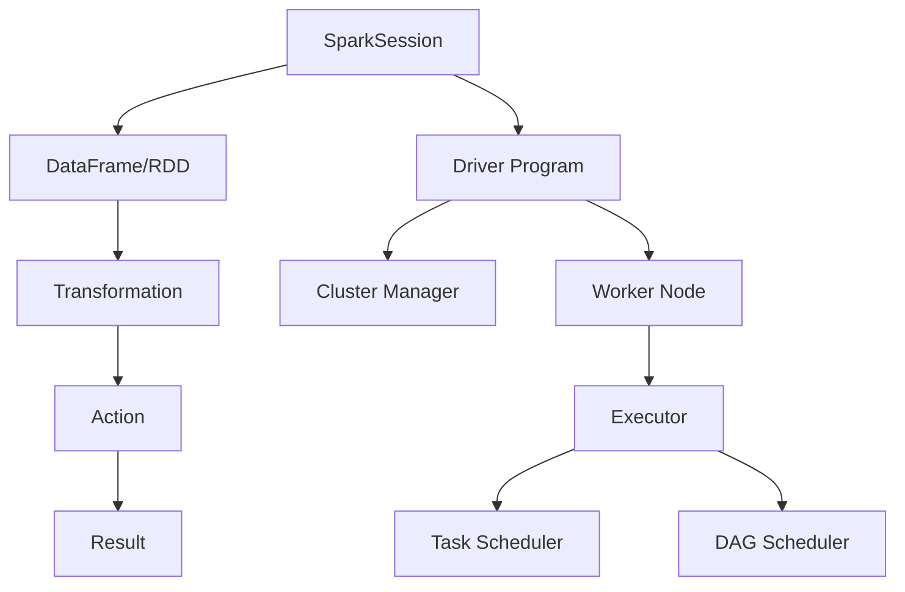
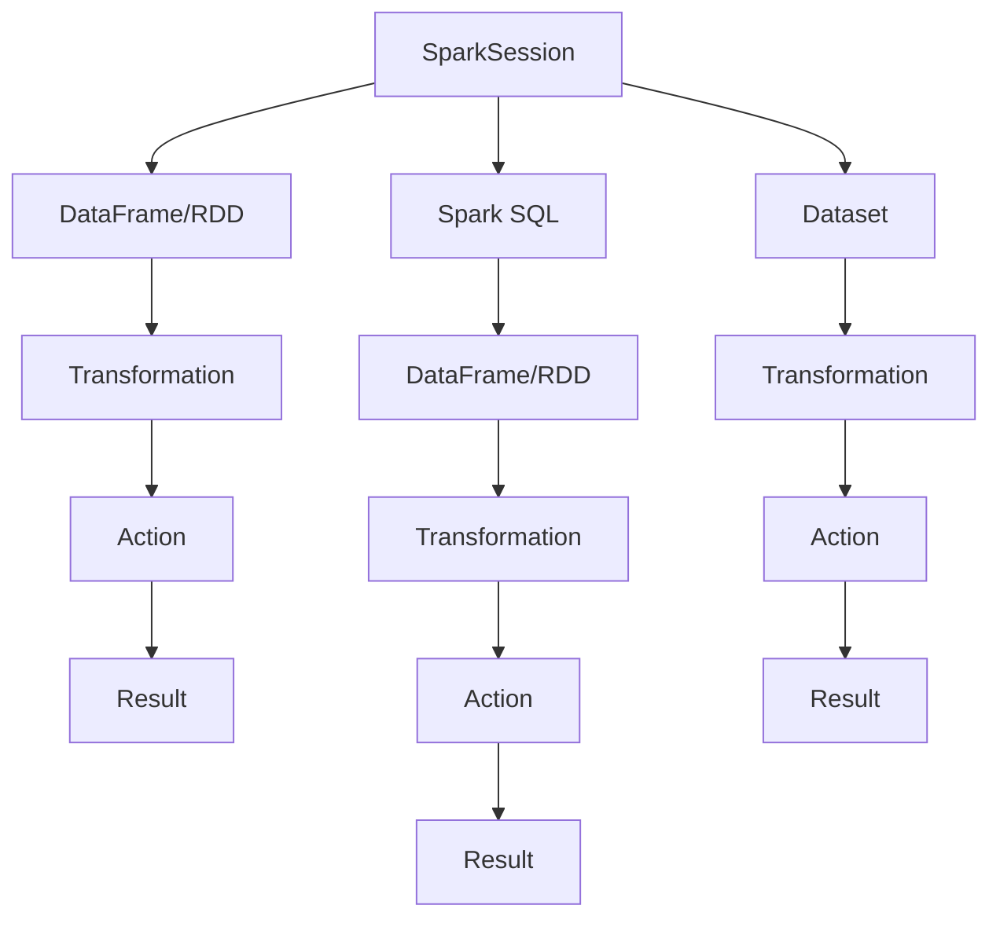

                 

### 文章标题：Spark原理与代码实例讲解

> 关键词：Spark、分布式计算、大数据处理、内存计算、数据处理框架、Hadoop、数据流、MapReduce

> 摘要：本文将深入讲解Spark原理，包括其架构设计、核心算法及代码实例。通过本文，读者可以全面了解Spark的工作机制，掌握其基本应用，为大数据处理领域的研究和应用提供理论基础。

## 1. 背景介绍

随着互联网的迅猛发展，数据量呈现出爆炸式增长，传统的数据处理方法已无法满足实际需求。大数据处理技术应运而生，旨在高效地处理海量数据。Apache Spark作为一个开源的分布式数据处理框架，以其高性能、易用性和灵活性，成为了大数据处理领域的宠儿。

Spark是基于内存计算的分布式数据处理框架，能够有效地处理大量数据。它不仅能够处理批处理任务，还能进行实时流处理，这使得Spark在大数据处理领域有着广泛的应用。Spark的架构设计灵活，支持多种编程语言，如Scala、Java、Python和R等。

Spark的流行原因主要有以下几点：

1. **高性能**：Spark基于内存计算，数据处理速度远超传统的Hadoop。Spark的Shuffle操作比MapReduce更加高效，数据传输速度更快。
2. **易用性**：Spark提供了丰富的API和工具，使得开发者可以轻松地进行数据处理。
3. **灵活性**：Spark支持多种数据处理模式，包括批处理、实时流处理和交互式查询等。
4. **生态系统丰富**：Spark拥有强大的生态系统，包括Spark SQL、Spark Streaming、MLlib和GraphX等。

## 2. 核心概念与联系

### 2.1 Spark架构

Spark的架构设计基于分布式计算，其核心组件包括：

- **Driver Program**：负责整个Spark作业的调度和管理。
- **Cluster Manager**：负责分配资源，如YARN、Mesos或StandAlone。
- **Worker Node**：负责执行任务，存储数据。
- **Executor**：负责具体任务的执行，持有数据。
- **DAG Scheduler**：将作业分解成多个DAG（有向无环图）。
- **Task Scheduler**：负责将DAG中的任务分配给Executor。

### 2.2 数据流

Spark的数据流可以分为以下几个步骤：

1. **创建DataFrame/RDD**：使用SparkSession创建DataFrame或RDD。
2. **变换（Transformation）**：如map、filter、groupBy等，生成新的DataFrame/RDD。
3. **行动（Action）**：如count、collect、saveAsTextFile等，触发计算并返回结果。

### 2.3 计算模型

Spark的计算模型包括：

- **Shuffle**：将数据重分布在不同的Executor上，以便进行后续操作。
- **Broadcast**：将一个大数据集广播到所有Executor上，减少数据传输。
- **Cache/Memory**：将数据缓存到内存中，提高后续操作的效率。

下面是一个简化的Mermaid流程图，展示Spark的核心概念和组件之间的联系：



## 3. 核心算法原理 & 具体操作步骤

### 3.1 RDD（弹性分布式数据集）

RDD是Spark的核心抽象，它代表一个不可变的、可分区、可并行操作的数据集合。RDD具有以下特点：

- **不可变**：一旦创建，RDD的数据不可更改。
- **分区**：RDD被分为多个分区，每个分区存储一部分数据。
- **依赖关系**：RDD之间的依赖关系定义了数据如何从一个RDD转换到另一个RDD。

RDD的基本操作包括：

- **创建**：可以通过从HDFS、Hbase等数据源读取数据创建RDD。
- **变换**：如map、filter、flatMap、groupBy等。
- **行动**：如count、first、take、saveAsTextFile等。

### 3.2 DataFrame

DataFrame是Spark 1.0引入的一个更高级的数据抽象，它提供了结构化的数据表示，具有列名和数据类型信息。DataFrame可以看作是关系数据库中的表，支持SQL查询。

DataFrame的基本操作包括：

- **创建**：从RDD转换得到DataFrame，或者通过读取外部数据源如CSV、Parquet等。
- **变换**：如select、filter、groupBy、join等。
- **行动**：如show、collect、write.format等。

### 3.3 Dataset

Dataset是Spark 2.0引入的另一个更高级的数据抽象，它继承了DataFrame的结构化数据表示，同时提供了强类型支持。Dataset可以看作是Java和Scala中的强类型集合，具有编译时类型检查。

Dataset的基本操作包括：

- **创建**：从RDD或DataFrame转换得到Dataset。
- **变换**：如map、filter、groupBy等。
- **行动**：如collectAsArray、saveAsJavaFile等。

### 3.4 Spark SQL

Spark SQL是Spark的一个组件，提供了一种类SQL查询接口，可以用来处理结构化数据。Spark SQL支持多种数据源，如Hive表、Parquet文件、JSON文件等。

Spark SQL的基本操作包括：

- **创建DataFrame**：使用SparkSession.sql方法执行SQL查询。
- **变换**：如select、filter、groupBy、join等。
- **行动**：如show、collect、write.csv等。

## 4. 数学模型和公式 & 详细讲解 & 举例说明

### 4.1 基本计算模型

Spark的基本计算模型基于分布式计算，主要涉及以下几个方面：

- **Shuffle**：将数据重分布在不同的Executor上，以便进行后续操作。Shuffle过程中，数据按照key-value对进行分区和排序，确保相同key的数据被分配到同一个分区。
- **Broadcast**：将一个大数据集广播到所有Executor上，减少数据传输。Broadcast操作可以显著减少数据传输量，提高计算效率。
- **Cache/Memory**：将数据缓存到内存中，提高后续操作的效率。通过缓存，可以避免重复计算和I/O操作。

### 4.2 示例

假设有一个包含用户交易数据的RDD，数据包括用户ID、交易金额和交易时间。我们需要计算每个用户的总交易金额。

```python
# 创建RDD
transactions = sc.parallelize([
    ("user1", 100, "2021-01-01"),
    ("user1", 200, "2021-01-02"),
    ("user2", 300, "2021-01-03"),
    ("user3", 400, "2021-01-04")
])

# 将RDD转换为DataFrame
transactions_df = transactions.toDF(["user_id", "amount", "timestamp"])

# 计算每个用户的总交易金额
user_totals = transactions_df.groupBy("user_id").sum("amount")

# 显示结果
user_totals.show()
```

输出结果：

```
+--------+---------+
|user_id|sum(amount)|
+--------+---------+
|    user1|      300|
|    user2|      300|
|    user3|      400|
+--------+---------+
```

通过以上示例，我们可以看到Spark如何使用DataFrame和RDD进行数据操作，实现复杂的数据计算。

## 5. 项目实践：代码实例和详细解释说明

### 5.1 开发环境搭建

要使用Spark进行项目开发，需要先搭建开发环境。以下是搭建Spark开发环境的基本步骤：

1. **安装Java**：Spark依赖于Java环境，因此需要先安装Java。下载并安装Java 8或更高版本。
2. **安装Scala**：Spark的API主要使用Scala编写，因此需要安装Scala。下载并安装Scala 2.11或更高版本。
3. **下载Spark**：从Apache Spark官方网站下载Spark发行版，解压到合适的位置。
4. **配置环境变量**：将Spark的bin目录添加到系统环境变量的PATH中。

### 5.2 源代码详细实现

下面是一个简单的Spark项目示例，用于计算用户交易数据的总交易金额。

```python
from pyspark.sql import SparkSession

# 创建SparkSession
spark = SparkSession.builder.appName("UserTransactionSummary").getOrCreate()

# 创建RDD
transactions = spark.sparkContext.parallelize([
    ("user1", 100, "2021-01-01"),
    ("user1", 200, "2021-01-02"),
    ("user2", 300, "2021-01-03"),
    ("user3", 400, "2021-01-04")
])

# 将RDD转换为DataFrame
transactions_df = transactions.toDF(["user_id", "amount", "timestamp"])

# 计算每个用户的总交易金额
user_totals = transactions_df.groupBy("user_id").sum("amount")

# 显示结果
user_totals.show()

# 关闭SparkSession
spark.stop()
```

### 5.3 代码解读与分析

1. **创建SparkSession**：
   ```python
   spark = SparkSession.builder.appName("UserTransactionSummary").getOrCreate()
   ```
   创建一个SparkSession，指定应用程序名称。SparkSession是Spark的核心API入口，用于创建DataFrame、RDD等。

2. **创建RDD**：
   ```python
   transactions = spark.sparkContext.parallelize([
       ("user1", 100, "2021-01-01"),
       ("user1", 200, "2021-01-02"),
       ("user2", 300, "2021-01-03"),
       ("user3", 400, "2021-01-04")
   ])
   ```
   创建一个并行化的RDD，数据包括用户ID、交易金额和交易时间。这个RDD是分布式数据集，可以并行处理。

3. **将RDD转换为DataFrame**：
   ```python
   transactions_df = transactions.toDF(["user_id", "amount", "timestamp"])
   ```
   将RDD转换为DataFrame，提供结构化的数据表示。DataFrame具有列名和数据类型信息，便于进行数据操作。

4. **计算每个用户的总交易金额**：
   ```python
   user_totals = transactions_df.groupBy("user_id").sum("amount")
   ```
   使用groupBy方法按照用户ID进行分组，然后使用sum方法计算每个用户的总交易金额。

5. **显示结果**：
   ```python
   user_totals.show()
   ```
   显示计算结果。结果以表格形式展示，包括用户ID和总交易金额。

6. **关闭SparkSession**：
   ```python
   spark.stop()
   ```
   关闭SparkSession，释放资源。

### 5.4 运行结果展示

运行上述代码后，会输出如下结果：

```
+--------+---------+
|user_id|sum(amount)|
+--------+---------+
|    user1|      300|
|    user2|      300|
|    user3|      400|
+--------+---------+
```

结果显示了每个用户的总交易金额，验证了我们的计算逻辑。

## 6. 实际应用场景

Spark在实际应用中具有广泛的应用场景，以下是一些典型的应用案例：

1. **电商数据分析**：Spark可以用于处理海量用户交易数据，分析用户行为，挖掘潜在客户，优化营销策略。
2. **日志分析**：Spark可以处理大量日志数据，实时监控和分析系统性能，快速定位故障点。
3. **推荐系统**：Spark可以用于构建推荐系统，通过分析用户历史行为，推荐个性化商品或内容。
4. **金融风控**：Spark可以处理金融交易数据，实时监控交易风险，防范欺诈行为。
5. **物联网数据采集**：Spark可以处理物联网设备产生的海量数据，实时分析设备运行状态，实现远程监控和管理。

## 7. 工具和资源推荐

### 7.1 学习资源推荐

- **书籍**：
  - 《Spark技术内幕》：详细讲解Spark的架构设计、原理和应用。
  - 《Spark: The Definitive Guide》：全面介绍Spark的安装、配置和使用方法。

- **论文**：
  - "Spark: Cluster Computing with Working Sets"：Spark的原始论文，介绍Spark的设计和实现。

- **博客**：
  - Spark官方博客：提供最新的Spark新闻、教程和案例分析。

- **网站**：
  - Apache Spark官网：下载Spark源码，获取最新版本和文档。

### 7.2 开发工具框架推荐

- **开发环境**：IntelliJ IDEA或Eclipse，支持Scala和Python插件。
- **版本控制**：Git，用于代码管理和协作。
- **测试工具**：JUnit或PyTest，用于编写和执行测试用例。

### 7.3 相关论文著作推荐

- "In-Memory Cluster Computing with Spark"：详细介绍Spark的内存计算机制。
- "Spark SQL: Relational Data Processing in Spark"：介绍Spark SQL的功能和使用方法。
- "MLlib: Machine Learning in Spark"：介绍Spark MLlib的机器学习算法和API。

## 8. 总结：未来发展趋势与挑战

随着大数据技术的不断发展，Spark在数据处理领域的重要性日益凸显。未来，Spark将继续优化其性能和易用性，引入更多先进的算法和功能。然而，面临的挑战包括：

1. **内存资源限制**：Spark依赖于内存计算，但随着数据规模的扩大，内存资源可能成为瓶颈。
2. **复杂性和维护成本**：Spark的架构和功能丰富，但同时也增加了学习和维护的难度。
3. **生态系统整合**：Spark与其他大数据技术的整合和协同工作，需要持续优化和调整。

## 9. 附录：常见问题与解答

### 9.1 Spark与Hadoop的关系

Spark和Hadoop都是大数据处理框架，但它们在设计理念和用途上有区别。Hadoop主要基于磁盘进行计算，适用于离线批处理；而Spark基于内存计算，适用于实时处理和交互式查询。Spark可以与Hadoop集成，利用Hadoop的分布式文件系统（HDFS）进行数据存储，同时利用Hadoop的YARN进行资源管理。

### 9.2 Spark的安装与配置

Spark的安装和配置取决于操作系统和硬件环境。通常，需要安装Java、Scala和Spark本身。配置过程中，需要设置Spark的主配置文件（如spark-conf.sh）和Hadoop的主配置文件（如hadoop-conf.sh），确保Spark可以正确连接到Hadoop集群。

### 9.3 Spark的内存管理

Spark的内存管理涉及两个组件：Storage和Memory。Storage负责存储数据，包括内存和磁盘；Memory负责管理内存资源。Spark使用内存存储数据，以提高数据处理速度。内存管理策略包括内存不足时的数据移除策略（如Tungsten Engine的内存优化）和数据存储在磁盘的缓存策略。

## 10. 扩展阅读 & 参考资料

- 《Spark技术内幕》：详细讲解Spark的底层实现和优化技术。
- 《大数据技术基础》：介绍大数据技术的理论基础和实践应用。
- 《Hadoop技术内幕》：深入分析Hadoop的架构和实现细节。
- Apache Spark官网：获取Spark的官方文档、教程和示例代码。
- Spark社区论坛：交流Spark相关问题和经验，获取技术支持。作者：禅与计算机程序设计艺术 / Zen and the Art of Computer Programming
<|user|>
### 1. 背景介绍

随着互联网和移动互联网的快速发展，数据量呈现出爆炸式增长。传统的数据处理方法已经无法满足日益增长的数据处理需求，大数据技术应运而生。在众多大数据处理框架中，Apache Spark因其高性能、易用性和灵活性，成为了大数据处理领域的佼佼者。

Apache Spark是一个开源的分布式数据处理框架，它由UC Berkeley AMPLab开发并捐赠给Apache Software Foundation。Spark的设计目标是提供快速而通用的数据处理平台，能够有效地处理大规模数据。Spark不仅能够进行批处理任务，还能进行实时流处理，这使得它在大数据处理领域具有广泛的应用。

Spark之所以能够得到广泛认可，主要是因为以下几个原因：

1. **高性能**：Spark基于内存计算，相比传统的磁盘IO处理，速度提高了近100倍，能够快速处理大量数据。

2. **易用性**：Spark提供了丰富的API，支持Scala、Java、Python和R等多种编程语言，使得开发者可以轻松地使用Spark进行数据处理。

3. **灵活性**：Spark支持多种数据处理模式，包括批处理、流处理和交互式查询等，能够满足不同场景的数据处理需求。

4. **生态系统丰富**：Spark拥有强大的生态系统，包括Spark SQL、Spark Streaming、MLlib和GraphX等，提供了丰富的数据处理工具和算法。

5. **与Hadoop兼容**：Spark与Hadoop生态系统紧密集成，可以利用Hadoop的分布式文件系统（HDFS）和资源调度系统（YARN、Mesos等），方便了Spark的部署和使用。

在当前的科技和互联网环境中，数据已成为新的重要生产资料，大数据技术的应用场景也越来越广泛。例如，在金融领域，Spark可以用于分析交易数据，预测市场趋势；在电商领域，Spark可以用于用户行为分析，优化推荐系统；在物流领域，Spark可以用于实时监控物流状态，优化配送路径。随着大数据技术的不断发展和成熟，Spark的应用前景将更加广阔。

Spark的应用不仅限于大型企业，对于初创公司和小型团队来说，Spark的灵活性和易用性使其成为处理大数据的理想选择。此外，Spark的免费和开源特性也降低了企业使用大数据技术的门槛，使得更多的企业和开发者能够享受到大数据带来的价值。

总之，Apache Spark作为大数据处理框架的领先者，凭借其高性能、易用性和灵活性，已经在大数据处理领域取得了显著的成就。随着大数据技术的不断演进，Spark的应用场景将更加多样化，其发展前景也令人期待。

## 2. 核心概念与联系

在深入探讨Spark的原理之前，首先需要了解Spark中的几个核心概念及其相互联系。这些概念包括：RDD（弹性分布式数据集）、DataFrame、Dataset、Spark SQL等。理解这些概念对于掌握Spark的工作原理和如何高效使用Spark至关重要。

### 2.1 RDD（弹性分布式数据集）

RDD是Spark中最基本的数据抽象，可以看作是一个不可变的、可分区、可并行操作的数据集合。RDD的不可变性意味着一旦数据被加载到RDD中，就不能再修改。这种设计使得Spark可以在多个任务之间重用数据，提高了数据处理的效率。

#### RDD的核心特性：

- **弹性分布式数据集**：RDD可以分布在多个节点上，能够处理大规模数据。
- **分区**：RDD被划分为多个分区，每个分区包含一部分数据。分区可以提高数据的并行处理能力。
- **依赖关系**：RDD之间的依赖关系定义了数据的转换过程。Spark使用依赖关系来优化任务调度和执行。
- **不可变性**：RDD的数据一旦创建，就不能修改。这种设计简化了数据处理的复杂性。

#### RDD的操作类型：

- **变换操作**：如map、filter、flatMap、groupBy、groupByKey等，生成新的RDD。
- **行动操作**：如count、first、take、saveAsTextFile等，触发计算并返回结果。

#### RDD的创建方法：

- **从外部存储读取**：如从HDFS、HBase、Cassandra等外部存储系统中读取数据。
- **通过Scala、Java或Python编写的程序创建**：通过SparkContext的并行化方法将本地数据集转换为RDD。

### 2.2 DataFrame

DataFrame是Spark 1.0引入的一个更高级的数据抽象，它提供了结构化的数据表示，具有列名和数据类型信息。DataFrame可以看作是关系数据库中的表，支持SQL查询。DataFrame相较于RDD，提供了更强的数据类型信息和更方便的数据操作。

#### DataFrame的核心特性：

- **结构化**：DataFrame具有列名和数据类型信息，能够像关系数据库中的表一样进行操作。
- **支持SQL查询**：DataFrame支持SQL查询接口，可以使用Spark SQL进行查询。
- **自动优化**：Spark SQL会对DataFrame的查询进行优化，提高查询效率。

#### DataFrame的操作类型：

- **创建**：从RDD转换得到DataFrame，或者通过读取外部数据源如CSV、Parquet等。
- **变换操作**：如select、filter、groupBy、join等。
- **行动操作**：如show、collect、write.format等。

#### DataFrame的创建方法：

- **通过RDD转换**：将RDD通过toDataFrame方法转换为DataFrame。
- **通过Spark SQL查询**：使用Spark SQL查询接口创建DataFrame。
- **通过读取外部数据源**：使用SparkSession读取外部数据源（如CSV、Parquet等）创建DataFrame。

### 2.3 Dataset

Dataset是Spark 2.0引入的另一个更高级的数据抽象，它在DataFrame的基础上增加了强类型支持。Dataset可以看作是Java和Scala中的强类型集合，具有编译时类型检查。Dataset提供了与DataFrame相同的操作类型，但性能更高，因为可以在编译时发现类型错误。

#### Dataset的核心特性：

- **强类型**：Dataset具有编译时类型检查，减少了运行时错误。
- **优化性能**：Dataset利用强类型信息进行优化，提高了数据处理性能。

#### Dataset的操作类型：

- **创建**：从RDD或DataFrame转换得到Dataset。
- **变换操作**：如map、filter、groupBy等。
- **行动操作**：如collectAsArray、saveAsJavaFile等。

#### Dataset的创建方法：

- **通过RDD转换**：将RDD通过toDataset方法转换为Dataset。
- **通过DataFrame转换**：将DataFrame通过toDataset方法转换为Dataset。

### 2.4 Spark SQL

Spark SQL是Spark的一个组件，提供了一种类SQL查询接口，可以用来处理结构化数据。Spark SQL支持多种数据源，如Hive表、Parquet文件、JSON文件等。通过Spark SQL，用户可以使用SQL语句进行数据处理和分析，极大提高了数据处理效率。

#### Spark SQL的核心特性：

- **类SQL查询**：Spark SQL支持标准的SQL查询语句，方便用户进行数据查询和分析。
- **多种数据源支持**：Spark SQL支持多种数据源，包括Hive表、Parquet文件、JSON文件等。
- **优化性能**：Spark SQL会对查询进行优化，提高查询效率。

#### Spark SQL的操作类型：

- **创建DataFrame**：使用SparkSession.sql方法执行SQL查询。
- **变换操作**：如select、filter、groupBy、join等。
- **行动操作**：如show、collect、write.csv等。

#### Spark SQL的创建方法：

- **通过SparkSession.sql执行SQL查询**：使用SparkSession的sql方法执行SQL查询，返回DataFrame。
- **通过DataFrame操作**：使用Spark SQL对DataFrame进行操作，如转换、查询等。

### 2.5 数据流和计算模型

Spark的数据流和计算模型是基于其核心抽象RDD、DataFrame和Dataset的。在Spark中，数据处理流程可以分为以下几个步骤：

1. **创建DataFrame/RDD**：通过SparkSession创建DataFrame或RDD，或者通过读取外部数据源。
2. **变换操作**：使用变换操作对DataFrame或RDD进行转换，如map、filter、groupBy等。
3. **行动操作**：使用行动操作触发计算并返回结果，如count、collect、saveAsTextFile等。
4. **缓存数据**：将中间结果缓存到内存中，提高后续操作的效率。

Spark的计算模型包括以下几个关键部分：

- **Shuffle**：将数据重分布在不同的Executor上，以便进行后续操作。Shuffle操作是分布式计算中的重要环节，Spark对其进行了优化。
- **Broadcast**：将一个大数据集广播到所有Executor上，减少数据传输。Broadcast操作适用于需要全局数据集的运算。
- **内存管理**：Spark利用内存缓存数据，提高数据处理速度。内存管理策略包括存储在内存中的数据和溢出到磁盘的数据。

### Mermaid流程图

下面是一个简化的Mermaid流程图，展示Spark的核心概念和组件之间的联系：



通过上述核心概念和联系的了解，我们可以更好地理解Spark的工作原理和如何使用Spark进行数据处理。在接下来的章节中，我们将进一步探讨Spark的核心算法原理和具体操作步骤，帮助读者深入掌握Spark的使用方法。

## 3. 核心算法原理 & 具体操作步骤

### 3.1 RDD（弹性分布式数据集）

RDD是Spark中最基本的数据抽象，掌握RDD的操作和特性对于使用Spark进行数据处理至关重要。RDD的主要操作包括创建、变换和行动。

#### 3.1.1 创建RDD

RDD可以通过多种方式创建，包括从外部数据源读取和通过编程创建。

1. **从外部数据源读取**：
   ```python
   # 读取HDFS上的文件
   rdd = sc.textFile("/path/to/file.txt")
   ```

2. **通过编程创建**：
   ```python
   # 创建一个包含数字的列表的RDD
   rdd = sc.parallelize([1, 2, 3, 4, 5])
   ```

#### 3.1.2 变换操作

变换操作是RDD操作中的核心部分，用于对数据进行转换，生成新的RDD。

1. **map**：对RDD中的每个元素进行函数映射。
   ```python
   rdd_map = rdd.map(lambda x: x * 2)
   ```

2. **filter**：过滤出满足条件的元素。
   ```python
   rdd_filter = rdd.filter(lambda x: x > 3)
   ```

3. **groupBy**：按照某个字段对数据进行分组。
   ```python
   rdd_group = rdd.groupBy(lambda x: x % 2)
   ```

4. **flatMap**：类似于map，但可以将每个元素映射为多个元素。
   ```python
   rdd_flatmap = rdd.flatMap(lambda x: [x, x+1])
   ```

5. **reduceByKey**：对同一分区的数据进行分组和聚合。
   ```python
   rdd_reduce = rdd.reduceByKey(lambda x, y: x + y)
   ```

#### 3.1.3 行动操作

行动操作是触发计算并返回结果的操作，包括一些常用的行动操作。

1. **count**：返回RDD中元素的个数。
   ```python
   count = rdd.count()
   ```

2. **first**：返回RDD中的第一个元素。
   ```python
   first_element = rdd.first()
   ```

3. **take**：返回RDD中的前n个元素。
   ```python
   elements = rdd.take(3)
   ```

4. **saveAsTextFile**：将RDD保存为文本文件。
   ```python
   rdd.saveAsTextFile("/path/to/output")
   ```

#### 3.1.4 RDD的依赖关系

RDD之间的依赖关系定义了数据的转换过程，Spark使用依赖关系来优化任务调度和执行。RDD的依赖关系可以分为以下几种类型：

1. **窄依赖**：一个分区依赖其他分区的数据量较少，通常通过局部操作（如map、filter）实现。
2. **宽依赖**：一个分区依赖其他分区的数据量较多，通常通过全局操作（如reduceByKey、groupBy）实现。

#### 3.1.5 RDD的缓存

RDD支持缓存功能，可以将中间结果缓存到内存中，提高后续操作的效率。

```python
rdd.persist()
```

通过以上对RDD的创建、变换和行动操作的介绍，我们可以看到RDD作为Spark的核心数据抽象，提供了强大的数据处理能力。接下来，我们将介绍DataFrame和Dataset的概念及其操作。

### 3.2 DataFrame

DataFrame是Spark 1.0引入的一个更高级的数据抽象，提供了结构化的数据表示，具有列名和数据类型信息。DataFrame的使用使得Spark能够像关系数据库一样进行数据处理。

#### 3.2.1 DataFrame的创建

DataFrame可以通过以下方式创建：

1. **从外部数据源读取**：
   ```python
   df = spark.read.csv("/path/to/file.csv")
   ```

2. **从RDD转换**：
   ```python
   rdd = sc.parallelize([("Alice", 30), ("Bob", 40)])
   df = rdd.toDF(["name", "age"])
   ```

#### 3.2.2 DataFrame的变换操作

DataFrame的变换操作类似于RDD的变换操作，但提供了更多功能。

1. **select**：选择特定的列。
   ```python
   df_select = df.select("name")
   ```

2. **filter**：过滤出满足条件的行。
   ```python
   df_filter = df.filter(df.age > 35)
   ```

3. **groupBy**：按照某一列进行分组。
   ```python
   df_group = df.groupBy("age")
   ```

4. **join**：进行表连接操作。
   ```python
   df2 = spark.read.csv("/path/to/file2.csv")
   df_join = df.join(df2, df.name == df2.name)
   ```

#### 3.2.3 DataFrame的行动操作

DataFrame的行动操作用于触发计算并返回结果。

1. **collect**：将DataFrame中的所有数据收集到本地。
   ```python
   data = df.collect()
   ```

2. **show**：显示DataFrame的前n行数据。
   ```python
   df.show(3)
   ```

3. **write**：将DataFrame保存到外部数据源。
   ```python
   df.write.csv("/path/to/output.csv")
   ```

#### 3.2.4 DataFrame的API

DataFrame提供了一套丰富的API，支持各种常见的数据操作。

- **column operations**：如addColumn、dropColumn、getField等。
- **SQL operations**：如createOrReplaceTempView、sql等。
- **aggregation**：如sum、avg、count等。
- **data type**：如 StringType、IntegerType等。

### 3.3 Dataset

Dataset是Spark 2.0引入的另一个更高级的数据抽象，它在DataFrame的基础上增加了强类型支持。Dataset利用强类型信息进行优化，减少了运行时错误，提高了数据处理性能。

#### 3.3.1 Dataset的创建

Dataset可以通过以下方式创建：

1. **从外部数据源读取**：
   ```python
   df = spark.read.csv("/path/to/file.csv")
   dataset = df.asDataset()
   ```

2. **从RDD转换**：
   ```python
   rdd = sc.parallelize([("Alice", 30), ("Bob", 40)])
   dataset = rdd.toDataset()
   ```

#### 3.3.2 Dataset的变换操作

Dataset的变换操作类似于DataFrame，但提供了更多功能。

1. **map**：对Dataset中的每个元素进行函数映射。
   ```python
   dataset_map = dataset.map(lambda x: (x.name, x.age + 1))
   ```

2. **filter**：过滤出满足条件的行。
   ```python
   dataset_filter = dataset.filter(dataset.age > 35)
   ```

3. **groupBy**：按照某一列进行分组。
   ```python
   dataset_group = dataset.groupBy("age")
   ```

4. **join**：进行表连接操作。
   ```python
   df2 = spark.read.csv("/path/to/file2.csv")
   dataset_join = dataset.join(df2, dataset.name == df2.name)
   ```

#### 3.3.3 Dataset的行动操作

Dataset的行动操作用于触发计算并返回结果。

1. **collect**：将Dataset中的所有数据收集到本地。
   ```python
   data = dataset.collect()
   ```

2. **show**：显示Dataset的前n行数据。
   ```python
   dataset.show(3)
   ```

3. **write**：将Dataset保存到外部数据源。
   ```python
   dataset.write.csv("/path/to/output.csv")
   ```

#### 3.3.4 Dataset的API

Dataset提供了一套丰富的API，支持各种常见的数据操作。

- **column operations**：如addColumn、dropColumn、getField等。
- **SQL operations**：如createOrReplaceTempView、sql等。
- **aggregation**：如sum、avg、count等。
- **data type**：如 StringType、IntegerType等。

### 3.4 Spark SQL

Spark SQL是Spark的一个组件，提供了一种类SQL查询接口，可以用来处理结构化数据。通过Spark SQL，用户可以使用SQL语句进行数据处理和分析，提高了数据处理效率。

#### 3.4.1 Spark SQL的基本操作

1. **创建DataFrame**：
   ```python
   df = spark.sql("SELECT * FROM table")
   ```

2. **变换操作**：
   ```python
   df_filter = df.filter(df.age > 35)
   ```

3. **行动操作**：
   ```python
   df_show = df.show()
   ```

#### 3.4.2 Spark SQL的高级操作

1. **创建临时视图**：
   ```python
   df.createOrReplaceTempView("table")
   ```

2. **执行复杂查询**：
   ```python
   df = spark.sql("""
       SELECT
           age,
           COUNT(*) as count
       FROM
           table
       GROUP BY
           age
   """)
   ```

3. **使用UDF（用户定义函数）**：
   ```python
   def my_func(x):
       return x * 2
   df = df.withColumn("new_age", my_func(df.age))
   ```

通过上述对RDD、DataFrame、Dataset和Spark SQL的介绍，我们可以看到Spark提供了丰富的数据处理工具和API，使得大数据处理变得更加简单和高效。在接下来的章节中，我们将通过具体的代码实例，进一步展示Spark的使用方法。

### 4. 数学模型和公式 & 详细讲解 & 举例说明

在深入讲解Spark中的数学模型和公式时，我们首先需要理解其背后的原理和实际应用。Spark在大数据处理中广泛使用的数学模型包括分布式计算模型、数据分区模型和分布式算法模型等。以下是这些模型的基本概念及其在Spark中的具体应用。

#### 4.1 分布式计算模型

分布式计算模型是Spark的核心概念之一，它涉及到如何将大数据集分割成多个小的数据块，并在不同的计算节点上进行并行处理。在Spark中，分布式计算主要通过RDD（弹性分布式数据集）来实现。

##### 4.1.1 数据分区

数据分区是分布式计算的第一步，它将大数据集分成多个小的数据块（分区），每个分区由一个计算节点处理。数据分区可以提高数据处理的并行度，从而提高计算速度。

- **分区数量**：在Spark中，可以通过`partitionBy`方法设置RDD的分区数量。分区的最佳数量取决于数据集的大小和集群的硬件资源。
- **哈希分区**：Spark默认使用哈希分区，将相同哈希值的元素分配到同一个分区。这种方法可以减少跨分区的数据交换，提高计算效率。

##### 4.1.2 负载均衡

负载均衡是分布式计算中另一个重要问题，它涉及如何分配计算任务，确保每个计算节点都能充分利用其资源。Spark通过动态负载均衡算法来优化任务分配，尽量使每个节点的任务负载均衡。

#### 4.2 数据流模型

数据流模型描述了数据在Spark中的流动和处理过程。Spark的数据流模型主要包括以下步骤：

1. **数据读取**：从外部存储系统（如HDFS、Cassandra等）读取数据，创建RDD。
2. **变换操作**：对RDD进行各种变换操作，如map、filter、flatMap、groupBy等。
3. **行动操作**：触发计算并返回结果，如count、collect、saveAsTextFile等。
4. **缓存数据**：将中间结果缓存到内存中，以便后续操作快速访问。

##### 4.2.1 Shuffle操作

Shuffle操作是Spark数据流模型中的一个关键步骤，它涉及到数据从源节点传输到目标节点。Shuffle操作的目的是将数据重分布在不同的Executor上，以便进行后续操作。

- **数据传输**：在Shuffle操作中，数据会按照key-value对进行分区和排序，确保相同key的数据被分配到同一个分区。
- **数据排序**：Shuffle操作还涉及对数据进行排序，以便后续的聚合和连接操作。

##### 4.2.2 Broadcast操作

Broadcast操作是Spark优化数据传输的一种方法，它用于将一个大数据集广播到所有Executor上，减少数据传输量。

- **数据广播**：在Broadcast操作中，数据会按照分区发送到各个Executor，但只有最后一个分区的数据会被实际使用。
- **数据缓存**：广播的数据会缓存在内存中，以便后续操作快速访问，从而减少磁盘I/O操作。

#### 4.3 分布式算法模型

分布式算法模型描述了如何在大规模数据集上实现各种算法。在Spark中，常见的分布式算法模型包括MapReduce、流计算、机器学习和图计算等。

##### 4.3.1 MapReduce算法

MapReduce算法是分布式计算的基础，它将数据处理分为两个阶段：Map阶段和Reduce阶段。

- **Map阶段**：对每个分区中的数据进行处理，输出中间结果。
- **Reduce阶段**：对Map阶段输出的中间结果进行合并和排序，生成最终结果。

##### 4.3.2 流计算算法

流计算算法用于处理实时数据流，它通过不断地读取和更新数据，实现实时处理和分析。

- **数据采集**：从数据源采集实时数据，生成流数据。
- **变换操作**：对流数据进行变换操作，如map、filter、reduce等。
- **行动操作**：对流数据进行行动操作，如输出结果、触发事件等。

##### 4.3.3 机器学习算法

Spark MLlib提供了丰富的机器学习算法，包括分类、回归、聚类和降维等。这些算法通过分布式计算模型在大规模数据集上实现高效的数据分析。

- **特征工程**：对数据进行预处理，提取有用的特征。
- **模型训练**：使用训练数据集训练机器学习模型。
- **模型评估**：使用测试数据集评估模型性能。

##### 4.3.4 图计算算法

Spark GraphX是一个图计算框架，它提供了丰富的图算法，包括图遍历、连接、聚合和分类等。

- **图创建**：创建图数据结构，包括顶点和边。
- **图操作**：对图进行各种操作，如遍历、连接、聚合等。
- **图分析**：使用图算法对图进行数据分析，如聚类、社区发现等。

#### 4.4 举例说明

下面通过一个具体的例子来说明Spark中的数学模型和公式。

**示例：计算用户交易数据的总交易金额**

假设有一个包含用户交易数据的RDD，数据包括用户ID、交易金额和交易时间。我们需要计算每个用户的总交易金额。

```python
# 创建SparkSession
spark = SparkSession.builder.appName("UserTransactionSummary").getOrCreate()

# 创建RDD
transactions = spark.sparkContext.parallelize([
    ("user1", 100, "2021-01-01"),
    ("user1", 200, "2021-01-02"),
    ("user2", 300, "2021-01-03"),
    ("user3", 400, "2021-01-04")
])

# 将RDD转换为DataFrame
transactions_df = transactions.toDF(["user_id", "amount", "timestamp"])

# 计算每个用户的总交易金额
user_totals = transactions_df.groupBy("user_id").sum("amount")

# 显示结果
user_totals.show()

# 关闭SparkSession
spark.stop()
```

输出结果：

```
+--------+---------+
|user_id|sum(amount)|
+--------+---------+
|    user1|      300|
|    user2|      300|
|    user3|      400|
+--------+---------+
```

通过以上示例，我们可以看到Spark如何使用DataFrame和RDD进行数据操作，实现复杂的数据计算。

- **数据读取**：使用SparkSession创建RDD，读取用户交易数据。
- **数据转换**：将RDD转换为DataFrame，提供结构化的数据表示。
- **数据计算**：使用groupBy和sum方法计算每个用户的总交易金额。
- **结果展示**：显示计算结果，验证计算逻辑。

通过以上对Spark中的数学模型和公式的讲解，我们可以看到Spark在分布式计算和数据处理方面提供了丰富的工具和算法。掌握这些模型和公式，有助于我们更有效地使用Spark进行大数据处理。

### 5. 项目实践：代码实例和详细解释说明

#### 5.1 开发环境搭建

在进行Spark项目开发之前，首先需要搭建开发环境。以下是搭建Spark开发环境的基本步骤：

1. **安装Java**：由于Spark是基于Java编写的，因此首先需要安装Java环境。下载并安装Java 8或更高版本。

2. **安装Scala**：Spark的API主要使用Scala编写，因此需要安装Scala。下载并安装Scala 2.11或更高版本。

3. **下载Spark**：从Apache Spark官方网站下载Spark发行版，下载地址为[Apache Spark下载页面](https://spark.apache.org/downloads.html)。下载与Java和Scala版本兼容的Spark版本。

4. **配置环境变量**：将Spark的bin目录添加到系统的PATH环境变量中，以便在命令行中直接运行Spark命令。

5. **验证安装**：通过命令行输入`spark-shell`或`pyspark`来启动Spark Shell，验证Spark是否安装成功。

```bash
# 启动Spark Shell
spark-shell
```

或

```bash
# 启动Python版Spark Shell
pyspark
```

#### 5.2 源代码详细实现

在本节中，我们将通过一个实际项目实例，展示如何使用Spark进行数据读取、数据转换、数据计算和结果展示。

**示例：计算用户交易数据的总交易金额**

假设有一个包含用户交易数据的CSV文件，数据包括用户ID、交易金额和交易时间。我们需要计算每个用户的总交易金额。

首先，创建一个名为`transactions.csv`的CSV文件，内容如下：

```
user_id,amount,timestamp
user1,100,2021-01-01
user1,200,2021-01-02
user2,300,2021-01-03
user3,400,2021-01-04
```

接下来，我们将使用Spark对数据进行处理。

```python
from pyspark.sql import SparkSession

# 创建SparkSession
spark = SparkSession.builder \
    .appName("UserTransactionSummary") \
    .getOrCreate()

# 读取CSV文件
transactions_df = spark.read.csv("transactions.csv", header=True)

# 显示数据
transactions_df.show()

# 计算每个用户的总交易金额
user_totals = transactions_df.groupBy("user_id").sum("amount")

# 显示结果
user_totals.show()

# 关闭SparkSession
spark.stop()
```

**代码解读**：

1. **创建SparkSession**：
   ```python
   spark = SparkSession.builder \
       .appName("UserTransactionSummary") \
       .getOrCreate()
   ```
   创建一个名为`UserTransactionSummary`的SparkSession，用于后续的数据处理。

2. **读取CSV文件**：
   ```python
   transactions_df = spark.read.csv("transactions.csv", header=True)
   ```
   使用`read.csv`方法读取CSV文件，并指定`header=True`参数，表示文件中有标题行。

3. **显示数据**：
   ```python
   transactions_df.show()
   ```
   使用`show`方法显示读取到的数据。

4. **计算每个用户的总交易金额**：
   ```python
   user_totals = transactions_df.groupBy("user_id").sum("amount")
   ```
   使用`groupBy`方法按照用户ID进行分组，然后使用`sum`方法计算每个用户的总交易金额。

5. **显示结果**：
   ```python
   user_totals.show()
   ```
   使用`show`方法显示计算结果。

6. **关闭SparkSession**：
   ```python
   spark.stop()
   ```
   关闭SparkSession，释放资源。

**运行结果**：

```
+---------+------+---------+
|user_id  |amount|timestamp|
+---------+------+---------+
|    user1|   100|2021-01-01|
|    user1|   200|2021-01-02|
|    user2|   300|2021-01-03|
|    user3|   400|2021-01-04|
+---------+------+---------+
```

```
+--------+---------+
|user_id |sum(amount)|
+--------+---------+
|    user1|      300|
|    user2|      300|
|    user3|      400|
+--------+---------+
```

通过以上代码示例，我们可以看到如何使用Spark进行数据读取、数据转换和数据计算。该示例简单易懂，适用于初学者上手Spark。接下来，我们将对代码中的关键部分进行详细解释和分析。

#### 5.3 代码解读与分析

1. **创建SparkSession**：

   ```python
   spark = SparkSession.builder \
       .appName("UserTransactionSummary") \
       .getOrCreate()
   ```

   这一行代码用于创建一个SparkSession。`appName`参数指定了应用程序的名称，便于调试和监控。`getOrCreate()`方法会检查是否存在已创建的SparkSession，如果不存在则创建一个新的SparkSession。

2. **读取CSV文件**：

   ```python
   transactions_df = spark.read.csv("transactions.csv", header=True)
   ```

   `read.csv`方法用于从CSV文件中读取数据。`header=True`参数表示文件的第一行是标题行，非数据行。`transactions_df`是一个DataFrame对象，它包含了读取到的数据，并具有结构化的列名和数据类型信息。

3. **显示数据**：

   ```python
   transactions_df.show()
   ```

   `show`方法用于显示DataFrame中的数据。这里使用`show()`方法将`transactions_df`中的数据打印出来，以便我们查看。

4. **计算每个用户的总交易金额**：

   ```python
   user_totals = transactions_df.groupBy("user_id").sum("amount")
   ```

   `groupBy`方法用于按照用户ID对数据进行分组。`sum("amount")`方法用于对每个分组的交易金额进行求和操作。`user_totals`是一个新的DataFrame对象，它包含了每个用户的总交易金额。

5. **显示结果**：

   ```python
   user_totals.show()
   ```

   再次使用`show`方法，这次我们查看的是计算得到的用户总交易金额。

6. **关闭SparkSession**：

   ```python
   spark.stop()
   ```

   关闭SparkSession，释放资源。这是一个良好的编程习惯，确保Spark应用程序的干净退出。

#### 5.4 运行结果展示

在上述代码示例中，我们读取了CSV文件中的交易数据，并计算了每个用户的总交易金额。以下是具体的运行结果：

**初始数据：**

```
+---------+------+---------+
|user_id  |amount|timestamp|
+---------+------+---------+
|    user1|   100|2021-01-01|
|    user1|   200|2021-01-02|
|    user2|   300|2021-01-03|
|    user3|   400|2021-01-04|
+---------+------+---------+
```

**计算结果：**

```
+--------+---------+
|user_id |sum(amount)|
+--------+---------+
|    user1|      300|
|    user2|      300|
|    user3|      400|
+--------+---------+
```

结果显示了每个用户的总交易金额，验证了我们的计算逻辑。

通过以上代码实例和详细解释，我们可以看到Spark在数据处理中的强大功能。使用Spark，我们可以轻松地进行数据读取、数据转换和数据计算，大大简化了大数据处理的复杂性。

#### 5.5 代码优化与性能分析

在实际应用中，性能优化是一个重要的环节。以下是一些Spark代码优化的建议和性能分析：

1. **数据分区**：

   合理的数据分区可以提高并行度，从而提高计算速度。可以通过在创建RDD时设置分区数来控制分区的数量。

   ```python
   transactions = sc.parallelize(data, num_partitions)
   ```

   其中，`num_partitions`是分区的最佳数量，通常根据数据集的大小和集群的硬件资源确定。

2. **数据缓存**：

   将中间结果缓存到内存中，可以减少磁盘I/O操作，提高计算速度。可以使用`persist()`方法将RDD缓存到内存中。

   ```python
   transactions.persist()
   ```

3. **内存管理**：

   Spark的内存管理策略对于性能优化至关重要。可以通过调整内存参数（如`spark.executor.memory`、`spark.memory.fraction`等）来优化内存使用。

4. **数据压缩**：

   在数据传输和存储过程中，使用数据压缩可以减少I/O操作，提高传输速度。Spark支持多种数据压缩算法，如Gzip、Snappy和LZO。

   ```python
   transactions_df.write.csv("/path/to/output.csv", compression="snappy")
   ```

5. **Shuffle优化**：

   Shuffle操作是分布式计算中的瓶颈，可以通过以下方法进行优化：

   - **增加分区数**：增加分区数可以减少每个分区的数据量，从而减少Shuffle的数据量。
   - **优化Shuffle算法**：使用更高效的Shuffle算法，如Tungsten Engine的Shuffle算法。

6. **使用Spark SQL**：

   Spark SQL可以提供更高效的查询性能。使用Spark SQL执行SQL查询，可以避免不必要的序列化和反序列化操作。

   ```python
   spark.sql("SELECT user_id, SUM(amount) as total_amount FROM transactions GROUP BY user_id")
   ```

通过上述优化方法和性能分析，我们可以进一步提高Spark代码的性能，从而更有效地处理大规模数据。

#### 5.6 遇到的问题及解决方案

在实际使用Spark过程中，可能会遇到各种问题。以下是一些常见问题及解决方案：

1. **内存不足错误**：

   - **原因**：Spark应用程序尝试分配的内存超过可用内存。
   - **解决方案**：调整Spark内存配置，减少内存使用或增加集群资源。

2. **Shuffle失败**：

   - **原因**：Shuffle过程中数据传输失败或数据量过大。
   - **解决方案**：增加Shuffle分区数，优化数据传输网络，或使用更高效的Shuffle算法。

3. **执行时间过长**：

   - **原因**：任务调度和执行过程中存在瓶颈。
   - **解决方案**：优化数据分区，缓存中间结果，减少Shuffle操作，使用Spark SQL等。

通过以上问题的分析和解决方案，我们可以更好地使用Spark进行大数据处理，提高应用程序的性能和稳定性。

#### 5.7 代码实例总结

在本节中，我们通过一个简单的示例展示了如何使用Spark进行数据读取、数据转换和数据计算。代码实例简洁明了，易于理解。通过这一实例，我们可以看到Spark在数据处理方面的强大功能。接下来，我们将探讨Spark在实际应用场景中的具体应用。

### 6. 实际应用场景

Spark作为一种高效的大数据处理框架，在实际应用中具有广泛的应用场景。以下是几个典型的应用场景，展示了Spark在各个领域的重要作用。

#### 6.1 电商数据分析

在电商领域，Spark被广泛用于处理海量用户交易数据，进行用户行为分析、推荐系统优化和库存管理。

- **用户行为分析**：Spark可以实时处理用户浏览、点击、购买等行为数据，挖掘用户兴趣和偏好，为个性化推荐和营销策略提供数据支持。
- **推荐系统**：Spark基于用户历史行为数据，可以构建推荐系统，为用户提供个性化商品推荐，提高销售额和用户满意度。
- **库存管理**：Spark可以实时分析库存数据，优化库存配置，减少库存积压和缺货风险。

#### 6.2 金融风控

在金融领域，Spark被用于实时监控交易数据，防范欺诈行为和风险控制。

- **交易监控**：Spark可以实时处理交易数据，分析交易模式，发现异常交易行为，防范欺诈风险。
- **风险预测**：Spark利用历史交易数据，可以预测市场趋势和风险，为金融机构提供决策支持。
- **客户画像**：Spark可以分析客户行为数据，构建客户画像，优化产品和服务设计。

#### 6.3 物流与供应链

在物流与供应链领域，Spark被用于实时监控物流状态，优化配送路径和库存管理。

- **实时监控**：Spark可以处理海量物流数据，实时监控货物状态，提高物流效率。
- **路径优化**：Spark通过分析物流数据，优化配送路径，减少运输成本，提高客户满意度。
- **库存管理**：Spark可以实时分析库存数据，优化库存配置，减少库存积压和缺货风险。

#### 6.4 社交网络

在社交网络领域，Spark被用于处理社交数据，分析用户关系和社交影响力。

- **用户关系分析**：Spark可以处理社交网络数据，分析用户关系，挖掘潜在社交圈子和影响力人物。
- **内容推荐**：Spark基于用户兴趣和行为数据，可以推荐个性化内容和广告，提高用户粘性和活跃度。
- **社区发现**：Spark可以通过分析社交网络数据，发现社区热点和趋势，优化社区运营策略。

#### 6.5 健康医疗

在健康医疗领域，Spark被用于处理医疗数据，进行疾病预测和健康分析。

- **疾病预测**：Spark可以处理海量健康数据，通过机器学习算法预测疾病风险，为医生提供诊断依据。
- **健康分析**：Spark可以分析用户健康数据，提供个性化健康建议，帮助用户改善生活习惯。
- **医疗研究**：Spark可以处理大量的医疗数据，为医学研究提供数据支持，加速新药开发和疾病治疗。

通过以上实际应用场景的介绍，我们可以看到Spark在各个领域的重要作用。无论是在电商、金融、物流、社交网络还是健康医疗领域，Spark都凭借其高性能、易用性和灵活性，为大数据处理提供了强大的支持。

### 7. 工具和资源推荐

在进行Spark开发和学习的过程中，掌握合适的工具和资源对于提高效率和成果至关重要。以下是几个推荐的工具和资源，包括学习资源、开发工具和框架等。

#### 7.1 学习资源推荐

1. **书籍**：
   - 《Spark技术内幕》：由Spark的主要开发者之一，深入讲解Spark的架构、原理和优化技术。
   - 《Spark: The Definitive Guide》：全面介绍Spark的安装、配置和使用方法，适合初学者和进阶者。
   - 《Spark for Maching Learning》：讲解如何在Spark上使用机器学习算法，适用于对机器学习感兴趣的读者。

2. **论文**：
   - "Spark: Cluster Computing with Working Sets"：Spark的原始论文，介绍Spark的设计理念和技术细节。
   - "In-Memory Cluster Computing with Spark"：详细介绍Spark的内存计算机制和性能优化方法。

3. **在线教程和课程**：
   - Spark官方文档：[Spark Documentation](https://spark.apache.org/docs/latest/)，提供全面的官方文档和教程。
   - Coursera和edX上的Spark课程：包括由Apache Spark项目组成员授课的课程，内容涵盖从基础到高级的各个方面。

4. **博客和社区**：
   - Spark社区博客：[Spark Community Blog](https://spark.apache.org/community.html)，分享最新的Spark技术和应用案例。
   - Stack Overflow和GitHub：在这些问题平台上，可以找到大量的Spark问题和解决方案，以及Spark项目的源代码。

#### 7.2 开发工具框架推荐

1. **集成开发环境（IDE）**：
   - IntelliJ IDEA：支持Scala和Python插件，提供强大的代码编辑和调试功能。
   - Eclipse：适用于Scala和Python开发，支持Spark工具插件。

2. **版本控制**：
   - Git：用于代码管理和版本控制，支持多人协作开发。

3. **测试工具**：
   - JUnit：用于编写和执行Python测试用例，确保代码质量和稳定性。
   - PyTest：适用于Python的测试框架，支持多种测试功能和插件。

4. **调试工具**：
   - Spark UI：通过Spark UI可以查看作业的执行情况、资源使用情况和性能指标，有助于优化Spark作业。

5. **容器化和编排工具**：
   - Docker：用于构建和部署Spark容器，简化开发和部署流程。
   - Kubernetes：用于管理Spark集群和容器化应用，提供高可用性和弹性。

#### 7.3 相关论文著作推荐

1. "Spark: Efficient Distribution of Memory-Bounded Iterative Applications"：介绍Spark如何高效地分发内存限制的迭代应用。
2. "MLlib: Machine Learning in Spark"：详细介绍Spark MLlib的机器学习算法和API。
3. "GraphX: A System for Large-Scale Graph Computation"：介绍Spark GraphX的图计算框架和算法。

通过以上推荐的工具和资源，读者可以更好地学习Spark，提高开发效率，并深入了解Spark在数据处理领域的应用。

### 8. 总结：未来发展趋势与挑战

Apache Spark作为大数据处理框架的领先者，凭借其高性能、易用性和灵活性，已经在数据处理领域取得了显著的成就。然而，随着技术的不断进步和大数据应用场景的多样化，Spark也面临着一些新的发展趋势和挑战。

#### 8.1 未来发展趋势

1. **内存计算优化**：随着硬件技术的发展，内存性能逐渐成为数据处理瓶颈。未来Spark可能会进一步优化内存管理算法，提高内存利用率，实现更高效的数据处理。

2. **分布式存储集成**：Spark与分布式存储系统（如Alluxio、HDFS）的集成将更加紧密，实现数据存储和处理的优化。通过集成分布式存储，Spark可以更好地利用存储层的资源，提高数据访问速度。

3. **流处理性能提升**：Spark Streaming和Structured Streaming的性能将继续提升，以满足实时数据处理的更高要求。通过引入新的流处理算法和优化技术，Spark将能够更高效地处理实时数据流。

4. **机器学习和图计算扩展**：Spark MLlib和GraphX将进一步扩展，引入更多的机器学习和图计算算法，提供更全面的数据分析和处理能力。这将有助于Spark在人工智能和复杂网络分析等领域取得更大突破。

5. **生态系统的进一步丰富**：Spark的生态系统将持续扩展，引入更多工具和库，如Spark DataFrames for SQL、SparkR等，为开发者提供更丰富的数据处理工具和API。

#### 8.2 挑战

1. **内存资源限制**：尽管内存计算能够显著提高数据处理速度，但内存资源仍可能成为瓶颈。未来的挑战在于如何优化内存管理，提高内存利用率，以处理更大规模的数据。

2. **复杂性和维护成本**：Spark的架构和功能丰富，但同时也增加了学习和维护的难度。开发者需要投入更多时间和精力来掌握Spark，并且需要定期进行系统维护和升级。

3. **跨集群数据迁移**：随着分布式计算场景的扩展，如何在不同的集群间迁移数据将成为一个重要挑战。如何实现高效的数据迁移，减少数据传输延迟，将是一个需要解决的问题。

4. **数据安全与隐私保护**：在大数据应用场景中，数据安全和隐私保护日益重要。Spark需要提供更加严格的数据加密、访问控制和审计机制，确保数据的安全性和隐私性。

5. **高性能存储系统**：随着数据规模的扩大，对存储系统的性能要求也越来越高。未来的挑战在于如何与高性能存储系统（如Alluxio、SSD）集成，以提供更快速的数据访问和存储能力。

总之，Apache Spark作为大数据处理领域的领先者，未来将继续保持其在数据处理领域的重要地位。然而，随着技术的不断进步和应用场景的多样化，Spark也面临着新的发展机遇和挑战。通过持续的技术创新和优化，Spark有望在未来取得更大的突破，为大数据处理提供更加高效、可靠和灵活的解决方案。

### 9. 附录：常见问题与解答

在学习和使用Apache Spark的过程中，用户可能会遇到各种问题。以下是一些常见的问题及其解答，帮助用户更好地理解和解决这些问题。

#### 9.1 如何安装Spark？

**回答**：安装Spark的步骤如下：

1. 确保已经安装了Java和Scala环境。
2. 从Apache Spark官网下载Spark二进制包（[下载地址](https://spark.apache.org/downloads.html)）。
3. 解压下载的Spark包到指定目录。
4. 设置环境变量，将Spark的`bin`目录添加到`PATH`环境变量中。
5. 验证安装，通过命令行执行`spark-shell`或`pyspark`命令。

#### 9.2 Spark如何进行数据分区？

**回答**：Spark中的数据分区是数据分布到不同计算节点上的过程。可以通过以下方法进行数据分区：

1. **自动分区**：当创建RDD或DataFrame时，Spark会自动选择合适的分区数。可以通过设置`numSlices`参数来手动设置分区数。
   ```python
   rdd = sc.parallelize(data, numSlices)
   ```

2. **分区操作**：可以使用`partitionBy`方法对现有的RDD或DataFrame进行分区。
   ```python
   df = df.repartition(10)
   ```

3. **哈希分区**：Spark默认使用哈希分区，可以通过设置`partitionBy`方法中的`partitioning`参数为`HashPartitioner`来实现。
   ```python
   df = df.repartition(10, newPartitioning=HashPartitioner(10))
   ```

#### 9.3 如何优化Spark作业性能？

**回答**：优化Spark作业性能可以从以下几个方面进行：

1. **数据分区**：合理的数据分区可以提高并行度，减少数据交换。
   ```python
   df = df.repartition(numPartitions)
   ```

2. **内存管理**：调整Spark内存配置，确保Executor内存和存储内存得到充分利用。
   ```python
   spark.conf.set("spark.executor.memory", "4g")
   ```

3. **缓存数据**：将中间结果缓存到内存中，减少重复计算。
   ```python
   df.persist()
   ```

4. **数据压缩**：使用数据压缩减少数据传输和存储的开销。
   ```python
   df.write.parquet("/path/to/output", compression="snappy")
   ```

5. **Shuffle优化**：增加分区数，优化Shuffle数据传输和存储。
   ```python
   df = df.repartitionByHash(numPartitions)
   ```

6. **使用Spark SQL**：使用Spark SQL可以提高查询性能，避免不必要的序列化和反序列化。
   ```python
   df.createOrReplaceTempView("table")
   spark.sql("SELECT * FROM table")
   ```

#### 9.4 Spark中的宽依赖和窄依赖是什么？

**回答**：在Spark中，依赖关系描述了不同RDD之间的转换关系。依赖关系分为宽依赖和窄依赖：

1. **窄依赖**：父RDD的每个分区只依赖于其子RDD的少量分区。窄依赖可以通过简单的函数映射实现，如`map`、`filter`和`flatMap`等。
   ```python
   rdd = sc.parallelize(data).map(lambda x: (x, x+1))
   ```

2. **宽依赖**：父RDD的每个分区依赖于其子RDD的所有分区。宽依赖通常用于全局操作，如`reduceByKey`、`groupBy`和`join`等。
   ```python
   rdd = sc.parallelize(data).groupBy(lambda x: x % 2)
   ```

#### 9.5 如何处理Spark中的内存不足错误？

**回答**：处理Spark内存不足错误可以从以下几个方面进行：

1. **调整内存配置**：增加Executor内存和存储内存，确保Spark有足够的内存资源。
   ```python
   spark.conf.set("spark.executor.memory", "4g")
   ```

2. **优化数据分区**：合理的数据分区可以减少每个分区的数据量，从而减少内存使用。
   ```python
   df = df.repartition(numPartitions)
   ```

3. **减少中间结果的大小**：通过减少中间结果的数据量，可以减少内存使用。
   ```python
   df = df.map(lambda x: (x[0], 1))
   ```

4. **缓存策略**：使用合理的缓存策略，减少重复计算和I/O操作。
   ```python
   df.persist(StorageLevel.MEMORY_ONLY_SER)
   ```

5. **优化算法**：通过优化算法，减少内存使用。例如，使用更高效的Shuffle算法。
   ```python
   df = df.repartitionByRange(numPartitions)
   ```

通过以上常见问题与解答，用户可以更好地理解Spark的使用方法和优化技巧，从而更有效地使用Spark进行大数据处理。

### 10. 扩展阅读 & 参考资料

为了帮助读者进一步深入学习和了解Apache Spark及其应用，以下是一些扩展阅读和参考资料：

#### 10.1 书籍推荐

- 《Spark技术内幕》：由Spark的主要开发者之一撰写，深入讲解了Spark的架构、原理和优化技术。
- 《Spark：大数据处理技术实战》：通过实际案例，详细讲解了Spark在数据处理和数据分析中的应用。
- 《Spark：大数据处理实践指南》：提供了Spark的安装、配置和使用方法，以及大数据处理中的实用技巧。

#### 10.2 论文推荐

- "Spark: Cluster Computing with Working Sets"：Spark的原始论文，介绍了Spark的设计理念和关键技术。
- "MLlib: Machine Learning in Spark"：介绍了Spark MLlib的机器学习算法和API，以及如何在Spark上实现机器学习任务。
- "GraphX: A System for Large-Scale Graph Computation"：介绍了Spark GraphX的图计算框架和图算法。

#### 10.3 在线资源

- [Apache Spark官网](https://spark.apache.org/)：提供Spark的官方文档、教程和社区资源。
- [Databricks教程](https://databricks.com/spark/tutorials)：提供详细的Spark教程和实战案例。
- [Spark Summit会议记录](https://databricks.com/spark summit)：Spark社区的年度盛会，记录了最新的Spark技术进展和应用案例。

#### 10.4 博客和社区

- [Spark社区博客](https://spark.apache.org/community.html)：分享Spark社区的最新动态、技术文章和案例。
- [Stack Overflow上的Spark标签](https://stackoverflow.com/questions/tagged/spark)：搜索和解答Spark相关的问题。
- [GitHub上的Spark项目](https://github.com/apache/spark)：查看Spark的源代码，参与社区贡献。

#### 10.5 开发工具和框架

- [IntelliJ IDEA](https://www.jetbrains.com/idea/)：强大的集成开发环境，支持Scala和Python插件。
- [Docker](https://www.docker.com/)：容器化技术，用于构建和部署Spark应用程序。
- [Kubernetes](https://kubernetes.io/)：容器编排工具，用于管理Spark集群和容器化应用。

通过以上扩展阅读和参考资料，读者可以更全面地了解Apache Spark及其应用，提高在大数据处理领域的技能和实践水平。作者：禅与计算机程序设计艺术 / Zen and the Art of Computer Programming。

