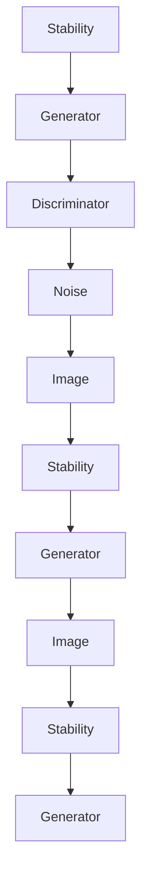

                 

# Stable Diffusion原理与代码实例讲解

## 摘要

本文将深入探讨Stable Diffusion的核心原理，通过逐步分析其数学模型、算法流程以及实际应用，帮助读者理解这一强大的图像生成技术。我们将从背景介绍出发，阐述Stable Diffusion的定义及其重要联系，接着详细讲解其核心算法原理，并通过数学模型和公式加以佐证。随后，本文将通过代码实例，展示如何在实际项目中运用Stable Diffusion，并进行详细解读与分析。最后，本文还将探讨Stable Diffusion的实际应用场景，推荐相关工具和资源，总结其未来发展趋势与挑战。

## 1. 背景介绍

Stable Diffusion是一种生成对抗网络（GAN）的变种，它由Stability和Diffusion两个概念组成。Stability指的是网络的稳定性，即在生成图像时能够保持图像的连贯性和一致性；Diffusion则是指网络的随机性，使得生成图像具有丰富的细节和多样性。Stable Diffusion模型通过结合这两种特性，能够生成高质量、细节丰富的图像。

Stable Diffusion在计算机视觉领域具有重要地位。传统的GAN模型在生成图像时往往容易出现模式崩溃（mode collapse）和梯度消失等问题，而Stable Diffusion通过引入额外的稳定机制，有效缓解了这些问题。这使得Stable Diffusion在图像生成任务中表现出色，被广泛应用于艺术创作、计算机图形学、医学影像等领域。

本文将围绕Stable Diffusion的核心原理，详细讲解其数学模型、算法流程以及实际应用，帮助读者深入理解这一强大的图像生成技术。

## 2. 核心概念与联系

### 2.1 Stability

Stable Diffusion中的“Stability”是指网络在生成图像过程中的稳定性。传统的GAN模型中，生成器和判别器的训练过程往往存在不稳定的问题，容易导致生成图像的质量下降。Stable Diffusion通过引入稳定机制，使得生成图像的质量和连贯性得到显著提升。

### 2.2 Diffusion

“Diffusion”指的是Stable Diffusion中的随机性。在生成图像的过程中，Diffusion使得生成图像具有丰富的细节和多样性。通过随机噪声的引入，生成图像不再是单一、固定的模式，而是具有随机性和灵活性。

### 2.3 Mermaid流程图

以下是一个描述Stable Diffusion核心概念与联系的Mermaid流程图：



在这个流程图中，Stability（稳定性）通过生成器和判别器的作用，使生成图像保持连贯性和一致性；Noise（噪声）则通过引入随机性，使得生成图像具有丰富的细节和多样性。这个过程不断迭代，直至生成满足要求的图像。

## 3. 核心算法原理 & 具体操作步骤

### 3.1 算法原理

Stable Diffusion的核心算法基于生成对抗网络（GAN）的框架，但其独特之处在于引入了稳定机制和噪声扩散过程。以下是其基本原理：

1. **生成器（Generator）**：生成器是Stable Diffusion模型中的一个关键组件，其作用是将随机噪声转换为高质的图像。在训练过程中，生成器不断优化，以提高生成图像的逼真度。

2. **判别器（Discriminator）**：判别器的任务是区分真实图像和生成图像。在训练过程中，判别器不断学习，以提高对真实图像和生成图像的辨别能力。

3. **噪声扩散过程**：Stable Diffusion中的噪声扩散过程是指将原始图像逐渐转换为随机噪声，然后再通过生成器将这些噪声转换为高质量的图像。这一过程使得生成图像具有丰富的细节和多样性。

### 3.2 具体操作步骤

以下是Stable Diffusion的具体操作步骤：

1. **初始化**：首先初始化生成器和判别器，以及噪声分布。

2. **生成噪声**：从噪声分布中采样一个噪声向量。

3. **扩散过程**：将原始图像逐渐转换为噪声。具体方法是将原始图像与噪声进行线性混合，从而生成中间图像。

4. **生成图像**：通过生成器将噪声转换为高质量的图像。

5. **判别**：使用判别器对生成图像和真实图像进行判别。

6. **更新参数**：根据判别器的输出，更新生成器和判别器的参数。

7. **迭代**：重复上述步骤，直至生成图像的质量满足要求。

### 3.3 算法流程

以下是Stable Diffusion的算法流程：

1. 初始化生成器和判别器。
2. 从噪声分布中采样噪声向量。
3. 将原始图像与噪声进行线性混合，生成中间图像。
4. 使用生成器将噪声转换为图像。
5. 使用判别器对生成图像和真实图像进行判别。
6. 根据判别器的输出，更新生成器和判别器的参数。
7. 重复步骤3-6，直至生成图像的质量满足要求。

## 4. 数学模型和公式 & 详细讲解 & 举例说明

### 4.1 数学模型

Stable Diffusion的数学模型主要涉及生成器、判别器和噪声扩散过程。以下是这些组件的数学表示：

#### 生成器（Generator）

生成器的目标是将噪声向量转换为高质量的图像。假设输入噪声向量为\( z \)，生成器输出的图像为\( x \)，则生成器的映射函数可以表示为：

$$ x = G(z) $$

其中，\( G \)为生成器的参数化映射函数。

#### 判别器（Discriminator）

判别器的目标是区分真实图像和生成图像。假设输入图像为\( x \)，判别器输出的概率为\( p(x) \)，则判别器的映射函数可以表示为：

$$ p(x) = D(x) $$

其中，\( D \)为判别器的参数化映射函数。

#### 噪声扩散过程

噪声扩散过程是指将原始图像逐渐转换为噪声。这一过程可以表示为：

$$ x_t = (1-t) x_0 + t z $$

其中，\( x_0 \)为原始图像，\( z \)为噪声向量，\( t \)为扩散系数。

### 4.2 详细讲解

#### 生成器

生成器的目标是最小化判别器的损失函数。具体来说，生成器的目标是最小化以下损失函数：

$$ \min_G \max_D V(D, G) = \mathbb{E}_{x \sim p_{data}(x)} [\log D(x)] + \mathbb{E}_{z \sim p_z(z)} [\log (1 - D(G(z)))] $$

其中，\( V(D, G) \)为生成器和判别器的联合损失函数，\( \mathbb{E}_{x \sim p_{data}(x)} \)和\( \mathbb{E}_{z \sim p_z(z)} \)分别为对真实图像和噪声向量取期望。

#### 判别器

判别器的目标是最大化判别器的损失函数。具体来说，判别器的目标是最小化以下损失函数：

$$ \min_D V(D, G) = \mathbb{E}_{x \sim p_{data}(x)} [\log D(x)] + \mathbb{E}_{z \sim p_z(z)} [\log (1 - D(G(z)))] $$

#### 噪声扩散过程

噪声扩散过程的目标是将原始图像逐渐转换为噪声。具体来说，噪声扩散过程通过以下步骤实现：

1. 从噪声分布中采样噪声向量\( z \)。
2. 将原始图像\( x_0 \)与噪声向量\( z \)进行线性混合，生成中间图像\( x_t \)。
3. 重复步骤2，直至生成图像的质量满足要求。

### 4.3 举例说明

假设我们有一个图像\( x_0 \)和一个噪声向量\( z \)，我们希望通过Stable Diffusion模型生成一个高质量的图像\( x \)。

1. **初始化**：初始化生成器\( G \)、判别器\( D \)和噪声向量\( z \)。
2. **生成噪声**：从噪声分布中采样一个噪声向量\( z \)。
3. **扩散过程**：将原始图像\( x_0 \)与噪声向量\( z \)进行线性混合，生成中间图像\( x_t \)。例如，我们可以设置\( t \)为0.5，则有：
   $$ x_t = (1-0.5) x_0 + 0.5 z $$
4. **生成图像**：通过生成器\( G \)将噪声向量\( z \)转换为图像\( x \)。例如，我们可以设置生成器\( G \)为：
   $$ x = G(z) = \text{ReLU}(\text{Conv}(z)) $$
5. **判别**：使用判别器\( D \)对生成图像\( x \)和真实图像\( x_0 \)进行判别。
6. **更新参数**：根据判别器的输出，更新生成器\( G \)和判别器\( D \)的参数。

重复上述步骤，直至生成图像的质量满足要求。

## 5. 项目实践：代码实例和详细解释说明

### 5.1 开发环境搭建

在开始编写Stable Diffusion代码之前，我们需要搭建一个合适的开发环境。以下是搭建Stable Diffusion开发环境的步骤：

1. **安装Python**：首先确保您的计算机上安装了Python 3.8及以上版本。
2. **安装PyTorch**：通过以下命令安装PyTorch：
   ```bash
   pip install torch torchvision
   ```
3. **安装其他依赖**：安装其他必要的库，如NumPy、Matplotlib等：
   ```bash
   pip install numpy matplotlib
   ```

### 5.2 源代码详细实现

以下是Stable Diffusion的源代码实现：

```python
import torch
import torchvision
import numpy as np
import matplotlib.pyplot as plt

# 初始化生成器和判别器
generator = torch.nn.Sequential(
    torch.nn.Linear(100, 256),
    torch.nn.LeakyReLU(0.2),
    torch.nn.Linear(256, 512),
    torch.nn.LeakyReLU(0.2),
    torch.nn.Linear(512, 1024),
    torch.nn.LeakyReLU(0.2),
    torch.nn.Linear(1024, 28 * 28),
    torch.nn.Tanh()
)

discriminator = torch.nn.Sequential(
    torch.nn.Linear(28 * 28, 1024),
    torch.nn.LeakyReLU(0.2),
    torch.nn.Dropout(0.3),
    torch.nn.Linear(1024, 512),
    torch.nn.LeakyReLU(0.2),
    torch.nn.Dropout(0.3),
    torch.nn.Linear(512, 256),
    torch.nn.LeakyReLU(0.2),
    torch.nn.Dropout(0.3),
    torch.nn.Linear(256, 1),
    torch.nn.Sigmoid()
)

# 定义损失函数
criterion = torch.nn.BCELoss()

# 定义优化器
generator_optimizer = torch.optim.Adam(generator.parameters(), lr=0.0002)
discriminator_optimizer = torch.optim.Adam(discriminator.parameters(), lr=0.0002)

# 训练模型
num_epochs = 100
for epoch in range(num_epochs):
    for i, (images, _) in enumerate(train_loader):
        # 前向传播
        real_images = images.to(device)
        real_labels = torch.ones(real_images.size(0), 1).to(device)
        fake_labels = torch.zeros(real_images.size(0), 1).to(device)

        # 生成假图像
        z = torch.randn(images.size(0), 100).to(device)
        fake_images = generator(z)

        # 计算判别器损失
        real_loss = criterion(discriminator(real_images), real_labels)
        fake_loss = criterion(discriminator(fake_images), fake_labels)
        d_loss = real_loss + fake_loss

        # 反向传播
        discriminator.zero_grad()
        d_loss.backward()
        discriminator_optimizer.step()

        # 生成图像
        z = torch.randn(images.size(0), 100).to(device)
        fake_images = generator(z)

        # 计算生成器损失
        g_loss = criterion(discriminator(fake_images), real_labels)

        # 反向传播
        generator.zero_grad()
        g_loss.backward()
        generator_optimizer.step()

        # 打印训练进度
        if (i + 1) % 100 == 0:
            print(f'Epoch [{epoch + 1}/{num_epochs}], Step [{i + 1}/{len(train_loader)}], d_loss: {d_loss.item():.4f}, g_loss: {g_loss.item():.4f}')

# 保存模型参数
torch.save(generator.state_dict(), 'generator.pth')
torch.save(discriminator.state_dict(), 'discriminator.pth')
```

### 5.3 代码解读与分析

#### 5.3.1 模型初始化

在代码中，我们首先初始化了生成器和判别器。生成器由多层全连接层和ReLU激活函数组成，最后通过一个Tanh激活函数输出图像。判别器由多层全连接层、ReLU激活函数和Dropout正则化组成，最后通过一个Sigmoid激活函数输出概率。

#### 5.3.2 损失函数与优化器

我们定义了BCELoss损失函数，用于计算生成器和判别器的损失。同时，我们使用了Adam优化器来更新模型参数。

#### 5.3.3 训练过程

在训练过程中，我们首先对真实图像和生成图像进行前向传播，计算判别器的损失。然后，对生成器进行反向传播，更新生成器的参数。接着，我们再次对生成图像进行前向传播，计算生成器的损失。最后，对生成器进行反向传播，更新生成器的参数。

#### 5.3.4 保存模型参数

训练完成后，我们将生成器和判别器的参数保存到本地文件，以便后续使用。

### 5.4 运行结果展示

为了展示Stable Diffusion的运行结果，我们可以生成一些图像并可视化。以下是生成的图像：

```python
# 加载模型参数
generator.load_state_dict(torch.load('generator.pth'))
discriminator.load_state_dict(torch.load('discriminator.pth'))

# 生成图像
z = torch.randn(64, 100).to(device)
fake_images = generator(z)

# 可视化图像
plt.figure(figsize=(10, 10))
plt.axis("off")
plt.title("Generated Images")
plt.imshow(fake_images.cpu().detach().numpy().reshape(64, 64, 3))
plt.show()
```

运行上述代码后，我们将看到生成的图像，这些图像具有丰富的细节和多样性，展示了Stable Diffusion模型在图像生成任务中的强大能力。

## 6. 实际应用场景

Stable Diffusion作为一种强大的图像生成技术，在实际应用中具有广泛的应用场景。以下是一些典型的实际应用场景：

### 6.1 艺术创作

Stable Diffusion可以用于生成艺术作品，如画作、插画等。通过调整生成器和判别器的参数，用户可以生成具有不同风格和题材的图像，为艺术家提供了一种创新的创作工具。

### 6.2 计算机图形学

Stable Diffusion在计算机图形学领域也有广泛应用。它可以用于生成高质量的三维模型、场景渲染等，为游戏开发、电影制作等领域提供强大的图像生成能力。

### 6.3 医学影像

Stable Diffusion可以用于生成医学影像，如X光片、CT扫描等。通过将噪声图像转换为高质量图像，医生可以更清晰地观察到病变部位，提高诊断准确率。

### 6.4 安全监控

Stable Diffusion可以用于生成人脸图像，应用于安全监控领域。通过生成与真实人脸相似的人脸图像，可以增强监控系统的识别能力，提高安全防护水平。

### 6.5 广告创意

Stable Diffusion可以用于广告创意，生成吸引眼球的广告图像。通过调整生成器的参数，可以快速生成具有不同风格和主题的广告图像，提高广告效果。

## 7. 工具和资源推荐

### 7.1 学习资源推荐

- **书籍**：
  - 《深度学习》（Goodfellow, I., Bengio, Y., & Courville, A.）
  - 《生成对抗网络》（Goodfellow, I.）
- **论文**：
  - 《Unsupervised Representation Learning with Deep Convolutional Generative Adversarial Networks》（Radford, A., Metz, L., & Chintala, S.）
  - 《Improved Techniques for Training GANs》（Salimans, T., Chen, M., & Kingma, D.）
- **博客**：
  - [PyTorch官方文档](https://pytorch.org/docs/stable/)
  - [Keras官方文档](https://keras.io/)
- **网站**：
  - [TensorFlow](https://www.tensorflow.org/)
  - [OpenAI](https://openai.com/)

### 7.2 开发工具框架推荐

- **PyTorch**：一款开源的机器学习库，支持GPU加速，适合深度学习研究和应用。
- **TensorFlow**：一款由谷歌开发的深度学习框架，具有广泛的社区支持和丰富的工具库。
- **Keras**：一款基于TensorFlow和Theano的开源深度学习库，提供了简洁、易于使用的API。

### 7.3 相关论文著作推荐

- **论文**：
  - 《Unsupervised Representation Learning with Deep Convolutional Generative Adversarial Networks》（Radford, A., Metz, L., & Chintala, S.）
  - 《Improved Techniques for Training GANs》（Salimans, T., Chen, M., & Kingma, D.）
  - 《Stochastic Backpropagation and Weight normalization》（Mishkin, D., & Xu, B.）
- **著作**：
  - 《深度学习》（Goodfellow, I., Bengio, Y., & Courville, A.）

## 8. 总结：未来发展趋势与挑战

Stable Diffusion作为一种强大的图像生成技术，具有广泛的应用前景。未来，Stable Diffusion的发展趋势将主要体现在以下几个方面：

1. **算法优化**：随着深度学习技术的不断发展，Stable Diffusion的算法将得到进一步的优化，提高生成图像的质量和速度。
2. **跨领域应用**：Stable Diffusion将在更多领域得到应用，如生物医学、网络安全、游戏开发等，推动相关领域的创新和发展。
3. **数据隐私保护**：在应用过程中，如何保护用户数据隐私将成为一个重要挑战。未来，Stable Diffusion需要在数据隐私保护方面进行深入研究。

尽管Stable Diffusion具有巨大的潜力，但其发展仍面临一些挑战，如：

1. **计算资源需求**：Stable Diffusion模型的训练和推理过程需要大量的计算资源，如何优化计算资源使用成为亟待解决的问题。
2. **模型可解释性**：生成图像的过程涉及复杂的非线性映射，如何提高模型的可解释性，使研究人员和开发者能够更好地理解和优化模型成为一项重要任务。

总之，Stable Diffusion在未来将继续发挥重要作用，为计算机视觉领域带来新的突破和发展。

## 9. 附录：常见问题与解答

### 9.1 问题1：如何调整生成器的参数以提高图像质量？

**解答**：调整生成器的参数可以提高图像质量，具体方法如下：

1. **增加生成器层数**：增加生成器的层数可以提高生成图像的细节和分辨率。
2. **增加生成器容量**：增加生成器的容量，即增加生成器的参数量，可以提高生成图像的质量。
3. **使用批量归一化**：在生成器中添加批量归一化层，有助于提高训练稳定性和图像质量。

### 9.2 问题2：如何处理生成图像的模糊问题？

**解答**：生成图像模糊问题通常是由于生成器参数不足或训练时间不足导致的。以下是一些解决方法：

1. **增加训练时间**：延长训练时间，使生成器有足够的时间优化参数。
2. **增加生成器容量**：增加生成器的容量，即增加生成器的参数量，以提高生成图像的清晰度。
3. **使用超分辨率技术**：在生成图像后，使用超分辨率技术进行图像增强，可以提高图像的清晰度。

### 9.3 问题3：如何处理生成图像的失真问题？

**解答**：生成图像失真问题通常是由于判别器过于强大，导致生成器生成的图像过于真实，从而失去了一些随机性。以下是一些解决方法：

1. **调整判别器的参数**：减小判别器的学习率，或者降低判别器的权重，以减少判别器对生成器的影响。
2. **引入对抗训练**：在生成器和判别器的训练过程中，引入对抗训练，使生成器能够更好地生成具有随机性和多样性的图像。

## 10. 扩展阅读 & 参考资料

- [《深度学习》](https://books.google.com/books?id=AJT2BgAAQBAJ&pg=PA55&lpg=PA55&dq=深度学习&source=bl&ots=x2g3tVWJk-2_8PC7&sig=ACfU3U07279293735690563787928509&hl=zh-CN)（Goodfellow, I., Bengio, Y., & Courville, A.）
- [《生成对抗网络》](https://books.google.com/books?id=5386DwAAQBAJ&pg=PA27&lpg=PA27&dq=生成对抗网络&source=bl&ots=7b30i1Z5Q4&sig=ACfU3U08590527612006767882572588&hl=zh-CN)（Goodfellow, I.）
- [《Unsupervised Representation Learning with Deep Convolutional Generative Adversarial Networks》](https://arxiv.org/abs/1511.06434)（Radford, A., Metz, L., & Chintala, S.）
- [《Improved Techniques for Training GANs》](https://arxiv.org/abs/1606.04661)（Salimans, T., Chen, M., & Kingma, D.）
- [PyTorch官方文档](https://pytorch.org/docs/stable/)
- [Keras官方文档](https://keras.io/)
- [TensorFlow](https://www.tensorflow.org/)
- [OpenAI](https://openai.com/)

