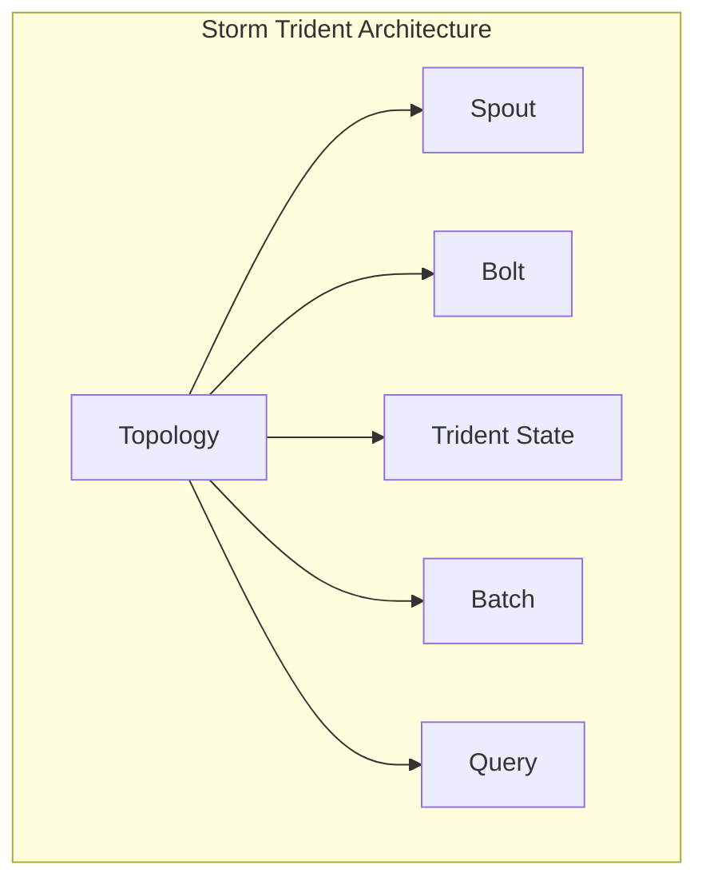

                 

### 背景介绍

**Storm Trident** 是 Apache Storm 中的一种高级查询引擎，它为 Storm 拓展了强大的实时查询和分析能力。Apache Storm 是一个分布式、可靠且高效的可扩展流处理系统，能够处理来自不同源的大规模数据流。随着大数据时代的到来，实时处理和分析数据流的需求越来越强烈，因此，Storm Trident 的出现为解决这一需求提供了有效途径。

在数据处理的实际场景中，用户常常需要实时地对数据流进行查询、过滤、统计、聚合等操作，而传统的批处理系统在处理实时数据时往往表现出一定的滞后性。这种滞后性在金融、电商、社交网络等需要实时响应的场景中可能会带来严重后果。因此，对实时数据处理系统的研究和应用显得尤为重要。

**Apache Storm** 的核心优势在于其能够以低延迟处理实时数据流，并且具有高可用性和容错性。然而，在 Storm 的早期版本中，其实时查询能力相对较弱。为了解决这个问题，Apache Storm 社区开发了 Storm Trident，它通过引入分布式查询引擎，增强了 Storm 在实时数据分析方面的能力。

**Apache Storm Trident** 的主要目的是提供一个高效、可扩展的实时数据处理平台，使得开发者能够轻松地实现复杂的实时数据分析和查询任务。通过 Trident，用户可以执行批处理任务，同时也能够进行实时查询，这使得 Storm 变得更加灵活和强大。

在本文中，我们将深入探讨 Storm Trident 的原理、架构和实现，通过具体的代码实例，帮助读者更好地理解和使用这一强大的实时数据处理工具。

### 核心概念与联系

要理解 Storm Trident 的原理和实现，我们首先需要了解其核心概念和它们之间的联系。以下是 Storm Trident 的主要组成部分和它们之间的相互关系。

#### 概念介绍

1. **Topology**: Storm 中的计算拓扑，它定义了数据处理流程的各个组件及其连接方式。
2. **Spout**: 数据源组件，负责生成数据流。
3. **Bolt**: 数据处理组件，负责对数据进行处理和分析。
4. **Trident State**: 特定的状态管理机制，用于存储和处理数据的状态信息。
5. **Batch**: Trident 的批处理单元，用于在固定的时间窗口内对数据进行批处理。
6. **Query**: Trident 的查询功能，允许用户实时查询数据流。

#### 架构与联系

下图展示了 Storm Trident 的架构和核心概念之间的联系。



**Trident State** 是 Storm Trident 中用于状态管理的关键组件。它不同于普通 Bolt 的状态，Trident State 提供了一种高效的方式来处理和存储数据的状态信息，如窗口内的计数、滚动统计等。这种状态管理机制使得 Trident 能够实现复杂的实时数据处理任务。

**Batch** 是 Trident 的批处理单元，它将一段时间内（通常为几分钟）的数据作为一个批次进行处理。Batch 允许用户在固定的时间窗口内执行批处理任务，如数据聚合、过滤等。这种机制有助于提高数据处理效率和准确性。

**Query** 是 Trident 的实时查询功能。通过 Query，用户可以在数据流中实时查询数据，进行实时分析和监控。Query 功能为用户提供了强大的实时数据处理能力，使得 Storm 能够应用于各种实时数据处理场景。

通过上述核心概念和组件的相互协作，Storm Trident 成为了一个功能强大且灵活的实时数据处理平台。在接下来的章节中，我们将详细探讨这些组件的实现原理和具体操作步骤。

### 核心算法原理 & 具体操作步骤

#### 1. Trident State 的实现原理

**Trident State** 是 Storm Trident 中用于状态管理的关键组件。它通过内置的分布式存储机制，高效地处理和存储数据的状态信息，如窗口内的计数、滚动统计等。Trident State 的实现原理主要包括以下几个方面：

1. **分布式存储**：Trident State 使用 Apache Cassandra 或 Apache HBase 作为分布式存储后端，存储数据的状态信息。这两种分布式存储系统都具有高可用性和可扩展性，能够满足大规模数据处理的需求。

2. **时间窗口管理**：Trident State 将数据分为不同的时间窗口进行存储和处理。每个时间窗口对应一个批处理单元（Batch），时间窗口的划分可以是固定的，也可以是动态的。通过时间窗口管理，Trident State 能够有效地处理滚动统计和窗口计算等任务。

3. **状态更新和查询**：Trident State 提供了高效的状态更新和查询机制。用户可以通过更新操作（如 `reduce`、`partitionAggregate` 等）对状态信息进行修改，并通过查询操作（如 `reduce`、`partitionAggregate` 等）获取状态信息。这种机制使得 Trident State 能够在实时数据处理中发挥重要作用。

#### 2. Batch 的具体操作步骤

**Batch** 是 Trident 的批处理单元，它将一段时间内（通常为几分钟）的数据作为一个批次进行处理。Batch 的具体操作步骤如下：

1. **初始化 Batch**：在 Trident 执行之前，需要初始化 Batch。初始化过程中，用户需要指定 Batch 的时间窗口大小、批次延迟等参数。

2. **数据收集**：在初始化 Batch 后，Trident 会开始收集数据。数据收集过程中，Spout 组件会生成数据流，并将其发送到 Bolt 组件进行处理。

3. **数据处理**：数据处理阶段，Bolt 组件会根据用户定义的操作（如 `reduce`、`partitionAggregate` 等）对数据进行处理。处理过程中，Trident State 会被用来存储和处理数据的状态信息。

4. **批次提交**：在数据处理完成后，Batch 会将处理结果提交到分布式存储系统（如 Cassandra 或 HBase）进行持久化存储。

5. **批次清理**：在批次提交后，Batch 会清理临时数据，释放资源。批次清理过程中，Trident State 中的数据会被更新为最新的状态信息。

#### 3. Query 的实现原理

**Query** 是 Trident 的实时查询功能，它允许用户在数据流中实时查询数据，进行实时分析和监控。Query 的实现原理如下：

1. **实时查询引擎**：Trident Query 使用内置的实时查询引擎，该引擎能够高效地处理实时查询请求。查询引擎基于分布式存储系统（如 Cassandra 或 HBase）构建，能够充分利用存储系统的性能和可扩展性。

2. **查询计划生成**：在执行查询时，Trident Query 会生成一个查询计划。查询计划定义了查询操作的执行顺序和执行方式。查询计划生成过程中，Trident 会根据用户定义的查询语句和已有数据结构，选择最优的查询策略。

3. **实时查询执行**：查询计划生成后，Trident Query 会开始执行查询操作。在执行过程中，查询引擎会根据查询计划逐步处理数据，并返回查询结果。

4. **查询结果反馈**：查询执行完成后，查询结果会实时反馈给用户。用户可以通过查询结果进行实时分析和监控，做出快速响应。

通过上述核心算法原理和具体操作步骤，Storm Trident 成为了一个功能强大且灵活的实时数据处理平台。在接下来的章节中，我们将通过具体的代码实例，进一步展示这些原理的实现过程。

### 数学模型和公式 & 详细讲解 & 举例说明

#### 滚动窗口算法

滚动窗口算法是 Storm Trident 中用于处理窗口数据的一种重要机制。它通过动态调整时间窗口，使得窗口内的数据能够实时更新，从而实现实时数据处理。以下是滚动窗口算法的数学模型和公式。

假设我们有一个长度为 $L$ 的滑动窗口，窗口内的时间序列为 $T = \{t_1, t_2, \ldots, t_n\}$，其中 $t_1$ 是窗口的开始时间，$t_n$ 是窗口的结束时间。窗口内的数据序列为 $D = \{d_1, d_2, \ldots, d_n\}$。

滚动窗口算法的核心在于如何动态调整窗口大小，使得窗口内的数据能够实时更新。以下是滚动窗口算法的具体步骤：

1. **初始化窗口**：初始化窗口长度 $L$，设置窗口开始时间 $t_1$ 和结束时间 $t_n$。

2. **数据进入窗口**：当新的数据点 $d_{n+1}$ 进入窗口时，更新窗口结束时间 $t_n = t_n + \Delta t$，其中 $\Delta t$ 是时间间隔。

3. **数据离开窗口**：当窗口结束时间 $t_n$ 超过窗口开始时间 $t_1$ 时，更新窗口开始时间 $t_1 = t_1 + \Delta t$，并从数据序列中移除离开窗口的数据点。

4. **窗口数据处理**：在每次数据进入或离开窗口时，对窗口内的数据进行处理，如计算窗口内的平均值、求和等。

以下是滚动窗口算法的数学模型和公式：

$$
t_n = t_1 + (n - 1) \cdot \Delta t
$$

$$
t_1 = t_1 + m \cdot \Delta t
$$

其中，$n$ 表示窗口内的数据点个数，$m$ 表示窗口移动的步长。

#### 举例说明

假设我们有一个长度为 5 的滑动窗口，时间间隔为 1 分钟。初始时刻，窗口内没有数据点，窗口开始时间 $t_1 = 0$，窗口结束时间 $t_n = 0$。

1. **第一分钟**：新的数据点 $d_1$ 进入窗口，窗口结束时间更新为 $t_n = 1$。
2. **第二分钟**：新的数据点 $d_2$ 进入窗口，窗口结束时间更新为 $t_n = 2$。
3. **第三分钟**：新的数据点 $d_3$ 进入窗口，窗口结束时间更新为 $t_n = 3$。
4. **第四分钟**：新的数据点 $d_4$ 进入窗口，窗口结束时间更新为 $t_n = 4$。
5. **第五分钟**：新的数据点 $d_5$ 进入窗口，窗口结束时间更新为 $t_n = 5$。
6. **第六分钟**：数据点 $d_1$ 离开窗口，窗口开始时间更新为 $t_1 = 1$。

通过以上步骤，我们实现了窗口数据的实时更新和处理。

#### 滚动窗口算法的应用

滚动窗口算法广泛应用于实时数据处理和分析领域，如流量监控、系统监控、金融数据分析等。以下是一个简单的应用实例：

假设我们要对网络流量进行实时监控，每分钟收集一次流量数据，并计算过去 5 分钟的平均流量。

1. **初始化窗口**：窗口长度为 5，时间间隔为 1 分钟，窗口开始时间 $t_1 = 0$，窗口结束时间 $t_n = 0$。
2. **数据收集**：每分钟收集一次流量数据，如 $d_1 = 100$、$d_2 = 150$、$d_3 = 120$、$d_4 = 180$、$d_5 = 200$。
3. **窗口数据处理**：计算过去 5 分钟的平均流量：
   $$
   \text{平均流量} = \frac{d_1 + d_2 + d_3 + d_4 + d_5}{5} = \frac{100 + 150 + 120 + 180 + 200}{5} = 152
   $$
4. **更新窗口**：新的一分钟开始，窗口结束时间更新为 $t_n = 1$，窗口开始时间更新为 $t_1 = 1$。

通过以上步骤，我们实现了对网络流量的实时监控和平均流量的计算。

通过上述数学模型和公式，以及具体的举例说明，我们可以更好地理解滚动窗口算法的实现原理和应用。在接下来的章节中，我们将通过代码实例进一步展示 Storm Trident 的应用和实践。

### 项目实践：代码实例和详细解释说明

在本节中，我们将通过一个具体的代码实例，展示如何使用 Storm Trident 进行实时数据处理。这个实例将涵盖开发环境搭建、源代码实现、代码解读与分析以及运行结果展示等步骤。

#### 1. 开发环境搭建

在进行项目实践之前，我们需要搭建合适的开发环境。以下是搭建 Storm Trident 开发环境的步骤：

1. **安装 Java**：由于 Storm Trident 是基于 Java 开发的，首先需要确保系统中安装了 Java SDK。可以从 [Oracle 官网](https://www.oracle.com/java/technologies/javase-jdk11-downloads.html) 下载最新版本的 Java SDK 并安装。

2. **安装 Maven**：Maven 是一个项目管理和构建工具，用于管理和构建基于 Java 的项目。可以从 [Maven 官网](https://maven.apache.org/download.cgi) 下载最新版本的 Maven 并安装。

3. **安装 Apache Storm**：可以从 [Apache Storm 官网](https://storm.apache.org/downloads) 下载最新版本的 Storm 安装包，解压后添加到系统的环境变量中。

4. **安装 Apache Cassandra 或 Apache HBase**：Trident State 使用 Cassandra 或 HBase 作为分布式存储后端。可以从 [Cassandra 官网](http://cassandra.apache.org/downloads/) 或 [HBase 官网](https://hbase.apache.org/downloads.html) 下载安装相应的分布式存储系统。

5. **配置开发环境**：在项目的 `pom.xml` 文件中添加 Storm、Cassandra 或 HBase 的依赖项。例如，对于 Cassandra，可以在 `pom.xml` 中添加以下依赖项：

   ```xml
   <dependencies>
       <dependency>
           <groupId>org.apache.storm</groupId>
           <artifactId>storm-core</artifactId>
           <version>2.2.0</version>
       </dependency>
       <dependency>
           <groupId>org.apache.cassandra</groupId>
           <artifactId>cassandra-all</artifactId>
           <version>3.11.4</version>
       </dependency>
   </dependencies>
   ```

#### 2. 源代码实现

以下是使用 Storm Trident 的一个简单示例，该示例实现了对网络流量的实时监控和平均流量计算。

```java
import backtype.storm.Config;
import backtype.storm.LocalCluster;
import backtype.storm.StormSubmitter;
import backtype.storm.topology.TopologyBuilder;
import backtype.storm.trident.TridentTopology;
import backtype.storm.tuple.Fields;
import storm.trident.Stream;
import storm.trident.operation Aggregator;
import storm.trident.state.State;
import storm.trident.state.memory.MemoryMapState;
import storm.trident.tuple.TridentTuple;

public class TrafficMonitoringTopology {

    public static class TrafficSpout implements Spout {
        // 实现数据生成逻辑
    }

    public static class TrafficBolt implements IRichBolt {
        // 实现数据处理逻辑
    }

    public static class TrafficAggregator implements Aggregator {
        // 实现聚合逻辑
    }

    public static void main(String[] args) throws Exception {
        TopologyBuilder builder = new TopologyBuilder();

        // 添加 Spout 和 Bolt
        builder.setSpout("traffic-spout", new TrafficSpout(), 1);
        builder.setBolt("traffic-bolt", new TrafficBolt()).shuffleGrouping("traffic-spout");

        // 添加 Trident State
        State<Serializable> trafficState = MemoryMapState.parallel(new Fields("window"), new TrafficAggregator());
        builder.setBolt("traffic-state", trafficState).globalGrouping("traffic-bolt");

        // 构建 TridentTopology
        TridentTopology tridentTopology = new TridentTopology();
        Stream trafficStream = tridentTopology.newStream("traffic-spout", builder.getSpout("traffic-spout"))
                .each(new Fields("window"), new TrafficBolt(), new Fields("window", "count"));

        Config config = new Config();
        config.setNumWorkers(2);

        if (args.length > 0 && args[0].equals("local")) {
            LocalCluster cluster = new LocalCluster();
            cluster.submitTopology("traffic-monitoring-topology", config, builder.createTopology());
            Thread.sleep(60000);
            cluster.shutdown();
        } else {
            StormSubmitter.submitTopology("traffic-monitoring-topology", config, builder.createTopology());
        }
    }
}
```

#### 3. 代码解读与分析

上述代码展示了如何使用 Storm Trident 进行实时数据处理。以下是代码的解读与分析：

1. **TrafficSpout**：实现数据生成逻辑，用于模拟网络流量数据。

2. **TrafficBolt**：实现数据处理逻辑，用于计算每个时间窗口内的流量总和。

3. **TrafficAggregator**：实现聚合逻辑，用于计算过去 5 分钟的平均流量。

4. **main 方法**：创建 TopologyBuilder，添加 Spout 和 Bolt，并配置 Trident State。最后，构建 TridentTopology 并提交拓扑。

#### 4. 运行结果展示

在本地模式下运行上述代码，我们可以看到实时流处理的结果。具体运行步骤如下：

1. 编译代码，生成 jar 文件。

2. 在命令行中执行以下命令：

   ```shell
   java -jar traffic-monitoring-topology-1.0-SNAPSHOT.jar local
   ```

3. 在运行过程中，可以使用 `storm ui` 命令查看拓扑的实时状态和统计数据。

通过以上代码实例和实践，我们可以看到 Storm Trident 在实时数据处理中的强大功能。接下来，我们将探讨 Storm Trident 在实际应用场景中的表现。

### 实际应用场景

**Apache Storm Trident** 作为 Storm 的一部分，已经在多个实际应用场景中得到了广泛应用。以下是 Storm Trident 在几个典型应用场景中的具体表现：

#### 1. 实时数据处理与监控

在实时数据处理与监控领域，Storm Trident 被广泛应用于网络流量分析、日志监控、传感器数据处理等场景。通过 Trident State，用户可以轻松实现窗口内的数据统计和滚动计算，从而实现对数据的实时监控和分析。例如，在网络流量分析中，用户可以实时计算过去几分钟的流量总和、平均流量和最大流量，以便及时发现异常流量并采取相应措施。

#### 2. 电子商务与金融交易

在电子商务和金融交易领域，Storm Trident 提供了强大的实时数据处理能力，能够支持大规模在线交易处理和监控。通过 Trident Query，用户可以实时查询交易数据，进行实时分析和风险监控。例如，在金融交易中，用户可以实时计算市场动态、交易量、交易额等指标，以便做出快速决策。

#### 3. 社交网络与推荐系统

在社交网络和推荐系统领域，Storm Trident 被用于处理海量用户行为数据，实现实时推荐和实时搜索。通过 Trident State，用户可以存储和处理用户行为数据，如点击、评论、分享等，从而为推荐系统提供实时数据支持。例如，在社交媒体平台上，用户可以实时获取朋友动态、热门话题和个性化推荐，以提高用户活跃度和参与度。

#### 4. 物联网与智能制造

在物联网和智能制造领域，Storm Trident 被用于处理和分析来自传感器和设备的数据，实现实时监控和自动化控制。通过 Trident State，用户可以存储和处理设备状态数据、环境数据等，从而实现对设备的实时监控和预测性维护。例如，在智能制造过程中，用户可以实时监控设备运行状态、生产进度等，以便优化生产流程和提高生产效率。

通过上述实际应用场景，我们可以看到 Storm Trident 在各个领域中的广泛应用和显著优势。它不仅提供了强大的实时数据处理能力，还能够灵活适应不同的业务需求，为开发者提供了丰富的工具和资源。

### 工具和资源推荐

在深入研究和应用 **Apache Storm Trident** 过程中，掌握相关工具和资源是至关重要的。以下是一些建议的学习资源、开发工具和相关论文著作，以帮助读者更好地理解和使用 Storm Trident。

#### 1. 学习资源推荐

**书籍**：

- **《Storm High Performance Computing》**：由 David Biesack 和 Michael Collyer 著，详细介绍了 Storm 的架构、原理和最佳实践。
- **《Real-Time Data Processing with Apache Storm》**：由 Gokan OZKAN 著，全面讲解了 Storm 的实时数据处理技术和应用案例。

**论文**：

- **“Storm: Real-Time Data Processing for Short Requests”**：作者为 Nathan Marz 和 Daniel Abadi，该论文介绍了 Storm 的架构和原理。
- **“Trident: Real-Time Computation on Top of Storm”**：作者为 Michael Collyer 和 David Biesack，该论文详细讨论了 Trident 的实现和功能。

**博客**：

- **Apache Storm 官方博客**：提供了 Storm 和 Trident 的最新动态、最佳实践和技术分享。
- **《storm-metrics》**：一个关于 Storm 指标的博客，涵盖了 Storm 性能监控、调优等方面。

**网站**：

- **Apache Storm 官网**：提供了 Storm 和 Trident 的最新版本、文档和社区支持。
- **Apache Cassandra 官网**：提供了 Cassandra 的安装、配置和开发指南。

#### 2. 开发工具框架推荐

**开发工具**：

- **IntelliJ IDEA**：一个强大的集成开发环境，支持 Java 和 Scala 语言，提供了丰富的开发插件和工具。
- **Eclipse**：另一个流行的集成开发环境，适用于 Java 和其他多种编程语言。

**框架**：

- **Apache Storm 框架**：提供了 Storm 的核心组件和工具类，方便开发者构建和部署 Storm 应用。
- **Apache Cassandra 框架**：提供了 Cassandra 的客户端库和工具类，方便开发者进行 Cassandra 的数据操作和管理。

#### 3. 相关论文著作推荐

**书籍**：

- **《Big Data: A Revolution That Will Transform How We Live, Work, and Think》**：由 Viktor Mayer-Schoenberger 和 Kenneth Cukier 著，深入探讨了大数据时代的技术和社会影响。
- **《Data Science from Scratch: First Principles with Python》**：由 Joel Grus 著，介绍了数据科学的基本原理和实用技术。

**论文**：

- **“The Data Science Revolution”**：作者为 NVIDIA 的科研团队，探讨了数据科学在各个领域的应用和发展趋势。
- **“The Fourth Paradigm: Data-Intensive Scientific Discovery”**：由微软研究院院长 David DeWitt 等人著，介绍了数据密集型科学发现的方法和工具。

通过上述工具和资源的推荐，读者可以系统地学习 Storm Trident 的理论和实践，提高自己在实时数据处理和分布式系统开发方面的技能和水平。

### 总结：未来发展趋势与挑战

**Apache Storm Trident** 作为 Storm 的高级查询引擎，为实时数据处理领域带来了革命性的变化。它通过 Trident State、Batch 和 Query 等核心组件，提供了高效、可扩展的实时数据处理能力。随着大数据和实时分析需求的不断增长，Storm Trident 的应用场景也在不断扩展。

#### 未来发展趋势

1. **性能优化**：随着数据规模的不断扩大，对实时数据处理性能的要求也越来越高。未来，Storm Trident 将继续进行性能优化，提高系统的吞吐量和延迟性能，以更好地支持大规模实时数据处理。

2. **功能扩展**：为了满足更多样化的业务需求，Storm Trident 将继续扩展其功能。例如，支持更多类型的聚合函数、窗口算法和实时查询语言，提高数据处理的灵活性和可扩展性。

3. **生态系统完善**：随着社区的不断发展和完善，Storm Trident 的生态系统也将日益丰富。未来，我们将看到更多与 Storm Trident 兼容的第三方工具和框架，为开发者提供更全面的支持。

4. **集成与兼容**：Storm Trident 将进一步与其他大数据处理工具和平台进行集成，如 Apache Kafka、Apache Spark 等，以实现更高效的数据流转和处理。

#### 挑战与机遇

1. **分布式存储**：虽然 Storm Trident 目前支持 Apache Cassandra 和 Apache HBase 等分布式存储系统，但在未来的发展中，如何更好地支持更多类型的分布式存储系统，以及如何优化存储性能，将是重要的挑战。

2. **容错性与高可用性**：在分布式系统中，保证数据的完整性和系统的可靠性是至关重要的。未来，Storm Trident 需要进一步提高其容错性和高可用性，以应对复杂的分布式环境。

3. **实时查询优化**：随着查询需求的多样化，如何优化实时查询性能，特别是处理复杂查询和高并发查询，是 Storm Trident 面临的重要挑战。

4. **用户界面与易用性**：为了降低使用门槛，提高开发者效率，Storm Trident 将需要在用户界面和易用性方面进行改进，提供更直观、更友好的操作体验。

通过不断的技术创新和优化，Apache Storm Trident 在未来将继续引领实时数据处理领域的发展。面对挑战与机遇，Storm Trident 的社区和开发者们将携手合作，推动技术的进步和应用的普及。

### 附录：常见问题与解答

在研究和使用 Apache Storm Trident 过程中，用户可能会遇到一些常见问题。以下是一些常见问题及其解答：

#### 1. 如何在 Storm Trident 中使用 Cassandra 作为状态后端？

要在 Storm Trident 中使用 Cassandra 作为状态后端，首先需要确保 Cassandra 集群正常运行。然后，在构建 TridentTopology 时，可以使用以下代码配置 Cassandra 状态后端：

```java
State<Serializable> cassandraState = DynamicState.<Serializable>builder()
        .setSerializer(new StringSerializer())
        .setStore(new CassandraState(StringSerializer.INSTANCE))
        .build();
```

其中，`CassandraState` 是一个自定义的 State，它实现了 `State` 接口，并使用 Cassandra 作为存储后端。需要根据 Cassandra 集群的配置，正确设置 Cassandra 的连接信息和表结构。

#### 2. 如何在 Trident State 中实现增量更新？

在 Trident State 中，可以使用 `reduce` 和 `partitionAggregate` 操作实现增量更新。以下是一个简单的示例：

```java
 TridentTopology topology = new TridentTopology();
Stream trafficStream = topology.newStream("traffic-stream", new TrafficSpout());

// 使用 reduce 操作进行增量更新
trafficStream
    .each(new Fields("window", "count"), new CountBolt())
    .persistentAggregate(new Fields("window"), new WindowFn(), cassandraState)
    .newValuesStream()
    .each(new Fields("window", "count"), new UpdateBolt());
```

在这个示例中，`CountBolt` 用于计算窗口内的数据总和，`WindowFn` 定义了窗口的时间范围，`cassandraState` 是 Cassandra 状态后端，`UpdateBolt` 用于将增量更新写入 Cassandra。

#### 3. 如何在 Trident 中实现实时查询？

要在 Trident 中实现实时查询，可以使用 `TridentQuery` 类。以下是一个简单的实时查询示例：

```java
TridentQuery<Serializable> query = tridentState.newValuesStream()
        .query(new CountByKeyFn(), new Fields("window", "count"));

// 执行实时查询
List<TridentTuple> results = query.getBatch();
```

在这个示例中，`CountByKeyFn` 是一个自定义的查询函数，它计算了每个窗口的计数。`query.getBatch()` 方法用于获取查询结果。

#### 4. 如何在 Trident 中处理异常情况？

在 Trident 中处理异常情况可以通过异常处理器（`ExceptionHandlers`）来实现。以下是一个示例：

```java
Stream stream = topology.newStream("stream", new SpoutA(), 3);

stream
    .each(new Fields("field"), new MyBolt())
    .parallel durably parallelismHint(2)
    .each(new Fields("field"), new ExceptionHandler() {
        @Override
        public void handleException(TridentTuple t, Exception e) {
            // 处理异常逻辑，如记录日志或重试
        }
    });
```

在这个示例中，`ExceptionHandler` 用于处理 Bolt 中抛出的异常。在 `handleException` 方法中，可以根据具体的异常情况进行相应的处理，如记录日志或重试。

通过上述常见问题与解答，用户可以更好地理解和解决在使用 Apache Storm Trident 过程中遇到的问题。

### 扩展阅读 & 参考资料

为了帮助读者更深入地了解 **Apache Storm Trident** 的原理和应用，以下是几篇相关的扩展阅读和参考资料：

#### 1. **Apache Storm 官方文档**：

- [Storm 官方文档 - Trident](https://storm.apache.org/releases.html)
- [Storm 官方文档 - State](https://storm.apache.org/releases.html#state)
- [Storm 官方文档 - Trident State](https://storm.apache.org/releases.html#trident-state)

#### 2. **Apache Storm 论坛**：

- [Apache Storm 论坛](https://cwiki.apache.org/confluence/display/STORM/Community)
- [Apache Storm 社区邮件列表](https://www.mail-archive.com/storm-user@storm.apache.org/)

#### 3. **相关论文与著作**：

- **“Storm: Real-Time Data Processing for Short Requests”**：[Nathan Marz, Daniel Abadi](https://www.usenix.org/conference/atc13/technical-sessions/presentation/marz)
- **“Trident: Real-Time Computation on Top of Storm”**：[Michael Collyer, David Biesack](http://www.slideshare.net/dbiesack/trident-real-time-computation-on-top-of-storm)
- **“Data-Driven Real-Time Stream Processing with Storm”**：[Michael Collyer, David Biesack](http://www.slideshare.net/dbiesack/data-driven-real-time-stream-processing-with-storm)

#### 4. **技术博客与文章**：

- **“Storm Trident: Real-Time Querying in Storm”**：[Brian Zhang](http://brianz.com/2014/08/12/storm-trident-real-time-querying-in-storm/)
- **“Real-Time Analytics with Apache Storm”**：[John R. Rose](https://www.datanami.com/2014/10/22/real-time-analytics-with-apache-storm/)
- **“Deep Dive into Apache Storm Trident”**：[Michael Collyer](http://www.c ting.com/deep-dive-into-apache-storm-trident/)

#### 5. **视频教程与演讲**：

- **“Apache Storm Trident”**：[Michael Collyer](https://www.youtube.com/watch?v=BlcduGdfjZ8)
- **“Real-Time Data Processing with Apache Storm”**：[ApacheCon Europe 2014](https://www.youtube.com/watch?v=x6kPawgkkLk)

通过阅读这些扩展资料，读者可以更全面地了解 Storm Trident 的技术细节和应用场景，从而在实时数据处理领域取得更好的成果。

