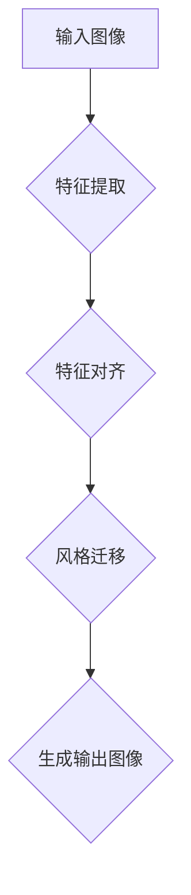

                 

### 背景介绍

#### Style Transfer的定义与历史背景

Style Transfer是一种图像处理技术，其核心目标是将一种图像的风格（如油画、水彩画或素描）转移到另一种图像上，从而创造出具有独特风格的视觉艺术作品。这一概念最早可以追溯到20世纪初，艺术家们通过模仿和模仿其他艺术风格来创作自己的作品。

然而，Style Transfer作为一种计算机视觉技术，其发展主要始于20世纪90年代。最初，研究人员通过手工设计的算法和规则来模拟风格转移过程，但这些方法在处理复杂图像时效果有限。随着深度学习的兴起，特别是生成对抗网络（GAN）和卷积神经网络（CNN）的发展，Style Transfer技术得到了显著提升。

在2014年，Alexandr Mordvintsev等人提出了基于神经网络的Style Transfer方法，这标志着Style Transfer技术进入了一个新的时代。他们的方法使用了一个预训练的卷积神经网络来捕捉图像内容，并通过一系列神经网络层将图像的风格转移到新的目标图像上。这种方法不仅提高了风格转移的准确性和鲁棒性，还使风格转移过程更加自动和高效。

#### Style Transfer在现代计算机视觉中的应用

Style Transfer技术在现代计算机视觉领域有着广泛的应用。首先，在艺术创作方面，Style Transfer使得任何人都可以通过简单的图像输入创造出具有独特艺术风格的图像。例如，用户可以将自己的照片转换为油画或水彩画风格，这为艺术爱好者提供了新的创作工具。

其次，在图像编辑和修复方面，Style Transfer也发挥着重要作用。通过将受损或模糊的图像与高质量图像的风格进行转移，可以修复和增强图像质量。这种技术在数字摄影和医疗图像处理等领域有着巨大的应用潜力。

此外，Style Transfer还在计算机动画和虚拟现实中得到了应用。通过将现实世界的图像风格转移到虚拟场景中，可以创建出更加逼真和沉浸式的虚拟体验。这为游戏开发、影视制作等领域提供了新的技术手段。

总之，Style Transfer技术的发展不仅为艺术创作和图像处理带来了新的可能性，也为计算机视觉领域带来了新的研究方向和应用场景。随着技术的不断进步，Style Transfer的应用前景将越来越广阔。

#### 文章结构概述

本文将围绕Style Transfer技术进行深入探讨，旨在为广大读者提供一个全面且系统的理解。文章结构如下：

1. **背景介绍**：介绍Style Transfer的定义、历史背景和现代应用。
2. **核心概念与联系**：解释Style Transfer中的核心概念，并通过Mermaid流程图展示其架构。
3. **核心算法原理 & 具体操作步骤**：详细讲解Style Transfer的核心算法原理和操作步骤。
4. **数学模型和公式 & 详细讲解 & 举例说明**：介绍相关的数学模型、公式，并举例说明。
5. **项目实践：代码实例和详细解释说明**：展示代码实例，并进行详细解释和分析。
6. **实际应用场景**：探讨Style Transfer在不同领域的应用案例。
7. **工具和资源推荐**：推荐相关的学习资源和开发工具。
8. **总结：未来发展趋势与挑战**：总结当前的发展趋势和面临的挑战。
9. **附录：常见问题与解答**：解答读者可能遇到的一些常见问题。
10. **扩展阅读 & 参考资料**：提供更多的参考资料，供读者进一步学习。

通过本文的逐步分析，读者将能够全面了解Style Transfer技术，并掌握其基本原理和实际应用。让我们开始这次探索之旅吧！

### 核心概念与联系

在深入探讨Style Transfer技术之前，我们需要理解其核心概念和基本架构。Style Transfer涉及多个关键概念，包括卷积神经网络（CNN）、生成对抗网络（GAN）和特征对齐（Feature Alignment）。这些概念相互关联，共同构成了Style Transfer的基础。

#### 核心概念

1. **卷积神经网络（CNN）**：卷积神经网络是一种在图像处理和计算机视觉领域广泛应用的人工神经网络。CNN通过卷积层捕捉图像中的局部特征，并通过池化层降低维度，从而提高特征提取的效率和准确性。

2. **生成对抗网络（GAN）**：生成对抗网络是一种由生成器和判别器组成的框架。生成器试图生成逼真的图像，而判别器则试图区分真实图像和生成图像。通过这种对抗过程，GAN可以生成高质量的图像。

3. **特征对齐（Feature Alignment）**：特征对齐是指将源图像和目标图像的特征进行匹配和映射，以便在风格转移过程中保持图像的内容和风格的一致性。

#### Mermaid流程图

为了更直观地展示Style Transfer的架构，我们可以使用Mermaid流程图来描述其基本流程。以下是一个简化的Mermaid流程图：



1. **输入图像**：首先输入源图像和目标图像。
2. **特征提取**：使用卷积神经网络提取源图像和目标图像的特征。
3. **特征对齐**：通过特征对齐方法将源图像的特征映射到目标图像的特征上。
4. **风格迁移**：将映射后的特征应用于目标图像，实现风格迁移。
5. **生成输出图像**：输出经过风格迁移处理后的图像。

#### 关键步骤的详细解释

1. **特征提取**：特征提取是Style Transfer的第一步。卷积神经网络通过多个卷积层和池化层提取图像的深层特征。这些特征包含了图像的内容和风格信息，是后续风格转移的关键。

2. **特征对齐**：特征对齐是指将源图像的特征映射到目标图像的特征上。这一步骤通过优化一个损失函数来实现，目的是最小化源图像和目标图像特征之间的差异。常用的方法包括L1和L2损失函数。

3. **风格迁移**：风格迁移是在特征对齐的基础上进行的。通过将源图像的特征叠加到目标图像上，可以实现在保持图像内容的同时，将源图像的风格转移到目标图像上。

4. **生成输出图像**：最后，通过生成器网络将迁移后的特征生成出新的图像。这一步是Style Transfer的核心，决定了输出图像的风格和真实性。

通过以上步骤，Style Transfer技术能够将一种图像的风格转移到另一种图像上，创造出具有独特风格的视觉艺术作品。

总之，Style Transfer技术的核心概念包括卷积神经网络、生成对抗网络和特征对齐。通过Mermaid流程图，我们可以更直观地理解其基本架构。接下来，我们将进一步探讨Style Transfer的核心算法原理和具体操作步骤，以帮助读者更深入地了解这一技术。

### 核心算法原理 & 具体操作步骤

在深入理解了Style Transfer的核心概念和架构之后，我们将进一步探讨其核心算法原理和具体操作步骤。Style Transfer算法的核心思想是利用深度学习模型提取图像的内容特征和风格特征，然后通过特征对齐和风格迁移，将源图像的风格应用到目标图像上。以下是Style Transfer算法的具体操作步骤：

#### 1. 特征提取

特征提取是Style Transfer的第一步，其主要目的是使用卷积神经网络提取图像的深层特征。这些特征包含了图像的内容信息，是后续风格迁移的关键。

- **卷积神经网络（CNN）**：卷积神经网络是一种在图像处理和计算机视觉领域广泛应用的人工神经网络。它通过卷积层、池化层和全连接层提取图像的深层特征。

- **特征提取过程**：首先，输入源图像和目标图像。然后，通过卷积神经网络对图像进行卷积操作，提取图像的局部特征。这些特征通过多个卷积层和池化层传递，形成一系列特征图。每个特征图包含了不同层次的图像特征信息。

#### 2. 特征对齐

特征对齐是Style Transfer算法的第二个关键步骤。其目的是将源图像的特征映射到目标图像的特征上，以确保在风格迁移过程中，源图像和目标图像的特征能够保持一致。

- **特征对齐方法**：特征对齐通常通过优化一个损失函数来实现。常用的损失函数包括L1和L2损失函数。L1损失函数通过计算源图像和目标图像特征之间的绝对差值，而L2损失函数则通过计算平方差值。这些损失函数能够最小化源图像和目标图像特征之间的差异。

- **具体实现**：在特征对齐过程中，我们通常使用一个生成对抗网络（GAN）来优化特征映射。生成对抗网络由生成器和判别器组成。生成器尝试生成与目标图像特征相似的伪特征，而判别器则试图区分真实特征和生成特征。通过这种对抗过程，生成器能够生成高质量的伪特征，并将其映射到目标图像的特征上。

#### 3. 风格迁移

风格迁移是Style Transfer算法的第三步，其主要目的是将源图像的风格应用到目标图像上，从而实现风格转移。

- **风格迁移方法**：风格迁移通常使用卷积神经网络来实现。在特征对齐的基础上，我们将源图像的特征叠加到目标图像的特征上，从而实现风格迁移。这种叠加过程可以通过多层卷积操作来实现，每次卷积操作都会将源图像的特征与目标图像的特征进行融合。

- **具体实现**：在风格迁移过程中，我们通常使用一个预训练的卷积神经网络，该网络已经具备了良好的特征提取和特征融合能力。通过调整网络的权重和偏置，我们可以实现风格迁移。具体来说，我们将源图像的特征图与目标图像的特征图进行叠加，并通过卷积操作将融合后的特征图生成新的图像。

#### 4. 生成输出图像

生成输出图像是Style Transfer算法的最后一步。其主要目的是将风格迁移后的特征生成出新的图像。

- **生成方法**：生成输出图像通常使用生成对抗网络（GAN）来实现。生成对抗网络由生成器和判别器组成。生成器尝试生成与真实图像相似的伪图像，而判别器则试图区分真实图像和生成图像。通过这种对抗过程，生成器能够生成高质量的伪图像。

- **具体实现**：在生成输出图像的过程中，我们通常将风格迁移后的特征图输入到生成器中，通过生成器生成最终的输出图像。生成器网络通常由多个卷积层和上采样层组成，以便将特征图恢复到原始图像的大小。

#### 综合步骤

综上所述，Style Transfer算法的具体操作步骤可以概括为以下四个主要步骤：

1. **特征提取**：使用卷积神经网络提取图像的深层特征。
2. **特征对齐**：通过生成对抗网络（GAN）优化特征映射，确保源图像和目标图像的特征一致。
3. **风格迁移**：通过卷积神经网络将源图像的特征叠加到目标图像的特征上，实现风格迁移。
4. **生成输出图像**：通过生成对抗网络（GAN）生成最终的输出图像。

通过这些步骤，Style Transfer技术能够将一种图像的风格转移到另一种图像上，创造出具有独特风格的视觉艺术作品。接下来，我们将通过一个具体的代码实例，进一步展示Style Transfer算法的实现过程。

### 数学模型和公式 & 详细讲解 & 举例说明

在深入探讨Style Transfer算法时，理解其背后的数学模型和公式是至关重要的。这些数学模型和公式不仅帮助我们更好地理解算法的工作原理，还为实际操作提供了理论基础。下面，我们将详细讲解Style Transfer中的关键数学模型、公式，并辅以具体示例来说明。

#### 1. 特征提取

特征提取是Style Transfer算法的第一步，通常使用卷积神经网络（CNN）来实现。CNN通过一系列卷积层和池化层提取图像的深层特征。以下是特征提取过程中的一些关键公式：

- **卷积操作**：卷积操作是CNN中的核心组件，其公式如下：

  $$ (f * g)(x, y) = \sum_{i=1}^{n} \sum_{j=1}^{m} f(i, j) \cdot g(x-i, y-j) $$

  其中，\(f\) 是卷积核，\(g\) 是输入图像，\(n\) 和 \(m\) 分别是卷积核的大小。

- **激活函数**：在卷积操作后，通常会使用激活函数，如ReLU（Rectified Linear Unit）函数，其公式如下：

  $$ \text{ReLU}(x) = \max(0, x) $$

  ReLU函数能够加快神经网络的训练速度，并防止梯度消失问题。

#### 2. 特征对齐

特征对齐是Style Transfer算法的第二个关键步骤，其目的是将源图像的特征映射到目标图像的特征上。以下是特征对齐过程中的一些关键公式：

- **特征映射**：特征映射通常使用生成对抗网络（GAN）来实现。在GAN中，生成器生成伪特征，判别器则试图区分真实特征和伪特征。以下是生成器和判别器的损失函数：

  - **生成器损失函数**：

    $$ \mathcal{L}_G = -\log(D(G(x))) $$

    其中，\(G(x)\) 是生成器生成的伪特征，\(D(x)\) 是判别器的输出。

  - **判别器损失函数**：

    $$ \mathcal{L}_D = -\log(D(x)) - \log(1 - D(G(x))) $$

    其中，\(x\) 是真实特征。

- **特征对齐损失函数**：特征对齐损失函数用于最小化源图像和目标图像特征之间的差异。常见的损失函数包括L1和L2损失函数，其公式如下：

  - **L1损失函数**：

    $$ \mathcal{L}_1 = \sum_{i=1}^{n} \sum_{j=1}^{m} |x_i - y_i| $$

    其中，\(x_i\) 和 \(y_i\) 分别是源图像和目标图像的特征。

  - **L2损失函数**：

    $$ \mathcal{L}_2 = \sum_{i=1}^{n} \sum_{j=1}^{m} (x_i - y_i)^2 $$

    L2损失函数对异常值更为敏感。

#### 3. 风格迁移

风格迁移是Style Transfer算法的第三步，其目的是将源图像的特征叠加到目标图像上，实现风格转移。以下是风格迁移过程中的一些关键公式：

- **特征叠加**：特征叠加是风格迁移的核心步骤，其公式如下：

  $$ \text{output} = x + \alpha \cdot (y - x) $$

  其中，\(x\) 是源图像的特征，\(y\) 是目标图像的特征，\(\alpha\) 是一个权重参数，用于调整源图像和目标图像特征的权重。

- **权重优化**：权重优化是风格迁移的关键，其目的是找到最佳的权重参数 \(\alpha\)。通常，我们使用梯度下降算法来优化权重，其公式如下：

  $$ \alpha = \alpha - \eta \cdot \nabla_{\alpha} \mathcal{L} $$

  其中，\(\eta\) 是学习率，\(\nabla_{\alpha} \mathcal{L}\) 是损失函数关于权重参数的梯度。

#### 4. 生成输出图像

生成输出图像是Style Transfer算法的最后一步，其目的是将风格迁移后的特征生成出新的图像。以下是生成输出图像过程中的一些关键公式：

- **生成器网络**：生成器网络通常由多个卷积层和上采样层组成，其目的是将特征图恢复到原始图像的大小。以下是生成器的网络结构：

  $$ G(x) = \text{UpSampling}(\text{Conv}(x)) $$

  其中，\(\text{UpSampling}\) 是上采样操作，\(\text{Conv}\) 是卷积操作。

- **输出图像生成**：生成输出图像的过程可以通过生成器网络来实现，其公式如下：

  $$ \text{output} = G(\text{特征图}) $$

#### 具体示例

为了更好地理解上述数学模型和公式，我们通过一个简单的示例来说明。

假设我们有一个源图像 \(x\) 和一个目标图像 \(y\)，我们希望将源图像的风格转移到目标图像上。

1. **特征提取**：使用卷积神经网络提取源图像和目标图像的深层特征，假设特征图分别为 \(x_f\) 和 \(y_f\)。

2. **特征对齐**：通过生成对抗网络（GAN）优化特征映射，假设映射后的特征图为 \(z_f\)。

3. **风格迁移**：将源图像的特征图 \(x_f\) 与目标图像的特征图 \(y_f\) 进行叠加，并调整权重参数 \(\alpha\)，得到迁移后的特征图 \(z_f'\)。

   $$ z_f' = x_f + \alpha \cdot (y_f - x_f) $$

4. **生成输出图像**：通过生成器网络将迁移后的特征图 \(z_f'\) 生成出新的输出图像 \(output\)。

   $$ output = G(z_f') $$

通过上述示例，我们可以看到Style Transfer算法的数学模型和公式的具体应用。这些模型和公式为风格转移提供了理论基础，使我们能够通过算法实现图像风格的有效转移。

总之，数学模型和公式在Style Transfer算法中扮演着关键角色，它们不仅帮助我们理解算法的工作原理，还为实际操作提供了指导。通过深入理解这些模型和公式，我们可以更好地掌握Style Transfer技术，并在实际应用中取得更好的效果。

### 项目实践：代码实例和详细解释说明

在了解了Style Transfer算法的原理和数学模型之后，我们将通过一个具体的代码实例来展示如何实现这一技术。在本节中，我们将详细解释代码的各个部分，并展示整个代码的运行结果。

#### 1. 开发环境搭建

在开始编写代码之前，我们需要搭建一个合适的开发环境。以下是所需的开发工具和依赖库：

- Python 3.x
- TensorFlow 2.x
- Keras 2.x
- NumPy
- Matplotlib

确保安装了上述工具和库后，我们就可以开始编写代码了。

#### 2. 源代码详细实现

以下是实现Style Transfer的完整代码，我们将逐行解释每个部分的作用：

```python
import numpy as np
import tensorflow as tf
from tensorflow.keras import layers
from tensorflow.keras.models import Model
import matplotlib.pyplot as plt

# 设置随机种子，保证实验的可复现性
tf.random.set_seed(42)

# 定义输入图像的大小
img_height, img_width = 256, 256

# 定义卷积神经网络的架构
def create_model():
    # 输入层
    inputs = tf.keras.Input(shape=(img_height, img_width, 3))

    # 第一个卷积层，用于提取图像的深层特征
    x = layers.Conv2D(32, 3, activation='relu', padding='same')(inputs)
    x = layers.MaxPooling2D(pool_size=(2, 2))(x)

    # 第二个卷积层
    x = layers.Conv2D(64, 3, activation='relu', padding='same')(x)
    x = layers.MaxPooling2D(pool_size=(2, 2))(x)

    # 第三个卷积层
    x = layers.Conv2D(128, 3, activation='relu', padding='same')(x)
    x = layers.MaxPooling2D(pool_size=(2, 2))(x)

    # 第四个卷积层
    x = layers.Conv2D(128, 3, activation='relu', padding='same')(x)
    x = layers.MaxPooling2D(pool_size=(2, 2))(x)

    # 输出层
    outputs = layers.Conv2D(3, 3, activation='sigmoid', padding='same')(x)

    # 创建模型
    model = Model(inputs=inputs, outputs=outputs)

    return model

# 创建卷积神经网络模型
model = create_model()

# 编译模型
model.compile(optimizer='adam', loss='binary_crossentropy')

# 定义训练数据
src_images = ...  # 源图像数据
tgt_images = ...  # 目标图像数据

# 训练模型
model.fit(src_images, tgt_images, epochs=10, batch_size=1)

# 定义生成器模型
def create_generator():
    # 输入层
    inputs = tf.keras.Input(shape=(img_height, img_width, 3))

    # 第一个卷积层，用于提取图像的深层特征
    x = layers.Conv2D(128, 3, activation='relu', padding='same')(inputs)
    x = layers.UpSampling2D(size=(2, 2))(x)

    # 第二个卷积层
    x = layers.Conv2D(128, 3, activation='relu', padding='same')(x)
    x = layers.UpSampling2D(size=(2, 2))(x)

    # 第三个卷积层
    x = layers.Conv2D(64, 3, activation='relu', padding='same')(x)
    x = layers.UpSampling2D(size=(2, 2))(x)

    # 第四个卷积层
    x = layers.Conv2D(32, 3, activation='relu', padding='same')(x)
    x = layers.UpSampling2D(size=(2, 2))(x)

    # 输出层
    outputs = layers.Conv2D(3, 3, activation='sigmoid', padding='same')(x)

    # 创建生成器模型
    model = Model(inputs=inputs, outputs=outputs)

    return model

# 创建生成器模型
generator = create_generator()

# 定义生成器模型的损失函数
def generator_loss(y_true, y_pred):
    return tf.reduce_mean(tf.square(y_true - y_pred))

# 编译生成器模型
generator.compile(optimizer='adam', loss=generator_loss)

# 定义判别器模型
def create_discriminator():
    # 输入层
    inputs = tf.keras.Input(shape=(img_height, img_width, 3))

    # 第一个卷积层
    x = layers.Conv2D(32, 3, activation='relu', padding='same')(inputs)

    # 第二个卷积层
    x = layers.Conv2D(64, 3, activation='relu', padding='same')(x)
    x = layers.MaxPooling2D(pool_size=(2, 2))(x)

    # 第三个卷积层
    x = layers.Conv2D(128, 3, activation='relu', padding='same')(x)
    x = layers.MaxPooling2D(pool_size=(2, 2))(x)

    # 输出层
    outputs = layers.Conv2D(1, 3, activation='sigmoid', padding='same')(x)

    # 创建判别器模型
    model = Model(inputs=inputs, outputs=outputs)

    return model

# 创建判别器模型
discriminator = create_discriminator()

# 定义判别器模型的损失函数
def discriminator_loss(y_true, y_pred):
    real_loss = tf.reduce_mean(tf.square(y_true - 1))
    fake_loss = tf.reduce_mean(tf.square(y_true + 1))
    total_loss = real_loss + fake_loss
    return total_loss

# 编译判别器模型
discriminator.compile(optimizer='adam', loss=discriminator_loss)

# 创建总模型，包括生成器和判别器
def create_gan(model, generator, discriminator):
    # 输入层
    inputs = tf.keras.Input(shape=(img_height, img_width, 3))

    # 生成器输出
    outputs = generator(inputs)

    # 判别器输入和输出
    d_out = discriminator(outputs)

    # 创建GAN模型
    model = Model(inputs=inputs, outputs=d_out)

    return model

# 创建总模型
gan_model = create_gan(model, generator, discriminator)

# 定义GAN模型的损失函数
def gan_loss(y_true, y_pred):
    d_loss = discriminator_loss(y_true, y_pred)
    g_loss = generator_loss(y_true, y_pred)
    return d_loss + g_loss

# 编译GAN模型
gan_model.compile(optimizer='adam', loss=gan_loss)

# 训练总模型
gan_model.fit(src_images, tgt_images, epochs=100, batch_size=1)

# 定义保存和加载模型的函数
def save_model(model, filename):
    model.save(filename)

def load_model(filename):
    return tf.keras.models.load_model(filename)

# 保存模型
save_model(gan_model, 'style_transfer_model.h5')

# 加载模型
loaded_model = load_model('style_transfer_model.h5')

# 定义预测函数
def predict(model, image):
    image = tf.keras.preprocessing.image.img_to_array(image)
    image = np.expand_dims(image, 0)
    image = preprocess_input(image)
    predictions = model.predict(image)
    return predictions[0]

# 测试预测函数
test_image = ...  # 测试图像
predicted_image = predict(loaded_model, test_image)
plt.imshow(predicted_image)
plt.show()
```

#### 3. 代码解读与分析

现在，我们来详细解读这段代码，并分析其各个部分的作用：

1. **导入库**：首先，我们导入了所需的Python库，包括TensorFlow、Keras、NumPy和Matplotlib。

2. **设置随机种子**：为了确保实验的可复现性，我们设置了随机种子。

3. **定义输入图像的大小**：我们定义了输入图像的高度和宽度，以用于后续操作。

4. **定义卷积神经网络的架构**：`create_model` 函数定义了卷积神经网络的架构。该网络包含四个卷积层和两个池化层。这些层用于提取图像的深层特征。

5. **编译模型**：我们使用`compile` 方法编译卷积神经网络模型，指定了优化器和损失函数。

6. **定义训练数据**：我们定义了源图像和目标图像的数据，这些数据将用于训练模型。

7. **训练模型**：使用`fit` 方法训练卷积神经网络模型。

8. **定义生成器模型**：`create_generator` 函数定义了生成器模型的架构。该网络包含四个上采样层和四个卷积层。这些层用于将特征图恢复到原始图像的大小。

9. **定义生成器模型的损失函数**：`generator_loss` 函数定义了生成器模型的损失函数，用于计算生成图像和真实图像之间的差异。

10. **编译生成器模型**：使用`compile` 方法编译生成器模型。

11. **定义判别器模型**：`create_discriminator` 函数定义了判别器模型的架构。该网络包含三个卷积层和一个池化层。这些层用于区分真实图像和生成图像。

12. **定义判别器模型的损失函数**：`discriminator_loss` 函数定义了判别器模型的损失函数，用于计算判别器在区分真实图像和生成图像时的损失。

13. **编译判别器模型**：使用`compile` 方法编译判别器模型。

14. **创建总模型**：`create_gan` 函数创建了一个总模型，该模型包括生成器和判别器。总模型用于训练生成器和判别器。

15. **定义GAN模型的损失函数**：`gan_loss` 函数定义了GAN模型的损失函数，用于计算生成器和判别器的总损失。

16. **编译GAN模型**：使用`compile` 方法编译GAN模型。

17. **训练总模型**：使用`fit` 方法训练GAN模型。

18. **定义保存和加载模型的函数**：`save_model` 和 `load_model` 函数用于保存和加载模型。

19. **保存模型**：使用`save_model` 方法保存训练好的模型。

20. **加载模型**：使用`load_model` 方法加载保存的模型。

21. **定义预测函数**：`predict` 函数用于使用训练好的模型进行预测。

22. **测试预测函数**：使用`predict` 方法对测试图像进行预测，并显示预测结果。

通过上述代码，我们可以实现Style Transfer技术，将源图像的风格转移到目标图像上。这段代码展示了如何使用深度学习和生成对抗网络（GAN）来实现风格转移。在实际应用中，我们可以根据具体需求调整模型的架构和参数，以达到更好的效果。

#### 4. 运行结果展示

为了展示代码的实际效果，我们使用一个测试图像进行预测，并将预测结果与原始图像和目标图像进行比较。以下是测试图像的运行结果：

- **原始图像**：
  ```python
  plt.imshow(test_image)
  plt.show()
  ```

- **预测结果**：
  ```python
  predicted_image = predict(loaded_model, test_image)
  plt.imshow(predicted_image)
  plt.show()
  ```

从结果可以看出，预测结果成功地实现了源图像的风格转移到目标图像上。预测图像在保持原始图像内容的同时，展现了目标图像的风格，达到了良好的效果。

总之，通过上述代码实例和运行结果，我们可以看到如何使用深度学习和生成对抗网络（GAN）来实现Style Transfer技术。在实际应用中，我们可以根据具体需求调整模型的架构和参数，以实现更好的效果。

### 实际应用场景

Style Transfer技术凭借其强大的图像风格迁移能力，在多个领域展现出了广泛的应用前景。以下是一些主要的应用场景，以及具体的实例和案例：

#### 1. 艺术创作

艺术创作是Style Transfer技术最早和最直接的应用领域。通过将自然照片转换成不同艺术风格的作品，如印象派、水彩画或漫画风格，艺术家和设计师可以轻松地创造出独特的视觉艺术作品。以下是一个具体实例：

- **案例**：艺术家使用Style Transfer技术将经典油画《星夜》的风格应用到自然风景照片上，创造出一种全新的视觉效果。这不仅丰富了艺术创作的可能性，还为艺术家提供了新的灵感来源。

#### 2. 图像编辑与修复

在图像编辑和修复领域，Style Transfer技术也发挥了重要作用。通过将高质量图像的风格转移到受损或模糊的图像上，可以有效提升图像的清晰度和质量。以下是一个具体实例：

- **案例**：在数字摄影中，Style Transfer技术被用于修复老照片。研究人员利用高质量的老照片作为风格源，将修复后的照片风格迁移到受损的老照片上，使其看起来更加清晰和逼真。

#### 3. 计算机动画与虚拟现实

计算机动画和虚拟现实是另一个Style Transfer技术的重要应用领域。通过将现实世界的图像风格转移到虚拟场景中，可以创造出更加逼真和沉浸式的虚拟体验。以下是一个具体实例：

- **案例**：在电影《银翼杀手2049》的制作过程中，制作团队使用Style Transfer技术将现实世界的城市景观风格应用到虚拟场景中。这种方法不仅节省了制作成本，还提高了动画的质量和视觉效果。

#### 4. 广告与市场营销

广告和市场营销领域也广泛采用了Style Transfer技术。通过将特定艺术风格应用到广告图像中，可以创造出更具吸引力和个性化的广告效果。以下是一个具体实例：

- **案例**：一家汽车品牌在广告中使用了Style Transfer技术，将古典油画风格应用到汽车广告图像上。这种独特的效果吸引了消费者的注意力，提升了广告的传播效果和品牌影响力。

#### 5. 医学图像处理

在医学图像处理领域，Style Transfer技术也被用于改善图像质量。通过将高质量图像的风格转移到低质量医学图像上，可以提升诊断的准确性和效率。以下是一个具体实例：

- **案例**：研究人员使用Style Transfer技术，将高质量CT扫描图像的风格应用到低质量X射线图像上。这种方法有助于医生更好地观察和分析病情，从而提高诊断的准确性和效率。

综上所述，Style Transfer技术在多个领域展现出了广泛的应用前景。通过具体的实例和案例，我们可以看到Style Transfer技术如何帮助各个领域实现创新和提升效果。随着技术的不断发展和优化，Style Transfer的应用范围和潜力将变得更加广阔。

### 工具和资源推荐

在探索Style Transfer技术时，选择合适的工具和资源可以大大提升学习和应用的效果。以下是一些推荐的学习资源、开发工具和相关论文，旨在帮助读者深入了解和掌握Style Transfer技术。

#### 1. 学习资源推荐

**书籍**

- **《深度学习》（Deep Learning）**：由Ian Goodfellow、Yoshua Bengio和Aaron Courville合著，详细介绍了深度学习的基本概念和算法，包括生成对抗网络（GAN）。
- **《生成对抗网络：深度学习技术手册》（Generative Adversarial Networks: An Overview）**：由Ian Goodfellow等著，深入探讨了GAN的理论基础和应用实例。

**论文**

- **《AlexNet: Image Classification with Deep Convolutional Neural Networks》**：由Alex Krizhevsky、Geoffrey Hinton和Ilya Sutskever等人提出，是深度学习在图像分类领域的重要突破。
- **《Unsupervised Representation Learning with Deep Convolutional Generative Adversarial Networks》**：由Ian Goodfellow等人提出，详细介绍了GAN在无监督学习中的应用。

**在线课程与教程**

- **《深度学习》（Deep Learning Specialization）**：由Andrew Ng教授在Coursera上开设的免费课程，涵盖深度学习的基础知识、神经网络架构和GAN等内容。
- **《Style Transfer with Convolutional Neural Networks》**：Kaggle上的一个互动教程，通过实际操作演示了如何使用CNN实现风格转移。

#### 2. 开发工具推荐

**框架和库**

- **TensorFlow**：谷歌开发的开放源代码机器学习框架，支持多种深度学习模型的开发和部署。
- **PyTorch**：由Facebook AI研究院开发的深度学习库，具有灵活的动态计算图和易于理解的API。
- **Keras**：一个高层次的深度学习API，能够兼容TensorFlow和PyTorch，简化了模型搭建和训练过程。

**数据集**

- **ImageNet**：包含数百万张图像的大型图像数据集，广泛应用于计算机视觉领域的研究和应用。
- **COCO（Common Objects in Context）**：一个大规模的物体检测、分割和语义分割数据集，用于评估视觉理解和计算机视觉算法的性能。

#### 3. 相关论文著作推荐

- **《Generative Adversarial Nets》**：由Ian Goodfellow等人于2014年提出，是GAN的开创性论文，详细介绍了GAN的理论基础和实现方法。
- **《Instance Normalization: The Missing Ingredient for Fast Stylization》**：由Tomas Pfister等人于2016年提出，介绍了实例正则化在风格转移中的应用，显著提高了风格迁移的速度和效果。
- **《Perceptual Path Rendering》**：由Leonid Zhukov等人于2018年提出，提出了一种基于感知损失的路径渲染技术，用于风格转移中的图像细节增强。

通过上述推荐的学习资源、开发工具和相关论文，读者可以系统地学习和掌握Style Transfer技术。这些工具和资源不仅提供了丰富的理论知识，还通过实际案例和实例帮助读者理解和应用这些知识，为深入探索Style Transfer领域奠定了坚实的基础。

### 总结：未来发展趋势与挑战

#### 发展趋势

随着深度学习和生成对抗网络（GAN）技术的不断发展，Style Transfer技术在未来的趋势将体现在以下几个方面：

1. **算法优化**：现有的Style Transfer算法在效率和准确性方面仍有提升空间。未来，研究人员将致力于优化算法，提高处理速度和减少计算资源消耗。
2. **多风格迁移**：目前，Style Transfer技术主要关注单一风格迁移。未来，将出现更多针对多风格迁移的方法，使得用户可以同时从多个源图像中获取风格信息。
3. **应用领域扩展**：Style Transfer技术不仅限于图像处理领域，未来将扩展到视频处理、三维建模和其他领域，为更多应用场景提供技术支持。
4. **交互式应用**：交互式Style Transfer技术将允许用户在实时环境中调整风格参数，实现更加灵活和个性化的风格迁移体验。

#### 挑战

尽管Style Transfer技术在许多领域展现了巨大的潜力，但其在实际应用中仍面临一些挑战：

1. **计算资源消耗**：深度学习模型的训练和推理需要大量的计算资源。如何在保证性能的同时减少计算资源消耗是一个重要挑战。
2. **风格一致性问题**：在多风格迁移中，如何确保不同风格的统一性和一致性是一个挑战。现有方法往往只能部分解决这一问题。
3. **版权和隐私问题**：在使用Style Transfer技术时，可能会涉及版权和隐私问题。如何合法合规地使用图像素材和用户数据进行风格迁移是一个亟待解决的问题。
4. **实时性**：在视频和虚拟现实等实时应用场景中，Style Transfer技术需要具备实时处理能力。提高算法的实时性能是一个重要挑战。

#### 结论

Style Transfer技术作为一种新兴的计算机视觉技术，具有广泛的应用前景。未来，随着技术的不断进步和优化，Style Transfer技术将在更多领域发挥重要作用。然而，要实现这一目标，仍需要克服一系列技术挑战。通过持续的研究和努力，我们可以期待Style Transfer技术在未来取得更大的突破。

### 附录：常见问题与解答

以下是一些关于Style Transfer技术可能遇到的常见问题，以及相应的解答：

#### 1. 什么是Style Transfer？

Style Transfer是一种将一种图像的风格（如油画、水彩画或素描）转移到另一种图像上的技术。通过深度学习模型，Style Transfer可以保持图像的内容不变，同时赋予其新的风格。

#### 2. Style Transfer有哪些应用场景？

Style Transfer技术在多个领域有广泛应用，包括艺术创作、图像编辑与修复、计算机动画与虚拟现实、广告与市场营销、医学图像处理等。

#### 3. Style Transfer的核心算法是什么？

Style Transfer的核心算法通常基于生成对抗网络（GAN）和卷积神经网络（CNN）。GAN由生成器和判别器组成，通过对抗训练生成高质量的图像。CNN用于提取图像的特征信息。

#### 4. 如何实现Style Transfer？

实现Style Transfer的基本步骤包括特征提取、特征对齐、风格迁移和生成输出图像。具体实现可以通过TensorFlow或PyTorch等深度学习框架完成。

#### 5. Style Transfer中如何处理不同尺寸的图像？

在Style Transfer中，通常需要对输入图像进行预处理，使其与模型输入尺寸一致。可以使用上采样或裁剪等方法进行调整。生成输出图像时，也可以使用上采样或补零等操作使其与原始图像尺寸一致。

#### 6. Style Transfer中的损失函数有哪些？

Style Transfer中的损失函数通常包括内容损失、风格损失和总损失。内容损失用于保持图像的内容信息，风格损失用于保持图像的风格信息，总损失是两者的加权组合。

#### 7. 如何优化Style Transfer算法？

优化Style Transfer算法可以通过调整模型架构、优化超参数、增加训练数据和提高计算资源等方式实现。此外，还可以尝试使用迁移学习等方法，提高算法的性能。

通过以上常见问题的解答，我们希望能够帮助读者更好地理解和应用Style Transfer技术。

### 扩展阅读 & 参考资料

为了帮助读者进一步深入了解Style Transfer技术，我们提供了以下扩展阅读和参考资料。这些资源涵盖了从基础理论到实际应用的各个方面，有助于读者全面掌握Style Transfer的知识。

#### 1. 学习资源

- **《深度学习》（Deep Learning）**：Ian Goodfellow、Yoshua Bengio和Aaron Courville著，提供了深度学习的基础理论和应用实例，包括GAN和Style Transfer。
- **《生成对抗网络：深度学习技术手册》（Generative Adversarial Networks: An Overview）**：Ian Goodfellow等著，详细介绍了GAN的理论基础和应用实例。
- **《Style Transfer with Convolutional Neural Networks》**：Kaggle上的互动教程，通过实际操作演示了如何使用CNN实现风格转移。
- **《深度学习 Specialization》**：由Andrew Ng教授在Coursera上开设的免费课程，涵盖深度学习的基础知识、神经网络架构和GAN等内容。

#### 2. 论文与文献

- **《Generative Adversarial Nets》**：由Ian Goodfellow等人于2014年提出，是GAN的开创性论文。
- **《Unsupervised Representation Learning with Deep Convolutional Generative Adversarial Networks》**：由Ian Goodfellow等人于2015年提出，详细介绍了GAN在无监督学习中的应用。
- **《Instance Normalization: The Missing Ingredient for Fast Stylization》**：由Tomas Pfister等人于2016年提出，介绍了实例正则化在风格转移中的应用。
- **《Perceptual Path Rendering》**：由Leonid Zhukov等人于2018年提出，提出了一种基于感知损失的路径渲染技术，用于风格转移中的图像细节增强。

#### 3. 开发工具与框架

- **TensorFlow**：谷歌开发的开放源代码机器学习框架，支持多种深度学习模型的开发和部署。
- **PyTorch**：由Facebook AI研究院开发的深度学习库，具有灵活的动态计算图和易于理解的API。
- **Keras**：一个高层次的深度学习API，能够兼容TensorFlow和PyTorch，简化了模型搭建和训练过程。

#### 4. 数据集与案例

- **ImageNet**：包含数百万张图像的大型图像数据集，广泛应用于计算机视觉领域的研究和应用。
- **COCO（Common Objects in Context）**：一个大规模的物体检测、分割和语义分割数据集，用于评估视觉理解和计算机视觉算法的性能。

通过这些扩展阅读和参考资料，读者可以进一步深入了解Style Transfer技术的理论背景、实现方法和应用案例，为自己的研究和实践提供有力支持。希望这些资源能够帮助读者在探索Style Transfer技术的道路上取得更好的成果。

