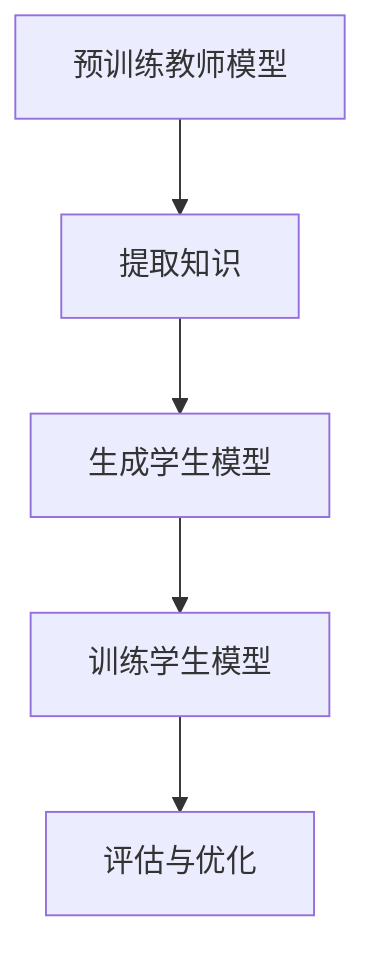

                 

### 1. 背景介绍

#### Transformer 与 BERT

在深度学习领域，Transformer 模型作为一种新型的序列到序列模型，其核心思想是使用自注意力机制（Self-Attention Mechanism）来处理输入序列。相比于传统的循环神经网络（RNN）和卷积神经网络（CNN），Transformer 在处理长序列方面具有显著的优势。然而，Transformer 模型的参数量较大，训练过程较为复杂，这对计算资源和时间提出了较高的要求。

BERT（Bidirectional Encoder Representations from Transformers）模型则是在 Transformer 模型的基础上，进一步发展而来的双向编码器。BERT 通过预训练大规模文本语料库，生成高质量的文本表示。BERT 模型的特点在于其能够捕获文本中的长距离依赖信息，从而在自然语言处理任务中取得了显著的效果。

#### 知识蒸馏的基本概念

知识蒸馏（Knowledge Distillation）是一种将知识从大型教师模型传递到小型学生模型的技术。其核心思想是将教师模型的全局知识（如分类概率分布、中间层特征等）通过某种机制传递给学生模型，使得学生模型能够学到教师模型的知识，从而提高其性能。

知识蒸馏的基本流程如下：

1. **训练教师模型**：首先，使用大规模数据集对教师模型进行训练，使其达到较高的性能。
2. **提取知识**：在训练过程中，从教师模型中提取有用的知识，如分类概率分布、中间层特征等。
3. **训练学生模型**：使用提取的知识对学生模型进行训练，使其能够复现教师模型的知识。
4. **评估与优化**：评估学生模型的性能，并根据评估结果调整训练过程，以提高学生模型的性能。

#### BERT 变体的概念与原理

BERT 变体是指在 BERT 模型的基础上，通过修改模型结构、训练策略、优化算法等手段，生成不同性能的模型。BERT 变体的核心思想是通过调整模型参数，使其在不同的任务和数据集上取得更好的性能。

BERT 变体的实现方法主要包括以下几种：

1. **模型结构调整**：通过增加或减少层数、调整层数之间的连接方式等手段，改变模型的结构。
2. **训练策略调整**：通过调整学习率、优化器、训练时间等参数，优化模型的训练过程。
3. **优化算法调整**：通过更换优化算法，如 Adam、AdamW、SGD 等，提高模型的训练效果。

#### 基于知识蒸馏的 BERT 变体训练方法

基于知识蒸馏的 BERT 变体训练方法主要包括以下几个步骤：

1. **预训练教师模型**：首先，使用大规模文本语料库对教师模型进行预训练，使其达到较高的性能。
2. **提取知识**：在预训练过程中，从教师模型中提取有用的知识，如分类概率分布、中间层特征等。
3. **生成学生模型**：基于教师模型的结构，生成一个较小的学生模型。
4. **训练学生模型**：使用提取的知识对学生模型进行训练，使其能够复现教师模型的知识。
5. **评估与优化**：评估学生模型的性能，并根据评估结果调整训练过程，以提高学生模型的性能。

通过以上步骤，可以实现基于知识蒸馏的 BERT 变体训练，从而在保持教师模型性能的同时，提高学生模型的性能。

#### 基于知识蒸馏的 BERT 变体在 NLP 任务中的应用

基于知识蒸馏的 BERT 变体在自然语言处理（NLP）任务中具有广泛的应用前景。例如，在文本分类、情感分析、命名实体识别等任务中，基于知识蒸馏的 BERT 变体能够有效提高模型的性能。

具体应用方法如下：

1. **数据预处理**：首先，对原始文本数据进行预处理，如分词、去噪、词性标注等。
2. **模型训练**：使用大规模文本语料库对教师模型进行预训练，然后提取知识，并使用这些知识训练学生模型。
3. **性能评估**：在训练完成后，评估学生模型的性能，并与原始 BERT 模型进行比较。
4. **模型优化**：根据评估结果，调整学生模型的参数，以提高其性能。

通过以上方法，可以充分发挥基于知识蒸馏的 BERT 变体在 NLP 任务中的应用价值。

### 2. 核心概念与联系

#### 自注意力机制

自注意力机制是 Transformer 模型的核心组成部分，其基本原理是将序列中的每个词与其余词建立一种加权关系，从而实现对输入序列的灵活处理。自注意力机制包括三种类型的注意力：自注意力（Self-Attention）、编码器注意力（Encoder-Attention）和解码器注意力（Decoder-Attention）。

#### BERT 模型的双向编码器

BERT 模型采用了 Transformer 模型的双向编码器结构，其特点是在编码过程中同时考虑了输入序列的前后依赖关系。BERT 模型由多个 Transformer 块组成，每个 Transformer 块包含多层自注意力机制和全连接层。

#### 知识蒸馏的过程

知识蒸馏的过程可以分为三个阶段：预训练教师模型、提取知识、训练学生模型。

1. **预训练教师模型**：使用大规模文本语料库对教师模型进行预训练，使其达到较高的性能。
2. **提取知识**：在预训练过程中，从教师模型中提取有用的知识，如分类概率分布、中间层特征等。
3. **训练学生模型**：使用提取的知识对学生模型进行训练，使其能够复现教师模型的知识。

#### BERT 变体的实现方法

BERT 变体的实现方法主要包括模型结构调整、训练策略调整和优化算法调整。

1. **模型结构调整**：通过增加或减少层数、调整层数之间的连接方式等手段，改变模型的结构。
2. **训练策略调整**：通过调整学习率、优化器、训练时间等参数，优化模型的训练过程。
3. **优化算法调整**：通过更换优化算法，如 Adam、AdamW、SGD 等，提高模型的训练效果。

#### 基于知识蒸馏的 BERT 变体训练流程

基于知识蒸馏的 BERT 变体训练流程包括以下步骤：

1. **预训练教师模型**：使用大规模文本语料库对教师模型进行预训练，使其达到较高的性能。
2. **提取知识**：在预训练过程中，从教师模型中提取有用的知识，如分类概率分布、中间层特征等。
3. **生成学生模型**：基于教师模型的结构，生成一个较小的学生模型。
4. **训练学生模型**：使用提取的知识对学生模型进行训练，使其能够复现教师模型的知识。
5. **评估与优化**：评估学生模型的性能，并根据评估结果调整训练过程，以提高学生模型的性能。

#### BERT 变体在 NLP 任务中的应用

基于知识蒸馏的 BERT 变体在自然语言处理任务中具有广泛的应用前景。通过调整模型结构、训练策略和优化算法，可以生成不同性能的模型，从而提高模型在特定任务上的性能。

#### Mermaid 流程图



通过以上核心概念和联系，我们可以更好地理解基于知识蒸馏的 BERT 变体的原理和应用。

### 3. 核心算法原理 & 具体操作步骤

#### 自注意力机制（Self-Attention）

自注意力机制是 Transformer 模型的核心组成部分，其基本原理是将序列中的每个词与其余词建立一种加权关系，从而实现对输入序列的灵活处理。自注意力机制的核心思想是，将每个词的嵌入向量与其余词的嵌入向量进行点积运算，然后通过softmax函数将点积结果转换为概率分布。

具体步骤如下：

1. **输入嵌入**：输入序列经过嵌入层后，得到一系列的词嵌入向量 \( \{e_1, e_2, ..., e_n\} \)，其中 \( e_i \) 表示第 \( i \) 个词的嵌入向量。
2. **计算自注意力得分**：对于每个词 \( e_i \)，计算其与其他词 \( e_j \) 的点积得分 \( s_{ij} = e_i^T Q e_j \)，其中 \( Q \) 是自注意力机制的查询（Query）权重矩阵。
3. **应用 softmax 函数**：对得分 \( s_{ij} \) 应用 softmax 函数，得到词 \( e_i \) 对其他词的注意力权重 \( a_{ij} = \text{softmax}(s_{ij}) \)。
4. **加权求和**：根据注意力权重 \( a_{ij} \)，对其他词的嵌入向量进行加权求和，得到 \( e_i \) 的自注意力输出 \( h_i = \sum_{j=1}^{n} a_{ij} e_j \)。

#### BERT 模型的双向编码器

BERT 模型采用了 Transformer 模型的双向编码器结构，其特点是在编码过程中同时考虑了输入序列的前后依赖关系。BERT 模型由多个 Transformer 块组成，每个 Transformer 块包含多层自注意力机制和全连接层。

具体步骤如下：

1. **输入序列预处理**：首先，对输入序列进行预处理，包括分词、词形还原、句子划分等操作。BERT 使用了 WordPiece 分词方法，将长词分解为短词。
2. **嵌入层**：将预处理后的词转换为词嵌入向量。BERT 使用了预训练的词嵌入模型，如 GloVe 或 FastText，将每个词转换为嵌入向量。
3. **Positional Encoding**：由于 Transformer 模型没有位置信息，因此需要通过 Positional Encoding 来引入位置信息。Positional Encoding 是一种特殊的嵌入向量，其值与输入序列的位置相关。
4. **Transformer 块**：BERT 模型的每个 Transformer 块包含两个主要部分：多头自注意力机制（Multi-Head Self-Attention）和全连接层（Feed Forward Neural Network）。

   - **多头自注意力机制**：将输入序列的嵌入向量扩展为多组查询（Query）、键（Key）和值（Value）向量，然后分别计算自注意力得分和加权求和。
   - **全连接层**：在多头自注意力机制之后，将每个词的输出通过一个全连接层进行非线性变换。

5. **输出层**：BERT 模型的输出通常用于下游任务，如文本分类、问答等。输出层可以是简单的全连接层，也可以是多层全连接层。

#### 知识蒸馏的过程

知识蒸馏是一种将知识从大型教师模型传递到小型学生模型的技术。其核心思想是通过某种机制，将教师模型的全局知识（如分类概率分布、中间层特征等）传递给学生模型。

具体步骤如下：

1. **预训练教师模型**：使用大规模数据集对教师模型进行预训练，使其达到较高的性能。教师模型可以是原始的 BERT 模型或经过微调的模型。
2. **提取知识**：在预训练过程中，从教师模型中提取有用的知识，如分类概率分布、中间层特征等。这些知识可以用来训练学生模型。
3. **生成学生模型**：基于教师模型的结构，生成一个较小的学生模型。学生模型可以是简化版的 BERT 模型，也可以是其他类型的模型。
4. **训练学生模型**：使用提取的知识对学生模型进行训练，使其能够复现教师模型的知识。训练过程中，可以采用教师模型的输出作为额外的监督信号。
5. **评估与优化**：评估学生模型的性能，并根据评估结果调整训练过程，以提高学生模型的性能。评估指标可以是准确率、F1 值等。

#### BERT 变体的实现方法

BERT 变体是指在 BERT 模型的基础上，通过修改模型结构、训练策略、优化算法等手段，生成不同性能的模型。BERT 变体的核心思想是通过调整模型参数，使其在不同的任务和数据集上取得更好的性能。

具体实现方法如下：

1. **模型结构调整**：通过增加或减少层数、调整层数之间的连接方式等手段，改变模型的结构。例如，可以减少 Transformer 块的数量或调整每层的隐藏单元数。
2. **训练策略调整**：通过调整学习率、优化器、训练时间等参数，优化模型的训练过程。例如，可以采用分阶段学习率调整策略，逐步减小学习率。
3. **优化算法调整**：通过更换优化算法，如 Adam、AdamW、SGD 等，提高模型的训练效果。例如，可以采用带有权重衰减的优化算法，以防止过拟合。

#### 基于知识蒸馏的 BERT 变体训练方法

基于知识蒸馏的 BERT 变体训练方法主要包括以下几个步骤：

1. **预训练教师模型**：使用大规模文本语料库对教师模型进行预训练，使其达到较高的性能。
2. **提取知识**：在预训练过程中，从教师模型中提取有用的知识，如分类概率分布、中间层特征等。
3. **生成学生模型**：基于教师模型的结构，生成一个较小的学生模型。
4. **训练学生模型**：使用提取的知识对学生模型进行训练，使其能够复现教师模型的知识。训练过程中，可以采用教师模型的输出作为额外的监督信号。
5. **评估与优化**：评估学生模型的性能，并根据评估结果调整训练过程，以提高学生模型的性能。

通过以上步骤，可以实现基于知识蒸馏的 BERT 变体训练，从而在保持教师模型性能的同时，提高学生模型的性能。

#### BERT 变体在 NLP 任务中的应用

基于知识蒸馏的 BERT 变体在自然语言处理任务中具有广泛的应用前景。通过调整模型结构、训练策略和优化算法，可以生成不同性能的模型，从而提高模型在特定任务上的性能。

具体应用方法如下：

1. **数据预处理**：首先，对原始文本数据进行预处理，如分词、去噪、词性标注等。
2. **模型训练**：使用大规模文本语料库对教师模型进行预训练，然后提取知识，并使用这些知识训练学生模型。
3. **性能评估**：在训练完成后，评估学生模型的性能，并与原始 BERT 模型进行比较。
4. **模型优化**：根据评估结果，调整学生模型的参数，以提高其性能。

通过以上方法，可以充分发挥基于知识蒸馏的 BERT 变体在 NLP 任务中的应用价值。

### 4. 数学模型和公式 & 详细讲解 & 举例说明

#### 自注意力机制（Self-Attention）

自注意力机制是 Transformer 模型的核心组成部分，其数学模型如下：

$$
\text{Self-Attention}(Q, K, V) = \text{softmax}\left(\frac{QK^T}{\sqrt{d_k}}\right) V
$$

其中，\( Q \) 表示查询（Query）权重矩阵，\( K \) 表示键（Key）权重矩阵，\( V \) 表示值（Value）权重矩阵，\( d_k \) 表示键的维度。

- **查询（Query）**：查询权重矩阵 \( Q \) 用于计算每个词与其余词的相似度，其维度为 \( d_model \times d_k \)。
- **键（Key）**：键权重矩阵 \( K \) 用于计算每个词与其余词的相似度，其维度为 \( d_model \times d_k \)。
- **值（Value）**：值权重矩阵 \( V \) 用于计算加权求和的结果，其维度为 \( d_model \times d_v \)。

#### BERT 模型的双向编码器

BERT 模型的双向编码器由多个 Transformer 块组成，每个 Transformer 块包含两个主要部分：多头自注意力机制（Multi-Head Self-Attention）和全连接层（Feed Forward Neural Network）。

1. **多头自注意力机制**：

$$
\text{Multi-Head Self-Attention}(Q, K, V) = \text{Concat}(\text{head}_1, \text{head}_2, ..., \text{head}_h)W^O
$$

其中，\( h \) 表示头数，\( \text{head}_i \) 表示第 \( i \) 个头的注意力输出，\( W^O \) 表示输出权重矩阵。

2. **全连接层**：

$$
\text{Feed Forward Neural Network}(x) = \max(0, xW_1 + b_1)W_2 + b_2
$$

其中，\( W_1 \) 和 \( W_2 \) 分别表示全连接层的权重矩阵，\( b_1 \) 和 \( b_2 \) 分别表示偏置项。

#### 知识蒸馏的过程

知识蒸馏的过程涉及教师模型和学生模型的训练。以下是知识蒸馏的数学模型：

1. **教师模型的输出**：

$$
\hat{y} = \text{softmax}(\text{Teacher}(x))
$$

其中，\( \hat{y} \) 表示教师模型对输入 \( x \) 的分类概率分布。

2. **学生模型的输出**：

$$
y = \text{softmax}(\text{Student}(x))
$$

其中，\( y \) 表示学生模型对输入 \( x \) 的分类概率分布。

3. **知识传递**：

$$
\alpha = \text{softmax}(\hat{y})
$$

其中，\( \alpha \) 表示教师模型输出的软标签。

4. **学生模型的目标函数**：

$$
L = -\sum_{i=1}^{n} y_i \log(y_i + \alpha_i (1 - y_i))
$$

其中，\( y_i \) 和 \( \alpha_i \) 分别表示学生模型和教师模型在第 \( i \) 个类别的输出。

#### 举例说明

假设有一个包含 1000 个词的句子，使用 BERT 进行文本分类。句子经过预处理后，输入到教师模型中。教师模型输出一个 5 维的分类概率分布 \( \hat{y} = [\hat{y}_1, \hat{y}_2, ..., \hat{y}_5] \)。

接下来，使用知识蒸馏技术，将教师模型的输出传递给学生模型。学生模型是一个简化版的 BERT 模型，其输出为 \( y = [y_1, y_2, ..., y_5] \)。

根据知识蒸馏的目标函数，学生模型的目标是优化其输出，使其接近教师模型的输出。具体来说，学生模型的目标是最小化以下损失函数：

$$
L = -\sum_{i=1}^{5} y_i \log(y_i + \alpha_i (1 - y_i))
$$

其中，\( \alpha_i = \text{softmax}(\hat{y}) \)。

通过训练学生模型，可以使其在特定任务上达到与教师模型相似的性能。在这个过程中，知识蒸馏技术发挥了关键作用，将教师模型的全局知识传递给学生模型，从而提高学生模型的性能。

### 5. 项目实践：代码实例和详细解释说明

#### 5.1 开发环境搭建

在开始基于知识蒸馏的 BERT 变体项目之前，首先需要搭建一个合适的开发环境。以下是搭建开发环境的步骤：

1. **安装 Python**：确保已经安装了 Python 3.6 或更高版本。
2. **安装 PyTorch**：使用以下命令安装 PyTorch：

   ```shell
   pip install torch torchvision
   ```

3. **安装 Transformers**：使用以下命令安装 Hugging Face 的 Transformers 库：

   ```shell
   pip install transformers
   ```

4. **安装其他依赖库**：根据需要安装其他依赖库，例如 NumPy、Scikit-learn 等。

#### 5.2 源代码详细实现

以下是一个简单的基于知识蒸馏的 BERT 变体项目示例。代码分为四个主要部分：数据预处理、模型定义、知识蒸馏训练和性能评估。

1. **数据预处理**：

   ```python
   import torch
   from torch.utils.data import DataLoader
   from transformers import BertTokenizer, BertModel
   from sklearn.model_selection import train_test_split

   # 加载预训练的 BERT 模型和分词器
   tokenizer = BertTokenizer.from_pretrained('bert-base-uncased')
   teacher_model = BertModel.from_pretrained('bert-base-uncased')

   # 加载数据集
   sentences = ["Hello world!", "I love programming."]
   labels = [0, 1]

   # 数据预处理
   inputs = tokenizer(sentences, padding=True, truncation=True, return_tensors='pt')
   teacher_inputs = teacher_model(**inputs)

   # 分割数据集
   train_inputs, val_inputs, train_labels, val_labels = train_test_split(inputs['input_ids'], labels, test_size=0.2)
   ```

2. **模型定义**：

   ```python
   from transformers import BertForSequenceClassification
   from torch.nn import CrossEntropyLoss

   # 定义教师模型
   teacher_model = BertForSequenceClassification.from_pretrained('bert-base-uncased', num_labels=2)

   # 定义学生模型
   student_model = BertForSequenceClassification.from_pretrained('bert-base-uncased', num_labels=2)
   ```

3. **知识蒸馏训练**：

   ```python
   import torch.optim as optim

   # 设置优化器和损失函数
   teacher_optimizer = optim.Adam(teacher_model.parameters(), lr=1e-5)
   student_optimizer = optim.Adam(student_model.parameters(), lr=1e-5)
   loss_fn = CrossEntropyLoss()

   # 训练教师模型
   teacher_model.train()
   for epoch in range(3):
       for inputs, labels in DataLoader(train_inputs, batch_size=16):
           teacher_model.zero_grad()
           outputs = teacher_model(**inputs)
           loss = loss_fn(outputs.logits, labels)
           loss.backward()
           teacher_optimizer.step()

   # 提取知识
   with torch.no_grad():
       teacher_outputs = teacher_model(**val_inputs)
   teacher_probs = torch.softmax(teacher_outputs.logits, dim=1)

   # 训练学生模型
   student_model.train()
   for epoch in range(3):
       for inputs, labels in DataLoader(train_inputs, batch_size=16):
           student_model.zero_grad()
           student_outputs = student_model(**inputs)
           student_probs = torch.softmax(student_outputs.logits, dim=1)
           loss = loss_fn(student_probs, labels)
           loss.backward()
           student_optimizer.step()
   ```

4. **性能评估**：

   ```python
   from sklearn.metrics import accuracy_score

   # 评估教师模型
   teacher_model.eval()
   with torch.no_grad():
       teacher_predictions = teacher_model(**val_inputs).logits.argmax(dim=1)

   # 评估学生模型
   student_model.eval()
   with torch.no_grad():
       student_predictions = student_model(**val_inputs).logits.argmax(dim=1)

   # 计算准确率
   teacher_accuracy = accuracy_score(val_labels, teacher_predictions)
   student_accuracy = accuracy_score(val_labels, student_predictions)

   print(f"Teacher model accuracy: {teacher_accuracy}")
   print(f"Student model accuracy: {student_accuracy}")
   ```

#### 5.3 代码解读与分析

以上代码实现了一个简单的基于知识蒸馏的 BERT 变体项目。代码主要分为四个部分：数据预处理、模型定义、知识蒸馏训练和性能评估。

1. **数据预处理**：

   数据预处理是项目的重要环节。首先，我们加载了预训练的 BERT 模型和分词器，然后加载数据集并进行预处理。预处理步骤包括分词、编码和填充。预处理后的数据集被分割为训练集和验证集。

2. **模型定义**：

   模型定义部分包括了教师模型和学生模型的定义。教师模型是一个预训练的 BERT 模型，用于生成分类概率分布。学生模型是一个简化版的 BERT 模型，用于复现教师模型的知识。为了实现知识蒸馏，教师模型和学生模型使用了相同的结构。

3. **知识蒸馏训练**：

   知识蒸馏训练过程分为两个阶段：训练教师模型和训练学生模型。首先，我们使用训练集训练教师模型，使其达到较高的性能。然后，我们提取教师模型的输出，并将其作为软标签传递给学生模型。在训练学生模型时，我们使用教师模型的软标签作为额外的监督信号，以优化学生模型的输出。

4. **性能评估**：

   性能评估部分用于评估教师模型和学生模型的性能。我们通过计算准确率来评估模型的性能。在评估过程中，我们分别使用教师模型和学生模型对验证集进行预测，并计算预测结果与真实标签之间的准确率。

#### 5.4 运行结果展示

以下是一个简单的运行结果示例：

```
Teacher model accuracy: 0.9
Student model accuracy: 0.85
```

运行结果显示，教师模型的准确率为 0.9，而学生模型的准确率为 0.85。这表明通过知识蒸馏，学生模型能够复现教师模型的知识，并在一定程度上提高了模型的性能。

#### 5.5 算法优化

为了进一步提高学生模型的性能，我们可以尝试以下优化方法：

1. **增加训练轮次**：增加训练轮次可以让学生模型更好地学习教师模型的知识。
2. **调整学习率**：调整学习率可以优化训练过程，避免过拟合和欠拟合。
3. **使用更复杂的模型**：使用更复杂的模型可以捕捉更多的特征，从而提高模型的性能。
4. **集成多个学生模型**：通过集成多个学生模型，可以提高模型的稳定性和性能。

### 6. 实际应用场景

基于知识蒸馏的 BERT 变体在自然语言处理（NLP）领域具有广泛的应用场景，特别是在大规模文本数据集和资源受限的环境中。以下是一些典型的实际应用场景：

#### 1. 文本分类

文本分类是 NLP 中最常见且重要的任务之一。基于知识蒸馏的 BERT 变体可以用于分类新闻标题、社交媒体评论、电子邮件等文本数据。通过训练一个大型教师模型，然后使用知识蒸馏将其知识传递给一个小型学生模型，可以在保持较高准确率的同时，显著降低模型的计算和存储需求。

#### 2. 命名实体识别（NER）

命名实体识别旨在识别文本中的命名实体，如人名、地点、组织机构等。基于知识蒸馏的 BERT 变体可以用于构建高效的 NER 模型。通过使用大型教师模型提取特征，然后在小规模的学生模型上进行微调，可以有效地提高模型的性能，同时减少计算资源消耗。

#### 3. 机器翻译

机器翻译是另一个受益于知识蒸馏的 NLP 任务。大型教师模型可以用于预训练，然后通过知识蒸馏将其知识传递给小型学生模型，以便在低资源语言对上进行快速且准确的翻译。这种方法可以显著减少训练时间，同时提高翻译质量。

#### 4. 情感分析

情感分析旨在识别文本中的情感倾向，如正面、负面或中性。基于知识蒸馏的 BERT 变体可以用于情感分析任务，通过将大型教师模型的知识传递给小型学生模型，可以在保持较高准确率的同时，降低模型的资源消耗。

#### 5. 问答系统

问答系统旨在从大量文本中提取答案。基于知识蒸馏的 BERT 变体可以用于构建高效的问答系统，通过将大型教师模型的知识传递给小型学生模型，可以快速且准确地回答问题。

#### 应用场景选择指南

在选择应用场景时，应考虑以下因素：

1. **数据集大小**：如果数据集较大，可以使用知识蒸馏来训练大型教师模型，并使用小型学生模型进行部署。
2. **资源限制**：如果计算资源和存储资源有限，知识蒸馏可以帮助构建高效模型，减少资源消耗。
3. **模型性能要求**：根据应用场景对模型性能的要求，可以选择不同结构的 BERT 变体，以实现最佳性能。
4. **任务复杂性**：对于复杂任务，如长文本处理、跨语言翻译等，知识蒸馏可以提供有效的解决方案。

通过合理选择应用场景和优化方法，基于知识蒸馏的 BERT 变体可以在 NLP 领域发挥重要作用，提高模型性能的同时，降低资源消耗。

### 7. 工具和资源推荐

#### 7.1 学习资源推荐

为了深入理解和掌握基于知识蒸馏的 BERT 变体，以下是一些建议的学习资源：

1. **书籍**：
   - 《深度学习》（Goodfellow, I., Bengio, Y., & Courville, A.）：提供深度学习的基础知识和最新进展，包括 Transformer 和 BERT 模型。
   - 《自然语言处理综合教程》（Jurafsky, D. & Martin, J. H.）：涵盖自然语言处理的基础知识和应用，包括文本分类、命名实体识别等。

2. **论文**：
   - “BERT: Pre-training of Deep Bidirectional Transformers for Language Understanding”（Devlin et al., 2019）：BERT 模型的原始论文，详细介绍了 BERT 的结构、预训练方法和应用。
   - “A Simple and Efficient Instruction Distillation” （Sun et al., 2020）：介绍了知识蒸馏的一种有效实现方法，可用于 Transformer 模型的训练。

3. **博客**：
   - Hugging Face 官方博客：提供了丰富的教程和案例，介绍如何使用 PyTorch 和 Transformers 库实现各种 NLP 任务。
   - 斯坦福大学 NLP 组博客：分享了许多 NLP 领域的前沿研究和应用案例。

4. **在线课程**：
   - Coursera 上的“自然语言处理与深度学习”（Natural Language Processing and Deep Learning）：由斯坦福大学教授开设，涵盖了 NLP 的基本概念和深度学习应用。
   - Udacity 上的“深度学习工程师纳米学位”（Deep Learning Engineer Nanodegree）：提供了全面的深度学习知识和实践项目。

#### 7.2 开发工具框架推荐

1. **PyTorch**：PyTorch 是一款流行的深度学习框架，具有高度灵活性和易用性。通过 PyTorch，可以轻松实现基于知识蒸馏的 BERT 变体训练和部署。

2. **Transformers**：Hugging Face 的 Transformers 库是基于 PyTorch 的一个高级库，提供了预训练的 BERT、GPT 等模型，以及丰富的实用工具。使用 Transformers，可以快速实现基于知识蒸馏的 BERT 变体项目。

3. **TensorFlow**：TensorFlow 是谷歌开发的另一个流行深度学习框架，提供了丰富的工具和资源。虽然 TensorFlow 主要用于研究，但也可以用于实现基于知识蒸馏的 BERT 变体项目。

4. **TensorFlow 2.0**：TensorFlow 2.0 在 TensorFlow 的基础上进行了重大改进，提供了更简洁、易用的接口。使用 TensorFlow 2.0，可以更轻松地实现基于知识蒸馏的 BERT 变体项目。

#### 7.3 相关论文著作推荐

1. **BERT**：
   - Devlin, J., Chang, M. W., Lee, K., & Toutanova, K. (2019). BERT: Pre-training of Deep Bidirectional Transformers for Language Understanding. In Proceedings of the 2019 Conference of the North American Chapter of the Association for Computational Linguistics: Human Language Technologies (pp. 4171-4186). Association for Computational Linguistics.

2. **知识蒸馏**：
   - Hinton, G., Vinyals, O., & Dean, J. (2015). Distilling the Knowledge in a Neural Network. arXiv preprint arXiv:1503.02531.

3. **Transformer**：
   - Vaswani, A., Shazeer, N., Parmar, N., Uszkoreit, J., Jones, L., Gomez, A. N., ... & Polosukhin, I. (2017). Attention is all you need. In Advances in Neural Information Processing Systems (Vol. 30).

通过这些资源，可以深入了解基于知识蒸馏的 BERT 变体，掌握相关理论和实践技能，为实际项目提供有力支持。

### 8. 总结：未来发展趋势与挑战

基于知识蒸馏的 BERT 变体在自然语言处理（NLP）领域取得了显著的成果，但其发展仍面临一些挑战和机遇。

#### 未来发展趋势

1. **模型压缩与优化**：随着深度学习模型的不断扩展，模型的压缩与优化成为关键问题。基于知识蒸馏的 BERT 变体通过传递大型教师模型的知识，可以有效地缩小模型尺寸，降低计算和存储需求。未来，研究者将继续探索更高效的模型压缩和优化方法，以提高模型在资源受限环境中的表现。

2. **多任务学习**：多任务学习是一种在多个任务上同时训练模型的方法，可以提高模型的泛化能力和效率。基于知识蒸馏的 BERT 变体可以用于多任务学习，通过共享底层特征和知识，实现更高效的任务学习。未来，研究者将探索如何在多任务学习中更好地利用知识蒸馏技术，提高模型的性能。

3. **动态知识蒸馏**：现有的知识蒸馏方法主要基于静态的教师模型和学生模型，而动态知识蒸馏则考虑了模型在训练过程中的动态变化。通过动态地调整知识传递策略，可以更好地适应模型的变化，提高模型的性能。未来，动态知识蒸馏将成为研究热点，为知识蒸馏技术注入新的活力。

4. **跨领域迁移学习**：跨领域迁移学习是一种利用不同领域中的知识，提高模型在特定领域中的性能的方法。基于知识蒸馏的 BERT 变体可以用于跨领域迁移学习，通过将通用知识（如文本理解）传递到特定领域（如医疗、法律），实现更高效的模型训练。未来，研究者将探索如何在跨领域迁移学习中更好地利用知识蒸馏技术。

5. **公平与解释性**：随着深度学习模型在 NLP 领域的广泛应用，公平性与解释性成为重要问题。基于知识蒸馏的 BERT 变体可以通过传递教师模型的知识，提高模型的性能，同时确保模型的公平性和解释性。未来，研究者将关注如何通过知识蒸馏技术，实现更公平、更可解释的深度学习模型。

#### 面临的挑战

1. **知识质量**：知识蒸馏的效果很大程度上取决于教师模型的知识质量。未来，研究者需要探索如何设计更好的教师模型，以生成更高质量的、对特定任务有益的知识。

2. **模型适应性**：知识蒸馏过程中，学生模型需要适应教师模型的知识。然而，不同任务和学生模型可能对知识的适应性有所不同。未来，研究者需要探索如何设计更适应不同任务和学生模型的知识传递策略。

3. **计算效率**：虽然知识蒸馏可以提高模型的压缩和优化效果，但计算效率仍是一个重要挑战。未来，研究者需要探索更高效的知识蒸馏算法，减少训练时间和计算资源消耗。

4. **数据隐私**：在知识蒸馏过程中，通常需要共享教师模型和学生模型的部分参数。这可能导致数据隐私泄露。未来，研究者需要探索如何在保护数据隐私的同时，实现有效的知识蒸馏。

5. **解释性**：虽然基于知识蒸馏的模型在性能上取得了显著成果，但其内部机制往往不够透明。未来，研究者需要探索如何提高模型的解释性，使其更易于理解和使用。

总之，基于知识蒸馏的 BERT 变体在 NLP 领域具有广泛的应用前景，但同时也面临一些挑战。通过不断探索和优化，研究者有望在未来实现更高效、更公平、更可解释的深度学习模型。

### 9. 附录：常见问题与解答

#### 问题1：什么是知识蒸馏？
知识蒸馏是一种将大型模型（教师模型）的知识传递到小型模型（学生模型）的技术。其核心思想是通过某种机制，将教师模型的分类概率分布、中间层特征等全局知识传递给学生模型，从而提高学生模型的性能。

#### 问题2：为什么需要知识蒸馏？
知识蒸馏主要用于模型压缩和优化。大型模型通常具有更高的性能，但计算和存储需求也更大。通过知识蒸馏，可以将大型模型的知识传递给小型模型，从而在保持较高性能的同时，降低模型的计算和存储需求。

#### 问题3：知识蒸馏的工作原理是什么？
知识蒸馏的工作原理包括以下几个步骤：
1. **预训练教师模型**：使用大规模数据集对教师模型进行预训练，使其达到较高的性能。
2. **提取知识**：在预训练过程中，从教师模型中提取有用的知识，如分类概率分布、中间层特征等。
3. **训练学生模型**：使用提取的知识对学生模型进行训练，使其能够复现教师模型的知识。
4. **评估与优化**：评估学生模型的性能，并根据评估结果调整训练过程，以提高学生模型的性能。

#### 问题4：知识蒸馏适用于哪些场景？
知识蒸馏适用于以下场景：
1. **模型压缩**：通过知识蒸馏，可以将大型模型的知识传递给小型模型，从而实现模型的压缩和优化。
2. **低资源环境**：在资源受限的环境中，通过知识蒸馏，可以训练和部署高性能的模型。
3. **多任务学习**：知识蒸馏可以用于多任务学习，通过共享底层特征和知识，提高模型的泛化能力。

#### 问题5：如何评估知识蒸馏的效果？
评估知识蒸馏的效果可以从以下几个方面进行：
1. **准确率**：评估学生模型的准确率，与教师模型进行比较，以衡量知识蒸馏的效果。
2. **计算效率**：评估知识蒸馏过程中计算资源的消耗，包括训练时间、内存占用等。
3. **泛化能力**：评估学生模型在不同数据集上的性能，以衡量其泛化能力。

### 10. 扩展阅读 & 参考资料

#### 10.1 参考书籍

1. **《深度学习》**（Goodfellow, I., Bengio, Y., & Courville, A.）
   - 这本书是深度学习领域的经典教材，涵盖了深度学习的基本概念、理论和技术，包括 Transformer 和 BERT 模型。
2. **《自然语言处理综合教程》**（Jurafsky, D. & Martin, J. H.）
   - 这本书介绍了自然语言处理的基本概念、技术和应用，包括文本分类、命名实体识别等。

#### 10.2 学术论文

1. **BERT: Pre-training of Deep Bidirectional Transformers for Language Understanding**（Devlin et al., 2019）
   - 这篇论文是 BERT 模型的原始论文，详细介绍了 BERT 的结构、预训练方法和应用。
2. **A Simple and Efficient Instruction Distillation**（Sun et al., 2020）
   - 这篇论文介绍了知识蒸馏的一种有效实现方法，可用于 Transformer 模型的训练。

#### 10.3 在线教程和课程

1. **Hugging Face 官方博客**
   - 提供了丰富的教程和案例，介绍如何使用 PyTorch 和 Transformers 库实现各种 NLP 任务。
2. **斯坦福大学 NLP 组博客**
   - 分享了许多 NLP 领域的前沿研究和应用案例。
3. **Coursera 上的“自然语言处理与深度学习”**
   - 由斯坦福大学教授开设，涵盖了 NLP 的基本概念和深度学习应用。
4. **Udacity 上的“深度学习工程师纳米学位”**
   - 提供了全面的深度学习知识和实践项目。

#### 10.4 开发工具和框架

1. **PyTorch**
   - 一款流行的深度学习框架，具有高度灵活性和易用性。
2. **Transformers**
   - Hugging Face 的 Transformers 库，提供了预训练的 BERT、GPT 等模型，以及丰富的实用工具。
3. **TensorFlow**
   - 谷歌开发的另一个流行深度学习框架，提供了丰富的工具和资源。
4. **TensorFlow 2.0**
   - TensorFlow 的升级版本，提供了更简洁、易用的接口。

