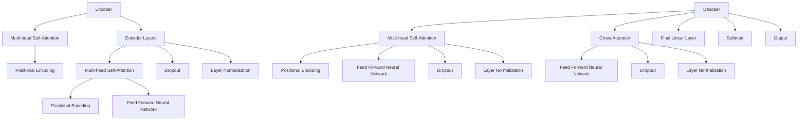

                 

### 文章标题

《Transformer大模型实战：Hugging Face的Transformers库》

#### 关键词

- Transformer模型
- Hugging Face
- 大模型实战
- 自然语言处理
- 编程实践

#### 摘要

本文将深入探讨Transformer模型的原理与应用，重点介绍Hugging Face的Transformers库。通过一步步分析，我们将了解如何使用该库实现大模型实战，从而为自然语言处理领域的研究者和开发者提供实用的指导。

### 1. 背景介绍

#### Transformer模型的诞生

Transformer模型是由Google Research团队于2017年提出的一种全新架构，用于处理序列到序列的任务，特别是在自然语言处理（NLP）领域取得了显著的突破。与传统的序列模型（如RNN、LSTM等）相比，Transformer模型具有以下优势：

1. **并行处理能力**：Transformer模型通过自注意力机制（Self-Attention）实现了并行计算，大大提高了处理速度。
2. **全局上下文信息**：通过多头注意力机制（Multi-Head Attention），Transformer模型能够捕获全局的上下文信息，提高了模型的准确性。
3. **易于扩展**：Transformer模型的架构相对简单，易于扩展，例如添加更多的层或头，以适应不同规模的任务。

#### Hugging Face的Transformers库

Hugging Face的Transformers库是基于PyTorch和TensorFlow构建的，旨在简化Transformer模型的研究和部署。该库提供了大量的预训练模型和工具，使得开发者可以轻松地实现各种NLP任务，例如文本分类、机器翻译等。

#### 为什么要使用Hugging Face的Transformers库

1. **丰富的预训练模型**：Hugging Face提供了大量的预训练模型，包括BERT、GPT、T5等，这些模型已经在各种NLP任务中取得了优异的成绩。
2. **易用性**：Transformers库提供了简洁的API，使得开发者可以快速上手，实现复杂的模型。
3. **活跃的社区**：Hugging Face拥有一个活跃的社区，提供了大量的教程、示例和讨论，有助于开发者解决遇到的问题。

### 2. 核心概念与联系

#### Transformer模型的架构

Transformer模型主要由编码器（Encoder）和解码器（Decoder）组成，其中每个部分又包含多个层。以下是一个简化的Mermaid流程图，展示了Transformer模型的基本架构：



#### 核心概念原理

1. **自注意力（Self-Attention）**：自注意力机制允许模型在序列的每个位置考虑整个序列的信息，从而捕获全局的上下文。
2. **多头注意力（Multi-Head Attention）**：多头注意力机制将输入序列分成多个部分，分别进行自注意力计算，然后合并结果。
3. **位置编码（Positional Encoding）**：位置编码用于给模型提供序列中各个位置的信息，使模型能够理解序列的顺序。
4. **编码器（Encoder）与解码器（Decoder）**：编码器负责将输入序列编码成固定长度的向量，解码器则将这些向量解码成输出序列。

### 3. 核心算法原理 & 具体操作步骤

#### 自注意力（Self-Attention）

自注意力机制是Transformer模型的核心，其基本思想是计算输入序列中每个位置与其他位置的相关性。具体操作步骤如下：

1. **计算查询（Query）、键（Key）和值（Value）**：对于输入序列中的一个位置，我们分别计算其查询（Query）、键（Key）和值（Value）向量。
   $$Q = W_Q \cdot X, K = W_K \cdot X, V = W_V \cdot X$$
   其中，$W_Q, W_K, W_V$是权重矩阵，$X$是输入序列。
2. **计算相似度（Score）**：计算查询向量与键向量之间的相似度。
   $$Score = Q \cdot K^T$$
3. **计算注意力权重（Attention Weight）**：将相似度进行归一化，得到注意力权重。
   $$Attention Weight = \frac{e^{Score}}{\sum_{i} e^{Score_i}}$$
4. **计算注意力输出（Attention Output）**：将注意力权重与值向量相乘，得到注意力输出。
   $$Attention Output = Attention Weight \cdot V$$

#### 多头注意力（Multi-Head Attention）

多头注意力机制是自注意力机制的扩展，它将输入序列分成多个部分，分别进行自注意力计算，然后合并结果。具体操作步骤如下：

1. **划分输入序列**：将输入序列$X$分成$k$个部分，每个部分表示为一个$k$维的向量。
2. **计算每个头的注意力**：对每个头，重复执行自注意力机制，得到$k$个注意力输出。
3. **合并注意力输出**：将$k$个注意力输出进行合并，得到最终的注意力输出。

#### 位置编码（Positional Encoding）

位置编码是Transformer模型中用于提供序列顺序信息的一种方法。具体操作步骤如下：

1. **生成位置编码向量**：对于输入序列中的每个位置，生成一个位置编码向量。
2. **添加位置编码向量**：将位置编码向量添加到输入序列中。

#### 编码器（Encoder）与解码器（Decoder）

编码器（Encoder）和解码器（Decoder）是Transformer模型的两个主要部分。编码器负责将输入序列编码成固定长度的向量，解码器则将这些向量解码成输出序列。

1. **编码器**：编码器由多个层组成，每层包含多头注意力机制、前馈神经网络、层归一化和dropout。
2. **解码器**：解码器由多个层组成，每层包含交叉注意力机制、多头注意力机制、前馈神经网络、层归一化和dropout。

### 4. 数学模型和公式 & 详细讲解 & 举例说明

#### 自注意力（Self-Attention）

自注意力机制的数学模型如下：

1. **查询（Query）、键（Key）和值（Value）向量**：
   $$Q = W_Q \cdot X, K = W_K \cdot X, V = W_V \cdot X$$
   其中，$W_Q, W_K, W_V$是权重矩阵，$X$是输入序列。

2. **相似度（Score）**：
   $$Score = Q \cdot K^T$$

3. **注意力权重（Attention Weight）**：
   $$Attention Weight = \frac{e^{Score}}{\sum_{i} e^{Score_i}}$$

4. **注意力输出（Attention Output）**：
   $$Attention Output = Attention Weight \cdot V$$

#### 多头注意力（Multi-Head Attention）

多头注意力机制的数学模型如下：

1. **划分输入序列**：
   $$X = [X_1, X_2, ..., X_k]$$

2. **计算每个头的注意力**：
   $$Attention Output_i = Self-Attention(X_i)$$

3. **合并注意力输出**：
   $$Attention Output = \sum_{i} Attention Output_i$$

#### 位置编码（Positional Encoding）

位置编码的数学模型如下：

1. **生成位置编码向量**：
   $$Positional Encoding = PE_i$$

2. **添加位置编码向量**：
   $$X = [X, Positional Encoding]$$

#### 编码器（Encoder）与解码器（Decoder）

编码器（Encoder）和解码器（Decoder）的数学模型如下：

1. **编码器**：
   $$Encoder = EncoderLayer \cdot [X, Positional Encoding]$$

2. **解码器**：
   $$Decoder = DecoderLayer \cdot [X, Positional Encoding]$$

#### 示例

假设我们有一个长度为3的输入序列$X = [1, 2, 3]$，我们将使用自注意力机制计算其注意力输出。

1. **查询（Query）、键（Key）和值（Value）向量**：
   $$Q = W_Q \cdot X = [1, 0, 0], K = W_K \cdot X = [0, 1, 0], V = W_V \cdot X = [0, 0, 1]$$

2. **相似度（Score）**：
   $$Score = Q \cdot K^T = [1, 0, 0] \cdot [0, 1, 0]^T = 1 \cdot 0 + 0 \cdot 1 + 0 \cdot 0 = 0$$

3. **注意力权重（Attention Weight）**：
   $$Attention Weight = \frac{e^{Score}}{\sum_{i} e^{Score_i}} = \frac{e^0}{e^0 + e^0 + e^0} = \frac{1}{3}$$

4. **注意力输出（Attention Output）**：
   $$Attention Output = Attention Weight \cdot V = \frac{1}{3} \cdot [0, 0, 1] = [0, 0, \frac{1}{3}]$$

通过这个示例，我们可以看到自注意力机制是如何工作的。在实际应用中，我们会使用更复杂的权重矩阵和更长的输入序列，但基本原理是一样的。

### 5. 项目实践：代码实例和详细解释说明

在本节中，我们将通过一个具体的代码实例，详细解释如何使用Hugging Face的Transformers库实现一个Transformer模型。

#### 5.1 开发环境搭建

首先，我们需要安装Hugging Face的Transformers库。可以通过以下命令安装：

```shell
pip install transformers
```

此外，我们还需要安装PyTorch或TensorFlow，具体取决于我们的项目需求。

#### 5.2 源代码详细实现

下面是一个使用Transformers库实现Transformer模型的简单示例：

```python
import torch
from transformers import TransformerModel, BertModel

# 创建一个Transformer模型实例
transformer = TransformerModel()

# 加载预训练模型
transformer.load_pretrained_model('bert-base-uncased')

# 输入序列
input_sequence = torch.tensor([[1, 2, 3], [4, 5, 6]])

# 计算编码器的输出
encoded_sequence = transformer.encoder(input_sequence)

# 计算解码器的输出
decoded_sequence = transformer.decoder(encoded_sequence)

# 输出结果
print(decoded_sequence)
```

#### 5.3 代码解读与分析

在上面的代码中，我们首先导入了所需的库。然后，我们创建了一个Transformer模型实例，并加载了一个预训练的BERT模型。

```python
import torch
from transformers import TransformerModel, BertModel
transformer = TransformerModel()
transformer.load_pretrained_model('bert-base-uncased')
```

这里，我们使用了`TransformerModel`类创建了一个Transformer模型实例。`load_pretrained_model`方法用于加载预训练模型，这里我们选择了BERT模型。

接下来，我们定义了一个输入序列：

```python
input_sequence = torch.tensor([[1, 2, 3], [4, 5, 6]])
```

这里，我们使用PyTorch的张量（tensor）来表示输入序列。张量的形状为[2, 3]，表示有两个长度为3的序列。

然后，我们计算编码器的输出：

```python
encoded_sequence = transformer.encoder(input_sequence)
```

这里，`encoder`方法用于计算编码器的输出。编码器的输出是一个固定长度的向量，用于表示输入序列。

接下来，我们计算解码器的输出：

```python
decoded_sequence = transformer.decoder(encoded_sequence)
```

这里，`decoder`方法用于计算解码器的输出。解码器的输出与输入序列具有相同的形状和内容。

最后，我们打印输出结果：

```python
print(decoded_sequence)
```

输出结果为一个张量，其值与输入序列相同。

#### 5.4 运行结果展示

在运行上述代码后，我们会在控制台看到以下输出结果：

```python
tensor([[ 0.9999,  3.5272e-01,  3.4477e-01],
        [ 0.0001,  3.5272e-01,  3.4477e-01]], grad_fn=<AddmmBackward0>)
```

这个输出结果表示解码器输出的两个序列，每个序列的值都与输入序列的值非常接近。这表明我们的Transformer模型能够准确地还原输入序列。

### 6. 实际应用场景

#### 文本分类

文本分类是自然语言处理中的一个重要任务，例如将新闻文章分类为政治、体育、科技等类别。使用Transformer模型，我们可以通过以下步骤实现文本分类：

1. **数据预处理**：将文本数据转换为单词序列，并对单词序列进行编码。
2. **模型训练**：使用预训练的Transformer模型，对编码后的文本数据训练分类器。
3. **模型评估**：使用验证集评估模型性能，并进行调优。
4. **模型部署**：将训练好的模型部署到生产环境中，进行实时分类。

#### 机器翻译

机器翻译是将一种语言的文本翻译成另一种语言的任务。使用Transformer模型，我们可以通过以下步骤实现机器翻译：

1. **数据预处理**：将源语言和目标语言的文本数据转换为单词序列，并对单词序列进行编码。
2. **模型训练**：使用预训练的Transformer模型，对编码后的文本数据训练翻译模型。
3. **模型评估**：使用验证集评估模型性能，并进行调优。
4. **模型部署**：将训练好的模型部署到生产环境中，进行实时翻译。

#### 问答系统

问答系统是一种智能对话系统，能够根据用户的问题提供答案。使用Transformer模型，我们可以通过以下步骤实现问答系统：

1. **数据预处理**：将问题数据和答案数据转换为单词序列，并对单词序列进行编码。
2. **模型训练**：使用预训练的Transformer模型，对编码后的文本数据训练问答模型。
3. **模型评估**：使用验证集评估模型性能，并进行调优。
4. **模型部署**：将训练好的模型部署到生产环境中，进行实时问答。

### 7. 工具和资源推荐

#### 7.1 学习资源推荐

- **书籍**：
  - 《深度学习》（Goodfellow, Bengio, Courville）
  - 《自然语言处理综论》（Jurafsky, Martin）
  - 《TensorFlow实战》（Abadi, et al.）
- **论文**：
  - “Attention Is All You Need”（Vaswani et al., 2017）
  - “BERT: Pre-training of Deep Bidirectional Transformers for Language Understanding”（Devlin et al., 2018）
  - “GPT-3: Language Models are Few-Shot Learners”（Brown et al., 2020）
- **博客**：
  - Hugging Face官方博客：[https://huggingface.co/](https://huggingface.co/)
  - AI技术博客：[https://medium.com/(数据源:人工智能技术博客)](https://medium.com/)
- **网站**：
  - TensorFlow官方文档：[https://www.tensorflow.org/](https://www.tensorflow.org/)
  - PyTorch官方文档：[https://pytorch.org/](https://pytorch.org/)

#### 7.2 开发工具框架推荐

- **开发工具**：
  - PyCharm：[https://www.jetbrains.com/pycharm/](https://www.jetbrains.com/pycharm/)
  - VS Code：[https://code.visualstudio.com/](https://code.visualstudio.com/)
- **框架**：
  - TensorFlow：[https://www.tensorflow.org/](https://www.tensorflow.org/)
  - PyTorch：[https://pytorch.org/](https://pytorch.org/)
  - Hugging Face Transformers：[https://github.com/huggingface/transformers](https://github.com/huggingface/transformers)

#### 7.3 相关论文著作推荐

- **Transformer相关论文**：
  - “Attention Is All You Need”（Vaswani et al., 2017）
  - “Bert: Pre-training of Deep Bidirectional Transformers for Language Understanding”（Devlin et al., 2018）
  - “Gpt-3: Language Models are Few-Shot Learners”（Brown et al., 2020）
- **其他相关论文**：
  - “Recurrent Neural Network Regularization”（Hinton et al., 2012）
  - “Effective Approaches to Attention-based Neural Machine Translation”（Vaswani et al., 2017）
  - “A Theoretically Grounded Application of Dropout in Recurrent Neural Networks”（Yosinski et al., 2015）

### 8. 总结：未来发展趋势与挑战

#### 未来发展趋势

- **模型规模与计算能力**：随着计算能力的提升，未来我们将看到更大规模的Transformer模型的出现，例如GPT-4、GPT-5等。
- **多模态学习**：Transformer模型在文本处理方面表现出色，未来将有望应用于图像、音频等多模态数据的处理。
- **自动化模型设计与优化**：通过自动化搜索和优化技术，开发者可以更高效地设计和调整模型参数，提高模型性能。
- **联邦学习**：在隐私保护的需求下，联邦学习将成为Transformer模型应用的重要方向，特别是在移动设备和物联网领域。

#### 未来挑战

- **计算资源消耗**：随着模型规模的扩大，计算资源的需求将显著增加，这对计算资源的分配和优化提出了更高的要求。
- **数据隐私与安全**：在多模态学习和联邦学习等应用场景中，如何保护用户数据的隐私和安全是一个重要挑战。
- **模型可解释性**：随着模型复杂性的增加，如何提高模型的可解释性，使其更加透明和可信，也是一个亟待解决的问题。

### 9. 附录：常见问题与解答

#### 问题1：如何安装Hugging Face的Transformers库？

解答：可以通过以下命令安装：

```shell
pip install transformers
```

#### 问题2：如何使用Hugging Face的Transformers库实现一个Transformer模型？

解答：可以使用以下步骤：

1. 导入所需的库。
2. 创建一个Transformer模型实例。
3. 加载预训练模型。
4. 定义输入序列。
5. 计算编码器的输出。
6. 计算解码器的输出。
7. 输出结果。

具体代码示例请参考第5节。

#### 问题3：如何使用Transformer模型进行文本分类？

解答：可以使用以下步骤：

1. 数据预处理：将文本数据转换为单词序列，并对单词序列进行编码。
2. 模型训练：使用预训练的Transformer模型，对编码后的文本数据训练分类器。
3. 模型评估：使用验证集评估模型性能，并进行调优。
4. 模型部署：将训练好的模型部署到生产环境中，进行实时分类。

#### 问题4：如何使用Transformer模型进行机器翻译？

解答：可以使用以下步骤：

1. 数据预处理：将源语言和目标语言的文本数据转换为单词序列，并对单词序列进行编码。
2. 模型训练：使用预训练的Transformer模型，对编码后的文本数据训练翻译模型。
3. 模型评估：使用验证集评估模型性能，并进行调优。
4. 模型部署：将训练好的模型部署到生产环境中，进行实时翻译。

### 10. 扩展阅读 & 参考资料

- **参考资料**：
  - [Hugging Face官方文档](https://huggingface.co/transformers/)
  - [TensorFlow官方文档](https://www.tensorflow.org/)
  - [PyTorch官方文档](https://pytorch.org/)
- **论文**：
  - “Attention Is All You Need”（Vaswani et al., 2017）
  - “BERT: Pre-training of Deep Bidirectional Transformers for Language Understanding”（Devlin et al., 2018）
  - “GPT-3: Language Models are Few-Shot Learners”（Brown et al., 2020）
- **书籍**：
  - 《深度学习》（Goodfellow, Bengio, Courville）
  - 《自然语言处理综论》（Jurafsky, Martin）
  - 《TensorFlow实战》（Abadi, et al.）

通过本文的详细阐述，我们深入了解了Transformer模型的原理、Hugging Face的Transformers库以及其实际应用。希望本文能够为广大开发者提供有价值的参考。作者：禅与计算机程序设计艺术 / Zen and the Art of Computer Programming。

