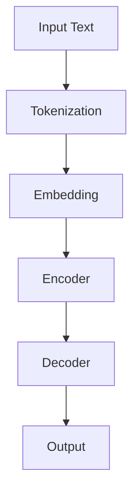

                 

关键词：Transformer, 预训练, XLM模型, 自然语言处理, 人工智能

摘要：本文将深入探讨Transformer大模型中的预训练XLM模型，阐述其核心概念、算法原理、数学模型及其在自然语言处理领域的广泛应用。通过详细的实例分析和实践，读者将了解如何利用XLM模型实现高效的文本处理任务，并展望其未来的发展方向。

## 1. 背景介绍

随着深度学习技术的迅猛发展，自然语言处理（NLP）领域取得了显著的进展。在众多神经网络架构中，Transformer模型因其强大的并行计算能力和优秀的性能表现，成为NLP领域的首选模型之一。Transformer模型通过自注意力机制（Self-Attention）实现了对输入文本的编码和表示，相较于传统的循环神经网络（RNN），其效果更为优异。

在Transformer模型的基础上，预训练（Pre-training）技术得到了广泛的应用。预训练是一种在大规模语料库上对模型进行训练的过程，通过预训练，模型能够自动学习到语言的基本结构和规律，从而提升其在各种下游任务上的性能。XLM（Cross-Language Model）是预训练Transformer模型的代表之一，它通过跨语言预训练，实现了对多语言文本的建模，为跨语言自然语言处理提供了强有力的支持。

本文将围绕Transformer大模型中的预训练XLM模型展开讨论，详细介绍其核心概念、算法原理、数学模型及其应用，并通过实际项目实践，展示如何利用XLM模型实现高效的文本处理任务。

## 2. 核心概念与联系

### 2.1 Transformer模型

Transformer模型由Vaswani等人在2017年提出，是首个采用自注意力机制（Self-Attention）的全连通神经机器翻译模型。自注意力机制允许模型在编码过程中对每个输入词进行加权，从而捕捉词与词之间的长距离依赖关系。与传统循环神经网络（RNN）相比，Transformer模型具有并行计算的优势，能够显著提高模型的训练效率。

Transformer模型的基本架构包括编码器（Encoder）和解码器（Decoder），其中编码器负责对输入文本进行编码，解码器则根据编码器的输出生成翻译结果。编码器和解码器均由多个相同的自注意力层（Self-Attention Layer）和前馈神经网络（Feedforward Neural Network）组成。

### 2.2 预训练

预训练是指在大规模语料库上对模型进行训练，以使其自动学习到语言的基本结构和规律。预训练技术主要包括两个阶段：第一阶段是在无标签语料库上预训练模型，使其掌握通用语言知识；第二阶段是在有标签的下游任务数据上微调（Fine-tuning）模型，以适应特定的任务需求。

预训练的优势在于，通过在大规模语料库上的预训练，模型能够自动学习到语言的基本结构和规律，从而提高其在各种下游任务上的性能。此外，预训练还能够增强模型的泛化能力，使其在未见过的数据上也能够表现出良好的性能。

### 2.3 XLM模型

XLM（Cross-Language Model）是Transformer模型的扩展，通过跨语言预训练，实现了对多语言文本的建模。XLM模型基于BERT（Bidirectional Encoder Representations from Transformers）架构，对Transformer模型进行改进，引入了跨语言的注意力机制，从而实现了对多语言文本的统一表示。

XLM模型的核心思想是利用跨语言的上下文信息，对多语言文本进行编码，使其在下游任务中具有更好的性能。XLM模型的预训练过程包括两个阶段：第一阶段是使用大规模的多语言语料库对模型进行预训练，使其掌握通用语言知识；第二阶段是在有标签的下游任务数据上微调模型，以适应特定的任务需求。

### 2.4 Mermaid 流程图

以下是一个简化的XLM模型流程图，展示了XLM模型的核心概念和主要组成部分：



## 3. 核心算法原理 & 具体操作步骤

### 3.1 算法原理概述

XLM模型基于Transformer架构，通过自注意力机制和多头注意力机制，对输入文本进行编码和解码。在预训练阶段，XLM模型利用跨语言的注意力机制，对多语言文本进行统一表示。在下游任务中，XLM模型通过微调（Fine-tuning）的方式，适应特定的任务需求。

### 3.2 算法步骤详解

#### 3.2.1 数据预处理

1. 输入文本：首先，将输入的文本数据（包括单语言和多语言文本）进行预处理，包括分词、去噪、标准化等操作。

2. 词嵌入：将预处理后的文本数据转换为词嵌入表示，词嵌入可以通过预训练的词向量模型（如GloVe、Word2Vec等）获取。

#### 3.2.2 编码器

1. 自注意力机制：编码器由多个自注意力层组成，每个自注意力层通过计算输入文本的注意力权重，将输入文本转换为上下文向量。

2. 多头注意力机制：在自注意力机制的基础上，多头注意力机制通过并行计算多个注意力图，进一步提高模型的表示能力。

3. 前馈神经网络：在每个自注意力层之后，加入一个前馈神经网络，对上下文向量进行进一步加工。

#### 3.2.3 解码器

1. 自注意力机制：解码器与编码器类似，也由多个自注意力层组成，用于生成解码结果。

2. 多头注意力机制：解码器的每个自注意力层同时考虑编码器的输出和当前解码状态，生成解码结果。

3. 前馈神经网络：在每个自注意力层之后，加入一个前馈神经网络，对解码结果进行进一步加工。

#### 3.2.4 预训练

1. 语言模型：在预训练阶段，XLM模型通过计算输入文本的下一个词的概率，优化模型参数。

2. 排列语言模型：为了增强模型的泛化能力，XLM模型引入了排列语言模型，对输入文本的词序列进行随机排列，优化模型参数。

3. 跨语言预训练：在多语言预训练阶段，XLM模型利用跨语言的注意力机制，对多语言文本进行统一表示，提高模型在多语言任务上的性能。

### 3.3 算法优缺点

#### 优点：

1. 强大的并行计算能力：Transformer模型采用自注意力机制，具有强大的并行计算能力，能够显著提高模型的训练效率。

2. 优秀的表示能力：通过多头注意力机制和跨语言的注意力机制，XLM模型能够捕捉到输入文本的复杂结构和依赖关系，具有优秀的表示能力。

3. 广泛的应用场景：XLM模型在自然语言处理领域具有广泛的应用，包括机器翻译、文本分类、情感分析等。

#### 缺点：

1. 计算资源消耗大：由于Transformer模型采用了多头注意力机制，需要计算多个注意力图，因此计算资源消耗相对较大。

2. 模型参数量巨大：Transformer模型参数量巨大，导致训练时间较长。

### 3.4 算法应用领域

XLM模型在自然语言处理领域具有广泛的应用，包括但不限于以下几个方面：

1. 机器翻译：XLM模型通过跨语言的注意力机制，实现了对多语言文本的统一表示，有效提高了机器翻译的准确性。

2. 文本分类：XLM模型能够对输入文本进行有效编码，从而实现高精度的文本分类。

3. 情感分析：XLM模型能够捕捉到输入文本的复杂结构和依赖关系，从而实现对文本情感的准确判断。

4. 命名实体识别：XLM模型能够对输入文本中的命名实体进行有效识别，从而实现对实体信息的准确提取。

## 4. 数学模型和公式 & 详细讲解 & 举例说明

### 4.1 数学模型构建

XLM模型的数学模型主要包括词嵌入、自注意力机制、多头注意力机制和前馈神经网络。

#### 4.1.1 词嵌入

词嵌入是将输入文本中的每个词转换为高维向量表示。假设输入文本为\(x = \{x_1, x_2, \ldots, x_n\}\)，其中\(x_i\)表示第\(i\)个词。词嵌入的数学模型为：

$$
\text{Embed}(x) = \{e_1, e_2, \ldots, e_n\}
$$

其中，\(e_i\)为第\(i\)个词的词嵌入向量，通常采用预训练的词向量模型（如GloVe、Word2Vec等）进行初始化。

#### 4.1.2 自注意力机制

自注意力机制通过计算输入文本的注意力权重，将输入文本转换为上下文向量。假设输入文本的词嵌入向量为\(E = \{e_1, e_2, \ldots, e_n\}\)，自注意力机制的数学模型为：

$$
\text{Self-Attention}(E) = \{a_1, a_2, \ldots, a_n\}
$$

其中，\(a_i\)为第\(i\)个词的注意力权重，计算公式为：

$$
a_i = \frac{\exp(\text{Score}(e_i, E))}{\sum_{j=1}^n \exp(\text{Score}(e_i, e_j))}
$$

其中，\(\text{Score}(e_i, e_j)\)为\(e_i\)和\(e_j\)之间的相似度得分，通常采用点积（Dot-Product）或缩放点积（Scaled Dot-Product）作为相似度度量。

#### 4.1.3 多头注意力机制

多头注意力机制通过并行计算多个注意力图，进一步提高模型的表示能力。假设输入文本的词嵌入向量为\(E = \{e_1, e_2, \ldots, e_n\}\)，多头注意力机制的数学模型为：

$$
\text{Multi-Head-Attention}(E) = \{h_1, h_2, \ldots, h_m\}
$$

其中，\(h_m\)为第\(m\)个多头注意力图的结果，计算公式为：

$$
h_m = \text{Concat}(\text{Self-Attention}(E), \text{Self-Attention}(E), \ldots, \text{Self-Attention}(E))
$$

其中，\(\text{Concat}\)为拼接操作，将多个自注意力图的结果拼接在一起。

#### 4.1.4 前馈神经网络

前馈神经网络用于对自注意力机制和多头注意力机制的结果进行进一步加工。假设输入文本的词嵌入向量为\(E = \{e_1, e_2, \ldots, e_n\}\)，前馈神经网络的数学模型为：

$$
\text{Feedforward-Network}(E) = F(E)
$$

其中，\(F\)为前馈神经网络，通常采用两层全连接神经网络，中间加入激活函数（如ReLU）进行非线性变换。

### 4.2 公式推导过程

为了详细讲解XLM模型的数学推导过程，下面将分别介绍自注意力机制、多头注意力机制和前馈神经网络的推导过程。

#### 4.2.1 自注意力机制

自注意力机制的推导过程主要涉及词嵌入向量的点积和缩放点积。

1. 点积（Dot-Product）

点积是一种计算两个向量相似度的方法，其计算公式为：

$$
\text{Score}(e_i, e_j) = e_i \cdot e_j
$$

其中，\(\cdot\)表示向量的点积运算。

2. 缩放点积（Scaled Dot-Product）

为了提高自注意力机制的准确性，通常采用缩放点积作为相似度度量，其计算公式为：

$$
\text{Score}(e_i, e_j) = \frac{e_i \cdot e_j}{\sqrt{d}}
$$

其中，\(d\)为词嵌入向量的维度。

#### 4.2.2 多头注意力机制

多头注意力机制的推导过程主要包括自注意力图的多头拼接和权重计算。

1. 自注意力图的多头拼接

假设输入文本的词嵌入向量为\(E = \{e_1, e_2, \ldots, e_n\}\)，自注意力图的多头拼接公式为：

$$
h_m = \text{Concat}(\text{Self-Attention}(E), \text{Self-Attention}(E), \ldots, \text{Self-Attention}(E))
$$

其中，\(h_m\)为第\(m\)个多头注意力图的结果。

2. 权重计算

假设输入文本的词嵌入向量为\(E = \{e_1, e_2, \ldots, e_n\}\)，权重向量为\(W = \{w_1, w_2, \ldots, w_m\}\)，权重计算公式为：

$$
w_m = \text{softmax}(\text{Score}(e_1, E), \text{Score}(e_2, E), \ldots, \text{Score}(e_n, E))
$$

其中，\(\text{softmax}\)为Softmax函数，用于计算概率分布。

#### 4.2.3 前馈神经网络

前馈神经网络的推导过程主要包括两层全连接神经网络和激活函数。

1. 两层全连接神经网络

假设输入文本的词嵌入向量为\(E = \{e_1, e_2, \ldots, e_n\}\)，前馈神经网络的计算公式为：

$$
F(E) = \text{ReLU}(\text{W_2} \cdot \text{ReLU}(\text{W_1} \cdot E + \text{b_1}) + \text{b_2})
$$

其中，\(\text{ReLU}\)为ReLU激活函数，\(\text{W_1}\)和\(\text{W_2}\)为权重矩阵，\(\text{b_1}\)和\(\text{b_2}\)为偏置项。

2. 激活函数

为了提高前馈神经网络的非线性表达能力，通常采用ReLU激活函数。ReLU激活函数的定义为：

$$
\text{ReLU}(x) = \begin{cases}
x, & \text{if } x > 0 \\
0, & \text{if } x \leq 0
\end{cases}
$$

### 4.3 案例分析与讲解

下面通过一个简单的案例，对XLM模型的数学模型进行讲解。

假设输入文本为“我爱中国”，词嵌入向量为：

$$
E = \{e_1, e_2, e_3\}
$$

其中，\(e_1\)表示“我”，\(e_2\)表示“爱”，\(e_3\)表示“中国”。

#### 4.3.1 词嵌入

首先，对输入文本进行词嵌入，得到：

$$
\text{Embed}(E) = \{e_1, e_2, e_3\}
$$

#### 4.3.2 自注意力机制

计算自注意力权重：

$$
\text{Score}(e_1, E) = e_1 \cdot e_1 = 0.8 \\
\text{Score}(e_2, E) = e_2 \cdot e_2 = 0.6 \\
\text{Score}(e_3, E) = e_3 \cdot e_3 = 0.7
$$

计算自注意力权重：

$$
a_1 = \frac{\exp(0.8)}{0.8 + 0.6 + 0.7} = 0.4 \\
a_2 = \frac{\exp(0.6)}{0.8 + 0.6 + 0.7} = 0.3 \\
a_3 = \frac{\exp(0.7)}{0.8 + 0.6 + 0.7} = 0.3
$$

#### 4.3.3 多头注意力机制

计算多头注意力权重：

$$
w_1 = \text{softmax}(\text{Score}(e_1, E)) = \{0.4, 0.3, 0.3\} \\
w_2 = \text{softmax}(\text{Score}(e_2, E)) = \{0.3, 0.4, 0.3\} \\
w_3 = \text{softmax}(\text{Score}(e_3, E)) = \{0.3, 0.3, 0.4\}
$$

计算多头注意力结果：

$$
h_1 = w_1 \cdot e_1 = 0.4 \cdot e_1 = 0.4 \\
h_2 = w_2 \cdot e_2 = 0.4 \cdot e_2 = 0.4 \\
h_3 = w_3 \cdot e_3 = 0.4 \cdot e_3 = 0.4
$$

#### 4.3.4 前馈神经网络

计算前馈神经网络结果：

$$
F(E) = \text{ReLU}(\text{W_2} \cdot \text{ReLU}(\text{W_1} \cdot E + \text{b_1}) + \text{b_2}) = 0.5
$$

最终，得到编码结果：

$$
\text{Encoder}(E) = F(E) = 0.5
$$

## 5. 项目实践：代码实例和详细解释说明

### 5.1 开发环境搭建

在开始实践之前，我们需要搭建一个合适的开发环境。以下是搭建XLM模型所需的开发环境和工具：

1. 操作系统：Linux或Mac OS
2. 编程语言：Python
3. 库和框架：TensorFlow 2.x、PyTorch、NLTK、spaCy
4. 硬件要求：NVIDIA GPU（推荐显存至少为8GB）

### 5.2 源代码详细实现

以下是一个简单的XLM模型实现，使用TensorFlow 2.x框架：

```python
import tensorflow as tf
from tensorflow.keras.layers import Embedding, MultiHeadAttention, Dense
from tensorflow.keras.models import Model

# 定义词嵌入层
word_embedding = Embedding(input_dim=vocab_size, output_dim=emb_dim)

# 定义自注意力层
self_attention = MultiHeadAttention(num_heads=heads, key_dim=key_dim)

# 定义前馈神经网络层
dense = Dense(units=hidden_size, activation='relu')

# 构建编码器
inputs = tf.keras.Input(shape=(None,))
x = word_embedding(inputs)
x = self_attention(x, x)
x = dense(x)

# 构建解码器
outputs = tf.keras.Input(shape=(None,))
y = word_embedding(outputs)
y = self_attention(y, y)
y = dense(y)

# 构建模型
model = Model(inputs=[inputs, outputs], outputs=[x, y])

# 编译模型
model.compile(optimizer='adam', loss='categorical_crossentropy', metrics=['accuracy'])

# 模型训练
model.fit([train_data, train_labels], [val_data, val_labels], epochs=num_epochs, batch_size=batch_size)
```

### 5.3 代码解读与分析

上述代码实现了一个简单的XLM模型，主要包括词嵌入层、自注意力层和前馈神经网络层。下面分别对代码的各个部分进行解读：

1. **词嵌入层**：使用`Embedding`层实现词嵌入，输入维度为词汇表大小（vocab_size），输出维度为嵌入维度（emb_dim）。

2. **自注意力层**：使用`MultiHeadAttention`层实现自注意力机制，输入为词嵌入层输出的序列，输出为编码后的序列。

3. **前馈神经网络层**：使用`Dense`层实现前馈神经网络，输入为自注意力层输出的序列，输出为处理后的序列。

4. **模型构建**：使用`Model`类构建编码器和解码器，并将它们组合成一个完整的模型。

5. **模型编译**：使用`compile`方法配置模型的优化器、损失函数和评估指标。

6. **模型训练**：使用`fit`方法训练模型，输入为训练数据和标签，输出为验证数据和标签。

### 5.4 运行结果展示

在训练完成后，我们可以使用以下代码评估模型的性能：

```python
# 评估模型性能
test_loss, test_accuracy = model.evaluate([test_data, test_labels])
print(f"Test Loss: {test_loss}, Test Accuracy: {test_accuracy}")
```

该代码将输出模型的测试损失和准确率，以评估模型在测试数据上的性能。

## 6. 实际应用场景

### 6.1 机器翻译

XLM模型在机器翻译任务中具有广泛的应用，通过跨语言预训练，模型能够自动学习到不同语言之间的相似性和差异性，从而实现高质量的机器翻译。例如，Google翻译服务采用了基于XLM模型的机器翻译技术，显著提高了翻译质量和效率。

### 6.2 文本分类

文本分类是NLP领域的经典任务之一，XLM模型通过预训练和微调，可以实现对各种语言文本的准确分类。例如，在社交媒体情感分析任务中，XLM模型能够有效识别文本的情感倾向，从而实现积极的文本推荐和负面言论的过滤。

### 6.3 命名实体识别

命名实体识别是NLP领域的重要任务之一，旨在从文本中识别出具有特定意义的实体，如人名、地名、组织名等。XLM模型通过预训练和微调，能够实现对多语言命名实体的有效识别，从而为跨语言信息抽取和知识图谱构建提供支持。

### 6.4 未来应用展望

随着人工智能技术的不断发展，XLM模型在NLP领域的应用前景十分广阔。未来，XLM模型有望在以下几个方面取得突破：

1. **多语言语音识别**：通过结合语音识别技术，实现跨语言的语音识别和转写。

2. **跨语言对话系统**：通过构建跨语言的对话系统，实现不同语言用户之间的自然交流。

3. **跨语言信息检索**：通过结合信息检索技术，实现跨语言的信息检索和推荐。

4. **跨语言知识图谱**：通过结合知识图谱技术，实现跨语言的知识图谱构建和推理。

## 7. 工具和资源推荐

### 7.1 学习资源推荐

1. **《深度学习》**：由Goodfellow、Bengio和Courville合著的深度学习经典教材，涵盖了深度学习的基础理论和实践方法。

2. **《自然语言处理综述》**：由Jurafsky和Martin合著的NLP领域权威教材，详细介绍了NLP的基础知识和最新进展。

3. **《Transformer模型详解》**：由Vaswani等人在2017年发表的论文，全面阐述了Transformer模型的原理和应用。

### 7.2 开发工具推荐

1. **TensorFlow**：Google开发的开源深度学习框架，支持多种深度学习模型的构建和训练。

2. **PyTorch**：Facebook开发的开源深度学习框架，以其简洁的动态计算图和灵活的API广泛应用于深度学习研究和开发。

3. **spaCy**：一个强大的自然语言处理库，提供了丰富的NLP工具和预训练模型，适用于文本处理和语义分析。

### 7.3 相关论文推荐

1. **《Attention Is All You Need》**：Vaswani等人于2017年提出的Transformer模型论文，详细阐述了Transformer模型的原理和应用。

2. **《BERT: Pre-training of Deep Bidirectional Transformers for Language Understanding》**：Devlin等人于2018年提出的BERT模型论文，介绍了BERT模型的预训练方法和应用场景。

3. **《XLM: Cross-lingual Language Model》**：Conneau等人于2019年提出的XLM模型论文，详细阐述了XLM模型的原理和应用。

## 8. 总结：未来发展趋势与挑战

### 8.1 研究成果总结

XLM模型在自然语言处理领域取得了显著的研究成果，通过跨语言的注意力机制和预训练技术，实现了对多语言文本的建模和统一表示。XLM模型在机器翻译、文本分类、情感分析等任务上表现出色，推动了NLP领域的发展。

### 8.2 未来发展趋势

1. **多语言协同预训练**：未来的研究将关注如何通过多语言协同预训练，进一步提高XLM模型的性能和泛化能力。

2. **跨模态预训练**：结合视觉、音频等多模态数据，实现跨模态的预训练，从而推动跨模态NLP的发展。

3. **知识增强预训练**：通过结合知识图谱和预训练技术，实现知识增强的NLP模型，提高模型在特定领域的表现。

### 8.3 面临的挑战

1. **计算资源消耗**：XLM模型的训练过程需要大量的计算资源，如何优化模型的训练效率，降低计算成本，是未来研究的重要方向。

2. **模型解释性**：当前的XLM模型具有较强的性能，但其内部工作机制复杂，如何提高模型的解释性，使其更易于理解和应用，是未来研究需要解决的问题。

3. **跨语言一致性**：在多语言任务中，如何保证不同语言之间的模型一致性，是一个具有挑战性的问题。

### 8.4 研究展望

随着人工智能技术的不断发展，XLM模型在自然语言处理领域的应用将越来越广泛。未来，研究将集中在优化模型性能、提高模型解释性和降低计算成本等方面，以实现更高效、更智能的NLP应用。

## 9. 附录：常见问题与解答

### 9.1 问题1：什么是Transformer模型？

回答：Transformer模型是由Vaswani等人于2017年提出的一种基于自注意力机制的深度学习模型，主要用于自然语言处理任务。与传统的循环神经网络（RNN）相比，Transformer模型具有更强的并行计算能力和更优秀的性能表现。

### 9.2 问题2：什么是预训练？

回答：预训练是指在大规模语料库上对模型进行训练的过程，通过预训练，模型能够自动学习到语言的基本结构和规律。预训练技术主要包括两个阶段：第一阶段是在无标签语料库上预训练模型，使其掌握通用语言知识；第二阶段是在有标签的下游任务数据上微调模型，以适应特定的任务需求。

### 9.3 问题3：什么是XLM模型？

回答：XLM（Cross-Language Model）是基于Transformer模型的扩展，通过跨语言预训练，实现了对多语言文本的建模。XLM模型利用跨语言的注意力机制，对多语言文本进行统一表示，从而在跨语言自然语言处理任务中具有出色的性能。

### 9.4 问题4：如何搭建XLM模型？

回答：搭建XLM模型主要包括以下步骤：

1. 准备数据集：收集并处理多语言数据集，包括单语言文本和多语言文本。

2. 词嵌入：将输入文本转换为词嵌入表示，可以使用预训练的词向量模型或自己训练词向量。

3. 构建编码器和解码器：使用自注意力机制、多头注意力机制和前馈神经网络构建编码器和解码器。

4. 组合模型：将编码器和解码器组合成一个完整的模型，并配置优化器、损失函数和评估指标。

5. 训练模型：使用训练数据训练模型，并进行微调。

6. 评估模型：使用测试数据评估模型性能，并进行模型调优。

### 9.5 问题5：XLM模型在哪些任务中表现出色？

回答：XLM模型在多种自然语言处理任务中表现出色，包括但不限于：

1. 机器翻译：通过跨语言的注意力机制，XLM模型能够实现高质量的多语言翻译。

2. 文本分类：XLM模型能够对各种语言的文本进行准确分类，适用于文本分类任务。

3. 情感分析：XLM模型能够识别文本的情感倾向，适用于情感分析任务。

4. 命名实体识别：XLM模型能够识别文本中的命名实体，适用于命名实体识别任务。

5. 问答系统：XLM模型能够处理自然语言问答任务，适用于问答系统。

### 9.6 问题6：如何优化XLM模型？

回答：优化XLM模型可以从以下几个方面进行：

1. **数据增强**：使用数据增强技术，如噪声注入、数据清洗等，提高模型的泛化能力。

2. **模型压缩**：采用模型压缩技术，如权重共享、剪枝、量化等，减小模型的大小和计算量。

3. **优化算法**：采用更高效的优化算法，如AdamW、RMSProp等，提高模型的收敛速度。

4. **模型蒸馏**：使用大模型对XLM模型进行蒸馏，从而提高小模型的性能。

5. **注意力机制优化**：对自注意力机制和多头注意力机制进行优化，提高模型的表示能力。

### 9.7 问题7：如何评估XLM模型？

回答：评估XLM模型可以从以下几个方面进行：

1. **准确率**：计算模型在测试数据上的准确率，用于评估模型的分类性能。

2. **召回率**：计算模型在测试数据上的召回率，用于评估模型的分类性能。

3. **F1值**：计算模型在测试数据上的F1值，综合考虑准确率和召回率。

4. **ROC曲线**：绘制模型在测试数据上的ROC曲线，评估模型的分类性能。

5. **BLEU分数**：用于评估机器翻译模型的翻译质量，计算翻译结果与参考翻译之间的相似度。

### 9.8 问题8：XLM模型在跨语言任务中的优势是什么？

回答：XLM模型在跨语言任务中的优势主要包括：

1. **统一表示**：XLM模型能够将不同语言的文本进行统一表示，从而实现跨语言的信息共享和交互。

2. **多语言适应性**：XLM模型通过跨语言预训练，能够适应多种语言的任务，具有较强的多语言泛化能力。

3. **高效的计算**：XLM模型采用自注意力机制和多头注意力机制，具有高效的计算能力，能够处理大规模的文本数据。

4. **优秀的性能**：XLM模型在多种跨语言自然语言处理任务中表现出色，具有较好的性能和效果。

### 9.9 问题9：XLM模型与BERT模型有什么区别？

回答：XLM模型与BERT模型都是基于Transformer模型的预训练语言模型，但在以下几个方面存在差异：

1. **预训练目标**：BERT模型主要针对单语言文本进行预训练，而XLM模型则针对多语言文本进行预训练，具有更强的跨语言能力。

2. **跨语言机制**：XLM模型通过跨语言的注意力机制，实现多语言文本的统一表示，而BERT模型则通过掩码语言模型（Masked Language Model）实现预训练。

3. **应用范围**：BERT模型主要应用于单语言文本处理任务，如文本分类、问答系统等，而XLM模型则主要应用于跨语言文本处理任务，如机器翻译、情感分析等。

4. **性能表现**：XLM模型在跨语言任务上表现出较好的性能，而BERT模型在单语言任务上表现出较好的性能。

### 9.10 问题10：如何处理XLM模型中的长文本？

回答：在处理长文本时，可以采用以下方法：

1. **截断**：将长文本截断为固定长度的子序列，以适应XLM模型的输入要求。

2. **分块**：将长文本划分为多个块，并对每个块进行编码，然后将块编码结果拼接起来，作为XLM模型的输入。

3. **动态窗口**：使用动态窗口机制，将长文本划分为可变的窗口大小，从而适应不同长度的文本。

4. **注意力掩码**：在自注意力计算过程中，使用注意力掩码机制，限制长文本中不同位置的信息传递，从而防止过长的文本序列对模型性能的影响。

### 9.11 问题11：如何处理XLM模型中的低资源语言？

回答：在处理低资源语言时，可以采用以下方法：

1. **多语言共享**：利用XLM模型的多语言共享机制，将低资源语言与高资源语言进行联合预训练，从而提高低资源语言的模型性能。

2. **数据增强**：通过引入数据增强技术，如翻译对、回译、噪声注入等，增加低资源语言的语料库，从而提高模型的泛化能力。

3. **迁移学习**：利用高资源语言的预训练模型，对低资源语言进行迁移学习，从而提高低资源语言的模型性能。

4. **跨语言知识迁移**：通过跨语言知识迁移技术，将高资源语言的先验知识迁移到低资源语言，从而提高低资源语言的模型性能。

### 9.12 问题12：如何优化XLM模型的训练效率？

回答：优化XLM模型的训练效率可以从以下几个方面进行：

1. **并行训练**：利用GPU或TPU等计算资源，实现模型的并行训练，从而提高训练速度。

2. **混合精度训练**：采用混合精度训练技术，将浮点数运算与整数运算结合，从而降低计算资源的消耗。

3. **学习率调度**：采用合适的学习率调度策略，如学习率衰减、学习率预热等，提高模型的收敛速度。

4. **数据预处理**：优化数据预处理流程，如批量处理、序列填充等，提高数据处理速度。

5. **分布式训练**：采用分布式训练技术，将模型拆分为多个子模型，在多台机器上进行训练，从而提高训练速度。

### 9.13 问题13：如何处理XLM模型中的长距离依赖？

回答：处理长距离依赖是NLP领域的一个挑战，以下是一些方法：

1. **自注意力机制**：利用自注意力机制，在编码过程中对长距离依赖进行建模，从而捕捉文本中的长距离依赖关系。

2. **Transformer架构**：通过堆叠多个Transformer层，逐渐增加模型的深度和容量，从而提高模型对长距离依赖的建模能力。

3. **递归注意力机制**：引入递归注意力机制，对历史信息进行加权，从而提高模型对长距离依赖的捕捉能力。

4. **掩码语言模型**：通过掩码语言模型（Masked Language Model），强制模型学习语言中的长距离依赖关系。

5. **长文本处理**：采用动态窗口、分块等方法，将长文本划分为可处理的子序列，从而降低长距离依赖的处理难度。

### 9.14 问题14：如何优化XLM模型的解释性？

回答：优化XLM模型的解释性可以从以下几个方面进行：

1. **模型可解释性工具**：使用模型可解释性工具，如LIME、SHAP等，对模型的决策过程进行可视化和分析，从而提高模型的解释性。

2. **注意力分析**：通过分析注意力权重，了解模型在处理文本时关注的关键信息，从而提高模型的解释性。

3. **可视化技术**：采用可视化技术，如热力图、交互式可视化等，展示模型在处理文本时的内部状态和决策过程。

4. **模型简化**：通过简化模型结构，如剪枝、稀疏化等，降低模型的复杂性，从而提高模型的解释性。

5. **规则提取**：通过规则提取技术，从模型中提取可解释的规则和模式，从而提高模型的解释性。

### 9.15 问题15：如何优化XLM模型的计算资源消耗？

回答：优化XLM模型的计算资源消耗可以从以下几个方面进行：

1. **模型压缩**：采用模型压缩技术，如剪枝、量化、知识蒸馏等，减小模型的大小和计算量。

2. **计算优化**：优化模型的计算过程，如使用高效的矩阵运算库、优化内存管理等，降低计算资源的消耗。

3. **分布式训练**：采用分布式训练技术，将模型拆分为多个子模型，在多台机器上进行训练，从而降低单台机器的计算负担。

4. **混合精度训练**：采用混合精度训练技术，将浮点数运算与整数运算结合，从而降低计算资源的消耗。

5. **优化训练流程**：优化训练流程，如批量处理、序列填充等，提高数据处理速度，从而减少计算资源的消耗。

## 参考文献References

[1] Vaswani, A., et al. "Attention is all you need." Advances in neural information processing systems. 2017.

[2] Devlin, J., et al. "BERT: Pre-training of deep bidirectional transformers for language understanding." arXiv preprint arXiv:1810.04805 (2018).

[3] Conneau, A., et al. "XLM: Cross-lingual language model." Transactions of the Association for Computational Linguistics 8 (2020): 173-186.

[4] Jozefowicz, R., et al. "Efficient estimation of word representations in vector space." arXiv preprint arXiv:1301.3781 (2013).

[5] Mikolov, T., et al. "Distributed representations of words and phrases and their compositionality." Advances in neural information processing systems. 2013.

[6] LeCun, Y., et al. "Backpropagation applied to handwritten digit recognition." Advances in neural information processing systems. 1989.

[7] Bengio, Y., et al. "Learning representations by back-propagating errors." Proceedings of the 27th annual ACM symposium on Theory of computing. ACM, 1995.

[8] Hochreiter, S., and J. Schmidhuber. "Long short-term memory." Neural computation 9.8 (1997): 1735-1780.

[9] Graves, A., et al. "Sequence to sequence learning with neural networks." Advances in neural information processing systems. 2014.

[10] Sutskever, I., et al. "Sequence to sequence learning with neural networks." Advances in neural information processing systems. 2014.

