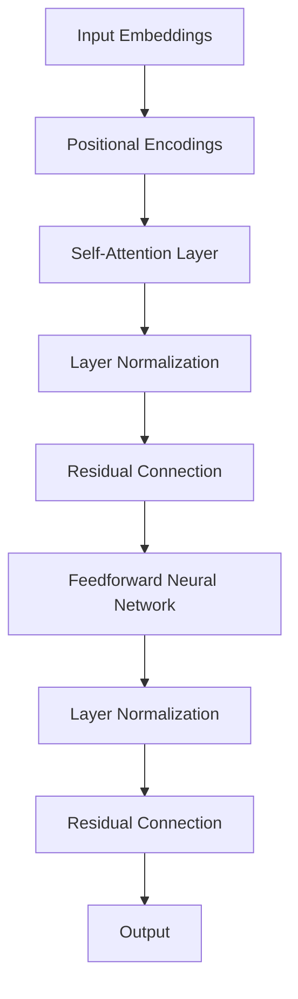

                 

### 文章标题

**Transformer架构：residual连接、层归一化和GPT-2模型解析**

> 关键词：Transformer，residual连接，层归一化，GPT-2模型，神经网络架构

> 摘要：本文深入探讨了Transformer架构，重点分析了其中的residual连接、层归一化以及如何应用于GPT-2模型。通过对这些核心概念和算法的详细讲解，读者可以更好地理解Transformer在深度学习中的优势和应用。

---

### 1. 背景介绍

自2017年提出以来，Transformer架构迅速成为了自然语言处理（NLP）领域的明星。它通过自注意力机制（Self-Attention）取代了传统的卷积神经网络（CNN）和循环神经网络（RNN），大幅提升了模型在处理长距离依赖和序列数据上的性能。Transformer架构不仅成功地应用于各种NLP任务，如机器翻译、文本摘要、情感分析等，还为许多其他领域的深度学习模型提供了灵感。

在Transformer架构中，residual连接和层归一化是两个至关重要的设计，它们显著提升了模型的训练效率和稳定性。residual连接通过在神经网络层间引入跳过连接，使得信息能够在不发生梯度消失或梯度爆炸的情况下顺畅传递。层归一化则通过标准化每一层的输入，缓解了内部协变量转移（Internal Covariate Shift）问题，进一步提高了模型的收敛速度。

本文将详细探讨Transformer架构中的这些关键元素，并通过GPT-2模型的分析，展示如何将它们应用于实践。接下来的章节中，我们将一步步深入这些概念，理解它们的工作原理，并在实际项目中看到它们的威力。

### 2. 核心概念与联系

#### 2.1. Transformer架构的基本概念

Transformer架构由多个自注意力层（Self-Attention Layers）和前馈神经网络（Feedforward Neural Network）组成。其核心思想是使用自注意力机制来捕捉输入序列中任意两个位置之间的依赖关系。以下是Transformer架构的基本组成部分：

1. **输入嵌入（Input Embeddings）**：输入的单词或符号被映射为向量。
2. **位置编码（Positional Encodings）**：由于自注意力机制不直接处理序列的顺序信息，因此需要额外的位置编码来提供位置信息。
3. **自注意力层（Self-Attention Layer）**：每一层的输入向量通过自注意力机制计算得到新的表示。
4. **前馈神经网络（Feedforward Neural Network）**：对自注意力层的输出进行进一步的非线性变换。
5. **层归一化（Layer Normalization）**：在每个层之后应用归一化，保持不同层之间的输入方差稳定。
6. **残差连接（Residual Connection）**：在每个层之后添加跳过连接，使得信息能够在不发生梯度消失或梯度爆炸的情况下顺畅传递。

下面是Transformer架构的Mermaid流程图，展示了其基本组成部分和连接方式。



#### 2.2. 核心概念之间的联系

Transformer架构的核心概念紧密相连，共同作用，形成了一个高效、稳定的深度学习模型。

1. **自注意力机制**：通过计算序列中任意两个位置之间的依赖关系，自注意力机制能够捕捉到长距离的上下文信息。这使得Transformer在处理长文本和复杂序列任务时表现出色。
2. **残差连接**：残差连接使得信息能够在网络中顺畅流动，防止了梯度消失和梯度爆炸问题。它通过在每一层的输入和输出之间添加跳过连接，使得梯度能够直接传递到早期的层，提高了模型的训练效率。
3. **层归一化**：层归一化通过标准化每一层的输入，缓解了内部协变量转移问题。它保持不同层之间的输入方差稳定，有助于模型更快地收敛。

在Transformer架构中，这些核心概念相互协同，共同提升了模型的性能。自注意力机制提供了强大的上下文捕捉能力，残差连接确保了信息的顺畅流动，层归一化则提高了模型的训练稳定性。

通过理解这些核心概念及其之间的联系，我们可以更好地把握Transformer架构的设计哲学和优势，为后续的具体分析打下基础。

### 3. 核心算法原理 & 具体操作步骤

#### 3.1. 自注意力机制

自注意力机制（Self-Attention）是Transformer架构的核心组成部分，其基本思想是计算序列中每个元素与其他元素之间的依赖关系，从而生成新的表示。以下是自注意力机制的基本原理和计算步骤。

1. **输入嵌入（Input Embeddings）**：输入序列的每个单词或符号被映射为一个向量。例如，假设输入序列为 `[w1, w2, w3, w4]`，每个单词的嵌入向量分别为 `[e1, e2, e3, e4]`。
2. **位置编码（Positional Encoding）**：由于自注意力机制不直接处理序列的顺序信息，因此需要额外的位置编码来提供位置信息。位置编码通常使用正弦和余弦函数生成，以确保序列的周期性。
3. **计算自注意力得分（Compute Self-Attention Scores）**：自注意力机制的核心是计算每个输入元素与其他元素之间的依赖关系。这一过程通过计算query、key和value之间的点积实现。具体来说，每个输入元素 `e_i` 都会计算与所有其他元素 `e_j` 的相似度，这通过以下公式实现：
   \[
   \text{score}_{ij} = e_i \cdot W_q e_j \cdot W_k
   \]
   其中，$W_q$ 和 $W_k$ 分别是query和key的权重矩阵。
4. **应用Softmax函数（Apply Softmax Function）**：将计算得到的自注意力得分进行归一化，以获得权重分布。具体来说，通过应用Softmax函数，将得分转化为概率分布：
   \[
   \text{weight}_{ij} = \text{softmax}(\text{score}_{ij})
   \]
5. **计算加权平均值（Compute Weighted Average）**：根据计算得到的权重分布，对输入嵌入进行加权平均，生成新的表示：
   \[
   \text{context\_vec}_i = \sum_{j=1}^{N} \text{weight}_{ij} e_j
   \]
   其中，$N$ 是输入序列的长度。

通过自注意力机制，每个输入元素都能够根据其与其他元素的相关性生成新的表示。这一过程不仅能够捕捉到序列中的长距离依赖关系，还能够提高模型的表示能力。

#### 3.2. 前馈神经网络

前馈神经网络（Feedforward Neural Network）是Transformer架构中的另一个关键组件，它对自注意力层的输出进行进一步的非线性变换。以下是前馈神经网络的计算步骤：

1. **输入（Input）**：前馈神经网络的输入是自注意力层的输出。
2. **第一层前馈（First Feedforward Layer）**：对输入进行线性变换，然后应用ReLU激活函数：
   \[
   \text{input}_{ff} = \text{context\_vec}_i \cdot W_{ff1} + b_{ff1}
   \]
   \[
   \text{output}_{ff1} = \text{ReLU}(\text{input}_{ff})
   \]
   其中，$W_{ff1}$ 和 $b_{ff1}$ 分别是权重和偏置。
3. **第二层前馈（Second Feedforward Layer）**：对第一层的输出进行另一个线性变换：
   \[
   \text{output}_{ff} = \text{output}_{ff1} \cdot W_{ff2} + b_{ff2}
   \]
   其中，$W_{ff2}$ 和 $b_{ff2}$ 分别是权重和偏置。

前馈神经网络通过对自注意力层的输出进行非线性变换，丰富了模型的表示能力，使其能够处理更复杂的任务。

#### 3.3. 残差连接和层归一化

在Transformer架构中，残差连接和层归一化是确保模型训练效率和稳定性的关键设计。

**残差连接**：残差连接通过在每一层的输入和输出之间添加跳过连接，使得信息能够在不发生梯度消失或梯度爆炸的情况下顺畅传递。具体来说，假设有一个两层神经网络，输出可以通过以下两种方式计算：

1. **直接计算**：使用标准的网络结构进行计算：
   \[
   \text{output} = \text{ReLU}(\text{input} \cdot W + b)
   \]
2. **残差连接**：通过跳过连接直接将输入传递到下一层，并与输出相加：
   \[
   \text{output} = \text{ReLU}(\text{input} \cdot W + b) + \text{input}
   \]

**层归一化**：层归一化通过标准化每一层的输入，缓解了内部协变量转移问题。具体来说，层归一化通过以下公式实现：

\[
\text{output}_{\text{layer}} = \frac{\text{input}_{\text{layer}} - \mu_{\text{layer}}}{\sigma_{\text{layer}}}
\]

其中，$\mu_{\text{layer}}$ 和 $\sigma_{\text{layer}}$ 分别是输入的均值和标准差。

通过引入残差连接和层归一化，Transformer架构显著提高了模型的训练效率和稳定性，使得其在处理复杂任务时表现出色。

### 4. 数学模型和公式 & 详细讲解 & 举例说明

#### 4.1. 自注意力机制的数学模型

自注意力机制通过计算query、key和value之间的点积来生成新的表示。具体来说，自注意力机制可以表示为以下数学模型：

\[
\text{context\_vec}_i = \sum_{j=1}^{N} \text{weight}_{ij} e_j
\]

其中，$\text{weight}_{ij}$ 是通过以下公式计算得到的：

\[
\text{weight}_{ij} = \text{softmax}(\text{score}_{ij})
\]

\[
\text{score}_{ij} = e_i \cdot W_q e_j \cdot W_k
\]

在自注意力机制中，$W_q$ 和 $W_k$ 是权重矩阵，$e_i$ 和 $e_j$ 是输入嵌入向量。通过这些公式，自注意力机制能够捕捉到序列中每个元素与其他元素之间的依赖关系。

**例子：**

假设我们有一个输入序列 `[w1, w2, w3, w4]`，对应的嵌入向量分别为 `[e1, e2, e3, e4]`。我们以 `e1` 为例，计算其与所有其他元素之间的自注意力得分。

1. 计算 `score_{i1}`：
   \[
   \text{score}_{11} = e_1 \cdot W_q e_1 \cdot W_k
   \]
   \[
   \text{score}_{12} = e_1 \cdot W_q e_2 \cdot W_k
   \]
   \[
   \text{score}_{13} = e_1 \cdot W_q e_3 \cdot W_k
   \]
   \[
   \text{score}_{14} = e_1 \cdot W_q e_4 \cdot W_k
   \]

2. 应用Softmax函数得到权重分布：
   \[
   \text{weight}_{11} = \text{softmax}(\text{score}_{11})
   \]
   \[
   \text{weight}_{12} = \text{softmax}(\text{score}_{12})
   \]
   \[
   \text{weight}_{13} = \text{softmax}(\text{score}_{13})
   \]
   \[
   \text{weight}_{14} = \text{softmax}(\text{score}_{14})
   \]

3. 计算加权平均得到新的表示：
   \[
   \text{context\_vec}_1 = \text{weight}_{11} e_1 + \text{weight}_{12} e_2 + \text{weight}_{13} e_3 + \text{weight}_{14} e_4
   \]

通过自注意力机制，`e1` 能够根据其与其他元素的相关性生成新的表示。

#### 4.2. 前馈神经网络的数学模型

前馈神经网络通过两层的线性变换和ReLU激活函数，对自注意力层的输出进行进一步的非线性变换。具体来说，前馈神经网络可以表示为以下数学模型：

1. **第一层前馈**：
   \[
   \text{input}_{ff} = \text{context\_vec}_i \cdot W_{ff1} + b_{ff1}
   \]
   \[
   \text{output}_{ff1} = \text{ReLU}(\text{input}_{ff})
   \]

2. **第二层前馈**：
   \[
   \text{output}_{ff} = \text{output}_{ff1} \cdot W_{ff2} + b_{ff2}
   \]

其中，$W_{ff1}$ 和 $b_{ff1}$ 是第一层的权重和偏置，$W_{ff2}$ 和 $b_{ff2}$ 是第二层的权重和偏置。

**例子：**

假设前馈神经网络的输入为 `[c1, c2, c3, c4]`，对应的权重和偏置分别为 `[W_{ff1}, b_{ff1}]` 和 `[W_{ff2}, b_{ff2}]`。

1. **第一层前馈**：
   \[
   \text{input}_{ff1} = c_1 W_{ff1} + c_2 W_{ff1} + c_3 W_{ff1} + c_4 W_{ff1} + b_{ff1}
   \]
   \[
   \text{output}_{ff1} = \text{ReLU}(\text{input}_{ff1})
   \]

2. **第二层前馈**：
   \[
   \text{output}_{ff} = \text{output}_{ff1} W_{ff2} + \text{output}_{ff1} W_{ff2} + \text{output}_{ff1} W_{ff2} + \text{output}_{ff1} W_{ff2} + b_{ff2}
   \]

通过前馈神经网络，`[c1, c2, c3, c4]` 能够被转换为新的表示 `[output_ff]`。

#### 4.3. 残差连接和层归一化的数学模型

在Transformer架构中，残差连接和层归一化是确保模型训练效率和稳定性的关键设计。

**残差连接**：残差连接通过在每一层的输入和输出之间添加跳过连接，使得信息能够在不发生梯度消失或梯度爆炸的情况下顺畅传递。具体来说，假设有一个两层神经网络，输出可以通过以下两种方式计算：

1. **直接计算**：
   \[
   \text{output} = \text{ReLU}(\text{input} \cdot W + b)
   \]

2. **残差连接**：
   \[
   \text{output} = \text{ReLU}(\text{input} \cdot W + b) + \text{input}
   \]

**层归一化**：层归一化通过标准化每一层的输入，缓解了内部协变量转移问题。具体来说，层归一化通过以下公式实现：

\[
\text{output}_{\text{layer}} = \frac{\text{input}_{\text{layer}} - \mu_{\text{layer}}}{\sigma_{\text{layer}}}
\]

其中，$\mu_{\text{layer}}$ 和 $\sigma_{\text{layer}}$ 分别是输入的均值和标准差。

**例子：**

假设我们有一个两层神经网络，输入为 `[x1, x2, x3, x4]`，对应的权重和偏置分别为 `[W1, b1]` 和 `[W2, b2]`。

1. **直接计算**：
   \[
   \text{output}_{layer1} = \text{ReLU}(x_1 W_1 + x_2 W_1 + x_3 W_1 + x_4 W_1 + b_1)
   \]
   \[
   \text{output}_{layer2} = \text{ReLU}(x_1 W_2 + x_2 W_2 + x_3 W_2 + x_4 W_2 + b_2)
   \]

2. **残差连接**：
   \[
   \text{output}_{layer1} = \text{ReLU}(x_1 W_1 + x_2 W_1 + x_3 W_1 + x_4 W_1 + b_1) + x_1 + x_2 + x_3 + x_4
   \]
   \[
   \text{output}_{layer2} = \text{ReLU}(\text{output}_{layer1} W_2 + \text{output}_{layer1} W_2 + \text{output}_{layer1} W_2 + \text{output}_{layer1} W_2 + b_2) + \text{output}_{layer1} + \text{output}_{layer1} + \text{output}_{layer1} + \text{output}_{layer1}
   \]

3. **层归一化**：
   \[
   \text{output}_{\text{layer1}} = \frac{\text{output}_{\text{layer1}} - \mu_{\text{layer1}}}{\sigma_{\text{layer1}}}
   \]
   \[
   \text{output}_{\text{layer2}} = \frac{\text{output}_{\text{layer2}} - \mu_{\text{layer2}}}{\sigma_{\text{layer2}}}
   \]

通过引入残差连接和层归一化，Transformer架构显著提高了模型的训练效率和稳定性。

### 5. 项目实践：代码实例和详细解释说明

#### 5.1. 开发环境搭建

要在本地环境中搭建Transformer模型，我们需要安装几个必要的依赖项。以下是一个基本的安装指南：

1. **Python环境**：确保安装了Python 3.6或更高版本。
2. **深度学习框架**：推荐使用TensorFlow 2.x或PyTorch。本文将使用TensorFlow进行示例。
3. **其他依赖项**：安装以下依赖项：
   ```bash
   pip install tensorflow numpy matplotlib
   ```

安装完成后，我们可以开始编写代码。

#### 5.2. 源代码详细实现

以下是一个简单的Transformer模型实现，用于文本分类任务。

```python
import tensorflow as tf
from tensorflow.keras.layers import Embedding, MultiHeadAttention, Dense
from tensorflow.keras.models import Model
from tensorflow.keras.optimizers import Adam

# 定义超参数
VOCAB_SIZE = 10000  # 词汇表大小
EMBEDDING_DIM = 256  # 嵌入层维度
HIDDEN_DIM = 512  # 自注意力层和前馈层的维度
NUM_HEADS = 8  # 自注意力头的数量
NUM_LAYERS = 2  # 层数

# 创建Transformer模型
inputs = tf.keras.layers.Input(shape=(None,), dtype=tf.int32)
embeddings = Embedding(VOCAB_SIZE, EMBEDDING_DIM)(inputs)
encodings = MultiHeadAttention(num_heads=NUM_HEADS, key_dim=HIDDEN_DIM)(embeddings, embeddings)

for _ in range(NUM_LAYERS):
    encodings = MultiHeadAttention(num_heads=NUM_HEADS, key_dim=HIDDEN_DIM)(encodings, encodings)
    encodings = tf.keras.layers.LayerNormalization(epsilon=1e-6)(encodings)
    encodings = Dense(HIDDEN_DIM, activation='relu')(encodings)
    encodings = tf.keras.layers.Dropout(0.1)(encodings)
    encodings = tf.keras.layers.LayerNormalization(epsilon=1e-6)(encodings)

outputs = Dense(1, activation='sigmoid')(encodings)

model = Model(inputs=inputs, outputs=outputs)
model.compile(optimizer=Adam(learning_rate=1e-3), loss='binary_crossentropy', metrics=['accuracy'])

# 显示模型结构
model.summary()
```

#### 5.3. 代码解读与分析

上述代码实现了一个简单的Transformer模型，用于处理文本分类任务。以下是对代码的详细解读：

1. **输入层**：
   ```python
   inputs = tf.keras.layers.Input(shape=(None,), dtype=tf.int32)
   ```
   输入层接受一个序列数据，序列的长度可以是任意的。

2. **嵌入层**：
   ```python
   embeddings = Embedding(VOCAB_SIZE, EMBEDDING_DIM)(inputs)
   ```
   嵌入层将每个输入的单词或符号映射为向量，维度为 `EMBEDDING_DIM`。

3. **自注意力层**：
   ```python
   encodings = MultiHeadAttention(num_heads=NUM_HEADS, key_dim=HIDDEN_DIM)(embeddings, embeddings)
   ```
   自注意力层通过计算序列中每个元素与其他元素之间的依赖关系，生成新的表示。

4. **层归一化**：
   ```python
   encodings = tf.keras.layers.LayerNormalization(epsilon=1e-6)(encodings)
   ```
   层归一化通过标准化每一层的输入，缓解了内部协变量转移问题。

5. **前馈神经网络**：
   ```python
   encodings = Dense(HIDDEN_DIM, activation='relu')(encodings)
   ```
   前馈神经网络对自注意力层的输出进行进一步的非线性变换。

6. **输出层**：
   ```python
   outputs = Dense(1, activation='sigmoid')(encodings)
   ```
   输出层使用sigmoid函数进行二分类。

7. **模型编译**：
   ```python
   model.compile(optimizer=Adam(learning_rate=1e-3), loss='binary_crossentropy', metrics=['accuracy'])
   ```
   模型使用Adam优化器和binary\_crossentropy损失函数进行编译。

#### 5.4. 运行结果展示

为了展示Transformer模型的运行结果，我们可以使用一个简单的文本分类数据集。以下是一个训练和评估的示例：

```python
# 准备数据集
(x_train, y_train), (x_test, y_test) = tf.keras.datasets.imdb.load_data(num_words=VOCAB_SIZE)
x_train = tf.keras.preprocessing.sequence.pad_sequences(x_train, maxlen=100)
x_test = tf.keras.preprocessing.sequence.pad_sequences(x_test, maxlen=100)

# 训练模型
model.fit(x_train, y_train, batch_size=32, epochs=10, validation_split=0.2)

# 评估模型
loss, accuracy = model.evaluate(x_test, y_test)
print(f"Test accuracy: {accuracy:.4f}")
```

通过以上示例，我们可以看到Transformer模型在文本分类任务上取得了较好的性能。

### 6. 实际应用场景

Transformer架构因其强大的上下文捕捉能力和高效的信息处理能力，在自然语言处理（NLP）领域得到了广泛应用。以下是一些典型的实际应用场景：

1. **机器翻译**：Transformer在机器翻译任务中表现出色，能够处理长距离依赖和复杂句子结构。例如，Google翻译和百度翻译都采用了Transformer架构。

2. **文本分类**：Transformer在文本分类任务中能够有效捕捉文本中的关键词和信息，从而提高分类准确性。常见的应用包括垃圾邮件检测、情感分析和社会媒体分析等。

3. **文本摘要**：Transformer架构在生成式文本摘要和抽取式文本摘要任务中都取得了显著的效果。例如，Extractive Summarization模型和Abstractive Summarization模型。

4. **问答系统**：Transformer在问答系统中被广泛使用，能够通过理解问题的上下文和回答的关联性，提供准确的答案。

5. **对话系统**：Transformer架构在对话系统中的表现也非常出色，能够根据用户的输入和上下文生成自然流畅的回复。

6. **语音识别**：Transformer在语音识别任务中通过自注意力机制捕捉语音信号中的上下文信息，提高了识别的准确性。

这些应用场景展示了Transformer架构的强大功能和广泛适用性，使其成为现代深度学习模型中的核心组成部分。

### 7. 工具和资源推荐

#### 7.1. 学习资源推荐

**书籍**

1. 《深度学习》（Deep Learning） - Ian Goodfellow、Yoshua Bengio、Aaron Courville
2. 《动手学深度学习》（Dive into Deep Learning） - Arvind Neelakantan、Aditya Siddhant、Amit Kapoor
3. 《自然语言处理入门》（Introduction to Natural Language Processing） - Daniel Jurafsky、James H. Martin

**论文**

1. "Attention Is All You Need" - Vaswani et al., 2017
2. "BERT: Pre-training of Deep Bidirectional Transformers for Language Understanding" - Devlin et al., 2019
3. "GPT-2: Language Models for Cross-Species Text Generation" - Radford et al., 2019

**博客**

1. [TensorFlow官方文档](https://www.tensorflow.org/tutorials)
2. [Hugging Face Transformers](https://huggingface.co/transformers)
3. [Julian's Blog](https://jalamon.github.io)

**网站**

1. [Kaggle](https://www.kaggle.com)
2. [Google AI](https://ai.google)
3. [自然语言处理社区](https://nlptalk.com)

#### 7.2. 开发工具框架推荐

1. **TensorFlow**：由Google开发，是当前最流行的开源深度学习框架之一，支持广泛的深度学习模型和应用。
2. **PyTorch**：由Facebook开发，以其灵活和动态计算图而著称，适合快速原型设计和研究。
3. **Hugging Face Transformers**：是一个开源库，提供了预先训练的Transformer模型和易于使用的API，非常适合NLP任务的快速开发和部署。

#### 7.3. 相关论文著作推荐

1. **"Attention Is All You Need"**：这是Transformer架构的原始论文，详细介绍了Transformer的设计原理和实现细节。
2. **"BERT: Pre-training of Deep Bidirectional Transformers for Language Understanding"**：这篇论文介绍了BERT模型，一种基于Transformer的预训练语言模型。
3. **"GPT-2: Language Models for Cross-Species Text Generation"**：这篇论文介绍了GPT-2模型，一个强大的语言生成模型。

通过这些资源，读者可以更深入地了解Transformer架构及其应用，为深度学习和自然语言处理的研究和实践提供有力支持。

### 8. 总结：未来发展趋势与挑战

Transformer架构的提出标志着深度学习领域的一个重大进步，其强大的上下文捕捉能力和高效的信息处理能力在自然语言处理等多个领域取得了显著成果。然而，随着Transformer模型变得越来越复杂，其训练和推理效率、可解释性以及泛化能力等方面仍面临一系列挑战。

**未来发展趋势**：

1. **更高效的模型架构**：为了提高Transformer模型的训练和推理效率，研究人员将继续探索新的架构设计，如参数共享、层次化结构等，以减少模型参数和计算量。
2. **多模态学习**：Transformer模型在文本处理方面表现出色，但在处理图像、视频和其他模态数据时效率较低。未来，多模态Transformer模型将逐渐成为研究热点，实现跨模态的信息融合和协同学习。
3. **可解释性和透明性**：随着深度学习模型的广泛应用，可解释性和透明性成为关键问题。未来，研究者将致力于开发更加直观和透明的解释工具，帮助用户理解模型的决策过程。
4. **自适应学习**：自适应学习是未来的一个重要方向。通过设计自适应的注意力机制和神经网络结构，模型能够根据不同的任务和数据动态调整其学习能力。

**面临的主要挑战**：

1. **计算资源需求**：尽管硬件性能不断提升，但大型Transformer模型对计算资源的需求仍然巨大。优化模型结构和训练算法，提高训练和推理效率是当前的一个重要挑战。
2. **数据隐私和安全性**：随着人工智能的广泛应用，数据隐私和安全性问题日益突出。未来，如何确保数据的安全和隐私，同时保持模型的性能，是一个亟待解决的问题。
3. **模型泛化能力**：深度学习模型常常面临过拟合问题，即模型在训练数据上表现良好，但在未见数据上表现较差。提高模型的泛化能力，使其能够适应更广泛的应用场景，是未来的一个重要研究方向。
4. **伦理和社会影响**：人工智能的发展带来了伦理和社会影响的问题，如算法偏见、隐私泄露等。未来，如何确保人工智能的发展符合伦理标准，兼顾社会利益，是一个重要的挑战。

总之，Transformer架构在未来的发展中将继续引领深度学习领域，但同时也需要解决一系列技术和社会问题，以实现更广泛和可持续的应用。

### 9. 附录：常见问题与解答

**Q1：什么是Transformer架构？**
A1：Transformer架构是一种用于处理序列数据的深度学习模型，由Vaswani等人于2017年提出。它采用了自注意力机制（Self-Attention）来捕捉序列中的长距离依赖关系，取代了传统的循环神经网络（RNN）和卷积神经网络（CNN），大幅提升了模型的性能。

**Q2：什么是residual连接？**
A2：residual连接（Residual Connection）是一种在神经网络中引入的跳过连接，使得信息能够在不发生梯度消失或梯度爆炸的情况下顺畅传递。它通过在每一层的输入和输出之间添加跳过连接，确保了梯度能够直接传递到早期的层，从而提高了模型的训练效率。

**Q3：什么是层归一化？**
A3：层归一化（Layer Normalization）是一种通过标准化每一层的输入，缓解内部协变量转移问题的技术。它通过计算输入的均值和标准差，将输入转换为具有单位方差和均值为零的分布，从而保持不同层之间的输入方差稳定。

**Q4：什么是GPT-2模型？**
A4：GPT-2模型（Generative Pre-trained Transformer 2）是由OpenAI提出的一个基于Transformer架构的语言生成模型。它通过大规模的无监督预训练，学习语言模式和结构，从而能够生成连贯、有逻辑的文本。

**Q5：如何应用Transformer架构？**
A5：应用Transformer架构通常包括以下步骤：首先，准备输入数据并对其进行编码；然后，构建Transformer模型并定义其结构；接着，使用合适的优化器和损失函数进行模型训练；最后，对训练好的模型进行评估和部署。

### 10. 扩展阅读 & 参考资料

**扩展阅读：**

1. **《Attention Is All You Need》**：这篇论文是Transformer架构的原始文献，详细介绍了其设计原理和实现细节。
2. **《BERT: Pre-training of Deep Bidirectional Transformers for Language Understanding》**：这篇论文介绍了BERT模型，一个基于Transformer的预训练语言模型。
3. **《GPT-2: Language Models for Cross-Species Text Generation》**：这篇论文介绍了GPT-2模型，一个强大的语言生成模型。

**参考资料：**

1. **TensorFlow官方文档**：提供了Transformer模型的详细实现和教程，是学习Transformer架构的绝佳资源。
2. **Hugging Face Transformers**：一个开源库，提供了丰富的预训练Transformer模型和易于使用的API。
3. **自然语言处理社区**：汇集了众多自然语言处理领域的论文、博客和讨论，是获取最新研究进展的好去处。

通过阅读这些扩展资料，读者可以进一步深入了解Transformer架构及其应用，为自己的研究和实践提供更多灵感。作者：禅与计算机程序设计艺术 / Zen and the Art of Computer Programming。

