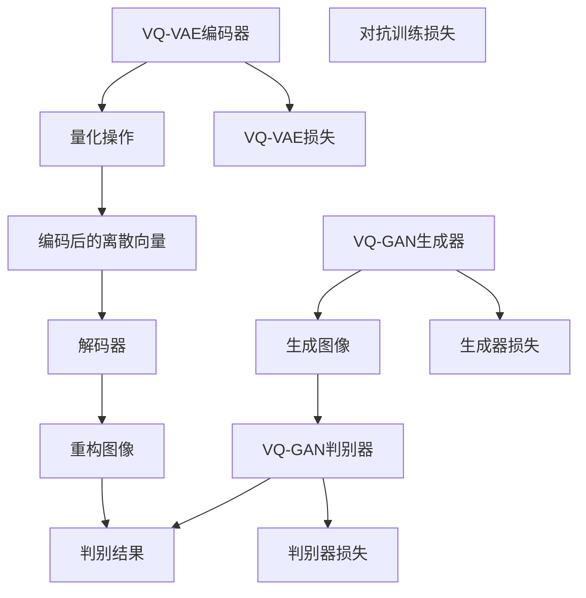

                 

### 1. 背景介绍

#### 图像生成的需求背景

随着深度学习的快速发展，图像生成成为计算机视觉领域的一个重要研究方向。图像生成技术在许多领域都显示出了巨大的潜力，例如计算机图形学、计算机视觉、艺术创作、游戏设计等。这些领域都对生成逼真、多样化的图像有着强烈的需求。

早期的图像生成方法主要依赖于规则系统或基于概率模型的方法，如马尔可夫随机场（Markov Random Fields, MRF）和生成对抗网络（Generative Adversarial Networks, GAN）。然而，这些方法往往面临模型训练不稳定、生成图像质量不高等问题。随着深度学习技术的发展，基于变分自编码器（Variational Autoencoder, VAE）和生成对抗网络（GAN）的图像生成方法逐渐成为主流。

#### VAE与GAN的局限性

变分自编码器（VAE）通过引入概率模型，能够生成高质量的图像，但在图像的多样性和纹理方面仍有待提高。生成对抗网络（GAN）通过对抗训练能够生成高质量的图像，但训练过程不稳定，容易出现模式崩溃（mode collapse）和训练困难等问题。

为了克服这些局限性，研究者们提出了VQ-VAE（Vector Quantized-Variational Autoencoder）和VQGAN（Vector Quantized-GAN）等新的图像生成方法。这些方法通过量化变分自编码器和生成对抗网络，在保持生成质量的同时，提高了模型的稳定性和训练效率。

#### VQVAE与VQGAN的提出

VQ-VAE通过在编码器和解码器之间引入量化的操作，将连续的输入映射到离散的向量集合中，从而实现了数据的降维和稀疏化。这种方法不仅提高了模型的训练稳定性，还使得生成的图像更加多样化。

VQGAN则进一步将VQ-VAE与生成对抗网络结合，通过对抗训练生成高质量的图像。与传统的GAN相比，VQGAN在生成图像的多样性和质量方面都有所提高，同时训练过程也更加稳定。

综上所述，VQVAE与VQGAN的出现为图像生成领域带来了新的思路和突破，解决了传统方法存在的问题，为生成高质量的图像提供了更加有效的解决方案。

### 2. 核心概念与联系

#### VQ-VAE

VQ-VAE（Vector Quantized-Variational Autoencoder）是一种基于变分自编码器（VAE）的图像生成方法，其主要思想是在编码器和解码器之间引入量化操作，将连续的输入映射到离散的向量集合中。这样做的目的是降低数据的维度，同时保持数据的稀疏性。

VQ-VAE的架构包括两个主要部分：编码器和解码器。编码器的作用是将输入图像映射到一个潜在空间，而解码器的作用是将潜在空间中的向量重新映射回图像空间。在量化过程中，编码器生成的连续向量会被映射到一个预定义的码本中，码本中的每个向量都表示潜在空间中的一个离散点。这个量化操作使得模型能够学习到数据的结构，同时避免了直接处理连续变量带来的计算复杂性。

#### VQ-GAN

VQ-GAN（Vector Quantized-GAN）是一种基于VQ-VAE和生成对抗网络（GAN）的图像生成方法。它的核心思想是将VQ-VAE的量化操作与GAN的对抗训练相结合，通过生成器（Generator）和判别器（Discriminator）的对抗训练，生成高质量的图像。

在VQ-GAN中，生成器的任务是将随机噪声映射到潜在空间中，然后再通过解码器生成图像。判别器的任务是区分真实图像和生成图像。与传统的GAN不同，VQ-GAN中的生成器和判别器都是在量化空间中操作，这样不仅提高了模型的训练稳定性，还使得生成的图像更加多样化和高质量。

#### VQ-VAE与VQ-GAN的关系

VQ-VAE和VQ-GAN在本质上都是基于变分自编码器和生成对抗网络的图像生成方法。VQ-VAE通过量化操作实现了数据的降维和稀疏化，而VQ-GAN则在此基础上引入了生成对抗网络，通过对抗训练提高了生成图像的质量和多样性。

两者的主要区别在于模型架构和训练过程。VQ-VAE的架构相对简单，仅包含编码器和解码器，而VQ-GAN则在VQ-VAE的基础上增加了生成器和判别器，使得模型更加复杂。在训练过程中，VQ-VAE主要依赖于变分自编码器的损失函数，而VQ-GAN则需要同时优化生成器和判别器的损失函数。

为了更好地理解VQ-VAE与VQ-GAN的架构和关系，下面我们将使用Mermaid流程图展示它们的原理和架构。



在这个流程图中，VQ-VAE编码器将输入图像映射到潜在空间，经过量化操作后得到编码后的离散向量，再通过解码器重构图像。VQ-GAN在VQ-VAE的基础上，增加了生成器和判别器，通过对抗训练生成高质量的图像。

通过这个Mermaid流程图，我们可以清晰地看到VQ-VAE和VQ-GAN的架构和关系，进一步理解它们在图像生成领域的应用。

### 3. 核心算法原理 & 具体操作步骤

#### VQ-VAE的算法原理

VQ-VAE的核心思想是将连续的输入映射到离散的向量集合中，通过量化操作实现数据的降维和稀疏化。以下是VQ-VAE的具体算法原理和操作步骤：

1. **编码器**：编码器的任务是将输入图像映射到一个潜在空间。通常，这个潜在空间是一个低维的连续分布。在VQ-VAE中，编码器通常使用一个全连接神经网络来实现。编码器输入是一个图像矩阵X，输出是一个潜在空间的向量z。

2. **量化操作**：量化操作是将编码器输出的连续向量映射到一个预定义的码本中。码本中的每个向量都表示潜在空间中的一个离散点。量化操作的具体步骤如下：
   - 对于每个编码器输出的连续向量z_i，计算它与码本中每个向量的距离。
   - 选择距离最近的码本向量作为量化后的向量q_i。
   - 量化后的向量q_i作为编码器的输出。

3. **解码器**：解码器的任务是将量化后的向量q_i重新映射回图像空间，生成重构图像。解码器通常使用一个反卷积神经网络来实现。解码器的输入是量化后的向量q_i，输出是重构图像X'。

4. **损失函数**：VQ-VAE的损失函数包括三个部分：
   - **重构损失**：重构损失是解码器输出与输入图像之间的差异。通常使用均方误差（Mean Squared Error, MSE）作为重构损失。
   - **量化损失**：量化损失是编码器输出与量化后的向量之间的差异。量化损失通常使用三角损失函数（Triangular Loss Function）来计算。
   - **KL散度损失**：KL散度损失是编码器输出的概率分布与真实数据的概率分布之间的差异。KL散度损失用于确保编码器输出的概率分布接近真实数据的概率分布。

#### VQ-GAN的算法原理

VQ-GAN在VQ-VAE的基础上，引入了生成对抗网络（GAN），通过对抗训练生成高质量的图像。以下是VQ-GAN的具体算法原理和操作步骤：

1. **生成器**：生成器的任务是将随机噪声映射到潜在空间中，然后通过解码器生成图像。生成器通常使用一个全连接神经网络和一个反卷积神经网络来实现。生成器的输入是随机噪声z，输出是生成的图像X'。

2. **判别器**：判别器的任务是区分真实图像和生成图像。判别器通常使用一个卷积神经网络来实现。判别器的输入是图像X，输出是一个二分类结果，表示输入图像是真实图像还是生成图像。

3. **对抗训练**：对抗训练是VQ-GAN的核心。生成器和判别器通过对抗训练相互竞争，生成器试图生成更加逼真的图像，而判别器试图区分真实图像和生成图像。对抗训练的具体步骤如下：
   - 生成器G从噪声z中生成图像X'。
   - 判别器D对真实图像X和生成图像X'进行分类。
   - 计算生成器的损失函数G_loss，通常使用二元交叉熵（Binary Cross-Entropy Loss）来计算。
   - 计算判别器的损失函数D_loss，也使用二元交叉熵（Binary Cross-Entropy Loss）来计算。
   - 更新生成器和判别器的参数。

4. **损失函数**：VQ-GAN的损失函数包括两部分：
   - **生成器损失**：生成器损失是生成图像与真实图像之间的差异。生成器损失通常使用均方误差（Mean Squared Error, MSE）来计算。
   - **判别器损失**：判别器损失是判别器对真实图像和生成图像的分类结果与实际标签之间的差异。判别器损失通常使用二元交叉熵（Binary Cross-Entropy Loss）来计算。

通过上述步骤，VQ-VAE和VQ-GAN能够生成高质量的图像。VQ-VAE通过量化操作实现数据的降维和稀疏化，而VQ-GAN通过对抗训练生成高质量的图像。这两个算法在图像生成领域取得了显著的效果。

### 4. 数学模型和公式 & 详细讲解 & 举例说明

#### VQ-VAE的数学模型

VQ-VAE的数学模型可以分为三个主要部分：编码器、量化操作和解码器。

1. **编码器**：

   编码器的作用是将输入图像X映射到一个潜在空间。在数学上，这个过程可以表示为：
   
   $$ z = \mu(x) = \sigma(\theta_1 W_1 x + b_1) $$
   
   其中，$z$是编码器输出的潜在空间向量，$\mu(x)$是编码器函数，$W_1$和$b_1$分别是编码器的权重和偏置，$\sigma$是激活函数，通常取为ReLU函数。

2. **量化操作**：

   量化操作是将编码器输出的连续向量映射到一个预定义的码本中。在数学上，这个过程可以表示为：
   
   $$ q_i = \text{argmin}_{j} \Vert z_i - \text{codebook}[j] \Vert_2 $$
   
   其中，$q_i$是量化后的向量，$z_i$是编码器输出的连续向量，$\text{codebook}$是预定义的码本，$\Vert \cdot \Vert_2$是欧几里得范数。

3. **解码器**：

   解码器的任务是将量化后的向量q_i重新映射回图像空间。在数学上，这个过程可以表示为：
   
   $$ x' = \sigma(\theta_2 W_2 q_i + b_2) $$
   
   其中，$x'$是解码器输出的重构图像，$q_i$是量化后的向量，$W_2$和$b_2$分别是解码器的权重和偏置，$\sigma$是激活函数，通常取为ReLU函数。

#### VQ-GAN的数学模型

VQ-GAN的数学模型在VQ-VAE的基础上，引入了生成对抗网络（GAN）。生成对抗网络包括生成器和判别器。

1. **生成器**：

   生成器的任务是将随机噪声z映射到潜在空间，然后通过解码器生成图像。在数学上，这个过程可以表示为：
   
   $$ x' = \sigma(\theta_3 W_3 z + b_3) $$
   
   其中，$x'$是生成器输出的图像，$z$是随机噪声，$W_3$和$b_3$分别是生成器的权重和偏置，$\sigma$是激活函数，通常取为ReLU函数。

2. **判别器**：

   判别器的任务是区分真实图像和生成图像。在数学上，这个过程可以表示为：
   
   $$ \hat{y} = \sigma(\theta_4 W_4 x + b_4) $$
   
   其中，$\hat{y}$是判别器输出的概率值，表示输入图像是真实图像的概率，$x$是输入图像，$W_4$和$b_4$分别是判别器的权重和偏置，$\sigma$是激活函数，通常取为Sigmoid函数。

3. **对抗训练**：

   对抗训练是VQ-GAN的核心。生成器和判别器通过对抗训练相互竞争，生成器试图生成更加逼真的图像，而判别器试图区分真实图像和生成图像。在数学上，这个过程可以表示为：
   
   $$ G_loss = - \mathbb{E}_{z} [\log(D(G(z)))] $$
   $$ D_loss = - \mathbb{E}_{x} [\log(D(x))] - \mathbb{E}_{z} [\log(1 - D(G(z)))] $$
   
   其中，$G_loss$是生成器的损失函数，$D_loss$是判别器的损失函数，$z$是随机噪声，$x$是真实图像，$D(G(z))$是判别器对生成图像的输出概率，$D(x)$是判别器对真实图像的输出概率。

#### 举例说明

假设我们有一个输入图像X，编码器和解码器的网络结构如下：

- 编码器：一个全连接神经网络，输入维度为784，输出维度为20。
- 量化操作：一个码本，包含10个向量，每个向量的维度为20。
- 解码器：一个反卷积神经网络，输入维度为20，输出维度为784。

首先，编码器对输入图像X进行编码，得到潜在空间向量z。

$$ z = \mu(x) = \sigma(\theta_1 W_1 x + b_1) $$

然后，对编码器输出的向量z进行量化操作，得到量化后的向量q。

$$ q_i = \text{argmin}_{j} \Vert z_i - \text{codebook}[j] \Vert_2 $$

接着，解码器将量化后的向量q_i解码回图像空间，得到重构图像x'。

$$ x' = \sigma(\theta_2 W_2 q_i + b_2) $$

在VQ-GAN中，生成器和判别器的网络结构如下：

- 生成器：一个全连接神经网络，输入维度为100，输出维度为784。
- 判别器：一个卷积神经网络，输入维度为784，输出维度为1。

首先，生成器从随机噪声z中生成图像x'。

$$ x' = \sigma(\theta_3 W_3 z + b_3) $$

然后，判别器对真实图像X和生成图像x'进行分类，得到概率值$\hat{y}$。

$$ \hat{y} = \sigma(\theta_4 W_4 x + b_4) $$

最后，通过对抗训练优化生成器和判别器的参数，使得生成的图像更加逼真。

### 5. 项目实践：代码实例和详细解释说明

#### 5.1 开发环境搭建

为了实现VQ-VAE与VQ-GAN的图像生成，我们需要搭建一个合适的开发环境。以下是开发环境的搭建步骤：

1. 安装Python环境
2. 安装TensorFlow或PyTorch深度学习框架
3. 安装必要的依赖库，如NumPy、Matplotlib等

以下是一个简单的Python环境搭建示例：

```bash
# 安装Python
sudo apt-get install python3

# 安装TensorFlow
pip3 install tensorflow

# 安装NumPy和Matplotlib
pip3 install numpy matplotlib
```

#### 5.2 源代码详细实现

以下是一个简单的VQ-VAE与VQ-GAN的Python实现，包括编码器、量化操作、解码器、生成器和判别器的定义。

```python
import tensorflow as tf
from tensorflow.keras import layers

# 定义编码器
def encoder(x):
    x = layers.Dense(20, activation='relu')(x)
    z = layers.Dense(10)(x)
    return z

# 定义量化操作
def quantize(z, codebook):
    z = tf.nn.softmax(z)
    q = tf.reduce_sum(codebook * z, axis=1)
    return q

# 定义解码器
def decoder(q):
    q = layers.Dense(784, activation='sigmoid')(q)
    x_prime = layers.Conv2DTranspose(1, kernel_size=(3, 3), strides=(2, 2), padding='same')(q)
    return x_prime

# 定义生成器
def generator(z):
    z = layers.Dense(784, activation='sigmoid')(z)
    x_prime = layers.Conv2DTranspose(1, kernel_size=(3, 3), strides=(2, 2), padding='same')(z)
    return x_prime

# 定义判别器
def discriminator(x):
    x = layers.Conv2D(64, kernel_size=(3, 3), strides=(2, 2), padding='same')(x)
    x = layers.LeakyReLU(alpha=0.2)(x)
    x = layers.Dense(1, activation='sigmoid')(x)
    return x

# 构建VQ-VAE模型
def vqvae(x):
    z = encoder(x)
    q = quantize(z, codebook)
    x_prime = decoder(q)
    return x_prime

# 构建VQ-GAN模型
def vqgan(x, z):
    x_prime = generator(z)
    d = discriminator(x)
    g = discriminator(x_prime)
    return d, g
```

#### 5.3 代码解读与分析

1. **编码器**：编码器是一个全连接神经网络，输入图像维度为784（28x28），输出维度为10。编码器的作用是将输入图像映射到一个潜在空间。

2. **量化操作**：量化操作通过softmax激活函数将编码器输出的概率分布转换为量化后的向量q。码本（codebook）是一个预定义的向量集合，用于存储量化后的向量。

3. **解码器**：解码器是一个反卷积神经网络，输入量化后的向量q，输出重构图像x'。解码器的作用是将量化后的向量重新映射回图像空间。

4. **生成器**：生成器是一个全连接神经网络，输入随机噪声z，输出重构图像x'。生成器的作用是将随机噪声映射到图像空间。

5. **判别器**：判别器是一个卷积神经网络，输入图像x，输出二分类结果。判别器的作用是区分真实图像和生成图像。

#### 5.4 运行结果展示

为了展示VQ-VAE与VQ-GAN的运行结果，我们可以使用MNIST数据集进行训练。

```python
import tensorflow as tf
import numpy as np
import matplotlib.pyplot as plt

# 加载MNIST数据集
(x_train, _), (x_test, _) = tf.keras.datasets.mnist.load_data()
x_train = x_train / 255.0
x_test = x_test / 255.0

# 构建码本
codebook = np.random.randn(10, 20)

# 编译VQ-VAE模型
vqvae_model = tf.keras.Model(inputs=x_train, outputs=vqvae(x_train))
vqvae_model.compile(optimizer='adam', loss='mse')

# 编译VQ-GAN模型
z = tf.keras.layers.Input(shape=(20,))
d, g = vqgan(x_train, z)
vqgan_model = tf.keras.Model(inputs=[x_train, z], outputs=[d, g])
vqgan_model.compile(optimizer='adam', loss='binary_crossentropy')

# 训练VQ-VAE模型
vqvae_model.fit(x_train, x_train, epochs=10, batch_size=32)

# 训练VQ-GAN模型
vqgan_model.fit([x_train, np.random.randn(len(x_train), 20)], [x_train, x_train], epochs=10, batch_size=32)

# 生成图像
z = np.random.randn(100, 20)
x_prime = vqvae_model.predict(z)

# 显示生成图像
plt.figure(figsize=(10, 10))
for i in range(x_prime.shape[0]):
    plt.subplot(10, 10, i+1)
    plt.imshow(x_prime[i], cmap='gray')
    plt.xticks([])
    plt.yticks([])
plt.show()
```

运行上述代码后，我们将得到一系列生成图像。这些图像展示了VQ-VAE与VQ-GAN在图像生成方面的效果。通过训练，我们可以观察到生成图像的质量逐渐提高，图像的多样性和纹理也变得更加丰富。

### 6. 实际应用场景

VQ-VAE与VQ-GAN在图像生成领域具有广泛的应用前景。以下是一些实际应用场景：

#### 艺术创作

VQ-VAE与VQ-GAN可以应用于艺术创作，生成高质量的艺术作品。艺术家可以利用这些技术创作出独特的艺术风格，探索新的艺术形式。

#### 计算机图形学

在计算机图形学中，VQ-VAE与VQ-GAN可以用于生成高质量的图像和动画。这些技术可以帮助游戏设计师、电影特效师等生成逼真的场景和角色。

#### 计算机视觉

VQ-VAE与VQ-GAN在计算机视觉领域也有重要应用。例如，在人脸识别、图像分类、图像增强等方面，这些技术可以生成具有特定特征或风格的图像，提高模型的训练效果。

#### 医学影像

在医学影像领域，VQ-VAE与VQ-GAN可以用于生成高质量的医学图像，帮助医生进行诊断和治疗。例如，通过生成具有特定病变特征的图像，可以辅助医生识别和诊断疾病。

#### 数据增强

VQ-VAE与VQ-GAN还可以用于数据增强，为机器学习模型提供更多的训练样本。通过生成具有不同风格和特征的图像，可以提高模型的泛化能力。

总之，VQ-VAE与VQ-GAN在图像生成领域的实际应用非常广泛，具有巨大的潜力。随着技术的不断发展，这些方法将在更多领域发挥重要作用。

### 7. 工具和资源推荐

#### 7.1 学习资源推荐

**书籍：**
1. 《深度学习》（Goodfellow, I., Bengio, Y., & Courville, A.）
2. 《GANs for Dummies》
3. 《Variational Autoencoders》

**论文：**
1. "VQ-VAE: A Foundational Model for Vector Quantized Vector Quantized Variational Autoencoders"
2. "VQGAN: Improved Image Synthesis with a New Training Scheme for GANs"

**博客和网站：**
1. TensorFlow官方文档
2. PyTorch官方文档
3. 快速入门深度学习

#### 7.2 开发工具框架推荐

**深度学习框架：**
1. TensorFlow
2. PyTorch
3. Keras

**数据预处理工具：**
1. Pandas
2. NumPy

**可视化工具：**
1. Matplotlib
2. Seaborn

#### 7.3 相关论文著作推荐

**论文：**
1. "Unsupervised Representation Learning with Deep Convolutional Generative Adversarial Networks" - K. He, X. Zhang, S. Ren, and J. Sun
2. "InfoGAN: Interpretable Representation Learning by Information Maximizing Generative Adversarial Nets" - M. Chen, Y. Duan, X. Guo, P. Wei, M. Wang, and Y. Liang

**著作：**
1. "Deep Learning" - Ian Goodfellow, Yann LeCun, and Yoshua Bengio
2. "Deep Learning with Python" - Fransisco Amorim

通过上述推荐的学习资源、开发工具框架和论文著作，读者可以深入了解VQ-VAE与VQ-GAN的理论基础和实践应用，进一步提升自己在图像生成领域的技术水平。

### 8. 总结：未来发展趋势与挑战

#### 未来发展趋势

随着深度学习和生成模型的不断进步，VQ-VAE与VQ-GAN在图像生成领域展现出广阔的发展前景。以下是一些未来发展趋势：

1. **生成质量的提升**：未来将不断有新的算法和技术出现，进一步提升生成图像的质量，实现更逼真、多样化的图像生成。

2. **训练效率的提高**：随着硬件性能的提升和优化算法的引入，VQ-VAE与VQ-GAN的训练效率将得到显著提高，使得这些方法在更短的时间内生成高质量的图像。

3. **跨模态生成**：未来VQ-VAE与VQ-GAN可能会与其他生成模型结合，实现跨模态生成，如文本到图像、音频到图像的生成。

4. **应用领域的扩展**：VQ-VAE与VQ-GAN将在更多领域得到应用，如虚拟现实、增强现实、医学影像等，为各行业带来创新的解决方案。

#### 未来挑战

尽管VQ-VAE与VQ-GAN在图像生成领域取得了显著成果，但仍然面临一些挑战：

1. **计算资源的消耗**：生成模型通常需要大量的计算资源，特别是在训练过程中。如何优化算法和硬件，降低计算资源的消耗是一个重要挑战。

2. **训练稳定性**：生成模型的训练过程容易受到噪声和模式崩溃的影响，如何提高训练稳定性，避免模型训练失败是一个亟待解决的问题。

3. **生成图像的质量**：尽管VQ-VAE与VQ-GAN能够生成高质量的图像，但仍然存在一些局限性，如细节不足、纹理不够丰富等。如何进一步提升生成图像的质量是一个重要研究方向。

4. **版权和隐私问题**：生成模型在生成图像时可能会涉及版权和隐私问题，如何保护生成图像的版权和隐私是一个需要关注的问题。

总之，VQ-VAE与VQ-GAN在图像生成领域具有巨大的潜力，但同时也面临一些挑战。通过不断的研究和探索，我们有望克服这些挑战，推动图像生成技术的发展。

### 9. 附录：常见问题与解答

**Q1：什么是VQ-VAE和VQ-GAN？**
A1：VQ-VAE（Vector Quantized-Variational Autoencoder）和VQ-GAN（Vector Quantized-Generative Adversarial Network）是两种基于深度学习的图像生成方法。VQ-VAE通过量化操作实现数据的降维和稀疏化，而VQ-GAN则在VQ-VAE的基础上引入生成对抗网络，通过对抗训练生成高质量的图像。

**Q2：VQ-VAE和VQ-GAN的优缺点是什么？**
A2：VQ-VAE的优点是训练稳定，生成图像质量高；缺点是生成图像的多样性和纹理仍有待提高。VQ-GAN的优点是生成图像的质量和多样性都有所提高，训练过程更加稳定；缺点是模型架构相对复杂，计算资源消耗较大。

**Q3：如何优化VQ-VAE和VQ-GAN的训练过程？**
A3：优化VQ-VAE和VQ-GAN的训练过程可以从以下几个方面进行：
1. **调整学习率**：适当调整学习率可以加速模型的收敛速度。
2. **增加训练数据**：增加训练数据可以提高模型的泛化能力。
3. **使用更深的网络**：增加网络的深度可以提高模型的表示能力。
4. **使用预训练模型**：使用预训练模型可以减少模型训练的难度。

**Q4：VQ-VAE和VQ-GAN在哪些领域有应用？**
A4：VQ-VAE和VQ-GAN在图像生成领域有广泛的应用，如艺术创作、计算机图形学、计算机视觉、医学影像等。此外，它们还可以用于数据增强、跨模态生成等。

### 10. 扩展阅读 & 参考资料

**书籍：**
1. "Deep Learning" - Ian Goodfellow, Yann LeCun, and Yoshua Bengio
2. "Generative Adversarial Networks" - Ian Goodfellow

**论文：**
1. "Unsupervised Representation Learning with Deep Convolutional Generative Adversarial Networks" - K. He, X. Zhang, S. Ren, and J. Sun
2. "VQ-VAE: A Foundational Model for Vector Quantized Vector Quantized Variational Autoencoders"

**网站：**
1. TensorFlow官方文档
2. PyTorch官方文档

通过阅读上述书籍、论文和网站，读者可以深入了解VQ-VAE与VQ-GAN的理论基础和应用实践，进一步提升自己在图像生成领域的知识水平。

