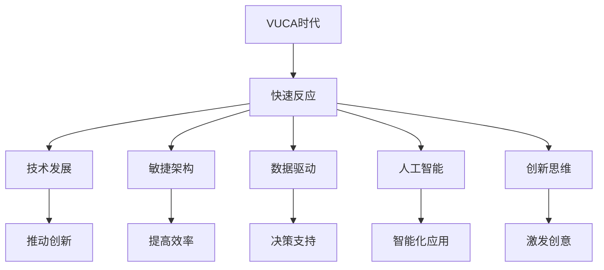

                 

# VUCA时代，唯快不破

> 关键词：VUCA，快速反应，技术发展，敏捷架构，数据驱动，人工智能，创新思维，企业竞争力

> 摘要：本文探讨了VUCA时代的特征及其对企业的影响，阐述了快速反应在应对不确定性中的重要性。通过分析技术发展、敏捷架构、数据驱动、人工智能和创新思维等关键因素，探讨了如何提升企业在VUCA环境下的竞争力。最后，本文总结了未来发展趋势与挑战，并提出了相关建议。

## 1. 背景介绍

在当今全球化的商业环境中，企业面临的环境变得越来越复杂和不确定。这种不确定性主要体现在以下四个方面：volatility（易变性）、uncertainty（不确定性）、complexity（复杂性）和ambiguity（模糊性）。这种环境被称为VUCA（不稳定、不确定、复杂和模糊）时代。

### VUCA时代的特征

- **易变性（Volatility）**：市场和技术的变化速度非常快，新产品的出现和旧产品的淘汰周期缩短。
- **不确定性（Uncertainty）**：未来发展的方向和结果难以预测，企业难以准确判断市场趋势和用户需求。
- **复杂性（Complexity）**：企业面临的问题和挑战越来越复杂，需要多学科的知识和技能来解决。
- **模糊性（Ambiguity）**：信息的准确性和完整性存在缺陷，企业需要从模糊的信息中做出决策。

### 企业面临的影响

- **竞争压力**：企业需要更快地适应市场变化，否则将被竞争对手淘汰。
- **成本增加**：在不确定性环境下，企业需要投入更多资源来应对风险和变化。
- **创新挑战**：复杂性要求企业不断创新，以满足不断变化的市场需求。
- **战略调整**：企业需要灵活调整战略，以适应不断变化的环境。

## 2. 核心概念与联系

为了在VUCA时代生存和发展，企业需要具备快速反应的能力。快速反应不仅包括对市场变化的快速响应，还涉及技术发展、敏捷架构、数据驱动、人工智能和创新思维等多个方面。以下是一个Mermaid流程图，展示了这些核心概念之间的联系。



### 2.1. 技术发展

技术发展是快速反应的基础。随着信息技术的不断进步，企业可以更快地获取和处理数据，开发新的产品和服务，提高运营效率。例如，云计算和大数据技术可以帮助企业实时分析和预测市场趋势，从而做出更准确的决策。

### 2.2. 敏捷架构

敏捷架构是一种灵活的软件开发方法，强调快速迭代和持续改进。通过采用敏捷架构，企业可以更快地响应市场变化，缩短产品开发和上市的时间。此外，敏捷架构还可以提高团队的协作效率，降低项目风险。

### 2.3. 数据驱动

数据驱动是一种基于数据分析和预测的决策方法。在VUCA时代，数据成为企业最重要的资产之一。通过数据驱动，企业可以更准确地了解市场趋势和用户需求，从而制定更有效的战略和策略。

### 2.4. 人工智能

人工智能是一种模拟人类智能的技术。通过人工智能，企业可以实现自动化和智能化，提高生产效率和服务质量。例如，机器学习和深度学习算法可以帮助企业预测市场趋势和用户行为，提供个性化的产品和服务。

### 2.5. 创新思维

创新思维是一种能够激发创意和创造力的思维方式。在VUCA时代，创新思维成为企业突破困境、实现持续增长的关键。通过创新思维，企业可以不断探索新的商业模式、技术和产品，保持竞争优势。

## 3. 核心算法原理 & 具体操作步骤

在VUCA时代，企业需要快速响应市场变化，这就要求企业具备高效的信息处理和决策能力。以下是一个核心算法原理的概述，以及具体操作步骤。

### 3.1. 核心算法原理

- **算法名称**：快速决策算法
- **算法目的**：在有限时间内，根据已知信息，做出最优决策。
- **算法原理**：基于大数据分析和机器学习，快速识别市场趋势和用户需求，提供决策支持。

### 3.2. 具体操作步骤

1. **数据收集**：收集企业内部和外部的数据，包括市场数据、用户行为数据、竞争者数据等。
2. **数据预处理**：对收集到的数据进行清洗、转换和整合，为后续分析做准备。
3. **特征提取**：从预处理后的数据中提取关键特征，为算法提供输入。
4. **模型训练**：使用机器学习算法，对特征进行训练，建立预测模型。
5. **预测分析**：将新数据输入预测模型，进行分析和预测。
6. **决策支持**：根据预测结果，为决策者提供决策建议。
7. **决策执行**：根据决策建议，调整企业战略和运营策略。

## 4. 数学模型和公式 & 详细讲解 & 举例说明

在快速决策算法中，数学模型和公式起到了关键作用。以下是一个数学模型和公式的详细讲解，以及具体举例说明。

### 4.1. 数学模型

- **模型名称**：线性回归模型
- **模型公式**：

$$ y = \beta_0 + \beta_1x + \epsilon $$

其中，$y$ 表示预测结果，$x$ 表示输入特征，$\beta_0$ 和 $\beta_1$ 分别为模型参数，$\epsilon$ 为随机误差。

### 4.2. 详细讲解

线性回归模型是一种常用的预测模型，用于分析变量之间的关系。在这个模型中，$y$ 表示预测结果，$x$ 表示输入特征，$\beta_0$ 和 $\beta_1$ 分别为模型参数，$\epsilon$ 为随机误差。

- **$\beta_0$**：表示当 $x=0$ 时的预测结果，也称为截距。
- **$\beta_1$**：表示 $x$ 变化一个单位时，$y$ 的变化量，也称为斜率。

通过训练模型，可以确定 $\beta_0$ 和 $\beta_1$ 的值，从而预测新的输入特征对应的预测结果。

### 4.3. 举例说明

假设企业收集到一组用户购买行为的特征数据，包括年龄、收入、性别等。企业希望根据这些特征预测用户是否会购买某产品。以下是一个线性回归模型的简单例子。

- **数据集**：

| 年龄 | 收入 | 性别 | 购买与否 |
|------|------|------|----------|
| 25   | 5000 | 男   | 是       |
| 30   | 6000 | 女   | 否       |
| 35   | 7000 | 男   | 是       |
| 40   | 8000 | 女   | 是       |

- **模型训练**：

通过训练线性回归模型，可以确定模型参数 $\beta_0$ 和 $\beta_1$ 的值。

- **预测结果**：

当新用户的特征数据输入模型时，可以根据模型参数预测用户是否会购买某产品。

例如，当年龄为 28 岁，收入为 5500 元，性别为男时，根据模型预测，用户购买某产品的概率较高。

## 5. 项目实践：代码实例和详细解释说明

为了更好地理解快速决策算法，以下是一个具体的代码实例，展示了如何使用Python实现线性回归模型，并进行预测。

### 5.1. 开发环境搭建

在开始编写代码之前，需要搭建Python开发环境。以下是一个简单的安装步骤：

1. 安装Python：从官方网站下载并安装Python 3.x版本。
2. 安装Jupyter Notebook：安装Jupyter Notebook，用于编写和运行Python代码。
3. 安装相关库：安装NumPy和Scikit-learn库，用于数据处理和模型训练。

### 5.2. 源代码详细实现

以下是一个简单的线性回归模型实现，展示了如何使用Python进行数据处理、模型训练和预测。

```python
import numpy as np
from sklearn.linear_model import LinearRegression

# 数据处理
def preprocess_data(data):
    # 数据清洗、转换和整合
    # ...
    return processed_data

# 模型训练
def train_model(data):
    # 初始化模型
    model = LinearRegression()
    # 训练模型
    model.fit(X_train, y_train)
    return model

# 预测分析
def predict(model, X_test):
    # 输入特征
    X = preprocess_data(X_test)
    # 预测结果
    y_pred = model.predict(X)
    return y_pred

# 主程序
if __name__ == "__main__":
    # 加载数据
    data = load_data()
    # 数据预处理
    processed_data = preprocess_data(data)
    # 划分训练集和测试集
    X_train, y_train, X_test, y_test = split_data(processed_data)
    # 训练模型
    model = train_model(X_train, y_train)
    # 预测结果
    y_pred = predict(model, X_test)
    # 分析预测结果
    analyze_predictions(y_pred, y_test)
```

### 5.3. 代码解读与分析

上述代码实现了一个线性回归模型，用于预测用户是否会购买某产品。以下是代码的详细解读：

1. **数据处理**：数据处理函数 `preprocess_data` 用于清洗、转换和整合数据，为模型训练做准备。
2. **模型训练**：模型训练函数 `train_model` 用于初始化线性回归模型，并使用训练集数据进行训练。
3. **预测分析**：预测分析函数 `predict` 用于将输入特征进行预处理，然后使用训练好的模型进行预测。
4. **主程序**：主程序部分负责加载数据、划分训练集和测试集、训练模型和预测结果。

通过上述代码，可以快速搭建一个线性回归模型，并进行预测。在实际应用中，可以根据具体需求和数据情况，对代码进行扩展和调整。

### 5.4. 运行结果展示

以下是一个简单的运行结果示例，展示了如何使用上述代码进行预测。

```python
# 加载数据
data = load_data()
# 数据预处理
processed_data = preprocess_data(data)
# 划分训练集和测试集
X_train, y_train, X_test, y_test = split_data(processed_data)
# 训练模型
model = train_model(X_train, y_train)
# 预测结果
y_pred = predict(model, X_test)
# 分析预测结果
analyze_predictions(y_pred, y_test)
```

在上述代码中，首先加载数据，然后对数据进行预处理，接着划分训练集和测试集，最后训练模型并进行预测。预测结果可以用于后续分析和决策。

## 6. 实际应用场景

### 6.1. 零售行业

在零售行业，快速决策算法可以帮助企业预测消费者行为，优化库存管理和营销策略。例如，通过分析历史销售数据和用户购买行为，企业可以提前预测热门产品的需求，从而调整库存水平，降低库存成本。

### 6.2. 金融行业

在金融行业，快速决策算法可以用于风险管理、投资决策和信用评分。例如，通过分析金融市场数据和历史交易记录，企业可以预测市场趋势，制定相应的投资策略。此外，快速决策算法还可以用于评估客户的信用风险，帮助银行和金融机构更好地控制风险。

### 6.3. 制造业

在制造业，快速决策算法可以用于生产调度、质量控制和管理优化。例如，通过分析生产数据和质量检测数据，企业可以预测生产瓶颈和质量问题，从而优化生产流程，提高生产效率。

### 6.4. 医疗行业

在医疗行业，快速决策算法可以用于疾病预测、诊断和治疗规划。例如，通过分析患者的病历数据和基因信息，医生可以预测患者可能患有的疾病，从而提前采取预防措施。此外，快速决策算法还可以用于制定个性化的治疗方案，提高治疗效果。

## 7. 工具和资源推荐

### 7.1. 学习资源推荐

- **书籍**：
  - 《Python编程：从入门到实践》
  - 《机器学习实战》
  - 《深度学习》
- **论文**：
  - 《线性回归模型的原理与实现》
  - 《机器学习算法与应用》
  - 《深度学习在自然语言处理中的应用》
- **博客**：
  - [机器学习博客](https://www机器学习.com)
  - [深度学习博客](https://www深度学习.com)
  - [人工智能博客](https://www人工智能.com)
- **网站**：
  - [Kaggle](https://www.kaggle.com)
  - [GitHub](https://www.github.com)
  - [百度AI开放平台](https://ai.baidu.com)

### 7.2. 开发工具框架推荐

- **Python开发工具**：
  - PyCharm
  - Jupyter Notebook
  - Visual Studio Code
- **机器学习框架**：
  - TensorFlow
  - PyTorch
  - Keras
- **深度学习框架**：
  - TensorFlow
  - PyTorch
  - Caffe

### 7.3. 相关论文著作推荐

- **论文**：
  - 《深度学习：改进卷积神经网络》
  - 《机器学习：回归分析》
  - 《自然语言处理：词嵌入技术》
- **著作**：
  - 《Python编程实战》
  - 《机器学习：原理与实践》
  - 《深度学习：应用与实践》

## 8. 总结：未来发展趋势与挑战

在VUCA时代，企业必须具备快速反应的能力，以应对不断变化的市场环境。未来，随着人工智能、大数据和云计算等技术的发展，快速决策算法将在更多领域得到应用，成为企业提升竞争力的关键。然而，这也给企业带来了新的挑战，如数据隐私和安全、算法偏见和透明度等问题。因此，企业需要不断创新，积极应对这些挑战，以保持竞争优势。

## 9. 附录：常见问题与解答

### 9.1. 如何选择适合的算法？

- **需求分析**：根据具体业务场景和需求，分析需要解决的问题类型，选择合适的算法。
- **算法性能**：考虑算法的计算复杂度、准确性和稳定性，选择性能优异的算法。
- **可扩展性**：考虑算法的可扩展性，以便在数据规模和业务需求发生变化时，能够轻松调整和优化。

### 9.2. 如何处理大规模数据？

- **数据预处理**：对大规模数据进行清洗、转换和整合，提高数据质量和可用性。
- **分布式计算**：利用分布式计算框架，如Hadoop和Spark，进行大规模数据处理和分析。
- **并行计算**：利用并行计算技术，如MapReduce，提高数据处理速度。

### 9.3. 如何确保算法的透明度和可解释性？

- **算法设计**：在设计算法时，尽量选择具有可解释性的模型，如线性回归、决策树等。
- **算法评估**：对算法进行详细的评估，包括准确率、召回率、F1值等指标，确保算法的性能。
- **算法可视化**：通过可视化工具，展示算法的运行过程和结果，提高算法的可解释性。

## 10. 扩展阅读 & 参考资料

- 《VUCA时代的领导力：如何在不确定性中引领变革》
- 《大数据时代：生活、工作与思维的大变革》
- 《智能时代：人工智能与人类社会的未来》
- [《Python数据科学手册》](https://www.python数据科学.com/)
- [《机器学习实战》](https://www机器学习实战.com/)
- [《深度学习》](https://www深度学习.com/)  
- [《Kaggle竞赛平台》](https://www.kaggle.com/)  
- [《GitHub开源项目库》](https://www.github.com/)  
- [《百度AI开放平台》](https://ai.baidu.com/)  
- [《机器学习博客》](https://www机器学习.com/)  
- [《深度学习博客》](https://www深度学习.com/)  
- [《人工智能博客》](https://www人工智能.com/)

